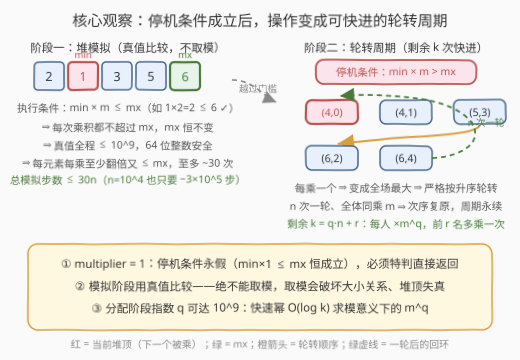
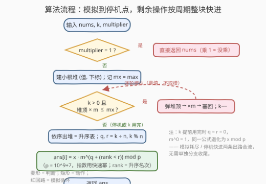
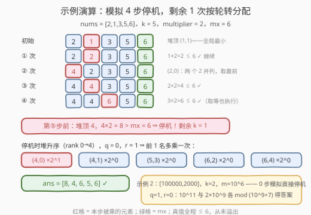

# K次乘运算后的最终数组状态II

- **题目名称**：K次乘运算后的最终数组状态II
- **链接**：[3266. K 次乘运算后的最终数组状态 II](https://leetcode.cn/problems/final-array-state-after-k-multiplication-operations-ii/)
- **难度**：困难
- **标签**：数组、堆（优先队列）、模拟、数学

## 1. 题目概述

给你一个整数数组 `nums`、一个整数 `k` 和一个整数 `multiplier`。

你需要对 `nums` 执行 `k` 次操作，每次操作中：

- 找到 `nums` 中的**最小**值 `x`，如果存在多个最小值，选择最**前面**的一个；
- 将 `x` 替换为 `x * multiplier`。

`k` 次操作以后，你需要将 `nums` 中每一个数值对 $10^9 + 7$ **取余**。

请你返回执行完 `k` 次乘运算以及取余运算之后，最终的 `nums` 数组。

**示例 1**：

```text
输入：nums = [2,1,3,5,6], k = 5, multiplier = 2
输出：[8,4,6,5,6]
解释：
操作         结果
1 次操作后   [2, 2, 3, 5, 6]
2 次操作后   [4, 2, 3, 5, 6]
3 次操作后   [4, 4, 3, 5, 6]
4 次操作后   [4, 4, 6, 5, 6]
5 次操作后   [8, 4, 6, 5, 6]
取余操作后   [8, 4, 6, 5, 6]
```

**示例 2**：

```text
输入：nums = [100000,2000], k = 2, multiplier = 1000000
输出：[999999307,999999993]
解释：
1 次操作后   [100000, 2000000000]
2 次操作后   [100000000000, 2000000000]
取余操作后   [999999307, 999999993]
```

**约束条件**：

- $1 \le \text{nums.length} \le 10^4$
- $1 \le \text{nums[i]} \le 10^9$
- $1 \le k \le 10^9$
- $1 \le \text{multiplier} \le 10^6$

> 💡 **审题关键**：① 操作语义与 [3264. K 次乘运算后的最终数组状态 I](https://leetcode.cn/problems/final-array-state-after-k-multiplication-operations-i/)（简单版）完全相同，只是把 $k$、值域都放大到 $10^9$；② **取余发生在全部 $k$ 次操作之后**——操作过程中比的是**真实大小**，这是「不能边乘边取模」的题源；③ `multiplier` 仍然可以等于 1——乘了等于没乘，但会让「停机条件」永远无法触发（见 2.2 观察 4）。

---

## 2. 解题思路

### 2.1 暴力思路：3264 的堆模拟为什么死了

简单版的做法是 `(值, 下标)` 二元组入小根堆，`k` 轮「弹顶 → 乘 → 塞回」，复杂度 $O(k \log n)$。放到本题的数据规模下，三条路全部堵死：

- **直接模拟**：$k \le 10^9$，堆操作总量 $\approx 1.4 \times 10^{10}$，必然超时；
- **边乘边取模压数值**：取模**破坏大小关系**——真值 $10^9 + 8$ 取模后变成 $1$，比 $3$ 还小，堆顶不再是真实最小，操作顺序全错；
- **Python 大整数全程真值**：最终值形如 $\text{nums[i]} \cdot m^{10^9}$，位数是**天文数字**，每轮乘法本身就是 $O(\text{位数})$，更不可行。

> 💡 三条路都指向同一个结论：必须发现操作序列的**周期结构**，把 $10^9$ 次操作「整块快进」，而不是一次一次做。

### 2.2 核心观察：停机条件 + 轮转周期



**观察 1（停机条件——周期的起点）**：设某时刻数组最小值为 $\min$、最大值为 $\max$。一旦

$$\min \times \text{multiplier} > \max$$

本轮把最小值乘成 $v = \min \cdot m > \max \ge$ 其余所有值，$v$ 成为**新的严格最大**；下一个被乘的必然是剩下的最小者，归纳可知此后操作**严格按 `(值, 下标)` 升序轮流**。$n$ 次操作后全体恰好各乘一次 $m$，相对次序完全复原——**周期 $= n$，永续循环**。

**观察 2（模拟阶段安全且有界）**：停机前执行乘法的前提是 $\min \cdot m \le \max$，于是**每次乘积都不超过 $\max$**——最大值全程不变，所有真值 $\le 10^9$，64 位整数安然无恙（连取模都不需要）。又因为 $m \ge 2$ 时每个元素每被乘一次至少**翻倍**、又始终 $\le \max$，所以每个元素至多被乘 $\lfloor \log_2 10^9 \rfloor \approx 30$ 次，**总模拟步数 $\le 30n \approx 3 \times 10^5$**——模拟到停机点是便宜的。

**观察 3（剩余操作整除分配）**：停机时剩余 $k$ 次，写成 $k = q \cdot n + r$：每个元素再乘 $m^q$，`(值, 下标)` 升序的**前 $r$ 名**多乘一次 $m$。指数 $q$ 高达 $10^9$，用**快速幂**在模 $10^9+7$ 意义下计算，每次也只要约 $30$ 次乘法。

**观察 4（multiplier = 1 必须特判）**：$\min \times 1 \le \max$ 恒成立，停机条件**永假**，模拟会傻跑满 $10^9$ 轮；而乘 $1$ 数组不变，开头直接返回即可。

**观察 5（真值定序、模值成答）**：模拟阶段用**真值**比较（$\le 10^9$ 不溢出），分配阶段才切换到**模值**输出——两套数并行，绝不混用。

> ⚠️ **两个高频坑**：① 模拟阶段**绝不能取模**——破坏大小关系，堆顶失真；② 排序分配时的并列必须按 `(值, 下标)` 字典序——值相等时下标小者先被乘，与堆的 tie-break 保持一致，否则前 $r$ 名的归属就错了。

### 2.3 算法流程图



| 步骤 | 操作 | 作用 |
|------|------|------|
| ① 特判 | `multiplier == 1` 直接返回 | 停机条件永假，防死循环跑满 $10^9$ 轮 |
| ② 建堆 | `(值, 下标)` 入小根堆，记 $mx = \max(\text{nums})$ | $O(n)$ 初始化；$mx$ 模拟阶段恒不变 |
| ③ 模拟 | `k > 0` 且 `堆顶 × m ≤ mx` 时循环：弹顶 → ×m → 塞回 | 真值运算；总步数 $\le 30n$ |
| ④ 快进 | 依序出堆得升序表；$q, r = k \div n, k \bmod n$ | 出堆顺序 = 剩余操作的轮转顺序 |
| ⑤ 分配 | 第 $\text{rank}$ 名乘 $m^{q + [\text{rank} < r]} \bmod p$ | 快速幂；$k$ 用完时 $q=r=0$，公式退化为 $x \bmod p$ |

> 💡 第 ⑤ 步把「模拟耗尽」与「停机快进」两条出路**合流**成一个公式：$k$ 提前用完时 $q = r = 0$、$m^0 = 1$，同一行代码自然退化为「真值取模返回」，无需单独分支收尾。

### 2.4 示例演算



以示例 1（`nums = [2,1,3,5,6]`，`k = 5`，`multiplier = 2`，$mx = 6$）为例：

- **模拟阶段**（条件 `堆顶 × 2 ≤ 6`）恰好执行 4 步：`1→2`、`2→4`、`2→4`、`3→6`。注意第 ④ 步是**取等**（$3 \times 2 = 6 \le 6$）照样执行——条件是 $\le$ 不是 $<$；
- 第 ⑤ 步操作前，堆顶为 $4$，$4 \times 2 = 8 > 6 = mx$，触发**停机**，剩余 $k = 1$；
- **分配阶段**：堆升序为 `(4,0), (4,1), (5,3), (6,2), (6,4)`，$q = 0$、$r = 1$——只有 `rank 0` 即 `(4,0)` 额外乘一次，得 $4 \times 2 = 8$；
- 最终 `ans = [8, 4, 6, 5, 6]`，与逐步模拟的结果完全一致。

示例 2 则是「零步模拟」的极端：$2000 \times 10^6 > 100000 = mx$ 一开始就停机，$q = 1, r = 0$，两元素各乘一次 $10^6$ 后取模：$10^{11} \bmod (10^9+7) = 999999307$，$2 \times 10^9 \bmod (10^9+7) = 999999993$。

---

## 3. 参考代码

### C++（堆模拟 + 周期快进 + 快速幂）

```cpp
class Solution {
    static constexpr long long MOD = 1'000'000'007LL;

    // 快速幂：b^e mod MOD，e 可达 1e9
    static long long qpow(long long b, long long e) {
        long long r = 1;
        b %= MOD;
        for (; e > 0; e >>= 1, b = b * b % MOD)
            if (e & 1) r = r * b % MOD;
        return r;
    }

public:
    vector<int> getFinalState(vector<int>& nums, int k, int multiplier) {
        if (multiplier == 1) return nums;                    // ① 乘 1 = 没乘，且防死循环
        int n = nums.size();
        using P = pair<long long, int>;                      // (真值, 下标)
        priority_queue<P, vector<P>, greater<P>> pq;         //    小根堆，字典序破平
        long long mx = *max_element(nums.begin(), nums.end());
        for (int i = 0; i < n; ++i) pq.emplace(nums[i], i);
        while (k > 0 && pq.top().first * multiplier <= mx) { // ② 停机条件：堆顶×m > mx
            auto [x, i] = pq.top(); pq.pop();                //    真值比较，不取模！
            x *= multiplier;                                 //    乘积 ≤ mx ≤ 1e9，安全
            pq.emplace(x, i);
            --k;
        }
        vector<P> order;                                     // ③ 依序出堆 = (值,下标) 升序
        while (!pq.empty()) { order.push_back(pq.top()); pq.pop(); }
        long long q = k / n, r = k % n;                      //    剩余 k = q·n + r
        vector<int> ans(n);
        for (int rank = 0; rank < n; ++rank) {               // ④ 前 r 名多乘一次
            auto [x, i] = order[rank];                       //    k 用完时 q=r=0，退化 x%MOD
            ans[i] = (int)(x % MOD * qpow(multiplier, q + (rank < r)) % MOD);
        }
        return ans;
    }
};
```

### Python（heapq + 内置三参 pow）

```python
from heapq import heapify, heappop, heappush
from typing import List

class Solution:
    def getFinalState(self, nums: List[int], k: int, multiplier: int) -> List[int]:
        MOD = 10**9 + 7
        if multiplier == 1:                               # ① 乘 1 = 没乘，且防死循环
            return nums
        n = len(nums)
        heap = [(x, i) for i, x in enumerate(nums)]       # (真值, 下标) 小根堆
        heapify(heap)
        mx = max(nums)                                    #    模拟阶段 max 恒不变
        while k and heap[0][0] * multiplier <= mx:        # ② 停机条件：堆顶×m > mx
            x, i = heappop(heap)                          #    真值比较，不取模！
            heappush(heap, (x * multiplier, i))
            k -= 1
        q, r = divmod(k, n)                               # ③ 剩余 k = q·n + r
        ans = [0] * n
        for rank, (x, i) in enumerate(sorted(heap)):      #    升序 = 后续轮转顺序
            ans[i] = x * pow(multiplier, q + (rank < r), MOD) % MOD
        return ans                                        #    k 用完时 q=r=0，退化 x%MOD
```

> 💡 Python 的三参 `pow(b, e, mod)` 自带模快速幂；`q + (rank < r)` 里布尔值当 0/1 用，前 $r$ 名的「多乘一次」就藏在这个 `+1` 里。

---

## 4. 复杂度分析

| 维度 | 复杂度 | 说明 |
|------|--------|------|
| **时间** | $O(n \log V \cdot \log n + n \log k)$ | 建堆 $O(n)$；模拟阶段 $\le n \lfloor \log_2 V \rfloor \approx 30n$ 次堆操作（$V = \max(\text{nums}) \le 10^9$），每次 $O(\log n)$；分配阶段 $n$ 次快速幂各 $O(\log k)$。$n = 10^4$ 时约 $4 \times 10^6$ 量级 |
| **空间** | $O(n)$ | 堆与升序表常驻 $n$ 个二元组 |
| **对照：直接堆模拟** | $O(k \log n)$ | $k \le 10^9$ 时约 $1.4 \times 10^{10}$，不可行——周期快进把 $k$ 从乘数变成了**指数里的加项** |

> 💡 关键量级：模拟步数与 $k$ **无关**——它由「每个元素爬到 $\max$ 至多翻倍 $\sim 30$ 次」决定；$k$ 只出现在快速幂的指数里，被 $O(\log k)$ 消化。

---

## 5. 扩展：「找周期，快进模拟」是一类通用范式

本题的「停机条件 + 整周期快进」不是孤例，而是一整类问题的公共套路：

- [202. 快乐数](../0201-0300/202_快乐数.md)：值域有限 ⇒ 序列必入环，靠 Floyd 龟兔赛跑**检测**环再快进；
- [466. 统计重复个数](../0401-0500/466_统计重复个数.md)：在状态机上**找循环节**，整周期一次跳过、零头逐段模拟；
- 本题的特殊之处在于周期结构可以被**数学先验**：不需要走到第 $n+1$ 步去「发现」周期，停机条件 $\min \cdot m > \max$ 一步锁定周期起点——把「检测」省成了「证明」，这也是它能做成 $O(1)$ 额外检测的原因。

反面对照：[3066. 超过阈值的最少操作数 II](../3001-3100/3066_超过阈值的最少操作数II.md) 同为「小根堆逐轮取最小」，但每次操作 $\min \times 2 + \max$ 让数组**规模递减**、无周期可循，只能老老实实逐轮模拟（好在它只要数次数、数组一轮少一个）。**有没有周期可利用，是堆模拟题的分水岭**——写模拟前先问一句：操作序列会不会进入稳态？

---

## 6. 面试要点

1. **为什么不能边乘边取模？**

   题目要求「全部操作结束后」才取余，操作过程中比较的是真实大小。取模破坏大小关系：真值 $10^9 + 8$ 取模后是 $1$，堆顶失真、操作顺序全错。正确姿势是**真值定序、模值成答**两套数并行——好在停机前真值 $\le \max \le 10^9$，64 位整数天然安全。

2. **停机条件为什么是 $\min \times m > \max$？之后为什么严格轮转？**

   条件成立时，本轮把最小值乘成超过全场的新最大；下一个最小者在剩余元素中，其乘积同样超过全场——归纳可知操作严格按 `(值, 下标)` 升序轮流。$n$ 次后全体各乘一次 $m$，相对次序复原，周期永续。取等（$\min \cdot m = \max$）时乘积仍是并列最大，不破坏后续排序，所以条件用 $\le$ 继续模拟是对的。

3. **模拟阶段到底要跑多少步？为什么与 $k$ 无关？**

   每次乘法的前提是乘积 $\le \max$，且 $m \ge 2$ 时每乘一次至少翻倍——每个元素从初值爬到 $\le 10^9$ 至多翻倍约 $30$ 次，总步数 $\le 30n \approx 3 \times 10^5$。$k$ 再大也只影响停机后的指数 $q$，被快速幂 $O(\log k)$ 消化。

4. **`multiplier = 1` 为什么要特判？**

   $\min \times 1 \le \max$ 恒成立，停机条件永假，主循环会跑满 $10^9$ 轮直接超时。而乘 $1$ 数组不变，开头返回即可。这是「边界值杀死停机条件」的典型例子，面试中主动报出这一条是加分项。

5. **剩余 $k$ 次怎么分配？并列最小值归谁？**

   $k = q \cdot n + r$：每人乘 $m^q$，升序前 $r$ 名多乘一次。并列必须按 `(值, 下标)` 字典序破平——与堆的 tie-break 一致，值相等时下标小者先被乘，前 $r$ 名的归属才与逐轮模拟完全等价（3264 简单版里「并列取最前」的规则在这里延续生效）。

---

## 7. 同类练习题

- [3264. K 次乘运算后的最终数组状态 I](https://leetcode.cn/problems/final-array-state-after-k-multiplication-operations-i/)（[题解](../3201-3300/3264_K次乘运算后的最终数组状态I.md)）：本题缩水版（$k \le 10$），小根堆逐轮模拟即可——先写它再升级到周期快进，是完整的面试叙事
- [50. Pow(x, n)](https://leetcode.cn/problems/powx-n/)（[题解](../0001-0100/50_Powx_n.md)）：快速幂母题——本题把 $10^9$ 轮操作压缩成 $m^{q}$ 的指数
- [202. 快乐数](https://leetcode.cn/problems/happy-number/)（[题解](../0201-0300/202_快乐数.md)）：Floyd 判圈快进——「找周期跳过重复劳动」在隐式链表上的形态
- [466. 统计重复个数](https://leetcode.cn/problems/count-the-repetitions/)（[题解](../0401-0500/466_统计重复个数.md)）：状态机找循环节、整周期一次跳过——周期快进的困难版通用模板
- [3066. 超过阈值的最少操作数 II](https://leetcode.cn/problems/minimum-operations-to-exceed-threshold-value-ii/)（[题解](../3001-3100/3066_超过阈值的最少操作数II.md)）：同为小根堆逐轮取最小的近亲，但无周期可循只能逐轮模拟——正反对照体会有无稳态的差别
