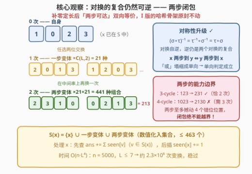
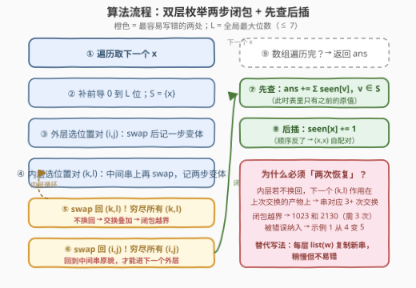
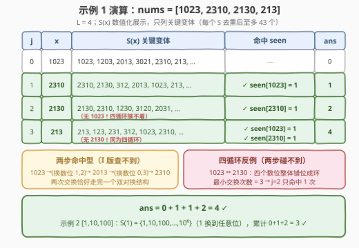

# 统计近似相等数对 II

- **题目名称**：统计近似相等数对 II
- **链接**：[3267. 统计近似相等数对 II](https://leetcode.cn/problems/count-almost-equal-pairs-ii/)
- **难度**：困难
- **标签**：数组、哈希表、计数、枚举、排序

## 1. 题目概述

给你一个**正整数**数组 $nums$。如果执行以下操作**至多两次**可以让两个整数 $x$ 和 $y$ 相等，则称这个数对是**近似相等**的：

- 选择 $x$ **或者** $y$ 之一，将这个数字中的**两个数位交换**。

请你返回 $nums$ 中，下标 $i < j$ 且 $nums[i]$ 和 $nums[j]$ **近似相等**的数对数目。注意，执行操作后一个整数可以有**前导 0**。

**示例 1**：

```text
输入：nums = [1023,2310,2130,213]
输出：4
解释：近似相等数对包括：
     1023 和 2310 —— 交换 1023 中数位 1 和 2，再交换数位 0 和 3，得到 2310。
     1023 和 213  —— 交换 1023 中数位 1 和 0，再交换数位 1 和 2，得到 0213，即 213。
     2310 和 213  —— 交换 2310 中数位 2 和 0，再交换数位 3 和 2，得到 0213，即 213。
     2310 和 2130 —— 交换 2310 中数位 3 和 1，得到 2130。
```

**示例 2**：

```text
输入：nums = [1,10,100]
输出：3
解释：每对都近似相等：
     1 和 10  —— 交换 10 中数位 1 和 0，得到 01，即 1。
     1 和 100 —— 交换 100 中数位 1 和第二个 0，得到 001，即 1。
     10 和 100 —— 交换 100 中数位 1 和第一个 0，得到 010，即 10。
```

**约束条件**：

- $2 \le nums.length \le 5000$
- $1 \le nums[i] < 10^7$

> 💡 读题关键：本题是 [3265. 统计近似相等数对 I](https://leetcode.cn/problems/count-almost-equal-pairs-i/)（[站内题解](3265_统计近似相等数对I.md)）的加强版，变化只有两处，每一处都正好卡在解法的要害上：① 操作从「至多一次」放宽到「**至多两次**」——恰好跨过了**三循环**（3-cycle）的门槛：$123$ 与 $231$ 在 I 版不可达（需两次交换）、在 II 版恰好可达，但**四循环**（如 $1023 \to 2130$，需三次交换）依然不可达，「两步」的能力边界必须想清楚；② $n$ 从 $100$ 放大到 $5000$——两两判定约 $1.25 \times 10^7$ 对，暴力思路被彻底判死，I 版的哈希计数骨架从「更优」变成「必选」。值域 $< 10^7$ 意味着**至多 7 位**，这是后面所有复杂度估计的基石。

---

## 2. 解题思路

### 2.1 暴力思路：为什么 II 版直接判死

暴力即逐对判定：$i < j$ 时检查 $nums[i]$ 与 $nums[j]$ 是否近似相等。$n = 5000$ 共 $\binom{5000}{2} \approx 1.25 \times 10^7$ 对，而每一对的判定成本并不便宜：

- **朴素判定**：枚举 $x$ 的所有两步交换结果（$\le 463$ 个，见 2.2），看 $y$ 是否在其中（再对称查一遍）——每对 $O(L^4)$，总计 $10^{10}$ 量级，完全不可行；
- **精巧判定**：用置换环理论 $O(L)$ 判「最小交换次数 $\le 2$」（见第 5 节），总计也有 $1.25 \times 10^7 \times 7 \approx 8.7 \times 10^7$ 次基本操作——C++ 勉强能过，Python 基本无望，而且把判定写对本身就比正解更难。

根本矛盾在于：**「数对」是 $O(n^2)$ 个，但「每个数的变换能力」只有 $O(n)$ 份**。同一个数 $x$ 会参与 $n-1$ 对判定，却每次都重新展开它的交换结果——这就是暴力浪费的来源，也正是哈希计数的切入点。

### 2.2 核心观察：对换的复合仍然可逆——两步闭包 + 哈希计数



I 版的整套骨架可以**原封不动**搬过来，只需把「变体集合」加深一层：

**第一件套：补零定长**。取 $L$ 为全数组最大位数（$\le 7$），每个数左补前导 0 到 $L$ 位再做交换。这样 $30$ 与 $3$ 这类位数不同的对也能在等长串上比较，且**交换永远不改变串长**。

**第二件套：单向判定**。「$x$ 变 $y$ 或 $y$ 变 $x$」这个双向条件，在补零定长后可以塌缩成单向。I 版用的性质是「单个对换自逆」；II 版需要再进一步——**两个对换的复合仍然可逆**。设 $\sigma, \tau$ 是两次对换（各自交换某两个位置），由对换自逆（$\sigma^{-1} = \sigma$）得：

$$
(\sigma \circ \tau)^{-1} = \tau^{-1} \circ \sigma^{-1} = \tau \circ \sigma
$$

**逆仍是两个对换的复合**。所以「$x$ 两步到 $y$」$\iff$ 「$y$ 两步到 $x$」，对称性完整保持——于是处理每个数时只需查一个方向。

**第三件套：先查后插**。从左到右扫，哈希表 $seen$ 只存**之前原值**的出现次数；处理 $x$ 时先生成它的**两步闭包**

$$
S(x) = \{x\} \cup \{\text{一步变体}\} \cup \{\text{两步变体}\}
$$

再 $ans \mathrel{+}= \sum_{v \in S(x)} seen[v]$，最后 $seen[x] \mathrel{+}= 1$。命中 $v$ 意味着之前的某个原值 $y = v$ 落在 $S(x)$ 里，即 $y$ 与 $x$ 近似相等——与两数之和同款模板。

**两步闭包怎么枚举**：外层枚举位置对 $(i, j)$ 做第一次交换并记录一步变体；**在交换后的中间串上**，内层再枚举位置对 $(k, l)$ 做第二次交换并记录两步变体。两层循环各自结束后都要**把交换换回来**。去掉重复后闭包大小至多

$$
1 + \binom{L}{2} + \binom{L}{2}^2 = 1 + 21 + 441 = 463
$$

**为什么「两次恢复」是 II 版最大的坑**：I 版只有一层循环，换回一次即可；II 版若内层 $(k,l)$ 枚举完不换回，第二次交换会**叠加**在上一次的产物上，得到的串对应三次、四次交换的结果——闭包越界，像 $1023$ 与 $2130$ 这种需要三次交换的四循环也会被错误地纳入，示例 1 就会从 $4$ 算成 $5$。

**为什么去重比 I 版更重要**：两步闭包的重复来源从一类涨到三类——交换两个相同数位是空操作；$(i,j)$ 再 $(k,l)$ 与 $(k,l)$ 再 $(i,j)$ 顺序颠倒结果相同；两步可以退化为一步甚至零步（第二次换回第一次的位置）。若用「列表 + 计数」而非集合，同一个数对会被重复统计。

### 2.3 算法流程图



骨架五步：补零定长 → 外层枚举 $(i,j)$ → 内层枚举 $(k,l)$（两层都要换回）→ **先查** $\sum seen[v]$ → **后插** $seen[x]$。图中橙色标出的两处是最容易写错的点：内层不换回会闭包越界（假阳性），先插后查会把 $(x,x)$ 自己配给自己。

### 2.4 示例演算



以 $nums = [1023, 2310, 2130, 213]$ 走一遍（$L = 4$，闭包以 4 位补零串生成、数值化展示）：

| $j$ | $x$ | $S(x)$ 关键变体 | 命中 $seen$ | $ans$ |
|-----|------|-----------------|-------------|-------|
| 0 | 1023 | $1023,\ 1203,\ 2013,\ 3021,\ 2310,\ 213,\ \dots$ | — | 0 |
| 1 | 2310 | $2310,\ 2130,\ 312,\ 2013,\ 1023,\ 213,\ \dots$ | $\checkmark\ seen[1023] = 1$ | 1 |
| 2 | 2130 | $2130,\ 2310,\ 1230,\ 3120,\ 2031,\ \dots$（**无** $1023$） | $\checkmark\ seen[2310] = 1$ | 2 |
| 3 | 213 | $213,\ 123,\ 231,\ 312,\ 1023,\ 2310,\ \dots$（**无** $2130$） | $\checkmark\ seen[1023] = 1$<br>$\checkmark\ seen[2310] = 1$ | 4 |

三处细节各自对应一类典型：

- $j=1$ 命中：$1023 \to 2013 \to 2310$ 是**两步**路径（交换数位 $1,2$ 再交换 $0,3$），I 版查不到、II 版能查到；
- $j=2$ 只命中一次：$1023$ 与 $2130$ 互为**四循环**（最小交换次数 $=3$），两步闭包**碰不到**，这正是「闭包不越界」的直接体现；
- $j=3$ 命中两次而不命中 $2130$：$213$ 的补零串 "0213" 到 "1023" 和 "2310" 都是三循环（两次交换恰好够），到 "2130" 却是四循环。

输出 $4$ 与示例一致 ✓。示例 2 的 $[1,10,100]$：$S(1) = \{1, 10, 100, \dots, 10^6\}$（$1$ 换到任意一位），累计 $0 + 1 + 2 = 3$ ✓。

---

## 3. 参考代码

### C++

```cpp
class Solution {
  public:
    int countPairs(vector<int>& nums) {
        int L = to_string(*max_element(nums.begin(), nums.end())).size();
        vector<pair<int, int>> pairs;                    // 所有位置对 (i, j)
        for (int i = 0; i < L; ++i)
            for (int j = i + 1; j < L; ++j)
                pairs.emplace_back(i, j);
        unordered_map<int, int> seen;                    // 之前原值 → 出现次数
        int ans = 0;
        for (int x : nums) {
            string s = to_string(x);
            s = string(L - s.size(), '0') + s;           // 补前导 0 到 L 位
            unordered_set<int> S{x};                     // 零次操作：自身
            for (auto [i, j] : pairs) {
                swap(s[i], s[j]);                        // 第一次交换
                S.insert(stoi(s));                       // 一步变体
                for (auto [k, l] : pairs) {
                    swap(s[k], s[l]);                    // 第二次交换（在中间串上）
                    S.insert(stoi(s));                   // 两步变体
                    swap(s[k], s[l]);                    // 换回来（关键！）
                }
                swap(s[i], s[j]);                        // 换回来（关键！）
            }
            for (int v : S)
                if (auto it = seen.find(v); it != seen.end())
                    ans += it->second;                   // 先查
            ++seen[x];                                   // 后插
        }
        return ans;
    }
};
```

### Python

```python
from itertools import combinations

class Solution:
    def countPairs(self, nums: List[int]) -> int:
        L = len(str(max(nums)))
        pairs = list(combinations(range(L), 2))
        seen = Counter()                              # 之前原值 → 出现次数
        ans = 0
        for x in nums:
            a = list(str(x).zfill(L))                 # 补前导 0 到 L 位
            S = {x}                                   # 零次操作：自身
            for i, j in pairs:
                a[i], a[j] = a[j], a[i]               # 第一次交换
                S.add(int(''.join(a)))                # 一步变体
                for k, l in pairs:
                    a[k], a[l] = a[l], a[k]           # 第二次交换（在中间串上）
                    S.add(int(''.join(a)))            # 两步变体
                    a[k], a[l] = a[l], a[k]           # 换回来（关键！）
                a[i], a[j] = a[j], a[i]               # 换回来（关键！）
            ans += sum(seen[v] for v in S)            # 先查
            seen[x] += 1                              # 后插
        return ans
```

> 💡 实现细节：① 内层 $(k,l)$ 枚举的是**中间串**上的第二次交换，必须基于第一次交换后的 `a` 进行——这就是「两步复合」的代码形态；② 两层循环体末尾各有一次恢复，少写任何一次都会让后续枚举叠加成多次交换的产物；③ $L$ 取**全局最大位数**而非固定 $7$：输入都是短数时闭包按 $\binom{L}{2}^2$ 迅速缩小（如全 4 位数时 $L=4$，闭包 $\le 1+6+36=43$ 个）；④ 变体统一 `int` 数值化入集合、`seen` 的键也是原值——两侧键空间天然一致，"0213" 与 213 不会错位；⑤ 值上界 $10^7 - 1$，32 位整数足够。

---

## 4. 复杂度分析

| 维度 | 复杂度 | 说明 |
|------|--------|------|
| 时间复杂度 | $O(n \cdot L^4)$ | 每个数生成 $\le 1 + \binom{L}{2} + \binom{L}{2}^2 = 463$ 个变体并查哈希；$n = 5000,\ L = 7$ → 约 $2.3 \times 10^6$ 次变换，Python 实测约 1 秒 |
| 空间复杂度 | $O(n)$ | $seen$ 哈希表；单个闭包集合 $O(L^4)$ 为临时空间 |
| 暴力对照 | $O(n^2 \cdot L^4)$ | $1.25 \times 10^7$ 对 × 463 次变换 ≈ $6 \times 10^9$，彻底不可行 |
| 暴力（环判定） | $O(n^2 \cdot L)$ | 置换环 $O(L)$ 判定（见第 5 节）≈ $8.7 \times 10^7$ 次操作，C++ 可过、Python 危险 |
| 记忆化优化 | 均摊更低 | 值有重复时按「值 → 闭包」缓存；极端全同数组从 $2.3 \times 10^6$ 次变换降为一次 |

实测：官方两组示例输出 $4$、$3$；与「自然位数 + 双向 OR」独立暴力对拍随机数据（$n \le 8$）3000 组全部一致；与置换环最小交换次数判定对拍（无重复数位）1500 组全部一致；定向用例 $[123, 231] \to 1$（三循环恰需两次）、$[1023, 2130] \to 0$（四循环需三次）、$[1, 10, 100, 1000] \to 6$、$[3, 30] \to 1$ 均正确。

---

## 5. 扩展：置换环视角——两步到底能走多远

把「$x$ 变成 $y$」看作置换问题：补零对齐后设 $s \to t$ 的位置置换为 $\pi$（以**无重复数位**为例，$\pi$ 唯一），经典结论是**最小对换次数**：

$$
\text{minSwaps} = L - c(\pi)
$$

其中 $c(\pi)$ 是 $\pi$ 的循环个数（**含不动点**）。于是「近似相等」$\iff L - c(\pi) \le 2$，错位结构只有四种形态：

| 形态 | 环结构 | 最小交换 | 例子 |
|------|--------|----------|------|
| 完全相同 | 全不动点 | 0 | $123 \to 123$ |
| 一对错位 | 一个 2-cycle | 1 | $1023 \to 2013$ |
| 三循环 | 一个 3-cycle | 2 | $123 \to 231$、$0213 \to 1023$ |
| 两对错位 | 两个不相交 2-cycle | 2 | $1023 \to 2310$（数位 $1,2$ 与 $0,3$ 各换一次） |

四循环及更长（$L - c(\pi) \ge 3$）都**碰不到**——$1023 \to 2130$ 正是四循环。这个视角还给出两步闭包大小的**精确上界**（按结构直接计数，天然无重复）：

$$
\underbrace{1}_{\text{恒等}} + \underbrace{\binom{L}{2}}_{\text{单对换}} + \underbrace{2\binom{L}{3}}_{\text{3-cycle}} + \underbrace{\tfrac{1}{2}\binom{L}{2}\binom{L-2}{2}}_{\text{双对换}} = 1 + 21 + 70 + 105 = 197
$$

比朴素枚举的 463 少一半还多——若卡常可按此结构化枚举，但代码复杂度翻倍，本题完全没必要。另外两个衍生玩法：

- **$O(L)$ 判定器**：比较 $s, t$ 的字符多重集（不同直接否）→ 构造 $\pi$ → 数环 → $L - c(\pi) \le 2$。可作 C++ 暴力兜底或对拍器（重复数位时置换不唯一，需贪心让相同字符尽量留原地，此时公式仍近似成立，严格证明略）；
- **为什么不能按「排序后的数位串」做键**（字母异位词分组的思路）：多重集相同只是**必要条件**（$0$ 与各数位的个数必须一致），排列距离才是本质——$1023$ 与 $2130$ 多重集相同却差一个四循环。所以本题的哈希键不是「规范形」，而是「闭包集合」，查询方向也从「查一个键」变成「枚举集合求和」。

---

## 6. 面试要点

1. **「x 变 y 或 y 变 x」为什么依然只需查一个方向？**

   - 两次操作的可逆性：对换自逆（$\sigma^{-1} = \sigma$），故复合的逆 $(\sigma \circ \tau)^{-1} = \tau \circ \sigma$ 仍是两个对换的复合——「两步可达」双向等价。配合补零定长消除位数差异后，「或」塌缩成 $y \in S(x)$，先查后插的模板才成立。若对称性破坏，每个数就得同时进「可达集」和「可达我集」两张表，复杂度和代码都翻倍。

2. **内层循环不换回会发生什么？能不能只换回一次？**

   - 内层 $(k,l)$ 枚举的是中间串上的第二次交换。若做完不换回，下一次 $(k', l')$ 会作用在**上次交换的产物**上，串对应的交换次数越垒越多，闭包越过「两步」边界——$1023$ 与 $2130$（四循环，需三次）会被错误纳入，示例 1 从 4 变 5。两层各换回一次，才能保证每次内层都从「同一步中间串」出发。另一种等价写法是每次 `list(w)` 复制新串，开销略高但不易错。

3. **两步闭包为什么必须用集合去重？**

   - 重复有三类：交换两个相同数位（空操作）、$(i,j)(k,l)$ 与 $(k,l)(i,j)$ 顺序颠倒同果、两步退化为一步或零步（第二次换回第一次的位置）。不去重的话，比如 $x = 1112$ 这类近全同数位，同一变体会以几十条路径出现几十次，查询时同一数对被重复计数。集合去重后「每个数对至多计一次」与「零次操作算近似相等」统一收口。

4. **为什么不能用字母异位词分组那套「多重集做键」？**

   - 多重集相同只保证「能重排成」，不保证「两次交换内重排成」。$1023$ 与 $2130$ 数字组成完全相同，但错位构成四循环，最小交换次数为 3。本质原因是两次对换至多撼动 4 个位置（或以 3-cycle 的形式转 3 个位置），而任意重排可能需要多达 $L-1$ 次。所以本题的哈希用法是「闭包枚举 + 查询原值」，键空间是可达值集合而非规范形。

5. **I 版到 II 版，代码和复杂度各变了多少？**

   - 代码只多一层循环加一次换回，骨架（补零、数值化、先查后插）一行不改；复杂度从 $O(n \cdot L^2)$ 涨到 $O(n \cdot L^4)$，$n$ 上限同步从 100 放大到 5000——两版合起来正展示了一个模板的「可扩展性」：换的只是闭包深度，计数框架不动。面试中先报 I 版思路再现场升级到 II 版，是展示模板抽象能力的加分项。

---

## 7. 同类练习题

- [3265. 统计近似相等数对 I](https://leetcode.cn/problems/count-almost-equal-pairs-i/)（[站内题解](3265_统计近似相等数对I.md)）：本题的一次操作版——闭包只到一步、$n \le 100$ 允许暴力，是理解「补零 + 单向判定 + 先查后插」三件套的最佳入口
- [765. 情侣牵手](https://leetcode.cn/problems/couples-holding-hands/)（[站内题解](../0701-0800/765_情侣牵手.md)）：置换环理论的最经典应用——最小交换次数 $= n - \text{环数}$，正是第 5 节判定公式的出处
- [2471. 逐层排序二叉树所需的最少操作数](https://leetcode.cn/problems/minimum-number-of-operations-to-sort-a-binary-tree-by-level/)（[站内题解](../2401-2500/2471_逐层排序二叉树的最少操作数.md)）：每一层独立做「最小交换次数 = 元素数 − 环数」的计数，与本题第 5 节的判定器同款工具
- [49. 字母异位词分组](https://leetcode.cn/problems/group-anagrams/)（[站内题解](../0001-0100/49_字母异位词分组.md)）：对照组——「多重集做规范键」的代表作，恰好凸显本题为什么不能这么做（多重集相同 ≠ 两步可达）
- [1. 两数之和](https://leetcode.cn/problems/two-sum/)（[站内题解](../0001-0100/1_两数之和.md)）：「先查后插」单遍哈希模板的鼻祖，本题只是把查询键从单个 `target` 扩成了一个 463 元素的闭包集合
