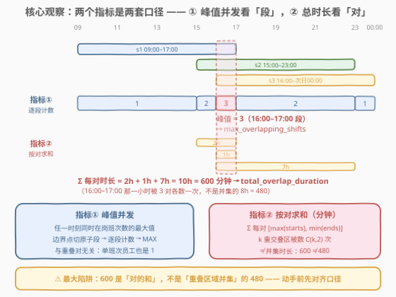
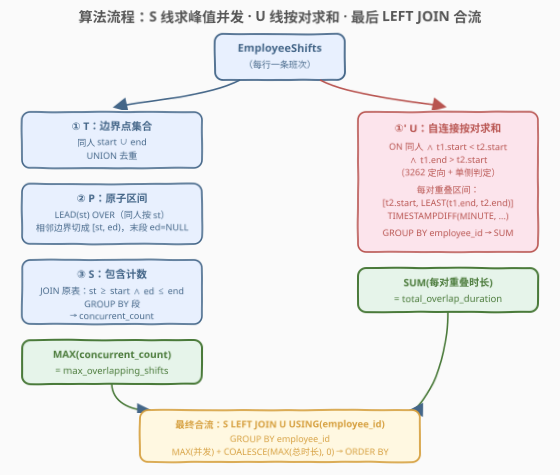
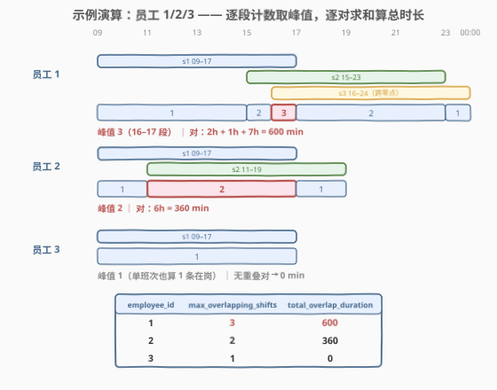

# LeetCode 查找重叠的班次 II 题解

## 1. 题目概述

- **标题 / 题号**：查找重叠的班次 II（#3268，hard）
- **链接**：https://leetcode.cn/problems/find-overlapping-shifts-ii/
- **难度**：困难
- **标签**：数据库、SQL、扫描线、区间重叠、窗口函数、LEAD、自连接、TIMESTAMPDIFF、LeetCode 锁题

> ⚠️ 本题为 LeetCode 付费题（锁题），题意描述根据官方示例用例与外部资料重建，可能与官方题面有出入。（题面已与社区镜像 doocs/leetcode 的官方中文翻译交叉核对，示例输入输出与 GraphQL 接口返回一致，出入风险较低。）

**表结构**：`EmployeeShifts`

| 列名 | 类型 |
|------|------|
| employee_id | int |
| start_time | datetime |
| end_time | datetime |

- `(employee_id, start_time)` 是这张表的主键。
- 这张表包含员工的排班工作，包括特定日期的开始和结束时间。

**目标**：编写一个解决方案，为**每个员工**计算两个指标（对比 [3262](https://leetcode.cn/problems/find-overlapping-shifts/) 只数重叠对数）：

1. `max_overlapping_shifts`：**任何给定时刻**同时重叠（在岗）的班次数的**最大值**——峰值并发；
2. `total_overlap_duration`：**所有重叠班次对**的重叠时长**总和**，以**分钟**为单位——按「对」求和。

两个排班重叠的条件（承接 3262）：**同一天**（同一排班日）内，一个排班的 `end_time` 比另一个排班的 `start_time` **更晚**（严格大于）。

返回 `employee_id`、`max_overlapping_shifts`、`total_overlap_duration` 三列，按 `employee_id` **升序**排序；**每个员工都出现在结果中**（即使没有任何重叠）。

**示例 1**（GraphQL 接口仅返回此一例）：

```text
输入：EmployeeShifts 表
+-------------+---------------------+---------------------+
| employee_id | start_time          | end_time            |
+-------------+---------------------+---------------------+
| 1           | 2023-10-01 09:00:00 | 2023-10-01 17:00:00 |
| 1           | 2023-10-01 15:00:00 | 2023-10-01 23:00:00 |
| 1           | 2023-10-01 16:00:00 | 2023-10-02 00:00:00 |
| 2           | 2023-10-01 09:00:00 | 2023-10-01 17:00:00 |
| 2           | 2023-10-01 11:00:00 | 2023-10-01 19:00:00 |
| 3           | 2023-10-01 09:00:00 | 2023-10-01 17:00:00 |
+-------------+---------------------+---------------------+

输出：
+-------------+---------------------------+------------------------+
| employee_id | max_overlapping_shifts    | total_overlap_duration |
+-------------+---------------------------+------------------------+
| 1           | 3                         | 600                    |
| 2           | 2                         | 360                    |
| 3           | 1                         | 0                      |
+-------------+---------------------------+------------------------+
```

**解释**：

- 员工 1 有 3 个排班：09:00–17:00、15:00–23:00、16:00–次日 00:00。16:00–17:00 三条同时在岗 → 峰值 **3**；重叠对时长：第 1、2 条重叠 15:00–17:00 共 2 小时，第 1、3 条重叠 16:00–17:00 共 1 小时，第 2、3 条重叠 16:00–23:00 共 7 小时，合计 10 小时 = **600 分钟**；
- 员工 2 有 2 个排班：09:00–17:00、11:00–19:00，重叠 11:00–17:00 共 6 小时 → 峰值 **2**，**360 分钟**；
- 员工 3 只有 1 个排班 → 峰值 **1**（单班次也算「同时 1 条在岗」），无重叠对 → **0 分钟**。

**约束**：

- `(employee_id, start_time)` 为主键 ⇒ 同一员工内 `start_time` 互不相同；
- `start_time` / `end_time` 为 `datetime` 类型，可**跨零点**（示例中员工 1 的第 3 条班次持续到次日 00:00）；
- 班次数据合法（`end_time > start_time`），时间粒度到分钟。

> 💡 **审题关键**：两个指标是**两套口径**——`max_overlapping_shifts` 是「峰值并发」，与重叠对的存在与否无关（员工 3 也输出 1）；`total_overlap_duration` 是「按对求和」，16:00–17:00 的三重重叠会被三对**各数一次**（$2+1+7=10$ 小时），**不是**重叠区域的并集时长（并集只有 15:00–23:00 共 8 小时 = 480 分钟）。

## 2. 解题思路

### 2.1 暴力思路：两套口径各自硬算

- 指标②可以直接沿用 3262 的自连接：枚举每个无序对，算「先结束时刻 − 后开始时刻」再求和，单员工 $k$ 条班次 $O(k^2)$；
- 指标①在应用层似乎可以「逐分钟采样」：把时间轴按分钟离散、逐分钟数在岗班次数取最大——但一天的 1440 分钟 × 员工数的采样在 SQL 里无从下手；
- 更本质的困难：**「同一时刻的并发数」不是两两性质**——它是所有班次的**全局**叠加状态，无法像重叠对那样用自连接分解。

> ⚠️ 暴力的启示：指标②有两两分解（自连接现成），指标①没有——需要一个把时间轴**离散化**的手段，让「任意时刻」变成有限个「段」。这正是扫描线思想入场的地方。

### 2.2 核心观察：两套口径、两条流水线



三个观察把问题拆成两条互不依赖的流水线：

| 观察 | 内容 | 带来的做法 |
|------|------|-----------|
| **原子段内并发恒定** | 把同员工所有班次的 start/end 收集为「边界点」，相邻边界点之间切成**原子段**；段内没有任何边界事件，在岗班次数恒定 | 指标① = MAX(每个原子段被多少条班次完全覆盖)——逐段计数取峰值 |
| **按对求和 ≠ 并集** | 官方解释的算式 $2h+1h+7h=10h$ 表明每对独立计时长；$k$ 重交叠区被数 $\binom{k}{2}$ 次 | 指标② = 每对重叠区间 $[\max(\text{starts}), \min(\text{ends})]$ 的时长求和——沿用 3262 的定向自连接 + `LEAST` |
| **两指标可分治后合流** | 两个指标互不依赖，各自聚合到「员工 → 值」再 JOIN | S 线（原子段计数）与 U 线（自连接求和）并行，最后 `LEFT JOIN` 合流 |

对指标②的单对时长：定序 $t_1.\text{start} < t_2.\text{start}$ 后，重叠区间为 $[t_2.\text{start},\ \min(t_1.\text{end},\ t_2.\text{end})]$——起点取「后开始者」（之前 $t_2$ 还没上岗），终点取「先结束者」（之后必有一方已下岗），时长即：

```sql
TIMESTAMPDIFF(MINUTE, t2.start_time, LEAST(t1.end_time, t2.end_time))
```

### 2.3 算法流程图



| 步骤 | 操作 | 产出 |
|------|------|------|
| ① 边界收集 `T` | 同人 `start_time ∪ end_time`，UNION 去重 | 每员工一组边界时间点 |
| ② 切原子段 `P` | `LEAD(st) OVER (PARTITION BY employee_id ORDER BY st)` | 原子区间 $[st, ed)$；最后一个边界点 `ed` 为 NULL |
| ③ 包含计数 `S` | 与班次表 JOIN：`st >= start_time AND ed <= end_time`，按段 GROUP 计数 | 每段 `concurrent_count`（NULL 段被比较语义天然过滤） |
| ④ 峰值 | `MAX(concurrent_count)` | `max_overlapping_shifts` |
| ⑤ 按对求和 `U` | 3262 三条件自连接 + `TIMESTAMPDIFF(MINUTE, t2.start, LEAST(t1.end, t2.end))` 求和 | 每员工 `total_overlap_duration` |
| ⑥ 合流 | `S LEFT JOIN U`（按 employee_id）→ GROUP BY → MAX + 补 0 → ORDER BY | 最终三列表 |

### 2.4 示例演算



以示例数据走一遍（每员工内合并全部边界点切段）：

| 员工 | 原子段（含计数） | 峰值 | 重叠对（时长） | 总时长（分钟） |
|------|-----------------|------|---------------|----------------|
| 1 | 09–15:1，15–16:2，**16–17:3**，17–23:2，23–24:1 | **3** | (s1,s2):2h，(s1,s3):1h，(s2,s3):7h | **600** |
| 2 | 09–11:1，**11–17:2**，17–19:1 | **2** | (s1,s2):6h | **360** |
| 3 | 09–17:1 | **1** | 无 | **0** |

> 💡 **边界细节**：员工 3 的输出是「峰值 1、总时长 0」——两个指标「各自为政」：只要有班次，峰值至少是 1（任意班次的第一个原子段必然被它自己包含）；而没有重叠对时总时长为 0。这正是最终合流用 `LEFT JOIN` + 补 0 的原因。另外员工 1 的 s3 跨零点到次日 00:00，`TIMESTAMPDIFF` 直接按 `datetime` 差值算分钟，跨天不需要任何特殊处理——这是 II 相对 I（`time` 类型）的一个「升级点」。

## 3. 参考代码

### SQL（解法一：边界合并 + LEAD 切段 + 自连接求和，推荐）

```sql
WITH
    T AS (
        SELECT employee_id, start_time AS st FROM EmployeeShifts
        UNION
        SELECT employee_id, end_time FROM EmployeeShifts
    ),
    P AS (
        SELECT employee_id, st,
               LEAD(st) OVER (PARTITION BY employee_id ORDER BY st) AS ed
        FROM T
    ),
    S AS (
        SELECT p.employee_id, p.st, p.ed, COUNT(*) AS concurrent_count
        FROM P p
        JOIN EmployeeShifts e
          ON  e.employee_id = p.employee_id
          AND p.st >= e.start_time
          AND p.ed <= e.end_time
        WHERE p.ed IS NOT NULL
        GROUP BY p.employee_id, p.st, p.ed
    ),
    U AS (
        SELECT t1.employee_id,
               SUM(TIMESTAMPDIFF(MINUTE, t2.start_time,
                                 LEAST(t1.end_time, t2.end_time))
                  ) AS total_overlap_duration
        FROM EmployeeShifts t1
        JOIN EmployeeShifts t2
          ON  t1.employee_id = t2.employee_id
          AND t1.start_time < t2.start_time
          AND t1.end_time   > t2.start_time
        GROUP BY t1.employee_id
    )
SELECT
    s.employee_id,
    MAX(s.concurrent_count) AS max_overlapping_shifts,
    COALESCE(MAX(u.total_overlap_duration), 0) AS total_overlap_duration
FROM S s
LEFT JOIN U u ON u.employee_id = s.employee_id
GROUP BY s.employee_id
ORDER BY s.employee_id;
```

> 💡 **写法要点**：
> - **S 线三步各司其职**：`T` 用 `UNION`（自带 DISTINCT）把同人所有 start/end 去重合并——边界点重合（如 A 的 end = B 的 start）只留一个，原子段才不退化；`P` 用 `LEAD` 给每个边界点找后继，切出 $[st, ed)$；`S` 用**闭区间包含**判定「这条班次在这整段里都在岗」。
> - **为什么包含判定不会误伤边界**：`T` 去重后相邻边界严格递增（$st < ed$），一段非退化区间被班次闭区间完全包含 ⇔ 班次真正覆盖该段**内部**；首尾相接的两班（前班 end = 后班 start）在接点之后的段不会被前班包含，天然不算——与严格大于的重叠口径一致。`LEAD` 的最后一个边界点 `ed` 为 NULL，任何比较结果都是 NULL，被 JOIN/WHERE 过滤（显式 `WHERE p.ed IS NOT NULL` 只是把这个意图写明白）。
> - **U 线就是 3262**：三个 `ON` 条件（同人 → 定向 → 单侧判定）原样继承，只是把「数行数」换成「按对算时长再 SUM」。
> - **合流的补 0**：`S` 保证每员工至少一行（任一班次的首段必被自身包含），`U` 只含「有重叠对」的员工；`LEFT JOIN` 保住全员，`COALESCE(MAX(…), 0)` 给无对员工补 0。社区参考解（doocs/leetcode）把最后一行写成 `IFNULL(AVG(total_overlap_duration), 0)`——`U` 已按员工聚合成单值，与 `S` 多行 JOIN 后该值按行重复，`AVG(常数) = 常数`，同样正确；`MAX + COALESCE` 语义更直白，两者可任选。

### SQL（解法二：扫描线事件版求峰值）

指标②的 `U` 与解法一完全相同；指标①换成经典的 **+1/−1 事件扫描**（会议室 II 同款），省去「段 × 班次」的连接：

```sql
WITH
    E AS (
        SELECT employee_id, start_time AS t, 1 AS delta FROM EmployeeShifts
        UNION ALL
        SELECT employee_id, end_time, -1 FROM EmployeeShifts
    ),
    R AS (
        SELECT employee_id,
               SUM(delta) OVER (
                   PARTITION BY employee_id
                   ORDER BY t, delta
               ) AS running
        FROM E
    ),
    M AS (
        SELECT employee_id, MAX(running) AS max_overlapping_shifts
        FROM R
        GROUP BY employee_id
    ),
    U AS (
        SELECT t1.employee_id,
               SUM(TIMESTAMPDIFF(MINUTE, t2.start_time,
                                 LEAST(t1.end_time, t2.end_time))
                  ) AS total_overlap_duration
        FROM EmployeeShifts t1
        JOIN EmployeeShifts t2
          ON  t1.employee_id = t2.employee_id
          AND t1.start_time < t2.start_time
          AND t1.end_time   > t2.start_time
        GROUP BY t1.employee_id
    )
SELECT
    m.employee_id,
    m.max_overlapping_shifts,
    COALESCE(u.total_overlap_duration, 0) AS total_overlap_duration
FROM M m
LEFT JOIN U u ON u.employee_id = m.employee_id
ORDER BY m.employee_id;
```

> 💡 **两个易错点**：
> - **`ORDER BY t, delta`（先 −1 后 +1）**：同一时刻的「结束」排在「开始」之前——半开区间语义，与题面严格大于的判定一致。若先 +1 后 −1，首尾相接的两班（08–10 与 10–12）会在 10:00 这一瞬间虚增并发数，峰值由 1 误报为 2。
> - **必须 `UNION ALL`，不能 `UNION`**：不同班次可能在同一时刻结束，两个 −1 是**两个独立事件**；DISTINCT 会把它们合并成一个，前缀和从此回不到 0。反例：班次 [08,10]、[09,10]、[10,12]、[11,13]，正确峰值是 2（前两班一拨、后两班一拨），`UNION` 误并两个 10:00 的 −1 后，11:00 起的 running 虚高到 3。
> - 每员工至少一条班次 ⇒ 事件流峰值 ≥ 1，与解法一「首段必被自身包含」殊途同归。

### Python（pandas）

```python
import pandas as pd

def find_overlapping_shifts(employee_shifts: pd.DataFrame) -> pd.DataFrame:
    # U 线：按对求和 —— merge 自连接 + 定向 + 单侧判定（对应 SQL 的 U）
    m = employee_shifts.merge(employee_shifts, on="employee_id", suffixes=("_1", "_2"))
    pairs = m[
        (m["start_time_1"] < m["start_time_2"]) & (m["end_time_1"] > m["start_time_2"])
    ].copy()
    pairs["overlap"] = (
        pairs[["end_time_1", "end_time_2"]].min(axis=1) - pairs["start_time_2"]
    ).dt.total_seconds() // 60
    total = pairs.groupby("employee_id")["overlap"].sum()

    # S 线：扫描线求峰值并发 —— +1/-1 事件 + 前缀和（对应 SQL 的 E/R/M）
    events = pd.concat([
        employee_shifts[["employee_id", "start_time"]]
            .rename(columns={"start_time": "t"}).assign(delta=1),
        employee_shifts[["employee_id", "end_time"]]
            .rename(columns={"end_time": "t"}).assign(delta=-1),
    ]).sort_values(["employee_id", "t", "delta"])
    events["running"] = events.groupby("employee_id")["delta"].cumsum()
    peak = events.groupby("employee_id")["running"].max()

    result = pd.DataFrame({
        "max_overlapping_shifts": peak.astype(int),
        "total_overlap_duration": total,
    }).fillna(0).astype(int).reset_index()
    return result.sort_values("employee_id").reset_index(drop=True)
```

> 💡 **pandas 对照**：`min(axis=1)` 对应 SQL 的 `LEAST(t1.end, t2.end)`，`dt.total_seconds() // 60` 对应 `TIMESTAMPDIFF(MINUTE, …)`；`sort_values(["employee_id", "t", "delta"])` 中 `delta` 升序正是「同刻先 −1 后 +1」的 tie-break；`groupby + cumsum` 对应窗口 `SUM(delta) OVER (…)`；两线结果按索引对齐后 `fillna(0)` 对应 `LEFT JOIN + COALESCE`。注意 `fillna` 要在 DataFrame **构建之后**做——`total` 与 `peak` 的索引不同（无对员工不在 `total` 里），构造时对齐会产生 NaN。

## 4. 复杂度分析

| 维度 | 复杂度 | 说明 |
|------|--------|------|
| **时间（S 线，解法一）** | $O(n \log n + n \cdot \bar{k})$ | 排序/窗口 $O(n\log n)$；「段 × 班次」连接按员工分组发生，单人 $k$ 条班次贡献约 $2k$ 段 × 至多 $k$ 条候选，最坏 $O(n^2)$（人人班次大规模交叠时），代价与重叠程度同阶 |
| **时间（M 线，解法二）** | $O(n \log n)$ | 事件排序 + 窗口前缀和，峰值并发严格 $O(n\log n)$，优于解法一的段连接 |
| **时间（U 线，两解法相同）** | 最坏 $O(n^2)$ | 自连接枚举全部有序对；主键 `(employee_id, start_time)` 索引下 `t2` 侧可做 `employee_id = ? AND start_time > ?` 的范围扫描并在 `start_time < t1.end_time` 截断，近似「排序 + 真实重叠对数」 |
| **空间** | $O(n)$ | 边界点表 / 事件表 / 自连接中间结果（聚合本身 $O(\text{员工数})$） |
| **结果规模** | $O(\text{员工数})$ | 每个员工恰输出一行（全员输出，无对员工为 1/0） |

> ⚠️ SQL 复杂度取决于执行计划与索引：本题两线都以「员工内」为作用域，最坏平方只出现在单个员工班次大规模互相重叠时。面试中说明「指标①可做到 $O(n\log n)$（解法二），指标②的按对求和本质要枚举对，最坏平方、索引下近似线性于输出」即可。

## 5. 扩展：与 3262 的口径对比、「同一天」条款与扫描线家族

**与 3262 的对比**——同一张表、同一条重叠定义，问法全面升级：

| 维度 | 3262（I，中等） | 3268（II，困难） |
|------|----------------|------------------|
| 时间类型 | `time`（一天内） | `datetime`（可跨零点，`TIMESTAMPDIFF` 直接算差值） |
| 输出指标 | 重叠**对数**（一个数） | **峰值并发 + 按对总时长**（两个数、两套口径） |
| 输出范围 | 只有存在重叠对的员工 | **所有员工**（无重叠也输出 1 / 0） |
| 核心手段 | 自连接定向计数 | 自连接求和（U 线）+ 扫描线切段/事件（S 线），最后 LEFT JOIN 合流 |

**「同一天」条款**：题面要求两个排班「同一天」才比较。示例中同一员工的可比班次都起于 2023-10-01（第 3 条跨零点到次日 00:00，仍按 10-01 的班次参与计算）；主流 AC 解法（含 doocs 社区解）未显式加日期过滤——判定只看时刻区间即可通过判题机。若担心数据出现「不同日开始却时刻重叠」的班次，防御性写法是在 `U` 的 `ON` 补一条 `DATE(t1.start_time) = DATE(t2.start_time)`（`S`/`E` 中同理按起始日分组），把比较限制在同一排班日内。

**扫描线家族**：本题指标①是「区间峰值并发」的 SQL 化，算法侧的同族题一脉相承——[253. 会议室 II](https://leetcode.cn/problems/meeting-rooms-ii/)（峰值并发 = 最少会议室）、[732. 我的日程安排表 III](https://leetcode.cn/problems/my-calendar-iii/)（动态插入后查任意时刻最大重叠数）、[1094. 拼车](https://leetcode.cn/problems/car-pooling/)（+1/−1 差分判峰值是否超载）。SQL 侧的近亲是 [3156. 员工任务持续时间和并发任务](https://leetcode.cn/problems/employee-task-duration-and-concurrent-tasks/)，同样是「并发数 + 时长」双指标。

## 6. 面试要点

1. **为什么 `total_overlap_duration` 不是重叠区域的并集时长？**

   - 官方解释的算式 $2h+1h+7h=10h$ 明示**每对独立计时长**：$k$ 重交叠区会被数 $\binom{k}{2}$ 次——员工 1 在 16:00–17:00 的三重重叠被三对各数一次。若按并集口径，答案应是 15:00–23:00 共 8 小时 = 480 分钟。两种口径答案不同，动手前务必与面试官对齐；若真要并集，得改成「对计数 ≥ 2 的原子段求时长和」。

2. **员工 3 只有单班次，为什么 `max_overlapping_shifts` 是 1 而不是 0？**

   - 指标定义是「任一时刻**同时在岗**班次数的最大值」，与是否存在重叠对无关：有班次则峰值 ≥ 1（解法一中任一班次的首个原子段必被自身包含；解法二中事件流从 +1 起步）。也因此最终只有总时长需要 `LEFT JOIN` 补 0，峰值天然全员 ≥ 1。

3. **原子段的包含判定为什么用闭区间 `st >= start AND ed <= end`？首尾相接会误判吗？**

   - `T` 去重后相邻边界严格递增，段是非退化的（$st < ed$）；一段非退化区间被班次闭区间完全包含 ⇔ 班次覆盖该段内部。首尾相接（前班 end = 后班 start）时，接点之后的段不满足 `ed <= 前班.end`，天然不计数——与「严格大于才算重叠」的口径一致。`LEAD` 产生的最后一个边界点 `ed = NULL`，任何比较为 NULL 被过滤，无需特判。

4. **扫描线事件版（解法二）有哪些坑？**

   - ① 同刻事件**先 −1 后 +1**（`ORDER BY t, delta`，delta 升序把 −1 排前）：否则首尾相接的两班会在相接瞬间虚增并发；② 必须 `UNION ALL`：同刻结束的多条班次是多个独立 −1 事件，`UNION` 去重会让前缀和回不到 0、峰值虚高；③ 窗口 `SUM(delta)` 的 running 语义是「该时刻刚结算完的在岗数」，取 `MAX` 即峰值。

5. **最终聚合为什么要 `LEFT JOIN` + `COALESCE`？`AVG` 行不行？**

   - `U` 只含「有重叠对」的员工，而题目要求全员输出；`S`/`M` 每员工至少一行，`LEFT JOIN` 保底，`COALESCE(…, 0)` 补 0。社区解用 `IFNULL(AVG(total), 0)`：`U` 按员工聚合成单值后随 `S` 多行重复，`AVG(常数) = 常数`，同样正确——两种写法都行，但要在注释里讲清楚为什么不是 `SUM`（会把单值按行数放大）。

> 💡 **一句话总结**：3268 = 3262 的「定向自连接按对计数」升级为「按对求和」（U 线），再嫁接一条扫描线「边界切段/事件前缀和求数值并发」（S 线），两套口径两条流水线，最后 `LEFT JOIN` 合流补 0；最大的坑是把「按对求和」当「并集时长」（600 ≠ 480）、把「峰值并发」当「重叠对数」（单班次员工输出 1）。

## 同类练习题

| # | 题目 | 与本题的关联 |
|---|------|-------------|
| 3262 | [查找重叠的班次 🔒](https://leetcode.cn/problems/find-overlapping-shifts/) | 同族基础版——只数重叠对数，本篇 U 线的三条件自连接原样继承 |
| 3156 | [员工任务持续时间和并发任务 🔒](https://leetcode.cn/problems/employee-task-duration-and-concurrent-tasks/) | SQL 区间「并发数 + 时长」双指标的另一道变形，套路同款 |
| 253 | [会议室 II](https://leetcode.cn/problems/meeting-rooms-ii/) | 算法侧峰值并发经典——最少会议室数 = 最大同时重叠数，与本篇指标①同源 |
| 732 | [我的日程安排表 III](https://leetcode.cn/problems/my-calendar-iii/) | 动态插入区间并查询任意时刻最大重叠数，扫描线/差分思想的进阶应用 |
| 1094 | [拼车](https://leetcode.cn/problems/car-pooling/) | +1/−1 差分判定「峰值是否超载」，是解法二事件扫描的最简形态 |
