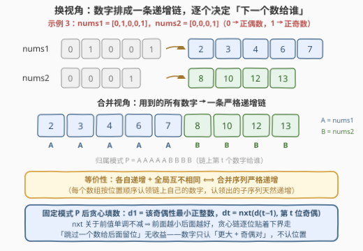
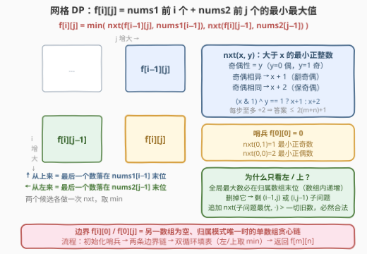
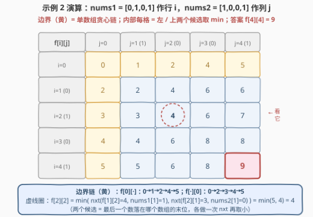

# 构建两个递增数组

- **题目名称**：构建两个递增数组
- **链接**：[3269. 构建两个递增数组 🔒](https://leetcode.cn/problems/constructing-two-increasing-arrays/)
- **难度**：困难
- **标签**：数组、动态规划、贪心、双序列 DP

## 1. 题目概述

> ⚠️ 本题为 LeetCode 付费题（锁题），题意描述根据官方示例用例与 hints 重建，可能与官方题面有出入。（题面已与社区镜像 doocs/leetcode 的官方中文翻译交叉核对，三组示例输入输出与 GraphQL 接口返回一致，出入风险较低。）

给定两个**只包含 0 和 1** 的整数数组 `nums1` 和 `nums2`，你需要把每个 `0` 替换成一个**正偶数**、每个 `1` 替换成一个**正奇数**，使得替换后：

- 两个数组都**递增**（配合下一条「至多使用一次」，数组内自然严格递增）；
- **每个整数至多被使用一次**——注意这是**跨两个数组的全局约束**。

在所有合法替换中，让 `nums1` 和 `nums2` 里的**最大数字尽可能小**，返回这个最小的最大数字。

**示例 1**：

```text
输入：nums1 = [], nums2 = [1,0,1,1]
输出：5
解释：替换后 nums1 = []，nums2 = [1,2,3,5]。
```

**示例 2**：

```text
输入：nums1 = [0,1,0,1], nums2 = [1,0,0,1]
输出：9
解释：一种替换：nums1 = [2,3,8,9]，nums2 = [1,4,6,7]，最大数字 9。
```

**示例 3**：

```text
输入：nums1 = [0,1,0,0,1], nums2 = [0,0,0,1]
输出：13
解释：一种替换：nums1 = [2,3,4,6,7]，nums2 = [8,10,12,13]，最大数字 13。
```

**约束条件**：

- $0 \le nums1.length \le 1000$（`nums1` 可为空）
- $1 \le nums2.length \le 1000$
- `nums1`、`nums2` 只包含 `0` 和 `1`

> 💡 审题关键：① 「互不相同」是**全局**约束——示例 2 若允许两个数组共用数字，`nums1 = [2,3,4,5]`、`nums2 = [1,2,4,5]` 就能把最大值压到 5，而官方答案是 9，可见**跨数组也不许重复**，两个数组在数字空间里互相挤占，这才是本题的难点；② `nums1` 可为空，此时退化为单数组贪心链；③ 答案规模：最坏每个位置都跨 2 步，上界约 $2(m+n)+1 \le 4001$，`int` 完全够用。

---

## 2. 解题思路

### 2.1 暴力思路：两个数组互相耦合，各自贪心会「撞车」

最自然的想法是各数组独立贪心——每个位置取「大于前一个的最小合法数」。但它立刻撞墙：

- `nums1 = [0]`、`nums2 = [0]`：两边都想取 2，全局不许重复 ⇒ 必须有一个退让到 4。**谁来退让**取决于后续走势——换成 `nums1 = [0,1]`、`nums2 = [0]`：让 `nums1` 拿 2,3、`nums2` 拿 4，最大值 4；反过来 `nums1` 拿 4,5、`nums2` 拿 2，最大值 5。局部信息决定不了退让策略；
- 更一般地，某数组「抢先占用」一个小数字可能逼得另一数组整体后移，也可能恰好毫无影响——这种**跨数组的资源争抢**使得任何单数组视角的贪心都无法保证正确。

暴力枚举同样不可行：每个位置的可选数字没有上界，直接 DFS 分配是指数级；「归属谁」的组合方式有 $\binom{m+n}{m}$ 种（$m=n=1000$ 时约 $10^{600}$）；就连「给定上界 $M$ 判定可行」也不容易——可行性取决于「哪些数字被谁占了」，状态空间巨大。$m+n \le 2000$ 的规模暗示我们需要一个**多项式**算法。

### 2.2 核心观察：归并视角——决策只有「下一个数给谁」



**第一步：把两个数组的约束「焊」成一条链。** 把两个数组**用到的所有数字**从小到大排成一条合并序列，则

$$\text{两数组各自递增} + \text{全局互不相同} \iff \text{合并序列严格递增，且每个数字归属于某个数组的「下一个待填位置」}$$

- 正向：任何合法方案里数字两两不同 ⇒ 从小到大排成一列自然严格递增；每个数组按位置顺序认领自己的数字，认领出的子序列就是该数组本身；
- 反向：给定一条严格递增的链和一个**归属模式** $P \in \{A, B\}^{m+n}$（第 $t$ 个数字给谁，$A$ 恰 $m$ 个、$B$ 恰 $n$ 个），两个数组各自认领到的子序列必然严格递增、且全局互不相同。

于是「一个方案」=「一条递增链 + 一个归属模式」。决策从「$m+n$ 个位置各填几」坍缩成「链上每个数给谁」。

**第二步：固定模式后，贪心填数就是最优。** 定义

$$\textit{nxt}(x, y) = \text{大于 } x \text{ 的最小正整数，且奇偶性为 } y\ (y = 0 \text{ 偶}，\ 1 \text{ 奇})$$

奇偶相异则 $x+1$，相同则 $x+2$。固定模式 $P$ 后，最优填法是逐位贪心：$d_1$ 取该奇偶性的最小正整数，$d_t = \textit{nxt}(d_{t-1},\ p_t)$。原因：

- 合并序列的全部约束就是「严格递增」，所以任何填法都满足 $d_t \ge \textit{nxt}(d_{t-1},\ p_t)$（逐位下界）；
- $\textit{nxt}$ 关于 $x$ **单调不减**——前面的数取小了，后面的下界只会更小，不会更差。归纳可得：贪心链逐位贴着下界走，其末位（即最大数）最小；
- 「故意跳过一个数给后面留位置」没有收益：数字不认位置，只认「比前一个大 + 奇偶对」，跳过只会白白推高当前值、连累后续。

**第三步：全局最大数必在某个数组的末位 → 网格 DP。** 链上最后一个（全局最大的）数字归属某个数组，而该数组内部递增 ⇒ 它必落在该数组的**最后一个待填位置**。设已填完 `nums1` 前 $i$ 个、`nums2` 前 $j$ 个，则最后一个数字要么落在 `nums1[i-1]`、要么落在 `nums2[j-1]`；删掉它，剩下的 $m+n-1$ 个数恰好构成 $(i-1, j)$ 或 $(i, j-1)$ 的合法方案。定义

$$f[i][j] = \text{只考虑 nums1 前 } i \text{ 个、nums2 前 } j \text{ 个位置时的最小最大值}$$

$$f[i][j] = \min\Big(\textit{nxt}\big(f[i-1][j],\ \textit{nums1}[i-1]\big),\ \textit{nxt}\big(f[i][j-1],\ \textit{nums2}[j-1]\big)\Big)$$

两个分支分别对应「最后一个数落在 `nums1` 末位 / `nums2` 末位」。正确性双向成立：

- **可达**：给 $(i-1,j)$ 的最优方案追加 $\textit{nxt}(f[i-1][j], \cdot)$，新数严格大于子方案的最大值 ⇒ 大于一切旧数，合法；
- **下界**：任取 $(i,j)$ 的合法方案，设最大数 $M$ 落在（不妨设）`nums1` 末位，删掉它剩下 $(i-1, j)$ 的合法方案，由归纳其最大值 $M' \ge f[i-1][j]$；而 $M > M'$ 且与末位奇偶相同 ⇒ $M \ge \textit{nxt}(M', \cdot) \ge \textit{nxt}(f[i-1][j], \cdot) \ge f[i][j]$。

边界 $f[0][0] = 0$ 当**哨兵**：$\textit{nxt}(0,1)=1$（最小正奇数）、$\textit{nxt}(0,0)=2$（最小正偶数），于是 $f[i][0]$、$f[0][j]$ 自动成为「另一数组为空、模式唯一」的单数组贪心链。答案即 $f[m][n]$。

> 💡 一句话本质：**把「两个数组各自填数」重写成「一条递增数字链逐个认领」，归属模式恰好是二维网格上的一条单调路径**——找最优路径是编辑距离同款的双序列 DP，$\textit{nxt}$ 负责给路径的每种走法标价。这正是官方 hint 中 $dp[i][j][flag]$（$flag$ 记录最大数在哪个数组）的压缩形式：两个 $flag$ 分支取 $\min$ 后，那一维就可以省掉。

### 2.3 算法流程图



流程四步：

1. 初始化 $f[0][0] = 0$（哨兵，配合 $\textit{nxt}$ 自动得到最小正奇/偶数）；
2. 预处理两条边界链：$f[i][0] = \textit{nxt}(f[i-1][0], \textit{nums1}[i-1])$，$f[0][j]$ 同理——这就是单数组独立贪心；
3. 双循环填内部：每格两个候选（从上来 / 从左来）各做一次 $\textit{nxt}$，取 $\min$；
4. 返回 $f[m][n]$。

### 2.4 示例演算



以示例 2（`nums1 = [0,1,0,1]` 作行 $i$、`nums2 = [1,0,0,1]` 作列 $j$）填表：

| $f$ | $j=0$ | $j=1\,(1)$ | $j=2\,(0)$ | $j=3\,(0)$ | $j=4\,(1)$ |
|-------|-------|------------|------------|------------|------------|
| $i=0$ | 0 | 1 | 2 | 4 | 5 |
| $i=1\,(0)$ | 2 | 2 | 4 | 6 | 6 |
| $i=2\,(1)$ | 3 | 3 | 4 | 6 | 7 |
| $i=3\,(0)$ | 4 | 4 | 6 | 8 | 8 |
| $i=4\,(1)$ | 5 | 5 | 6 | 8 | **9** |

- **边界链**：$f[0][\cdot]$ 为 $0 \to 1 \to 2 \to 4 \to 5$（`nums2` 独自贪心：1、2、4、5）；$f[\cdot][0]$ 为 $0 \to 2 \to 3 \to 4 \to 5$（`nums1` 独自贪心：2、3、4、5）；
- **内部一格**：$f[2][2] = \min\big(\textit{nxt}(f[1][2]{=}4,\ \textit{nums1}[1]{=}1),\ \textit{nxt}(f[2][1]{=}3,\ \textit{nums2}[1]{=}0)\big) = \min(5, 4) = 4$；
- 右下角 $f[4][4] = 9$ ✓，对应官方替换 `nums1 = [2,3,8,9]`、`nums2 = [1,4,6,7]`。

示例 3 同法得 $f[5][4] = 13$ ✓（一条最优归属模式是 $AAAAA\,BBBB$：先把链上前 5 个数 2,3,4,6,7 全给 `nums1`，再把 8,10,12,13 给 `nums2`——正是官方解释里的替换）。示例 1 中 `nums1` 为空，答案直接取边界 $f[0][4] = 5$。

---

## 3. 参考代码

### C++

```cpp
class Solution {
  public:
    int minLargest(vector<int>& nums1, vector<int>& nums2) {
        int m = nums1.size(), n = nums2.size();
        // nxt(x, y)：大于 x 的最小正整数，奇偶性与 y 一致（y=0 偶 / y=1 奇）
        auto nxt = [](int x, int y) -> int {
            return ((x & 1) ^ y) == 1 ? x + 1 : x + 2;
        };
        vector<vector<int>> f(m + 1, vector<int>(n + 1));
        for (int i = 1; i <= m; ++i) f[i][0] = nxt(f[i - 1][0], nums1[i - 1]);
        for (int j = 1; j <= n; ++j) f[0][j] = nxt(f[0][j - 1], nums2[j - 1]);
        for (int i = 1; i <= m; ++i)
            for (int j = 1; j <= n; ++j)  // 最后一个数落在 nums1 末位 / nums2 末位，取小
                f[i][j] = min(nxt(f[i - 1][j], nums1[i - 1]),
                              nxt(f[i][j - 1], nums2[j - 1]));
        return f[m][n];
    }
};
```

### Python

```python
class Solution:
    def minLargest(self, nums1: List[int], nums2: List[int]) -> int:
        def nxt(x: int, y: int) -> int:      # 大于 x 的最小正整数，奇偶性 = y
            return x + 1 if (x & 1) ^ y else x + 2

        m, n = len(nums1), len(nums2)
        f = [[0] * (n + 1) for _ in range(m + 1)]
        for i, x in enumerate(nums1, 1):     # 边界链：nums1 单数组贪心
            f[i][0] = nxt(f[i - 1][0], x)
        for j, y in enumerate(nums2, 1):     # 边界链：nums2 单数组贪心
            f[0][j] = nxt(f[0][j - 1], y)
        for i, x in enumerate(nums1, 1):
            for j, y in enumerate(nums2, 1):
                f[i][j] = min(nxt(f[i - 1][j], x), nxt(f[i][j - 1], y))
        return f[m][n]
```

> 💡 实现细节：① `f` 初始化为全 0 即可——$f[0][0] = 0$ 本来就该是哨兵，两条边界链从它出发，无需特判「第一个数取最小正奇/偶数」；② Python 的 `(x & 1) ^ y` 为真即 1（异奇偶 → +1）；C++ 注意运算符优先级，`((x & 1) ^ y) == 1` 的括号不能省；③ 答案上界约 $2(m+n)+1 \le 4001$，全程 `int` 无溢出风险。

---

## 4. 复杂度分析

| 维度 | 复杂度 | 说明 |
|------|--------|------|
| 时间复杂度 | $O(mn)$ | $m, n \le 1000$，共 $10^6$ 格，每格两次 $\textit{nxt}$ + 一次 $\min$，$O(1)$ |
| 空间复杂度 | $O(mn)$ | DP 二维表；可滚动优化至 $O(\min(m, n))$，见第 5 节 |
| 暴力对照 | 指数级 | 归属模式共 $\binom{m+n}{m} \approx 10^{600}$ 种（$m=n=1000$），逐模式模拟不可行；DFS 直接分配同样爆炸 |
| 答案规模 | $\le 2(m+n)+1$ | 每步 $\textit{nxt}$ 至多 +2，`int` 足够 |

实测：官方三组示例输出 $5 / 9 / 13$ 全部命中；另与两个独立暴力对拍——① 枚举**全部归属模式**并逐模式贪心模拟（500 组随机数据，$m \le 4$、$n \le 4$）；② 完全独立的 DFS 数字分配搜索（120 组小数据）——结果全部一致。

---

## 5. 扩展：滚动数组与方案重建

**滚动数组**：$f[i][j]$ 只依赖本行与上一行，压成一维后内层遍历 $j$——循环里 `nxt(f[j], x)` 用的恰是旧的 $f[i-1][j]$，而 `f[j-1]` 已是新值 $f[i][j-1]$。让**短数组当内层**并交换两个数组（答案对二者对称），空间降到 $O(\min(m, n))$：

```python
class Solution:
    def minLargest(self, nums1: List[int], nums2: List[int]) -> int:
        if len(nums1) < len(nums2):
            nums1, nums2 = nums2, nums1              # 短的当内层
        def nxt(x: int, y: int) -> int:
            return x + 1 if (x & 1) ^ y else x + 2
        f = [0] * (len(nums2) + 1)
        for j, y in enumerate(nums2, 1):
            f[j] = nxt(f[j - 1], y)
        for x in nums1:
            f[0] = nxt(f[0], x)                      # f[i][0]，旧 f[0] 恰是 f[i-1][0]
            for j, y in enumerate(nums2, 1):
                f[j] = min(nxt(f[j], x), nxt(f[j - 1], y))
        return f[-1]
```

**方案重建**：想输出具体的两个数组，只需填表时顺手记录每格的转移方向（从上 / 从左），从 $(m, n)$ 回溯出一条最优归属模式 $P$，再按 $P$ 正向跑一遍贪心填数。例如示例 3 的最优模式之一是 $AAAAA\,BBBB$，正向贪心即得 `nums1 = [2,3,4,6,7]`、`nums2 = [8,10,12,13]`。

**与官方 hint 的对照**：官方 hint 定义 $dp[i][j][flag]$（$flag$ 标记当前最大数在哪个数组），转移时显式区分「新的最大数落在谁家」；本解的 $f[i][j]$ 在两个 $flag$ 分支上直接取 $\min$，把三维压成二维——因为后续转移只关心「前缀最大值是多少」，并不关心它长在哪个数组里。

---

## 6. 面试要点

1. **为什么「各自递增 + 全局互不相同」可以等价成「一条严格递增的合并序列」？**

   - 正向：合法方案中所有数字两两不同，从小到大排成一列必然严格递增，每个数组按位置顺序认领自己的数字；反向：给定严格递增链与归属模式（$A/B$ 串，标记每个数给谁），每个数组认领到的子序列自然严格递增且全局无重复。这一步把「二维约束」压成「一维链 + 归属」，是整个解法的支点。

2. **固定归属模式后，为什么贪心填数最优？「跳数留位」会不会更好？**

   - 合并序列唯一的硬约束是严格递增，故任何填法满足 $d_t \ge \textit{nxt}(d_{t-1}, p_t)$（逐位下界）；又 $\textit{nxt}$ 关于 $x$ 单调不减，前面的值更小只会让后面的下界更小——归纳即得贪心链逐位贴着下界走，末位最小。跳过一个数字并不能给后面「留位置」：数字没有位置依赖，只要「比前一个大 + 奇偶正确」就能用，跳过只会推高当前值、连累后续。

3. **转移为什么只看 $f[i-1][j]$ 和 $f[i][j-1]$？**

   - 全局最大数必在归属数组的**末位**（该数组内部递增，最大值只能垫底）。它要么是 `nums1[i-1]` 位置的值、要么是 `nums2[j-1]` 位置的值；删掉它，剩下的数字构成 $(i-1, j)$ 或 $(i, j-1)$ 的合法方案。反向追加也合法：$\textit{nxt}(\text{子问题最大值}, \cdot)$ 严格大于子方案里的一切数字。

4. **$\textit{nxt}$ 的位运算怎么推？哨兵 $f[0][0] = 0$ 起什么作用？**

   - $(x \,\&\, 1) \oplus y = 1$ 表示 $x$ 的奇偶与目标奇偶**相异**，$+1$ 恰好翻转奇偶；为 $0$ 表示相同，$+2$ 保持奇偶。哨兵 $0$ 是偶数：$\textit{nxt}(0,1) = 1$（最小正奇数）、$\textit{nxt}(0,0) = 2$（最小正偶数），于是「第一个数取该奇偶性最小正整数」被统一进递推，两条边界链无需任何特判。

5. **和 97. 交错字符串是什么关系？**

   - 同一副「双序列交错」骨架：97 判定**给定**的交错结果能否由两个源串拼出（可行性布尔 DP），本题在**所有**交错模式中挑选代价最小的（最优化数值 DP）。连同 72 编辑距离、1143 LCS，本质都是「两个序列如何对齐 / 交错」的网格 DP，面试中可以打包叙述，展示套路迁移能力。

---

## 7. 同类练习题

- [97. 交错字符串](https://leetcode.cn/problems/interleaving-string/)（[站内题解](../0001-0100/97_交错字符串.md)）：同款「双序列交错」骨架的可行性判定版——本题是在所有交错模式中找代价最小的
- [72. 编辑距离](https://leetcode.cn/problems/edit-distance/)（[站内题解](../0001-0100/72_编辑距离.md)）：双序列网格 DP 母题，本题 $f[i][j]$ 的表结构与「左 / 上转移」完全同款
- [1143. 最长公共子序列](https://leetcode.cn/problems/longest-common-subsequence/)（[站内题解](../1101-1200/1143_最长公共子序列.md)）：最经典的双序列 DP，练「不匹配时从左 / 上转移」的手感
- [1092. 最短公共超序列](https://leetcode.cn/problems/shortest-common-supersequence/)：在网格 DP 上**构造具体方案**（回溯转移方向），对应本题第 5 节的方案重建
- [21. 合并两个有序链表](https://leetcode.cn/problems/merge-two-sorted-lists/)（[站内题解](../0001-0100/21_合并两个有序链表.md)）：归并操作本身——「两个序列按序认领输出」的最朴素形态
