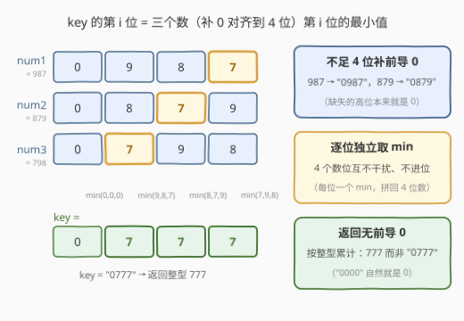
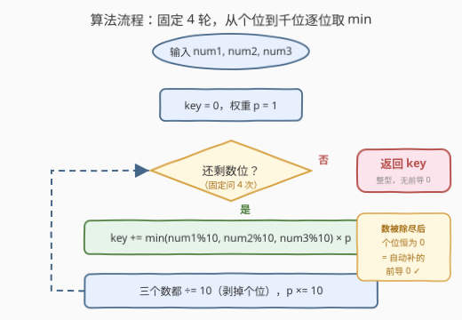
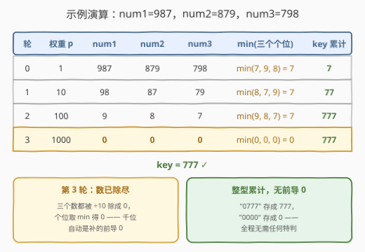

# LeetCode 求出数字答案 题解

## 1. 题目概述

- **标题 / 题号**：求出数字答案（#3270，easy）
- **链接**：https://leetcode.cn/problems/find-the-key-of-the-numbers/
- **难度**：简单
- **标签**：数学

**题意**：给你三个**正**整数 `num1`、`num2` 和 `num3`。数字 `num1`、`num2` 和 `num3` 的数字答案 `key` 是一个四位数，定义如下：

- 一开始，如果有数字**少于**四位数，给它补**前导 0**。
- 答案 `key` 的第 $i$ 个数位（$1 \le i \le 4$）为 `num1`、`num2` 和 `num3` 第 $i$ 个数位中的**最小**值。

请你返回三个数字**没有**前导 0 的数字答案。

**示例 1**：

```text
输入：num1 = 1, num2 = 10, num3 = 1000
输出：0
解释：补前导 0 后，num1 变为 "0001"，num2 变为 "0010"，num3 保持不变为 "1000"。
     - 第 1 个数位为 min(0, 0, 1)。
     - 第 2 个数位为 min(0, 0, 0)。
     - 第 3 个数位为 min(0, 1, 0)。
     - 第 4 个数位为 min(1, 0, 0)。
     所以数字答案为 "0000"，也就是 0。
```

**示例 2**：

```text
输入：num1 = 987, num2 = 879, num3 = 798
输出：777
```

**示例 3**：

```text
输入：num1 = 1, num2 = 2, num3 = 3
输出：1
```

**约束**：

- $1 \le num1, num2, num3 \le 9999$

> 💡 读题关键：①「补前导 0」= 把三个数统一按 **4 位对齐**（上界 9999，最多 4 位）；②「第 $i$ 位取最小值」= 4 个数位**逐位独立**、互不进位；③「没有前导 0」= 结果按**整型**返回，`"0777"` 就是 777，`"0000"` 就是 0。

## 2. 解题思路

### 2.1 暴力思路：字符串对齐

最直白的做法是照着题面模拟：把三个数格式化成 4 位字符串（自动补前导 0），逐字符取最小，再把结果串转回整数：

```python
s1, s2, s3 = f"{num1:04d}", f"{num2:04d}", f"{num3:04d}"   # 987 → "0987"
key = int("".join(min(a, b, c) for a, b, c in zip(s1, s2, s3)))
```

正确性没有问题——本题上界 9999，操作次数固定为 4。但它绕了「数 → 串 → 数」一个来回：格式化时做一遍数字转字符，`int()` 再做一遍字符转数字，且「补前导 0」是一个**显式**动作。能不能全程不离开整数域？

### 2.2 核心观察：逐位剥离，前导 0 与无前导 0 都是免费的



**观察 1（补前导 0 是免费的）**：987 补成 `"0987"`，本质是「不足的高位视作 0」。而用 $\% 10$ 取个位、$\lfloor \cdot / 10 \rfloor$ 剥个位时，**数被除尽之后个位永远是 0**——高位不需要显式构造，剥到没有时它自动以 0 的身份参与 `min`。

**观察 2（逐位独立）**：`key` 的 4 个数位互不干扰、无进位，每一位就是一个独立的 `min(num1 的第 i 位, num2 的第 i 位, num3 的第 i 位)`。从**个位**往高位扫 4 轮，权重 $p$ 依次取 $1, 10, 100, 1000$：

$$key = \sum_{i=0}^{3} \min\left(\left\lfloor \frac{num_1}{10^i} \right\rfloor \bmod 10,\ \left\lfloor \frac{num_2}{10^i} \right\rfloor \bmod 10,\ \left\lfloor \frac{num_3}{10^i} \right\rfloor \bmod 10\right) \times 10^i$$

**观察 3（无前导 0 也是免费的）**：按整型累加 `key`，`"0777"` 天然存成 777、`"0000"` 存成 0——前导 0 在整数域里**根本不存在**，字符串版需要 `int()` 完成的「去前导 0」在整数版里被免掉了。

三个观察合起来：**从个位到千位固定循环 4 轮，每轮对三个数的当前个位取 min、乘上权重累加，然后三个数统统 ÷10**。全程无字符串、无特判。

### 2.3 算法流程图



流程是一个固定 4 轮的循环：每轮①取三个数**当前个位**（$\% 10$）的最小值乘以权重 $p$ 累进 `key`；②三个数都 $\lfloor \cdot/10 \rfloor$ 剥掉个位、$p \times 10$ 升一位。循环天然只跑 4 次——第 4 轮时哪怕三个数早已除尽，个位的 `min(0,0,0) = 0` 恰好对应「补的前导 0」。

### 2.4 示例演算



以 `num1 = 987, num2 = 879, num3 = 798` 为例（对应 `"0987" / "0879" / "0798"`）：

| 轮 $i$ | 权重 $p$ | num1 | num2 | num3 | 个位取 min | key 累计 |
|--------|----------|------|------|------|-----------|----------|
| 0      | 1        | 987  | 879  | 798  | $\min(7,9,8) = 7$ | 7        |
| 1      | 10       | 98   | 87   | 79   | $\min(8,7,9) = 7$ | 77       |
| 2      | 100      | 9    | 8    | 7    | $\min(9,8,7) = 7$ | 777      |
| 3      | 1000     | **0**| **0**| **0**| $\min(0,0,0) = 0$ | 777      |

注意**第 3 轮**：三个数都已被 ÷10 除尽，个位取 min 得 0——这正是「987 补成 0987」的自动化版本，前导 0 无需任何显式处理。最终 `key = 777`，整型累计天然无前导 0。

## 3. 参考代码

### C++（整数域逐位剥离）

```cpp
class Solution {
  public:
    int generateKey(int num1, int num2, int num3) {
        int key = 0, p = 1;
        for (int i = 0; i < 4; i++) {          // 个位 → 千位，固定 4 轮
            key += min({num1 % 10, num2 % 10, num3 % 10}) * p;
            p *= 10;
            num1 /= 10;                        // 剥掉个位，除尽后个位恒为 0
            num2 /= 10;
            num3 /= 10;
        }
        return key;                            // 整型累计，天然无前导 0
    }
};
```

### Python（整数版 + 字符串一行流）

```python
class Solution:
    def generateKey(self, num1: int, num2: int, num3: int) -> int:
        key, p = 0, 1
        for _ in range(4):
            key += min(num1 % 10, num2 % 10, num3 % 10) * p
            p *= 10
            num1 //= 10
            num2 //= 10
            num3 //= 10
        return key
```

```python
class Solution:
    def generateKey(self, num1: int, num2: int, num3: int) -> int:
        # 字符串视角：'0' < '1' < ... < '9'，字符序 = 数值序，逐字符 min 即逐位 min
        return int(''.join(map(min, f'{num1:04d}', f'{num2:04d}', f'{num3:04d}')))
```

> 💡 字符串一行流里 `map(min, s1, s2, s3)` 对三个字符串**逐字符**调用 `min`——因为数字字符的字典序与数值序一致，字符级的 min 就是数位级的 min；`int('0777') = 777` 顺带完成去前导 0。两种写法结果完全一致，整数版胜在无任何转换开销。

## 4. 复杂度分析

| 维度 | 复杂度 | 说明 |
|------|--------|------|
| 时间复杂度 | $O(1)$ | 固定 4 轮循环，每轮常数次算术运算与一次三元 min |
| 空间复杂度 | $O(1)$ | 只使用 `key`、`p` 等常数个变量 |
| 字符串版对照 | $O(1)$ / $O(1)$ | 渐近同为常数，但多出格式化与 `int()` 解析两趟转换 |

## 5. 扩展：十进制逐位 min 是「十进制版的按位 AND」

把视角拉高，本题定义的运算 $\mathit{key}(a, b, c)$ 是把 `min` **逐十进制位**施加到三个操作数上。它和位运算有深刻的同构：

1. **二进制逐位 min 就是 AND**：在 $\{0,1\}$ 上，$\min(0,1) = 0 = 0 \,\&\, 1$、$\min(1,1) = 1$——`&` 的真值表恰好是逐位 min。同理逐位 max 就是 OR。
2. **格运算**：$(\mathbb{Z}, \min, \max)$ 是全序格，`min` 满足**幂等**（$\min(x,x)=x$）、交换、结合、吸收律——位运算 AND/OR 是布尔格上的同款运算，本题把它推广到了十进制位段。
3. **为什么不能一次位运算搞定十进制？** 二进制的位段之间 `min` 不会互相干扰（无进位）；但把三个整数直接做算术 `min(a, b, c)` 会让位与位之间**借位传染**（例如 $19$ 与 $90$ 的算术 min 是 $19$，而逐位 min 是 $10$）。所以十进制版本只能老老实实 $\% 10$、$\lfloor /10 \rfloor$ 逐位剥离——这正是本题模板的必要性所在。
4. **推广**：换成 $k$ 个数，把三个变量换成数组逐元素取 min；数上界从 $9999$ 换成任意 $N$，把循环次数改成 $\lceil \log_{10}(N+1) \rceil$ 轮即可，模板不变。

## 6. 面试要点

1. **「补前导 0」需要真的填 0 吗？**

   - 不需要。从个位用 $\% 10$、$\lfloor /10 \rfloor$ 剥离，数被除尽后个位恒为 0，高位自动以 0 参与 `min`——显式补 0 的字符串操作可以整个省掉。

2. **「返回无前导 0」需要特判吗？**

   - 不需要。`key` 按整型累加，`"0777"` 即 777、`"0000"` 即 0，前导 0 在整数域中不存在。字符串版靠 `int()` 转换隐式完成同一件事。

3. **为什么从个位往高位扫，而不是从高位往低位？**

   - $\% 10$ 直接拿到个位，配合 $\lfloor /10 \rfloor$ 是最顺手的自增指针；从高位出发得先知道位数（或先格式化对齐），绕一圈回到同一件事。

4. **C++ 里三个数取 min 怎么写？**

   - `min({a, b, c})`（initializer_list 重载）最简洁；嵌套 `min(a, min(b, c))` 亦可。注意 `min` 形参类型需一致，混用 `int`/`long long` 会编译报错。

5. **逐位取 min 会产生进位/借位问题吗？**

   - 不会。`key` 的 4 个数位**相互独立**，每位单独 min 后乘各自权重累加，不存在任何位间传染；这也是它能被推广到 $k$ 个数、任意位数的结构原因（见第 5 节）。

## 同类练习题

| # | 题目 | 与本题的关联 |
|---|------|-------------|
| 7 | [整数反转](https://leetcode.cn/problems/reverse-integer/) | `%10` / `//10` 逐位剥离的母题，多一层溢出判断 |
| 9 | [回文数](https://leetcode.cn/problems/palindrome-number/) | 反转一半数字判回文，同款「剥个位 + 权重重组」手感的进阶应用 |
| 504 | [七进制数](https://leetcode.cn/problems/base-7/) | 换基数为 7 的逐位剥离（`%7` / `//7`），体会模板与进制无关 |
| 476 | [数字的补数](https://leetcode.cn/problems/number-complement/) | 二进制逐位独立运算（取反），对照本题理解「十进制逐位 min」与位运算的同构 |
