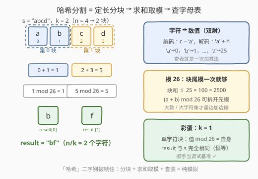
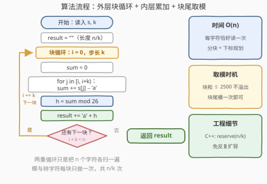
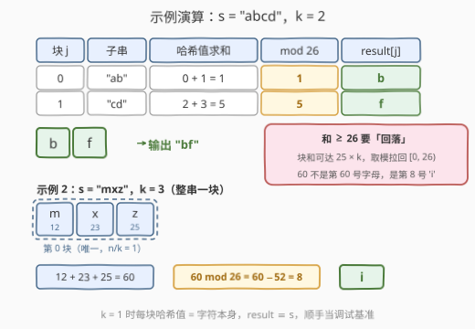

# LeetCode 哈希分割字符串 题解

## 1. 题目概述

- **标题 / 题号**：哈希分割字符串（#3271，medium）
- **链接**：https://leetcode.cn/problems/hash-divided-string/
- **难度**：中等
- **标签**：字符串、模拟

**题意**：给你一个长度为 $n$ 的字符串 `s` 和一个整数 $k$，$n$ 是 $k$ 的**倍数**。你的任务是将 `s` 哈希为一个长度为 $n/k$ 的新字符串 `result`：

- 将 `s` 分割成 $n/k$ 个**子字符串**，每个子串的长度都为 $k$；
- 一个字符的**哈希值**是它在字母表中的下标（`'a' → 0`，`'b' → 1`，…，`'z' → 25`）；
- 将子串中每个字母的**哈希值求和**，对 26 取余，结果记为 `hashedChar`；
- 找到小写字母表中 `hashedChar` 对应的字符，追加到 `result` 末尾。

返回 `result`。

**示例 1**：

```text
输入：s = "abcd", k = 2
输出："bf"
解释：
- 第一个子串为 "ab"，0 + 1 = 1，1 % 26 = 1，result[0] = 'b'。
- 第二个子串为 "cd"，2 + 3 = 5，5 % 26 = 5，result[1] = 'f'。
```

**示例 2**：

```text
输入：s = "mxz", k = 3
输出："i"
解释：唯一的子串为 "mxz"，12 + 23 + 25 = 60，60 % 26 = 8，result[0] = 'i'。
```

**约束**：

- $1 \le k \le 100$
- $k \le s.length \le 1000$
- $s.length$ 能被 $k$ 整除
- `s` 只含小写英文字母

> 💡 读题关键：① **定长分块**——$n/k$ 个块、每块 $k$ 个字符，题目保证整除；② 字符与 $0 \sim 25$ 的**双射**（`c − 'a'` 编码、`'a' + h` 解码）；③ 和取模 26 后**落回字母表**——示例 2 的 $60 \to 8$ 就是「越过 26 绕回」。

## 2. 解题思路

### 2.1 暴力思路（切片模拟）

照着题面逐步翻译：外层枚举块起点，切出每块子串，内层把字符转成数值求和，模 26 后转回字符拼接：

```python
res = []
for i in range(0, n, k):
    chunk = s[i:i + k]                # 切出临时子串
    total = sum(ord(c) - ord('a') for c in chunk)
    res.append(chr(ord('a') + total % 26))
```

正确、时间也是 $O(n)$，但每块都切出一个临时串，累计 $O(n)$ 额外空间；而且「切块」只是**下标规划**——分块信息在循环变量里已经齐了，根本不需要真的复制字符。

### 2.2 核心观察：定长分块 + 双射转换 + 块尾取模



**观察 1（块的下标规律）**：第 $j$ 块恰好覆盖下标区间 $[j \cdot k,\ (j+1) \cdot k)$。外层 `i += k` 步进、内层 `j` 走 $k$ 格，或者干脆单趟扫描用 `(i + 1) % k == 0` 判块尾——**分块不依赖切片**。

**观察 2（字符 ↔ 数值双射）**：ASCII 小写字母连续，编码 `c − 'a'`、解码 `'a' + h` 各一行，「查字母表」就是一次加减法。

**观察 3（模加法可分配）**：

$$(a + b) \bmod 26 = \big((a \bmod 26) + (b \bmod 26)\big) \bmod 26$$

本题块内和 $\le 25 \times 100 = 2500$，`int` 轻松装下，**块尾模一次**即可；但当 $k$ 巨大或字符数值很大（如 Unicode 码点）时，「边加边模」就是防溢出的必要写法。

**观察 4（彩蛋兼 sanity check）**：$k = 1$ 时每块就是单字符，哈希值 $\bmod 26$ 等于自身，`result` 与 `s` 完全相同——顺手当调试基准。

整合成一行公式：

$$\text{result}[j] = \text{'a'} + \left(\sum_{i=jk}^{(j+1)k-1} \big(s_i - \text{'a'}\big)\right) \bmod 26$$

### 2.3 算法流程图



两重循环的单层结构：外层按步长 $k$ 枚举块起点，内层累加 $k$ 个字符的哈希值；块尾做一次 $\bmod 26$、转字符、追加。每个字符恰好被访问一次。

### 2.4 示例演算



以 `s = "abcd"`，$k = 2$ 为例：

| 块 $j$ | 子串 | 哈希值求和 | $\bmod\ 26$ | `result[j]` |
|--------|------|-----------|-------------|--------------|
| 0 | `"ab"` | $0 + 1 = 1$ | $1$ | `b` |
| 1 | `"cd"` | $2 + 3 = 5$ | $5$ | `f` |

结果为 **`"bf"`**。示例 2 的 `"mxz"` 整串一块：$12 + 23 + 25 = 60$，$60 - 2 \times 26 = 8$，第 8 号字母是 `i`——「和越过 26 绕回」正是取模的职责。

## 3. 参考代码

### C++（步长分块 + 预留结果串）

```cpp
class Solution {
  public:
    string stringHash(string s, int k) {
        int n = s.size();
        string res;
        res.reserve(n / k);                 // 结果长度先定，免反复扩容
        for (int i = 0; i < n; i += k) {    // 块起点：0, k, 2k, ...
            int sum = 0;
            for (int j = i; j < i + k; j++) // 块内 [i, i+k)
                sum += s[j] - 'a';          // 编码：字符 → 数值
            res += char('a' + sum % 26);    // 解码：数值 → 字符
        }
        return res;
    }
};
```

### Python（分块切片一行流）

```python
class Solution:
    def stringHash(self, s: str, k: int) -> str:
        return ''.join(
            chr(ord('a') + sum(ord(c) - ord('a') for c in s[i:i + k]) % 26)
            for i in range(0, len(s), k)
        )
```

> 💡 若想完全不开临时切片，可单趟滚动求和：维护 `total`，每当下标满足 `(i + 1) % k == 0` 就输出一个字符并把 `total` 清零——与 C++ 版逐块等价，只是「块边界」从外层循环变量换成了计数取模判断。

## 4. 复杂度分析

| 维度 | 复杂度 | 说明 |
|------|--------|------|
| 时间复杂度 | $O(n)$ | 每个字符恰好读取一次，块尾 $O(1)$ 取模转字符 |
| 空间复杂度 | $O(n/k)$ | 结果串本身（不计输出则为 $O(1)$） |
| 暴力对照 | $O(n)$ / $O(n)$ | 切片版时间相同，但临时子串累计 $O(n)$ 空间 |

## 5. 扩展：这个「哈希」其实是个同态

把「块 → 字符」的映射记为 $h$，它有一条漂亮的性质——**拼接对应相加**：

$$h(x \parallel y) = \big(h(x) + h(y)\big) \bmod 26$$

也就是说 $h$ 是从（字符串拼接幺半群）到 $(\mathbb{Z}_{26}, +)$ 的**幺半群同态**。由此立刻得到两个推论：

1. **$k = 1$ 时 $h$ 是恒等映射**：单字符的哈希值就是自身下标，`result = s`；
2. **块内字符任意重排，哈希值不变**：加法满足交换律，`"ab"` 与 `"ba"` 都哈希成 `'b'`——位置信息被完全丢掉。

第 2 条正是加法哈希的软肋：每块 $26^k$ 种可能被压缩进 26 个桶里，碰撞率是天文数字。它其实是多项式滚动哈希在 **base = 1** 时的退化情形（187 题用 2 bit 编码 + 滚动哈希，保留了位置信息）。真实的字符串哈希要用随机基数 + 大素数模数，正是为了把「顺序」也编进值里。所以本题名为哈希，实为一个**信息瓶颈**式的压缩变换——从 `result` 绝无可能还原 `s`。

## 6. 面试要点

1. **字符和数值怎么互换？大小写混用有什么陷阱？**

   - 编码 `c - 'a'`、解码 `'a' + h`，依赖 ASCII 中小写字母**连续**这一事实。大小写各自连续但互不连续（`'Z'` 与 `'a'` 之间还隔着 6 个字符），混合场景必须分别偏移或先统一大小写。

2. **取模放在哪一步？什么时候必须边加边模？**

   - 模加法满足分配律，先模后加与先加后模等价。本题块和 $\le 2500$，块尾模一次最简洁；若 $k$ 或字符数值大到可能溢出（如 Unicode 码点 × 大 $k$），就要逐项 `sum = (sum + v) % 26`。

3. **不切子串怎么做定长分块？**

   - 三种等价写法：外层 `i += k` + 内层 $[i, i+k)$；单趟扫描 + `(i + 1) % k == 0` 判块尾；`s[i:i+k]` 切片（Python 惯用，代价是临时串）。核心认知：**分块只是下标规划**。

4. **这个哈希可逆吗？能从 result 恢复 s 吗？**

   - 不能。$h$ 多对一且对块内排列不敏感（同态的交换律推论），信息在压缩时已不可逆丢失；最多统计某个哈希值的前像个数，无法唯一还原。

5. **如果题目不保证 n 是 k 的倍数？**

   - 末块长度 $< k$，两种处理：直接对短块同样求和取模（规则自洽）；或像 2138 题那样用 `fill` 字符补齐到 $k$ 再哈希。写代码前和面试官确认语义即可。

## 同类练习题

| # | 题目 | 与本题的关联 |
|---|------|-------------|
| 2138 | [将字符串拆分为若干长度为 k 的组](https://leetcode.cn/problems/divide-a-string-into-groups-of-size-k/) | 同款定长分块遍历，多考一个「末块不足 k 用 fill 补齐」的分支 |
| 1945 | [字符串转化后的各位数字之和](https://leetcode.cn/problems/sum-of-digits-of-string-after-convert/) | 字符 → 数值 → 逐位求和的多级映射模拟，同属「转换链」题型 |
| 168 | [Excel表列名称](https://leetcode.cn/problems/excel-sheet-column-title/) | 数 ↔ 字母双射的另一面（1-indexed 进制，先减 1 再取余） |
| 187 | [重复的DNA序列](https://leetcode.cn/problems/repeated-dna-sequences/) | 带位置信息的滚动哈希，对照理解本题加法哈希为何碰撞严重 |
| 3210 | [找出加密后的字符串](https://leetcode.cn/problems/find-the-encrypted-string/) | 同为字符串下标运算的模拟姊妹题，含 `k %= n` 消整圈技巧 |
