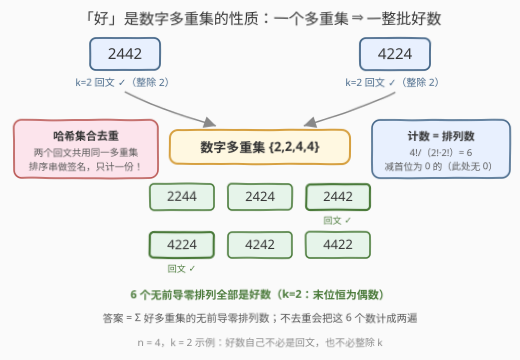
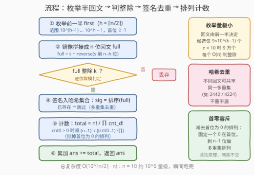
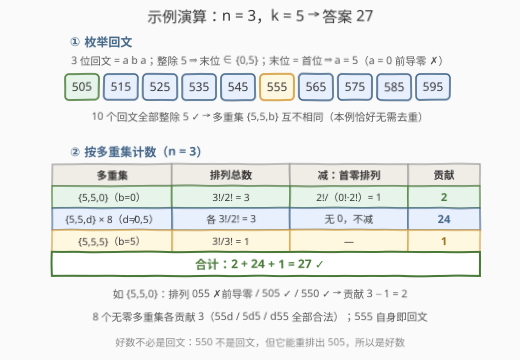

# LeetCode 统计好整数的数目 题解

## 1. 题目概述

- **标题 / 题号**：统计好整数的数目（#3272，hard）
- **链接**：https://leetcode.cn/problems/find-the-count-of-good-integers/
- **难度**：困难
- **标签**：哈希表、数学、组合数学、枚举

**题意**：给你两个**正**整数 $n$ 和 $k$。

如果一个整数 $x$ 满足以下条件，那么它被称为 **k 回文整数**：

- $x$ 是一个回文整数；
- $x$ 能被 $k$ 整除。

如果一个整数的数位重新排列后能得到一个 **k 回文整数**，那么我们称这个整数为**好**整数。比方说，$k = 2$，那么 2020 可以重新排列得到 2002，2002 是一个 k 回文整数，所以 2020 是一个好整数。而 1010 无法重新排列数位得到一个 k 回文整数。

请你返回 $n$ 个数位的整数中，有多少个**好**整数。

**注意**，任何整数在重新排列数位之前或者之后**都不能**有前导 0。比方说 1010 不能重排列得到 101。

**示例 1**：

```text
输入：n = 3, k = 5
输出：27
解释：部分好整数如下：
- 551，因为它可以重排列得到 515。
- 525，因为它已经是一个 k 回文整数。
```

**示例 2**：

```text
输入：n = 1, k = 4
输出：2
解释：两个好整数分别是 4 和 8。
```

**示例 3**：

```text
输入：n = 5, k = 6
输出：2468
```

**约束**：

- $1 \le n \le 10$
- $1 \le k \le 9$

> 💡 **审题关键**：① 「重排后是 k 回文」是数字**多重集**层面的性质——判定只看手里有哪些数字、各多少个，与顺序无关；② 前导零禁令**双向生效**：重排出的 k 回文不能有前导零，好数本身（作为 $n$ 位数）也不能有前导零；③ $n \le 10$ 看似允许 $10^{10}$ 级枚举，但回文由前一半决定，实际候选只有 $9 \times 10^4$ 个——这是「枚举 + 组合计数」路线的通行证；④ 2020 的例子是题眼：**好数自己不必是回文，也不必整除 $k$**——它只需要「同门师兄」里有一个 k 回文。

## 2. 解题思路

### 2.1 暴力思路：逐个数试重排

$n$ 位数有 $9 \times 10^{n-1}$ 个（$n = 10$ 时 90 亿个）。对每个数，检查它的数位能否排出一个整除 $k$ 的回文：朴素做法是枚举全部排列（至多 $10! \approx 3.6 \times 10^6$ 种）逐一判定——总代价约 $10^{16}$ 量级，天文数字。

即使把「能否排出 k 回文」做成高效判定，90 亿次判定本身也不可接受。必须**换计数对象**。

### 2.2 核心观察：按「数字多重集」计数，回文枚举 + 哈希去重



四个观察层层递进：

**观察 1：「好」是数字多重集的性质。** 重排关系是等价关系，$n$ 位数按数字多重集划分成等价类；同一类里要么全是好数、要么全不是——因为「存在一个排列是 k 回文整数」只依赖多重集本身（2020 与 2002 同属一类）。于是：

$$\text{答案} = \sum_{\text{好多重集 } M} \big(\,M \text{ 的无前导零排列数}\,\big)$$

计数对象从「数」变成「多重集」，一次到位地解决「一批好数共享同一判定」的问题。

**观察 2：好多重集靠枚举回文发现，候选只有 $9 \times 10^{\lceil n/2 \rceil - 1}$ 个。** 判定 $M$ 是好多重集，需要找到 $M$ 的一个回文排列且整除 $k$——正向构造困难，反向枚举容易：**$n$ 位回文由前 $h = \lceil n/2 \rceil$ 位决定**（后半是镜像），枚举 $h$ 位前缀 $first \in [10^{h-1}, 10^h)$（首位 $\ge 1$，天然无前导零），镜像拼出完整回文，再判整除：

$$full = s + \mathrm{reverse}\big(s[0..n{-}h{-}1]\big), \qquad full \bmod k = 0 \;\Rightarrow\; \text{发现好多重集 } \mathrm{digits}(full)$$

$n \le 10 \Rightarrow h \le 5$，候选至多 $9 \times 10^4$ 个，每个判定 $O(n)$。

**观察 3：不同回文可能给出同一多重集——必须哈希去重。** 例如 $n = 4$，$k = 2$：2442 与 4224 都是 2 回文整数，数字多重集同为 $\{2,2,4,4\}$。若不去重，这个多重集的 6 个排列会被计两次。用哈希集合存**签名**（排序后的数字串，或 10 元计数向量），重复出现直接跳过。

**观察 4：无前导零排列数 = 一步容斥。** 设多重集的数位计数为 $cnt_0, \dots, cnt_9$（$\sum_d cnt_d = n$），全部多重集排列数是多项式系数：

$$P_{\text{all}} = \frac{n!}{\prod_{d=0}^{9} cnt_d!}$$

减去首位为 0 的排列——固定一个 0 在首位，剩 $n-1$ 位做多重集排列（$cnt_0 = 0$ 时无此项）：

$$P_{\text{valid}} = P_{\text{all}} - [\,cnt_0 > 0\,] \cdot \frac{(n-1)!}{(cnt_0 - 1)! \prod_{d=1}^{9} cnt_d!}$$

> 💡 **为什么枚举不重不漏**：好数 $\iff$ 其多重集存在无前导零的 k 回文排列；前缀从 $10^{h-1}$ 起的枚举覆盖了**所有**无前导零的 $n$ 位回文，因此每个好多重集必然被发现**至少一次**；哈希签名去重保证恰好**一次**。

> ⚠️ **两个方向的回文数位不对称**：枚举出的回文自身无前导零（首位 $\ge 1$），但它的**多重集可以含 0**（回文内部可以有 0，如 505）；这些 0 只是不能站首位——正是观察 4 的减法要处理的情形。

### 2.3 算法流程图



| 步骤 | 操作 | 作用 |
|------|------|------|
| ① 枚举前一半 | $first \in [10^{h-1}, 10^h)$，$h = \lceil n/2 \rceil$ | 回文自由位只有前一半，候选 $9 \times 10^{h-1}$ 个 |
| ② 镜像拼接 | $full = s + \mathrm{reverse}(s\text{ 前 } n-h \text{ 位})$ | 拼出 $n$ 位回文，首位 $\ge 1$ 无前导零 |
| ③ 判整除 | 逐位取模 $r = (r \cdot 10 + d) \bmod k$ | 非 $k$ 的倍数直接丢弃 |
| ④ 签名去重 | $sig = \mathrm{sorted}(full)$ 入哈希集合 | 不同回文共享多重集时只计一份 |
| ⑤ 排列计数 | $n!/\prod cnt_d!$ 减去首零项 $[cnt_0>0]\cdot(n-1)!/\big((cnt_0-1)!\prod_{d\ge1} cnt_d!\big)$ | 该多重集贡献的无前导零好数个数 |
| ⑥ 累加 | $ans \mathrel{+}= P_{\text{valid}}$ | 遍历结束后返回 $ans$ |

### 2.4 示例演算



以示例 1（$n = 3$，$k = 5$）走一遍全程。

**第一步：枚举回文。** 3 位回文形态为 $aba$。整除 5 $\Rightarrow$ 末位 $\in \{0, 5\}$；而末位 = 首位 $a$，$a = 0$ 有前导零，故 $a = 5$。于是回文族只剩 $5b5$（$b = 0..9$），且都以 5 结尾、全部整除 5——**10 个 5 回文整数**：505, 515, …, 595。

**第二步：提取多重集。** 10 个回文的数字多重集 $\{5,5,b\}$（$b = 0..9$）互不相同，本例恰好无需去重，得到 10 个好多重集。

**第三步：分类计数**（$n = 3$，套 $P_{\text{valid}}$ 公式）：

| 多重集 | 排列总数 $n!/\prod cnt_d!$ | 减：首零排列 | 贡献 |
|--------|---------------------------|--------------|------|
| $\{5,5,0\}$（$b=0$） | $3!/2! = 3$ | $2!/(0!\cdot 2!) = 1$ | $3 - 1 = 2$ |
| $\{5,5,d\}$ × 8（$d \ne 0,5$） | 各 $3!/2! = 3$ | 无 0，不减 | $8 \times 3 = 24$ |
| $\{5,5,5\}$（$b=5$） | $3!/3! = 1$ | — | $1$ |

合计 $2 + 24 + 1 = \mathbf{27}$ ✓。

**去重什么时候才真正派上用场？** 拿 $n = 4$，$k = 2$ 举例：2442 与 4224 都是 2 回文整数，共享多重集 $\{2,2,4,4\}$。该多重集的 6 个无前导零排列（2244, 2424, 2442, 4224, 4242, 4422）末位全是偶数、全是好数——但只能计一份（贡献 6）；不去重会得到 12。另外注意好数**不必是回文**：$n=3$，$k=5$ 里的 550 不是回文，但它的排列 505 是 5 回文整数，所以 550 也是好数。

## 3. 参考代码

### C++

```cpp
class Solution {
public:
    long long countGoodIntegers(int n, int k) {
        int h = (n + 1) / 2;                          // 回文自由位：前一半（含中间位）
        vector<long long> fact(n + 1);                // 预处理阶乘
        fact[0] = 1;
        for (int i = 1; i <= n; ++i) fact[i] = fact[i - 1] * i;

        unordered_set<string> seen;                   // 多重集签名去重
        long long ans = 0, lo = 1;
        for (int i = 1; i < h; ++i) lo *= 10;         // 最小的 h 位数（首位 1）

        for (long long first = lo; first < lo * 10; ++first) {
            string s = to_string(first), full = s;    // 镜像拼接成 n 位回文
            for (int i = n - h - 1; i >= 0; --i) full += s[i];
            long long r = 0;                          // 逐位取模判整除
            for (char c : full) r = (r * 10 + (c - '0')) % k;
            if (r) continue;                          // 不是 k 回文，丢弃

            string sig = full;                        // 签名 = 排序后的数字串
            sort(sig.begin(), sig.end());
            if (!seen.insert(sig).second) continue;   // 多重集已计过，去重

            int cnt[10] = {0};
            for (char c : full) cnt[c - '0']++;
            long long total = fact[n];                // 全部多重集排列
            for (int d = 0; d <= 9; ++d) total /= fact[cnt[d]];
            if (cnt[0]) {                             // 减去首位为 0 的排列
                long long zero = fact[n - 1] / fact[cnt[0] - 1];
                for (int d = 1; d <= 9; ++d) zero /= fact[cnt[d]];
                total -= zero;
            }
            ans += total;
        }
        return ans;
    }
};
```

### Python

```python
class Solution:
    def countGoodIntegers(self, n: int, k: int) -> int:
        h = (n + 1) // 2                              # 回文自由位：前一半
        fact = [1] * (n + 1)
        for i in range(1, n + 1):
            fact[i] = fact[i - 1] * i

        seen = set()                                  # 多重集签名去重
        ans = 0
        for first in range(10 ** (h - 1), 10 ** h):   # 首位 >= 1，无前导零
            s = str(first)
            full = s + s[:n - h][::-1]                # 镜像拼接成 n 位回文
            if int(full) % k:
                continue
            sig = ''.join(sorted(full))               # 签名 = 排序后的数字串
            if sig in seen:                           # 多重集已计过，去重
                continue
            seen.add(sig)
            cnt = [full.count(str(d)) for d in range(10)]
            total = fact[n]                           # 全部多重集排列
            for c in cnt:
                total //= fact[c]
            if cnt[0]:                                # 减去首位为 0 的排列
                zero = fact[n - 1] // fact[cnt[0] - 1]
                for c in cnt[1:]:
                    zero //= fact[c]
                total -= zero
            ans += total
        return ans
```

> 💡 **写法要点**：① 签名用排序串最省事；换成 10 元计数元组 `tuple(cnt)` 也行，且构建 $O(n+10)$ 比排序更快——$n \le 10$ 时二者无感；② Python 大整数直接 `int(full) % k`；C++ 用逐位取模，写法与位数无关（姊妹题 3260 的 $n$ 可达 $10^5$，`stoll` 直接溢出）；③ 连除 `fact` 必然整除——多项式系数 $\binom{n}{cnt_0,\dots,cnt_9}$ 是整数，逐步整除不会有截断误差；④ `n = 1` 时 `h = 1`、镜像循环不执行，`full` 就是单个数字，自然退化正确。

> 💡 本文两版代码已对拍验证：与暴力（枚举每个 $n$ 位数的全部排列判回文 + 整除）对 $n \le 5$、$k \le 9$ 全部 45 组一致；两版之间对 $n \le 10$、$k \le 9$ 全部 90 组一致；$n = 10$ 全部 9 个 $k$ 合计耗时不到 1 秒。

## 4. 复杂度分析

| 维度 | 复杂度 | 说明 |
|------|--------|------|
| **时间** | $O\big(10^{\lceil n/2 \rceil} \cdot n\big)$ | 主体是枚举 $9 \times 10^{h-1}$ 个前缀：每个 $O(n)$ 拼串与取模、$O(n \log n)$ 排序签名（计数元组可降到 $O(n)$）；排列计数 $O(10)$。$n = 10$ 时约 $10^6$ 量级 |
| **空间** | $O\big(10^{\lceil n/2 \rceil} \cdot n\big)$ | 哈希集合存签名串，至多 $9 \times 10^4$ 个（也 $\le \binom{19}{9} = 92378$ 种 $n=10$ 多重集，取小者），每个长度 $n$ |
| 暴力对照 | $O(10^n \cdot n!)$ | 逐数枚举排列判定，仅用于对拍锚定 |

## 5. 扩展：与 3260 的路线对比——同一个 $(n, k)$，两种人生

3260「找出最大的 N 位 K 回文数」与本题主语同为「$n$ 位 $k$ 回文整数」（三组官方示例参数都一样），但 $n$ 的量级天差地别，算法路线随之分道：

| | 3260 求最大 k 回文 | 3272 数好整数个数 |
|---|---|---|
| $n$ 上界 | $10^5$ | $10$ |
| 回文怎么来 | 不枚举——后缀可行性 DP + 逐位贪心 | 枚举前一半（$9 \times 10^4$ 个）镜像 |
| 核心武器 | 余数状态只有 $k$ 个 $\Rightarrow$ bitmask DP | 多重集等价类 + 多项式系数计数 |
| 整除判定 | 按位系数合并 $w_j = (10^{n-1-j} + 10^j) \bmod k$ | 整串逐位取模 |

> 💡 **方法论**：数据范围先于一切——$n$ 小到 $10$，「无脑枚举回文 + 组合公式」就是最短路径；$n$ 大到 $10^5$，就必须把整除性拆进 DP 状态里逐位构造。面试中先扫一眼约束再选武器，比背模板重要得多。

## 6. 面试要点

1. **为什么按多重集计数，而不是逐个好数计数？**

   重排关系是等价关系，同一多重集内的数「同生共死」：只要多重集存在一个 k 回文排列，全部无前导零排列都是好数。计数公式 $n!/\prod cnt_d!$ 直接给出整批数量；逐数计数既慢（$9 \times 10^9$ 个）又难处理「哪些数已被覆盖」的去重。

2. **枚举为什么不会漏？会不会重复？**

   不漏：任何无前导零的 $n$ 位回文，其前一半是 $[10^{h-1}, 10^h)$ 内的整数，必然被枚举到；而好数的多重集必然存在这样一个回文排列。不重：同一回文只产生一个多重集，不同回文产生的相同多重集被哈希签名挡掉。二者合起来不重不漏。

3. **前导零在算法里出现在哪几处？**

   三处：① 枚举前缀从 $10^{h-1}$ 起，保证发现的回文无前导零（合法性）；② 计数时减去首位为 0 的排列 $(n-1)!/\big((cnt_0-1)!\prod_{d \ge 1} cnt_d!\big)$（容斥）；③ 注意回文的多重集**可以**含 0（如 505），0 只是不能站首位——055 非法但 550 合法。

4. **判整除为什么要逐位取模，而不是直接算出整个数？**

   $r = (r \cdot 10 + d) \bmod k$ 与位数无关。本题 $n \le 10$，10 位数在 `long long` 范围内，直接算也行；但姊妹题 3260 的 $n$ 达 $10^5$，任何「把整个数算出来」的写法都会溢出。逐位取模是整除判定的通用习惯，成本相同。

5. **如果 $n$ 放大到 $10^5$，本题还能这么做吗？**

   不能——$9 \times 10^{49999}$ 个回文候选无法枚举；而且「好整数个数」的答案本身位数高达 $10^5$，需要输出取模意义下的计数，届时要走「按 $k$ 的整除规则分类讨论 + 数位 DP 计数」的路线，完全是另一道题。$n \le 10$ 正是本题允许暴力美学的地方。

## 同类练习题

| # | 题目 | 与本题的关联 |
|---|------|-------------|
| 3260 | [找出最大的 N 位 K 回文数](https://leetcode.cn/problems/find-the-largest-palindrome-divisible-by-k/) | 同一「$n$ 位 $k$ 回文」家族——那边 $n$ 巨大求最大（可行性 DP + 贪心），这边 $n$ 极小求数量（枚举 + 组合计数），对照数据范围如何决定算法 |
| 47 | [全排列 II](https://leetcode.cn/problems/permutations-ii/) | 多重集排列的搜索版——`!used[i-1]` 同层剪枝正是 $n!/\prod cnt_d!$ 分母的来处 |
| 60 | [第 K 个排列](https://leetcode.cn/problems/permutation-sequence/) | 阶乘进制给排列编号，与本题的多项式系数计数同属排列计数家族 |
| 564 | [寻找最近的回文数](https://leetcode.cn/problems/find-the-closest-palindrome/) | 「回文由前一半决定」的镜像构造 + 进位与边界候选集 |
| 866 | [回文素数](https://leetcode.cn/problems/prime-palindrome/) | 只枚举回文前一半再判定素数——观察 2「枚举回文而非枚举数」的另一处应用 |
