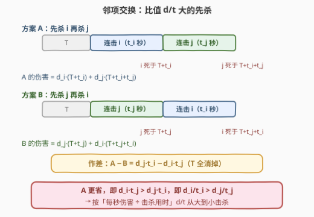
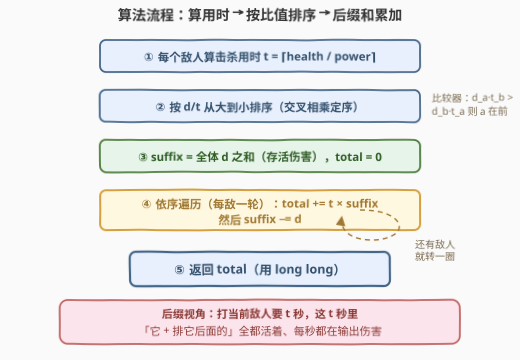
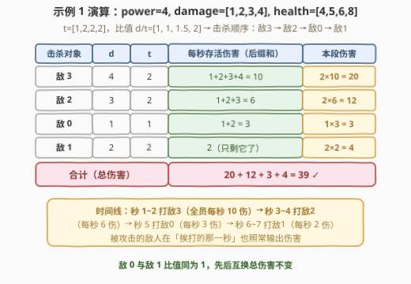

# 对 Bob 造成的最少伤害

- **题目名称**：对 Bob 造成的最少伤害
- **链接**：[3273. 对 Bob 造成的最少伤害](https://leetcode.cn/problems/minimum-amount-of-damage-dealt-to-bob/)
- **难度**：困难
- **标签**：贪心、数组、排序

## 1. 题目概述

给你一个整数 `power` 和两个长度都为 $n$ 的整数数组 `damage` 和 `health`。Bob 有 $n$ 个敌人：

- 若第 $i$ 个敌人**还活着**（$health[i] > 0$），每秒钟会对 Bob 造成 $damage[i]$ 点伤害；
- 每一秒，**敌人先对 Bob 结算伤害**，随后 Bob 选择**一个**还活着的敌人进行攻击，使其健康值减少 `power`。

请你返回 Bob 在**将所有 $n$ 个敌人都消灭之前**，最少会受到多少伤害。

**示例 1**：

```text
输入：power = 4, damage = [1,2,3,4], health = [4,5,6,8]
输出：39
解释：先连击敌人 3 两秒（期间每秒受到 10 点，共 20），再连击敌人 2 两秒
（每秒 6 点，共 12），再攻击敌人 0 一秒（3 点），最后连击敌人 1 两秒（4 点）。
```

**示例 2**：

```text
输入：power = 1, damage = [1,1,1,1], health = [1,2,3,4]
输出：20
```

**示例 3**：

```text
输入：power = 8, damage = [40], health = [59]
输出：320
```

**约束条件**：

- $1 \le power \le 10^4$
- $1 \le n = damage.length = health.length \le 10^5$
- $1 \le damage[i], health[i] \le 10^4$

> 💡 读题关键：① **伤害先于攻击结算**——正在被攻击的敌人在同一秒**仍然输出伤害**，所以一个敌人从第 1 秒一直活到它死亡的那一秒（含击杀它的那一秒），存活秒数恰好等于它的死亡时刻；② Bob 每秒只能攻击一个敌人，但可以**任意换目标**——「分散攻击」看似灵活，下文将证明专心连击不劣；③ 总伤害上界约 $10^{18}$，**必须用 64 位整数**。

---

## 2. 解题思路

### 2.1 暴力思路（枚举击杀顺序）

最朴素的方案：枚举 $n!$ 种「击杀顺序」，对每种顺序逐秒模拟——每秒先累加存活敌人的伤害，再对当前目标扣 `power`，直到全部消灭，取总伤害最小。

- 单次模拟 $O(n \cdot \sum t_i)$，加上 $O(n!)$ 的枚举，$n \le 10^5$ 完全不可行；
- 但模拟揭示了关键结构：**一旦确定击杀顺序，总伤害就被唯一确定**——每秒「谁还活着」只取决于前面敌人的死亡时刻。于是问题坍缩为一个**纯排序问题**：找一个顺序，最小化 $\sum$ 伤害 × 死亡时刻。

### 2.2 核心观察：连击不劣 + 按比值 $d/t$ 降序（邻项交换）



**观察 1（击杀用时与顺序无关）**：杀死敌人 $i$ 恰好需要

$$t_i = \left\lceil \frac{health[i]}{power} \right\rceil$$

次**有效攻击**——这些攻击发生在哪些秒无所谓，次数是固定的。

**观察 2（总伤害 = Σ 伤害 × 死亡时刻）**：由于每秒**先结算伤害再攻击**，敌人 $i$ 在第 $1 \sim D_i$ 秒全程存活（$D_i$ 为其死亡时刻，含被击杀的那一秒），共输出 $d_i \cdot D_i$ 点伤害：

$$\text{total} = \sum_i d_i \cdot D_i$$

**观察 3（专心连击不劣——下界论证）**：把敌人按死亡时刻排成 $e_1, e_2, \dots, e_n$。到第 $D_{e_k}$ 秒末，Bob 总共只完成过 $D_{e_k}$ 次攻击，而此时**前 $k$ 个敌人都已死**，至少消耗了 $\sum_{j \le k} t_{e_j}$ 次有效攻击，于是：

$$D_{e_k} \ \ge\ t_{e_1} + t_{e_2} + \cdots + t_{e_k}$$

因此**任何**调度方案（包括中途换目标的分散攻击）都满足：

$$\text{total} \ \ge\ \sum_{k=1}^{n} d_{e_k} \cdot \left(t_{e_1} + \cdots + t_{e_k}\right)$$

而**按该顺序连击**恰好取等号——每个敌人的死亡时刻正好是前缀用时和。所以最优解必然是「选定一个就打到死」，剩下的只是**决定顺序**。

**观察 4（邻项交换定序）**：设前面已耗时 $T$，比较相邻两个敌人 $i$、$j$ 的两种摆法（见上图）：

- 先 $i$ 后 $j$：伤害 $A = d_i(T + t_i) + d_j(T + t_i + t_j)$
- 先 $j$ 后 $i$：伤害 $B = d_j(T + t_j) + d_i(T + t_j + t_i)$

作差，公共项与 $T$ 全部消掉：

$$A - B = d_j \, t_i - d_i \, t_j$$

所以 **$i$ 放前面更省 $\iff d_i t_j > d_j t_i \iff \dfrac{d_i}{t_i} > \dfrac{d_j}{t_j}$**——按「每秒伤害 ÷ 击杀用时」的**比值从大到小**排序击杀。这正是调度理论中的 **Smith 法则（WSPT，加权最短加工时间优先）**。

> ⚠️ 实现细节：比较比值时用**交叉相乘**（$d_a \cdot t_b$ 与 $d_b \cdot t_a$）而非浮点除法，零精度误差；本题 $d, t \le 10^4$，乘积 $\le 10^8$，`int` 也装得下。若两个敌人比值相等，则 $A - B = 0$，先后互换总伤害不变，顺序随意。

### 2.3 算法流程图



三步走：算用时 → 按比值排序 → 后缀和累加。累加采用**后缀视角**：轮到敌人 $k$（用时 $t_k$）时，还没死的恰好是「$k$ 及其之后」的所有敌人，这 $t_k$ 秒里他们每秒都在输出伤害，故 `total += t_k × suffix`，随后把 $d_k$ 从后缀和里减掉。

### 2.4 示例演算



以示例 1（`power = 4`）为例：$t = [1, 2, 2, 2]$，比值 $d/t = [1,\ 1,\ 1.5,\ 2]$，按比值降序得击杀顺序 **敌 3 → 敌 2 → 敌 0 → 敌 1**：

| 击杀对象 | $d$ | $t$ | 每秒存活伤害（后缀和） | 本段伤害 |
|---------|-----|-----|----------------------|----------|
| 敌 3 | 4 | 2 | $1+2+3+4 = 10$ | $2 \times 10 = 20$ |
| 敌 2 | 3 | 2 | $1+2+3 = 6$ | $2 \times 6 = 12$ |
| 敌 0 | 1 | 1 | $1+2 = 3$ | $1 \times 3 = 3$ |
| 敌 1 | 2 | 2 | $2$ | $2 \times 2 = 4$ |

合计 $20 + 12 + 3 + 4 = 39$，与官方答案一致。示例 2 中四个敌人比值全为 1，任意顺序都得到 $4+6+6+4=20$。

---

## 3. 参考代码

### C++（交叉相乘比较器 + 后缀和）

```cpp
class Solution {
  public:
    long long minDamage(int power, vector<int>& damage, vector<int>& health) {
        int n = damage.size();
        vector<pair<long long, long long>> es(n);              // (d, t)
        for (int i = 0; i < n; i++)
            es[i] = {damage[i], (health[i] + power - 1LL) / power};  // ⌈h/p⌉
        // 比值 d/t 降序：交叉相乘，避免浮点误差
        sort(es.begin(), es.end(), [](const auto& a, const auto& b) {
            return a.first * b.second > b.first * a.second;
        });
        long long total = 0, suffix = 0;
        for (auto& [d, t] : es) suffix += d;                   // 后缀和初值：全员伤害总和
        for (auto& [d, t] : es) {
            total += t * suffix;   // 打它的 t 秒里，它和它后面的都在输出
            suffix -= d;           // 它死了，退出「存活集合」
        }
        return total;
    }
};
```

### Python（`cmp_to_key` 交叉相乘）

```python
from functools import cmp_to_key

class Solution:
    def minDamage(self, power: int, damage: List[int], health: List[int]) -> int:
        es = [(d, (h + power - 1) // power) for d, h in zip(damage, health)]
        # 比值 d/t 降序：交叉相乘比较，a 在前当且仅当 d_a·t_b > d_b·t_a
        es.sort(key=cmp_to_key(lambda a, b: b[0] * a[1] - a[0] * b[1]))
        total, suffix = 0, sum(d for d, _ in es)
        for d, t in es:
            total += t * suffix    # 打它的 t 秒里，所有还没死的都在输出
            suffix -= d
        return total
```

> 💡 Python 也可用 `Fraction(d, t)` 作排序键（精确分数，同样无误差）；或者维护「前缀用时和 $S$」的等价写法 `total += d × S`。注意逐秒模拟（$10^9$ 秒）会超时，公式化累加是必须的。

---

## 4. 复杂度分析

| 维度 | 复杂度 | 说明 |
|------|--------|------|
| 时间复杂度 | $O(n \log n)$ | 排序主导；算用时与后缀和累加均为 $O(n)$ |
| 空间复杂度 | $O(n)$ | 存 $(d, t)$ 二元组供排序（不计输出） |
| 暴力对照 | $O(n! \cdot n \cdot \sum t_i)$ | 枚举全排列逐秒模拟，$n \le 10^5$ 不可行 |

---

## 5. 扩展：单机调度视角（$1 \| \sum w_j C_j$ 与 Smith 法则）

把每个敌人看成一个「作业」：加工时间 $p_j = t_j$（击杀用时），权重 $w_j = d_j$（每秒伤害）；Bob 是单台机器，每秒加工一个单位；敌人的死亡时刻就是**完工时刻** $C_j$。总伤害 $\sum w_j C_j$ 正是调度理论的经典问题 $1 \| \sum w_j C_j$，最优策略即 **Smith 法则（WSPT）**：按 $w_j / p_j$ 降序加工——本题就是 WSPT 的一个故事化包装。

两个延伸结论（面试加分点）：

1. **允许「抢占」也不吃亏**：观察 3 的下界论证对任意调度成立——即便允许每秒随意换目标（抢占式调度），$\sum w_j C_j$ 仍不小于最优连击方案。对应调度结论：$1 \mid pmtn \mid \sum w_j C_j$ 的最优解就是无抢占的 WSPT 序，抢占带不来任何收益。
2. **结算顺序变体**：若把规则改成「先攻击、后结算伤害」，每个敌人恰好少输出 1 秒的伤害，总伤害整体减少 $\sum d_i$（常数），**最优顺序不变**——因为邻项交换的差式 $d_j t_i - d_i t_j$ 与结算先后无关。这说明交换论证比逐秒模拟更「稳」，改题面只需重推差式。

---

## 6. 面试要点

1. **为什么「专心连击」最优？中途换目标有没有可能更省？**

   - 不可能。按下界论证：按死亡时刻排序，第 $k$ 个死的敌人 $e_k$ 满足 $D_{e_k} \ge t_{e_1} + \cdots + t_{e_k}$（前 $k$ 个敌人至少消耗这么多有效攻击，而每秒只有一次攻击机会），连击方案恰好取等，故任何方案都不劣于对应的连击方案。

2. **排序规则怎么来的？为什么不能只按 $d$ 降序或只按 $t$ 升序？**

   - 邻项交换作差 $A - B = d_j t_i - d_i t_j$，先后取决于**两个量的比值** $d/t$（单位时间伤害收益），单看一维都会漏掉另一维。反例：$d=10, t=100$ 与 $d=1, t=1$——按 $d$ 降序会先啃「大血罐」，让高收益的小敌多活 1 秒。

3. **比较器为什么用交叉相乘？浮点比值真不行吗？**

   - 交叉相乘是零误差整数比较，且本题 $d \cdot t \le 10^8$ 不溢出。浮点在本题数值范围内其实也安全：两个不同分数的差 $\ge \frac{1}{bd} \ge 10^{-8}$，远大于 float64 约 $10^{-12}$ 的舍入误差——但这个安全性依赖数值范围分析，交叉相乘是无需分析的通用写法，面试中优先给出。

4. **总伤害怎么 $O(n)$ 累加？后缀和视角是什么？**

   - 轮到敌人 $k$ 时它耗时 $t_k$ 秒，这期间活着的恰是「$k$ 及其后」的所有人（后缀），故 `total += t_k × suffix; suffix -= d_k`，一遍扫完。等价的前缀视角是 `total += d_k × S_k`（$S_k$ 为含自身的用时前缀和）。

5. **溢出怎么估计？**

   - 总时长上限 $\le n \cdot \max t = 10^5 \times 10^4 = 10^9$ 秒，每秒伤害上限 $\le \sum d = 10^9$，粗界 $10^{18} < 9.2 \times 10^{18}$，`long long` 安全而 `int` 必炸；C++ 中 `(health[i] + power - 1LL)` 的 `1LL` 也是防溢出的细节。

---

## 7. 同类练习题

- [1665. 完成所有任务的最少初始能量](https://leetcode.cn/problems/minimum-initial-energy-to-finish-tasks/)：同款邻项交换排序贪心（按 actual − minimum 排序定序），交换差式定序的姊妹题
- [630. 课程表 III](https://leetcode.cn/problems/course-schedule-iii/)：单机调度贪心 + 可反悔堆（超时则撤换最长任务），调度类贪心进阶
- [1701. 平均等待时间](https://leetcode.cn/problems/average-waiting-time/)：SJF（最短作业优先）调度模拟，可看作权重全为 1 时 WSPT 的退化视角
- [870. 优势洗牌](https://leetcode.cn/problems/advantage-shuffle/)：排序贪心 + 田忌赛马配对，另一类「先排序再定策略」套路
- [1834. 单线程 CPU](https://leetcode.cn/problems/single-threaded-cpu/)：按时间驱动的任务调度模拟（堆选最短作业），对照理解本题为何能一步排序
