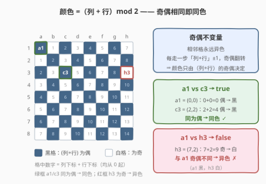
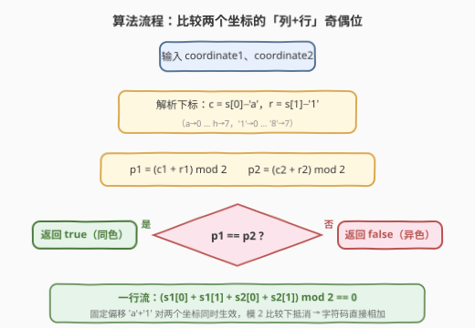
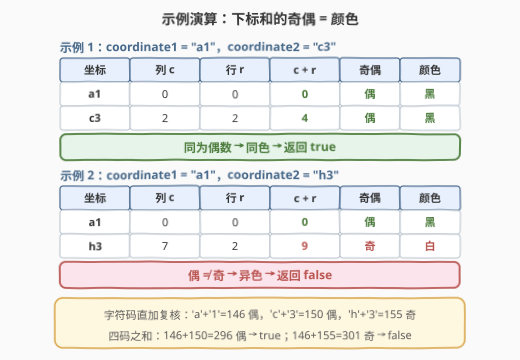

# LeetCode 检查棋盘方格颜色是否相同 题解

## 1. 题目概述

- **标题 / 题号**：检查棋盘方格颜色是否相同（#3274，easy）
- **链接**：https://leetcode.cn/problems/check-if-two-chessboard-squares-have-the-same-color/
- **难度**：简单
- **标签**：数学，字符串

**题意**：给你两个字符串 `coordinate1` 和 `coordinate2`，代表 `8 x 8` 国际象棋棋盘上两个方格的坐标。坐标格式总是**先字母（表示列）再数字（表示行）**。如果这两个方格颜色相同，返回 `true`，否则返回 `false`。坐标总是有效的棋盘方格。

**示例 1**：

```text
输入：coordinate1 = "a1", coordinate2 = "c3"
输出：true
解释：两个方格均为黑色。
```

**示例 2**：

```text
输入：coordinate1 = "a1", coordinate2 = "h3"
输出：false
解释：方格 "a1" 是黑色，而 "h3" 是白色。
```

**约束**：

- `coordinate1.length == coordinate2.length == 2`
- `'a' <= coordinate1[0], coordinate2[0] <= 'h'`
- `'1' <= coordinate1[1], coordinate2[1] <= '8'`

> 💡 读题关键：① 标准国际象棋棋盘 a1 为**黑**格，相邻格**永远异色**；② 本题只判「两格**是否同色**」，甚至不需要知道每格到底是黑还是白——这个更弱的判定条件里有更巧的捷径。

## 2. 解题思路

### 2.1 暴力思路：把棋盘画出来查表

最直接的做法是照题面模拟：建一个 `8 x 8` 的二维数组，用 `(i + j) % 2` 给每个格子染色，再把两个坐标解析成下标去查表比较：

```python
board = [[(i + j) % 2 for j in range(8)] for i in range(8)]   # 0=黑, 1=白
c1 = (ord(coordinate1[0]) - ord('a'), int(coordinate1[1]) - 1)
c2 = (ord(coordinate2[0]) - ord('a'), int(coordinate2[1]) - 1)
return board[c1[0]][c1[1]] == board[c2[0]][c2[1]]
```

正确性没有问题，但仔细看：`board[i][j]` 里存的**本来就是** `(i + j) % 2`——棋盘根本不用建，查表是把一个已经握在手里的公式绕道存了一遍再读出来。$O(64)$ 的建表纯属浪费，真正需要的只有那个 `% 2`。

### 2.2 核心观察：颜色 =（列 + 行）mod 2



**观察 1（奇偶不变量）**：从任意格出发向上下左右走一步，**要么列 ±1 要么行 ±1**，「列 + 行」的奇偶**必然翻转**——这正是「相邻格异色」的代数表述。于是任意两格的颜色关系只取决于「列 + 行」奇偶是否相同，与路径无关：

$$\text{color}(c, r) = (c + r) \bmod 2$$

其中 $c = s_0 - \texttt{'a'}$（列下标 0–7）、$r = s_1 - \texttt{'1'}$（行下标 0–7）。用基准格定标：$a1 = (0,0)$，和为 $0$（偶）→ 黑，与题面一致。

**观察 2（同色 ⇔ 奇偶相同）**：两格同色等价于两个「列 + 行」**奇偶相同**，又等价于四个下标之和为偶数：

$$\text{同色} \iff (c_1 + r_1) \equiv (c_2 + r_2) \pmod 2 \iff (c_1 + r_1 + c_2 + r_2) \bmod 2 = 0$$

**观察 3（偏移自动抵消）**：把下标还原成字符码，$c + r = (s_0 + s_1) - (\texttt{'a'} + \texttt{'1'})$。固定的偏移 $\texttt{'a'} + \texttt{'1'}$ 对**两个坐标同时**存在，做模 2 比较时两边同时减去同一个数、奇偶关系不变——于是连减法都不用做，**四个字符码直接相加判奇偶**即可：

$$(s_1[0] + s_1[1] + s_2[0] + s_2[1]) \bmod 2 = 0 \iff \text{同色}$$

### 2.3 算法流程图



流程只有三步：① 把每个坐标的字母/数字解析成 0 起始下标；② 各自求「列 + 行」的奇偶位 $p_1, p_2$；③ 比较两个奇偶位——相同即同色。配合观察 3，①②③ 可以合并成「四个字符码之和是否为偶数」的一次判断，一行搞定。

### 2.4 示例演算



以题给两个示例走一遍（下标从 0 起）：

| 坐标 | 列 $c$ | 行 $r$ | $c+r$ | 奇偶 | 颜色 |
|------|--------|--------|-------|------|------|
| a1   | 0      | 0      | 0     | 偶   | 黑   |
| c3   | 2      | 2      | 4     | 偶   | 黑   |
| h3   | 7      | 2      | 9     | **奇** | **白** |

- 示例 1：a1 与 c3 的和**同为偶** → 同色 → `true`；
- 示例 2：a1 的和为偶、h3 的和为**奇** → 异色 → `false`。

字符码视角复核：`'a'+'1' = 146`（偶）、`'c'+'3' = 150`（偶）、`'h'+'3' = 155`（奇）——四码之和 $146 + 150 = 296$ 为偶 → `true`；$146 + 155 = 301$ 为奇 → `false`，与下标版完全一致。

## 3. 参考代码

### C++（四个字符码之和判奇偶）

```cpp
class Solution {
  public:
    bool checkTwoChessboards(string coordinate1, string coordinate2) {
        // 'a'+'1' 的固定偏移对两个坐标同时生效，模 2 比较下自动抵消
        return (coordinate1[0] + coordinate1[1]
              + coordinate2[0] + coordinate2[1]) % 2 == 0;
    }
};
```

### Python（显式下标版 + 字符码一行流）

```python
class Solution:
    def checkTwoChessboards(self, coordinate1: str, coordinate2: str) -> bool:
        color = lambda s: (ord(s[0]) - ord('a') + ord(s[1]) - ord('1')) & 1
        return color(coordinate1) == color(coordinate2)
```

```python
class Solution:
    def checkTwoChessboards(self, coordinate1: str, coordinate2: str) -> bool:
        # 偏移 'a'+'1' 对两个坐标同时加上，模 2 比较下抵消，字符码直加即可
        return sum(map(ord, coordinate1 + coordinate2)) % 2 == 0
```

> 💡 C++ 的 `char` 本身就是整数，直接相加即可；Python 的 `str` 元素是字符，需 `ord()` 转码值（或拼接后一次性 `map(ord, ...)`）。

## 4. 复杂度分析

| 维度 | 复杂度 | 说明 |
|------|--------|------|
| 时间复杂度 | $O(1)$ | 固定读 4 个字符、三次加法一次取模 |
| 空间复杂度 | $O(1)$ | 无额外存储 |
| 查表版对照 | $O(64)$ / $O(64)$ | 显式建棋盘再查表，渐近同为常数，但纯属绕路 |

## 5. 扩展：三个等价视角

1. **曼哈顿距离视角**：同色 $\iff$ 两格的列差与行差之和 $\Delta c + \Delta r$ 为偶数——每走一步变色，走偶数步回到同色；也等价于「$\Delta c$ 与 $\Delta r$ 同奇偶」（所以同行、同列、同对角线的格子全部同色，这正是国际象棋里象走斜线永远踩同色格的原因）。
2. **异或视角**：$(c + r) \bmod 2 = (c \,\&\, 1) \oplus (r \,\&\, 1)$，颜色位就是列奇偶与行奇偶的**异或**；同色 $\iff (c_1 \oplus r_1 \oplus c_2 \oplus r_2) \,\&\, 1 = 0$，即四个下标中奇数的个数是偶数——与「四码之和为偶」是同一句话的两种写法。
3. **基准色无关性**：判定「是否同色」**不需要知道 a1 是黑是白**——把所有格颜色整体取反（换一种染色约定），同色关系分毫不变。这也是观察 3 中偏移是奇是偶都无所谓的根本原因：只要两个坐标带**同一个**偏移，模 2 比较时必然抵消。推广到 $n \times n$ 棋盘、或基准格约定不同的棋类，判定式原样适用。

## 6. 面试要点

1. **为什么不用真的建棋盘？**

   - 棋盘格颜色 $=(i+j)\bmod 2$ 本身就是闭式公式，建表存的就是这个公式；直接对两个坐标做奇偶比较即可，建表是纯绕路。

2. **为什么字符码可以直接相加，不用减 'a'、'1'？**

   - $c + r = (s_0 + s_1) - (\texttt{'a'} + \texttt{'1'})$，固定偏移对两个坐标**同时**存在，模 2 比较时两边同时减去同一个数，奇偶关系不变。

3. **怎么向面试官证明「颜色 =（列+行）mod 2」？**

   - 相邻格异色 ⇒ 每走一步「列+行」变化 $\pm 1$、奇偶翻转；任意两格的颜色关系只取决于步数的奇偶、与路径无关 ⇒ 颜色是「列+行」奇偶的函数；再用基准格 a1（黑，和为偶）定标即可。

4. **异或视角下这道题是什么？**

   - 颜色位 $= c_{\text{低位}} \oplus r_{\text{低位}}$；同色 $\iff$ 四个下标的异或最低位为 0，即其中奇数的个数为偶——与「四码之和为偶」完全等价。

5. **如果棋盘改成 n x n、或 a1 约定为白色，结论变吗？**

   - 不变。奇偶染色对任意 $n$ 成立；基准色整体取反不改变「同色」关系，判定式照旧（见第 5 节第 3 点）。

## 同类练习题

| # | 题目 | 与本题的关联 |
|---|------|-------------|
| 1812 | [判断国际象棋棋盘中一个格子的颜色](https://leetcode.cn/problems/determine-color-of-a-chessboard-square/) | 本题的「单格版」——要真正判出黑/白，需要用基准格定标 |
| 1523 | [在区间范围内统计奇数数目](https://leetcode.cn/problems/count-odd-numbers-in-an-interval-range/) | 奇偶性的数学计数，体会「前缀奇偶」的套路 |
| 1275 | [井字棋中的获胜者](https://leetcode.cn/problems/find-winner-on-a-tic-tac-toe-game/) | 同样解析坐标串为下标并模拟棋盘状态 |
| 1486 | [数组异或操作](https://leetcode.cn/problems/xor-operation-in-an-array/) | 异或与奇偶的同构手感（$\oplus$ 低位就是模 2 加法） |
