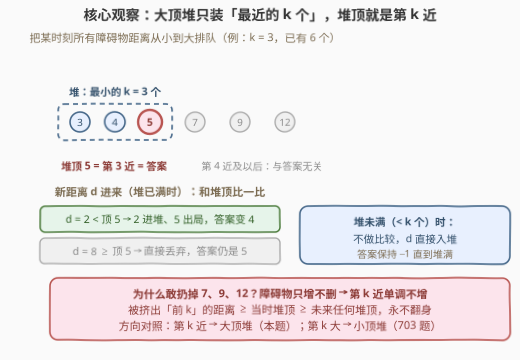
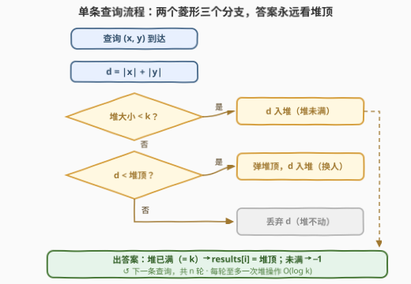
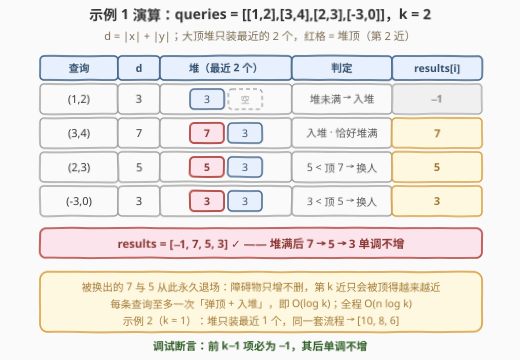

# 第 K 近障碍物查询

- **题目名称**：第 K 近障碍物查询
- **链接**：[3275. 第 K 近障碍物查询](https://leetcode.cn/problems/k-th-nearest-obstacle-queries/)
- **难度**：中等
- **标签**：数组、堆（优先队列）

## 1. 题目概述

有一个无限大的二维平面。给你一个正整数 $k$，同时给你一个二维数组 `queries`，包含一系列查询：

- $queries[i] = [x, y]$：在平面上坐标 $(x, y)$ 处建一个障碍物，数据保证之前的查询**不会**在这个坐标处建立任何障碍物；
- **每次查询后**，你需要找到离原点**第 $k$ 近**障碍物到原点的**距离**。

请你返回一个整数数组 `results`，其中 $results[i]$ 表示建立第 $i$ 个障碍物以后，离原点第 $k$ 近障碍物距离原点的距离；如果此时少于 $k$ 个障碍物，则 $results[i] = -1$。注意一开始没有任何障碍物。坐标 $(x, y)$ 处的点距离原点的距离定义为 $|x| + |y|$（**曼哈顿距离**）。

**示例 1**：

```text
输入：queries = [[1,2],[3,4],[2,3],[-3,0]], k = 2
输出：[-1,7,5,3]
解释：
- queries[0] 之后，少于 2 个障碍物，输出 -1；
- queries[1] 之后，两个障碍物距离原点的距离分别为 3 和 7，第 2 近是 7；
- queries[2] 之后，距离分别为 3、5、7，第 2 近是 5；
- queries[3] 之后，距离分别为 3、3、5、7，第 2 近是 3。
```

**示例 2**：

```text
输入：queries = [[5,5],[4,4],[3,3]], k = 1
输出：[10,8,6]
解释：三个障碍物的距离依次为 10、8、6，第 1 近（即最近）随之更新为 10 → 8 → 6。
```

**约束条件**：

- $1 \le queries.length \le 2 \times 10^5$
- 所有 $queries[i]$ 互不相同
- $-10^9 \le queries[i][0], queries[i][1] \le 10^9$
- $1 \le k \le 10^5$

> 💡 读题关键：① **障碍物只增不删**——集合单调扩大，这是后文「淘汰不可逆」与「大小为 $k$ 的堆」正确性的根基；② 距离是**曼哈顿距离** $|x|+|y|$，纯整数运算，无开方无浮点；③ 「第 $k$ 近」= 所有距离的**第 $k$ 小**，与「第 $k$ 大」（703 题）方向相反，堆的方向也随之相反。

---

## 2. 解题思路

### 2.1 暴力思路（每次全量重排）

最直接的做法：每建一个障碍物，就把**目前所有**距离收集起来排序，取第 $k$ 小。第 $i$ 次查询耗时 $O(i \log i)$，总计 $O(n^2 \log n)$——$n = 2 \times 10^5$ 时约 $10^{11}$ 量级，必然超时。

稍作改进：维护一个**有序数组**，新距离二分找位插入。查找 $O(\log n)$，但插入后移位 $O(n)$，总计仍是 $O(n^2)$，依旧不可行。

问题的本质浮出水面：这是一个**强制在线**的 Top-$k$ 维护——每来一个元素必须**立刻**回答「当前第 $k$ 小」，且元素**只增不删**。我们需要一个「插入后马上知道第 $k$ 小」的轻量结构。

### 2.2 核心观察：大小为 $k$ 的大顶堆——「最近的 $k$ 个」的守门员



**观察 1（第 $k$ 近 = 最小 $k$ 元素中的最大值）**：把当前所有障碍物的距离从小到大排好，第 $k$ 近就是**前 $k$ 个里最大的那个**。于是无需记住全部距离，只需维护「**距离最小的 $k$ 个**」组成的集合——它的最大值就是答案。

**观察 2（被淘汰者永不翻身——单调性）**：障碍物只增不删。设某时刻第 $k$ 近的距离为 $D$：

- 新来的 $d \ge D$：它至少排第 $k+1$ 位，与答案无关；
- 此后集合只会更大，而**集合变大，第 $k$ 小只会变小或不变**。

于是任何时刻被挤出「前 $k$ 近」的距离 $d' \ge$ 当时第 $k$ 近 $\ge$ 未来任意时刻的第 $k$ 近——**淘汰是不可逆的**，这正是「只维护 $k$ 个」的正确性依据。

> 💡 **推论（可直接当调试断言）**：$results$ 的前 $k-1$ 项必为 $-1$；从第 $k$ 项起**单调不增**。示例 1 的 $7, 5, 3$、示例 2 的 $10, 8, 6$ 都是肉眼可见的递减。

**观察 3（为什么是大顶堆而不是小顶堆）**：要随时读出「最小 $k$ 个中的最大值」，天然结构就是**最大堆（大顶堆）**，堆顶即第 $k$ 近。每个新距离 $d$ 只有三条路：

1. 堆未满（大小 $< k$）→ 直接入堆；
2. 堆已满且 $d <$ 堆顶 → 弹出堆顶、$d$ 入堆（第 $k$ 近「换人」）；
3. 堆已满且 $d \ge$ 堆顶 → 丢弃 $d$（它已是第 $k+1$ 近或更远，永远无关）。

> ⚠️ 本题最常见 bug 是**堆方向搞反**：求「第 $k$ 大」（703 题）才维护「最大的 $k$ 个 + 小顶堆」；求「第 $k$ 近 / 第 $k$ 小」（本题）要维护「最小的 $k$ 个 + 大顶堆」。口诀：**答案永远长在所维护那 $k$ 个的「外侧端点」上**——留最小的 $k$ 个，暴露其最大值，自然是堆顶朝上的大顶堆。

### 2.3 算法流程图



每条查询三步走：**算距离 → 三岔判定（入堆 / 换人 / 丢弃）→ 看堆顶出答案**。堆大小始终不超过 $k$，故每条查询至多一次 $O(\log k)$ 的堆操作。

### 2.4 示例演算



以示例 1（$k=2$）为例逐步推演（详表见上图）：

| $i$ | 查询 | $d=\lvert x\rvert+\lvert y\rvert$ | 堆（最近 2 个） | 判定 | $results[i]$ |
|---|------|-----|------|------|------|
| 0 | $(1,2)$ | 3 | $\{3\}$ | 堆未满 → 入堆 | $-1$ |
| 1 | $(3,4)$ | 7 | $\{3,7\}$ | 入堆后恰好堆满，顶 = 7 | 7 |
| 2 | $(2,3)$ | 5 | $\{3,5\}$ | $5 < 7$ → 换人 | 5 |
| 3 | $(-3,0)$ | 3 | $\{3,3\}$ | $3 < 5$ → 换人 | 3 |

输出 $[-1, 7, 5, 3]$，与官方一致。注意被换出的 7 和 5 从此永久退场——即使后面再来 100 个更远的障碍物也轮不到它们。

---

## 3. 参考代码

### C++（`priority_queue` 大顶堆）

```cpp
class Solution {
  public:
    vector<int> resultsArray(vector<vector<int>>& queries, int k) {
        priority_queue<int> pq;          // 大顶堆：始终持有「距离最小的 k 个」，堆顶 = 第 k 近
        vector<int> res;
        res.reserve(queries.size());
        for (auto& q : queries) {
            int d = abs(q[0]) + abs(q[1]);      // 曼哈顿距离，上界 2×10^9 恰在 int 范围内
            if ((int)pq.size() < k) {
                pq.push(d);                     // ① 堆未满：直接入堆
            } else if (d < pq.top()) {
                pq.pop();                       // ② 比第 k 近还近：换人
                pq.push(d);
            }                                   // ③ 否则丢弃 d，堆不动
            res.push_back((int)pq.size() == k ? pq.top() : -1);
        }
        return res;
    }
};
```

### Python（`heapq` 存负数模拟大顶堆）

```python
import heapq

class Solution:
    def resultsArray(self, queries: List[List[int]], k: int) -> List[int]:
        heap = []                    # 存「负距离」：小顶堆摇身一变成大顶堆，大小 ≤ k
        res = []
        for x, y in queries:
            d = abs(x) + abs(y)
            if len(heap) < k:
                heapq.heappush(heap, -d)          # ① 堆未满：直接入堆
            elif d < -heap[0]:
                heapq.heapreplace(heap, -d)       # ② 弹堆顶 + 入新值，一次堆调整搞定
            res.append(-heap[0] if len(heap) == k else -1)
        return res
```

> 💡 实现细节：Python 的 `heapq` 只有小顶堆，存负距离即得大顶堆；`heapreplace` 一次完成「弹顶 + 入堆」，比 `heappop` 后再 `heappush` 少一次堆调整。C++ 的 `priority_queue<int>` 默认就是大顶堆，零成本直用。
>
> ⚠️ **数值边界**：$|x| + |y| \le 2 \times 10^9$，恰好落在 `int` 上限（约 $2.147 \times 10^9$）之内、但只差约 7%——本题用 `int` 侥幸安全，约束再抬一点就必须 `long long`。面试中主动点破这一边界分析是加分项。

---

## 4. 复杂度分析

| 维度 | 复杂度 | 说明 |
|------|--------|------|
| 时间复杂度 | $O(n \log k)$ | 每条查询至多一次堆操作，堆大小 $\le k$ |
| 空间复杂度 | $O(k)$ | 堆里最多 $k$ 个距离（不计输出数组） |
| 暴力对照 | $O(n^2 \log n)$ | 每次全量重排；有序数组插入也只是 $O(n^2)$ |

---

## 5. 扩展：在线 Top-$k$ 维护全家桶

本题是「**只增不删 + 即时回答第 $k$ 小**」的最简形态。围绕「流」上的 Top-$k$，各变体的武器选择各不相同：

| 场景 | 结构 | 代表题 |
|------|------|--------|
| 只增不删，问第 $k$ 小 | 大小为 $k$ 的大顶堆 | 3275（本题） |
| 只增不删，问第 $k$ 大 | 大小为 $k$ 的小顶堆 | [703. 数据流中的第 K 大元素](https://leetcode.cn/problems/kth-largest-element-in-a-stream/) |
| 离线一次性第 $k$ 大 | 快速选择，平均 $O(n)$ | [215. 数组中的第K个最大元素](https://leetcode.cn/problems/kth-largest-element-in-an-array/) |
| 要最近 / 最小的 $k$ 个（而非第 $k$ 个） | 同一个大小为 $k$ 的堆，最后整体倒出 | [973. 最接近原点的 K 个点](https://leetcode.cn/problems/k-closest-points-to-origin/) |
| 有删除（滑动窗口最值） | 单调队列 / 懒删除堆 | [239. 滑动窗口最大值](https://leetcode.cn/problems/sliding-window-maximum/) |

关键分野在于**删除**：一旦集合会收缩，「被淘汰者永不翻身」失效——窗口左端移出的元素可能重新成为答案，大小为 $k$ 的堆就不够了，需要懒删除（堆顶打标记、过期再弹）或单调队列（能从队头出队的才配维护窗口最值）。另一个分野是**在线 / 离线**：215 题所有数据一次给齐，可用快速选择做到平均 $O(n)$；本题每插一个必须立刻回答（强制在线），快速选择无从发挥，堆才是正确姿势。

---

## 6. 面试要点

1. **为什么维护的是「最小的 $k$ 个 + 大顶堆」？怎么快速判断堆的方向？**

   第 $k$ 近 = 距离第 $k$ 小 = 最小的 $k$ 个元素中的最大值，所以留下的 $k$ 个要能随时报出其**最大值** → 大顶堆。口诀：答案长在所维护 $k$ 个的「外侧端点」——留最小的 $k$ 个暴露最大值（大顶堆），留最大的 $k$ 个暴露最小值（小顶堆，703 题）。

2. **被弹出堆的元素，之后会不会重新成为答案？**

   不会。障碍物只增不删，第 $k$ 小随集合扩大单调不增；被挤出前 $k$ 的距离 $\ge$ 当时第 $k$ 近 $\ge$ 未来任意时刻第 $k$ 近，永不翻身。若题目改成「可删除」（如滑动窗口），此论证失效，需懒删除堆或单调队列。

3. **堆大小为什么压到 $k$？收益何在？**

   空间 $O(k)$、时间 $O(n \log k)$。全量堆或排序是 $O(n \log n)$：$k \ll n$ 时差距巨大（如 $k=10$、$n=10^6$，$\log k \approx 3.3$ 对 $\log n \approx 20$）；本题 $k \le 10^5$、$n \le 2\times10^5$ 同数量级，收益温和，但 $O(n \log k)$ 始终不劣。

4. **距离要开方吗？会不会溢出？**

   曼哈顿距离 $|x|+|y|$ 本就是整数，直接加即可；即便题目给欧氏距离，比较远近也该用平方避免浮点。数值上 $|x|+|y| \le 2\times10^9$，恰好低于 `INT_MAX`（$2147483647$）约 7%——`int` 侥幸够用，稍紧的约束就要 `long long`，这一边界要能随口算出。

5. **本题与 703 题（数据流第 K 大）是什么关系？**

   镜像姊妹题：同为「在线流 + 大小为 $k$ 的堆」，但本题问第 $k$ **小**（留最小 $k$ 个、大顶堆），703 问第 $k$ **大**（留最大 $k$ 个、小顶堆）。此外本题多了「不足 $k$ 个输出 $-1$」的前缀阶段，以及答案序列**单调不增**这一独有性质。

---

## 7. 同类练习题

- [703. 数据流中的第 K 大元素](https://leetcode.cn/problems/kth-largest-element-in-a-stream/)：镜像姊妹题——在线求第 k 大，维护大小为 k 的小顶堆，堆方向与本题相反
- [973. 最接近原点的 K 个点](https://leetcode.cn/problems/k-closest-points-to-origin/)：同样按「离原点距离」选最近 K 个，一次性离线版，堆装满后整体倒出
- [215. 数组中的第K个最大元素](https://leetcode.cn/problems/kth-largest-element-in-an-array/)：离线第 k 大，快速选择平均 O(n)，对照本题「强制在线」只能用堆
- [239. 滑动窗口最大值](https://leetcode.cn/problems/sliding-window-maximum/)：流式最值但**有删除**——对照理解本题「只增不删」为何无需懒删除/单调队列
- [347. 前 K 个高频元素](https://leetcode.cn/problems/top-k-frequent-elements/)：Top-K 堆经典题，同款「只留 K 个、其余丢弃」的守门员套路
