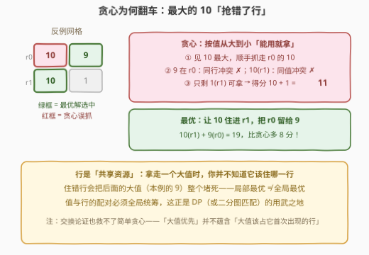
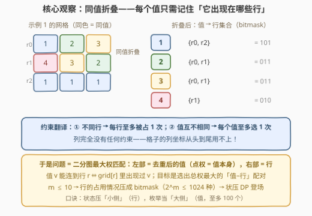
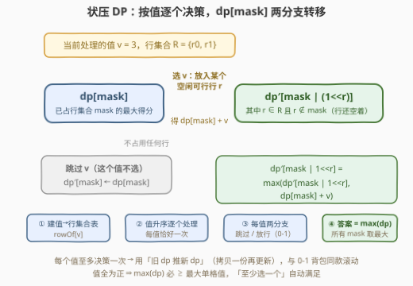
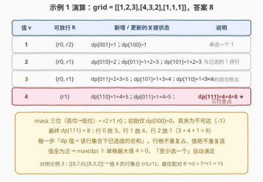

# LeetCode 选择矩阵中单元格的最大得分 题解

## 1. 题目概述

- **标题 / 题号**：选择矩阵中单元格的最大得分（#3276，hard）
- **链接**：https://leetcode.cn/problems/select-cells-in-grid-with-maximum-score/
- **难度**：困难
- **标签**：位运算、数组、动态规划、状态压缩、矩阵

**题意**：给你一个由正整数构成的二维矩阵 `grid`。你需要从矩阵中选择**一个或多个**单元格，选中的单元格应满足以下条件：

- 所选单元格中的任意两个单元格都**不会处于矩阵的同一行**；
- 所选单元格的值**互不相同**。

你的得分为所选单元格值的**总和**。返回你能获得的**最大**得分。

**示例 1**：

```text
输入：grid = [[1,2,3],[4,3,2],[1,1,1]]
输出：8
解释：选择值分别为 1、3、4 的三个单元格（分别在行 2、行 0、行 1），得分 1 + 3 + 4 = 8。
```

**示例 2**：

```text
输入：grid = [[8,7,6],[8,3,2]]
输出：15
解释：选择值分别为 7 和 8 的两个单元格（分别在行 1、行 0），得分 7 + 8 = 15。
```

**约束**：

- $1 \le grid.length, grid[i].length \le 10$
- $1 \le grid[i][j] \le 100$

> 💡 读题关键：① 约束只有「**不同行**」和「**值互不相同**」两条——**列完全没有约束**，格子的列坐标从头到尾用不上，一个格子本质上就是（行，值）二元组；② 值域 $1 \sim 100$ 而行列 $\le 10$，提示「去重后的值」至多 100 个、行至多 10 个——**行这一侧小得可以 bitmask**。

## 2. 解题思路

### 2.1 暴力思路（贪心翻车 + 朴素枚举爆炸）

**路线一：贪心「从大到小，能用就拿」**——把所有格子按值降序排列，逐个尝试：值没被用过且所在行空闲就拿。很遗憾这是错的：



反例 `grid = [[10,9],[10,1]]`：贪心先抓走行 0 的 10，导致 9（同行冲突）和行 1 的 10（同值冲突）全部出局，只能补一个 1，得分 $10+1=11$；而最优解让 10 住进行 1、把行 0 留给 9，得分 $10+9=19$。**行是共享资源**：拿走一个值时你并不知道它该住哪一行，住错行会把后面的大值整个堵死——配对必须全局统筹。

**路线二：朴素枚举**——每行有「选某一格 / 不选」共 $n+1$ 种选择，全部组合 $(n+1)^m \le 11^{10} \approx 2.6 \times 10^{10}$，直接爆炸。剪枝也救不回来，需要换视角。

### 2.2 核心观察：同值折叠 + 状压 DP（压小侧、枚举大侧）



**观察 1（同值折叠）**：值相同的格子命运完全一样——选值 $v$ 时唯一要做的事是「**占用一个含 $v$ 的行**」，具体是哪一列、哪一格无关紧要。于是把同值格子折叠成一张表：$rowOf[v] = $ 值 $v$ 出现过的行集合（用 bitmask 表示，第 $i$ 行对应第 $i$ 位）。$10 \times 10 = 100$ 个格子折叠后只剩至多 $\min(100, 值域) = 100$ 个互不相同的值。

**观察 2（问题重述为配对）**：原问题等价于——给**一部分去重后的值**各分配一个**互不相同**的行，且值 $v$ 只能分到含 $v$ 的行，最大化所选值之和。左部是值（点权 = 值本身）、右部是行，这正是**二分图最大权匹配**的形态。

**观察 3（压小侧、枚举大侧）**：值有 $\le 100$ 个（$2^{100}$ 状态不可压），行只有 $\le 10$ 个（$2^{10} = 1024$ 状态可压）。于是让**值当 DP 的「阶段」**（像 0-1 背包的物品逐个决策），**行占用集合当「状态」**：

$$dp[mask] = \text{已占用行集合恰为 } mask \text{ 时，已选值的最大总和}$$

转移——处理值 $v$（行集合 $R = rowOf[v]$）时每个值恰好决策一次，两分支：

- **跳过 $v$**：$dp'[mask] \leftarrow dp[mask]$；
- **选 $v$**：放入 $R$ 中任一**空闲**行 $r$（$r \in R$ 且 $r \notin mask$）：$dp'[mask \,|\, (1 \ll r)] = \max(dp'[mask \,|\, (1 \ll r)],\ dp[mask] + v)$。

初始 $dp[0] = 0$，其余标记为不可达（$-1$）；**答案 $= \max(dp)$**——值全为正，最优解必然非空，「至少选一个」自动满足。因为每个值是独立的 0/1 决策，**处理顺序不影响答案**（同背包物品顺序无关），排序升序只为确定性。

> ⚠️ 最常见的实现 bug：转移时直接原地更新 `dp`，会让同一个值 $v$ 被「选了又选」——必须**拷贝一份旧 dp 推新 dp**（或等价地保证 0/1 语义），与 0-1 背包的滚动数组同理。

### 2.3 算法流程图



四步走：**建「值→行集合」表 → 值升序逐个处理 → 每值两分支（跳过 / 放入空闲可行行）→ 全部处理完取 $\max(dp)$**。枚举 $R$ 中的行用位运算 $r \& (r-1)$ 逐个取最低位 1，写起来干净利落。

### 2.4 示例演算



以示例 1（$m = 3$ 行）为例，mask 三位从高位到低位是 $r_2 r_1 r_0$：

| 处理值 $v$ | 可放行 $R$ | 新增 / 更新的关键状态 | 说明 |
|-----------|-----------|----------------------|------|
| $v=1$ | $\{r_0, r_2\}$ | $dp[001]=1$，$dp[100]=1$ | 单选一个 1 |
| $v=2$ | $\{r_0, r_1\}$ | $dp[010]=2$，$dp[011]=1+2=3$，$dp[101]=1+2=3$ | 与已选的 1 拼行 |
| $v=3$ | $\{r_0, r_1\}$ | $dp[011]=2+3=5$，$dp[101]=1+3=4$，$dp[110]=1+3=4$ | $2+3$ 的组合胜出 |
| $v=4$ | $\{r_1\}$ | $dp[110]=1+4=5$，$dp[011]=1+4=5$，$\boldsymbol{dp[111]=4+4=8}$ ★ | 三行全占 |

最终 $\max(dp) = dp[111] = 8$：行 0 放 3、行 1 放 4、行 2 放 1（$3+4+1=8$），与官方答案一致。对照示例 2：值 8 的行集合是 $\{r_0, r_1\}$，最优配对 $8 \to r_0$、$7 \to r_1$，得分 $15$。

## 3. 参考代码

### C++

```cpp
class Solution {
  public:
    int maxScore(vector<vector<int>>& grid) {
        int m = grid.size();

        // ① 同值折叠：值 v -> 出现过 v 的行集合（第 i 行对应 bit i）
        unordered_map<int, int> rowOf;
        for (int i = 0; i < m; ++i)
            for (int v : grid[i])
                rowOf[v] |= 1 << i;

        // 去重后的值升序处理（顺序不影响答案，只为确定性）
        vector<pair<int, int>> vals(rowOf.begin(), rowOf.end());
        sort(vals.begin(), vals.end());

        // ② 状压 DP：dp[mask] = 已占用行集合恰为 mask 时的最大得分
        int full = 1 << m;
        vector<int> dp(full, -1);          // -1 = 该状态不可达
        dp[0] = 0;
        for (auto& [v, rows] : vals) {
            vector<int> ndp = dp;          // 分支一：跳过 v（旧 dp 推新 dp）
            for (int mask = 0; mask < full; ++mask) {
                if (dp[mask] < 0) continue;
                for (int r = rows; r; r &= r - 1) {  // 逐个取出 rows 里的行
                    int b = r & -r;
                    if (mask & b) continue;           // 该行已被占
                    ndp[mask | b] = max(ndp[mask | b], dp[mask] + v);
                }
            }
            dp = move(ndp);
        }
        return *max_element(dp.begin(), dp.end());
    }
};
```

### Python

```python
class Solution:
    def maxScore(self, grid: List[List[int]]) -> int:
        m = len(grid)

        # ① 同值折叠：值 v -> 出现过 v 的行集合（第 i 行对应 bit i）
        row_of = {}
        for i, row in enumerate(grid):
            for v in row:
                row_of[v] = row_of.get(v, 0) | (1 << i)

        full = 1 << m
        # ② 状压 DP：dp[mask] = 已占用行集合恰为 mask 时的最大得分
        dp = [-1] * full                   # -1 = 该状态不可达
        dp[0] = 0
        for v in sorted(row_of):           # 每个去重后的值恰好决策一次
            rows = row_of[v]
            ndp = dp[:]                    # 分支一：跳过 v（旧 dp 推新 dp）
            for mask in range(full):
                if dp[mask] < 0:
                    continue
                rest = rows & ~mask        # 可放且仍空闲的行
                while rest:
                    b = rest & -rest       # 取出最低位的 1（某一行）
                    rest ^= b
                    if dp[mask] + v > ndp[mask | b]:
                        ndp[mask | b] = dp[mask] + v
            dp = ndp
        return max(dp)
```

> 💡 实现细节：枚举行集合用 `r &= r - 1` 消最低位 1 的技巧（承接 [191. 位 1 的个数](https://leetcode.cn/problems/number-of-1-bits/)），免掉内层 `for r in range(m)` 的无效枚举；`-1` 标记不可达，避免「行被占但得分为 0」的假状态参与转移（本题值全正，用 0 初始化碰巧也能对，但 $-1$ 语义更严谨、更抗改动）。

## 4. 复杂度分析

| 维度 | 复杂度 | 说明 |
|------|--------|------|
| 时间复杂度 | $O(D \cdot 2^m \cdot m)$ | $D$ 为去重后的值个数（$\le \min(mn, 100)$），每个值对 $2^m$ 个状态各做 $\le m$ 次放行转移；最坏 $100 \times 1024 \times 10 \approx 1.3 \times 10^6$ |
| 空间复杂度 | $O(2^m)$ | dp 滚动数组仅 $2^m \le 1024$ 项（值→行集合表 $O(D)$ 可忽略） |
| 暴力对照 | $O((n+1)^m)$ | 每行「选一格或不选」的全组合，$\le 11^{10} \approx 2.6 \times 10^{10}$，不可行 |

## 5. 扩展：规模变大怎么办——二分图最大权匹配视角

把去重后的值当左部、行当右部，$v$ 与 $r$ 之间连边当且仅当 $grid[r]$ 中出现过 $v$，边权为 $v$，本题就是**最大权匹配**（不必完美匹配，可以少选）。理论上 KM 算法 $O(n^3)$ 可解：构造 $D \times m$ 的权矩阵（无边处填 $-\infty$ 或补 0 虚边化为完美匹配）。对本题 $m \le 10$ 的规模纯属杀鸡用牛刀——状压 DP 更短更快，但这一视角指明了泛化方向：

- **行数增大**：$m = 20$ 时 $2^{20} \approx 10^6$ 尚可；$m = 30$ 起 bitmask 彻底失效，此时匹配算法（KM / 费用流）才是正解；
- **值域增大**（如 $10^9$）：对本文解法**毫无影响**——值只是「阶段」不是「状态」，$D$ 上限由格子总数 $mn$ 决定，与值域大小无关。这正是「压小侧、枚举大侧」的红利。

另一个等价实现是官方 hint 的路线：把所有格子按值排序后做 dp(格子下标, 行 mask)，同值格子作为一组「组内至多选一个」处理——与本文的值视角殊途同归，但等值组的边界处理更容易写错，不如直接按值去重来得干净。

## 6. 面试要点

1. **为什么同值的格子可以折叠成一个「行集合」？**

   值相同的格子唯一区别是所在行；选中某个值 $v$ 只消耗「一个含 $v$ 的行」，与列无关（题目对列零约束）。等价类压缩后，$100$ 个格子变成 $\le 100$ 个值 → 行集合的映射，DP 阶段也从「格子」变成「值」，天然满足「值互不相同」（每个值至多决策一次）。

2. **贪心「从大到小能拿就拿」为什么错？能靠交换论证修好吗？**

   反例 `[[10,9],[10,1]]`：贪心 $11$，最优 $19$。错的根源是行是共享资源，先拿大值时不知道该把它安置到哪一行，占错行会堵死后面的组合。简单交换论证救不了——「大值优先」并不蕴含「大值该占它首次出现的行」；配对问题需要全局最优性，DP / 匹配是正解。

3. **状态为什么压「行」不压「值」？**

   行 $\le 10$（$2^{10} = 1024$），值至多 $100$ 个（$2^{100}$ 天文数字）。口诀：**压小侧、枚举大侧**——小侧进状态、大侧当阶段。与 [1434. 每个人戴不同帽子的方案数](https://leetcode.cn/problems/number-of-ways-to-wear-different-hats-to-each-other/) 对照：那题人 $\le 10$、帽子 $\le 40$，于是压人、枚举帽子；本题行 $\le 10$、值 $\le 100$，于是压行、枚举值。两侧谁小压谁是通用决策法则。

4. **处理值的顺序（升序 / 降序）会影响结果吗？**

   不会。每个值是独立的 0/1 决策（跳过或占用一行），最终每个 mask 记录的是「从所有值中选出一个可安置子集」的最优和——这与 0-1 背包中物品枚举顺序无关是同一个道理。排序只为实现确定性。真正要小心的是**同一值只能转移一次**：必须用旧 dp 拷贝出新 dp，原地更新会变成完全背包式的「重复选」。

5. **「至少选一个单元格」这个条件怎么保证？$-1$ 初始化又是为什么？**

   值域 $1 \sim 100$ 全为正，任何单格都是合法方案，$\max(dp) \ge$ 最大单格值 $> 0 = dp[0]$，答案天然非空。$-1$ 标记不可达状态，语义是「行集合 mask 恰被某组互异值占用」；若用 0 初始化，会出现「行被占但没加分」的假状态——本题因全正权侥幸无害，但若题目改为「值可为 0 或负、且要求恰好选若干个」就会出错，严谨写法应保留可达性标记。

## 同类练习题

| # | 题目 | 与本题的关联 |
|---|------|-------------|
| 1434 | [每个人戴不同帽子的方案数](https://leetcode.cn/problems/number-of-ways-to-wear-different-hats-to-each-other/) | 「帽子→人」分配的状压 DP，与本题「值→行」结构同构，方向对照：压人（≤10）枚举帽子；本题求最大权、那题求方案数 |
| 1595 | [连通两组点的最小成本](https://leetcode.cn/problems/minimum-cost-to-connect-two-groups-of-points/) | 二分图两侧配对 + bitmask 的进阶版，两侧都要全覆盖、求最小成本，难点在第二侧的贪心衔接 |
| 1125 | [最小的必要团队](https://leetcode.cn/problems/smallest-sufficient-team/) | 技能集合用 bitmask 覆盖、求最少人数，状态压缩 DP 经典 |
| 2305 | [公平分发饼干](https://leetcode.cn/problems/fair-distribution-of-cookies/) | 子集枚举 + 状压 DP 入门，体会「枚举大侧」的另一种姿势 |
| 526 | [优美的排列](https://leetcode.cn/problems/beautiful-arrangement/) | bitmask DP 最小甜区（n ≤ 15）入门题（本仓库已有题解） |
