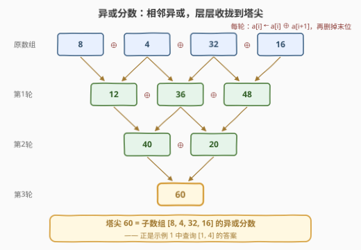
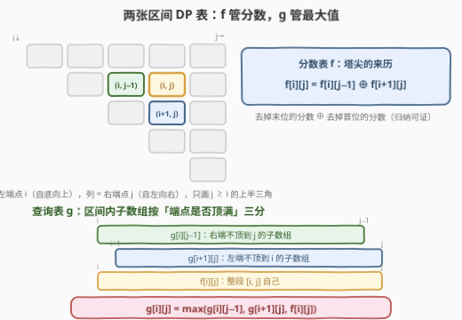
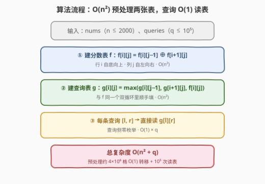
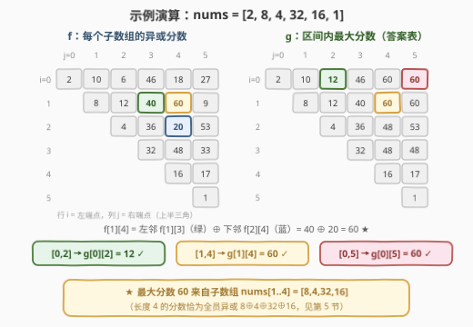

# LeetCode 查询子数组最大异或分数 题解

## 1. 题目概述

- **标题 / 题号**：查询子数组最大异或分数（#3277，hard）
- **链接**：https://leetcode.cn/problems/maximum-xor-score-subarray-queries/
- **难度**：困难
- **标签**：数组、动态规划、区间 DP、位运算

**题意**：给你一个长度为 $n$ 的整数数组 $nums$，以及一个长度为 $q$ 的二维整数数组 $queries$，其中 $queries[i] = [l_i, r_i]$。

数组的**异或分数**通过反复执行以下操作定义，直到只剩一个元素，剩下的元素就是异或分数：

- 对于除最后一个下标外的所有下标 $i$，**同时**将 $a[i]$ 替换为 $a[i] \oplus a[i+1]$；
- 移除数组的最后一个元素。

对每个查询，你需要找出 $nums[l_i..r_i]$ 中**任意子数组**（不只是 $nums[l_i..r_i]$ 本身）的最大异或分数。返回数组 $answer$，$answer[i]$ 为第 $i$ 个查询的答案。

**示例 1**：

```text
输入：nums = [2,8,4,32,16,1], queries = [[0,2],[1,4],[0,5]]
输出：[12,60,60]
解释：查询 [0,2] 内子数组 [2],[8],[4],[2,8],[8,4],[2,8,4] 的分数分别为 2,8,4,10,12,6，最大 12；
     查询 [1,4] 内最大分数来自子数组 nums[1..4] 自身，为 60；
     查询 [0,5] 内最大分数同样来自子数组 nums[1..4]，为 60。
```

**示例 2**：

```text
输入：nums = [0,7,3,2,8,5,1], queries = [[0,3],[1,5],[2,4],[2,6],[5,6]]
输出：[7,14,11,14,5]
```

**约束**：

- $1 \le n = nums.length \le 2000$
- $0 \le nums[i] \le 2^{31} - 1$
- $1 \le q = queries.length \le 10^5$
- $queries[i] = [l_i, r_i]$ 且 $0 \le l_i \le r_i \le n-1$

> 💡 读题关键：① $n \le 2000$ 把预处理预算钉在 $O(n^2) = 4 \times 10^6$——这是「区间 DP / 二维预处理表」的典型甜区；② $q \le 10^5$ 与 $n$ 的量级刻意错开，说明**每条查询只允许 $O(1)$ 拿答案**，任何「查询时再枚举区间内子数组」的做法都是 $O(qn^2) = 4 \times 10^{11}$ 必然超时；③ 查询要的是区间内**任意子数组**的最大分数，不是区间本身的分数——「谁在枚举子数组」是本题第一个坑；④ 异或不会让数值变大，全程 32 位整数即可，无溢出问题。

## 2. 解题思路

### 2.1 暴力思路：三层嵌套

最朴素的实现：对每条查询 $[l, r]$，枚举区间内 $O\bigl((r-l+1)^2\bigr)$ 个子数组，每个子数组按定义模拟归约 $O(\text{len})$ 轮——单查询 $O(n^3) = 8 \times 10^9$。

第一个优化显而易见：**子数组的分数与查询无关**，可以一次算全。设 $f(i,j)$ 为 $nums[i..j]$ 的异或分数，$n \le 2000$ 意味着「只有」约 $2 \times 10^6$ 个子数组……但逐个模拟总时长 $\sum \text{len} \approx n^3/6 \approx 1.3 \times 10^9$；就算 $f$ 表免费送，每条查询在区间内扫所有子数组取 max 又是 $O(n^2)$/查询。瓶颈有两处：**分数怎么算得快**、**区间内最大值怎么不枚举**。前者靠递推把 $O(\text{len})$ 压成 $O(1)$，后者靠第二张 DP 表把「区间聚合」也预处理掉。

### 2.2 核心观察：分数的「去首去尾」递推 + 最大值的区间 DP

**观察一：$f(i,j) = f(i,j-1) \oplus f(i+1,j)$——大区间的分数 = 去掉末位与去掉首位两段的分数之异或。**

先直观感受归约过程——以示例 1 的子数组 $nums[1..4] = [8,4,32,16]$ 为例，一轮操作把长度 $m$ 压成 $m-1$，塔尖就是分数：



直接模拟一个子数组是 $O(\text{len})$，但分数有漂亮的代数结构。记一轮操作为 $T(a) = [a_0 \oplus a_1,\ a_1 \oplus a_2,\ \dots,\ a_{m-2} \oplus a_{m-1}]$，按定义 $S(a) = S(T(a))$。**引理**：

$$S(a) = S(a[:-1]) \oplus S(a[1:])$$

对长度 $m$ 归纳：$m = 2$ 时两边都是 $a_0 \oplus a_1$；$m \ge 3$ 时对 $T(a)$（长度 $m-1$）套归纳假设，并利用「相邻异或与切片可交换」的恒等式 $T(a)[:-1] = T(a[:-1])$、$T(a)[1:] = T(a[1:])$（逐项对照即得）：

$$S(a) = S(T(a)) = S\bigl(T(a)[:-1]\bigr) \oplus S\bigl(T(a)[1:]\bigr) = S\bigl(T(a[:-1])\bigr) \oplus S\bigl(T(a[1:])\bigr) = S(a[:-1]) \oplus S(a[1:])$$

翻译成区间记号，$O(1)$ 递推、整张表 $O(n^2)$：

$$f[i][j] = f[i][j-1] \oplus f[i+1][j], \qquad f[i][i] = nums[i]$$

**左邻居 ⊕ 下邻居**。（这其实是帕斯卡三角模 2 的影子，见第 5 节。）

**观察二：$g(i,j) = \max\bigl(g(i,j-1),\ g(i+1,j),\ f(i,j)\bigr)$——把「区间内最大值」也做成一张表。**

定义 $g(i,j)$ 为 $nums[i..j]$ 内**所有**子数组异或分数的最大值——这正是查询要的东西。把「$[i,j]$ 内所有子数组」按**端点是否顶满**不重不漏地三分：

- 右端 $< j$ 的子数组全部落在 $[i, j-1]$ 内 → 最大值恰为 $g(i, j-1)$；
- 右端 $= j$ 且左端 $> i$ 的子数组全部落在 $[i+1, j]$ 内 → 最大值恰为 $g(i+1, j)$；
- 左右都顶满的子数组只剩一个：整段 $[i, j]$ 自己 → 候选值 $f(i, j)$。

$$g[i][j] = \max\bigl(g[i][j-1],\ g[i+1][j],\ f[i][j]\bigr), \qquad g[i][i] = nums[i]$$

于是每条查询 $[l, r]$ 的答案就是 $g[l][r]$，一次读表 $O(1)$。



> 💡 一句话本质：**两张同款「区间三角」——$f$ 从左邻、下邻用 $\oplus$ 合成，$g$ 从左邻、下邻、同位 $f$ 取 $\max$；查询从「区间内枚举」退化为「读表」**。这与 [304. 二维区域和检索 - 数组不可变](https://leetcode.cn/problems/range-sum-query-2d-immutable/)（[站内题解](../0301-0400/304_二维区域和检索 - 数组不可变.md)）的「预处理 + $O(1)$ 查询」是同一范式——只是「和」有逆运算可以前缀差分，$\max$ 没有，所以只能整表 DP。

### 2.3 算法流程图



计算顺序由依赖方向决定：$f[i][j]$ 依赖 $f[i][j-1]$（同行左列）与 $f[i+1][j]$（下一行同列），所以**行 $i$ 自底向上、列 $j$ 自左向右**扫一遍；$g[i][j]$ 还要多用同位的 $f[i][j]$，因此 $f$ 与 $g$ 可在**同一个双循环**里同步填——先算 $f[i][j]$，紧接着用它算 $g[i][j]$。

### 2.4 示例演算



以 `nums = [2,8,4,32,16,1]` 走一遍。先看 $f$ 表第二行（左端点 $i = 1$，即子数组 $nums[1..j]$）：

| $j$ | 1 | 2 | 3 | 4 | 5 |
|-----|---|---|---|---|---|
| 子数组 | $[8]$ | $[8,4]$ | $[8,4,32]$ | $[8,4,32,16]$ | $[8,4,32,16,1]$ |
| $f[1][j]$ | 8 | 12 | 40 | **60** | 9 |

$f[1][4] = f[1][3] \oplus f[2][4] = 40 \oplus 20 = 60$——这正是全局最大分数。$g$ 表同步生长，例如 $g[0][5] = \max(g[0][4],\ g[1][5],\ f[0][5]) = \max(60, 60, 27) = 60$。三条查询直接读表：$g[0][2] = 12$、$g[1][4] = 60$、$g[0][5] = 60$，输出 $[12, 60, 60]$ 与官方一致 ✓。示例 2 同法可验：$g$ 表逐行算出后读 $g[0][3]=7$、$g[1][5]=14$、$g[2][4]=11$、$g[2][6]=14$、$g[5][6]=5$ ✓。

## 3. 参考代码

### C++

```cpp
class Solution {
  public:
    vector<int> maximumSubarrayXor(vector<int>& nums, vector<vector<int>>& queries) {
        int n = nums.size();
        // f[i][j] / g[i][j]：nums[i..j] 的异或分数 / 内部所有子数组的最大分数
        vector<vector<int>> f(n, vector<int>(n)), g(n, vector<int>(n));
        for (int i = 0; i < n; ++i) f[i][i] = g[i][i] = nums[i];
        for (int i = n - 2; i >= 0; --i)            // 行自底向上（要用第 i+1 行）
            for (int j = i + 1; j < n; ++j) {       // 列自左向右（要用第 j-1 列）
                f[i][j] = f[i][j - 1] ^ f[i + 1][j];
                g[i][j] = max({g[i][j - 1], g[i + 1][j], f[i][j]});
            }
        vector<int> ans;
        ans.reserve(queries.size());
        for (auto& q : queries) ans.push_back(g[q[0]][q[1]]);
        return ans;
    }
};
```

### Python

```python
from itertools import accumulate
from operator import xor

class Solution:
    def maximumSubarrayXor(self, nums: List[int], queries: List[List[int]]) -> List[int]:
        n = len(nums)
        g = [None] * n                   # g[i][t]：nums[i..i+t] 内所有子数组的最大分数
        g[n - 1] = [nums[n - 1]]
        f_below = [nums[n - 1]]          # 第 i+1 行的 f（滚动，省掉一整张 f 表）
        for i in range(n - 2, -1, -1):
            # f[i][j] = f[i][j-1] ^ f[i+1][j] 展开即 nums[i] ^（第 i+1 行的前缀异或）
            f_row = [nums[i]] + [nums[i] ^ v for v in accumulate(f_below, xor)]
            # g[i][j] = max(g[i][j-1], g[i+1][j], f[i][j])，行内做 running max
            g[i] = list(accumulate([nums[i]] + [max(a, b) for a, b in zip(f_row[1:], g[i + 1])], max))
            f_below = f_row
        return [g[l][r - l] for l, r in queries]
```

> 💡 实现细节：① 两张表共用一个双循环——$g[i][j]$ 恰好用同循环刚算出的 $f[i][j]$，无需两遍扫描；② Python 版把行内递推「展开」成前缀异或 / 前缀最大（$f[i][j] = nums[i] \oplus f[i{+}1][i{+}1] \oplus \cdots \oplus f[i{+}1][j]$），交给 `itertools.accumulate` 在 C 层跑，$n = 2000$ 约 1 秒；③ $f$ 只被下一行引用，可滚动成一行（Python 版已做），把额外空间从 $O(n^2)$ 降到 $O(n)$——$g$ 必须整表保留，供查询随机访问。

## 4. 复杂度分析

| 维度 | 复杂度 | 说明 |
|------|--------|------|
| 时间复杂度 | $O(n^2 + q)$ | 两张表各 $\frac{n(n-1)}{2} \approx 2 \times 10^6$ 格、每格 $O(1)$ 转移；每条查询一次读表 |
| 空间复杂度 | $O(n^2)$ | $g$ 表必须整表保留（查询随机访问）；$f$ 表可滚动成一行 $O(n)$（Python 版已做，C++ 版保留整表换取代码直白，32 MB 在限制内） |
| 暴力对照 | $O(n^3)$/查询 或 $O(qn^2)$ | 逐子数组模拟归约 / 预处理 $f$ 后逐查询枚举子数组，后者 $4 \times 10^{11}$ 必然超时 |
| 下界直觉 | $\Omega(n^2)$ | $g$ 表本身就有 $n^2/2$ 格信息，区间 DP 已是该数据范围的正确复杂度 |

实测：官方两组示例输出 $[12,60,60]$ 与 $[7,14,11,14,5]$；与「逐子数组模拟」暴力对拍随机数据（$n \le 13$）500 组全部一致；$n = 2000$、$q = 10^5$ 随机数据下 C++ 约 17 ms、Python 约 1 s。

## 5. 扩展：帕斯卡三角模 2——异或分数的闭式

回到金字塔：某一层的每个位置由下一层**相邻两处**汇入，塔底第 $k$ 个元素流向塔尖的路径条数恰是杨辉三角的 $C(m-1, k)$；而异或成对相消，只有**路径数为奇**的元素最终留存：

$$S(a) = \bigoplus_{k:\ C(m-1,\,k)\ \text{为奇}} a_k$$

由帕斯卡恒等式 $C(m-1,k) = C(m-2,k) + C(m-2,k-1)$ 在模 2 下正是观察一的递推；再由 Lucas 定理，$C(N, k)$ 为奇当且仅当 $k$ 的二进制是 $N$ 的**子掩码**（$k \,\&\, N = k$）。两个好玩的推论：

- 长度为 $2^t + 1$ 的子数组（$m - 1 = 2^t$ 只有子掩码 $0$ 和 $2^t$）分数 = **首元素 ⊕ 尾元素**——长度 3、5、9、17 的分数都只看两端。验证：$f(0,2) = 2 \oplus 4 = 6$ ✓、$f(0,4) = 2 \oplus 16 = 18$ ✓；
- 反过来 $m - 1$ 为全 1 掩码（$2^t - 1$）时所有子掩码都合法，分数 = **全员异或**——长度 2、4、8、16。验证：$f(1,4) = 8 \oplus 4 \oplus 32 \oplus 16 = 60$ ✓、$f(0,5)$（$m-1=5=101_2$，子掩码 $\{0,1,4,5\}$）$= 2 \oplus 8 \oplus 16 \oplus 1 = 27$ ✓。

用闭式也能直接算每个 $f[i][j]$（枚举 $m-1$ 的子掩码），但复杂度不占优、递推版一行搞定——闭式的价值在**验证与直觉**：面试时能随口说出「长度 4 的分数就是四个数异或」，说明真正理解了结构。

工程侧还有一个取舍值得知道：$f$ 滚动后额外空间只剩 $g$ 表的 16 MB；$g$ 的 $n^2/2$ 格是「答案信息本体」，省不掉——这与「线段树用 $O(n)$ 节点支撑 $O(\log n)$ 区间查询」是同一话题。$n = 2000$ 的约束特意给 $O(n^2)$ 区间 DP 让路，直接读表就是本题的最优工程选择。

## 6. 面试要点

1. **为什么 $f(i,j) = f(i,j-1) \oplus f(i+1,j)$？**

   - 归纳法：$S(a) = S(T(a))$，对 $T(a)$ 用归纳假设拆成 $S(T(a)[:-1]) \oplus S(T(a)[1:])$，而相邻异或与切片可交换（$T(a)[:-1] = T(a[:-1])$、$T(a)[1:] = T(a[1:])$），立得 $S(a) = S(a[:-1]) \oplus S(a[1:])$。或用帕斯卡三角模 2：$C(m-1,k) \equiv C(m-2,k) + C(m-2,k-1) \pmod 2$，贡献的奇偶性恰为两个子区间各自的表达式。答出任一即可，两个都提是加分项。

2. **$g$ 的三分为什么「不重不漏」？**

   - 按「子数组右端是否等于 $j$」一级分类：$< j$ 的全部属于 $[i, j-1]$；$= j$ 的再按「左端是否大于 $i$」二级分类：$> i$ 的全部属于 $[i+1, j]$；左右都顶满的只剩整段 $[i,j]$ 自己。三类两两互斥、并集恰为「$[i,j]$ 内所有子数组」。

3. **查询为什么不能像区间和那样用「前缀 / 差分」？**

   - 异或有逆运算（自身），所以 [1310. 子数组异或查询](https://leetcode.cn/problems/xor-queries-of-a-subarray/) 一维前缀异或就能 $O(1)$ 答任意区间；$\max$ 没有逆运算、不可「相减复原」，区间最值要么整表 DP（$O(n^2)$ 空间换 $O(1)$ 查询），要么线段树（$O(n)$ 空间、$O(\log n)$ 查询）。注意本题查询的是「区间内所有**子数组**的分数最大值」，跨中点的子数组分数无法由两个子区间的摘要合并——线段树节点难以设计，区间 DP 才是正解。

4. **两张表的计算顺序怎么定？写反会怎样？**

   - 都依赖「左邻 + 下邻」：行 $i$ 从 $n-1$ 到 $0$、列 $j$ 从 $i+1$ 到 $n-1$。若行自顶向下，$f[i][j]$ 用 $f[i+1][j]$ 时会读到未初始化的值——小样例可能恰好不炸（残留 0），大样例才错，是本题最常见的隐蔽 WA。按「区间长度从 2 到 $n$ 枚举」的写法同样正确，只是多了长度换算。

5. **空间还能压吗？$n$ 更大怎么办？**

   - $f$ 只被下一行引用，滚动成一行即可（参考代码 Python 版）；$g$ 是答案本体，$n^2/2$ 格随机可读、无法压缩。$q$ 再大也只是查询侧线性加读表，$O(q)$ 已到头；若 $n$ 涨到 $10^5$，$O(n^2)$ 表内存和时间都崩——那需要完全不同的结构（本题不会问，但主动指出数据范围与解法的绑定关系是面试加分点）。

## 同类练习题

| # | 题目 | 与本题的关联 |
|---|------|-------------|
| 1310 | [子数组异或查询](https://leetcode.cn/problems/xor-queries-of-a-subarray/) | 同款「预处理 + $O(1)$ 区间查询」范式的异或入门题——异或可逆所以一维前缀就够，对照本题 $\max$ 不可逆、只能上二维区间 DP |
| 877 | [石子游戏](https://leetcode.cn/problems/stone-game/)（[站内题解](../0801-0900/877_石子游戏.md)） | 区间 DP 入门——同样「大区间由左右两个子区间合成」，先掌握单表再看本题的双表嵌套 |
| 375 | [猜数字大小 II](https://leetcode.cn/problems/guess-number-higher-or-lower-ii/)（[站内题解](../0301-0400/375_猜数字大小II.md)） | $f[i][j]$ 由子区间合成的另一经典，练习「按长度枚举」的区间 DP 双循环骨架 |
| 1039 | [多边形三角剖分的最低得分](https://leetcode.cn/problems/minimum-score-triangulation-of-polygon/)（[站内题解](../1001-1100/1039_多边形三角剖分的最低得分.md)） | 区间 DP 的枚举顺序与边界处理的进阶练习，对照本题的三角表布局 |
| 304 | [二维区域和检索 - 数组不可变](https://leetcode.cn/problems/range-sum-query-2d-immutable/)（[站内题解](../0301-0400/304_二维区域和检索 - 数组不可变.md)） | 「预计算表 + $O(1)$ 查询」的祖师爷，体会本题把前缀和升级成区间 DP 三角的动机 |
