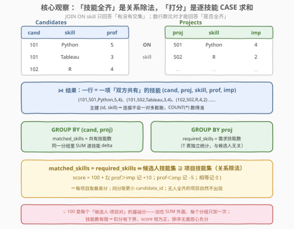
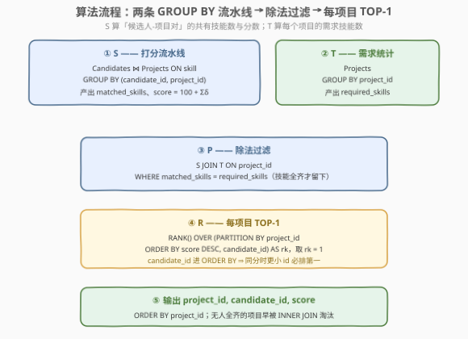
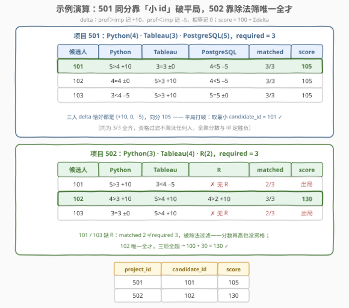

# LeetCode 寻找数据科学家职位的候选人 II 题解

## 1. 题目概述

- **标题 / 题号**：寻找数据科学家职位的候选人 II（#3278，medium）
- **链接**：https://leetcode.cn/problems/find-candidates-for-data-scientist-position-ii/
- **难度**：中等
- **标签**：数据库、SQL、关系除法、JOIN、GROUP BY、聚合、窗口函数、`RANK`、平局打破、LeetCode 锁题

> ⚠️ 本题为 LeetCode 付费题（锁题），题意描述根据官方示例用例与外部资料重建，可能与官方题面有出入。（题面已与社区镜像 doocs/leetcode 的官方中文翻译交叉核对，示例输入输出与 GraphQL 接口返回一致，出入风险较低。）

**表结构**：`Candidates`

| 列名 | 类型 |
|------|------|
| candidate_id | int |
| skill | varchar |
| proficiency | int |

**表结构**：`Projects`

| 列名 | 类型 |
|------|------|
| project_id | int |
| skill | varchar |
| importance | int |

- `(candidate_id, skill)` 是 `Candidates` 的主键，`proficiency` 为该候选人对该技能的熟练度（1–5）；
- `(project_id, skill)` 是 `Projects` 的主键，`importance` 为该项目对该技能的重要性（1–5）。

**目标**：LeetCode 正在为多个数据科学项目招人。编写一个解决方案，按以下条件为**每一个项目**找到**最佳候选人**：

1. 候选人必须拥有项目所需的**所有**技能（缺一项即出局）；
2. 为每个「候选人-项目对」计算**分数**：
   - 从 `100` 分**开始**；
   - 每一项技能 `proficiency > importance` **加** `10` 分；
   - 每一项技能 `proficiency < importance` **减** `5` 分；
   - `proficiency = importance` 分数不变。

每个项目只保留**最高分**候选人；若**同分**，选择 `candidate_id` **更小**者；**没有合适候选人**的项目**不输出**。返回 `project_id`、`candidate_id`、`score` 三列，按 `project_id` **升序**排序。

**示例 1**：

```text
输入：Candidates 表
+--------------+------------+-------------+
| candidate_id | skill      | proficiency |
+--------------+------------+-------------+
| 101          | Python     | 5           |
| 101          | Tableau    | 3           |
| 101          | PostgreSQL | 4           |
| 101          | TensorFlow | 2           |
| 102          | Python     | 4           |
| 102          | Tableau    | 5           |
| 102          | PostgreSQL | 4           |
| 102          | R          | 4           |
| 103          | Python     | 3           |
| 103          | Tableau    | 5           |
| 103          | PostgreSQL | 5           |
| 103          | Spark      | 4           |
+--------------+------------+-------------+

Projects 表
+------------+------------+------------+
| project_id | skill      | importance |
+------------+------------+------------+
| 501        | Python     | 4          |
| 501        | Tableau    | 3          |
| 501        | PostgreSQL | 5          |
| 502        | Python     | 3          |
| 502        | Tableau    | 4          |
| 502        | R          | 2          |
+------------+------------+------------+

输出：
+------------+--------------+-------+
| project_id | candidate_id | score |
+------------+--------------+-------+
| 501        | 101          | 105   |
| 502        | 102          | 130   |
+------------+--------------+-------+
```

**解释**：

- 项目 501（Python 4 / Tableau 3 / PostgreSQL 5）：101 得 $100+10+0-5=105$，102 得 $100+0+10-5=105$，103 得 $100-5+10+0=105$——三人**同分**，取最小 `candidate_id` → **101**；
- 项目 502（Python 3 / Tableau 4 / R 2）：101、103 都**没有 R**，不满足「拥有全部技能」直接出局；102 三项全超，$100+10+10+10=$ **130** → **102**。

**约束条件**（重建推测）：

- 两表主键如上，同一候选人不会重复记录同一技能，同一项目不会重复要求同一技能；
- `proficiency` / `importance` 取值 1–5；
- 判题数据规模小。

> 💡 **审题关键**：这道题是三个经典小菜的拼盘——①「拥有全部技能」是**关系除法**（子集判定），不是普通 JOIN 能直接表达的；②打分是**逐技能的规则求和**（`SUM` + `CASE` 的标准形态）；③「每项目取最佳 + 平局取小 id + 无人则不输出」是**分组 TOP-1** 的窗口函数标准型。把这三块各自翻译成 SQL，拼起来就是答案。

## 2. 解题思路

### 2.1 暴力思路：应用层逐对模拟

最直接的暴力是把两张表整个拉回应用层：

```sql
SELECT * FROM Candidates;
SELECT * FROM Projects;
```

然后在程序里对每个「候选人 × 项目」组合，把项目的需求技能逐项到候选人的技能表里查，查不到就淘汰，查得到就按规则累加分数，最后每项目取最大分、平局比 id——$|\text{候选人对}|\times|\text{项目对}|$ 的双重循环乘上逐技能查找，全部聚合逻辑外包，SQL 只当搬运工。

SQL 层的「笨办法」则是**相关子查询**：对每个 `(candidate_id, project_id)` 组合发一条「数共有技能数」的子查询、再发一条「数项目需求技能数」的子查询——同一个项目的需求技能数被每个候选人重复算一遍，`Projects` 表被扫了「候选人数」次。

> ⚠️ 暴力的启示：①「共有技能数」和「需求技能数」都是 `GROUP BY + COUNT`，一次分组就能全员算完，不需要逐对查询；②「拥有全部技能」的本质是**集合包含**（候选人的技能集 ⊇ 项目的技能集），而 JOIN 天生只验证「有交集」——差的那一步「数一数够不够」才是关键。这正是关系除法要补的一刀。

### 2.2 核心观察：关系除法 + 逐技能打分 + 分组 TOP-1



三个观察把问题拆成两条流水线加一个收尾：

| 观察 | 内容 | 带来的做法 |
|------|------|-----------|
| **「技能全齐」= 计数比对（关系除法）** | `Candidates JOIN Projects ON skill` 后按 `(candidate_id, project_id)` 分组数行数得 `matched_skills`；项目侧分组数行数得 `required_skills`。二者相等 ⇔ 候选人技能集 ⊇ 项目技能集 | JOIN 负责「配对」，`COUNT` 负责「验全」——除法被拆成「乘 + 比对」两步，这是 SQL 里实现关系除法的标准姿势 |
| **打分是逐技能的 `SUM(CASE)`** | 每行（一项共有技能）独立计 $\delta\in\{+10,0,-5\}$，组内求和再加基础分：$\text{score}=100+\sum\delta$ | `100 + SUM(CASE WHEN proficiency > importance THEN 10 WHEN proficiency < importance THEN -5 ELSE 0 END)`——基础分 100 是**分组级常数**，写在 `SUM` 外面，每组只加一次 |
| **收尾是分组 TOP-1** | 过滤「全齐」后，每个项目内部按 `score` 降序、同分按 `candidate_id` 升序取第一名；无人全齐的项目在 `INNER JOIN` 链上根本不出现 | `RANK() OVER (PARTITION BY project_id ORDER BY score DESC, candidate_id)` 后取 `rk = 1`，或 `MAX(score)` 回连 + `MIN(candidate_id)` |

两个容易踩的细节先钉死：

- **`COUNT(*)` 为什么数得准**：两表主键都含 `skill`（`(candidate_id, skill)`、`(project_id, skill)`），等值连接**不会一对多膨胀**——同一「候选人-项目」对之间，每个共有技能恰好贡献一行。若表里允许重复行，就得改用 `COUNT(DISTINCT skill)` 防水。
- **为什么不用 `AVG(proficiency - importance)` 之类的「均值」**：打分规则不是「平均强弱」，而是**逐项奖惩求和**——一项超群 +10、一项落后 −5，与两项持平等价；均值没有这个性质。规则求和的老实翻译就是 `SUM + CASE`。

### 2.3 算法流程图



| 步骤 | SQL 片段 | 作用 | 示例数据流 |
|------|----------|------|-----------|
| ① 打分 `S` | `Candidates JOIN Projects ON skill` → `GROUP BY (candidate_id, project_id)` | 每对一行：`matched_skills` + `score` | (101,501): 3 技能，105；(101,502): 2 技能，105 |
| ② 需求 `T` | `Projects GROUP BY project_id` | 每项目需要的技能数 | 501 → 3；502 → 3 |
| ③ 除法过滤 `P` | `S JOIN T ON project_id WHERE matched_skills = required_skills` | 只留「技能全齐」的候选人-项目对 | (101,502)/(103,502) 的 2≠3 被淘汰 |
| ④ TOP-1 `R` | `RANK() OVER (PARTITION BY project_id ORDER BY score DESC, candidate_id)` 取 `rk=1` | 每项目最佳；同分取更小 id | 501 三人同分 → 101；502 → 102 |
| ⑤ 输出 | `ORDER BY project_id` | 按项目号升序 | 501→(101,105)，502→(102,130) |

> 💡 `candidate_id` 放进窗口 `ORDER BY` 不是可有可无的装饰：同一项目内 `(score, candidate_id)` 组合唯一（候选人对唯一），排序全序无并列，`RANK` 与 `ROW_NUMBER` 此时等价、结果确定。若只按 `score` 排序，`RANK` 会让同分者**并列都输出**（错），`ROW_NUMBER` 会**任取一个**（不确定）——平局打破键必须进 `ORDER BY`。

### 2.4 示例演算



| 项目 | 101 | 102 | 103 | 结果 |
|------|-----|-----|-----|------|
| **501**（Py4/Ta3/PG5） | $100+10+0-5=105$ | $100+0+10-5=105$ | $100-5+10+0=105$ | 三人同分 → 最小 id **101** |
| **502**（Py3/Ta4/R2） | 缺 R，2/3 出局 | $100+10+10+10=130$ | 缺 R，2/3 出局 | 唯一全才 **102** |

两个项目各讲了一个故事：

- **501 是「平局打破」的故事**：三个候选人的 delta 恰好都是 $\{+10, 0, -5\}$ 各一项，只是落在不同技能上——同分 105。资格过滤（3/3 全齐）不淘汰任何人，胜负全靠 `candidate_id` 的字典序，输出 101；
- **502 是「除法优先」的故事**：101 的 Python 高分、103 的 Tableau 高分都白搭——「拥有**所有**技能」是一票否决的硬门槛，缺 R 直接出局（连打分资格都没有），分数只在「全齐者」之间比较。102 三项全超，$100+30=130$ 一骑绝尘。

> 💡 顺序不能反：先过滤资格、再比分数。如果先比分数再补资格检查，写出来既绕又容易漏——把「缺技能 ⇒ 无行」交给 `INNER JOIN`（缺的技能根本配不上对）+「部分匹配 ⇒ 行数不够」交给计数比对，两层淘汰都由查询结构天然完成，无需任何 `EXISTS` 特判。

## 3. 参考代码

### SQL（解法一：等值连接 + 计数比对 + 窗口 `RANK`，推荐）

```sql
WITH
    S AS (
        SELECT
            c.candidate_id,
            p.project_id,
            COUNT(*) AS matched_skills,
            100 + SUM(CASE WHEN c.proficiency > p.importance THEN  10
                           WHEN c.proficiency < p.importance THEN  -5
                           ELSE 0
                      END) AS score
        FROM Candidates c
        JOIN Projects p ON p.skill = c.skill
        GROUP BY c.candidate_id, p.project_id
    ),
    T AS (
        SELECT project_id, COUNT(*) AS required_skills
        FROM Projects
        GROUP BY project_id
    ),
    R AS (
        SELECT
            s.project_id,
            s.candidate_id,
            s.score,
            RANK() OVER (PARTITION BY s.project_id
                         ORDER BY s.score DESC, s.candidate_id) AS rk
        FROM S s
        JOIN T t ON t.project_id = s.project_id
        WHERE s.matched_skills = t.required_skills
    )
SELECT project_id, candidate_id, score
FROM R
WHERE rk = 1
ORDER BY project_id;
```

> 💡 **写法要点**：
> - **`S` 与 `T` 是两条独立流水线**：`S` 面向「候选人-项目对」（连接 + 二维分组），`T` 面向「项目」（一维分组）——同一张 `Projects` 表在两处出现，粒度不同、互不干扰；
> - **基础分 100 写在 `SUM` 外面**：它是每个分组共享的常数；写进 `CASE` 的分支里会逐技能加一次，5 项技能能加出 500 分的灾难；
> - **`WHERE` 在窗口之前生效**：CTE `R` 里先 `JOIN + WHERE` 过滤「全齐」，再打排名——排名只在有资格的人之间产生，502 的两个缺 R 者根本不进排名；
> - **`RANK`/`ROW_NUMBER`/`DENSE_RANK` 任选**：`ORDER BY` 里已有 `candidate_id` 作平局打破键，同窗内排序全序无并列，三者输出一致。

### SQL（解法二：`MAX` + 回连 + `MIN`，无窗口函数）

```sql
WITH
    S AS (
        SELECT
            c.candidate_id,
            p.project_id,
            COUNT(*) AS matched_skills,
            100 + SUM(CASE WHEN c.proficiency > p.importance THEN  10
                           WHEN c.proficiency < p.importance THEN  -5
                           ELSE 0
                      END) AS score
        FROM Candidates c
        JOIN Projects p ON p.skill = c.skill
        GROUP BY c.candidate_id, p.project_id
    ),
    T AS (
        SELECT project_id, COUNT(*) AS required_skills
        FROM Projects
        GROUP BY project_id
    ),
    Q AS (
        SELECT s.project_id, s.candidate_id, s.score
        FROM S s
        JOIN T t ON t.project_id = s.project_id
        WHERE s.matched_skills = t.required_skills
    ),
    M AS (
        SELECT project_id, MAX(score) AS best
        FROM Q
        GROUP BY project_id
    )
SELECT q.project_id, MIN(q.candidate_id) AS candidate_id, m.best AS score
FROM Q q
JOIN M m ON m.project_id = q.project_id AND q.score = m.best
GROUP BY q.project_id, m.best
ORDER BY q.project_id;
```

> 💡 **解法二的取舍**：
> - 套路是 [586. 订单最多的客户](https://leetcode.cn/problems/customer-placing-the-largest-number-of-orders/) 一脉的「**聚合求最值 → 回连筛行 → 再聚合选代表**」：`M` 取每项目最高分，回连 `Q` 筛出达最高分的行（可能并列多行），最后 `MIN(candidate_id)` 在并列者中选小 id；
> - 第二次 `GROUP BY` 里 `m.best` 只是随行携带的分组键，配上 `MIN` 后每项目恰好输出一行；
> - 不依赖窗口函数，MySQL 5.x 等老引擎也能跑；代价是同一份 `Q` 扫两遍、代码长一截——能用窗口时优先解法一。

### Python（pandas）

```python
import numpy as np
import pandas as pd


def find_candidates_for_data_scientist_position_ii(
    candidates: pd.DataFrame, projects: pd.DataFrame
) -> pd.DataFrame:
    m = candidates.merge(projects, on="skill")
    m["delta"] = np.select(
        [m["proficiency"] > m["importance"], m["proficiency"] < m["importance"]],
        [10, -5],
        default=0,
    )
    s = (
        m.groupby(["candidate_id", "project_id"], as_index=False)
        .agg(matched_skills=("skill", "size"), score=("delta", "sum"))
    )
    s["score"] += 100
    t = (
        projects.groupby("project_id", as_index=False)
        .size()
        .rename(columns={"size": "required_skills"})
    )
    q = s.merge(t, on="project_id")
    q = q[q["matched_skills"] == q["required_skills"]]
    q = q.sort_values(
        ["project_id", "score", "candidate_id"], ascending=[True, False, True]
    )
    best = q.groupby("project_id", as_index=False).head(1)
    return best[["project_id", "candidate_id", "score"]].reset_index(drop=True)
```

> 💡 **pandas 对照**（付费题无官方函数签名，函数名按题名约定）：
> - `merge(on="skill")` 对应等值连接；`np.select` 三分支对应 `CASE WHEN`，`default=0` 对应 `ELSE 0`；
> - `agg` 里的 `("skill", "size")` 数的是每组行数（共有技能数），对应 `COUNT(*)`；`("delta", "sum")` 对应 `SUM`，随后 `+= 100` 就是「基础分加在 SUM 外」；
> - `sort_values` 的三键排序（项目升、分数降、id 升）+ `groupby().head(1)` = 窗口 `RANK` 取 `rk=1`——注意用 `head(1)` 而不是 `first()`：后者按列取每组的第一个**非空值**，列间可能来自不同行，仅当全列无 NaN 时才等价于「取第一行」。

## 4. 复杂度分析

设 $c$ 为 `Candidates` 行数、$p$ 为 `Projects` 行数，$J$ 为连接输出规模。

| 维度 | 复杂度 | 说明 |
|------|--------|------|
| **时间（连接 + 分组）** | $O(J)$，最坏 $O(c\cdot p)$ | 按技能等值连接：技能 $s$ 贡献「候选人数($s$) × 需求项目数($s$)」行，$J=\sum_s n_c(s)\cdot n_p(s)$；只有当每个技能都被所有人和所有项目同时持有时才达到 $O(cp)$ |
| **时间（窗口排序）** | $O(k\log k)$，$k$ 为过滤后的对数 | `PARTITION BY project_id` 内部排序；解法二无排序，但 `Q` 扫两遍 |
| **空间** | $O(J)$ | 连接中间结果；CTE 聚合后降至 $O(\text{对数})$ |
| **结果规模** | $O(\text{项目数})$ | 每项目至多输出一行，无人全齐的项目为 0 行 |

> ⚠️ SQL 复杂度取决于执行计划与索引：`skill` 列有索引时等值连接可走 hash/index join，$J$ 之外的排序开销占主导。面试中说明「代价集中在连接输出规模 $J=\sum_s n_c(s)\cdot n_p(s)$，熟练度/重要性只是行上的常数级计算」即可。

## 5. 扩展：关系除法的写法家族与平局打破规范

### 5.1 「拥有全部技能」的三种 SQL 写法

「候选人技能集 ⊇ 项目技能集」是经典的**关系除法**（relational division，`Candidates ÷ Projects`），SQL 没有原生 `DIVIDE BY`，常用三种实现：

| 写法 | 一句话 | 适用 |
|------|--------|------|
| **计数比对**（本题） | `JOIN` 后数共有数 = 需求数 | 需求技能集**因项目而异**（`Projects` 一行一技能），最通用 |
| **双 `NOT EXISTS`** | 「不存在一项项目技能，该候选人没有」 | 同上；纯布尔逻辑、无聚合，行数大时常更慢但语义最「数学」 |
| **`HAVING COUNT(DISTINCT) = K`** | `WHERE skill IN (固定集合)` 后数齐了没 | 需求技能集**固定**（如前作 3051 的 Python/Tableau/PostgreSQL 三件套），K 是常数 |

双 `NOT EXISTS` 版（对照理解用）：

```sql
SELECT p.project_id
FROM Projects p
WHERE NOT EXISTS (
    SELECT 1 FROM Projects p2
    WHERE p2.project_id = p.project_id
      AND NOT EXISTS (
          SELECT 1 FROM Candidates c
          WHERE c.candidate_id = 101
            AND c.skill = p2.skill));
```

外层「不存在一个项目需求技能是候选人 101 拿不出的」——双重否定绕，但恰好是「⊇」的逐字翻译。计数比对把同一个语义压成一次 `JOIN + GROUP BY`，通常又短又快。

### 5.2 平局打破的规范写法

「同分取更小 id」在 SQL 里有两条铁律：

1. **平局打破键必须进排序键**：窗口函数把 `candidate_id` 追加进 `ORDER BY`；聚合回连把「筛出最大值」与「在最大值中选最小 id」拆成两步（`MAX` 回连 + `MIN`）；
2. **警惕「半打破」**：只写 `ORDER BY score DESC` 时，`RANK` 同分并列输出多行（每项目多行，违反输出形状），`ROW_NUMBER`/`LIMIT 1` 则任取一行（结果不确定，判题可能时对时错）。**不确定的查询**比错误的查询更难排查——本地跑对了、判题机翻车，是这类题最阴的坑。

### 5.3 与前作 3051 的对比

| 维度 | 3051（前作，简单） | 3278（本题，中等） |
|------|-------------------|-------------------|
| 需求技能 | 固定三件套（WHERE 枚举） | 每项目不同（`Projects` 表驱动） |
| 判定 | 拥有即可（有无） | 拥有 + 逐技能比较打分（强弱） |
| 收尾 | 直接输出 candidate_id | 每项目 TOP-1 + 平局取小 id |
| 核心 | `HAVING COUNT(DISTINCT skill) = 3` | 计数比对 + `SUM(CASE)` + 窗口 |

## 6. 面试要点

1. **为什么不能只用 `JOIN` 判断「拥有全部技能」？**

   > `JOIN ON skill` 只验证「存在共有技能」（交集非空），而题目要的是**包含**（候选人技能集 ⊇ 项目技能集）。缺一个技能时 JOIN 依然成功输出其余技能的行——「交集」和「包含」之间隔着**计数比对**：共有技能数（分组 `COUNT(*)`）等于需求技能数（项目侧分组 `COUNT(*)`）才是全齐。这就是关系除法在 SQL 里的标准实现。

2. **`COUNT(*)` 在这里为什么不用怕重复计数？**

   > 两表主键分别是 `(candidate_id, skill)` 和 `(project_id, skill)`——同一候选人不会重复持有同一技能，同一项目不会重复要求同一技能。等值连接产生的每一行对应一个**互不相同**的共有技能，`COUNT(*)` 恰好数出共有技能数。若业务表没有这个约束（允许重复行），就要改用 `COUNT(DISTINCT p.skill)` 防膨胀。

3. **基础分 100 应该加在哪里？加错了会怎样？**

   > 加在 `SUM(...)` **外面**：`100 + SUM(CASE ...)`。`score` 是「候选人-项目对」级别的量，100 是该分组的常数，分组后加一次。若写进 `CASE` 每行加 100，一个 5 技能项目的满分起点就成了 500，且每个项目的技能数不同、错误不可预测——「常数属于哪个分组」是写聚合表达式时必须先想清楚的事。

4. **`RANK` / `ROW_NUMBER` / `DENSE_RANK` 在本题有区别吗？**

   > 排序键是 `(score DESC, candidate_id)`，而同一项目内 `(candidate_id, project_id)` 唯一 ⇒ 排序全序无并列，三个函数输出完全一致。但**前提是平局打破键已进 `ORDER BY`**：只按 `score` 排序时三者行为分岔——`RANK` 同分并列（每项目输出多行），`ROW_NUMBER` 同分任取（结果不确定），`DENSE_RANK` 同分并列。排序键不完整时，任何窗口函数都救不了平局。

5. **「没有合适候选人的项目不输出」需要专门处理吗？**

   > 不需要，查询结构天然排除：缺技能的「候选人-项目」组合在 `ON skill` 上配不上对（`S` 中根本没有该项目的行）；部分匹配的组合被 `matched_skills = required_skills` 过滤。某项目若无人全齐，`P` 中无行、排名无行、输出无行——三层「消失」都由 `INNER JOIN` 的语义完成。反过来，如果题目要求「每项目必输出一行（无人则 NULL）」，才需要从 `Projects` 出发 `LEFT JOIN`。

> 💡 **一句话总结**：3278 = 关系除法（`JOIN` + 计数比对验「技能全齐」）+ 规则打分（`SUM(CASE)`，基础分 100 加在 `SUM` 外）+ 分组 TOP-1（窗口 `ORDER BY score DESC, candidate_id`，平局键进排序）；501 的同分故事考「平局打破」，502 的缺 R 故事考「除法优先于打分」。

## 同类练习题

| # | 题目 | 与本题的关联 |
|---|------|-------------|
| 3051 | [寻找数据科学家职位的候选人 🔒](https://leetcode.cn/problems/find-candidates-for-data-scientist-position/) | 同族前作——同一张 `Candidates` 表判定「拥有固定三件套技能」，关系除法入门（`HAVING COUNT(DISTINCT skill) = 3`） |
| 1077 | [项目员工 III](https://leetcode.cn/problems/project-employees-iii/) | 每项目取经验最高的员工、平局取最小 `employee_id`——与本题「分组 TOP-1 + 平局取小 id」完全同构 |
| 1076 | [项目员工 II](https://leetcode.cn/problems/project-employees-ii/) | 全局人数最多的项目、平局全取——「聚合求最值 + 回连筛行」的极简版（解法二的骨架） |
| 586 | [订单最多的客户](https://leetcode.cn/problems/customer-placing-the-largest-number-of-orders/)（[站内题解](../0501-0600/586_订单最多的客户.md)） | `GROUP BY + COUNT + MAX` 回连取最值，本题解法二的基础模板 |
