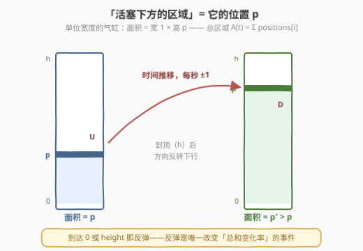
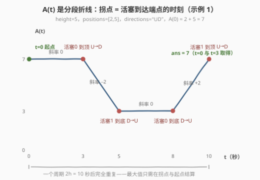
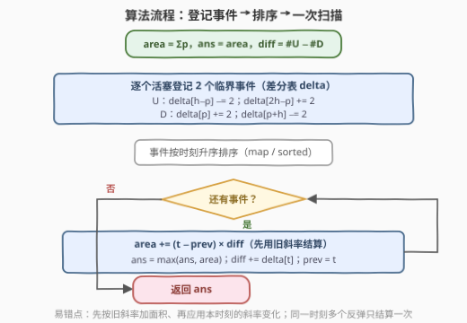
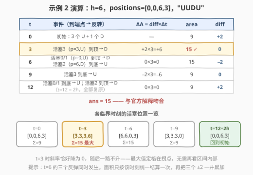

# LeetCode 活塞占据的最大总区域 题解

## 1. 题目概述

- **标题 / 题号**：活塞占据的最大总区域（#3279，hard）
- **链接**：https://leetcode.cn/problems/maximum-total-area-occupied-by-pistons/
- **难度**：困难
- **标签**：数组、哈希表、字符串、计数、前缀和、模拟

> ⚠️ 本题为 LeetCode 付费题，题意描述根据官方示例用例与 hints 重建，可能与官方题面有出入。（题面已与社区镜像 doocs/leetcode 的官方中文翻译交叉核对，出入风险较低。）

**题意**：一台旧车引擎中有若干活塞，我们想计算活塞**下方**可能的**最大**总区域。想象每个活塞装在一根**单位宽度**的竖直气缸里：

- 整数 `height`：活塞可到达的**最大**高度（位置取值范围 0 ~ height）；
- 整数数组 `positions`：`positions[i]` 是活塞 `i` 的当前位置，**恰好等于其下方的当前区域**（宽 1 × 高 $p$）；
- 字符串 `directions`：`directions[i]` 是活塞 `i` 的当前移动方向，`'U'` 向上、`'D'` 向下。

每一秒，**所有活塞同时**：

- 沿各自方向移动 1 单位（向上则 `positions[i]` 加 1，向下则减 1）；
- 若到达端点（`positions[i] == 0` 或 `positions[i] == height`），方向**反转**。

活塞永不停歇地往返。返回**所有活塞下方总区域**在任意时刻能取到的最大值，即求

$$\max_{t \ge 0}\ \sum_{i} x_i(t)$$

其中 $x_i(t)$ 为活塞 $i$ 在第 $t$ 秒末的位置。



**示例 1**：

```text
输入：height = 5, positions = [2, 5], directions = "UD"
输出：7
解释：初始时刻活塞下方的总区域已经最大（2 + 5 = 7）。
```

**示例 2**：

```text
输入：height = 6, positions = [0, 0, 6, 3], directions = "UUDU"
输出：15
解释：3 秒后活塞位于 [3, 3, 3, 6]，总区域 3+3+3+6 = 15 最大。
```

**约束**：

- $1 \le height \le 10^6$
- $1 \le positions.length = directions.length \le 10^5$
- $0 \le positions[i] \le height$
- $directions[i]$ 为 `'U'` 或 `'D'`

> 💡 读题关键：① 「面积 = 位置」是本题最反直觉的一步——活塞下方区域就是 $x_i$ 本身，**总区域 = 所有活塞位置之和**，题目实质是求 $\max_t \sum_i x_i(t)$，与哈希、前缀和这些标签的表象完全无关；② $height \le 10^6$、$n \le 10^5$——逐秒模拟一个周期要 $2 \times 10^6$ 秒、每秒扫 $10^5$ 个活塞，$O(height \cdot n) = 2 \times 10^{11}$ 必然超时，必须挖出时间轴上的稀疏结构；③ 答案上界 $n \times height = 10^{11}$，超出 32 位整数范围，**全程用 64 位**（官方签名返回 `long`）。

## 2. 解题思路

### 2.1 暴力思路：逐秒模拟

把物理过程原样照搬：数组存每个活塞的位置与方向，模拟 $2 \times height$ 秒（为何是 $2h$ 见观察三），每秒结束后累加位置、更新最大值。

两处硬伤：一是**时间太长**——一个周期长达 $2 \times 10^6$ 秒，乘上 $n = 10^5$ 个活塞共 $2 \times 10^{11}$ 次操作；二是**绝大多数秒都是无用功**——只要没有活塞到达端点，所有活塞方向不变，总区域就按同一斜率匀速变化，一秒一秒地推纯属浪费。优化的突破口正在这里：**总区域随时间的变化是一条分段折线，而折线的拐点只有 $O(n)$ 个**。

### 2.2 核心观察：分段线性 + 临界点差分扫描

**观察一：$A(t) = \sum_i x_i(t)$ 是分段线性函数，斜率 = 向上活塞数 − 向下活塞数。**

设某时刻 $u$ 个活塞向上、$d$ 个活塞向下（$u + d = n$）。这一秒每个向上活塞位置 $+1$、向下活塞 $-1$，于是

$$\frac{dA}{dt} = u - d$$

只要没有活塞改变方向，斜率就不变——$A(t)$ 在这些时间段内是直线。

**观察二：方向只在活塞到达端点时改变——每个活塞一个周期内恰有 2 个「临界时刻」。**

活塞到达 0 或 $height$ 才会反弹，斜率贡献从 $+1$ 变 $-1$（或反之），即**每次反弹使斜率变化 $\pm 2$**。而从一个端点到另一个端点耗时恰为 $height$ 秒，所以每个活塞的反弹时刻是公差为 $h$ 的等差数列，一个周期 $2h$ 内恰有 2 次：

- **向上**的活塞（初始位置 $p$）：$h - p$ 秒后**到顶**（$U \to D$，斜率 $-2$），再过 $h$ 秒**到底**（$D \to U$，斜率 $+2$）；
- **向下**的活塞（初始位置 $p$）：$p$ 秒后**到底**（$D \to U$，斜率 $+2$），再过 $h$ 秒**到顶**（$U \to D$，斜率 $-2$）。

> ⚠️ 边界：若初始时活塞恰在端点且方向朝外（0 处向下、$height$ 处向上），视作 $t=0$ 立即反弹——上式天然覆盖：$U$ 活塞在 $p=h$ 的首个临界时刻 $h-p=0$，$D$ 活塞在 $p=0$ 的首个临界时刻 $p=0$。方向朝内则正常，如示例 2 中位置 $[0,0,6]$ 配 `"UUD"`。

**观察三：运动以 $2h$ 为周期，只需扫描 $[0, 2h]$。**

每个活塞从位置 $p$ 出发，无论初始方向，$2h$ 秒后都恰好回到 $p$ 且方向复原（如上行 $h-p$ 秒 + 下行 $h$ 秒 + 上行 $p$ 秒 $= 2h$），故 $x_i(t + 2h) = x_i(t)$，$A(t)$ 整体以 $2h$ 为周期——**最大值必在 $[0, 2h]$ 内取得**。

**观察四：相邻临界点间的面积增量 $O(1)$ 可得——$\Delta A = \text{斜率} \times \Delta t$。**

把 $\le 2n$ 个临界时刻收集、排序，依次扫描：维护当前斜率 $diff$ 与当前面积 $area$，从上一临界时刻 $prev$ 走到当前时刻 $t$ 时

$$area \mathrel{+}= (t - prev) \times diff$$

这正是官方 hint 4 所说的「常数时间算出相邻临界点间的面积差」。又因分段线性函数的最大值只在**拐点或起点**取得，每到一个临界时刻结算一次 $ans$ 即可，区间内部无需关心。

以示例 1（$h=5$，$[2,5]$，`"UD"`）俯瞰全程：



$A(t)$ 的四个拐点在 $t = 3, 5, 8, 10$，斜率依次为 $0, -2, 0, +2$，最大值 7 在 $t = 0$（及 $t=3$）取得——与官方输出一致。

> 💡 一句话本质：**「逐秒模拟」升级为「逐事件模拟」**——把 $2 \times 10^6$ 秒压缩成 $\le 2n = 2 \times 10^5$ 个事件，在差分表（哈希表）上登记各时刻的斜率变化，再按时间顺序做一次前缀和式扫描。这与 [1109. 航班预订统计](https://leetcode.cn/problems/corporate-flight-bookings/) 的差分数组是同一范式：那里是「区间 $[l, r]$ 整体加 $v$」拆成两个端点事件，这里换成「时刻 $t$ 起斜率变化 $v$」。

### 2.3 算法流程图



流程中最容易写错的三处：① **先用旧斜率结算面积、再应用斜率变化**——区间 $[prev, t]$ 的斜率是「反弹前」的 $diff$，顺序颠倒会把拐点算错；② 同一时刻多个活塞反弹时，**面积按该时刻统一结算一次**，然后把所有 $\pm 2$ 一并累加；③ 初始答案取 $A(0) = \sum positions$，别忘掉 $t = 0$ 本身也是候选。

### 2.4 示例演算



以示例 2（$h=6$，$[0,0,6,3]$，`"UUDU"`）走一遍。初始 $area = 0+0+6+3 = 9$，$diff = 3 \times (+1) + 1 \times (-1) = +2$。四个活塞的首个临界时刻：活塞 0/1（$U$，$p=0$）为 $h-p=6$；活塞 2（$D$，$p=6$）为 $p=6$；活塞 3（$U$，$p=3$）为 $h-p=3$；各自再加 $h$ 得第二临界时刻。按时间排序扫描：

| 时刻 $t$ | 事件（谁到端点、怎么翻） | $\Delta A = diff \times \Delta t$ | $area$ | 翻转后 $diff$ |
|---|---|---|---|---|
| 0 | 初始：3 个 U、1 个 D | — | 9 | +2 |
| 3 | 活塞 3 到顶：$U \to D$ | $+2 \times 3 = +6$ | **15** ✓ | 0 |
| 6 | 活塞 0/1 到顶：$U \to D$；活塞 2 到底：$D \to U$ | $0 \times 3 = 0$ | 15 | −2 |
| 9 | 活塞 3 到底：$D \to U$ | $-2 \times 3 = -6$ | 9 | 0 |
| 12 | 活塞 0/1 到底：$D \to U$；活塞 2 到顶：$U \to D$ | $0 \times 3 = 0$ | 9 | +2 |

最大值 $ans = 15$ 在 $t = 3$ 取得——彼时活塞位于 $[3,3,3,6]$，与官方解释一字不差。$t = 12 = 2h$ 时位置与方向全部复原，扫描自然终止。

## 3. 参考代码

### C++

```cpp
class Solution {
  public:
    long long maxArea(int height, vector<int>& positions, string directions) {
        long long area = 0;                    // A(0) = Σ positions
        for (int p : positions) area += p;
        long long ans = area;
        long long diff = 0;                    // 当前斜率 = #U − #D
        map<long long, long long> delta;       // 时刻 -> 斜率变化量（差分表）

        for (int i = 0; i < (int)positions.size(); ++i) {
            int p = positions[i];
            if (directions[i] == 'U') {
                ++diff;                        // 初始斜率贡献 +1
                delta[height - p] -= 2;        // h−p 秒后到顶：U→D
                delta[2LL * height - p] += 2;  // 再过 h 秒到底：D→U
            } else {
                --diff;                        // 初始斜率贡献 −1
                delta[p] += 2;                 // p 秒后到底：D→U
                delta[(long long)p + height] -= 2;  // 再过 h 秒到顶：U→D
            }
        }

        long long prev = 0;
        for (auto& [t, d] : delta) {           // map 天然按时刻升序
            area += (t - prev) * diff;         // 先用旧斜率结算这一段
            ans = max(ans, area);              // 拐点处更新答案
            prev = t;
            diff += d;                         // 再应用本时刻的斜率变化
        }
        return ans;
    }
};
```

### Python

```python
class Solution:
    def maxArea(self, height: int, positions: List[int], directions: str) -> int:
        area = sum(positions)                # A(0)
        ans = area
        diff = 0                             # 当前斜率 = #U − #D
        delta = defaultdict(int)             # 时刻 -> 斜率变化量

        for p, d in zip(positions, directions):
            if d == 'U':
                diff += 1
                delta[height - p] -= 2       # h−p 秒后到顶：U→D
                delta[height * 2 - p] += 2   # 再过 h 秒到底：D→U
            else:
                diff -= 1
                delta[p] += 2                # p 秒后到底：D→U
                delta[p + height] -= 2       # 再过 h 秒到顶：U→D

        prev = 0
        for t in sorted(delta):
            area += (t - prev) * diff        # 先用旧斜率结算这一段
            ans = max(ans, area)
            prev = t
            diff += delta[t]                 # 再应用本时刻的斜率变化
        return ans
```

> 💡 实现细节：① 时刻 $\le 2h = 2 \times 10^6$、斜率绝对值 $\le n$，中间乘积 $\le 2 \times 10^{11}$，全程 `long long`（C++ 官方签名返回 `long`，LP64 平台等价 64 位，内部统一 `long long` 最稳）；② C++ 用 `map` 免排序，Python 用 `defaultdict` + `sorted`；③ 想榨掉 $O(n\log n)$ 的排序也行——时刻都是 $[0, 2h]$ 内的整数，开长度 $2h+1$ 的数组做桶计数即可，复杂度 $O(n + h)$，$h \le 10^6$ 时建桶约 16 MB，工程上完全可行。

## 4. 复杂度分析

| 维度 | 复杂度 | 说明 |
|------|--------|------|
| 时间复杂度 | $O(n \log n)$ | 每个活塞登记 2 个事件（共 $\le 2n$ 个），排序后单趟扫描、每步 $O(1)$ |
| 空间复杂度 | $O(n)$ | 差分表最多存 $2n$ 个不同时刻 |
| 暴力对照 | $O(height \cdot n)$ | 逐秒模拟整个周期，$2 \times 10^{11}$ 必然超时 |
| 桶优化 | $O(n + height)$ | 时刻均为整数且 $\le 2h$，用数组桶替代排序（空间换时间） |

实测：官方两组示例输出 7 与 15；与「逐秒模拟」暴力对拍随机数据（$h \le 8$、$n \le 6$，含初始停在端点、方向朝外等边界）3000 组全部一致；$h = 10^6$、$n = 10^5$ 随机数据下 C++（`map` 版）约 90 ms、Python 约 0.3 s。

## 5. 扩展：反弹的「镜像展开」与三角形波

逐秒模拟之所以慢，是把「折返」当成新信息反复处理。经典技巧是**把折返展开成直线**：让一面镜子贴着端点，活塞「撞墙反弹」在镜像世界里就是**继续直行**。于是 $[0, h]$ 内的往返运动等价于周长 $2h$ 的圆周上的匀速运动，位置函数是标准的**三角形波**：

$$x_i(t) = h - \Bigl| \bigl((t + \varphi_i) \bmod 2h\bigr) - h \Bigr|, \qquad \varphi_i = \begin{cases} p_i & \text{方向 } U \\ -p_i & \text{方向 } D \end{cases}$$

代入 $t=0$ 验证：$h - |p - h| = p$ ✓。这个闭式给出两个好玩的推论：

- **相位相同则完全同步**：$\varphi_i$ 相同的活塞（例如两个同位置同方向的活塞）轨迹逐点重合，事件可以按相位「打包」——本题 $n \le 10^5$ 无此必要，但若活塞数极多而高度很矮，按相位去重能显著减事件数；
- **任意时刻位置 $O(1)$ 可查**：配合 $A(t) = \sum_i x_i(t)$ 的分段线性性，闭式可用来写对拍暴力——本文的随机对拍正是靠它和逐秒模拟互验。

「反弹 = 镜像直行」的思想在 [1503. 所有蚂蚁掉落前的最后一刻](https://leetcode.cn/problems/last-moment-before-all-ants-fall-out-of-a-plank/) 里更彻底：蚂蚁相遇后各自掉头，等价于**互相穿过、交换身份**，于是最晚掉落时间只由「离端点最远的蚂蚁」决定。本题的三角形波、那题的穿过等价，都是同一句话：**折返的运动学信息，在镜像展开下一次性摊平，之后不必再算**。

## 6. 面试要点

1. **为什么最大值一定在临界时刻（或 $t=0$）取得？**

   - $A(t)$ 分段线性，任意线性段 $[t_k, t_{k+1}]$ 上的最大值在端点；全体段端点 = 临界时刻 ∪ $\{0\}$（$t = 2h$ 与 $t = 0$ 等值，已被初始候选覆盖）。所以只需在每个临界时刻结算，区间内部不用看。

2. **每个活塞为什么恰好 2 个临界时刻？周期为什么是 $2h$？**

   - 反弹只发生在端点；从一个端点到另一个耗时恰 $h$ 秒，反弹时刻是公差 $h$ 的等差数列。从 $p$ 出发无论方向，三段行程之和（如 $|h-p| + h + p$）恒为 $2h$，故 $x_i(t+2h) = x_i(t)$，系统整体周期 $2h$。

3. **斜率为什么是 $\#U - \#D$？每次反弹为什么变化 $\pm 2$？**

   - 每个向上活塞每秒使总和 $+1$、向下 $-1$，求和即斜率。反弹把某个活塞的贡献从 $+1$ 翻成 $-1$（或反之），差恰为 2。这也是事件登记里 $\pm 2$ 的来源。

4. **初始就停在端点的活塞怎么处理？**

   - 方向朝外（0 处 $D$、$h$ 处 $U$）：视作 $t=0$ 立即反弹，公式天然给出首个临界时刻 0；方向朝内：正常运动（示例 2 的 $[0,0,6]$ 配 `"UUD"` 即是）。快速自测：单活塞 $h=5$、$p=0$、方向 $D$，答案应为 5。

5. **哪些量会溢出？**

   - 答案上界 $n \cdot h = 10^{11}$、单段面积增量上界 $2h \cdot n = 2 \times 10^{11}$，均超 32 位；时刻与位置本身是 `int` 级，但**乘积与累加和必须用 64 位**。C++/Java 显式 `long long`/`long`，Python 天然大数无碍。

## 同类练习题

| # | 题目 | 与本题的关联 |
|---|------|-------------|
| 1109 | [航班预订统计](https://leetcode.cn/problems/corporate-flight-bookings/) | 差分数组入门——「区间加」拆成两个端点事件，与本题「时刻 → 斜率变化」的 delta 表同源 |
| 2251 | [花期内花的数目](https://leetcode.cn/problems/number-of-flowers-in-full-bloom/) | 把开花/凋谢登记成时间轴事件再排序扫描，练习「事件驱动」而非「逐时刻枚举」 |
| 1094 | [拼车](https://leetcode.cn/problems/car-pooling/) | 差分判定逐站人数——更轻量的「变化只发生在离散事件点」练习 |
| 1503 | [所有蚂蚁掉落前的最后一刻](https://leetcode.cn/problems/last-moment-before-all-ants-fall-out-of-a-plank/) | 蚂蚁相遇「穿过即交换身份」的镜像技巧，与本题三角形波的「反弹 = 镜像展开」物理直觉相通 |
| 42 | [接雨水](https://leetcode.cn/problems/trapping-rain-water/)（[站内题解](../0001-0100/42_接雨水.md)） | 同样是「按高度分层求面积」的几何求和问题，对照本题「面积 = 位置之和」的抽象 |
