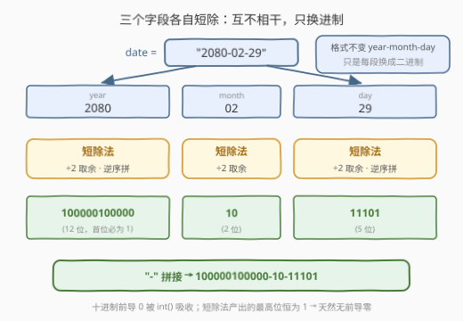
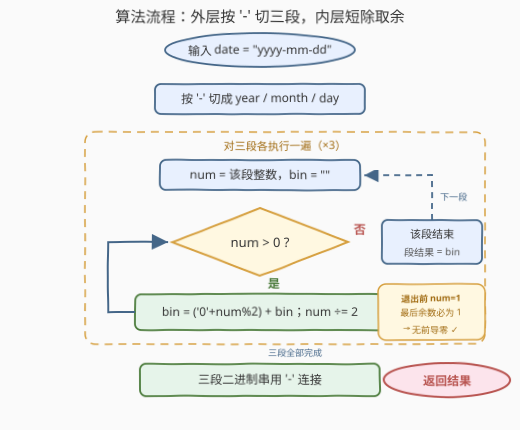
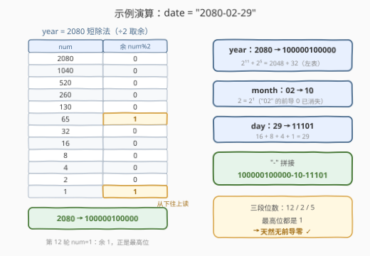

# 将日期转换为二进制表示

- **题目名称**：将日期转换为二进制表示
- **链接**：[3280. 将日期转换为二进制表示](https://leetcode.cn/problems/convert-date-to-binary/)
- **难度**：简单
- **标签**：数学，字符串

## 1. 题目概述

给你一个字符串 `date`，它的格式为 `yyyy-mm-dd`，表示一个公历日期。

`date` 可以重写为二进制表示，只需要将**年、月、日分别**转换为对应的二进制表示（**不带前导零**），并遵循 `year-month-day` 的格式。

返回 `date` 的**二进制**表示。

**示例 1**：

```text
输入：date = "2080-02-29"
输出："100000100000-10-11101"
解释：100000100000, 10 和 11101 分别是 2080, 02 和 29 的二进制表示。
```

**示例 2**：

```text
输入：date = "1900-01-01"
输出："11101101100-1-1"
解释：11101101100, 1 和 1 分别是 1900, 1 和 1 的二进制表示。
```

**约束条件**：

- $date.length = 10$
- $date[4] = date[7] = \texttt{-}$，其余的 $date[i]$ 都是数字
- 输入保证 `date` 代表一个有效的公历日期，日期范围从 1900 年 1 月 1 日到 2100 年 12 月 31 日（包括这两天）

> 💡 读题关键：① 三个字段**各自独立**转二进制，段与段之间仍用 `-` 拼回；②「不带前导零」= 按**实际位数**输出（$2 \to 10$ 而非 $0010$）；③ 约束保证年月日都 $\ge 1$，**不存在 0 值字段**，短除法循环零特判。

---

## 2. 解题思路

### 2.1 暴力思路：切分 + 逐段转二进制

照题面直译：把 `date` 按 `-` 切成三段，每段转成整数，再逐段转成二进制串，最后用 `-` 拼回：

```python
parts = date.split('-')                  # ["2080", "02", "29"]
bins  = [bin(int(p))[2:] for p in parts] # ["100000100000", "10", "11101"]
'-'.join(bins)                           # "100000100000-10-11101"
```

方向完全正确——剩下的唯一问题是「一个十进制整数如何变成无前导零的二进制串」。如果不依赖 `bin()` 这类语言内置，就需要手写**进制转换模板**：短除法。

### 2.2 核心观察：短除法「除 2 取余」，无前导零天然免费



**观察 1（短除法）**：十进制转 $k$ 进制的通式是「除 $k$ 取余，逆序排列」。对二进制即：不断执行 $\lfloor n/2 \rfloor$ 并收集余数 $n \bmod 2$。余数**从低位到高位**依次产出（第一次拿到的是 $2^0$ 位系数），最后**倒过来**拼接才是书写顺序：

$$n = \sum_{i \ge 0} b_i \cdot 2^i, \qquad b_i = \left\lfloor \frac{n}{2^i} \right\rfloor \bmod 2$$

**观察 2（无前导零是免费的）**：循环条件写 `while (n > 0)`，退出前的最后一次迭代必然发生在 $n = 1$（因为 $\lfloor n/2 \rfloor = 0$ 仅当 $n \le 1$），此刻产出的余数恰是结果的**最高位**且恒为 **1**。所以短除法**天然不带前导零**，无需任何后处理。反过来，若用 `bitset<32>` 之类定宽工具，输出满 32 位前导零，还得手动找第一个 1——本题约束年月日 $\ge 1$ 正好排除了 0 值字段（否则空串需要特判输出 `"0"`，见 504 题）。

**观察 3（定长上界，全程常数）**：年份 $\le 2100 < 2^{12} = 4096$，一段至多 12 个二进制位；月日 $\le 31 < 2^5$，至多 5 位。三段各做至多 12 轮短除，加上对定长 10 字符的切分，总工作量是常数。

三个观察合起来：**外层按 `-` 切三段，内层对每段整数做短除法，段结果用 `-` 连接返回**。

### 2.3 算法流程图



流程是「外层切分、内层短除」的两层结构：外层把 `date` 切成三段并逐段取整数；内层短除循环——余数 $n \bmod 2$ **头插**到结果串前（等价于尾插后翻转），$n \gets \lfloor n/2 \rfloor$，直到 $n = 0$。内层每退出一次，就收获一段无前导零的二进制串。

### 2.4 示例演算



以 `date = "2080-02-29"` 为例。月和日很快：$2 = 2^1 \to 10$，$29 = 16+8+4+1 \to 11101$。年 `2080` 的短除法全过程（余数列**从下往上**读）：

| 步 | $n$ | 余 $n \bmod 2$ | $n \gets \lfloor n/2 \rfloor$ |
|----|-------|----------------|-------------------------------|
| 1  | 2080  | 0              | 1040 |
| 2  | 1040  | 0              | 520 |
| 3  | 520   | 0              | 260 |
| 4  | 260   | 0              | 130 |
| 5  | 130   | 0              | 65 |
| 6  | 65    | **1**          | 32 |
| 7  | 32    | 0              | 16 |
| 8  | 16    | 0              | 8 |
| 9  | 8     | 0              | 4 |
| 10 | 4     | 0              | 2 |
| 11 | 2     | 0              | 1 |
| 12 | 1     | **1**          | 0（终止） |

余数**逆序**读出 `100000100000`，验证：$2^{11} + 2^{5} = 2048 + 32 = 2080$ ✓。注意第 12 步 $n = 1$ 时余数为 1——它就是最高位，这正是「无前导零天然成立」的现场。最后拼回 `"100000100000-10-11101"`。

---

## 3. 参考代码

### C++（单指针扫描 + 手写短除法）

```cpp
class Solution {
  public:
    string convertDateToBinary(string date) {
        string ans;
        int n = date.size();
        for (int i = 0; i < n; ) {
            int j = i, num = 0;
            while (j < n && date[j] != '-') {        // 解析出当前段的整数
                num = num * 10 + (date[j] - '0');    // （"02" 的前导零在此消失）
                j++;
            }
            string bin;
            while (num > 0) {                        // 短除法：除 2 取余
                bin += char('0' + num % 2);
                num /= 2;
            }
            reverse(bin.begin(), bin.end());         // 余数逆序 = 二进制串
            ans += bin;
            if (j < n) ans += '-';                   // 段间补 '-'
            i = j + 1;
        }
        return ans;
    }
};
```

### Python（内置一行流 + 手写短除法）

```python
class Solution:
    def convertDateToBinary(self, date: str) -> str:
        # bin(2080) == '0b100000100000'，切掉 '0b' 前缀即无前导零
        return '-'.join(bin(int(p))[2:] for p in date.split('-'))
```

```python
class Solution:
    def convertDateToBinary(self, date: str) -> str:
        def to_bin(n: int) -> str:
            bits = []
            while n > 0:              # 短除法：除 2 取余
                bits.append(str(n % 2))
                n //= 2
            return ''.join(reversed(bits))
        return '-'.join(to_bin(int(p)) for p in date.split('-'))
```

> 💡 Python 的等价写法还有 `format(n, 'b')` 与 f-string `f'{n:b}'`，都直接无前导零。C++ 没有普适内置（`std::bitset` 是定宽、带前导零；`std::format("{:b}", n)` 要 C++20 起），面试手写短除法最稳。

---

## 4. 复杂度分析

| 维度 | 复杂度 | 说明 |
|------|--------|------|
| 时间复杂度 | $O(1)$ | 三段各做至多 $\lfloor \log_2 2100 \rfloor + 1 = 12$ 轮短除，切分对象是定长 10 字符，总量为常数 |
| 空间复杂度 | $O(1)$ | 结果串长度不超过 $12 + 1 + 5 + 1 + 5 = 24$，其余仅常数个变量 |
| 一般化 | $O(L + \sum_i \log v_i)$ | 若串长为 $L$、各字段值上界为 $v_i$，则开销 = 串长 + 各字段位数之和 |

---

## 5. 扩展：进制转换的完整家族

短除法「除 $k$ 取余」处理**整数 → $k$ 进制串**方向；反方向「乘 $k$ 累加（Horner 法则）」处理 **$k$ 进制串 → 整数**。整个家族的题目只是在这两个方向上换基数、换偏移：

1. **换基数**：把 2 换成 7 就是 504 题（七进制数）——注意它需要处理 $n = 0$ 与负数，是本题「字段恒 $\ge 1$」保护所掩盖的边界；换成 26 并加偏移就是 168 题（Excel 表列名称）——它是 **1-indexed**（A=1 而非 0），每轮**先减 1 再取余**，这是该家族最经典的坑。
2. **换方向**：171 题（Excel 表列序号）把 `ans = ans * 26 + (c - 'A' + 1)` 从左往右累乘，与短除法互为镜像；本题若反过来「二进制日期 → 十进制日期」，对每段用 `n = n * 2 + bit` 即可（参考代码 C++ 版解析十进制时的 `num * 10 + digit` 就是 Horner 的十进制实例）。
3. **转出位串之后的逐位操作**：按位取反（476 / 1009 补数）、定宽反转（190 颠倒二进制位）都是「数 ↔ 位串」转换完成后的逐位独立运算，与 3270 题「十进制逐位 min」同属一族——位与位互不进位，是这些模板通用的根本原因。

---

## 6. 面试要点

1. **为什么短除法天然无前导零？需要特判吗？**

   - 循环条件 `n > 0` 保证退出前最后一次迭代必有 $n = 1$，产出的最后余数为 1，即最高位恒为 1，前导零根本不会产生。本题年月日均 $\ge 1$，连「字段为 0 输出空串」的特判都不需要；若字段可能为 0（如 504 题），才需特判返回 `"0"`。

2. **余数为什么必须逆序拼接？**

   - 第一次除 2 拿到的是**最低位**（$2^0$ 的系数），除尽前最后一次拿到的是**最高位**，产出顺序与书写顺序正好相反。头插（`bin = bit + bin`）或尾插后 `reverse` 二选一。

3. **能不能用 `bitset` / 格式化工具一步到位？**

   - C++ 的 `std::bitset<32>` 输出定宽 32 位、前导零全保留，还需 `find('1')` 裁剪；Python 的 `bin()` / `f'{n:b}'` 直接无前导零。工具选型因语言而异，建议先手写模板再提内置，展示对转换过程的理解。

4. **日期里的 `02`、`01` 这类十进制前导零会影响结果吗？**

   - 不影响。解析阶段 `int("02") = 2`，前导零在整数域中消失；输出端又按「无前导零」规则转二进制。两个方向的零处理都被整数域自动吸收——与 3270 题「补前导 0 与去前导 0 都是免费的」一脉相承。

5. **如果不让用 `split` / 库函数，怎么解析？**

   - 单指针扫描 + `num = num * 10 + (c - '0')` 累积，遇 `-` 或串尾就对 `num` 做一次短除法并重置——参考代码 C++ 版一次遍历完成解析与转换，这就是 Horner 法则的十进制应用。

---

## 7. 同类练习题

- [504. 七进制数](https://leetcode.cn/problems/base-7/)：把短除法的基数 2 换成 7，补上 0 与负数两类边界特判
- [168. Excel表列名称](https://leetcode.cn/problems/excel-sheet-column-title/)：1-indexed 的 26 进制短除，每轮先减 1 再取余，最大的坑
- [171. Excel表列序号](https://leetcode.cn/problems/excel-sheet-column-number/)：反方向的 Horner 累乘「串 → 数」，与短除法互为镜像
- [476. 数字的补数](https://leetcode.cn/problems/number-complement/)：转出二进制位后做逐位取反，练「数 ↔ 位串」双向转换
- [190. 颠倒二进制位](https://leetcode.cn/problems/reverse-bits/)：定宽 32 位的位串整体反转，体会定宽场景下前导零的处理差异
