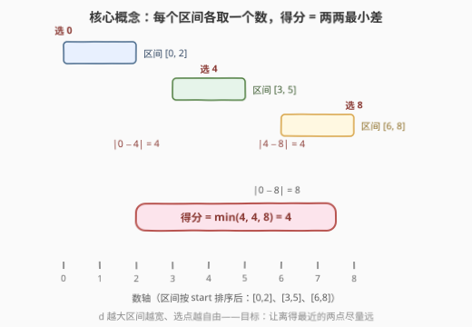
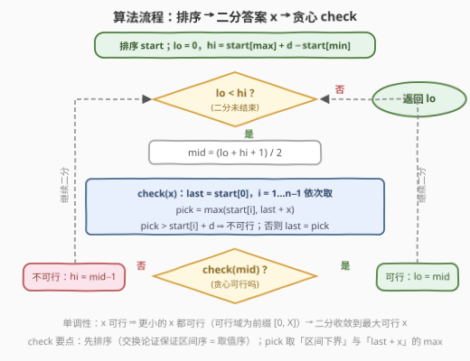
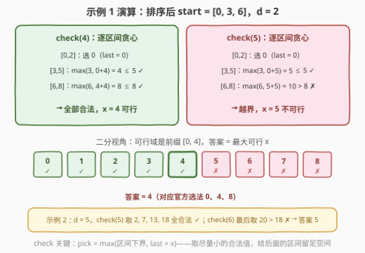

# LeetCode 范围内整数的最大得分 题解

## 1. 题目概述

- **标题 / 题号**：范围内整数的最大得分（#3281，medium）
- **链接**：https://leetcode.cn/problems/maximize-score-of-numbers-in-ranges/
- **难度**：中等
- **标签**：贪心、数组、二分查找、排序

**题意**：给你一个整数数组 `start` 和一个整数 `d`，代表 $n$ 个**区间** $[\text{start}[i],\ \text{start}[i] + d]$。

你需要从每个区间中各选一个整数（第 $i$ 个整数必须落在第 $i$ 个区间内）。所选整数的**得分**定义为所有选出的整数**两两之间的最小绝对差**。返回能够取得的**最大**得分。



**示例 1**：

```text
输入：start = [6, 0, 3], d = 2
输出：4
解释：可以选 8（来自 [6,8]）、0（来自 [0,2]）、4（来自 [3,5]），
     得分为 min(|8−0|, |8−4|, |0−4|) = 4。
```

**示例 2**：

```text
输入：start = [2, 6, 13, 13], d = 5
输出：5
解释：可以选 2、7、13、18，得分为 min(5, 11, 16, 6, 11, 5) = 5。
```

**约束**：

- $2 \le \text{start.length} \le 10^5$
- $0 \le \text{start}[i] \le 10^9$
- $0 \le d \le 10^9$

> 💡 读题关键：① 这是标准的**「最大化最小值」**句式——「得分 = 两两最小差」越大越难满足，天然对应**二分答案**；② $n \le 10^5$，二分的 `check` 必须 $O(n)$，且读入是**乱序区间**，先排序再贪心；③ $\text{start}[i] + d$ 最大 $2 \times 10^9$，`last + x` 一路加到 $4 \times 10^9$，C++ 中**中间量必须用 64 位**。

## 2. 解题思路

### 2.1 暴力思路：枚举每个区间的取值组合

最直白的做法是枚举：每个区间有 $d+1$ 个候选整数，遍历所有 $(d+1)^n$ 种组合，对每种组合排序取相邻差的最小值。指数级复杂度在 $n \ge 3$、$d \ge 10$ 时就彻底爆炸，而本题 $n$ 高达 $10^5$、$d$ 高达 $10^9$，纯属不可行。

哪怕退一步只想到「答案 $x$ 能不能达到」这个判定问题，直接做也无从下手——$10^5$ 个区间各自的取值相互纠缠，看似要 DP，但值域 $2 \times 10^9$ 让任何按值建状态的思路都熄火。突破口在于换一个问法：**先猜答案，再验证**。

### 2.2 核心观察：二分答案 + 排序贪心验证

**观察一：「得分 $\ge x$」的可行性关于 $x$ 单调不增——可以二分答案。**

得分 $\ge x$ 等价于「所有两两差 $\ge x$」。若某个 $x$ 可行，则更小的 $x'$ 可行（同一组选法仍然满足）；若 $x$ 不可行，则更大的 $x''$ 更不可行。可行域形如 $[0, X]$ 的前缀，答案即**最大可行 $X$**，用二分在 $[0,\ \text{start}_{\max} + d - \text{start}_{\min}]$ 上找右边界即可（$x = 0$ 恒可行——每个区间都选左端点就行）。

**观察二：两两差 $\ge x$ $\iff$ 排序后相邻差 $\ge x$。**

$n$ 个数排序后，最小的两两差一定出现在**相邻**两个数之间。于是判定条件从 $O(n^2)$ 对比较降为 $O(n)$ 次相邻比较——这是 `check` 能做到线性的前提。

**观察三（交换论证）：把 `start` 排序后，存在取值也递增的最优解。**

区间按 `start` 从小到大排序后，若某最优解中「靠前区间」的取值反而比「靠后区间」的大，不妨设区间 $i$ 取 $v_i$、区间 $j$ 取 $v_j$，$\text{start}[i] \le \text{start}[j]$ 但 $v_i > v_j$。**交换两个取值**：由 $v_j \ge \text{start}[j] \ge \text{start}[i]$ 且 $v_j < v_i \le \text{start}[i] + d$，得 $v_j$ 落入区间 $i$；由 $v_i > v_j \ge \text{start}[j]$ 且 $v_i \le \text{start}[i] + d \le \text{start}[j] + d$，得 $v_i$ 落入区间 $j$。交换合法且**取值多重集不变**，得分不变。反复交换后总能把最优解调整成「区间顺序 = 取值顺序」。

**观察四（贪心）：固定 $x$ 后，逐区间取「尽量小」的合法值即可判定可行性。**

按观察三排好序后，从第一个区间开始：第一个数取下界 $\text{start}[0]$（越小给后面留的空间越大）；其后每个数取 $\max(\text{start}[i],\ \text{last} + x)$——既不小于自己的区间下界，又与上一个数拉开 $x$ 的间距；若这个值超过了区间上界 $\text{start}[i] + d$，则 $x$ 不可行。

正确性由归纳法一锤定音：设贪心取值为 $g_i$、任意合法方案取值为 $f_i$，则 $g_1 = \text{start}[0] \le f_1$；若 $g_i \le f_i$，则 $g_{i+1} = \max(\text{start}[i{+}1],\ g_i + x) \le \max(\text{start}[i{+}1],\ f_i + x) \le f_{i+1}$。**贪心取值逐点不大于任何合法方案**，于是贪心若在某步越界，任何方案都会越界——贪心可行与存在合法方案互为充要。

> 💡 一句话本质：**「最大化最小差」$\Rightarrow$ 二分答案 $x$；「判定可行性」$\Rightarrow$ 排序后贪心取最小合法值**。这与 [875. 爱吃香蕉的珂珂](https://leetcode.cn/problems/koko-eating-bananas/)（二分速度 + 逐堆验证）、[719. 找出第 K 小的数对距离](https://leetcode.cn/problems/find-k-th-smallest-pair-distance/)（二分距离 + 双指针计数）是同一范式，只是 `check` 换成了「区间下界与 `last+x` 取 max」的滑动式贪心。

### 2.3 算法流程图



流程中三处易错：① **先排序**——交换论证的前提是区间按 `start` 升序，乱序贪心会错判；② `check` 里 `pick` 的两个候选是「区间下界」与「上一个取值 $+x$」的 **max**，只取其一都可能越界或浪费间距；③ 二分用「找最大可行」的模板（`mid` 向上取整、可行收紧下界），写反会死循环。

### 2.4 示例演算



以示例 1（排序后 $\text{start} = [0, 3, 6]$，$d = 2$，二分上界 $= 6 + 2 - 0 = 8$）走两个关键判定：

| 判定 | 逐区间贪心（`pick = max(下界, last+x)`） | 结果 |
|---|---|---|
| $x = 4$ | 取 $0$；$\max(3, 0+4) = 4 \le 5$ ✓；$\max(6, 4+4) = 8 \le 8$ ✓ | **可行** |
| $x = 5$ | 取 $0$；$\max(3, 0+5) = 5 \le 5$ ✓；$\max(6, 5+5) = 10 > 8$ ✗ | 不可行 |

可行域为 $\{0,1,2,3,4\}$，二分收敛到最大可行 $x = 4$。验证取值 $0, 4, 8$ 正是官方解释中的选法。示例 2 同理：$x = 5$ 时取 $2, 7, 13, 18$ 全部合法；$x = 6$ 时最后一步 $\max(13, 14+6) = 20 > 18$ 越界，答案 $5$。

## 3. 参考代码

### C++

```cpp
class Solution {
  public:
    int maxPossibleScore(vector<int>& start, int d) {
        sort(start.begin(), start.end());
        long long lo = 0;
        long long hi = (long long)start.back() + d - start.front();

        auto check = [&](long long x) {
            long long last = start[0];
            for (int i = 1; i < (int)start.size(); ++i) {
                long long pick = max((long long)start[i], last + x);
                if (pick > (long long)start[i] + d) return false;
                last = pick;
            }
            return true;
        };

        while (lo < hi) {                       // 找最大可行 x
            long long mid = lo + (hi - lo + 1) / 2;
            if (check(mid)) lo = mid;           // mid 可行 → 答案 ≥ mid
            else hi = mid - 1;                  // 不可行 → 答案 < mid
        }
        return (int)lo;                         // x = 0 恒可行，lo 有解
    }
};
```

### Python

```python
class Solution:
    def maxPossibleScore(self, start: List[int], d: int) -> int:
        start.sort()

        def check(x: int) -> bool:
            last = start[0]
            for s in start[1:]:
                pick = max(s, last + x)
                if pick > s + d:
                    return False
                last = pick
            return True

        lo, hi = 0, start[-1] + d - start[0]
        while lo < hi:                          # 找最大可行 x
            mid = (lo + hi + 1) // 2
            if check(mid):
                lo = mid
            else:
                hi = mid - 1
        return lo
```

> 💡 实现细节：① 二分上界取「最大取值 $-$ 最小取值」的极差 $\text{start}_{\max} + d - \text{start}_{\min} \le 2 \times 10^9$，约 31 轮迭代；实际上 $n$ 个数相邻差 $\ge x$ 要求总跨度 $\ge (n-1)x$，上界可再收紧到 $\big\lfloor\text{极差}/(n-1)\big\rfloor$，但只是省掉常数轮，量级不变；② C++ 中 `last + x` 最大约 $4 \times 10^9$，超 32 位范围，`lo/hi/mid/last/pick` 统一 `long long` 最稳；③ 排序直接改动入参数组，判题场景无副作用，若在工程中复用需先拷贝。

## 4. 复杂度分析

| 维度 | 复杂度 | 说明 |
|------|--------|------|
| 时间复杂度 | $O(n \log n + n \log V)$ | 排序 $O(n\log n)$；二分 $\lceil\log_2 V\rceil \approx 31$ 轮（$V \le 2\times10^9$），每轮 `check` 线性扫描 |
| 空间复杂度 | $O(1)$ | 原地排序，除若干标量外无额外空间（不计语言自带排序栈） |
| 暴力对照 | $O((d+1)^n \cdot n\log n)$ | 枚举全部取值组合，$n=10^5$ 时天文数字 |

实测：官方两组示例输出 4 与 5；与「小规模枚举取值组合」暴力对拍（$n \le 4$、$\text{start} \le 8$、$d \le 5$ 随机 3000 组）全部一致；$n = 10^5$、值域 $10^9$ 随机数据下 C++ 约 10 ms、Python 约 0.45 s。

## 5. 扩展：从「固定槽位」到「滑动区间」

本题是经典 **Aggressive Cows（大风圈牛/牛栏问题）** 的区间版：原题在**固定坐标**上挑 $k$ 个位置使相邻距离最小值最大，`check` 是「能放就放」的贪心；本题把每个固定点替换成一个长度为 $d$ 的**可滑动区间**，贪心相应升级为「取下界与 `last+x` 的 max」。二者共享同一套「二分答案 + 单调判定」骨架，可对照练习。

更彻底的变体是把「最小值最大化」换成**最大化第 $k$ 小的差**——可行性不再单调，二分失效，需要按值离散化配合计数技巧。而保持本题框架、只换 `check` 语义的练习（如「每步有容量上限的取数」）则是面试中检验是否真正理解贪心交换论证的好素材。

## 6. 面试要点

1. **为什么第一反应是二分答案？**

   - 题干是「最大化**最小**差」：最小值随变量增大而单调不增，可行域呈前缀形，天然可二分。两个前提齐备：判定「得分 $\ge x$」可 $O(n)$ 完成（观察二把两两比较降为相邻比较），值域 $V \le 2\times10^9$ 让二分只需约 31 轮。

2. **`check` 里的贪心为什么正确？先排序的依据是什么？**

   - 排序依据是交换论证：区间按 `start` 排序后，「靠前区间取更大值」的最优解总可通过交换取值调整为「区间顺序 = 取值顺序」且得分不变。贪心正确性是归纳法：贪心取值逐点 $\le$ 任何合法方案的取值，故贪心越界 ⟺ 无解。

3. **`pick = max(start[i], last + x)` 中两个候选各防住什么坑？**

   - `last + x` 保证与前一个取值拉开 $x$ 间距（满足判定语义）；`start[i]` 兜住区间下界——若上一个取值离本区间很远，`last + x` 可能已落在区间左侧之外，此时取下界即可（还省下富余间距）。缺了任何一半都会把可行判成不可行。

4. **哪些量会溢出？**

   - 上界 $\text{start}_{\max} + d \le 2\times10^9$ 勉强卡在 `int` 边缘，而 `check` 中 `last + x` 可达 $4\times10^9$，必超 32 位。C++/Java 中二分变量与 `pick` 全程 64 位；Python 天然大数无碍。

5. **$d = 0$ 时退化成什么？边界怎么处理？**

   - 退化为「在 $n$ 个固定点中使最小相邻差最大化」：区间不可滑动，`pick` 非 `start[i]` 本身（可行）即越界（失败），框架照常工作。另一个极端是所有区间相同——若 $n \ge 2$ 个区间完全重合且 $d = 0$，答案为 0，`lo = 0` 恒有解兜底。

## 同类练习题

| # | 题目 | 与本题的关联 |
|---|------|-------------|
| 875 | [爱吃香蕉的珂珂](https://leetcode.cn/problems/koko-eating-bananas/)（[站内题解](../0801-0900/875_爱吃香蕉的珂珂.md)） | 二分答案入门——猜速度、逐堆累加验证，`check` 是「向上取整累加」型 |
| 1011 | [在 D 天内送达包裹的能力](https://leetcode.cn/problems/capacity-to-ship-packages-within-d-days/)（[站内题解](../1001-1100/1011_在D天内送达包裹的能力.md)） | 猜运载能力、贪心装船验证，与本题同为「最大化最小值」的镜像（最小化最大值） |
| 719 | [找出第 K 小的数对距离](https://leetcode.cn/problems/find-k-th-smallest-pair-distance/)（[站内题解](../0701-0800/719_找出第K小的数对距离.md)） | 同样二分「距离」，`check` 换成排序 + 双指针计数，对照三种 `check` 写法 |
| 1802 | [有界数组中指定下标处的最大值](https://leetcode.cn/problems/maximum-value-at-a-given-index-in-a-bounded-array/) | 「有界」取数 + 最大化某位置值的变体，练习「先猜答案再构造」的判定式思维 |
| 2594 | [修车的最少时间](https://leetcode.cn/problems/minimum-time-to-repair-cars/) | 二分时间 + $O(r)$ 贪心统计能修好的车数，`check` 从布尔升级为计数 |
