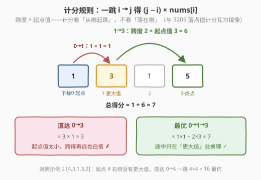
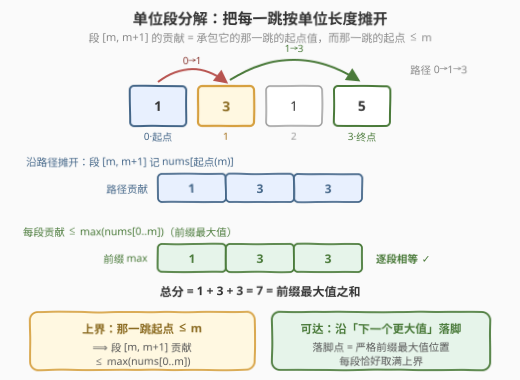
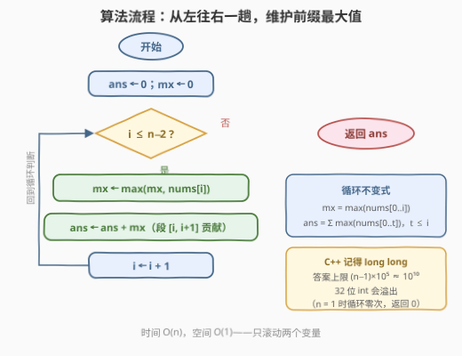
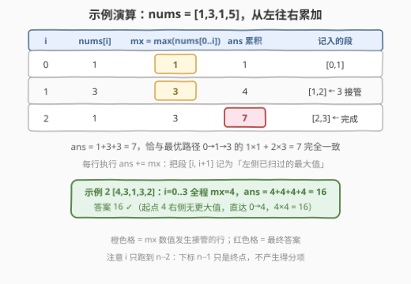

# LeetCode 到达数组末尾的最大得分 题解

## 1. 题目概述

- **标题 / 题号**：到达数组末尾的最大得分（#3282，medium）
- **链接**：https://leetcode.cn/problems/reach-end-of-array-with-max-score/
- **难度**：中等
- **标签**：贪心、数组、动态规划

**题意**：给你一个长度为 $n$ 的整数数组 `nums`。你的目标是**从下标 0 出发**，**到达下标 $n-1$** 处。每次你只能移动到**更大**的下标处。

从下标 $i$ 跳到下标 $j$ 的得分为 $(j - i) \times nums[i]$。请你返回你到达最后一个下标处能得到的**最大总得分**。

一句话读题：从下标 0 出发、最终停在下标 $n-1$，每跳一步按「**跨度 × 起点值**」计分，求最大总分。（第 414 场周赛 Q3）

**示例 1**：

```text
输入：nums = [1,3,1,5]
输出：7
解释：一开始跳到下标 1 处，然后跳到最后一个下标处。
     总得分为 1 × 1 + 2 × 3 = 7。
```

**示例 2**：

```text
输入：nums = [4,3,1,3,2]
输出：16
解释：直接跳到最后一个下标处。总得分为 4 × 4 = 16。
```

**约束**：

- $1 \le nums.length \le 10^5$
- $1 \le nums[i] \le 10^5$

> 💡 读题关键：计分公式 $(j-i) \times nums[i]$ 用的是**起点值** $nums[i]$，不是落点值 $nums[j]$——这与付费题 [3205 / 3221. 最大数组跳跃得分](https://leetcode.cn/problems/maximum-array-hopping-score-i/) 恰好互为镜像（那题按落点值计分）。起点值计分意味着「**让手里的大值尽量多承包几步**」是本能方向：拿到更大的值之前，先用当前最大值把路一口气买下来。另外 $n \le 10^5$ 直接判了 $O(n^2)$ DP 的死刑，最优解必须 $O(n)$。

## 2. 解题思路

### 2.1 暴力思路：线性 DP，$O(n^2)$

跳跃链是一条下标严格递增的路径 $0 = i_0 < i_1 < \cdots < i_m = n-1$，天然的**无后效性**结构。定义：

$$f[j] = \text{从下标 } 0 \text{ 出发、恰好停在下标 } j \text{ 的最大得分}$$

枚举最后一跳的起点 $i < j$，得转移方程：

$$f[j] = \max_{0 \le i < j} \big\{ f[i] + (j - i) \times nums[i] \big\}, \qquad f[0] = 0$$

答案是 $f[n-1]$。时间 $O(n^2)$、空间 $O(n)$——但 $n \le 10^5$ 时约 $10^{10}$ 次运算，必然超时，暴力只能作为对拍工具。

> ⚠️ 卡点：转移里对**每一对** $(i,j)$ 都单独算一遍「$f[i] + (j-i) \times nums[i]$」，是 $O(n^2)$ 的根源。但每一跳的得分其实可以按单位长度摊开——摊开之后你会发现每一段的贡献有一个**显然的上界**，根本不需要逐对比较。

### 2.2 核心观察：单位段分解 + 前缀最大值，$O(n)$

先直观感受一下「跨度 × 起点值」鼓励什么样的跳法：



**观察 1（交换论证——什么时候值得中途停脚）**：站在 $i$ 想去 $j$，比较「直达」与「中途停在 $k$（$i < k < j$）」：

$$\text{直达} = (j-i) \times nums[i], \qquad \text{停 } k = (k-i) \times nums[i] + (j-k) \times nums[k]$$

两者之差为

$$\text{停 } k - \text{直达} = (j-k) \times \big( nums[k] - nums[i] \big)$$

所以**停脚严格更优 $\iff nums[k] > nums[i]$**；$nums[k] < nums[i]$ 时停脚严格吃亏，相等时无差别。这就得到官方 hint 的贪心策略：**从每个落脚点，跳到右侧最近的「严格更大值」；右侧再无更大值，就直达 $n-1$**。换句话说，最优路径的落脚点值严格递增——它们恰是 `nums` 的**严格前缀最大值**出现位置。

**观察 2（把每一跳摊成单位段）**：从 $i_t$ 跳到 $i_{t+1}$ 覆盖了 $[i_t, i_{t+1})$ 里的每一段单位区间 $[m, m+1]$（共 $i_{t+1} - i_t$ 段），每段贡献 $nums[i_t]$。于是总分可以**逐段**重写：

$$\text{总分} = \sum_{m=0}^{n-2} nums[\text{起点}(m)]， \qquad \text{起点}(m) \text{ 是 } \le m \text{ 的最大路径下标（承包这一段的那一跳的起点）}$$



**观察 3（每段贡献有上界，且可取满）**：段 $[m, m+1]$ 的那一跳起点 $\le m$，所以：

$$nums[\text{起点}(m)] \le \max(nums[0..m]) \;\triangleq\; p(m)$$

对全部 $n-1$ 个单位段求和，得到**答案上界** $ans \le \sum_{m=0}^{n-2} p(m)$。而沿「下一个更大值」跳的链恰好**每段取满上界**：设落脚点 $i_t$ 是严格前缀最大值位置，则对 $m \in [i_t, i_{t+1})$，区间 $(i_t, i_{t+1})$ 内的值都 $\le nums[i_t]$（「下一个更大」的定义），于是 $\max(nums[0..m]) = nums[i_t]$，每段贡献 $= p(m)$。上界可达，故：

$$ans = \sum_{m=0}^{n-2} \max(nums[0..m]) = \text{前缀最大值之和}$$

> 💡 一个记忆钩子：把 $[m, m+1]$ 这一段想象成「过路费」，谁承包这段路（那一跳的起点）就按谁的价值收费——当然要等到手里握着**左侧见过的最大值**再收。全部摊开后，答案就是前缀最大值之和。与镜像题 3205 对照着记：**落点值计分 → 后缀 max、倒序一趟；起点值计分 → 前缀 max、正序一趟**。

### 2.3 算法流程图

求和式只需**从左往右一趟**滚动维护 $\max$：



流程共五步：

1. 初始化 `ans = 0`（总分）、`mx = 0`（前缀最大值）；
2. 正序枚举 $i$ 从 $0$ 到 $n-2$；
3. `mx = max(mx, nums[i])`，此时 `mx = max(nums[0..i])`；
4. `ans += mx`，把段 $[i, i+1]$ 记为前缀最大值；
5. 循环结束返回 `ans`。

若面试官追问「具体怎么跳」：从每个落脚点跳到右侧**最近的严格更大值**，没有则直达 $n-1$（见 5.1 的跳跃模拟版，两份代码逐字段等价）。

### 2.4 示例演算

以 `nums = [1,3,1,5]` 为例，从左往右逐行累加：



| $i$ | $nums[i]$ | $mx=\max(nums[0..i])$ | $ans$ 累积 | 记入的段 |
|-----|-----------|------------------------|-----------|----------|
| 0 | 1 | **1** | 1 | $[0,1]$ |
| 1 | 3 | **3** | 4 | $[1,2]$，3 接管 |
| 2 | 1 | 3 | 7 | $[2,3]$，完成 |

$ans = 1+3+3 = 7$，与最优路径 $0 \to 1 \to 3$ 的 $1 \times 1 + 2 \times 3 = 7$ 完全一致。示例 2 `[4,3,1,3,2]` 同法：$i=0..3$ 全程 $mx=4$，$ans = 4+4+4+4 = 16$（起点 4 右侧无更大值，直达 $0 \to 4$）。

## 3. 参考代码

### C++

```cpp
class Solution {
  public:
    long long findMaximumScore(vector<int>& nums) {
        long long ans = 0, mx = 0;
        for (int i = 0; i + 1 < (int)nums.size(); ++i) {  // 正序枚举每个单位段
            mx = max(mx, (long long)nums[i]);             // mx = max(nums[0..i])
            ans += mx;                                    // 段 [i, i+1] 记为前缀最大值
        }
        return ans;
    }
};
```

### Python

```python
class Solution:
    def findMaximumScore(self, nums: List[int]) -> int:
        ans = mx = 0
        for x in nums[:-1]:      # 正序枚举每个单位段
            mx = max(mx, x)      # mx = max(nums[0..i])
            ans += mx            # 段 [i, i+1] 记为前缀最大值
        return ans
```

> 💡 细节盘点：循环只跑到 $n-2$（下标 $n-1$ 只是终点，不产生得分项）；`mx` 初值取 0 即可，因 $nums[i] \ge 1 > 0$，第一轮就被覆盖；$n = 1$ 时循环零次，直接返回 0（起点即终点）。溢出方面 $n \le 10^5$、$nums[i] \le 10^5$，$ans \le (n-1) \times 10^5 = 10^{10} > 2^{31}$，C++ 必须 `long long`；Python 天然大整数无碍。

## 4. 复杂度分析

| 维度 | 复杂度 | 说明 |
|------|--------|------|
| 时间复杂度 | $O(n)$ | 从左往右一趟，每个元素读一次 |
| 空间复杂度 | $O(1)$ | 只滚动 `ans` / `mx` 两个变量 |
| 暴力对照 | $O(n^2)$ / $O(n)$ | 2.1 线性 DP，$n \le 10^5$ 超时，没挖出「段贡献上界」的结构 |

## 5. 扩展

### 5.1 跳跃模拟版：直接按官方 hint 实现

从每个落脚点 $i$ 扫到右侧第一个 $nums[j] > nums[i]$（不存在则取 $n-1$），累加 $(j-i) \times nums[i]$。由于 $i$ 只前进、内层扫描过的位置不再回头，整体仍是 $O(n)$。两份代码由观察 1 的交换论证保证**逐字段等价**，可互相对拍：

```cpp
class Solution {
  public:
    long long findMaximumScore(vector<int>& nums) {
        long long ans = 0;
        int n = nums.size(), i = 0;
        while (i < n - 1) {
            int j = i + 1;
            while (j < n - 1 && nums[j] <= nums[i]) ++j;  // 找最近的严格更大值
            ans += (long long)(j - i) * nums[i];
            i = j;
        }
        return ans;
    }
};
```

```python
class Solution:
    def findMaximumScore(self, nums: List[int]) -> int:
        ans, i, n = 0, 0, len(nums)
        while i < n - 1:
            j = i + 1
            while j < n - 1 and nums[j] <= nums[i]:  # 找最近的严格更大值
                j += 1
            ans += (j - i) * nums[i]
            i = j
        return ans
```

注意内层判停用 `<=`（**必须严格更大才值得停脚**，并列时停不停得分相同，跳过去更简洁）。

### 5.2 镜像题 3205 / 3221：落点值计分 → 后缀最大值

| | 计分公式 | 每段上界 | 答案 | 扫描方向 |
|------|----------|----------|------|----------|
| 3205 / 3221 | $(j-i) \times nums[j]$（落点值） | $\max(nums[t..n-1])$ 后缀 max | Σ 后缀最大值 | 从右往左 |
| 本题 3282 | $(j-i) \times nums[i]$（起点值） | $\max(nums[0..m])$ 前缀 max | Σ 前缀最大值 | 从左往右 |

[3205. 最大数组跳跃得分 I 🔒](https://leetcode.cn/problems/maximum-array-hopping-score-i/)（$n \le 10^3$）与 [3221. 最大数组跳跃得分 II 🔒](https://leetcode.cn/problems/maximum-array-hopping-score-ii/)（$n \le 10^5$）是同一题面按落点值计分的两个规模档。两题共用同一套**单位段分解**：把每一跳按单位长度摊开，段贡献只由「谁承包」决定，上界是相应方向的最大值。三题对照着做，「起点值 → 前缀 max、落点值 → 后缀 max」的对称性一目了然。

## 6. 面试要点

1. **为什么「跳到下一个更大值」是最优的？**

   - 交换论证：从 $i$ 去 $j$，中途停在 $k$ 与直达之差为 $(j-k) \times (nums[k] - nums[i])$，仅当 $nums[k] > nums[i]$ 时停脚严格更赚。所以最优路径只在**严格更大值**处换脚，落脚点值严格递增，即严格前缀最大值位置。

2. **单位段分解的上界为什么可达？**

   - 段 $[m, m+1]$ 的承包者起点 $\le m$，贡献 $\le \max(nums[0..m])$，得上界 $\sum_m p(m)$；而「下一个更大值」链的每个落脚点 $i_t$ 满足 $(i_t, i_{t+1})$ 内都 $\le nums[i_t]$ 且 $nums[i_t]$ 是前缀最大，故每段贡献恰好 $= p(m)$，两边夹逼取满上界。

3. **并列最大值时停不停脚？**

   - 无差别：差 $(j-k)(nums[k]-nums[i]) = 0$。但注意判停条件必须是**严格**更大——跳跃模拟里内层用 `nums[j] <= nums[i]` 一路跳过并列值，逻辑最简洁。

4. **与 3205 / 3221 是什么关系？**

   - 互为镜像：落点值计分 ⟹ 每段贡献上界是**后缀**最大值，答案 = Σ 后缀 max，从右往左一趟；起点值计分 ⟹ 上界是**前缀**最大值，答案 = Σ 前缀 max，从左往右一趟。同一套单位段分解，只是「谁承包这段路」从落点换成起点。

5. **$O(n^2)$ DP 与 $O(n)$ 贪心的本质差距在哪？**

   - DP 对每对 $(i,j)$ 独立比较，没注意到「一跳的得分可按单位长度摊开、每段贡献只由承包者决定」——而承包者值的上界（前缀最大值）可以正序一趟滚动维护。典型的**交换求和顺序**式优化（先按跳求和 → 改按单位段求和）。

6. **溢出与边界要盯什么？**

   - $n = 1$ 时起点即终点，返回 0；$ans$ 上限 $(n-1) \times \max(nums) \approx 10^{10}$，C++ 必须 `long long`（本题函数签名已给好），Python 无碍。

## 同类练习题

| # | 题目 | 与本题的关联 |
|---|------|-------------|
| 3205 | [最大数组跳跃得分 I 🔒](https://leetcode.cn/problems/maximum-array-hopping-score-i/) | 镜像题，按落点值 $(j-i) \times nums[j]$ 计分，单位段分解后答案化为后缀最大值之和，从右往左一趟 |
| 3221 | [最大数组跳跃得分 II 🔒](https://leetcode.cn/problems/maximum-array-hopping-score-ii/) | 3205 的大 $n$ 版（$n \le 10^5$），逼出 $O(n)$ 后缀最大值求和 + 64 位返回值 |
| 1696 | [跳跃游戏 VI](https://leetcode.cn/problems/jump-game-vi/) | 同为「最大得分到达终点」的线性 DP，但跳跃范围限制在 $1..k$ 步，用单调队列优化到 $O(n)$——对照体会「转移结构决定优化手段」 |
| 739 | [每日温度](https://leetcode.cn/problems/daily-temperatures/) | 单调栈求「右侧下一个更大」的入门模板，练熟后 5.1 的「跳到下一个更大值」信手拈来 |
| 45 | [跳跃游戏 II](https://leetcode.cn/problems/jump-game-ii/) | 跳跃家族的贪心招牌题（求最少跳数），与本题「最大化得分」的贪心互为对照 |
