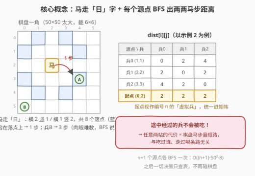
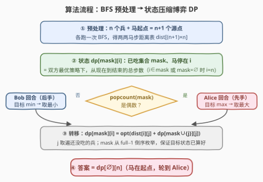
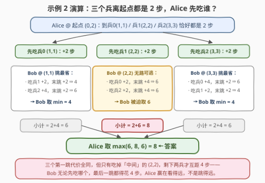

# LeetCode 吃掉所有兵需要的最多移动次数 题解

## 1. 题目概述

- **标题 / 题号**：吃掉所有兵需要的最多移动次数（#3283，hard）
- **链接**：https://leetcode.cn/problems/maximum-number-of-moves-to-kill-all-pawns/
- **难度**：困难
- **标签**：位运算、广度优先搜索、数组、数学、状态压缩、博弈论

**题意**：给你一个 $50 \times 50$ 的国际象棋棋盘，棋盘上有**一个马**和一些兵。给定整数 $kx, ky$ 表示马的位置，以及二维数组 $positions$，其中 $positions[i] = [x_i, y_i]$ 表示第 $i$ 个兵的位置。

Alice 和 Bob 玩一个回合制游戏，**Alice 先手**。玩家的一次操作为：

- 选择一个**仍在棋盘上**的兵，移动马，通过**最少**的步数吃掉这个兵。注意可以选择**任意**一个兵，不一定要选离马最近的；
- 马在吃兵的途中**可能经过**其他兵的位置，但这些兵**不会**被吃掉——只有被选中的兵在这个回合被吃掉。

Alice 的目标是**最大化**两名玩家的**总**移动次数，Bob 的目标是**最小化**总移动次数。假设双方都采用最优策略，返回可以达到的最大总移动次数。马每步走「日」字：沿一个坐标轴方向前进 2 格、再沿垂直方向前进 1 格，共 8 个落点。

**示例 1**：

```text
输入：kx = 1, ky = 1, positions = [[0,0]]
输出：4
解释：马需要移动 4 步吃掉 (0, 0) 处的兵。
```

**示例 2**：

```text
输入：kx = 0, ky = 2, positions = [[1,1],[2,2],[3,3]]
输出：8
解释：Alice 吃 (2,2) 花 2 步 → Bob 吃 (3,3) 花 2 步 → Alice 吃 (1,1) 花 4 步。
```

**示例 3**：

```text
输入：kx = 0, ky = 0, positions = [[1,2],[2,4]]
输出：3
解释：Alice 先吃 (2,4) 花 2 步（途中经过 (1,2) 但不吃），Bob 再吃 (1,2) 花 1 步。
```

**约束**：

- $0 \le kx, ky \le 49$
- $1 \le positions.length \le 15$
- $0 \le positions[i][0], positions[i][1] \le 49$
- $positions[i]$ 两两互不相同，且都不等于 $[kx, ky]$

> 💡 读题关键：① $n \le 15$——教科书级的**状态压缩**甜区，用 bitmask 记「已吃掉哪些兵」；② 「**途中经过的兵不会被吃**」这句话是全题的题眼，它保证了任意两站之间的代价**与历史无关**（后面细说）；③ 棋盘固定 $50\times50$ 且马步跳跃无阻挡，两两之间的最短马步可以先用 **BFS** 一次性预处理；④ 一人一步轮流吃、目标方向相反——标准的 **minimax 博弈 DP**。

## 2. 解题思路

### 2.1 暴力思路：直接搜索博弈树

游戏的过程本质上是一个「吃兵顺序」的决策序列：每一回合，当前玩家从剩下的兵里挑一个吃掉，付出「马当前位置到该兵的最短马步」作为代价。最朴素的做法是裸搜博弈树：每个状态最多 $n=15$ 个分支，深度最多 15，最坏 $15! \approx 1.3 \times 10^{12}$ 个叶子，直接爆炸。

但裸搜会做大量重复工作：**先吃兵 0、3、5 再吃兵 2** 和 **先吃兵 5、0、3 再吃兵 2**，只要「已吃集合」相同、马停的位置相同，剩下的博弈就一模一样——与吃的先后顺序无关。这正是**重复子问题**的信号：用 $(\text{已吃集合},\ \text{马的位置})$ 做记忆化，状态数立刻从 $n!$ 塌缩到 $2^n \cdot n$。

### 2.2 核心观察：BFS 预处理 + 状态压缩博弈 DP

**观察一：「途中不吃」⇒ 两站代价与历史无关，问题退化为纯顺序问题。**

马是**跳**着走的，兵既不阻挡马的路线、也不会被顺路吃掉。于是「从 A 出发吃掉 B」这一步的代价，就等于自由棋盘上 $A \to B$ 的**最短马步距离**，与之前吃过哪些兵、走过哪条路完全无关。整个游戏的总步数 = 依次相临两站的距离之和，**唯一重要的决策就是「吃的顺序」**。如果题目改成「途经即吃」，一步可能顺路清掉多个兵，状态转移将复杂得多——本题刻意排除了这一点。

**观察二：把马的起点视作编号 $n$ 的「虚拟兵」，统一距离矩阵。**

预处理 $dist[i][j]$（$0 \le i \le n,\ 0 \le j < n$）= 从源点 $i$（兵 $i$，或 $i=n$ 时为马起点）出发、到兵 $j$ 的最少马步。棋盘只有 $50\times50 = 2500$ 格，每个源点跑一次 BFS 即可，共 $n+1$ 次，每次 $O(50^2 \times 8)$。之后所有决策**只查表、不再碰棋盘**。



**观察三：轮到谁，只由 $\text{popcount}(mask)$ 决定。**

双方轮流行动、每回合**恰好吃一个**兵，Alice 先手。于是当已吃掉偶数个兵时必然轮到 Alice（她要 **max**），奇数个时轮到 Bob（他要 **min**）——回合信息完全冗余，无需写进状态。

**观察四：minimax 博弈 DP。**

$$dp[mask][i] = \text{双方最优策略下，已吃集合为 } mask\text{、马停在 } i\text{ 时，到游戏结束的总步数}$$

其中 $i$ 必须是 $mask$ 中的某个兵（最后吃的那个），或 $mask = \varnothing$ 时 $i = n$（还在起点）。转移按轮次二选一：

$$dp[mask][i] = \begin{cases} \max\limits_{j \notin mask}\ \big(dist[i][j] + dp[mask \cup \{j\}][j]\big) & \text{popcount}(mask)\text{ 为偶（Alice 回合）}\\[6pt] \min\limits_{j \notin mask}\ \big(dist[i][j] + dp[mask \cup \{j\}][j]\big) & \text{popcount}(mask)\text{ 为奇（Bob 回合）} \end{cases}$$

边界 $dp[full][\cdot] = 0$（兵吃光，游戏结束），答案 $dp[\varnothing][n]$。按 $mask$ **从大到小**枚举，转移目标 $mask \cup \{j\}$ 一定先被算好。

**为什么不能贪心？** 直觉上 Alice 每步挑「当前最远」的兵即可，但这是**短视**的。反例正是示例 2：三个兵离起点**恰好都是 2 步**，第一步贪心无从分辨；而正确答案是先吃**中间**的 $(2,2)$——此后剩下两兵互距 4 步，Bob 无论先吃哪个，最后一跳都得付 4 步，总共 $2+2+4=8$。若先吃两角上的兵，剩下两兵只相距 2 步，Bob 挑便宜的路线后总共只有 6。**Alice 优化的不是这一步走多远，而是「留给 Bob 的残局有多贵」**——这正是必须完整 minimax 的原因。

### 2.3 算法流程图



流程中三处易错：① BFS 的源点**别漏了马起点**（共 $n+1$ 个），漏掉的话 $dp[\varnothing][n]$ 无表可查；② 位置维度 $i$ 的取值要约束——$mask \ne \varnothing$ 时 $i \in mask$，$mask = \varnothing$ 时 $i = n$，跳过无效位置能省一半计算（不算也能过，只是白做）；③ 轮次判断是 `popcount(mask) % 2 == 0 → Alice`，别把先手方向搞反。

### 2.4 示例演算

以示例 2（起点 $(0,2)$，兵 $(1,1),(2,2),(3,3)$）为例。BFS 预处理得到距离矩阵：

| 源点 \ 目标兵 | 兵0 (1,1) | 兵1 (2,2) | 兵2 (3,3) |
|---|---|---|---|
| 兵0 (1,1) | 0 | 2 | 4 |
| 兵1 (2,2) | 2 | 0 | 2 |
| 兵2 (3,3) | 4 | 2 | 0 |
| **起点 (0,2)** | **2** | **2** | **2** |

三层的博弈树演算如下：



三个第一跳代价全同为 2，但子树值分别是 $6, 8, 6$，Alice 取 max 得 $8$。示例 3 同理更短：先吃近的 $(1,2)$（1 步）则 Bob 吃 $(2,4)$（1 步）共 2；先吃远的 $(2,4)$（2 步）则 Bob 只能吃 $(1,2)$（1 步）共 3——Alice 取 3。

## 3. 参考代码

### C++

```cpp
class Solution {
  public:
    int maxMoves(int kx, int ky, vector<vector<int>>& positions) {
        int n = positions.size();
        int full = (1 << n) - 1;

        // ① BFS 预处理：n 个兵 + 马起点 = n+1 个源点
        vector<pair<int,int>> src;
        src.reserve(n + 1);
        for (auto& p : positions) src.emplace_back(p[0], p[1]);
        src.emplace_back(kx, ky);                   // 起点视作编号 n 的虚拟兵
        vector<vector<int>> dist(n + 1, vector<int>(n));
        constexpr int DX[8] = {1, 1, -1, -1, 2, 2, -2, -2};
        constexpr int DY[8] = {2, -2, 2, -2, 1, -1, 1, -1};
        for (int i = 0; i <= n; i++) {
            int d[50][50];
            memset(d, -1, sizeof d);
            queue<pair<int,int>> q;
            d[src[i].first][src[i].second] = 0;
            q.push(src[i]);
            while (!q.empty()) {
                auto [x, y] = q.front(); q.pop();
                for (int k = 0; k < 8; k++) {
                    int nx = x + DX[k], ny = y + DY[k];
                    if (nx < 0 || nx >= 50 || ny < 0 || ny >= 50 || d[nx][ny] >= 0) continue;
                    d[nx][ny] = d[x][y] + 1;
                    q.push({nx, ny});
                }
            }
            for (int j = 0; j < n; j++) dist[i][j] = d[positions[j][0]][positions[j][1]];
        }

        // ② 博弈 DP：mask 从大到小，保证转移目标已算好
        vector<vector<int>> dp(1 << n, vector<int>(n + 1, 0));   // dp[full][*] = 0 为边界
        for (int mask = full - 1; mask >= 0; mask--) {
            bool alice = __builtin_popcount(mask) % 2 == 0;      // 已吃偶数个 → 轮到 Alice
            auto solve = [&](int i) {
                int best = alice ? INT_MIN : INT_MAX;
                for (int rem = full ^ mask; rem; rem &= rem - 1) {   // 枚举还没吃的兵 j
                    int j = __builtin_ctz(rem);
                    int val = dist[i][j] + dp[mask | 1 << j][j];
                    best = alice ? max(best, val) : min(best, val);
                }
                return best;
            };
            if (mask == 0) dp[0][n] = solve(n);                  // 初始：马在起点
            else for (int t = mask; t; t &= t - 1)               // 只枚举 mask 里的位置 i
                dp[mask][__builtin_ctz(t)] = solve(__builtin_ctz(t));
        }
        return dp[0][n];
    }
};
```

### Python

```python
from collections import deque

class Solution:
    def maxMoves(self, kx: int, ky: int, positions: List[List[int]]) -> int:
        n = len(positions)
        full = (1 << n) - 1

        # ① BFS 预处理：dist[i][j] = 源点 i（兵 i / 起点 n）到兵 j 的最少马步
        src = [tuple(p) for p in positions]
        src.append((kx, ky))                     # 起点视作编号 n 的虚拟兵
        jumps = ((1, 2), (2, 1), (-1, 2), (-2, 1), (1, -2), (2, -1), (-1, -2), (-2, -1))
        dist = [[0] * n for _ in range(n + 1)]
        for i, (sx, sy) in enumerate(src):
            d = [[-1] * 50 for _ in range(50)]
            d[sx][sy] = 0
            q = deque([(sx, sy)])
            while q:
                x, y = q.popleft()
                for dx, dy in jumps:
                    nx, ny = x + dx, y + dy
                    if 0 <= nx < 50 and 0 <= ny < 50 and d[nx][ny] < 0:
                        d[nx][ny] = d[x][y] + 1
                        q.append((nx, ny))
            for j, (px, py) in enumerate(positions):
                dist[i][j] = d[px][py]

        # ② 博弈 DP：mask 从大到小递推
        dp = [[0] * (n + 1) for _ in range(1 << n)]      # dp[full][*] = 0 为边界
        for mask in range(full - 1, -1, -1):
            alice = mask.bit_count() % 2 == 0            # 已吃偶数个 → 轮到 Alice
            spots = [n] if mask == 0 else [i for i in range(n) if mask >> i & 1]
            rem = [j for j in range(n) if not mask >> j & 1]
            pick = max if alice else min
            for i in spots:
                di = dist[i]
                dp[mask][i] = pick(di[j] + dp[mask | 1 << j][j] for j in rem)
        return dp[0][n]
```

> 💡 实现细节：① `dp` 开成 $(2^n) \times (n{+}1)$，第 $n$ 列专门留给「起点」，且只有 $dp[\varnothing][n]$ 真正用到——$mask \ne \varnothing$ 时马必然停在某个兵上，跳过无效位置能把状态数砍半；② 枚举集合元素用 `t &= t - 1`（C++）/ 直接列表推导（Python），比逐位判断干净；③ $mask \cup \{j\}$ 严格大于 $mask$，倒序枚举天然保证依赖顺序，无需记忆化递归；④ 最远两角距离实测 34 步，总步数上界约 $15 \times 34 = 510$，`int` 毫无压力。

## 4. 复杂度分析

| 维度 | 复杂度 | 说明 |
|------|--------|------|
| 时间复杂度 | $O\big(2^n \cdot n^2\big)$ | BFS 预处理 $(n+1) \cdot O(50^2 \cdot 8) \approx 3\times10^5$；DP 有效状态 $\sum_{mask}(\text{popcount}+1) \approx 2^n \cdot \frac{n}{2}$，每个转移最多 $n$ 次，$n=15$ 时约 $4\times10^6$ |
| 空间复杂度 | $O(2^n \cdot n)$ | `dp` 数组 $2^{15} \times 16 \times 4\text{B} \approx 2\text{MB}$；`dist` 仅 $O(n^2)$ |
| 暴力对照 | $O(n!)$ | 裸搜博弈树约 $1.3\times10^{12}$ 个叶子，记忆化后塌缩为上表 |

实测：官方三组示例输出 4、8、3；与「独立 minimax 暴力 + 内联 BFS」（不预处理、不记忆化）在 $n \le 6$ 的 300 组随机数据上对拍全部一致；$n = 15$ 随机数据下 C++ 约 3 ms、Python 约 0.5 s。

## 5. 扩展：换一个规则会怎样

**变体一：「途经即吃」。** 若马在赶路途中经过的兵也被顺路吃掉，一步可能同时清掉多个兵。状态 $(mask, i)$ 依然够用（未来仍只依赖「剩谁 + 马在哪」），但转移从「枚举下一个兵」变成「枚举一个沿途可达的兵集合」，且到达同一目标兵的不同路径会吃掉不同集合——转移需要结合 BFS 记录「途经格子上的兵掩码」，状态数不变、转移变重，是很好的思维练习。

**变体二：各记各的账。** 若 Alice 最大化的是**自己累计**的步数、Bob 最小化的是**自己**的步数（而非共享同一个总数），博弈不再是零和的简单 minimax，通常需要引入双方各自的 DP 值或更复杂的均衡概念——面试里能主动指出「本题两人操纵同一个计数器，方向相反，才是标准 minimax」就很加分。

**关于马步距离的数学。** 大棋盘上马步距离有 $O(1)$ 闭式公式（对 $\delta = (dx, dy)$，约为 $\max\big(\lceil dx/2\rceil, \lceil dy/2\rceil, \lceil (dx{+}dy)/3\rceil\big)$ 再做奇偶修正），但公式在 $\delta$ 很小和靠边时极易翻车；本题棋盘只有 2500 格，$n+1$ 次 BFS 又快又稳，属于「能 BFS 就别推导」的典型场景。

## 6. 面试要点

1. **为什么状态只需要（已吃集合， 马的位置），无后效性从哪来？**

   - 「途中经过的兵不会被吃」+ 兵不阻挡马跳 ⇒ 从 A 到 B 的代价恒等于棋盘上的最短马步，与吃过谁、走过哪条路无关；未来只依赖「还剩哪些兵」和「马在哪」，两者合起来就是 $(mask, i)$。

2. **怎么判断当前轮到谁？需要把回合数存进状态吗？**

   - 不需要。每回合恰好吃掉一个兵、Alice 先手，所以 $\text{popcount}(mask)$ 为偶数时轮到 Alice（取 max），为奇数时轮到 Bob（取 min），回合信息完全由 $mask$ 推出。

3. **距离为什么必须先 BFS 预处理，DP 时在线算不行吗？**

   - 同一对 $dist[i][j]$ 会被大量不同 $mask$ 反复读取，在线 BFS 每次要 $O(50^2)$，总量指数级膨胀；预处理 $n+1$ 次 BFS 固化成 $(n{+}1) \times n$ 的表，之后转移 $O(1)$ 查表。

4. **贪心（Alice 每步挑当前最远的兵）为什么错？示例 2 怎么说明的？**

   - 示例 2 中三个兵离起点都是 2 步，贪心在第一步就失去分辨力；正确做法是吃中间的 $(2,2)$，让剩下两兵互距 4 步，把「贵」的残局甩给 Bob。Alice 的收益来自**对未来局面的控制**，必须完整 minimax。

5. **复杂度多少？$n = 15$ 时状态数和转移数量级？**

   - BFS 预处理约 $(n{+}1) \cdot 50^2 \cdot 8 \approx 3\times10^5$；DP 有效状态约 $2^{15} \times 8.5 \approx 2.8\times10^5$，每次转移至多 15，总计约 $4\times10^6$；空间 $2^{15} \times 16 \times 4\text{B} \approx 2\text{MB}$。若不剪无效位置，工作量翻倍但量级不变。

## 同类练习题

| # | 题目 | 与本题的关联 |
|---|------|-------------|
| 464 | [我能赢吗](https://leetcode.cn/problems/can-i-win/)（[站内题解](../0401-0500/464_我能赢吗.md)） | 博弈 + 状态压缩记忆化搜索——「两人轮流、目标相反」的 minimax + bitmask 骨架与本题同源 |
| 847 | [访问所有节点的最短路径](https://leetcode.cn/problems/shortest-path-visiting-all-nodes/)（[站内题解](../0801-0900/847_访问所有节点的最短路径.md)） | `(当前位置, 已访问集合)` 的状态设计 + BFS，体会「状态即节点」 |
| 943 | [最短超级串](https://leetcode.cn/problems/find-the-shortest-superstring/)（[站内题解](../0901-1000/943_最短超级串.md)） | 预处理两两代价 + 状态压缩 DP（TSP 骨架，无博弈的纯最小化版） |
| 996 | [平方数组的数目](https://leetcode.cn/problems/number-of-squareful-arrays/)（[站内题解](../0901-1000/996_平方数组的数目.md)） | 按「已用集合」DP 的 Hamilton 路径计数，转移同样是「枚举下一个元素」 |
| 691 | [贴纸拼词](https://leetcode.cn/problems/stickers-to-spell-word/)（[站内题解](../0601-0700/691_贴纸拼词.md)） | 记忆化 + 状态压缩，对照「状态设计决定重复子问题暴露程度」 |
