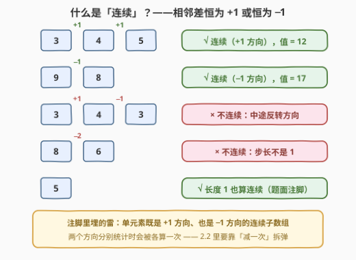
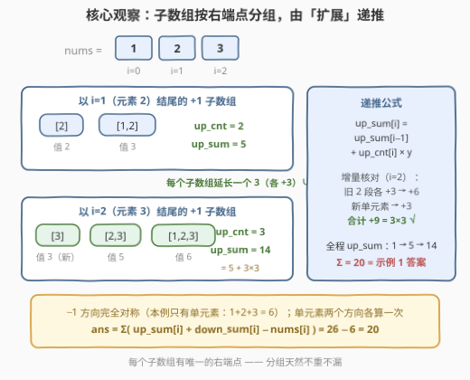
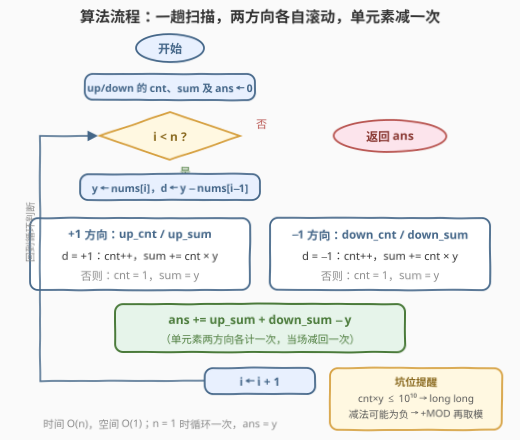
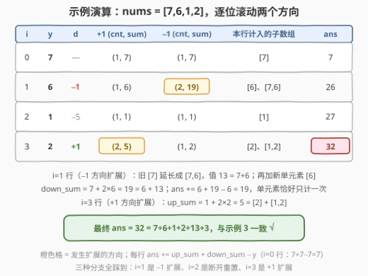

# 连续子数组的和

- **题目名称**：连续子数组的和
- **链接**：[3284. 连续子数组的和](https://leetcode.cn/problems/sum-of-consecutive-subarrays/)
- **难度**：中等
- **标签**：数组、动态规划、双指针

## 1. 题目概述

> ⚠️ 本题为 LeetCode 付费题，题意描述根据官方示例用例与 hints 重建，可能与官方题面有出入。

如果一个长度为 $n$ 的数组 `arr` 满足以下条件**之一**，就称它是**连续**的：

- 对所有 $1 \le i < n$，都有 $arr[i] - arr[i-1] = 1$（全程每次 **+1**）；
- 对所有 $1 \le i < n$，都有 $arr[i] - arr[i-1] = -1$（全程每次 **−1**）。

数组的**值**定义为其元素之和。例如 `[3,4,5]` 是值为 12 的连续数组，`[9,8]` 是值为 17 的连续数组；而 `[3,4,3]` 和 `[8,6]` 都不连续。

给定一个整数数组 `nums`，返回其中所有**连续** **子数组**的**值**之和。由于答案可能很大，返回它对 $10^9 + 7$ **取模**后的值。**注意：长度为 1 的数组也被认为是连续的。**

一句话读题：把所有「相邻差恒等于 +1 或恒等于 −1」的子数组挑出来，把它们的元素和再全部加起来，模 $10^9+7$。

**示例 1**：

```text
输入：nums = [1,2,3]
输出：20
解释：连续子数组为 [1]、[2]、[3]、[1,2]、[2,3]、[1,2,3]，
     它们的值之和为 1 + 2 + 3 + 3 + 5 + 6 = 20。
```

**示例 2**：

```text
输入：nums = [1,3,5,7]
输出：16
解释：相邻两数之差都是 2，只有单元素子数组：1 + 3 + 5 + 7 = 16。
```

**示例 3**：

```text
输入：nums = [7,6,1,2]
输出：32
解释：连续子数组为 [7]、[6]、[1]、[2]、[7,6]、[1,2]，
     值之和为 7 + 6 + 1 + 2 + 13 + 3 = 32。
```

**约束条件**：

- $1 \le nums.length \le 10^5$
- $1 \le nums[i] \le 10^5$

> 💡 读题关键：「连续」约束的是**子数组内部相邻差恒为 ±1**——方向一旦定下就不能中途反转（`[3,4,3]` 不连续），步长也必须恰为 1（`[8,6]` 不连续）。再加上「长度 1 也算连续」这句注脚：单元素既是 +1 方向的成员、也是 −1 方向的成员，这颗小雷在统计时要用「减一次」拆掉。$n \le 10^5$ 直接判了 $O(n^2)$ 枚举子数组的死刑，必须把「对所有子数组求和」压成每个元素 $O(1)$ 的摊还更新。

---

## 2. 解题思路

### 2.1 暴力思路：枚举右端点 + 增量判定，$O(n^2)$

枚举每个子数组 $[i, j]$：固定左端点 $i$ 后让 $j$ 右扩，同时增量维护「当前段是否仍连续」（方向一致且步长为 1）与「当前段元素和」，合法就把段和累进答案。整体 $O(n^2)$——$n = 10^5$ 时约 $10^{10}$ 次操作，必然超时，只能当对拍工具。

> ⚠️ 卡点：暴力把每个子数组当成独立对象从头检查。但「子数组的值」其实可以**由更短的子数组增量拼出来**——以 $i$ 结尾的子数组，恰好是「以 $i-1$ 结尾的子数组各自延长一个元素」再添一个新单元素。这层**集合间的包含关系**才是提速的钥匙。

### 2.2 核心观察：按右端点分组 + 「扩展」递推，$O(n)$

先看清「连续」长什么样——方向恒定、步长恒为 1，长度 1 也算：



**观察 1（连续子数组按右端点分组，天然不重不漏）**：任何子数组有且仅有一个右端点。于是把全体连续子数组按右端点 $i$ 划分成 $n$ 组：

$$ans = \sum_{i=0}^{n-1} \Big( \text{以 } i \text{ 结尾的连续子数组值之和} \Big)$$

而「以 $i$ 结尾的连续子数组」只依赖 $nums[i-1]$ 与 $nums[i]$ 的差就能从「以 $i-1$ 结尾」的集合**整体扩展**出来——无后效性齐活，线性 DP 的标准形态。

**观察 2（扩展递推：值和怎么从 $i-1$ 传到 $i$）**：记 $y = nums[i]$。若 $y - nums[i-1] = 1$，则以 $i$ 结尾的 +1 连续子数组 =「以 $i-1$ 结尾的每个 +1 子数组各自延长一个 $y$」∪ 新单元素 $[y]$。设 $up\_cnt[i]$、$up\_sum[i]$ 分别为以 $i$ 结尾的 +1 子数组的**个数**与**值和**，则：

$$up\_cnt[i] = up\_cnt[i-1] + 1$$

$$up\_sum[i] = \underbrace{up\_sum[i-1]}_{\text{旧子数组的值}} + \underbrace{up\_cnt[i] \times y}_{\text{旧 } up\_cnt[i]-1 \text{ 段各延长 } y\text{，再加新单元素 } y}$$

若 $y - nums[i-1] \ne 1$，游程断掉，只剩单元素：$up\_cnt[i] = 1,\ up\_sum[i] = y$。−1 方向（$down\_cnt / down\_sum$）完全对称。

> 💡 一个藏得很深的细节：$up\_cnt[i]$ 恰好等于以 $i$ 结尾的**极大 +1 游程长度**——因为游程的每个后缀都是合法连续子数组，反之合法子数组也只能取游程的后缀，个数就是长度。所以「个数」不用单独维护复杂结构，跟着游程走就行。



**观察 3（单元素被两个方向各算一次——减回来）**：单元素 $[y]$ 既是 +1 方向也是 −1 方向的连续子数组，被 $up\_sum[i]$ 与 $down\_sum[i]$ **各统计一次**。而「以 $i$ 结尾」的真正集合是两者之**并**（交集恰是这个单元素），由容斥：

$$ans = \sum_{i=0}^{n-1} \big( up\_sum[i] + down\_sum[i] - nums[i] \big)$$

拿示例 1 核对：$up\_sum = 1, 5, 14$，$down\_sum = 1, 2, 3$，$\sum nums = 6$，$ans = (1+5+14) + (1+2+3) - 6 = 20$ ✓。

> 💡 一句话记忆：**子数组按右端点报名，值和沿游程滚动传，单元素两头占、当场减一次**。结构上是「以 $i$ 结尾」型计数 DP（713、795 同族）叠了一层 up/down 双向游程状态（978 的双状态思想），两块都是老朋友。

### 2.3 算法流程图

一趟扫描，每步做三件事——两个方向各自更新、汇总时减掉单元素的重复计数：



1. **+1 方向**：若 $d = y - nums[i-1]$ 等于 $+1$，则 `up_cnt++`、`up_sum += up_cnt * y`（旧子数组整段扩展 + 新单元素）；否则重置 `up_cnt = 1, up_sum = y`；
2. **−1 方向**：对称处理 `down_cnt / down_sum`；
3. **汇总**：`ans += up_sum + down_sum - y`，把单元素的重复计数当场拆掉。

### 2.4 示例演算

以 `nums = [7,6,1,2]` 为例——三种分支全踩到（−1 扩展、断开重置、+1 扩展）：



| $i$ | $y$ | $d$ | +1 方向 (cnt, sum) | −1 方向 (cnt, sum) | 本行计入的子数组 | $ans$ |
|----|----|-----|-------------------|-------------------|----------------|-------|
| 0 | 7 | — | (1, 7) | (1, 7) | $[7]$ | 7 |
| 1 | 6 | −1 | (1, 6) | (2, **19**) | $[6]$、$[7,6]$ | 26 |
| 2 | 1 | −5 | (1, 1) | (1, 1) | $[1]$ | 27 |
| 3 | 2 | +1 | (2, **5**) | (1, 2) | $[2]$、$[1,2]$ | **32** |

$i=1$ 行是扩展递推的活标本：旧的 $[7]$ 延长成 $[7,6]$（值 $13 = 7 + 6$），再加新单元素 $[6]$，于是 $down\_sum = 7 + 2 \times 6 = 19 = 6 + 13$ ✓；单元素 $[6]$ 在 `up_sum`、`down_sum` 里各出现一次，`ans += 6 + 19 − 6 = 19` 恰好只计一次。最终 $ans = 32$，与示例 3 一致。

---

## 3. 参考代码

### C++

```cpp
class Solution {
  public:
    int getSum(vector<int>& nums) {
        const int MOD = 1e9 + 7;
        long long ans = 0, upSum = 0, downSum = 0;  // 以当前元素结尾的两方向「值和」
        long long upCnt = 0, downCnt = 0;           // 对应子数组个数 = 游程长度
        for (int i = 0; i < (int)nums.size(); ++i) {
            long long y = nums[i];
            if (i > 0 && nums[i] - nums[i - 1] == 1) {   // 接得上 +1 游程：整段扩展
                ++upCnt;
                upSum = (upSum + upCnt * y) % MOD;
            } else {                                     // 接不上：只剩单元素 [y]
                upCnt = 1;
                upSum = y;
            }
            if (i > 0 && nums[i] - nums[i - 1] == -1) {  // −1 方向对称处理
                ++downCnt;
                downSum = (downSum + downCnt * y) % MOD;
            } else {
                downCnt = 1;
                downSum = y;
            }
            ans = (ans + upSum + downSum - y + MOD) % MOD;  // 单元素两方向各算一次，减回一次
        }
        return ans;
    }
};
```

### Python

```python
class Solution:
    def getSum(self, nums: List[int]) -> int:
        MOD = 10**9 + 7
        ans = up_sum = down_sum = 0    # 以当前元素结尾的两方向「值和」
        up_cnt = down_cnt = 0          # 对应子数组个数 = 游程长度
        for i, y in enumerate(nums):
            if i and y - nums[i - 1] == 1:    # 接得上 +1 游程：整段扩展
                up_cnt += 1
                up_sum = (up_sum + up_cnt * y) % MOD
            else:                             # 接不上：只剩单元素 [y]
                up_cnt, up_sum = 1, y
            if i and y - nums[i - 1] == -1:   # −1 方向对称处理
                down_cnt += 1
                down_sum = (down_sum + down_cnt * y) % MOD
            else:
                down_cnt, down_sum = 1, y
            ans = (ans + up_sum + down_sum - y) % MOD  # 单元素减回一次
        return ans
```

> 💡 细节盘点：$up\_cnt \le 10^5$、$y \le 10^5$，乘积上限 $10^{10}$ 超过 32 位，C++ 全程 `long long`；`up_sum + down_sum - y` 里两项已各自取过模，差值可能为负，C++ 要 `+MOD` 兜底，Python 的 `%` 天然返回非负。$n = 1$ 时循环只跑一轮，两方向都只剩单元素，$ans = 0 + y + y - y = y$，边界自洽。

---

## 4. 复杂度分析

| 维度 | 复杂度 | 说明 |
|------|--------|------|
| 时间复杂度 | $O(n)$ | 一趟扫描，每个元素只更新两组滚动变量 |
| 空间复杂度 | $O(1)$ | `cnt / sum × 2 方向 + ans` 共 5 个滚动变量 |
| 暴力对照 | $O(n^2)$ / $O(1)$ | 2.1 枚举全部子数组，$n \le 10^5$ 超时——没利用「以 i 结尾集合可整体扩展」的结构 |

---

## 5. 扩展

### 5.1 元素视角的贡献法：游程 + 出现次数权重

换个视角：不求「每个子数组的值」，改问「**每个元素被多少个连续子数组包含**」。设 $nums[i]$ 所在的极大 +1 游程向左延伸 $a_+$ 步、向右延伸 $b_+$ 步，则包含它的 +1 子数组有 $(a_+ + 1)(b_+ + 1)$ 个（左端点 $a_+ + 1$ 种 × 右端点 $b_+ + 1$ 种）；−1 方向同理。于是：

$$ans = \sum_i nums[i] \times \Big[ (a_+ + 1)(b_+ + 1) + (a_- + 1)(b_- + 1) - 1 \Big]$$

（$-1$ 还是拆单元素重复计数那颗雷。）实现上不必逐元素求 $a, b$，按游程整段算更省事：极大游程 $[i..j]$ 长度为 $L$，其中第 $k$ 位（$0 \le k < L$）的左右端点选择数分别为 $k+1$ 与 $L-k$，恰好出现在 $(k+1)(L-k)$ 个子数组里。两指针扫出所有极大游程：

```cpp
class Solution {
  public:
    int getSum(vector<int>& nums) {
        const int MOD = 1e9 + 7;
        int n = nums.size();
        long long ans = 0;
        for (int d : {1, -1}) {  // 两个方向各扫一遍极大游程
            int i = 0;
            while (i < n) {
                int j = i;
                while (j + 1 < n && nums[j + 1] - nums[j] == d) ++j;  // 游程 [i, j]
                long long L = j - i + 1;
                for (int k = 0; k < L; ++k)  // 第 k 位出现在 (k+1)(L−k) 个子数组里
                    ans = (ans + (long long)nums[i + k] * ((k + 1) * (L - k) % MOD)) % MOD;
                i = j + 1;
            }
        }
        for (int x : nums) ans = (ans - x + MOD) % MOD;  // 单元素两方向各计一次
        return ans;
    }
};
```

```python
class Solution:
    def getSum(self, nums: List[int]) -> int:
        MOD = 10**9 + 7
        n, ans = len(nums), 0
        for d in (1, -1):  # 两个方向各扫一遍极大游程
            i = 0
            while i < n:
                j = i
                while j + 1 < n and nums[j + 1] - nums[j] == d:
                    j += 1  # 游程 [i, j]
                L = j - i + 1
                for k in range(L):  # 第 k 位出现在 (k+1)(L−k) 个子数组里
                    ans += nums[i + k] * (k + 1) * (L - k)
                i = j + 1
        return (ans - sum(nums)) % MOD  # 单元素两方向各计一次
```

这正是官方 hint 里 two-pointer 路线的完整形态：主解按「子数组」聚合、本解按「元素」聚合，殊途同归，两份代码可以互相对拍。

### 5.2 面试追问速答

| 追问 | 改法 |
|------|------|
| 只统计长度 $\ge 2$ 的子数组？ | 单元素在 $ans$ 里恰好被计一次（减过重复后），直接 $ans - \sum nums$ |
| 只统计 +1 递增方向？ | 答案 = $\sum up\_sum[i]$，连「减一次」都不用（没有双向重复） |
| 改统计**个数**而非值和？ | $ans = \sum \big( up\_cnt[i] + down\_cnt[i] - 1 \big)$，同一套滚动换个聚合量 |
| 求值**最大**的连续子数组？ | 滚动改取 max：$up\_sum[i] = \max(up\_sum[i-1] + y,\ y)$，就是 Kadane（[53. 最大子数组和](https://leetcode.cn/problems/maximum-subarray/)）套上游程约束 |

---

## 6. 面试要点

1. **为什么按右端点分组不会重、不会漏？**

   - 任何子数组有且仅有一个右端点，按右端点把全体连续子数组划分成 $n$ 个互不相交的组，各组值和相加即全体值和。这是「以 $i$ 结尾」型计数的标准开局（713、795 同款）。

2. **扩展递推 $up\_sum[i] = up\_sum[i-1] + up\_cnt[i] \times y$ 为什么成立？**

   - 以 $i$ 结尾的 +1 子数组集合 =「以 $i-1$ 结尾的每个子数组延长 $y$」∪ 新单元素 $[y]$。延长让每个旧子数组的值 $+y$，共 $up\_cnt[i]-1$ 个，再加单元素的 $y$，合计增量 $up\_cnt[i] \times y$。

3. **为什么 $up\_cnt[i]$ 恰好等于游程长度？**

   - 极大 +1 游程的每个后缀都合法，反之以 $i$ 结尾的合法子数组只能是该游程的后缀——后缀个数恰为游程长度。个数与长度合二为一，是本题递推格外简洁的原因。

4. **单元素的重复计数怎么处理？**

   - $[y]$ 同时属于 +1 与 −1 方向，$up\_sum[i]$ 与 $down\_sum[i]$ 各计一次，汇总时减一次 $y$（容斥：并 = 和 − 交，交集恰为单元素）。忘了减的话示例 1 会答成 26 而不是 20——面试时主动报出这个坑是加分项。

5. **取模与溢出有哪些坑？**

   - $up\_cnt \times y$ 上限 $10^{10}$，C++ 必须 64 位；`up_sum + down_sum - y` 两项已各自取模、差可能为负，补 `+MOD` 再取模；Python 无溢出且 `%` 恒非负，最省心。

6. **与 $O(n^2)$ 暴力的本质差距在哪？**

   - 暴力把每个子数组当独立对象；DP 注意到「以 $i$ 结尾」的集合可由「以 $i-1$ 结尾」的集合**整体平移扩展**得到，而集合的这次变化只需「个数 + 值和」两个数即可编码，于是每步 $O(1)$ 摊还——典型的**把集合运算压缩成聚合量递推**。

---

## 7. 同类练习题

- [3254. 长度为 K 的子数组的能量值 I](https://leetcode.cn/problems/find-the-power-of-k-size-subarrays-i/)：同一个「相邻差恰为 1」游程判据的定长窗口版（3255 是大 $n$ 版），练熟游程判定再做本题会非常顺手
- [795. 区间子数组个数](https://leetcode.cn/problems/number-of-subarrays-with-bounded-maximum/)：同族「以 $i$ 结尾的子数组计数」右端点递推，只是约束从「差恒 ±1」换成「最大值落在区间内」
- [978. 最长湍流子数组](https://leetcode.cn/problems/longest-turbulent-subarray/)：同样维护 up/down 双游程状态，但要求比较符号**交替**出现——与本题「方向恒定」互为镜像
- [1524. 和为奇数的子数组数目](https://leetcode.cn/problems/number-of-sub-arrays-with-odd-sum/)：同为「对所有子数组聚合 + 模 $10^9+7$」，用前缀和奇偶性把 $O(n^2)$ 压到 $O(n)$
- [2414. 最长的字母序连续子字符串](https://leetcode.cn/problems/length-of-the-longest-alphabetical-continuous-substring/)：本题的「只求最长 +1 游程」退化版，适合当热身题
