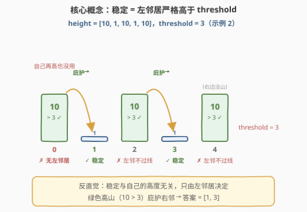
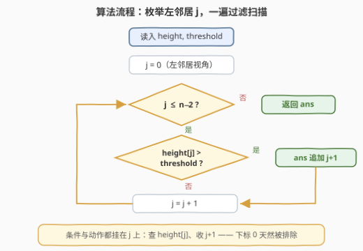
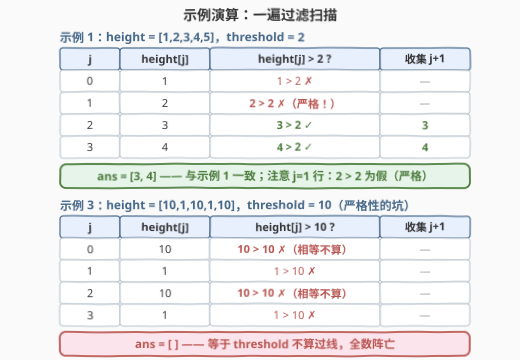

# LeetCode 找到稳定山的下标 题解

## 1. 题目概述

- **标题 / 题号**：找到稳定山的下标（#3285，easy）
- **链接**：https://leetcode.cn/problems/find-indices-of-stable-mountains/
- **难度**：简单
- **标签**：数组

**题意**：有 $n$ 座山排成一列，每座山都有一个高度。给你一个整数数组 `height`，其中 `height[i]` 表示第 $i$ 座山的高度，再给你一个整数 `threshold`。

对于**下标不为 0** 的一座山，如果它左侧相邻的山的高度**严格大于** `threshold`，那么我们称它是**稳定**的。我们定义下标为 0 的山**不是**稳定的。

请你返回一个数组，包含所有**稳定**山的下标，可以以**任意**顺序返回。

**示例 1**：

```text
输入：height = [1,2,3,4,5], threshold = 2
输出：[3,4]
解释：下标为 3 的山是稳定的，因为 height[2] == 3 大于 threshold == 2。
     下标为 4 的山是稳定的，因为 height[3] == 4 大于 threshold == 2。
```

**示例 2**：

```text
输入：height = [10,1,10,1,10], threshold = 3
输出：[1,3]
```

**示例 3**：

```text
输入：height = [10,1,10,1,10], threshold = 10
输出：[]
```

**约束**：

- `2 <= n == height.length <= 100`
- `1 <= height[i] <= 100`
- `1 <= threshold <= 100`

> 💡 读题关键：① 「稳定」与山**自己的高度毫无关系**，只看**左邻居**——名字起得相当反直觉；② 是**严格大于**，相等不算过线（示例 3 全军覆没的原因）；③ 下标 0 没有左邻居，**永不稳定**；④ 答案**允许任意顺序**，顺序扫描天然产出升序，无需任何排序。

## 2. 解题思路

### 2.1 暴力思路：站在「山」的视角逐个判定

按题意直接模拟：对每个下标 $i \ge 1$，回头看一眼 `height[i-1]`，若严格大于 `threshold` 就把 $i$ 收进答案：

```python
ans = []
for i in range(1, len(height)):      # 山的视角：i 从 1 起（下标 0 永不稳定）
    if height[i - 1] > threshold:    # 回头看左邻居
        ans.append(i)
```

这已经是一次 $O(n)$ 扫描，渐近上无可挑剔。但写法上藏着两处别扭：循环必须从 1 起步来特判下标 0；「**条件查的是 $i-1$、收集的是 $i$**」，读写两个错位的下标，差一错误（off-by-one）的风险全部藏在这一点里。

### 2.2 核心观察：判定是单向局部的——换成「左邻居」视角



**观察 1（局部性）**：山 $i$ 稳定与否只取决于 `height[i-1]` 这**一个数**，与更远处的山、与它自己的高度统统无关。不存在任何需要「预处理」「回头补算」的全局信息——一次从左到右的顺序扫描即可给出全部答案。

**观察 2（视角转换）**：把枚举对象从「山 $i$」换成「左邻居 $j$」——扫描 $j$ 从 $0$ 到 $n-2$，凡 `height[j] > threshold`，就收集 $j+1$：

$$\text{ans} = \{\, j+1 \mid 0 \le j \le n-2,\ \text{height}[j] > \text{threshold} \,\}$$

条件与动作挂在**同一个** $j$ 上（查 `height[j]`、收 $j+1$）：一方面「$i$ 从 1 起步」的边界特判消失了——$j+1 \ge 1$ 保证下标 0 天然被排除；另一方面查、收两个下标由同一个变量派生，错位风险被压到最小。

**观察 3（严格性）**：三处约束里唯一刻意埋的坑。示例 3 中 `height = [10,1,10,1,10]`、`threshold = 10`，所有 `10 > 10` 均为**假**，答案是空数组——判定必须用 `>` 而不是 `>=`。

### 2.3 算法流程图



流程只有一条主链：枚举 $j$ → 判 `height[j] > threshold` → 成立则收集 $j+1$ → $j$ 前进。整个算法是一个标准的**谓词过滤扫描**（filter scan）：对每个位置做一次 $O(1)$ 判定，收集通过者，除此之外什么也不做。

### 2.4 示例演算



以示例 1（`height = [1,2,3,4,5]`，`threshold = 2`）走表：

| $j$（左邻居） | `height[j]` | 判定 `height[j] > 2` | 收集 $j+1$ |
|---------------|-------------|----------------------|------------|
| 0 | 1 | $1 > 2$ ✗ | — |
| 1 | 2 | $2 > 2$ ✗（**严格**） | — |
| 2 | 3 | $3 > 2$ ✓ | **3** |
| 3 | 4 | $4 > 2$ ✓ | **4** |

$\text{ans} = [3,4]$。注意 $j=1$ 行：`height[1] = 2` **恰好等于** `threshold`，严格大于不成立，山 2 不稳定。示例 3 更是把这条规则推到极致：所有「$10 > 10$」全为假，$\text{ans} = []$。

## 3. 参考代码

### C++（枚举左邻居）

```cpp
class Solution {
  public:
    vector<int> stableMountains(vector<int>& height, int threshold) {
        vector<int> ans;
        // 枚举左邻居 j：height[j] 严格大于 threshold 时，山 j+1 稳定
        for (int j = 0; j + 1 < (int)height.size(); ++j) {
            if (height[j] > threshold) ans.push_back(j + 1);
        }
        return ans;
    }
};
```

### Python（显式循环 + 列表推导一行流）

```python
class Solution:
    def stableMountains(self, height: List[int], threshold: int) -> List[int]:
        ans = []
        for j in range(len(height) - 1):   # j 是左邻居，j+1 才是被判定的山
            if height[j] > threshold:
                ans.append(j + 1)
        return ans
```

```python
class Solution:
    def stableMountains(self, height: List[int], threshold: int) -> List[int]:
        return [j + 1 for j in range(len(height) - 1) if height[j] > threshold]
```

> 💡 C++ 循环条件写 `j + 1 < size` 而非 `j < size - 1`：`size()` 是无符号数，空数组时 `size() - 1` 会下溢成极大值（本题 $n \ge 2$ 不触发，但把边界放在 $j$ 一侧是更稳的习惯写法）。

## 4. 复杂度分析

| 维度 | 复杂度 | 说明 |
|------|--------|------|
| 时间复杂度 | $O(n)$ | 每个左邻居一次 $O(1)$ 判定；输出规模可达 $n-1$、读入即 $n$ 个数，$\Omega(n)$ 是下界，一遍扫描已达最优 |
| 空间复杂度 | $O(1)$ | 不计输出数组，只用了常数个变量 |

## 5. 扩展：把「局部判定」升级的三种变体

本体是一次性询问，扫描即答。同样的「山列」骨架换一种判定条件，考点立刻分层：

1. **左右邻居都过线才稳定**：判定变为 `height[i-1] > t && height[i+1] > t`，两端按题意处理——仍是 $O(n)$，一次扫描同时看两侧即可。
2. **左侧所有山都过线才稳定**：判定从局部条件升级为**前缀条件**——预处理 $\text{prefix\_min}[i] = \min(\text{height}[0..i-1])$，山 $i$ 稳定 $\iff \text{prefix\_min}[i] > t$，线性预处理后每座山 $O(1)$ 判定。
3. **同一数组回答多个 threshold 的计数询问**：对 `height` 做值域计数 `cnt[]`（$V = 100$），「有多少座山稳定」= $\sum_{t' > t} \text{cnt}[t']$ 再剔除 $j = n-1$ 的贡献，$O(n + V)$ 预处理、每次询问 $O(1)$；若要**列出**下标，输出本身有规模下界，只能按输出大小计费。

> 💡 三种变体的共同骨架：判定的信息依赖方式（局部 / 前缀 / 值域统计）决定预处理结构——这正是把一道签到题讲出层次感的抓手。

## 6. 面试要点

1. **为什么下标 0 永远不会出现在答案里？**

   - 它没有左邻居，被定义直接排除。代码层面采用「枚举左邻居 $j$、收集 $j+1$」的视角，$j+1 \ge 1$ 天然排除，不需要 `if (i == 0) continue` 之类的特判。

2. **严格大于和大于等于差在哪？**

   - 相等不算过线。示例 3：`height = [10,1,10,1,10]`、`threshold = 10`，所有 `10 > 10` 均为假，答案为空数组。这是本题唯一刻意埋的坑。

3. **「以任意顺序返回」说明了什么？**

   - 收集顺序不影响正确性，判题器做的是多重集合比对；顺序扫描天然产出升序下标，是最简洁的实现，无需刻意打乱或排序。

4. **能否做到低于 $O(n)$？**

   - 不能。输出最多 $n-1$ 个下标、读入就有 $n$ 个数，$\Omega(n)$ 是信息论下界；一遍扫描即已触底。

5. **枚举「左邻居 $j$」比枚举「山 $i$」好在哪？**

   - 把「查 `height[i-1]`、收 $i$」两个错位下标，统一成「查 `height[j]`、收 `j+1`」挂在同一变量上；边界特判（$i$ 从 1 起）随之消失。一次小视角转换换来更短的代码和更少的差一错误。

## 同类练习题

| # | 题目 | 与本题的关联 |
|---|------|-------------|
| 2942 | [查找包含给定字符的单词](https://leetcode.cn/problems/find-words-containing-character/) | 同为「一遍扫描 + 谓词过滤收集下标」，几乎同构 |
| 1431 | [拥有最多糖果的孩子](https://leetcode.cn/problems/kids-with-the-greatest-number-of-candies/) | 一遍扫描 + $O(1)$ 局部判定收集布尔结果，多了「先扫一遍求 max」的前置信息 |
| 1920 | [基于排列构建数组](https://leetcode.cn/problems/build-array-from-permutation/) | 一遍扫描按下标映射收集，纯粹的「读下标、算下标」手感 |
| 1773 | [统计匹配检索规则的物品数量](https://leetcode.cn/problems/count-items-matching-a-rule/) | 谓词过滤的计数版——只数不收，体会 filter 的两种产出 |
