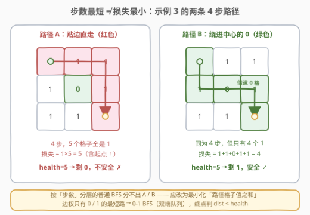
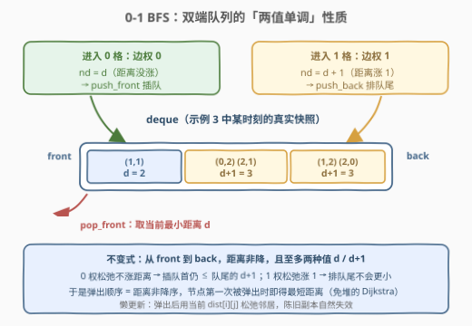
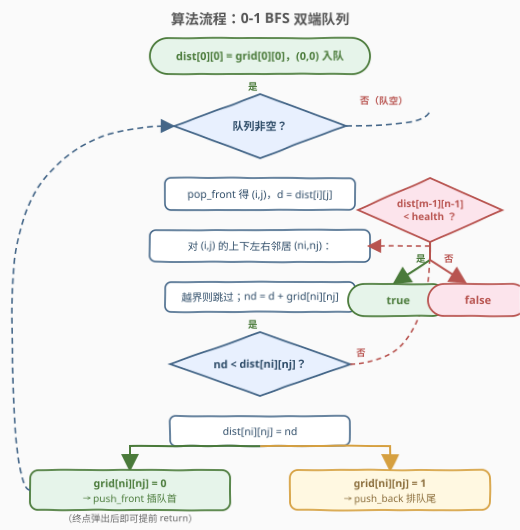
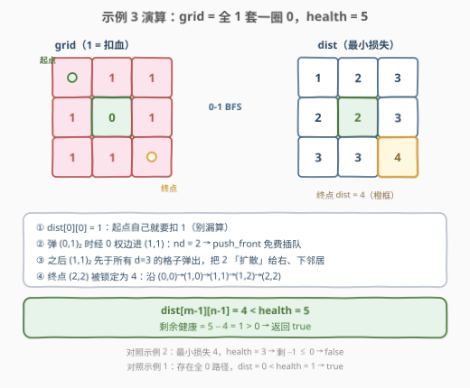

# LeetCode 穿越网格图的安全路径 题解

## 1. 题目概述

- **标题 / 题号**：穿越网格图的安全路径（#3286，medium）
- **链接**：https://leetcode.cn/problems/find-a-safe-walk-through-a-grid/
- **难度**：中等
- **标签**：广度优先搜索、图、最短路、堆（优先队列）

**题意**：给你一个 $m \times n$ 的二进制矩形 `grid` 和一个整数 `health` 表示你的健康值。

你开始于矩形的**左上角** $(0, 0)$，目标是**右下角** $(m-1, n-1)$。你可以在矩形中往上、下、左、右相邻格子移动，但前提是你的健康值**始终是正数**。

对于格子 $(i, j)$，如果 `grid[i][j] = 1`，那么这个格子视为**不安全**的，会使你的健康值减少 1。

如果你可以到达最终的格子，请你返回 `true`，否则返回 `false`。**注意**，当你在最终格子的时候，你的健康值也必须为**正数**。

**示例 1**：

```text
输入：grid = [[0,1,0,0,0],[0,1,0,1,0],[0,0,0,1,0]], health = 1
输出：true
解释：沿着灰色格子走，可以安全到达最终的格子。
```

**示例 2**：

```text
输入：grid = [[0,1,1,0,0,0],[1,0,1,0,0,0],[0,1,1,1,0,1],[0,0,1,0,1,0]], health = 3
输出：false
解释：健康值最少为 4 才能安全到达最后的格子。
```

**示例 3**：

```text
输入：grid = [[1,1,1],[1,0,1],[1,1,1]], health = 5
输出：true
解释：沿着灰色格子走，可以安全到达最终的格子。
任何不经过格子 (1, 1) 的路径都是不安全的。
```

**约束**：

- $m = \text{grid.length}$，$n = \text{grid[i].length}$
- $1 \le m, n \le 50$，$2 \le m \times n$
- $1 \le \text{health} \le m + n$
- `grid[i][j]` 要么是 0，要么是 1

> 💡 **读题关键**：① 健康值**全程**（包括起点、包括终点）都必须为**正数**——「剩余 $> 0$」是**严格**不等式，$=$ 不行；② 损失从**踩上起点那一刻**就开始计（示例 3 的起点自己就是 1）；③ $1 \le \text{health} \le m+n$ 说明损失值域极小（路径损失上界约 $m + n - 1$），这是后面压掉健康值维度、把问题缩成小权最短路的规模保障。

## 2. 解题思路

### 2.1 暴力思路：把「剩余健康」塞进状态的三维 BFS

最直接的建模是把**剩余健康值**编进状态：$f(i, j, h)$ 表示「位于 $(i,j)$、当前健康为 $h$（已扣除 $(i,j)$ 自身的消耗）」是否可达。从 $f(0, 0, \text{health} - \text{grid}[0][0])$ 出发做普通 BFS，向邻居 $(n_i, n_j)$ 转移时要求 $h - \text{grid}[n_i][n_j] > 0$（全程为正），终点处任意 $h > 0$ 即成功。

- 状态数 $O(m \cdot n \cdot \text{health}) \le 50 \times 50 \times 100 = 2.5 \times 10^5$，本题规模下轻松跑完；
- 但它把「同一格子上不同健康值」当成**不同世界**，重复搜索了海量冗余状态——例如绕两条损失相同的不同路径到达同一格，会产生两份几乎等价的搜索。

若再朴素一点直接 DFS 枚举所有路径，则是指数级。真正的突破口在于注意到：**我们并不需要知道每一步剩多少血，只需要知道「最少总共扣多少血」**。

### 2.2 核心观察：只关心「最小总损失」——0-1 边权最短路



**观察 1（目标改写）**：设一条路径的**总损失**为路径上所有格子（含起点与终点）的 `grid` 值之和 $L$，走完剩余健康为 $\text{health} - L$。由「全程为正」$\iff$「终点处剩余 $> 0$」（损失在途中只减不增，终点是最紧的位置），得：

$$\text{安全} \iff L < \text{health} \iff L_{\min} < \text{health}$$

问题转化为：求 $(0,0)$ 到 $(m-1,n-1)$ 的**最小总损失** $L_{\min}$，即路径上 1 的个数的minimization——一个地道的**最短路问题**。

**观察 2（为什么普通 BFS 不行）**：普通 BFS 按**步数**分层，找到的是步数最少的路径；但步数最短与损失最小**互不蕴含**。示例 3 里两条路径同为 4 步，损失却差 1；更一般地，损失最小的路径可能要**绕远路**去借道一片 0 格。分层的「尺子」选错了，`visited` 只记格子必然出错。

**观察 3（0-1 边权建模）**：把「进入格子 $(n_i, n_j)$」看作一条**权为 $\text{grid}[n_i][n_j]$ 的边**——权只有 0（安全格）和 1（不安全格）两种。起点的贡献放进初始值：$\text{dist}[0][0] = \text{grid}[0][0]$。边权 $\subseteq \{0, 1\}$ 的最短路不需要堆，用**双端队列的 0-1 BFS** 即可做到线性：



- 从队首弹出 $(i,j)$，用 $d = \text{dist}[i][j]$ 松弛四个邻居；
- 邻居权为 0：$nd = d$，**push_front** 插队首；
- 邻居权为 1：$nd = d + 1$，**push_back** 排队尾。

> 💡 **正确性一句话**：队列中从 front 到 back 的距离**非降且至多两种值** $d / d+1$——0 权松弛不涨距离（插队首不会小于当前队首的 $d$），1 权松弛涨 1（排队尾不会小于队尾的 $d+1$）。于是弹出顺序恰是距离非降序，**每个节点第一次被弹出时其 dist 就已最短**——这是「免堆的 Dijkstra」。

### 2.3 算法流程图



| 步骤 | 操作 | 说明 |
|------|------|------|
| ① 初始化 | $\text{dist}[0][0] = \text{grid}[0][0]$，$(0,0)$ 入队 | ⚠️ 起点自身的消耗别漏算 |
| ② 弹出 | `pop_front` 得 $(i,j)$，若记录距离 $d > \text{dist}[i][j]$ 则跳过 | 丢弃陈旧副本，保证 $O(mn)$ |
| ③ 松弛 | 对四邻居算 $nd = d + \text{grid}[n_i][n_j]$ | 越界跳过 |
| ④ 入队 | $nd < \text{dist}[n_i][n_j]$ 时更新；权 0 → `push_front`，权 1 → `push_back` | 维护两值单调 |
| ⑤ 终判 | 队空后判 $\text{dist}[m-1][n-1] < \text{health}$ | 剩余健康 $> 0$，严格小于 |

### 2.4 示例演算



以示例 3（`grid = [[1,1,1],[1,0,1],[1,1,1]]`，`health = 5`）走一遍关键节点：

| 步骤 | 弹出 | 松弛动作 | 队列（front → back） |
|------|------|----------|----------------------|
| 0 | — | $\text{dist}[0][0] = 1$，入队 | $(0,0)_1$ |
| 1 | $(0,0)_1$ | $(0,1)$、$(1,0)$ 均 $nd=2$，push_back | $(0,1)_2,\ (1,0)_2$ |
| 2 | $(0,1)_2$ | $(1,1)$ 是 0 格：$nd=2$ → **push_front**；$(0,2)$：$nd=3$ → push_back | $\mathbf{(1,1)_2},\ (1,0)_2,\ (0,2)_3$ |
| 3 | $(1,1)_2$ | $(2,1)$、$(1,2)$ 均 $nd=3$ → push_back | $(1,0)_2,\ (0,2)_3,\ (2,1)_3,\ (1,2)_3$ |
| 4 | $(1,0)_2$ | $(2,0)$：$nd=3$ → push_back | $(0,2)_3,\ \dots,\ (2,0)_3$ |
| 5 | $d=3$ 一批 | $(2,2)$ 被 $(2,1)_3$ 松弛为 $4$ → push_back | $\dots,\ (2,2)_4$ |
| 6 | $(2,2)_4$ | 终点锁定：$\text{dist}[2][2] = 4$ | — |

判定：$4 < 5$，剩余健康 $5 - 4 = 1 > 0$ → **true**。对照示例 2：$L_{\min} = 4$，`health = 3`，剩余 $-1$，false；示例 1 存在全 0 路径，$L_{\min} = 0 < 1$，true。

## 3. 参考代码

### C++（0-1 BFS，双端队列）

```cpp
class Solution {
  public:
    bool findSafeWalk(vector<vector<int>>& grid, int health) {
        int m = grid.size(), n = grid[0].size();
        vector<vector<int>> dist(m, vector<int>(n, INT_MAX));
        deque<tuple<int, int, int>> dq;              // (d, i, j)
        dist[0][0] = grid[0][0];                     // 起点自身的消耗要算
        dq.push_back({grid[0][0], 0, 0});

        static const int dirs[4][2] = {{-1, 0}, {1, 0}, {0, -1}, {0, 1}};
        while (!dq.empty()) {
            auto [d, i, j] = dq.front();
            dq.pop_front();
            if (d > dist[i][j]) continue;            // 陈旧副本，跳过
            for (auto& [di, dj] : dirs) {
                int ni = i + di, nj = j + dj;
                if (ni < 0 || ni >= m || nj < 0 || nj >= n) continue;
                int nd = d + grid[ni][nj];           // 边权 = 目标格子的 grid 值
                if (nd < dist[ni][nj]) {
                    dist[ni][nj] = nd;
                    if (grid[ni][nj] == 0) dq.push_front({nd, ni, nj}); // 0 权插队首
                    else                  dq.push_back({nd, ni, nj});   // 1 权排队尾
                }
            }
        }
        return dist[m - 1][n - 1] < health;          // 剩余健康 > 0
    }
};
```

### Python（0-1 BFS，双端队列）

```python
class Solution:
    def findSafeWalk(self, grid: List[List[int]], health: int) -> bool:
        m, n = len(grid), len(grid[0])
        dist = [[inf] * n for _ in range(m)]
        dist[0][0] = grid[0][0]                      # 起点自身的消耗要算
        dq = deque([(grid[0][0], 0, 0)])             # (d, i, j)
        while dq:
            d, i, j = dq.popleft()
            if d > dist[i][j]:                       # 陈旧副本，跳过
                continue
            for ni, nj in ((i - 1, j), (i + 1, j), (i, j - 1), (i, j + 1)):
                if 0 <= ni < m and 0 <= nj < n:
                    nd = d + grid[ni][nj]            # 边权 = 目标格子的 grid 值
                    if nd < dist[ni][nj]:
                        dist[ni][nj] = nd
                        if grid[ni][nj] == 0:
                            dq.appendleft((nd, ni, nj))  # 0 权插队首
                        else:
                            dq.append((nd, ni, nj))      # 1 权排队尾
        return dist[m - 1][n - 1] < health           # 剩余健康 > 0
```

> 💡 两个易错点都在判定与初始化上：① `dist[0][0]` 必须初始化为 `grid[0][0]` 而不是 0（示例 3 的起点就是 1）；② 最终用**严格小于** `< health`（剩余健康要 $> 0$，等号意味着刚好归零，不安全）。此外队列里存 $(d, i, j)$ 并在弹出时比对 $d > \text{dist}[i][j]$ 跳过陈旧副本，是保证每个节点只被有效处理常数次的关键；若嫌麻烦，弹出后直接读 `dist[i][j]` 当 $d$ 用（SPFA 风格）也能过本题，但复杂度上界会放宽。

## 4. 复杂度分析

| 维度 | 复杂度 | 说明 |
|------|--------|------|
| 时间复杂度 | $O(m \cdot n)$ | 每个格子被有效弹出常数次（首弹即定型 + 副本跳过），每次弹出做 4 次松弛；本题 $mn \le 2500$ |
| 空间复杂度 | $O(m \cdot n)$ | `dist` 矩阵 + 双端队列 |
| 对比：堆优化 Dijkstra | $O(mn \log(mn))$ | 正确但多一个 $\log$；权值域小（0/1）时 0-1 BFS 总是更优选择 |
| 对比：三维 BFS | $O(m \cdot n \cdot \text{health})$ | 把健康编进状态，$2.5 \times 10^5$ 也能过，但状态冗余 |

## 5. 扩展：同一问题的三种最短路解法与选型

**① 堆优化 Dijkstra**：把格子当节点、进入格子的 `grid` 值当边权，小根堆按 `dist` 取最小——0-1 BFS 的「泛化版」，边权为任意非负数时仍然正确：

```python
import heapq
class Solution:
    def findSafeWalk(self, grid: List[List[int]], health: int) -> bool:
        m, n = len(grid), len(grid[0])
        dist = [[inf] * n for _ in range(m)]
        dist[0][0] = grid[0][0]
        pq = [(grid[0][0], 0, 0)]
        while pq:
            d, i, j = heapq.heappop(pq)
            if d > dist[i][j]:
                continue
            if (i, j) == (m - 1, n - 1):
                break
            for ni, nj in ((i-1,j),(i+1,j),(i,j-1),(i,j+1)):
                if 0 <= ni < m and 0 <= nj < n and d + grid[ni][nj] < dist[ni][nj]:
                    dist[ni][nj] = d + grid[ni][nj]
                    heapq.heappush(pq, (dist[ni][nj], ni, nj))
        return dist[m - 1][n - 1] < health
```

**② 桶分层 BFS**：由 $\text{health} \le m + n$ 知 $L_{\min} < m + n$，可开 $m + n$ 个桶按损失值分层轮转扫描（Dijkstra 的「值域桶」实现），同样是线性——本质与 0-1 BFS 同族。

**③ 三维 BFS（2.1 的做法）**：状态 $(i, j, h)$，最直观也最难写错，但在大网格（如 $m, n \sim 10^3$、`health` $\sim 10^6$）下会爆状态数；而 0-1 BFS 只要边权是 0/1，规模再大也是线性。**选型口诀**：边权全 1 → 普通 BFS；边权 $\subseteq \{0, 1\}$ → 双端队列 0-1 BFS；边权任意非负 → 堆 Dijkstra；边权有负 → Bellman-Ford / SPFA。

## 6. 面试要点

1. **为什么「普通 BFS + visited」是错的？**

   BFS 按步数分层，最先到达某格的路径只是**步数**最短，未必**损失**最小。示例 3 中两条 4 步路径损失差 1，且最小损失路径可能需要绕远路借道 0 格——`visited` 一旦过早打标记，就把后面更省血的走法堵死了。必须换分层尺子：按「损失」分层。

2. **0-1 BFS 为什么是对的？它和 Dijkstra 是什么关系？**

   核心是队列的**两值不变式**：front 到 back 距离非降、至多 $d$ 与 $d+1$ 两种值。0 权松弛不涨距离插队首、1 权松弛涨 1 排队尾都不破坏它，于是弹出序列按距离非降——每个节点第一次弹出时 dist 已最短。可以理解为「利用权值只有 0/1 的性质，把 Dijkstra 的堆降级成了双端队列」，复杂度从 $O(E \log V)$ 降到 $O(V + E)$。

3. **起点的消耗怎么算？最终判定为什么是严格小于？**

   损失定义为**路径上所有格子之和（含起点与终点）**，所以 `dist[0][0]` 初始化为 `grid[0][0]` 而非 0——示例 3 的起点本身就是 1，漏算会让答案从 true 变错。判定用 `dist < health`：剩余健康 $= \text{health} - L$，题目要求在终点处（途中同理）剩余为**正**，等于 0 不行。

4. **一个格子会不会被重复入队？复杂度还是 $O(mn)$ 吗？**

   会。dist 被更优值改写一次就要重新入队一次。但「首弹即定型」保证了首弹之后不会再有成功松弛；配合队列里存 $(d, i, j)$、弹出时 `d > dist[i][j]` 跳过陈旧副本，每个格子有效处理次数为常数，总复杂度严格 $O(mn)$。不跳副本、弹出时读当前 `dist` 的 SPFA 风格也正确，只是均摊上界更松。

5. **什么时候必须放弃 0-1 BFS 换堆？**

   边权一旦不止 0/1 两种（比如「进入不同格子扣不同血量」），双端队列的两值性就被破坏，必须上堆 Dijkstra（或按值域分桶）。反过来，见到「网格 + 代价只有 0/1 + 求最小代价路径」的题面，应当条件反射地写 0-1 BFS——2290、1368 与本题是同一套模板。

## 同类练习题

| # | 题目 | 与本题的关联 |
|---|------|-------------|
| 2290 | [到达角落需要移除障碍物的最小数目](https://leetcode.cn/problems/minimum-obstacle-removal-to-reach-corner/) | 同款 0-1 BFS 模板——移除障碍的花费即边权 1，空格即边权 0，几乎换皮原题 |
| 1368 | [使网格图至少有一条有效路径的最小代价](https://leetcode.cn/problems/minimum-cost-to-make-at-least-one-valid-path-in-a-grid/) | 0-1 BFS 经典——顺着箭头走边权 0、逆着走边权 1，练「把规则翻译成 0/1 边权」的建模能力 |
| 743 | [网络延迟时间](https://leetcode.cn/problems/network-delay-time/) | 堆优化 Dijkstra 标准模板，体会 0-1 BFS 是它在小权值域下的特化 |
| 1091 | [二进制矩阵中的最短路径](https://leetcode.cn/problems/shortest-path-in-binary-matrix/) | 边权全 1 的普通 BFS 最短路，作为「分层尺子」选型的对照组 |
