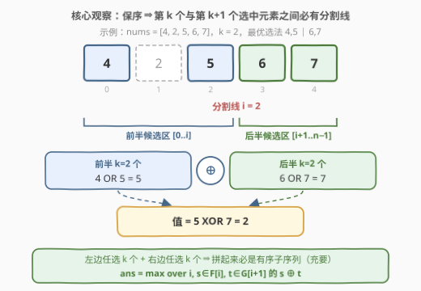
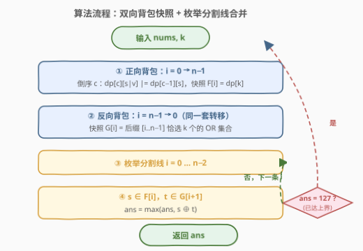

# LeetCode 求出数组中最大序列值 题解

## 1. 题目概述

- **标题 / 题号**：求出数组中最大序列值（#3287，hard）
- **链接**：https://leetcode.cn/problems/find-the-maximum-sequence-value-of-array/
- **难度**：困难
- **标签**：位运算、数组、动态规划

**题意**：给你一个整数数组 `nums` 和一个**正**整数 `k`。

定义长度为 $2 \times x$ 的序列 `seq` 的**值**为：

$$\big(\text{seq}[0] \;\mathrm{OR}\; \text{seq}[1] \;\mathrm{OR}\; \cdots \;\mathrm{OR}\; \text{seq}[x-1]\big)\ \mathrm{XOR}\ \big(\text{seq}[x] \;\mathrm{OR}\; \cdots \;\mathrm{OR}\; \text{seq}[2x-1]\big)$$

请你求出 `nums` 中所有长度为 $2k$ 的**子序列**的值的**最大值**。

**示例 1**：

```text
输入：nums = [2,6,7], k = 1
输出：5
解释：子序列 [2, 7] 的值最大，为 2 XOR 7 = 5。
```

**示例 2**：

```text
输入：nums = [4,2,5,6,7], k = 2
输出：2
解释：子序列 [4, 5, 6, 7] 的值最大，为 (4 OR 5) XOR (6 OR 7) = 5 XOR 7 = 2。
```

**约束**：

- $2 \le n = \text{nums.length} \le 400$
- $1 \le \text{nums}[i] < 2^7$
- $1 \le k \le \lfloor n/2 \rfloor$

> 💡 **审题关键**：① 子序列**保序**——选中的 $2k$ 个元素只能按下标从小到大排列，**前 $k$ 个**（下标最小的那批）进前半段、**后 $k$ 个**进后半段，不能重新洗牌；② 值域极小——$1 \le \text{nums}[i] < 2^7$，于是**任何**子集的 OR 值都落在 $[0, 128)$，全宇宙只有 128 种 OR 结果，这条「小值域」约束必是复杂度的落点；③ $2k \le n$ 恒成立，问题必有解。

## 2. 解题思路

### 2.1 暴力思路：枚举子序列

从 $n$ 个数里枚举所有 $2k$ 大小的子序列，每个再花 $O(k)$ 求值。$n = 400,\ k = 100$ 时 $\binom{400}{200}$ 是天文数字；即使 $k=1$ 的「两数最大异或」情形也要 $O(n^2)$。完全不可行。

但注意：**求值阶段我们并不关心具体选了哪些元素，只关心两半各自的 OR 值**。OR 是只增不减的聚合——「哪些元素」这一信息远比「OR 出了什么」冗余。这提示把状态压缩到「OR 值」维度上做**可达性** DP，而非枚举组合。

### 2.2 核心观察：分割点解耦 + 前后缀 OR 可达性背包



**观察 1（保序 ⇒ 存在分割线，前后半解耦）**：设选中的 $2k$ 个下标为 $p_1 < p_2 < \cdots < p_{2k}$。前半段是 $p_1..p_k$，后半段是 $p_{k+1}..p_{2k}$。在 $i = p_k$ 处画一条分割线：**前半段整段落在 $[0, i]$ 里，后半段整段落在 $[i+1, n-1]$ 里**。反过来，左边任选 $k$ 个、右边任选 $k$ 个，按下标拼接天然有序，必是合法子序列。于是记

$$F[i] = \{\text{前缀 } \text{nums}[0..i] \text{ 中恰选 } k \text{ 个元素的所有可能 OR 值}\}$$
$$G[j] = \{\text{后缀 } \text{nums}[j..n\!-\!1] \text{ 中恰选 } k \text{ 个元素的所有可能 OR 值}\}$$

则

$$\text{ans} = \max_{0 \le i \le n-2}\ \max_{s \in F[i],\ t \in G[i+1]} \big(s \oplus t\big)$$

双侧的选数约束被一条分割线彻底解耦——与「除自身以外数组的乘积」的前缀积 × 后缀积是同一招，只是这里前后缀内部还要再做一次选数 DP。

**观察 2（OR 值域 $\le 128$ ⇒ 值域背包）**：$F[i]$、$G[j]$ 本质是「子集 OR 值集合」。由于 $\text{nums}[i] < 2^7$，OR 值 $s \in [0, 128)$，用一张 $k \times 128$ 的 0/1 背包可达表即可维护：

$$dp[c][s] = \mathrm{true} \iff \text{当前已扫描的元素中恰选 } c \text{ 个、OR 值恰为 } s$$

处理新元素 $v$ 时倒序枚举 $c$（0/1 背包防重选）：

$$dp[c]\,[\,s \mid v\,] \ \mathrel{\vert}= \ dp[c-1][s] \quad (c = k \downarrow 1)$$

从左往右每处理完一个元素就**快照** $dp[k]$，即得 $F[i]$；从右往左对称地做一遍得 $G[j]$。

![DP 概念：值域只有 128 个桶，倒序背包 dp[c-1][s] → dp[c][s|v]，逐元素快照 dp[k] 行](../images/p3287_dp_reachable_or.svg)

**观察 3（合并代价 $O(2^{14})$，且有上界剪枝）**：$s, t < 128 \Rightarrow s \oplus t \le 127$。对每个分割点 $i$ 直接双重循环 $F[i] \times G[i+1]$（至多 $128 \times 128$ 对）取最大；一旦答案达到 $127$（理论最大值）可立即收工。

### 2.3 算法流程图



| 步骤 | 操作 | 作用 |
|------|------|------|
| ① 正向背包 | $i$ 从 $0$ 到 $n-1$，每元素倒序转移 $dp[c][s\mid v] \mathrel{\vert}= dp[c-1][s]$，快照 $F[i] = dp[k]$ | 前缀「恰选 $k$ 个」的 OR 可达集 |
| ② 反向背包 | $i$ 从 $n-1$ 到 $0$，同样转移，快照 $G[i]$ | 后缀「恰选 $k$ 个」的 OR 可达集 |
| ③ 枚举分割点 | $i$ 从 $0$ 到 $n-2$，双重循环 $s \in F[i],\ t \in G[i+1]$，维护 $\text{ans} = \max(\text{ans}, s \oplus t)$ | 前后半解耦后合并答案 |
| ④ 剪枝收尾 | $\text{ans} = 127$ 时提前结束；循环结束返回 ans | XOR 上界 $2^7 - 1$ |

### 2.4 示例演算

![示例演算：nums = [4,2,5,6,7], k = 2 的全部 4 条分割线，i=2 处取得最优 2](../images/p3287_example_walkthrough.svg)

对示例 2（$k = 2$）逐条分割线计算：

| 分割线 $i$ | $F[i]$（前缀恰选 2 个的 OR 集） | $G[i+1]$（后缀恰选 2 个的 OR 集） | 候选 $s \oplus t$ | 最大 |
|-----------|--------------------------------|----------------------------------|-------------------|------|
| $i=0$ | $\varnothing$（前缀仅 1 个元素） | $\{6, 7\}$（$[2,5,6,7]$：$2\mid6=6$，其余 $=7$） | — | — |
| $i=1$ | $\{6\}$（$4\mid2=6$） | $\{7\}$（$[5,6,7]$ 任选两个都 OR 出 7） | $6 \oplus 7 = 1$ | 1 |
| $i=2$ | $\{5,6,7\}$（$4\mid5=5$，$4\mid2=6$，$2\mid5=7$） | $\{7\}$（$6\mid7=7$） | $\mathbf{5 \oplus 7 = 2}$，$6\oplus7=1$，$7\oplus7=0$ | **2** |
| $i=3$ | $\{5,6,7\}$ | $\varnothing$（后缀仅 $[7]$ 不足 2 个） | — | — |

答案是 $2$，由 $i=2$ 处的 $(4 \mid 5) \oplus (6 \mid 7) = 5 \oplus 7 = 2$ 贡献，与示例一致。注意 $i=0$、$i=3$ 两条线一侧不足 $k$ 个元素，集合为空、自动不产生候选，无需特判。

## 3. 参考代码

### C++

```cpp
class Solution {
public:
    int maxValue(vector<int>& nums, int k) {
        const int B = 1 << 7;                       // OR 值域：[0, 128)
        int n = nums.size();
        // f[i][s] / g[i][s]：前缀 [0..i] / 后缀 [i..n-1] 中恰选 k 个、OR 值为 s 是否可达
        vector<vector<char>> f(n, vector<char>(B, 0)), g(n, vector<char>(B, 0));

        {   // 正向 0/1 背包，处理完下标 i 后快照 dp[k] 得 f[i]
            vector<vector<char>> dp(k + 1, vector<char>(B, 0));
            dp[0][0] = 1;
            for (int i = 0; i < n; i++) {
                for (int c = min(k, i + 1); c >= 1; c--)     // 倒序防重选
                    for (int s = 0; s < B; s++)
                        if (dp[c - 1][s]) dp[c][s | nums[i]] = 1;
                f[i] = dp[k];
            }
        }
        {   // 反向对称
            vector<vector<char>> dp(k + 1, vector<char>(B, 0));
            dp[0][0] = 1;
            for (int i = n - 1; i >= 0; i--) {
                for (int c = min(k, n - i); c >= 1; c--)
                    for (int s = 0; s < B; s++)
                        if (dp[c - 1][s]) dp[c][s | nums[i]] = 1;
                g[i] = dp[k];
            }
        }
        // 枚举分割线 i：前半 OR 集 f[i] × 后半 OR 集 g[i+1]
        int ans = 0;
        for (int i = 0; i + 1 < n; i++) {
            for (int s = 0; s < B; s++) {
                if (!f[i][s]) continue;
                for (int t = 0; t < B; t++)
                    if (g[i + 1][t]) ans = max(ans, s ^ t);
            }
            if (ans == B - 1) break;                // 已达理论上界 127
        }
        return ans;
    }
};
```

### Python

```python
class Solution:
    def maxValue(self, nums: List[int], k: int) -> int:
        B = 1 << 7                                   # OR 值域 [0, 128)
        # mask0[b]：第 b 位为 0 的所有值 s 组成的 128 位掩码；mask1[b] 为其补
        mask0 = [sum(1 << s for s in range(B) if not s >> b & 1) for b in range(7)]
        mask1 = [(1 << B) - 1 ^ m for m in mask0]

        def or_map(m: int, v: int) -> int:
            # 把集合 {s} 整体映射成 {s | v}：逐位把第 b 位为 0 的 s 平移到 s | 2^b
            for b in range(7):
                if v >> b & 1:
                    m = ((m & mask0[b]) << (1 << b)) | (m & mask1[b])
            return m

        def build(arr):
            dp = [0] * (k + 1)                       # dp[c]：恰选 c 个的 OR 集合（128 位整数，第 s 位=值 s 可达）
            dp[0] = 1
            snap = []
            for v in arr:
                for c in range(k, 0, -1):            # 倒序防重选
                    if dp[c - 1]:
                        dp[c] |= or_map(dp[c - 1], v)
                snap.append(dp[k])
            return snap

        n = len(nums)
        f = build(nums)                              # f[i]：前缀 [0..i] 恰选 k 个的 OR 集合
        g = build(nums[::-1])                        # 反转数组同样做法，
        g.reverse()                                  # 再反转回来即后缀 [i..n-1] 的集合

        ans = 0
        for i in range(n - 1):                       # 枚举分割线：前半 ⊆ [0..i]，后半 ⊆ [i+1..n-1]
            P, Q = f[i], g[i + 1]
            S = [s for s in range(B) if P >> s & 1]
            T = [t for t in range(B) if Q >> t & 1]
            for s in S:
                for t in T:
                    if s ^ t > ans:
                        ans = s ^ t
            if ans == B - 1:                         # 已达理论上界
                break
        return ans
```

> 💡 **写法要点**：① Python 版把「OR 值集合」压成一个 128 位整数，集合映射 $s \mapsto s \mid v$ 用「逐位平移」实现——对 $v$ 的每个二进制位 $b$，把第 $b$ 位为 0 的桶整体左移 $2^b$（本位没有就补上），比逐元素插入集合快一个量级；② 两侧背包共用同一套 `build`，后缀只需反转数组再反转结果，避免复制粘贴两份 DP；③ $F[i]$、$G[j]$ 为空（元素不足 $k$ 个）时自然不产生候选，边界零特判。

## 4. 复杂度分析

| 维度 | 复杂度 | 说明 |
|------|--------|------|
| **时间** | $O\big(n \cdot k \cdot 2^7 + n \cdot 2^{14}\big)$ | 正反两次背包 $n$ 轮 × 每轮 $k \times 128$ 转移 + $n$ 条分割线 × 每线至多 $128 \times 128$ 对组合；$n=400$ 时约 $2 \times 10^7$ |
| **空间** | $O\big(n \cdot 2^7 + k \cdot 2^7\big)$ | 前后缀快照各 $n \times 128$，滚动背包 $k \times 128$ |
| 朴素对照 | $O\big(\binom{n}{2k} \cdot k\big)$ | 枚举全部子序列再逐个求值，组合爆炸 |
| Python 加速 | 位集合并行 | 集合运算压进单个大整数，$7 \times n \times k$ 次位操作代替逐元素哈希插入 |

## 5. 扩展：这套「小值域 OR 可达性」套路的边界

**值域变大时会发生什么？** 设 $\text{nums}[i] < 2^B$，则总复杂度为 $O\big(nk \cdot 2^B + n \cdot 2^{2B}\big)$。本题 $B = 7$，舒服；若 $B = 16$（如 3288 的姊妹题设定），$nk \cdot 2^{16} \approx 5 \times 10^9$ 已需进一步压状态（例如按位分治、只维护「有用的 OR 值」）；若 $B = 30$，$2^B$ 状态直接爆炸——**「把值塞进 DP 状态」只在值域小时成立**。

**OR 与 XOR 的不对称性**：前缀 XOR 有可减性（$s \oplus s = 0$），一维前缀和就能任意区间查询（1310 题）；OR **没有逆运算**，区间/子集 OR 只能老老实实做可达性或利用单调性。但本题的最后一步是 XOR：XOR 的交换律 + 小值域让「两集合最大异或」退化成 $2^{14}$ 的暴力枚举；值域大时这步就得换成 421 题的 0/1-Trie 按位贪心——不过那要求双方是「单个数」，对「集合 OR 值」并不适用，这正是本题必须走 DP 而非 Trie 的原因。

**为什么「快照」是免费的？** 正向背包本来就要逐元素推进，$dp[k]$ 这一行的历史版本恰好就是各前缀的答案——把「逐元素 DP」与「逐分割线查询」对齐，是「在线 DP + 离线查询」的最朴素形态（更复杂的对齐见 315 题的归并逐版本计数）。

## 6. 面试要点

1. **为什么子序列问题可以转化成「枚举分割线 + 前后缀独立选数」？**

   保序性是关键：$2k$ 个选中下标有序，第 $k$ 个与第 $k+1$ 个之间切一刀，前半段全部落在刀左侧、后半段全部落在刀右侧；反过来左 $k$ 右 $k$ 拼起来必是有序子序列。于是双侧约束解耦成两个独立的「前缀/后缀选 $k$ 个」子问题，与 238 题（前缀积 × 后缀积）同宗。

2. **DP 状态为什么是「(元素个数, OR 值)」的二维布尔表？**

   求值只依赖两半各自的 OR 值，不依赖具体选法；而值域 $< 2^7$ 让 OR 值只有 128 种。于是「哪些元素被选」的 $\binom{n}{k}$ 种组合塌缩成「OR 出了什么」的 128 个桶——可达性布尔表保留了解答案所需的全部信息。

3. **倒序枚举 $c$ 的作用是什么？不倒序会怎样？**

   这是 0/1 背包的一维滚动技巧：转移 $dp[c] \leftarrow dp[c-1]$ 依赖「上一个元素之前」的旧行。倒序保证本轮更新 $dp[c]$ 时读到的 $dp[c-1]$ 还没被当前元素污染；正序则同一元素可能被连续选中多次（变成完全背包），「恰选 $k$ 个」就成「至多/可重复选」了。

4. **为什么最后合并不用 Trie 求「两集合最大异或」？**

   421 题的 Trie 按位贪心适用于「单个数对单个数」——每个数独立走树。本题 $s$、$t$ 是两组各 $k$ 个元素的 OR 聚合，无法把「集合 OR 值」拆回单元素逐位决策。好在值域 $\le 128$，集合只有 128 个桶，双重枚举 $2^{14}$ 对即可，反而比建 Trie 更简单。

5. **答案为什么天然有上界 127？这个剪枝值得写吗？**

   $s, t < 2^7 \Rightarrow s \oplus t < 2^7$。达到 127 意味着前半的 OR 与后半的 OR 在 7 个二进制位上互补。提前 break 是一行成本换常数级加速（最优构造下很快命中）；更重要的是它提醒你**先算答案的值域上界**——面试中主动说出上界往往比剪枝本身更加分。

## 同类练习题

| # | 题目 | 与本题的关联 |
|---|------|-------------|
| 898 | [子数组按位或操作](https://leetcode.cn/problems/bitwise-ors-of-subarrays/) | 同样是「子集/子数组 OR 值域」分析——固定左端点时 OR 值单调不减且种类至多 $\log(\max) + 1$，是「小值域 OR」的入门题 |
| 1521 | [找到最接近目标值的函数值](https://leetcode.cn/problems/find-a-value-of-a-mysterious-function-closest-to-target/) | 连续 OR 区间的单调性 + 双指针/有序集合，体会 OR「只增不减」的另一半用法 |
| 421 | [数组中两个数的最大异或值](https://leetcode.cn/problems/maximum-xor-of-two-numbers-in-an-array/) | 值域大时「最大异或」的正解 0/1-Trie 按位贪心，与本题的小值域暴力枚举互为镜像 |
| 238 | [除了自身以外数组的乘积](https://leetcode.cn/problems/product-of-array-except-self/) | 前缀 × 后缀解耦的祖师爷，本题「分割线两侧独立求解」的思想源头 |
| 1310 | [子数组异或查询](https://leetcode.cn/problems/xor-queries-of-a-subarray/) | 前缀异或和（XOR 可减性）——对照 OR 无逆运算、只能做可达性 DP 的差异 |
