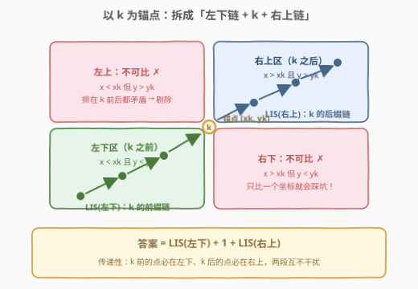
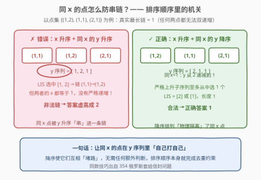
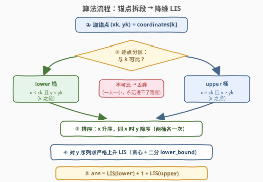
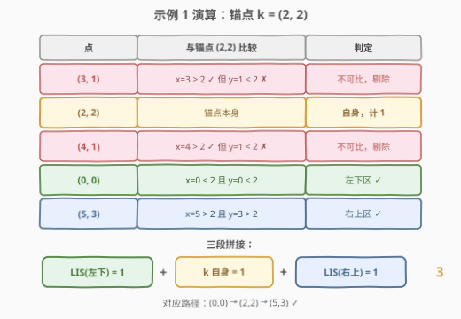

# LeetCode 最长上升路径的长度 题解

## 1. 题目概述

- **标题 / 题号**：最长上升路径的长度（#3288，hard）
- **链接**：https://leetcode.cn/problems/length-of-the-longest-increasing-path/
- **难度**：困难
- **标签**：数组、排序、二分查找、最长上升子序列

**题意**：给你一个长度为 $n$ 的二维整数数组 `coordinates` 和一个整数 $k$（$0 \le k < n$）。`coordinates[i] = [x_i, y_i]` 表示二维平面上的点 $(x_i, y_i)$。

如果点序列 $(x_1, y_1), (x_2, y_2), \dots, (x_m, y_m)$ 满足：

- 对所有 $1 \le i < m$ 都有 $x_i < x_{i+1}$ **且** $y_i < y_{i+1}$（两个坐标都**严格**递增）；
- 序列中每个点都来自给定的 `coordinates` 数组；

则称它是一个长度为 $m$ 的**上升序列**。请你返回**包含坐标 `coordinates[k]`** 的最长上升路径的长度。

**示例 1**：

```text
输入：coordinates = [[3,1],[2,2],[4,1],[0,0],[5,3]], k = 1
输出：3
解释：(0,0) → (2,2) → (5,3) 是包含坐标 (2,2) 的最长上升路径。
```

**示例 2**：

```text
输入：coordinates = [[2,1],[7,0],[5,6]], k = 2
输出：2
解释：(2,1) → (5,6) 是包含坐标 (5,6) 的最长上升路径。
```

**约束**：

- $1 \le n = \text{coordinates.length} \le 10^5$
- `coordinates[i].length == 2`
- $0 \le \text{coordinates}[i][0], \text{coordinates}[i][1] \le 10^9$
- `coordinates` 中的元素**互不相同**
- $0 \le k \le n - 1$

> 💡 **读题关键**：① 上升要求 $x$、$y$ **同时**严格递增——这是一个二维偏序「链」的定义，而不是普通的一维递增；② 路径**必须经过** `coordinates[k]`，全局最优链若不含 $k$ 则作废，这是本题区别于普通 LIS 的核心约束；③ $n$ 到 $10^5$，$O(n^2)$ 的 DP 必超时，必须有 $O(n \log n)$ 方案。

## 2. 解题思路

### 2.1 暴力思路：全局 LIS 的 $O(n^2)$ DP，及其两个致命问题

「$x$、$y$ 同时严格递增的最长链」可以直接套 LIS 式 DP：把点按 $(x, y)$ 排序，$L[i] = 1 + \max\{L[j] \mid x_j < x_i \text{ 且 } y_j < y_i\}$。但这有**两个**问题：

- **复杂度**：转移要往前扫所有 $j$，$O(n^2) = 10^{10}$，必然超时；
- **正确性**：就算复杂度能扛，全局最长链**未必经过 $k$**——比如 $k$ 是个「孤点」，全局最优链跟它毫无关系；而「强行把 $k$ 塞进某条链」的贪心修补也是错的（可能为迁就 $k$ 而放弃更优的前驱/后继组合）。

所以必须围绕「**经过 $k$**」这个锚点重新建模。

### 2.2 核心观察：以 $k$ 为锚点，拆成「左下链 + $k$ + 右上链」



**观察 1（传递性）**：链上相邻点要求 $x$、$y$ 同时严格递增，由**传递性**，链上**任意**两点 $p$（在前）、$q$（在后）都满足 $x_p < x_q$ 且 $y_p < y_q$。

**观察 2（无关点剔除）**：设 $k = (x_k, y_k)$。由观察 1，路径中排在 $k$ **之前**的点必须 $x < x_k$ **且** $y < y_k$；排在 $k$ **之后**的点必须 $x > x_k$ **且** $y > y_k$。于是全平面被 $k$ 划成四块：

| 区域 | 条件 | 能否出现在路径上 |
|------|------|------------------|
| 左下 | $x < x_k$ 且 $y < y_k$ | ✅ 只能在 $k$ 之前 |
| 右上 | $x > x_k$ 且 $y > y_k$ | ✅ 只能在 $k$ 之后 |
| 左上 / 右下 | 一大一小（与 $k$ 不可比） | ❌ 永远不可能 |

与 $k$ 不可比的点直接**扔掉**——它们与 $k$ 无法构成严格双递增关系，是彻头彻尾的干扰项。

**观察 3（两段独立）**：$k$ 之前的链完全落在左下区，$k$ 之后的链完全落在右上区，两段互不干扰，可各自取最长。因此：

$$\text{ans} = \underbrace{\text{LIS}_{2D}(\text{左下区})}_{\text{k 之前}} + \underbrace{1}_{k \text{ 自身}} + \underbrace{\text{LIS}_{2D}(\text{右上区})}_{\text{k 之后}}$$

> 💡 示例 2 里 $(7, 0)$ 虽然在 $k=(5,6)$ 的「右边」，但 $y=0 < 6$，落在右下不可比区，被直接剔除——这正是本题最容易踩的坑：**不能只比一个坐标**。

### 2.3 二维链降维成一维 LIS：排序 + 「同 $x$ 时 $y$ 降序」技巧

对左下区（右上区同理），现在要求「$x$、$y$ 同时严格递增的最长链」。这是经典二维偏序问题，与 [354. 俄罗斯套娃信封问题](https://leetcode.cn/problems/russian-doll-envelopes/)同款套路：

**第一步（排序消掉 $x$ 维）**：把点按 $x$ **升序**排序后，任意合法链必然对应一个按 $x$ 排好序的子序列，问题变为在该顺序下求 $y$ 的最长**严格上升**子序列。

**第二步（同 $x$ 陷阱）**：⚠️ 若两个点 $x$ 相同，它们**不能同时入选**（$x$ 必须严格递增）。若简单地按 $(x, y)$ 双键升序排，同 $x$ 的点 $y$ 也在升序，LIS 会把它们**全部串进同一条链**——错！



解法：**$x$ 相同时按 $y$ 降序排**。这样同 $x$ 的点在 $y$ 序列中是**递减**的，严格上升子序列至多从中选出 1 个——排序顺序本身就「物理隔离」了同 $x$ 的点，无需任何额外判断。

**第三步（贪心 + 二分求 LIS）**：维护 `tails` 数组（长度为 $\ell$ 的严格上升子序列的最小可能结尾）。对每个 $y$：

- 用 `lower_bound` 找到**第一个 $\ge y$** 的位置，替换之；
- 都比 $y$ 小则追加到末尾。

严格上升用 `lower_bound`（`bisect_left`）：相等元素会顶掉同值前任，保证 `tails` 内无重复——若误用 `upper_bound`（`bisect_right`）就变成「最长非降子序列」，本题会错。

### 2.4 算法流程图



| 步骤 | 操作 | 说明 |
|------|------|------|
| ① 取锚点 | $(x_k, y_k) = \text{coordinates}[k]$ | 答案至少为 1（$k$ 自身） |
| ② 分区过滤 | 左下区：$x < x_k$ 且 $y < y_k$；右上区：$x > x_k$ 且 $y > y_k$ | 不可比点全部剔除 |
| ③ 排序 | 每区按 $x$ 升序、**同 $x$ 时 $y$ 降序** | 关键技巧，防同 $x$ 入链 |
| ④ 一维 LIS | 对 $y$ 序列跑贪心 + 二分（`lower_bound`） | 严格上升；两区各跑一次 |
| ⑤ 拼答案 | $\text{LIS}_{\text{左下}} + 1 + \text{LIS}_{\text{右上}}$ | 三段拼接，互不干扰 |

### 2.5 示例演算



以示例 1（`coordinates = [[3,1],[2,2],[4,1],[0,0],[5,3]]`，$k=1$，锚点 $(2,2)$）走一遍：

| 点 | 与锚点 $(2,2)$ 比较 | 判定 |
|------|---------------------|------|
| $(3,1)$ | $x=3>2$ 但 $y=1<2$ | ❌ 右下不可比，剔除 |
| $(2,2)$ | 就是锚点 | ✅ 自身，贡献 1 |
| $(4,1)$ | $x=4>2$ 但 $y=1<2$ | ❌ 右下不可比，剔除 |
| $(0,0)$ | $x=0<2$ 且 $y=0<2$ | ✅ 左下区 |
| $(5,3)$ | $x=5>2$ 且 $y=3>2$ | ✅ 右上区 |

- 左下区排序后 $y$ 序列为 $[0]$，LIS = 1；
- 右上区排序后 $y$ 序列为 $[3]$，LIS = 1；
- 答案 $= 1 + 1 + 1 = \mathbf{3}$，对应路径 $(0,0) \to (2,2) \to (5,3)$。✓

示例 2（锚点 $(5,6)$）：左下区只有 $(2,1)$，LIS = 1；$(7,0)$ 因 $y$ 不够大被剔除，右上区为空，LIS = 0；答案 $= 1 + 1 + 0 = \mathbf{2}$。✓

## 3. 参考代码

### C++

```cpp
class Solution {
  public:
    int maxPathLength(vector<vector<int>>& coordinates, int k) {
        int xk = coordinates[k][0], yk = coordinates[k][1];
        vector<pair<int, int>> lower, upper;
        for (auto& p : coordinates) {
            if (p[0] < xk && p[1] < yk)      lower.emplace_back(p[0], p[1]);
            else if (p[0] > xk && p[1] > yk) upper.emplace_back(p[0], p[1]);
            // 其余点与 k 不可比，永远进不了路径，直接丢弃
        }

        auto lis = [](vector<pair<int, int>>& pts) {
            sort(pts.begin(), pts.end(), [](const auto& a, const auto& b) {
                // x 升序；同 x 时 y 降序，防止同 x 的点串进一条链
                return a.first != b.first ? a.first < b.first : a.second > b.second;
            });
            vector<int> tails;                  // tails[i] = 长度 i+1 的严格上升链的最小结尾
            for (auto& [x, y] : pts) {
                auto it = lower_bound(tails.begin(), tails.end(), y);  // 严格上升 → lower_bound
                if (it == tails.end()) tails.push_back(y);
                else                   *it = y;
            }
            return (int)tails.size();
        };

        return lis(lower) + 1 + lis(upper);
    }
};
```

### Python

```python
class Solution:
    def maxPathLength(self, coordinates: List[List[int]], k: int) -> int:
        xk, yk = coordinates[k]

        def lis(pts: List[List[int]]) -> int:
            pts.sort(key=lambda p: (p[0], -p[1]))   # x 升序；同 x 时 y 降序
            tails = []
            for _, y in pts:
                i = bisect_left(tails, y)            # 严格上升 → bisect_left
                if i == len(tails):
                    tails.append(y)
                else:
                    tails[i] = y
            return len(tails)

        lower = [p for p in coordinates if p[0] < xk and p[1] < yk]
        upper = [p for p in coordinates if p[0] > xk and p[1] > yk]
        return lis(lower) + 1 + lis(upper)
```

> 💡 三个易错点：① 分区必须**两个坐标同时判**，只判 $x$ 会把 $(3,1)$、$(4,1)$ 这类不可比点放进来；② 同 $x$ 必须按 $y$ **降序**，否则 LIS 会把同 $x$ 的点串成非法链；③ 严格上升必须用 `lower_bound` / `bisect_left`，用成 `upper_bound` / `bisect_right` 就变成非降 LIS。另外注意两段 LIS 各自独立排序，`lower` / `upper` 拷贝出来再排，不要原地污染原数组顺序（本题后面没用到原序，但保持习惯）。

## 4. 复杂度分析

| 维度 | 复杂度 | 说明 |
|------|--------|------|
| 时间复杂度 | $O(n \log n)$ | 过滤 $O(n)$ + 两次排序 $O(n \log n)$ + 两次贪心二分 LIS $O(n \log n)$；$n = 10^5$ 轻松通过 |
| 空间复杂度 | $O(n)$ | `lower` / `upper` 两个桶 + `tails` 数组 |
| 对比：$O(n^2)$ 链 DP | $O(n^2)$ | $10^{10}$ 次比较，超时；且还需额外处理「必须过 $k$」 |

## 5. 扩展：变体与关联套路

**① 为什么不能「全局 LIS + 强行塞 $k$」？**「经过 $k$ 的最长链」与「全局最长链」没有简单换算关系：$k$ 可能根本不在任何最长链上（如 $k$ 是孤点时答案为 1，全局 LIS 却可以很大）。本题的拆解方式——**锚点切成前后两段、各自求最长、再加 1**——是处理「路径必经某点」类问题的通用思路（图论中的对应物是：最短路必经点 $v$ $=$ $\text{dist}(s, v) + \text{dist}(v, t)$）。

**② 若允许 $x$、$y$ 非严格递增（$\le$）呢？** 排序改为 $x$ 升序、同 $x$ 时 $y$ **升序**（此时同 $x$ 的点允许入链），LIS 改求**非降**版本（`upper_bound` / `bisect_right`）。两个方向的细节恰好同时翻转，很容易记混——建议记住原理（同 $x$ 是否允许共存 ⟺ 排序是否要「物理隔离」它们）而非死记结论。

**③ 与 Dilworth 定理的缘分**：本题求的是二维偏序集上的最长链。Dilworth 定理说「最长链长度 = 最少反链划分数」，若某天题目反过来问「最少分成多少组，使组内任意两点不可比」，答案恰是最长链长度——同一枚硬币的两面。

## 6. 面试要点

1. **为什么路径可以拆成「$k$ 前缀 + $k$ + $k$ 后缀」三段独立求解？**

   相邻点 $x$、$y$ 同时严格递增具有**传递性**，因此链上任意在前点与在后点都满足双坐标严格小于。$k$ 前面的点必然落在左下区、后面的必然落在右上区，两区点集不相交、互不约束，各自取最长链再拼接即为全局最优（前后段的选择彼此独立，最优子结构成立）。

2. **为什么与 $k$ 不可比的点可以直接扔掉？**

   不可比点 $p$（如 $x_p < x_k$ 但 $y_p > y_k$）若在路径上排在 $k$ 前，需要 $y_p < y_k$，矛盾；排在 $k$ 后需要 $x_p > x_k$，也矛盾。所以无论排在哪都不合法。扔掉它们还能把规模直接减半，是「先减脂再练肌肉」的典型预处理。

3. **同 $x$ 时为什么必须按 $y$ 降序排序？**

   合法链要求 $x$ 严格递增，同 $x$ 的点至多选一个。若按 $y$ 升序排，LIS 会把同 $x$ 且 $y$ 递增的点全部串进一条链（$y$ 满足严格上升），产生非法答案；按 $y$ 降序排后，同 $x$ 的点在 $y$ 序列中递减，严格上升子序列至多选中其一——用排序顺序本身完成去重约束，不需要额外判断。这正是 354 俄罗斯套娃信封的同款技巧。

4. **严格上升 LIS 为什么用 `lower_bound` 而不是 `upper_bound`？**

   `lower_bound` 找**第一个 $\ge y$** 的位置：遇到相等的 $y$ 会顶掉前任，保证 `tails` 内元素严格递增；`upper_bound` 找**第一个 $> y$** 的位置，相等时会并列共存，求出的是最长**非降**子序列。本题 $x$、$y$ 都要求严格递增，必须用前者。

5. **本题与 354 的区别是什么？**

   354 求全局最长链；本题加了「必经锚点 $k$」的约束，需要先用偏序可比性把点集切成左下/右上两块（剔除不可比点），再分别套 354 的模板。可以理解为：**354 是本题在 $k$ 退化为「任意点、不过必须」时的版本**，而「必经点拆两段」的思想又与图上必经点最短路一脉相承。

## 同类练习题

| # | 题目 | 与本题的关联 |
|---|------|-------------|
| 354 | [俄罗斯套娃信封问题](https://leetcode.cn/problems/russian-doll-envelopes/)（[题解](../0301-0400/354_俄罗斯套娃信封问题.md)） | 「$x$ 升序 + 同 $x$ 的 $y$ 降序 + $y$ 上 LIS」技巧的出处，本题的模板母题 |
| 300 | [最长递增子序列](https://leetcode.cn/problems/longest-increasing-subsequence/)（[题解](../0201-0300/300_最长递增子序列.md)） | 一维 LIS 贪心 + 二分的母题，先练熟它再来做二维降维 |
| 1964 | [找出到每个位置为止最长的有效障碍赛跑路线](https://leetcode.cn/problems/find-the-longest-valid-obstacle-course-at-each-position/)（[题解](../1901-2000/1964_找出到每个位置为止最长的有效障碍赛跑路线.md)） | **非降** LIS（`bisect_right`）的对照练习，体会与本题严格版的二分差异 |
| 2407 | [最长递增子序列 II](https://leetcode.cn/problems/longest-increasing-subsequence-ii/)（[题解](../2401-2500/2407_最长递增子序列II.md)） | LIS 加值域限制 $\|{\rm nums}[i]-{\rm nums}[j]\| \le k$，线段树优化版，练「LIS 还能怎么优化」 |
