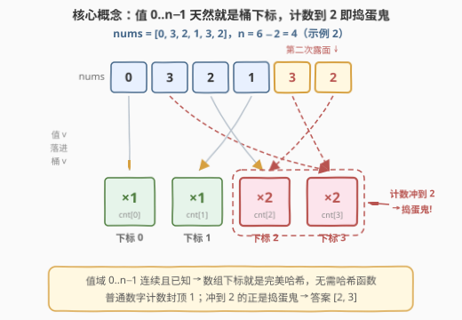
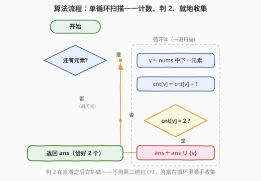
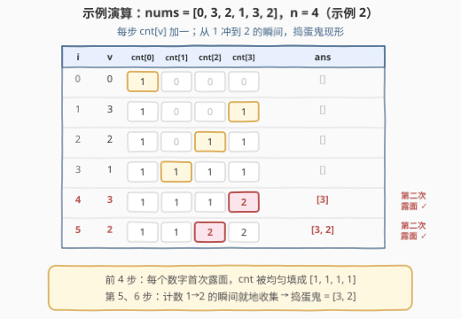

# 数字小镇中的捣蛋鬼

- **题目名称**：数字小镇中的捣蛋鬼
- **链接**：[3289. 数字小镇中的捣蛋鬼](https://leetcode.cn/problems/the-two-sneaky-numbers-of-digitville/)
- **难度**：简单
- **标签**：数组，哈希表，数学

## 1. 题目概述

数字小镇 Digitville 中有一个数字列表 `nums`，本应包含从 `0` 到 `n - 1` 的每个整数**恰好一次**。然而有两个顽皮的数字各自**多出现了一次**（即各出现两次），使得列表比正常情况长了 2。请找出这两个「捣蛋鬼」，返回一个长度为 2 的数组，**顺序任意**。

**示例 1**：

```text
输入：nums = [0,1,1,0]
输出：[0,1]
解释：数字 0 和 1 分别在数组中出现了两次。
```

**示例 2**：

```text
输入：nums = [0,3,2,1,3,2]
输出：[2,3]
解释：数字 2 和 3 分别在数组中出现了两次。
```

**示例 3**：

```text
输入：nums = [7,1,5,4,3,4,6,0,9,5,8,2]
输出：[4,5]
解释：数字 4 和 5 分别在数组中出现了两次。
```

**约束条件**：

- `2 <= n <= 100`
- `nums.length == n + 2`
- `0 <= nums[i] < n`
- 输入保证 `nums` 中**恰好**包含两个重复的元素

> 💡 读题关键：① 参数里没有 `n`——由 `nums.length == n + 2` 反解 `n = len(nums) - 2`；② 「恰好两个重复」隐含 **0..n−1 一个都不缺**：除捣蛋鬼各出现两次外，其余数字都恰好出现一次，这是后文「差值分析」「异或抵消」成立的前提；③ 两个捣蛋鬼**互不相同**（同一个数出现三次不符合题意），数学法与异或法都依赖这一点。

---

## 2. 解题思路

### 2.1 暴力思路：排序后找相邻相等

把数组排序，相同元素必然相邻，扫一遍收集满足 `nums[i] == nums[i+1]` 的值：

```python
nums.sort()
ans = [nums[i] for i in range(len(nums) - 1) if nums[i] == nums[i + 1]]
```

正确性无疑，$O(n \log n)$ 在 $n \le 100$ 下也能轻松通过。但「找重复」本质上只关心**每个数字出现了几次**，为此付出一次排序，方向绕远了——更直接的通路是沿「出现次数」建统计。

### 2.2 核心观察：值域就是下标——桶计数



**观察 1（值域连续且已知）**：所有值都落在 $0 \sim n-1$，而 $n$ 又能从数组长度反解。开一个长度为 $n$ 的计数数组 `cnt`，**下标本身就是值**——不需要哈希函数、不存在冲突、无需扩容。这是「计数数组优于泛型哈希表」的教科书场景：一组天然完美的哈希。

**观察 2（恰好两次 → 边数边收）**：普通数字的计数到 1 封顶；计数一旦涨到 2，撞上的必然是捣蛋鬼。于是连第二趟扫描 `cnt` 都省了——`++cnt[v] == 2` 成立的**瞬间**就地收集：

$$\text{ans} = \{\, v \mid v \text{ 在 } \text{nums} \text{ 中第二次出现} \,\}$$

**观察 3（下标安全性）**：`0 <= nums[i] < n < n + 2 = len(nums)`，任何值作为 `cnt` 的下标都不会越界，无需额外检查。

### 2.3 算法流程图



流程是一条单循环主链：取出元素 $v$ → `cnt[v]` 自增 → 是否恰好到 2 → 是则收集 → 前进。循环自然结束时恰好收集满 2 个，返回答案。

### 2.4 示例演算



以示例 2（`nums = [0,3,2,1,3,2]`，$n = 4$）走表：

| $i$ | $v$ | `cnt`（下标 0..3） | 触发收集 | `ans` |
|-----|-----|--------------------|----------|-------|
| 0 | 0 | `[1,0,0,0]` | — | `[]` |
| 1 | 3 | `[1,0,0,1]` | — | `[]` |
| 2 | 2 | `[1,0,1,1]` | — | `[]` |
| 3 | 1 | `[1,1,1,1]` | — | `[]` |
| 4 | 3 | `[1,1,1,2]` | `cnt[3]` 到 2 ✓ | `[3]` |
| 5 | 2 | `[1,1,2,2]` | `cnt[2]` 到 2 ✓ | `[3,2]` |

前 4 步 `cnt` 被均匀填成全 1（每个数字都露过面了）；后 2 步是「第二次露面」的专享时刻——两个捣蛋鬼就此落网。

---

## 3. 参考代码

### C++（计数数组，边数边收）

```cpp
class Solution {
  public:
    vector<int> getSneakyNumbers(vector<int>& nums) {
        int n = (int)nums.size() - 2;              // 长度反解值域上界
        vector<int> cnt(n, 0), ans;
        for (int v : nums) {
            if (++cnt[v] == 2) ans.push_back(v);   // 第二次露面即捣蛋鬼
        }
        return ans;
    }
};
```

### Python（计数数组）

```python
class Solution:
    def getSneakyNumbers(self, nums: List[int]) -> List[int]:
        n = len(nums) - 2                          # 值域 0..n-1
        cnt = [0] * n
        ans = []
        for v in nums:
            cnt[v] += 1
            if cnt[v] == 2:                        # 第二次露面即捣蛋鬼
                ans.append(v)
        return ans
```

---

## 4. 复杂度分析

| 维度 | 复杂度 | 说明 |
|------|--------|------|
| 时间复杂度 | $O(n)$ | 每个元素一次 $O(1)$ 的计数与判定；读入 $n+2$ 个数，$\Omega(n)$ 是下界，一遍扫描已达最优 |
| 空间复杂度 | $O(n)$ | 计数数组长度为 $n$（不计输出数组）；值域已知时这已是哈希统计的地板，$O(1)$ 空间方案见第 5 节 |

---

## 5. 扩展：O(1) 空间的三条路

官方 hint 提示了「不用额外空间」的思考方向——想想每个数字的出现次数与下标的关系。除了 $O(n)$ 辅助数组，还有三条路，它们分别利用了「期望序列完整已知」「其余数字恰好出现一次」「值域 ⊆ 下标域」这三个结构性质：

### 5.1 数学法：和与平方和联立

设捣蛋鬼为 $x, y$（$x \ne y$）。期望序列 $0..n-1$ 的和与平方和分别为

$$S_0 = \sum_{k=0}^{n-1} k = \frac{n(n-1)}{2}, \qquad Q_0 = \sum_{k=0}^{n-1} k^2 = \frac{n(n-1)(2n-1)}{6}$$

对实际数组求和、求平方和，多出来的部分全部来自 $x, y$：

$$a = x + y = \sum_{v \in \text{nums}} v - S_0, \qquad b = x^2 + y^2 = \sum_{v \in \text{nums}} v^2 - Q_0$$

由 $(x-y)^2 = 2(x^2+y^2) - (x+y)^2$ 得 $d = \sqrt{2b - a^2} = |x - y|$，与 $x + y = a$ 联立即解出：

$$x = \frac{a + d}{2}, \qquad y = \frac{a - d}{2}$$

```python
class Solution:
    def getSneakyNumbers(self, nums: List[int]) -> List[int]:
        n = len(nums) - 2
        a = sum(nums) - n * (n - 1) // 2                                 # x + y
        b = sum(v * v for v in nums) - n * (n - 1) * (2 * n - 1) // 6    # x² + y²
        d = math.isqrt(2 * b - a * a)                                    # |x − y|
        return [(a + d) // 2, (a - d) // 2]
```

> ⚠️ 本题 $n \le 100$，平方和至多约 $10^6$，`int` 绰绰有余；但把同一套代码迁移到大值域（如 645 的变体）时，累加平方和必须换 64 位——这是数学法最常见的翻车点。

### 5.2 异或分组：260 的镜像

把 `nums` 与完整的 $0..n-1$ **一起**异或：出现恰好一次的数字两边各出现一次、双双抵消，只剩 $x \oplus y$（非零，因为 $x \ne y$）。取其最低位 1（$x, y$ 在该位必然不同）把所有数字分成两组，每组内部做同样的抵消，分别沉淀出 $x$ 和 $y$——与 260「找两个只出现一次的数」互为镜像。

```python
class Solution:
    def getSneakyNumbers(self, nums: List[int]) -> List[int]:
        n = len(nums) - 2
        xr = 0
        for v in nums:     xr ^= v
        for v in range(n): xr ^= v          # 抵消单次出现的，留下 x ^ y
        lb = xr & (-xr)                     # 最低位 1：x、y 在此位不同
        res = [0, 0]
        for v in nums:
            res[(v & lb) > 0] ^= v
        for v in range(n):
            res[(v & lb) > 0] ^= v
        return res
```

### 5.3 原地标记：442 的套路（当心 0）

值域 $0..n-1$ 全部落在合法下标范围内（$n < n+2$），可以把**值当下标**、在原数组上做「到访标记」。但 442 的招牌写法「取负」在这里有个坑：**值 0 取负还是 0**，标记会静默失效。改用「加 $n$ 偏移」：位置 $v$ 一旦被访问就 $+\,n$，判断是否 $\ge n$ 即知是否二次到访；读取时用 $\% \,n$ 还原真值。

```python
class Solution:
    def getSneakyNumbers(self, nums: List[int]) -> List[int]:
        n = len(nums) - 2
        ans = []
        for i in range(len(nums)):
            v = nums[i] % n                # 还原真值（该位置可能已被 +n 标记）
            if nums[v] >= n:
                ans.append(v)              # 已被标记 → 第二次露面
            else:
                nums[v] += n               # 首次到访 → 标记
        return ans
```

> 💡 三条路各有前提：数学法要求数字互不相同且期望序列完整已知；异或法依赖「其余数字恰好出现一次」；原地标记依赖「值域 ⊆ 下标域」且允许修改输入。结构一破（出现三次、值域无界），对应方法即失效——面试时说清**前提**比默写代码更加分。

---

## 6. 面试要点

1. **为什么用计数数组而不是泛型哈希表？**

   - 值域 $0..n-1$ 连续、有界、且 $n$ 可由长度反解——数组下标本身就是完美哈希函数。相比 `unordered_set` / `Counter`：无冲突、无 rehash、缓存友好，常数因子小一个量级。值域已知且不大时，永远优先考虑桶。

2. **`n` 不在参数里，从哪来？**

   - `nums.length == n + 2` 给出 `n = len(nums) - 2`。漏看这个细节容易误以为值域是 `len(nums)`——本题因值域更小不会越界出错，但 `cnt` 数组会开大，语义就偏了。

3. **如何做到 $O(1)$ 额外空间？各有什么前提？**

   - 数学法：和 + 平方和联立解方程，前提是期望序列完整已知、两根互异，大值域下平方和要 64 位；异或法：与 $0..n-1$ 一起异或消掉单次项、按最低位 1 分组，前提是其余数字恰好出现一次；原地标记：值当下标、到访加偏移，前提是值域 ⊆ 下标域且允许改输入——注意值域含 0 时**取负标记会失效**（$-0 = 0$），要用 $+\,n$ 偏移。

4. **数学法里 $(x-y)^2 = 2b - a^2$ 怎么来的？**

   - $x^2+y^2 = b$、$xy = \frac{(x+y)^2-(x^2+y^2)}{2} = \frac{a^2-b}{2}$，故 $(x-y)^2 = x^2+y^2-2xy = b-(a^2-b) = 2b-a^2$。开方得 $|x-y|$，与 $x+y=a$ 联立即解出两根——全程只需求两次统计量和。

5. **本题与 645 / 442 / 260 的家族关系？**

   - 同属「实际序列 vs 期望序列」的错位分析家族：645 是**一个重复 + 一个缺失**（多一个未知数，同样可用和 + 平方和）；442 是**找所有重复**（原地标记的招牌题，值域 $1..n$ 不含 0，所以取负安全）；260 是**找两个只出现一次的数**（异或分组的招牌题），与本题互为镜像——那边孤例留下、这边双例现形。

---

## 7. 同类练习题

- [645. 错误的集合](https://leetcode.cn/problems/set-mismatch/)：一个重复 + 一个缺失，「和 + 平方和」差值分析的完整版
- [442. 数组中重复的数据](https://leetcode.cn/problems/find-all-duplicates-in-an-array/)：原地取负找全部重复，本题 5.3 的招牌母题（值域不含 0，取负无坑）
- [448. 找到所有数组中消失的数字](https://leetcode.cn/problems/find-all-numbers-disappeared-in-an-array/)：原地标记的另一半——标记的是缺失而非重复（本仓库已有题解）
- [260. 只出现一次的数字 III](https://leetcode.cn/problems/single-number-iii/)：异或分组找两个孤例，与本题互为镜像
- [287. 寻找重复数](https://leetcode.cn/problems/find-the-duplicate-number/)：O(1) 空间且不许改输入找单个重复，快慢指针判环的巅峰应用
