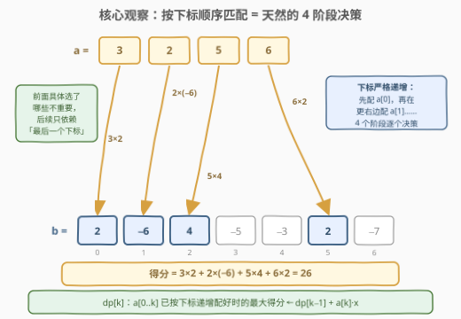
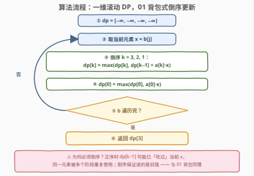
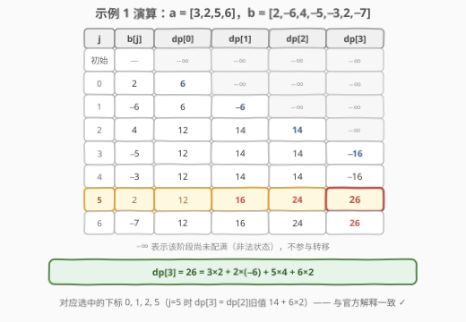

# 最高乘法得分

- **题目名称**：最高乘法得分
- **链接**：[3290. 最高乘法得分](https://leetcode.cn/problems/maximum-multiplication-score/)
- **难度**：中等
- **标签**：数组、动态规划

## 1. 题目概述

给你一个大小为 4 的整数数组 `a` 和一个大小**至少**为 4 的整数数组 `b`。

你需要从数组 `b` 中选择四个下标 $i_0, i_1, i_2, i_3$，并满足 $i_0 < i_1 < i_2 < i_3$。你的得分将是

$$a[0] \cdot b[i_0] + a[1] \cdot b[i_1] + a[2] \cdot b[i_2] + a[3] \cdot b[i_3]$$

的值。返回你能够获得的**最大**得分。

**示例 1**：

```text
输入：a = [3,2,5,6], b = [2,-6,4,-5,-3,2,-7]
输出：26
解释：选择下标 0, 1, 2 和 5。得分为 3 * 2 + 2 * (-6) + 5 * 4 + 6 * 2 = 26。
```

**示例 2**：

```text
输入：a = [-1,4,5,-2], b = [-5,-1,-3,-2,-4]
输出：-1
解释：选择下标 0, 1, 3 和 4。得分为 (-1) * (-5) + 4 * (-1) + 5 * (-2) + (-2) * (-4) = -1。
```

**约束条件**：

- `a.length == 4`
- $4 \le \text{b.length} \le 10^5$
- $-10^5 \le a[i], b[i] \le 10^5$

> 💡 **读题关键**：① `a` 的 4 个系数**必须全部用上**，且按下标顺序与 `b` 的一个**子序列**一一配对——这是「双序列按序匹配」结构；② 得分绝对值上界为 $4 \times 10^5 \times 10^5 = 4 \times 10^{10}$，远超 `int` 范围，**必须用 64 位整数**；③ $n$ 到 $10^5$，$O(n^4)$ 甚至 $O(n^2)$ 都不可行，需要线性级别的算法。

---

## 2. 解题思路

### 2.1 暴力思路：四重循环枚举组合

最直接的做法是四重循环枚举所有 $i_0 < i_1 < i_2 < i_3$ 的组合，共有 $\binom{n}{4} \approx \dfrac{n^4}{24} \approx 4 \times 10^{18}$ 种（$n = 10^5$ 时），完全不可行。

即使借助「固定前三个下标后第四个贪心取最优」之类的局部优化，也仍是对组合空间的隐性枚举——**负数的存在让任何「大配大」的贪心直觉失效**（负系数反而想配更小的值，负负得正），必须老老实实利用「按序匹配」的结构性质。

### 2.2 核心观察：按序匹配 = 4 阶段决策，一维 DP 足矣



**观察 1（阶段化）**：约束 $i_0 < i_1 < i_2 < i_3$ 把整个决策过程天然切成 **4 个阶段**——先定 `a[0]` 配哪个 `b` 元素，再在它的**右边**定 `a[1]` 配谁，依此类推。每个阶段只在「上一个阶段的右侧」做选择。

**观察 2（无后效性）**：到了第 $k$ 个阶段时，之前**具体**选了哪些下标并不重要，唯一影响未来的是「最后一个选中下标停在哪里」。而如果我们定义状态为「已扫描 `b` 的前缀」，那么「最后一个下标落在前缀内」这个信息就足够了——于是前缀内匹配 `a[0..k]` 的结果可以只用**一个数**概括：最大得分。

于是定义：

$$dp[k] = \text{用 } a[0..k] \text{ 与 } b \text{ 的已扫描前缀按下标递增配对的最大得分}$$

对每个新来的元素 $x = b[j]$，只有两种可能：**不配给任何人**（所有 `dp` 不变），或者**配给某个 $a[k]$**（此时 $a[0..k-1]$ 必须已经在 $x$ 之前配好了）：

$$dp[k] \leftarrow \max\bigl(dp[k],\ dp[k-1] + a[k] \cdot x\bigr)$$

初始时 $dp[k] = -\infty$ 表示「$k+1$ 个系数还没配满」的非法状态；由于 $n \ge 4$，合法方案必然存在，最终的 $dp[3]$ 就是答案。

> 💡 这正是 [1035. 不相交的线](https://leetcode.cn/problems/uncrossed-lines/) / [1143. 最长公共子序列](https://leetcode.cn/problems/longest-common-subsequence/) 的「双序列按序匹配」DP 家族：那两题最大化匹配**条数**（即 LCS），本题则是**固定匹配 4 条、带权求最大和**。也正因阶段数只有常数 4，二维 DP 表可以被压缩成 **4 个变量**。

### 2.3 关键细节：倒序更新，与 01 背包一脉相承

把二维表压成一维数组后，转移顺序成了生死攸关的细节：处理元素 $x$ 时，内层 $k$ 必须从 **3 到 1 倒序**更新。

- **若正序**（$k = 1, 2, 3$）：更新 $dp[1]$ 时用到的 $dp[0]$ 可能**刚刚吃过**当前 $x$，接着 $dp[2]$ 又用到刚更新的 $dp[1]$……同一个 $b[j]$ 被多个阶段重复消费，等价于允许 $i_0 = i_1$，违反下标**严格**递增。
- **倒序**（$k = 3, 2, 1$）：更新 $dp[k]$ 时读到的 $dp[k-1]$ 还是上一轮（不含 $x$）的旧值——每个 $x$ 至多喂给一个阶段。

这与 **01 背包一维滚动必须倒序**是同一个论证：**倒序 = 每件物品至多选一次；正序 = 完全背包（可重复选）**。若本题约束改成 $i_0 \le i_1 \le i_2 \le i_3$（允许重复选中同一元素），把倒序改成正序即可。

### 2.4 算法流程图



| 步骤 | 操作 | 说明 |
|------|------|------|
| ① 初始化 | $dp[0..3] = -\infty$ | $-\infty$ = 该阶段尚未配满 |
| ② 取元素 | $x = b[j]$，$j$ 从左到右顺扫 | 「已扫描前缀」隐式推进 |
| ③ 倒序转移 | $k = 3, 2, 1$：$dp[k] = \max(dp[k],\ dp[k-1] + a[k] \cdot x)$ | 读到的 $dp[k-1]$ 不含 $x$ |
| ④ 阶段 0 | $dp[0] = \max(dp[0],\ a[0] \cdot x)$ | $x$ 配给 $a[0]$ |
| ⑤ 循环判定 | `b` 遍历完？未完回到 ② | 否则输出 |
| ⑥ 输出 | 返回 $dp[3]$ | $n \ge 4$ 保证可达 |

### 2.5 示例演算



以示例 1（`a = [3,2,5,6]`，`b = [2,-6,4,-5,-3,2,-7]`）走一遍，`dp` 数组随每个元素的到来逐步演化：

| 处理到 | $x = b[j]$ | $dp[0]$ | $dp[1]$ | $dp[2]$ | $dp[3]$ |
|--------|-----------|---------|---------|---------|---------|
| 初始 | — | $-\infty$ | $-\infty$ | $-\infty$ | $-\infty$ |
| $j=0$ | 2 | 6 | $-\infty$ | $-\infty$ | $-\infty$ |
| $j=1$ | −6 | 6 | −6 | $-\infty$ | $-\infty$ |
| $j=2$ | 4 | 12 | 14 | 14 | $-\infty$ |
| $j=3$ | −5 | 12 | 14 | 14 | −16 |
| $j=4$ | −3 | 12 | 14 | 14 | −16 |
| $j=5$ | 2 | 12 | **16** | **24** | **26** |
| $j=6$ | −7 | 12 | 16 | 24 | 26 |

关键看 $j=5$（$x=2$）这一行（倒序更新，自上而下读旧值）：

- $dp[3] = dp[2]_{\text{旧}} + 6 \times 2 = 14 + 12 = 26$（$dp[2]=14$ 对应下标 $0,1,2$，再把 $b[5]=2$ 配给 $a[3]=6$）；
- $dp[2] = dp[1]_{\text{旧}} + 5 \times 2 = 14 + 10 = 24$（下标 $0,2,5$）；
- $dp[1] = dp[0]_{\text{旧}} + 2 \times 2 = 12 + 4 = 16$（下标 $2,5$）。

最终 $dp[3] = \mathbf{26} = 3 \times 2 + 2 \times (-6) + 5 \times 4 + 6 \times 2$，对应下标 $0, 1, 2, 5$，与官方解释一致。✓

示例 2（`a = [-1,4,5,-2]`，`b = [-5,-1,-3,-2,-4]`）同法演算，最终 $dp[3] = \mathbf{-1}$（下标 $0,1,3,4$），注意全程最优解都是负数——这正是「不能贪心只挑大值」的体现。

---

## 3. 参考代码

### C++

```cpp
class Solution {
  public:
    long long maxScore(vector<int>& a, vector<int>& b) {
        const long long NEG = LLONG_MIN / 2;        // 「尚未配满」的哨兵，减半防加法溢出
        long long dp[4] = {NEG, NEG, NEG, NEG};     // dp[k]：a[0..k] 已全部配对的最大得分
        for (int x : b) {
            for (int k = 3; k >= 1; k--)            // 倒序：dp[k-1] 还是「不含 x」的旧值
                if (dp[k - 1] > NEG)                // 哨兵不参与转移
                    dp[k] = max(dp[k], dp[k - 1] + (long long)a[k] * x);
            dp[0] = max(dp[0], (long long)a[0] * x);
        }
        return dp[3];
    }
};
```

### Python

```python
class Solution:
    def maxScore(self, a: List[int], b: List[int]) -> int:
        dp = [float('-inf')] * 4              # dp[k]：a[0..k] 已全部配对的最大得分
        for x in b:
            for k in range(3, 0, -1):         # 倒序：dp[k-1] 还是「不含 x」的旧值
                dp[k] = max(dp[k], dp[k - 1] + a[k] * x)
            dp[0] = max(dp[0], a[0] * x)      # -inf + 有限数 = -inf，非法状态自动保持
        return dp[3]
```

> 💡 三个易错点：① **必须 `long long`**——单项 $|a[k] \cdot b[j]| \le 10^{10}$，四项和达 $4 \times 10^{10}$，`int` 必爆；C++ 里乘法前还要先转 `(long long)`，`int * int` 在中间结果就已溢出。② **哨兵取 `LLONG_MIN / 2`** 而非 `LLONG_MIN`，给「加法」留出余量（Python 无此顾虑，`-inf` 加有限数仍是 `-inf`，非法状态自动保持）。③ **内层倒序**——正序会让同一个 `b[j]` 被重复消费（详见 2.3）。

---

## 4. 复杂度分析

| 维度 | 复杂度 | 说明 |
|------|--------|------|
| 时间复杂度 | $O(4n) = O(n)$ | 外层扫一遍 `b`，内层常数 4 次转移；$n = 10^5$ 瞬间通过 |
| 空间复杂度 | $O(1)$ | 仅 4 个滚动变量 |
| 对比：暴力枚举 | $O(n^4)$ | $\binom{10^5}{4} \approx 4 \times 10^{18}$，天文数字 |
| 对比：二维 DP 表 | $O(4n)$ 时间 / $O(n)$ 空间 | 阶段数与 `b` 前缀的完整二维表，被滚动压缩到 $O(1)$ |

---

## 5. 扩展：变体与关联套路

**① 若允许下标相等（$i_0 \le i_1 \le i_2 \le i_3$）呢？** 把内层循环改成正序（$k = 1, 2, 3$）即可：此时同一个 `b[j]` 允许被多个阶段复用——正是「完全背包正序 vs 01 背包倒序」的分野。一维滚动数组中，**更新顺序本身就是「元素可否复用」的语义开关**。

**② 如何输出具体方案（选了哪四个下标）？** 给每个状态加一行前驱记录：`pre[k]` 存「本次更新时 `dp[k-1]` 是由哪个 `j` 贡献的」，从 `dp[3]` 沿前驱链回溯 4 步即得全部下标。DP 求方案的标准套路：**值数组负责最优，前驱数组负责回溯**。

**③ `a` 的长度推广到 $k$？** 算法原样成立，时间 $O(kn)$。当 $k$ 也是 $O(n)$ 量级时，就退化成标准的双序列二维 DP（$O(n^2)$），即 [1143. 最长公共子序列](https://leetcode.cn/problems/longest-common-subsequence/) 的形态——本题本质上是「**阶段数压缩到常数**」后可以 $O(1)$ 空间求解的特例。

---

## 6. 面试要点

1. **为什么不能排序后贪心配对（大配大）？**

   两个原因：一是 `a`、`b` 都含负数，乘积正负交错，「绝对值大」未必「贡献大」——负系数配大正数反而亏，负负还能得正，不存在单调的配对规则；二是下标必须严格递增，排序会破坏位置约束。子序列型最值问题，结构上只能靠 DP 覆盖所有「有序匹配」方案。

2. **状态为什么只需要 4 个数，而不需要二维表？**

   完整状态是「阶段 $k$ × `b` 前缀 $j$」的二维格点。但 $j$ 维是顺扫的，天然可滚动；$k$ 维只有常数 4。无后效性保证：未来决策只依赖「最后一个选中下标是否在当前位置之前」，这个信息已被 `dp[k]` 的定义（在已扫描前缀内配好 `a[0..k]`）完整编码。

3. **倒序更新的本质是什么？**

   保证转移读到的 `dp[k-1]` 是**上一轮**的值，即当前 `x` 尚未被消费，从而每个 `b[j]` 至多配给一个阶段——与 01 背包一维滚动的论证完全同构。反之，若题目允许下标相等（元素可复用），改正序即变成完全背包式更新。

4. **为什么必须用 64 位整数？**

   $|a[i]|, |b[j]| \le 10^5$，单项乘积绝对值上界 $10^{10}$，四项代数和的绝对值上界 $4 \times 10^{10}$，超出 `int32`（约 $2.1 \times 10^9$）近 20 倍。C++ 中乘法两个操作数都要先提升到 `long long` 再相乘，否则中间结果已经溢出。

5. **本题与 1035（不相交的线）/ 1143（LCS）是什么关系？**

   同属「双序列按序一一匹配」家族：1035/1143 最大化匹配**条数**（等于 LCS 长度），本题固定匹配 4 条且每条带权（$a[k] \cdot b[i_k]$）、最大化加权和。结构相同、目标函数不同；本题因阶段数为常数 4，还能把空间压到 $O(1)$，是 LCS 家族里少见的「线性时间、常数空间」成员。

---

## 7. 同类练习题

- [1035. 不相交的线](https://leetcode.cn/problems/uncrossed-lines/)（[题解](../1001-1100/1035_不相交的线.md)）：「连线不交叉」= 下标严格递增的同序匹配（LCS 特例），本题的结构母题
- [1143. 最长公共子序列](https://leetcode.cn/problems/longest-common-subsequence/)（[题解](../1101-1200/1143_最长公共子序列.md)）：双序列按序匹配 DP 的二维表母题，本题可视为其「阶段数 = 4 + 加权求和」特例
- [3276. 选择矩阵中单元格的最大得分](https://leetcode.cn/problems/select-cells-in-grid-with-maximum-score/)（[题解](../3201-3300/3276_选择矩阵中单元格的最大得分.md)）：行号递增 + 列严格递增的多阶段最大和 DP，与本题同骨架
- [718. 最长重复子数组](https://leetcode.cn/problems/maximum-length-of-repeated-subarray/)（[题解](../0701-0800/718_最长重复子数组.md)）：同序匹配的「连续」版对照，体会连续与子序列的转移差异
- [416. 分割等和子集](https://leetcode.cn/problems/partition-equal-subset-sum/)（[题解](../0401-0500/416_分割等和子集.md)）：一维滚动 + 倒序更新（01 背包）的出处，体会「倒序 = 每件物品只用一次」
