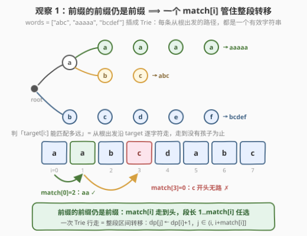
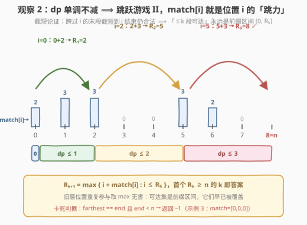
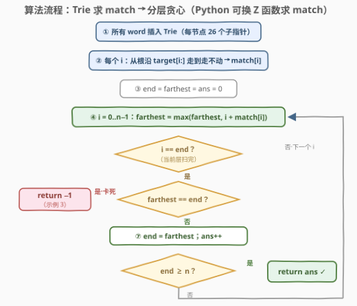
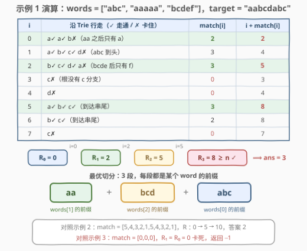

# 形成目标字符串需要的最少字符串数 I

- **题目名称**：形成目标字符串需要的最少字符串数 I
- **链接**：[3291. 形成目标字符串需要的最少字符串数 I](https://leetcode.cn/problems/minimum-number-of-valid-strings-to-form-target-i/)
- **难度**：中等
- **标签**：字典树、动态规划、贪心、Z 函数、字符串匹配
- **关联**：3292（版本 II）是本题的数据加强版，解法一脉相承

## 1. 题目概述

给你一个字符串数组 `words` 和一个字符串 `target`。

如果字符串 `x` 是 `words` 中**任意**字符串的**前缀**，则认为 `x` 是一个**有效字符串**。

现计划通过**连接**有效字符串形成 `target`，请你计算并返回需要连接的**最少**字符串数量。如果无法通过这种方式形成 `target`，则返回 `-1`。

**示例 1**：

```text
输入：words = ["abc","aaaaa","bcdef"], target = "aabcdabc"
输出：3
解释：target 可以通过连接以下有效字符串形成：
  "aa"  —— words[1] 的长度 2 前缀
  "bcd" —— words[2] 的长度 3 前缀
  "abc" —— words[0] 的长度 3 前缀
```

**示例 2**：

```text
输入：words = ["abababab","ab"], target = "ababaababa"
输出：2
解释："ababa" + "ababa"，两段都是 words[0] 的前缀（前缀可以重复使用）。
```

**示例 3**：

```text
输入：words = ["abcdef"], target = "xyz"
输出：-1
解释：'x' 不是任何 word 的前缀开头，第一个字符就无从下手。
```

**约束条件**：

- $1 \le \text{words.length} \le 100$
- $1 \le \text{words}[i].\text{length} \le 5 \times 10^3$，且 $\sum_i \text{words}[i].\text{length} \le 10^5$
- `words[i]` 和 `target` 都只包含小写英文字母
- $1 \le \text{target.length} \le 5 \times 10^3$

> 💡 **读题关键**：① 「有效字符串」不是 word 本身，而是 word 的**任意长度前缀**——可用字符串集合按总字符数可达 $\sum |w_i|^2$ 量级，绝不能显式枚举；② 求的是**最少段数**而非可行性，与 [139. 单词拆分](https://leetcode.cn/problems/word-break/) 同一个 DP 框架，只是目标从 bool 变成了 min；③ 同一个前缀可以**重复使用**（示例 2 用了两次 `"ababa"`），不存在「用掉就没了」的记账问题。

---

## 2. 解题思路

### 2.1 暴力思路：DP + 逐段判定

设 $dp[i]$ = 形成 `target` 前 $i$ 个字符所需的最少字符串数，$dp[0] = 0$。转移枚举最后一段的起点：

$$dp[i] = \min_{\substack{j < i \\ \text{target}[j..i)\ \text{是某 word 的前缀}}} dp[j] + 1$$

问题在判定：`target[j..i)` 是否为某 word 的前缀，逐字符比较单次 $O(L)$，整体 $O(n^2 \cdot \sum|w|)$，$n = 5\times 10^3$ 时约 $10^{12}$，完全不可行。

瓶颈的根源是**重复劳动**：同一个起点 $j$ 的所有判定 `target[j..j+1)`、`target[j..j+2)`、……，其实是**同一条匹配路径走了很多遍**——每多判一个终点，就把前面的路重走一次。

### 2.2 核心观察一：一个 match[i] 吃掉一整段转移



**观察 1（前缀封闭性）**：有效字符串 = 所有 word 的所有前缀；而**前缀的前缀仍是前缀**。因此从位置 $i$ 出发的合法段长不是零散几个值，而是**连续区间** $1 \sim \text{match}[i]$，其中

$$\text{match}[i] = \max_{w \in \text{words}} \mathrm{LCP}\big(w,\ \text{target}[i:]\big)$$

即 `target[i:]` 与所有 word 的最长公共前缀长度的最大值。只要算出这一个数，转移就整段完成：

$$dp[j] \leftarrow \min\big(dp[j],\ dp[i] + 1\big), \qquad j \in \big(i,\ i + \text{match}[i]\big]$$

**match 数组怎么算？两条路线**：

- **Trie（前缀树）**：把所有 word 插入 Trie；对每个 $i$，从根出发沿 `target[i]`, `target[i+1]`, … 逐字符走，走到「没有对应孩子」为止，走过的步数即 $\text{match}[i]$。总计 $O(n \cdot L_{\max}) \le 2.5 \times 10^7$，C++ / Java 轻松，Python 偏慢。
- **Z 函数**：对每个 word 拼接 $s = w + \# + \text{target}$ 求 Z 数组，`target` 段的 $z$ 值恰是 $w$ 与 `target` 各后缀的 LCP（分隔符 `#` 保证匹配不越过 word 边界），对全部 word 取 max 即得 match。总计 $O(\sum|w| + |\text{words}| \cdot n) \approx 6 \times 10^5$，**Python 首选**。

### 2.3 核心观察二：dp 单调不减 ⟹ 跳跃游戏 II 同构



**观察 2（截短论证）**：$dp$ **单调不减**，即 $i \le j \Rightarrow dp[i] \le dp[j]$。证明：取形成前 $j$ 位的任意方案，必有一段 $[a, b)$ 跨过位置 $i$（$a < i \le b$）；把这一段**截短**成 $[a, i)$——前缀的前缀仍是前缀，合法性不变，段数不增。∎

于是「用 $\le k$ 段可达的位置集合」永远是一个**前缀区间** $[0, R_k]$（向下封闭）；而转移恰好是「从 $i$ 一步跳到 $(i, i+\text{match}[i]]$ 内任意位置」——这与 [45. 跳跃游戏 II](https://leetcode.cn/problems/jump-game-ii/) **完全同构**：$\text{match}[i]$ 就是位置 $i$ 的最大跳力。答案 = 跳到位置 $n$ 的最少步数，分层贪心 $O(n)$：

$$R_0 = 0, \qquad R_{k+1} = \max_{i \le R_k} \big(i + \text{match}[i]\big)$$

- 若某轮 $R_{k+1} = R_k$（原地踏步）且 $R_k < n$：卡死，返回 $-1$；
- 首个满足 $R_k \ge n$ 的 $k$ 即答案（就是 $dp[n]$）。

> 💡 网格化的理解：dp 数组本身可以不做区间更新（那需要线段树才高效），利用单调性后连 dp 数组都不用开——`end`/`farthest` 两个变量滚动即可，这正是跳跃游戏 II 的经典写法。

### 2.4 算法流程图



| 步骤 | 操作 | 说明 |
|------|------|------|
| ① 建结构 | 所有 word 插入 Trie（或逐 word 跑 Z 函数） | 前缀判定的共享骨架 |
| ② 求 match | 每个 $i$ 从根沿 `target[i:]` 走到走不动 | 一次行走完成整段转移的信息 |
| ③ 初始化 | `end = farthest = ans = 0` | `end` 即当前层右端点 $R_k$ |
| ④ 扫位置 | `farthest = max(farthest, i + match[i])` | 顺带累出下一层右端点 |
| ⑤ 结算层 | `i == end` 时：`farthest == end` → 返回 `-1` | 无进展即卡死（示例 3） |
| ⑥ 收答案 | 否则 `end = farthest; ans++`，`end ≥ n` 即返回 | 首个 $R_k \ge n$ 的 $k$ |

### 2.5 示例演算



以示例 1（`words = ["abc","aaaaa","bcdef"]`，`target = "aabcdabc"`）走一遍。Trie 里只有三条根路径 `abc`、`aaaaa`、`bcdef`：

| $i$ | 沿 Trie 行走 | match[i] | $i+\text{match}[i]$ |
|------|--------------|----------|---------------------|
| 0 | a✓ a✓ b✗（"aa" 之后只有 a） | 2 | **2** |
| 1 | a✓ b✓ c✓ d✗（abc 到头） | 3 | 4 |
| 2 | b✓ c✓ d✓ a✗（bcde 之后只有 f） | 3 | **5** |
| 3 | c✗（根没有 c 分支） | 0 | 3 |
| 4 | d✗ | 0 | 4 |
| 5 | a✓ b✓ c✓（到达串尾） | 3 | **8** |
| 6 | b✓ c✓（到达串尾） | 2 | 8 |
| 7 | c✗ | 0 | 7 |

分层扩张：$R_0 = 0 \xrightarrow{\,i=0\,} R_1 = 2 \xrightarrow{\,i=2\,} R_2 = 5 \xrightarrow{\,i=5\,} R_3 = 8 \ge n$，答案 $\mathbf{3}$，对应切分 `aa | bcd | abc`。✓

示例 2：`match = [5,4,3,2,1,5,4,3,2,1]`，$R$：$0 \to 5 \to 10 \ge 10$，答案 $\mathbf{2}$。✓
示例 3：`match = [0,0,0]`，$R_1 = R_0 = 0$ 卡死，返回 $\mathbf{-1}$。✓

---

## 3. 参考代码

### C++（Trie + 分层贪心）

```cpp
class Solution {
  public:
    int minValidStrings(vector<string>& words, string target) {
        int n = target.size();

        // ① 所有 word 插入 Trie
        vector<array<int, 26>> trie(1);
        trie[0].fill(-1);
        for (string& w : words) {
            int u = 0;
            for (char c : w) {
                int k = c - 'a';
                if (trie[u][k] == -1) {
                    trie[u][k] = trie.size();
                    trie.emplace_back();
                    trie.back().fill(-1);
                }
                u = trie[u][k];
            }
        }

        // ② match[i]：从 i 出发沿 Trie 最长能走几步
        vector<int> match(n);
        for (int i = 0; i < n; i++) {
            int u = 0;
            while (i + match[i] < n) {
                int k = target[i + match[i]] - 'a';
                if (trie[u][k] == -1) break;
                u = trie[u][k];
                match[i]++;
            }
        }

        // ③④⑤⑥ 跳跃游戏 II 分层贪心：end 即当前层右端点 R_k
        long long end = 0, farthest = 0;
        int ans = 0;
        for (int i = 0; i < n; i++) {
            farthest = max(farthest, (long long)i + match[i]);
            if (i == end) {                      // 当前层扫完，结算 R_{k+1}
                if (farthest == end) return -1;  // 原地踏步：卡死
                end = farthest;
                ans++;
                if (end >= n) return ans;        // 抵达位置 n
            }
        }
        return -1;                               // 兜底（逻辑上到不了这里）
    }
};
```

### Python（Z 函数 + 分层贪心）

```python
class Solution:
    def minValidStrings(self, words: List[str], target: str) -> int:
        n = len(target)
        match = [0] * n

        # ①② 对每个 word：s = w + '#' + target 的 Z 数组，
        #    其 target 段的值 = w 与 target 各后缀的 LCP
        for w in words:
            s = w + '#' + target
            m = len(s)
            z = [0] * m
            l = r = 0                          # 当前最右 Z-box [l, r)
            for i in range(1, m):
                if i < r:
                    z[i] = min(r - i, z[i - l])    # 复用 box 内已匹配的信息
                while i + z[i] < m and s[z[i]] == s[i + z[i]]:
                    z[i] += 1
                if i + z[i] > r:
                    l, r = i, i + z[i]
            base = len(w) + 1
            for i in range(n):
                if z[base + i] > match[i]:
                    match[i] = z[base + i]

        # ③④⑤⑥ 分层贪心（跳跃游戏 II）
        end = farthest = ans = 0
        for i in range(n):
            farthest = max(farthest, i + match[i])
            if i == end:
                if farthest == end:
                    return -1                  # 原地踏步：卡死
                end = farthest
                ans += 1
                if end >= n:
                    return ans
        return -1
```

> 💡 两个实现细节：① 为什么 Python 不用 Trie？Trie 行走的总代价是 $O(n \cdot L_{\max})$，最坏 $2.5\times 10^7$ 次节点访问，C++ 毫无压力，Python 会超时——Z 函数把这部分压到 $O(\sum|w| + |\text{words}| \cdot n) \approx 6\times10^5$；② `i == end` 的触发时机是「当前层右端点恰好被扫过」，此刻 `farthest` 恰等于 $R_{k+1} = \max_{i \le R_k}(i + \text{match}[i])$——旧层位置重复参与取 max 无害，因为可达集是前缀区间，它们的贡献早已被覆盖。

---

## 4. 复杂度分析

| 维度 | C++（Trie 求匹配） | Python（Z 函数求匹配） | 说明 |
|------|--------------------|------------------------|------|
| 时间复杂度 | $O(\Sigma|w| + n \cdot L_{\max})$ | $O(\Sigma|w| + \|\text{words}\| \cdot n)$ | 本题规模下分别约 $2.6\times10^7$ / $6\times10^5$；DP 部分两者都是 $O(n)$ |
| 空间复杂度 | $O(26 \cdot \Sigma|w|)$ | $O(L_{\max} + n)$ | Trie 节点数 $\le \Sigma|w| + 1$；Z 数组逐 word 重建复用 |
| 对比：暴力 DP | $O(n^2 \cdot \Sigma|w|) \approx 10^{12}$ | 同左 | 重复走同一条匹配路径，必然超时 |

---

## 5. 扩展：3292 加强版与线段树做法

**① 3292（版本 II）**：`target` 放大到 $5 \times 10^4$（$\sum|w|$ 仍为 $10^5$）。Trie 逐位走退化为 $n \cdot L_{\max} = 2.5 \times 10^8$ 次节点访问，不可接受；换成 Z 函数求 match（$O(\sum|w| + W n) \approx 5 \times 10^6$）后，**分层贪心原封不动照抄**即可通过。

**② 官方的线段树做法**：把转移 $dp[j] \leftarrow \min(dp[j], dp[i]+1),\ j \in (i, i+\text{match}[i]]$ 看成**区间取 min**，用线段树懒标记做到 $O(n \log n)$。这是「DP 转移是区间更新」时的通用武器（本题标签里的 Segment Tree 即来源于此）。但利用观察 2 的单调性后，本题连线段树都不需要——分层贪心 $O(n)$ 更短更快。两套思路都值得掌握：线段树是「不知道单调性也能做」的保底方案，贪心是「看穿结构后」的降维打击。

**③ Aho–Corasick 的位置**：本题标签还含 String Matching。「多模式串前缀匹配」的标准重炮是 Aho–Corasick 自动机——把所有 word 建成自动机后**一次线性扫描** `target` 即得所有 match。在本题 $W \le 100$ 的规模下，Z 函数逐 word 扫 $W$ 遍已经够快，是 AC 自动机的轻量替身；若 word 数量也涨到几千，就该 AC 自动机出场了。

---

## 6. 面试要点

1. **为什么「从 $i$ 出发可选的段长」是连续区间 $1 \sim \text{match}[i]$，而不是零散的若干长度？**

   前缀关系可传递：若 `target[i:i+L]` 是某 word 的前缀，则它的任意更短前缀也是该 word 的前缀。所以只需记录最长可匹配长度 `match[i]`，一段区间的转移就全部敲定——这是把 $O(n^2)$ 级判定均摊掉的关键。

2. **为什么 dp 单调不减？它带来了什么红利？**

   截短论证：任何方案中跨过位置 $i$ 的那一段截短到恰好结束于 $i$，仍是合法方案且段数不增。红利是「$\le k$ 段可达位置」永远构成前缀区间 $[0, R_k]$，于是 DP 退化为跳跃游戏 II 的分层贪心，$O(n)$ 两个变量搞定，连 dp 数组都不用开。

3. **什么时候返回 -1？和「存在某个 match[i] = 0」是一回事吗？**

   判据是分层扩张无进展：$R_{k+1} = R_k < n$。它与「target 的某个位置无法被任何段覆盖」等价，但**不是**「存在 match[i]=0」——不可达位置的 match 是几都无所谓；反过来 match[0]=0 必然 -1，但中间的 match 为 0 只是死点，只要别的路能绕过去就行。

4. **Trie 和 Z 函数各适合什么数据规模？**

   Trie：插入 $O(\sum|w|)$，查询总代价 $O(n \cdot L_{\max})$，适合 target 短、word 短（本题 C++ 足够）；Z 函数：逐 word 线性 $O(|w| + n)$，总计 $O(\sum|w| + W n)$，适合 target 长而 word 数量少（3292 必须用它）。word 数量也大时上 Aho–Corasick。

5. **本题与 139 单词拆分的本质区别是什么？**

   139 的字典是**固定整词**，判定用哈希 $O(1)$；本题字典是「所有 word 的所有前缀」，规模按平方级膨胀，必须借助 Trie / Z 函数这类「共享前缀骨架」的结构来判匹配。两者 DP 框架同构（可行性 vs 最少段数），本题还多了「段是前缀 → 区间转移 + 单调性」这层结构。

---

## 7. 同类练习题

- [3292. 形成目标字符串需要的最少字符串数 II](https://leetcode.cn/problems/minimum-number-of-valid-strings-to-form-target-ii/)：本题加强版（target ×10），Z 函数求 match + 同款分层贪心即可，正好检验是否真懂
- [45. 跳跃游戏 II](https://leetcode.cn/problems/jump-game-ii/)（[题解](../0001-0100/45_跳跃游戏%20II.md)）：分层贪心的母题，`match[i]` ↔ `nums[i]`，先练熟它本题的 ③~⑥ 就是默写
- [139. 单词拆分](https://leetcode.cn/problems/word-break/)（[题解](../0101-0200/139_单词拆分.md)）：整词字典的可行性版，对比「前缀字典」对判定结构的要求差异
- [208. 实现 Trie（前缀树）](https://leetcode.cn/problems/implement-trie-prefix-tree/)（[题解](../0201-0300/208_实现Trie.md)）：前缀树模板题，本题求 match 的骨架来源
- [3008. 找出数组中的美丽下标 II](https://leetcode.cn/problems/find-beautiful-indices-in-the-given-array-ii/)（[题解](../3001-3100/3008_找出数组中的美丽下标II.md)）：Z 函数练手题，`pattern + '#' + text` 拼接求 LCP 的标准用法
