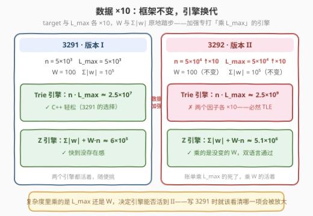
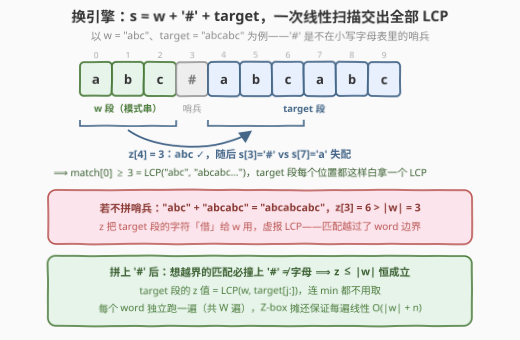
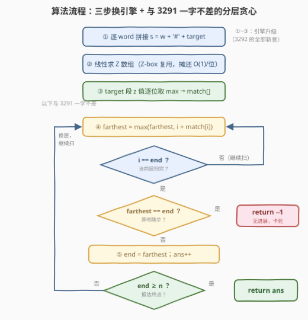
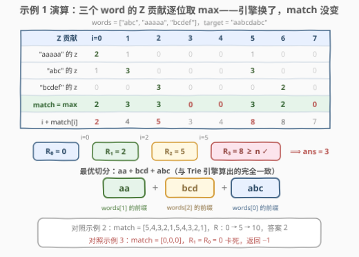

# LeetCode 形成目标字符串需要的最少字符串数 II 题解

- **关联**：[3291（版本 I）](3291_形成目标字符串需要的最少字符串数I.md)——本题是其数据加强版，框架一脉相承，本文聚焦「换引擎」

## 1. 题目概述

- **标题 / 题号**：形成目标字符串需要的最少字符串数 II（#3292，hard）
- **链接**：https://leetcode.cn/problems/minimum-number-of-valid-strings-to-form-target-ii/
- **难度**：困难
- **标签**：贪心、Z 函数、字符串匹配、动态规划、线段树、字符串哈希

**题意**：给你一个字符串数组 `words` 和一个字符串 `target`。

如果字符串 `x` 是 `words` 中**任意**字符串的**前缀**，则认为 `x` 是一个**有效**字符串。

现计划通过**连接**有效字符串形成 `target`，请你计算并返回需要连接的**最少**字符串数量。如果无法通过这种方式形成 `target`，则返回 `-1`。

**示例 1**：

```text
输入：words = ["abc","aaaaa","bcdef"], target = "aabcdabc"
输出：3
解释：target 可以通过连接以下有效字符串形成：
  "aa"  —— words[1] 的长度 2 前缀
  "bcd" —— words[2] 的长度 3 前缀
  "abc" —— words[0] 的长度 3 前缀
```

**示例 2**：

```text
输入：words = ["abababab","ab"], target = "ababaababa"
输出：2
解释："ababa" + "ababa"，两段都是 words[0] 的前缀（前缀可以重复使用）。
```

**示例 3**：

```text
输入：words = ["abcdef"], target = "xyz"
输出：-1
解释：'x' 不是任何 word 的前缀开头，第一个字符就无从下手。
```

**约束**：

- $1 \le \text{words.length} \le 100$
- $1 \le \text{words}[i].\text{length} \le 5 \times 10^4$，且 $\sum_i \text{words}[i].\text{length} \le 10^5$
- `words[i]` 和 `target` 都只包含小写英文字母
- $1 \le \text{target.length} \le 5 \times 10^4$

> 💡 **读题关键**：与 3291 逐字对比，**题意一个字没变，变的全是数据范围**——`target` 长度与单个 `word` 长度上限各 ×10（$5 \times 10^3 \to 5 \times 10^4$），而 words 数量 $W \le 100$ 与总长 $\sum|w| \le 10^5$ 原地踏步。「题意零新意、数据全是恶意」：加强版专挑解法的复杂度软肋打。本文主线就是复盘 3291 的框架、定位那块软肋、把引擎换掉——这也是 I/II 成对题的标准打开方式：**框架照抄，引擎换代**。

## 2. 解题思路

### 2.1 复盘 3291：两板斧仍然成立，Trie 引擎当场报废

先立不变量（完整论证见 [3291 题解](3291_形成目标字符串需要的最少字符串数I.md)）：

**板斧一（前缀封闭性）**：有效字符串集合 = 所有 word 的所有前缀，而前缀的前缀仍是前缀。因此从位置 $i$ 出发的合法段长是**连续区间** $1 \sim \text{match}[i]$，其中

$$\text{match}[i] = \max_{w \in \text{words}} \mathrm{LCP}\big(w,\ \text{target}[i:]\big)$$

一个 $\text{match}[i]$ 吃掉一整段转移：$dp[j] \leftarrow \min(dp[j],\ dp[i]+1),\ j \in (i,\ i+\text{match}[i]]$。

**板斧二（截短论证）**：$dp$ **单调不减**（把跨过位置 $i$ 的段截短即得），故「用 $\le k$ 段可达的位置」永远是前缀区间 $[0, R_k]$，转移与 [45. 跳跃游戏 II](https://leetcode.cn/problems/jump-game-ii/) 同构，分层贪心 $O(n)$：

$$R_0 = 0, \qquad R_{k+1} = \max_{i \le R_k} \big(i + \text{match}[i]\big)$$

某轮 $R_{k+1} = R_k < n$ 即卡死返回 $-1$；首个 $R_k \ge n$ 的 $k$ 即答案。

这两板斧的正确性证明只用到前缀封闭性与截短论证，**与数据规模无关**，3292 原样有效。要命的是 3291 里 C++ 求 match 的引擎——Trie 逐位置行走，代价

$$O\big(n \cdot L_{\max}\big)$$



数据 ×10 之后：$n$ 从 $5\times10^3$ 涨到 $5\times10^4$，$L_{\max}$ 同样 ×10，于是 $n \cdot L_{\max}: 2.5\times10^7 \to \mathbf{2.5\times10^9}$——C++ 也扛不住，必然超时。

死因是**结构性**的：Trie 行走对每个起点 $i$ 都「从根重新走一遍」，$n$ 个起点 × 每个最多 $L_{\max}$ 步，计费方式是乘法，且两个因子恰好都被 ×10。重复劳动——同一个前缀路径被不同起点走了一遍又一遍。

### 2.2 核心观察：换引擎——Z 函数把「问 LCP」变成批量出厂



**观察**：对每个 word 独立做**一次线性扫描**，把「$w$ 与 `target` 每个后缀的 LCP」一整排全部算出来。手法是拼接

$$s = w + \# + \text{target}$$

（`'#'` 是不在小写字母表里的**哨兵**），然后求 Z 数组：$z[i]$ = $s$ 与 $s[i:]$ 的最长公共前缀。当 $i$ 落在 target 段（$i \ge |w|+1$）时：

$$z[i] = \mathrm{LCP}\big(w,\ \text{target}[j:]\big), \qquad j = i - |w| - 1$$

而且 $z[i]$ **天然 $\le |w|$**：匹配一旦想越过 $w$ 的边界，就会拿 $s[|w|]$ 位置上的 `'#'` 去和 target 段的小写字母硬碰，必然失配。所以 Z 值就是现成的 LCP，连 $\min(|w|, \cdot)$ 都不用取。对全部 word 逐位取 max：

$$\text{match}[j] = \max_{w}\ z_w\big[|w| + 1 + j\big]$$

**复杂度账单**：每个 word 一遍 $O(|w| + n)$，总计

$$O\Big(\sum|w| + W \cdot n\Big) = 10^5 + 100 \times 5\times10^4 \approx 5\times10^6$$

对比 Trie 的 $2.5\times10^9$——**账单里乘的是 $W$ 而不是 $L_{\max}$**。数据加强打的是 $L_{\max}$，$W$ 纹丝没动，所以 Z 引擎毫发无伤（3291 时代约 $6\times10^5$，不过 ×8.5 而已）。

**Z 为什么是线性的？** 最右 Z-box 摊还：算法始终维护迄今最右的匹配框 $[l, r)$（满足 $s[l..r) = s[0..r-l)$）；新位置 $i$ 落在框内时，$z[i]$ 的初值可直接从 $z[i-l]$ 复用（框内的对应关系早已验证过），只有匹配冲出 $r$ 时才需要逐字符试探——而每次成功试探都把 $r$ 右推，$r$ 全程只右移 $m$ 次，故所有试探的总次数是 $O(m)$。这正是与「Trie 每个起点从根重走」的本质区别：**信息复用 vs 重复劳动**。

> 💡 **引擎选型口诀**：模式串少而文本长 → 逐模式串 Z 函数（本题）；模式串也多 → Aho–Corasick 自动机（见扩展②，$O(\sum|w| + n)$ 与 $W$ 无关）；文本短 → Trie 逐位走也行（3291 的 C++）。复杂度建模时就该看清：**账单里乘的哪个量会被数据加强放大**。

### 2.3 算法流程图



| 步骤 | 操作 | 说明 |
|------|------|------|
| ① 拼接 | 逐 word 构造 $s = w + \# + \text{target}$ | $W$ 次扫描，每次 $O(|w| + n)$ |
| ② 求 Z | 线性计算 Z 数组，最右 Z-box 复用 | 摊还 $O(1)$/位置 |
| ③ 合并 | $\text{match}[j] = \max_w z_w[|w|+1+j]$ | target 段的 z 值逐位取 max |
| ④ 扫描 | $\text{farthest} = \max(\text{farthest},\ i + \text{match}[i])$ | 与 3291 一字不差 |
| ⑤ 结算 | $i = \text{end}$ 时判死 / 换层 / 收答案 | $\text{farthest} = \text{end} \to -1$；$\text{end} \ge n \to$ 返回 $\text{ans}$ |

### 2.4 示例演算



以示例 1（`words = ["abc","aaaaa","bcdef"]`，`target = "aabcdabc"`）走一遍——与 3291 的 Trie 演算表对照，**同一张 match，不同引擎算出**。三个 word 各自的 Z 贡献（target 段）：

| word | 拼接串 | 各后缀贡献 |
|------|--------|-----------|
| `"aaaaa"` | `aaaaa#aabcdabc` | $[2,1,0,0,0,1,0,0]$ |
| `"abc"` | `abc#aabcdabc` | $[1,3,0,0,0,3,0,0]$ |
| `"bcdef"` | `bcdef#aabcdabc` | $[0,0,3,0,0,0,2,0]$ |

逐位取 max 得 $\text{match} = [2,3,3,0,0,3,2,0]$，与 Trie 引擎的结果完全一致。分层扩张：$R_0 = 0 \xrightarrow{\,i=0\,} R_1 = 2 \xrightarrow{\,i=2\,} R_2 = 5 \xrightarrow{\,i=5\,} R_3 = 8 \ge n$，答案 $\mathbf{3}$，切分 `aa | bcd | abc`。✓

示例 2：`match = [5,4,3,2,1,5,4,3,2,1]`，$R$：$0 \to 5 \to 10$，答案 $\mathbf{2}$。✓
示例 3：`match = [0,0,0]`，$R_1 = R_0 = 0$ 卡死，返回 $\mathbf{-1}$。✓

## 3. 参考代码

### C++（Z 函数 + 分层贪心）

```cpp
class Solution {
  public:
    int minValidStrings(vector<string>& words, string target) {
        int n = target.size();
        vector<int> match(n, 0);

        // ①②③ 换引擎：逐 word 求 s = w + '#' + target 的 Z 数组，
        //     target 段的 z 值 = LCP(w, target[j:])，天然 <= |w|
        for (string& w : words) {
            string s = w + '#' + target;
            int m = s.size();
            vector<int> z(m, 0);
            for (int i = 1, l = 0, r = 0; i < m; i++) {
                if (i < r) z[i] = min(r - i, z[i - l]); // 落在 Z-box 内：复用
                while (i + z[i] < m && s[z[i]] == s[i + z[i]]) z[i]++;
                if (i + z[i] > r) l = i, r = i + z[i];  // 右推最右 Z-box
            }
            int base = w.size() + 1;                    // target 段起点
            for (int j = 0; j < n; j++)
                match[j] = max(match[j], z[base + j]);
        }

        // ④⑤ 分层贪心（跳跃游戏 II）：与 3291 一字不差
        long long end = 0, farthest = 0;
        int ans = 0;
        for (int i = 0; i < n; i++) {
            farthest = max(farthest, (long long)i + match[i]);
            if (i == end) {                      // 当前层扫完，结算 R_{k+1}
                if (farthest == end) return -1;  // 原地踏步：卡死
                end = farthest;
                ans++;
                if (end >= n) return ans;        // 抵达位置 n
            }
        }
        return -1;                               // 兜底（逻辑上到不了这里）
    }
};
```

### Python（Z 函数 + 分层贪心）

```python
class Solution:
    def minValidStrings(self, words: List[str], target: str) -> int:
        n = len(target)
        match = [0] * n

        # ①②③ 换引擎：逐 word 求 s = w + '#' + target 的 Z 数组，
        #     target 段的值 = LCP(w, target 各后缀)，天然 <= |w|
        for w in words:
            s = w + '#' + target
            m = len(s)
            z = [0] * m
            l = r = 0                          # 当前最右 Z-box [l, r)
            for i in range(1, m):
                if i < r:
                    z[i] = min(r - i, z[i - l])    # 复用 box 内已匹配的信息
                while i + z[i] < m and s[z[i]] == s[i + z[i]]:
                    z[i] += 1
                if i + z[i] > r:
                    l, r = i, i + z[i]
            base = len(w) + 1
            for i in range(n):
                if z[base + i] > match[i]:
                    match[i] = z[base + i]

        # ④⑤ 分层贪心（跳跃游戏 II）：与 3291 一字不差
        end = farthest = ans = 0
        for i in range(n):
            farthest = max(farthest, i + match[i])
            if i == end:
                if farthest == end:
                    return -1                  # 原地踏步：卡死
                end = farthest
                ans += 1
                if end >= n:
                    return ans
        return -1
```

> 💡 两个实现细节：① Python 部分与 3291 的 Python **逐字相同**——「换引擎」的红利直观到这种程度：代码一行不改，改的只是它扛得住的数据规模（3291 里 Z 是 Python 的权宜之计，3292 里它升格为双语言正解）；② C++ 的 Z 数组逐 word 重建，峰值空间 $O(L_{\max} + n)$，无需为全部 $W$ 个 word 保留结果——match 才是唯一需要留到最后的全局信息。

## 4. 复杂度分析

| 维度 | C++ / Python（Z 函数引擎） | 说明 |
|------|---------------------------|------|
| 时间复杂度 | $O(\sum\lvert w\rvert + W \cdot n)$ | 求匹配 $\approx 5\times10^6$；分层贪心 $O(n)$，合计无压力 |
| 空间复杂度 | $O(L_{\max} + n)$ | Z 数组逐 word 重建（大小 $\le L_{\max} + n + 1$）+ match 数组 $O(n)$ |
| 对比：Trie 引擎（3291 的 C++） | $O(n \cdot L_{\max}) \approx 2.5\times10^9$ | 两个因子恰好都被数据加强 ×10，II 下必然超时 |
| 对比：AC 自动机（扩展②） | $O(\sum\lvert w\rvert + n)$ | 理论最优，与 $W$ 无关；$W \le 100$ 时 Z 已经够快 |

## 5. 扩展：两条进阶路线

**① 官方提示的路线：滚动哈希 + 二分 + 线段树**（本题标签 Segment Tree / Binary Search / Rolling Hash 的来源）

官方 hints 给出的是一条**不需要看穿任何单调性**的通用路线：

1. 把每个 word 的**每个前缀**的哈希值插入 HashSet——$O(\sum|w|)$ 个哈希，把平方级膨胀的前缀字典压缩成一个集合；
2. 对 `target` 预处理前缀哈希与幂表（配逆元可 $O(1)$ 取任意子串哈希）；
3. 对每个起点 $i$ **二分**最大 $L$，使 $\text{target}[i..i+L)$ 的哈希落在集合中。可二分的依据仍是前缀封闭性：$L$ 可行 $\Rightarrow$ 更短都可行，判定关于 $L$ 单调；
4. 转移 $dp[j] \leftarrow \min(dp[j],\ dp[i]+1),\ j \in (i,\ i+L]$ 是**区间取 min**：懒标记线段树 $O(n\log n)$ 收尾。官方还提示可用有序集合维护「dp 尚未敲定的位置」，区间覆盖时批量弹出结算——每个位置一生只被弹出一次，均摊 $O(n\log n)$。

点评：这是「区间型 DP 转移」标准武器库的全套展示，但每步都比需要的更重——哈希有极小概率碰撞（官方默认接受），二分和线段树各带一个 $\log$。看穿 dp 单调性后，第 4 步整个坍缩成分层贪心，前 3 步的 match[] 也被 Z 函数一遍线性拿走。3291 扩展里那句「线段树是保底，贪心是降维打击」在数据加强后更加成立。

**② 理论最优：AC 自动机 + 「最长后缀覆盖」论证**

把所有 word 建成 Aho–Corasick 自动机（Trie + fail 指针），`target` **一遍**扫描：每步停留的状态恰是「当前前缀的最长 trie-后缀」，设其深度为 $d_e$（$e$ 为已消费字符数），则 $\text{target}[e-d_e..e)$ 是某 word 的前缀，更新 $\text{match}[e-d_e] \leftarrow \max(\cdot,\ d_e)$。总复杂度 $O(\sum|w| + n)$，与 $W$ 无关——$W$ 再涨到几千也不怕。

> ⚠️ 一个容易踩的坑：每个终点只记「最长」后缀，某起点的真实 match 可能来自 fail 链上更短的后缀。例如 `words = ["abc","aabc"]`，`target = "aabc"`：扫到末尾时最长后缀是 `"aabc"`（深度 4，只更新了 match[0]=4），而位置 1 的真实 match = 3（`"abc"` 躺在 fail 链上）没有落到 match[1]。

为什么这样做**仍然正确**？**覆盖论证**：若 $\text{target}[i..e)$ 是合法段（长度 $L$），则终点 $e$ 的最长后缀深度 $d_e \ge L$、起点 $i' = e - d_e \le i$；于是被记录的跳跃「$i' \to e$」与真实跳跃「$i \to e$」**终点相同、起点更早**。而可达集是前缀区间——$i$ 可达 $\Rightarrow i'$ 必可达。故每条真实跳跃都被一条不劣的记录跳跃覆盖，各层右端 $R_k$ 逐层不变，答案与 $-1$ 判据都不变。∎

## 6. 面试要点

1. **3291 → 3292 到底什么变了？为什么「框架照抄、只换引擎」是合法操作？**

   题意与约束结构零变化，仅 `target` 长度与单个 word 长度 ×10。match + 分层贪心框架的正确性只依赖前缀封闭性与截短论证，与规模无关；受影响的只有求 match 的复杂度。识别「哪些部分与规模无关、哪一项会被放大」，正是 I/II 成对题的训练价值。

2. **Trie 引擎的死因是什么？Z 函数为什么能活？**

   Trie 逐起点从根重走，$O(n \cdot L_{\max})$，两个因子都被 ×10 后达 $2.5\times10^9$。Z 对每个 word 整体线性 $O(|w|+n)$，总计 $O(\sum|w| + W n)$：账单乘的是没变的 $W$ 而非被放大的 $L_{\max}$。本质是 Z-box 摊还的**信息复用**战胜了逐起点的**重复劳动**。

3. **拼接串里的 `'#'` 起什么作用？能换成别的字符吗？**

   哨兵——不在小写字母表中，保证匹配无法越过 word 边界，z 值天然 $\le |w|$、恰等于 LCP。若不拼哨兵，z 会把 target 段自己的字符「借」给 w 用，虚报超过 $|w|$ 的 LCP。换成任意不在字母表的字符（`'0'`、`'.'` 等）都行。

4. **`-1` 的判据是什么？和「存在 match[i] = 0」是一回事吗？**

   判据是分层扩张无进展 $R_{k+1} = R_k < n$。不可达位置的 match 是几都无所谓；match[0]=0 必然 -1，但中间的 match 为 0 只是死点，只要别的路能绕过去就不影响答案。

5. **如果 words 数量 $W$ 也放大到几千，引擎怎么选？**

   Z 的 $W \cdot n$ 项会爆，上 AC 自动机：$O(\sum|w| + n)$ 一遍扫描，且「每步只更新最长后缀」就够——覆盖论证保证分层右端不变。这也是多模式串匹配场景选「逐模式串线性扫」还是「自动机一次扫」的分水岭。

## 同类练习题

| # | 题目 | 与本题的关联 |
|---|------|-------------|
| 3291 | [形成目标字符串需要的最少字符串数 I](https://leetcode.cn/problems/minimum-number-of-valid-strings-to-form-target-i/)（[题解](3291_形成目标字符串需要的最少字符串数I.md)） | 本题弱化版，Trie 引擎尚可存活；两篇对照看「数据范围如何决定引擎选型」 |
| 45 | [跳跃游戏 II](https://leetcode.cn/problems/jump-game-ii/)（[题解](../0001-0100/45_跳跃游戏%20II.md)） | 分层贪心母题，`match[i]` ↔ `nums[i]`，④⑤ 步就是它的默写 |
| 28 | [找出字符串中第一个匹配项的下标](https://leetcode.cn/problems/find-the-index-of-the-first-occurrence-in-a-string/) | KMP / Z 函数入门，`p + '#' + t` 哨兵拼接的单模式串版，先练熟它再来本题 |
| 3008 | [找出数组中的美丽下标 II](https://leetcode.cn/problems/find-beautiful-indices-in-the-given-array-ii/)（[题解](../3001-3100/3008_找出数组中的美丽下标II.md)） | Z 函数多后缀查询的进阶练手 |
| 214 | [最短回文串](https://leetcode.cn/problems/shortest-palindrome/) | `s + '#' + rev(s)` 同款哨兵拼接求最长回文前缀，体会「分隔符防越界」的普适性 |
