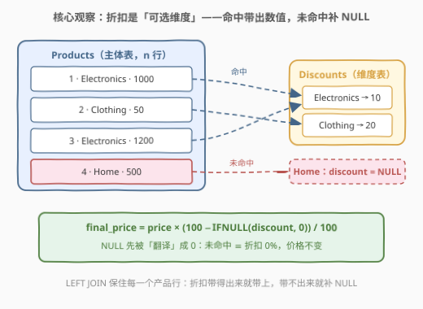
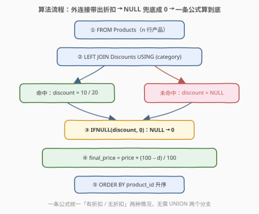
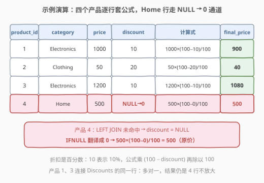

# LeetCode 计算产品最终价格 题解

## 1. 题目概述

- **标题 / 题号**：计算产品最终价格（#3293，medium）
- **链接**：https://leetcode.cn/problems/calculate-product-final-price/
- **难度**：中等
- **标签**：数据库、SQL、JOIN、`LEFT JOIN`、`USING`、`IFNULL`/`COALESCE`、NULL 处理、LeetCode 锁题

> ⚠️ 本题为 LeetCode 付费题（锁题），题意描述根据官方示例用例与外部资料重建，可能与官方题面有出入。（题面已与社区镜像 doocs/leetcode 的官方中文翻译交叉核对，示例输入输出与 GraphQL 接口返回一致，出入风险较低。）

**表结构**：`Products`

| 列名 | 类型 |
|------|------|
| product_id | int |
| category | varchar |
| price | decimal |

- `product_id` 是这张表的唯一主键。
- 每行包含产品的 ID、分类以及价格。

**表结构**：`Discounts`

| 列名 | 类型 |
|------|------|
| category | varchar |
| discount | int |

- `category` 是这张表的主键。
- 每行包含一个产品分类和该分类的折扣百分比（取值范围 0 到 100）。

**目标**：编写一个解决方案，计算每个产品应用**分类折扣**后的**最终价格**。如果产品的分类**没有关联的折扣**，价格保持**不变**。结果表包含 `product_id`、`final_price`、`category` 三列，以 `product_id` **升序**排序。

**示例 1**：

```text
输入：
Products 表：
+------------+-------------+-------+
| product_id | category    | price |
+------------+-------------+-------+
| 1          | Electronics | 1000  |
| 2          | Clothing    | 50    |
| 3          | Electronics | 1200  |
| 4          | Home        | 500   |
+------------+-------------+-------+

Discounts 表：
+-------------+----------+
| category    | discount |
+-------------+----------+
| Electronics | 10       |
| Clothing    | 20       |
+-------------+----------+

输出：
+------------+-------------+------------+
| product_id | final_price | category   |
+------------+-------------+------------+
| 1          | 900         | Electronics |
| 2          | 40          | Clothing   |
| 3          | 1080        | Electronics |
| 4          | 500         | Home       |
+------------+-------------+------------+
```

**解释**：

- **产品 1**：Electronics 有 10% 折扣，$1000 \times \frac{100-10}{100} = 900$。
- **产品 2**：Clothing 有 20% 折扣，$50 \times \frac{100-20}{100} = 40$。
- **产品 3**：Electronics 有 10% 折扣，$1200 \times \frac{100-10}{100} = 1080$。
- **产品 4**：Home 没有关联折扣，价格保持 $500$ 不变。

> 💡 **审题关键**：① 输出的主体是**每一个产品**——任何会丢产品行的写法（`INNER JOIN`、在 `WHERE` 里过滤右表列）都不对；② 「分类没有折扣」与「折扣为 0%」在结果上等价（都卖原价），可以把前者**归一**成后者，一条公式通吃；③ `discount` 是**百分数**（10 表示 10%），公式是 $\text{price} \times \frac{100-\text{discount}}{100}$，别把 10 当 0.10 用；④ 题面未要求 `ROUND`，示例均为整数——MySQL 中 DECIMAL 的 `/` 是精确除法，会扩展小数位（如 `900.0000`），按数值比较判题不受影响。

## 2. 解题思路

### 2.1 暴力思路：两个分支 UNION——「有折扣」和「没折扣」各写一遍

不知道 `LEFT JOIN` 时最直觉的拆法：有折扣的产品走 `INNER JOIN` 算折后价，没折扣的产品用 `NOT IN` 挑出来卖原价，两批结果 `UNION ALL` 拼起来：

```sql
SELECT p.product_id,
       p.price * (100 - d.discount) / 100 AS final_price,
       p.category
FROM Products p
JOIN Discounts d ON p.category = d.category

UNION ALL

SELECT product_id,
       price AS final_price,
       category
FROM Products
WHERE category NOT IN (SELECT category FROM Discounts)
ORDER BY product_id;
```

- **正确性**：示例能过（`NOT IN` 在子查询结果无 NULL 时行为正确——`category` 是主键恰好保证了这一点）。但「没折扣 = 全价」这条业务规则**没有出现在第二个分支里**——它是靠「干脆不算折扣」这个动作隐式表达的；若哪天规则改成「无折扣商品加收 5% 附加费」，第二个分支得整个重写。
- **效率**：`Products` 被扫两遍（JOIN 一遍、`NOT IN` 再一遍）。
- **别扭之处**：一个「可选属性」问题被拆成了两条互斥分支——**规则写在两处，就有两处可以改错**。

> ⚠️ 瓶颈在于把「折扣可有可无」当成了「两种产品」。突破口：折扣表是一张**维度表**，产品表是**主体表**——「带得出来就带上、带不出来就补 NULL」正是外连接的语义。

### 2.2 核心观察：LEFT JOIN——「可选维度」的标准表达



**观察 1（折扣是可选维度）**：每个产品**必有**价格，但**未必有**折扣。「必有」的属性长在主体表上，「可选」的属性放进另一张表用连接带出——命中则拿到 `discount`，未命中该列补 `NULL`。`LEFT JOIN` 一行代码把 2.1 的两个分支合成一条流水线，且**以左表为锚，行数永不放大**：`Discounts.category` 是主键，产品 1、3 两个 Electronics 行对齐的是同一行折扣，多对一连接不复制行。

**观察 2（⚠️ NULL 会传染，必须先翻译）**：未命中行的 `discount` 是 `NULL`，而 `NULL` 参与任何算术，结果都是 `NULL`：

$$\texttt{price} \times (100 - \texttt{NULL}) / 100 = \texttt{NULL}$$

于是产品 4 的 `final_price` 会是 NULL 而不是 500——这是本题唯一的坑。解药是进公式前把 NULL **翻译**回数字：`IFNULL(discount, 0)`。翻译之后，「没有折扣」与「折扣 0%」被归一成同一种情况，一条公式 $\text{price} \times \frac{100-d}{100}$ 覆盖全部行。

**观察 3（为什么偏偏是 LEFT）**：`INNER JOIN` 会把 Home 类产品**整行丢掉**（产品 4 从结果里消失）；`RIGHT JOIN` 反客为主，若 Discounts 里存在没有产品的分类还会凭空多出行来。方向由「谁是主体」决定：输出粒度是产品，Products 就放左边。

**观察 4（先乘后除，跨方言保精度）**：公式写 `price * (100 - discount) / 100` 优于 `price * (1 - discount / 100)`——MySQL 的 `/` 对 DECIMAL 是精确除法，两者皆可；但 PostgreSQL / SQL Server 里**整数除整数会截断**，`discount / 100` 直接变 0，所有产品全价。先乘后除（或分母写 `100.0`）是零成本的防御写法。

### 2.3 算法流程图



**逻辑执行步骤**：

| 步骤 | 表达式 | 作用 |
|------|--------|------|
| ① 主体表 | `FROM Products` | $n$ 行产品，每行必有 `price` |
| ② 外连接 | `LEFT JOIN Discounts USING (category)` | 命中行带出 `discount`；未命中行补 `NULL` |
| ③ NULL 翻译 | `IFNULL(discount, 0)` | 「无折扣」归一为「折扣 0%」 |
| ④ 套公式 | `price * (100 - d) / 100` | 一条公式通吃两种情况 |
| ⑤ 排序 | `ORDER BY product_id` | 题目要求的升序输出 |

### 2.4 示例演算



| product_id | category | price | discount（连接后） | 计算式 | final_price |
|------------|----------|-------|-------------------|--------|-------------|
| 1 | Electronics | 1000 | 10 | $1000 \times \frac{100-10}{100}$ | 900 |
| 2 | Clothing | 50 | 20 | $50 \times \frac{100-20}{100}$ | 40 |
| 3 | Electronics | 1200 | 10 | $1200 \times \frac{100-10}{100}$ | 1080 |
| 4 | Home | 500 | **NULL → 0** | $500 \times \frac{100-0}{100}$ | **500** |

前三行是常规的「命中 → 带折扣」；产品 4 是本题考点：`LEFT JOIN` 未命中得到 NULL，`IFNULL` 翻译成 0，套进同一条公式恰好是「乘以 100 再除以 100」——原价。另可注意到产品 1、3 同属 Electronics，两行对齐的是 Discounts 的**同一行**，连接结果仍是 4 行、行数不放大。

## 3. 参考代码

### SQL（解法 A：LEFT JOIN + IFNULL，推荐）

```sql
# Write your MySQL query statement below
SELECT product_id,
       price * (100 - IFNULL(discount, 0)) / 100 AS final_price,
       category
FROM Products
LEFT JOIN Discounts USING (category)
ORDER BY product_id;
```

> 💡 **写法要点**：
> - `USING (category)` 让两表的同名列合并成一个输出列，`product_id`、`price` 只在 Products 侧、`discount` 只在 Discounts 侧，全部无歧义、无需 `p.`/`d.` 限定；
> - `IFNULL` 是 MySQL 方言，跨实现写标准 SQL 的 `COALESCE(discount, 0)`（双参数时两者等价）；
> - 2.1 的两个分支被压缩成「一个连接 + 一个兜底函数」，业务规则只剩一条公式。

### SQL（解法 B：相关子查询逐行取折扣）

```sql
# Write your MySQL query statement below
SELECT product_id,
       price * (100 - COALESCE((SELECT discount
                                  FROM Discounts d
                                 WHERE d.category = Products.category), 0)) / 100 AS final_price,
       category
FROM Products
ORDER BY product_id;
```

> 💡 **写法要点**：
> - `Discounts.category` 是主键 ⇒ 标量子查询至多返回一行，拼进表达式合法；Discounts 很小且 `category` 上有索引时，每行产品一次索引查找，代价可接受；
> - ⚠️ 相关条件必须写**全限定名** `Products.category`：裸写 `category` 会优先解析成**内层**作用域的 `d.category`，条件退化为 `d.category = d.category` 恒真——Discounts 多于一行时 MySQL 直接报错 1242（Subquery returns more than 1 row），恰好一行时则会**静默地**给所有产品套上同一折扣。错误形态随数据变化，是相关子查询最隐蔽的坑；
> - 与解法 A 的取舍：A 是集合思维（一趟连接），B 是逐行思维（$n$ 次回表）；大数据量下 A 全面占优，B 的价值在于展示「可选维度」也可以不用 JOIN 表达。

### Python（pandas）

```python
import pandas as pd


def calculate_final_prices(products: pd.DataFrame, discounts: pd.DataFrame) -> pd.DataFrame:
    df = products.merge(discounts, on="category", how="left")
    df["final_price"] = df["price"] * (100 - df["discount"].fillna(0)) / 100
    return (
        df[["product_id", "final_price", "category"]]
        .sort_values("product_id")
        .reset_index(drop=True)
    )
```

> 💡 **pandas 对照**（付费题无官方函数签名，函数名按题名约定，以站点模板为准）：
> - `how="left"` 即 `LEFT JOIN`，未命中行的 `discount` 是 `NaN`；
> - `fillna(0)` 对应 `IFNULL(discount, 0)`——pandas 的 `NaN` 与 SQL 的 `NULL` 一样会传染算术，同样要先翻译再参与运算；
> - pandas 的 `/` 是浮点除法、永不整除截断，天然规避观察 4 的方言坑（代价是浮点精度，本题量级无碍）。

## 4. 复杂度分析

设 $n$ 为 `Products` 行数，$m$ 为 `Discounts` 行数（$m \le$ 分类数 $\le n$）。

| 维度 | 复杂度 | 说明 |
|------|--------|------|
| **时间（解法 A）** | $O(n + m)$ | 哈希外连接一趟：两侧各扫一遍，按 `category` 哈希匹配 |
| **时间（解法 B）** | $O(n \log m)$ | 每行产品对 Discounts 做一次索引查找；无索引时退化为 $O(n \times m)$ |
| **时间（暴力）** | $O(2n)$ 起 | JOIN 一遍 + `NOT IN` 再扫一遍，同一张表被读两次 |
| **空间** | $O(n + m)$ | 连接中间结果与输出均为 $n$ 行 |

> 判题数据规模下任何写法都瞬时通过；工程上「外连接 + 哈希」（或利用 `Discounts.category` 主键索引做嵌套循环）是标准形态。

## 5. 扩展：NULL 的三种处置与外连接的退化陷阱

### 5.1 IFNULL / COALESCE / NULLIF 三兄弟

| 函数 | 语义 | 备注 |
|------|------|------|
| `IFNULL(a, b)` | a 为 NULL 则取 b | MySQL 方言，仅两参数 |
| `COALESCE(a, b, ...)` | 取第一个非 NULL 的参数 | 标准 SQL，可多参数 |
| `NULLIF(a, b)` | a = b 则返回 NULL，否则返回 a | 反向工具，经典用法 `x / NULLIF(y, 0)` 防除零 |

本题只需要「NULL → 0」这一个方向，`IFNULL`/`COALESCE` 任选；`NULLIF` 的经典舞台是**除法防护**——分母可能为 0 时把 0 变 NULL，让结果「无定义」而非报错或算出错值（1251 题平均售价就是这个用法）。

### 5.2 「外连接 + WHERE 过滤右表列」会退化成内连接

若把本题顺手写成：

```sql
SELECT ...
FROM Products p
LEFT JOIN Discounts d ON p.category = d.category
WHERE d.discount >= 0;        -- 想过滤「有效折扣」？
```

`WHERE` 作用于**连接之后**的中间表：未命中行的 `d.discount` 是 NULL，`NULL >= 0` 不成立，整行被过滤——LEFT 退化成了 INNER，产品 4 凭空消失。三处各司其职：**`ON` 管匹配、`WHERE` 管过滤、`SELECT` 管翻译**。要「专门挑出未命中的行」，用 `WHERE d.category IS NULL`（1581 题正是如此）；要「未命中也保留」，就在 SELECT 里 `IFNULL` 兜底（本题）。

## 6. 面试要点

1. **为什么必须 `LEFT JOIN`，`INNER JOIN` 错在哪？**

   输出主体是每一个产品。`INNER JOIN` 只保留两边都命中的行，Home 类没有任何折扣记录，产品 4 会整行消失。`LEFT JOIN` 的语义就是「以左表为主体、右表可选」——主体表放左边，是数据建模的直觉动作。

2. **漏写 `IFNULL(discount, 0)` 会发生什么？**

   未命中行的 `discount` 为 NULL，NULL 参与算术全程传染，`price * (100 - NULL) / 100` 的结果是 NULL——产品 4 的 `final_price` 变成 NULL 而不是 500。这是本题唯一的功能性坑点，也是所有外连接题的通用考点。

3. **`USING (category)` 与 `ON p.category = d.category` 有什么区别？**

   语义相同的等值连接，差别在输出：`USING` 把连接列合并为一个 `category` 列（本题恰好要输出它）；`ON` 写法两表的 `category` 都保留，引用时需限定表名。`JOIN ... USING` 是标准 SQL 语法，不是 MySQL 私有特性。

4. **公式为什么先乘后除？`price * (1 - discount / 100)` 不行吗？**

   MySQL 里行：`/` 对 DECIMAL 精确、不截断。但 PostgreSQL / SQL Server 中整数 / 整数是**整除**，`discount / 100` 恒为 0，所有产品都变全价。`price * (100 - discount) / 100` 先把分子乘大再除，配合分母写 `100.0` 可跨方言免疫。

5. **解法 B 里相关条件裸写 `category` 为什么是错的？**

   列名解析从内层作用域向外层查找：裸的 `category` 命中子查询自己的 `d.category`，条件变成 `d.category = d.category` 恒真。Discounts 多行时报错 1242，恰好一行时**静默地**给所有产品套同一折扣——错误形态取决于数据，极其隐蔽。相关子查询引用外层列时，永远写全限定名 `Products.category`。

## 同类练习题

| # | 题目 | 与本题的关联 |
|---|------|-------------|
| 1068 | [产品销售分析 I](https://leetcode.cn/problems/product-sales-analysis-i/)（[站内题解](../1001-1100/1068_产品销售分析I.md)） | 最朴素的两表 LEFT JOIN 取列，本题的零门槛前置 |
| 1211 | [查询结果的质量和占比](https://leetcode.cn/problems/queries-quality-and-percentage/)（[站内题解](../1201-1300/1211_查询结果的质量和占比.md)） | 聚合列 + `IFNULL` 兜底 NULL，把「翻译 NULL」练成肌肉记忆 |
| 1251 | [平均售价](https://leetcode.cn/problems/average-selling-price/)（[站内题解](../1201-1300/1251_平均售价.md)） | `IFNULL` 保护除零与空结果——NULL 处理的除法版 |
| 1581 | [进店却未进行过交易的顾客](https://leetcode.cn/problems/customer-who-visited-but-did-not-make-any-transactions/)（[站内题解](../1501-1600/1581_进店却未进行过交易的顾客.md)） | LEFT JOIN 未命中 + `IS NULL` 反查，对照本题「未命中翻译成 0」的另一种处置方式 |
