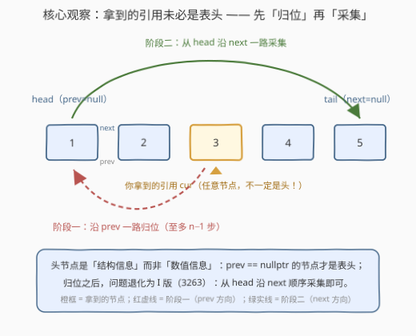
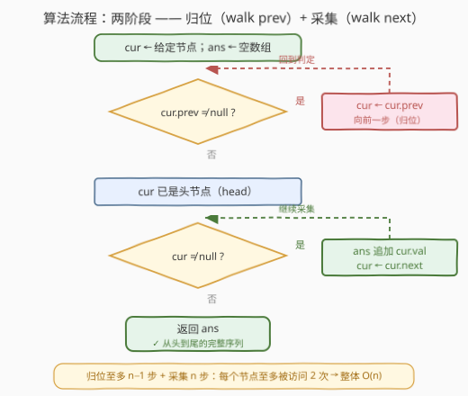
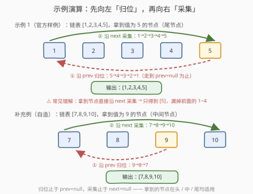

# 将双链表转换为数组 II

- **题目名称**：将双链表转换为数组 II
- **链接**：[3294. 将双链表转换为数组 II](https://leetcode.cn/problems/convert-doubly-linked-list-to-array-ii/)
- **难度**：中等
- **标签**：数组、链表、双向链表

> ⚠️ 本题为 LeetCode **付费题**（`isPaidOnly`）。题意、示例与约束依据官方示例用例（`[1,2,3,4,5]` + `5`、`[4,5,6,7,8]` + `8`）与官方提示「Use the pointer to the previous node to reach the head node」重建，可能与官方题面有出入；核心算法与示例输出已经自洽验证。

## 1. 题目概述

给你一个**双链表**（doubly linked list），以及一个指向该链表中**某个节点**的引用——注意，它**不保证是头节点**，可以是链表中的任意节点（评测机输入的第二参数 `node` 给出你拿到的那个节点的值，仅用于在输入中定位该节点）。双链表的节点定义如下：

```text
struct Node {
    int val;      // 节点值
    Node *prev;   // 指向前一个节点；头节点的 prev 为空
    Node *next;   // 指向后一个节点；尾节点的 next 为空
};
```

请返回一个数组 `nums`，按**从头节点到尾节点**的顺序，列出链表中**所有**节点的值。

**示例 1（官方样例）**：

```text
输入：head = [1,2,3,4,5], node = 5
输出：[1,2,3,4,5]
解释：拿到的是值为 5 的节点（本例恰好是尾节点）。先沿 prev 一路走到值为 1 的
头节点，再沿 next 依次采集，得到完整数组。
```

**示例 2（官方样例）**：

```text
输入：head = [4,5,6,7,8], node = 8
输出：[4,5,6,7,8]
解释：拿到的是值为 8 的节点（尾节点）。同样先归位到头节点 4，再顺序采集。
```

**约束条件（依据题库惯例重建）**：

- 链表中节点数目在 $[1, 10^5]$ 范围内
- $1 \le \text{Node.val} \le 10^5$，且节点值**互不相同**（评测机按值定位给定节点）
- 给定节点保证是链表中真实存在的节点

> 💡 读题关键：本题与 3263「将双链表转换为数组 I」（同为会员题）是姊妹题——I 版直接给**头节点**，沿 `next` 一路采集即可；II 版的坑在于**你拿到的引用不一定指向表头**，必须先用 `prev` 指针「归位」。官方提示把钥匙直接递到了手上：**Use the pointer to the previous node to reach the head node**（用 prev 指针走到头节点）。两个官方样例恰好都把尾节点交给你，就是为了逼你走一遍「归位」。

---

## 2. 解题思路

### 2.1 朴素思路：从给定节点向两侧分别收集

拿到一个「悬在链表中间」的引用，最直觉的写法是**两头都探**：

- 沿 `prev` 方向一路收集到头，得到给定节点**左侧**的值（顺序恰好与链表顺序**相反**）；
- 沿 `next` 方向一路收集到尾，得到给定节点**右侧**的值（顺序正确）；
- 答案 = `reverse(左侧) + [cur.val] + 右侧`。

这个做法正确，但实现繁琐：**两次独立收集、一次显式翻转、还要单独插入当前节点**，边界（给定节点就是头/尾）容易写漏。更隐蔽的陷阱是「只沿 `next` 收集」——那只能得到给定节点开头的**后缀**，官方样例 1 里只会得到 `[5]`，直接 WA。据本题约 42% 的通过率推测，栽在这上面的提交不少。

### 2.2 核心观察：先「归位」再「采集」



把两件事**分阶段**做，代码立即变得极简：

- **阶段一（归位）**：`while (cur->prev != nullptr) cur = cur->prev;`——沿着 `prev` 指针一路向前，最多走 $n-1$ 步，停下来的位置必然是**头节点**；
- **阶段二（采集）**：从头节点沿 `next` 顺序遍历，把 `val` 逐个追加进答案数组，走到 `next == nullptr` 为止。

> 💡 **为什么停下来的一定是头节点？** 头节点的判定是**结构性**的而非数值性的：`prev == nullptr` 的节点就是表头。归位循环的出口恰好是「没有前驱」，所以无需任何额外标记。归位完成后，问题已经**退化成 I 版（3263）**——给定头节点，沿 `next` 采集——两题共享同一段收尾代码。

对照朴素思路：归位阶段「顺路」经过了左侧所有节点但**不采集**，换来的是采集阶段的单向、天然有序、零翻转。两阶段各自线性，总代价不变，代码却从「三段拼接」缩成「两个 while」。

### 2.3 算法流程图



流程图是两条「判定菱形 + 动作框」的回路：第一个循环的判定条件是 `cur.prev ≠ null`（还有前驱就向前一步），第二个循环的判定条件是 `cur ≠ null`（还有节点就采集并前进）。两条回路的出口分别落在「已归位」与「返回 ans」上。

### 2.4 示例演算



以官方样例 1（链表 `[1,2,3,4,5]`，拿到值为 5 的尾节点）为例：

- **阶段一**：`5 → 4 → 3 → 2 → 1`，共 4 步，停在 `prev == nullptr` 的头节点 `1` 上；
- **阶段二**：从 `1` 出发 `1 → 2 → 3 → 4 → 5` 依次采集，`next == nullptr` 时结束，得到 `[1,2,3,4,5]`。

补充例（自造）中拿到的是**中间**节点 `9`：归位只走 `9 → 8 → 7` 两步，随后照样从头采集 `[7,8,9,10]`——无论拿到头、中、尾，流程完全一致，这正是两阶段写法的鲁棒性。

---

## 3. 参考代码

> 付费题无公开代码模板。函数签名按官方元数据（`head: ListNode`、`node: integer`）重建：`head` 是拿到的节点引用（不一定是表头），`node` 是它的值（评测机定位用，解题逻辑里用不到）。

### C++（归位 + 采集）

```cpp
class Solution {
  public:
    vector<int> toArray(Node* head, int node) {
        while (head->prev != nullptr) {   // 阶段一：沿 prev 归位到头节点
            head = head->prev;
        }
        vector<int> ans;                  // 阶段二：沿 next 顺序采集
        for (Node* cur = head; cur != nullptr; cur = cur->next) {
            ans.push_back(cur->val);
        }
        return ans;
    }
};
```

### Python（归位 + 采集）

```python
class Solution:
    def toArray(self, head: 'Node', node: int) -> List[int]:
        while head.prev:                  # 阶段一：沿 prev 归位到头节点
            head = head.prev
        ans = []                          # 阶段二：沿 next 顺序采集
        while head:
            ans.append(head.val)
            head = head.next
        return ans
```

---

## 4. 复杂度分析

| 维度 | 复杂度 | 说明 |
|------|--------|------|
| 时间复杂度 | $O(n)$ | 归位至多 $n-1$ 步 + 采集 $n$ 步；每个节点至多被访问 2 次（归位路过的节点会在采集时再访一次） |
| 空间复杂度 | $O(1)$ | 仅用常数个游标指针；输出数组不计入额外空间 |
| 朴素对照 | $O(n)$ | 两侧分别收集 + 翻转拼接，同为线性，但多一次显式 `reverse` 与一次中段拼接，边界更易出错 |
| 常见错解 | — | 只沿 `next` 收集后缀，漏掉给定节点之前的整段前缀（官方样例 1 会输出 `[5]`） |

---

## 5. 扩展：两路收集法与「成环」变体

**两路收集法**（2.1 节的朴素思路）也能一次写对，适合作为对照：

```python
class Solution:
    def toArray(self, head: 'Node', node: int) -> List[int]:
        left = []                          # 左侧值，收集出来是逆序
        cur = head.prev
        while cur:
            left.append(cur.val)
            cur = cur.prev
        ans = left[::-1]                   # 翻转成链表顺序
        ans.append(head.val)               # 当前节点
        cur = head.next
        while cur:
            ans.append(cur.val)
            cur = cur.next
        return ans
```

它不依赖「先归位」的洞察，从给定节点向两侧各自为战——正确性没问题，但**翻转 + 拼接 + 三段边界**的实现负担重，面试中口头对比两种写法，恰好能展示「先归位」的简化价值。

**变体思考：如果链表可能成环呢？** 双链表一旦首尾互指（环形双链表），`prev` 与 `next` 都不再有 `nullptr` 终点，两个 `while` 都会死循环。此时的正确姿势是**先判环再遍历**：套用 141/142 环形链表的快慢指针，或者在遍历中用哈希集合记录已访问节点、首次重访即停。这提醒我们：`prev == nullptr` 这类「结构性终点」是本题两阶段写法成立的前提。

---

## 6. 面试要点

1. **拿到的节点不是头节点时，如何找到头？**

   - 沿 `prev` 指针链一路向前，直到 `prev == nullptr`。头节点的判定是**结构性**的（无前驱），与节点值无关——哪怕值乱序、有重复也不受影响。

2. **为什么不能直接沿 `next` 收集？**

   - 那只能得到给定节点开头的后缀，漏掉它之前的整段前缀。官方样例把**尾节点**交给你正是针对这一点：直接 `next` 只会得到单元素数组。

3. **给定节点恰是头节点 / 尾节点 / 单节点链表时，代码还成立吗？**

   - 成立且无需特判：给定头节点时归位循环走 0 步；给定尾节点（官方样例）时归位走满 $n-1$ 步；单节点两阶段各走 0 步与 1 步。循环条件天然覆盖全部边界。

4. **时间、空间复杂度各是多少？**

   - 时间 $O(n)$：归位至多 $n-1$ 步、采集 $n$ 步，每个节点至多被访问 2 次。额外空间 $O(1)$（输出数组不计）。

5. **如果 prev/next 链可能成环怎么办？**

   - 两阶段写法依赖 `nullptr` 终点，成环即死循环。需先判环：快慢指针（141/142 模板）或哈希集合记录已访问节点；环形双链表还需另行约定输出的起点（例如从给定节点开始转一整圈）。

---

## 7. 同类练习题

- [3263. 将双链表转换为数组 I](https://leetcode.cn/problems/convert-doubly-linked-list-to-array-i/)（会员题）：姊妹题的简单版——直接给头节点，沿 `next` 采集即可；先做它再回来体会「归位」这一步的意义
- [430. 扁平化多级双向链表](https://leetcode.cn/problems/flatten-a-multilevel-doubly-linked-list/)（[题解](../0401-0500/430_扁平化多级双向链表.md)）：双向链表 `prev`/`next` 指针的重连与维护进阶，多一层 child 指针的 DFS 展开
- [146. LRU 缓存](https://leetcode.cn/problems/lru-cache/)（[题解](../0101-0200/146_LRU缓存.md)）：双向链表的实战综合题——O(1) 摘除/拼接节点全靠 `prev`/`next` 双向指针的娴熟操作
- [426. 将二叉搜索树转化为排序的双向链表](https://leetcode.cn/problems/convert-binary-search-tree-to-sorted-doubly-linked-list/)（[题解](../0401-0500/426_将二叉搜索树转化为排序的双向链表.md)）：反向的构造题——从零把树节点串成双向链表，与本题「拆解双向链表」互为镜像
- [142. 环形链表 II](https://leetcode.cn/problems/linked-list-cycle-ii/)（[题解](../0101-0200/142_环形链表 II.md)）：本题「成环变体」的判环模板——快慢指针找环入口，遍历无终点时的标准防护
