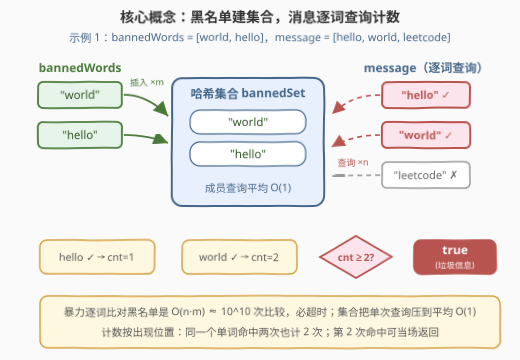
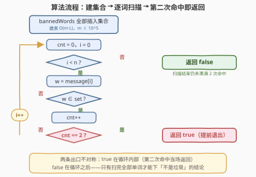
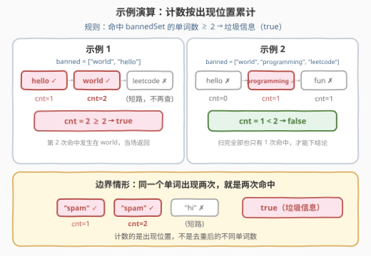

# 举报垃圾信息

- **题目名称**：举报垃圾信息
- **链接**：[3295. 举报垃圾信息](https://leetcode.cn/problems/report-spam-message/)
- **难度**：中等
- **标签**：数组，哈希表，字符串

## 1. 题目概述

给你一个字符串数组 `message` 和一个字符串数组 `bannedWords`。如果 `message` 中**至少有两个单词**与 `bannedWords` 中的某个单词**完全相同**，则认为这条消息是**垃圾信息**，返回 `true`；否则返回 `false`。

**示例 1**：

```text
输入：message = ["hello","world","leetcode"], bannedWords = ["world","hello"]
输出：true
解释：message 中的 "hello" 和 "world" 都出现在 bannedWords 中。
```

**示例 2**：

```text
输入：message = ["hello","programming","fun"], bannedWords = ["world","programming","leetcode"]
输出：false
解释：message 中只有 "programming" 一个单词出现在 bannedWords 中。
```

**约束条件**：

- `1 <= message.length, bannedWords.length <= 10^5`
- `1 <= message[i].length, bannedWords[i].length <= 15`
- `message[i]` 和 `bannedWords[i]` 都只由小写英文字母组成

> 💡 读题关键：① 阈值是 **2** 个，不是 3 个——示例 1 恰好两个命中就返回 `true`；② 计数对象是**数组里的单词（出现位置）**，不是去重后的不同单词——同一个词出现两次就是两次命中；③ 「完全相同」是整词精确匹配，不存在子串、前缀之类的模糊关系；④ 双方规模都到 $10^5$，任何「逐词线性扫黑名单」的做法在复杂度上都不可行。

---

## 2. 解题思路

### 2.1 暴力思路：逐词线性扫描黑名单

最直白的写法是二重循环：对 `message` 的每个单词，从头到尾扫一遍 `bannedWords`，找到相等的就计一次命中：

```python
hits = 0
for w in message:
    for b in bannedWords:
        if w == b:
            hits += 1
            break
return hits >= 2
```

正确性没有问题，但复杂度是 $O(n \cdot m \cdot L)$（$n, m$ 为两数组长度，$L \le 15$ 为单词长度）：$10^5 \times 10^5$ 次字符串比较约 $10^{10}$ 量级，必然超时。问题出在**同一份黑名单被重复扫了 $n$ 遍**——黑名单是静态的、查询是重复的，这正是哈希的主场。

折中一点，可以把 `bannedWords` 排序后对每个单词二分查找，降到 $O((n + m) \log m \cdot L) \approx 2.5 \times 10^7$，能过但既多付一次排序、单次查询又带着 $\log$ 因子——还有一条更直的路。

### 2.2 核心观察：成员查询是哈希集合的招牌场景



**观察 1（操作高度单一）**：整道题唯一反复执行的操作是「这个单词在不在黑名单里」——$n$ 次**成员查询**，仅此而已。不需要下标、不需要顺序、也不需要统计黑名单里每个词出现几次，哈希集合恰好就是这个抽象的最小实现。

**观察 2（计数语义与短路时机）**：命中数按 `message` 中的**出现位置**累计，阈值是 2。于是第 2 次命中的**瞬间**就能定罪、当场返回——只有命中不足 2 次（或命中都挤在末尾）时才需要扫完整个数组。

**观察 3（键的代价可控）**：键是小写字母串、长度 $\le 15$，单次哈希与相等比较是 $O(L)$ 的小常数；黑名单总字符数 $\le 1.5 \times 10^6$，内存毫无压力。

### 2.3 算法流程图



主循环是一条单链：取词 → 查集合 → 命中则 `cnt++` → `cnt` 到 2 即返回 `true`；未命中或未凑满 2 次都走 `i++` 回到循环判断。两条出口不对称得很有信息量：`true` 出口在循环**内部**（提前退出），`false` 出口在循环**之后**（扫完才能下结论）。

### 2.4 示例演算



以示例 2（`banned = ["world","programming","leetcode"]`）走表：

| $i$ | $w$ | $w \in$ bannedSet？ | `cnt` | 动作 |
|-----|-----|--------------------|-------|------|
| 0 | `hello` | 否 | 0 | 继续 |
| 1 | `programming` | 是 ✓ | 1 | 未到 2，继续 |
| 2 | `fun` | 否 | 1 | 继续 |
| — | 扫描结束 | — | 1 | $1 < 2$，返回 `false` |

对照示例 1：`hello`、`world` 接连命中，`cnt` 在第 2 步就到 2，`leetcode` 根本无需查询——这就是短路的价值。

---

## 3. 参考代码

### C++（哈希集合 + 第二次命中提前退出）

```cpp
class Solution {
  public:
    bool reportSpam(vector<string>& message, vector<string>& bannedWords) {
        unordered_set<string> banned(bannedWords.begin(), bannedWords.end());
        int cnt = 0;
        for (const string& w : message) {
            if (banned.count(w) && ++cnt == 2) {
                return true;                    // 第二次命中，当场定罪
            }
        }
        return false;                           // 扫完仍未凑满 2 次
    }
};
```

### Python（哈希集合）

```python
class Solution:
    def reportSpam(self, message: List[str], bannedWords: List[str]) -> bool:
        banned = set(bannedWords)
        cnt = 0
        for w in message:
            if w in banned:
                cnt += 1
                if cnt == 2:                    # 第二次命中，当场定罪
                    return True
        return False                            # 扫完仍未凑满 2 次
```

> 💡 Python 也可以一行 `sum(w in banned for w in message) >= 2`，语义同样正确，但失去了提前退出；命中全挤在末尾的极端用例下会白扫很多词。循环版是更稳的默认选择。

---

## 4. 复杂度分析

| 维度 | 复杂度 | 说明 |
|------|--------|------|
| 时间复杂度 | $O((n + m) \cdot L)$ | 建表 $m$ 次插入 + 扫描 $n$ 次查询，单次哈希与比较 $O(L)$；$L \le 15$ 视作常数即 $O(n + m)$。要精确判等就得读完每个字符，线性已是下界 |
| 空间复杂度 | $O(m \cdot L)$ | 哈希集合存下整个黑名单，总字符 $\le 1.5 \times 10^6$；这是用空间换时间的标准交易——精确判定要求黑名单完整在场（近似方案见第 5 节） |

> 💡 提前退出改变的是**常数**而非最坏复杂度：最好情况前两个词就命中收工，最坏情况仍要扫完 `message` 全部 $n$ 个词。

---

## 5. 扩展：从阈值 2 到真实反垃圾系统

### 5.1 阈值泛化：k 次命中

把「至少 2 个」换成「至少 $k$ 个」，只是把 `== 2` 改成 `== k`；换成「占比至少 $p$」则需要先知道总数 $n$、维护分子扫到底（或命中数提前超过 $p \cdot n$ 时短路）。模板不变，变的是退出条件的写法——面试中主动做这一层泛化，能展示对「计数 + 阈值」骨架的抽象能力。

### 5.2 海量黑名单：布隆过滤器

真实反垃圾场景往往是：黑名单**千万级**且持续更新、消息**流式**到达、内存与延迟都敏感。把黑名单完整存进哈希集合可能装不下，此时的经典方案是**布隆过滤器**：一个位数组 + $k$ 个哈希函数，插入时把 $k$ 个位置置 1，查询时检查这 $k$ 个位置是否全为 1。它只会**假阳性**（不在黑名单被误判为在）而不会假阴性，空间比存原串小一个数量级——「宁可错杀」在垃圾过滤里通常可接受，误杀率可通过位数组大小与哈希个数调节。本题规模小、要求精确判定，精确哈希集合才是正解；但在系统设计追问「黑名单有一亿条怎么办」时，布隆过滤器是标准答案的第一块积石。

### 5.3 C++ 工程细节：reserve 与哈希攻击

- 大规模建表前先 `reserve(m)` 预留桶数，避免中途 rehash 触发整表搬迁；
- 标准库 `std::hash<string>` 是确定性哈希，理论上存在被构造数据卡成 $O(n^2)$ 的冲突攻击。本题键全为小写字母且长度 $\le 15$，实际风险可忽略；对外服务中可换带随机种子的自定义哈希保平安；
- 若接口允许 `string_view`（或需避免字符串拷贝），可以 `unordered_set<string_view>` 以视图为键，零拷贝建表。

---

## 6. 面试要点

1. **为什么逐词线性扫黑名单不行？**

   - 双方规模都是 $10^5$，线性扫是 $O(n \cdot m)$ 次比较 $\approx 10^{10}$，必然超时。本质是**同一份静态黑名单被重复扫描**——预构建成哈希集合后，$n$ 次查询每次平均 $O(1)$，总量降到线性。

2. **「至少两个」是怎么数的？同一个单词出现两次算两次吗？**

   - 按 `message` 中的**出现位置**计数：`message = ["spam","spam"]`、`bannedWords = ["spam"]` 时 `cnt = 2`，返回 `true`。题目问的是数组中至少存在两个单词（元素）与黑名单相同，不是「两个**不同**的单词」。若面试官改口径为「两个不同单词」，把命中词再收进一个集合、判断其大小是否 $\ge 2$ 即可。

3. **哈希集合的最坏情况如何？有什么保底方案？**

   - 平均 $O(1)$、最坏（哈希冲突被构造）退化为线性。保底：改用 `std::set`（红黑树，$O(\log m)$ 查询），或把两个数组都排序后用归并式双指针数命中，$O((n + m) \log(n + m))$，不依赖哈希、稳定可预期。

4. **字符串做键，单次查询真的是 $O(1)$ 吗？**

   - 严格说是 $O(L)$：计算哈希要扫过整个串，冲突时还要逐字符比较（`std::string` 的相等比较先比长度再比内容，长度不同直接排除——天然的一层剪枝）。本题 $L \le 15$ 是安全的小常数，总复杂度写 $O((n + m) \cdot L)$ 更严谨。

5. **空间上还能更省吗？**

   - 精确判定要求黑名单完整在场，$O(m \cdot L)$ 免不了；想更省就得放弃精确——布隆过滤器用位数组换内存，容忍假阳性。另外注意不要把 `message` 也建集合：只需单遍扫描计数，那是 $O(n \cdot L)$ 的无谓开销。

---

## 7. 同类练习题

- [771. 宝石与石头](https://leetcode.cn/problems/jewels-and-stones/)：同一「建集合 + 成员查询计数」模板的最小形态，逐字符数命中
- [217. 存在重复元素](https://leetcode.cn/problems/contains-duplicate/)：用集合判「命中数 ≥ 1」的存在性版本
- [349. 两个数组的交集](https://leetcode.cn/problems/intersection-of-two-arrays/)：两个数组做集合运算（交集 + 去重），本题的双向版
- [705. 设计哈希集合](https://leetcode.cn/problems/design-hashset/)：亲手实现本题依赖的数据结构，理解平均 O(1) 查询从何而来
- [139. 单词拆分](https://leetcode.cn/problems/word-break/)：把词典建成集合做 O(1) 单词查询，再叠加 DP 的进阶组合
