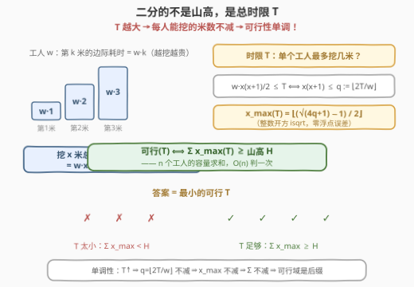
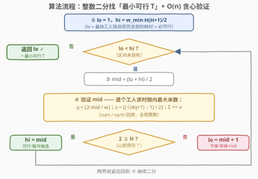
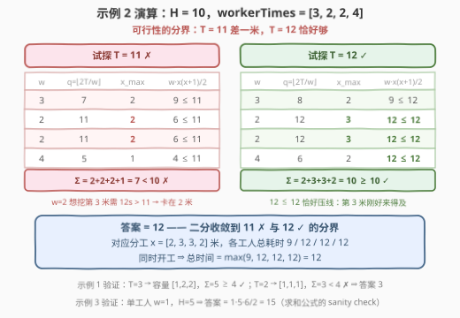
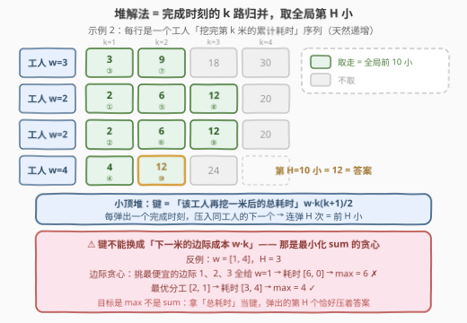

# 移山所需的最少秒数

- **题目名称**：移山所需的最少秒数
- **链接**：[3296. 移山所需的最少秒数](https://leetcode.cn/problems/minimum-number-of-seconds-to-make-mountain-height-zero/)
- **难度**：中等
- **标签**：贪心、数组、数学、二分查找、堆（优先队列）

## 1. 题目概述

给你一个整数 `mountainHeight` 表示山的高度，以及一个整数数组 `workerTimes`，`workerTimes[i]` 是工人 $i$ 的工作时间（秒）。工人们需要**同时**工作以降低山的高度。对于工人 $i$：

- 把山的高度降低 1，需要 `workerTimes[i]` × 1 秒；
- 把山的高度降低 2，需要 `workerTimes[i]` × 1 + `workerTimes[i]` × 2 秒；
- ……
- 把山的高度降低 $x$，需要 `workerTimes[i]` × 1 + … + `workerTimes[i]` × $x$ 秒。

工人 $i$ 的总耗时是他挖掉的所有单位耗时之和；由于所有人**同时开工**，整体耗时取所有工人耗时的 **最大值**。求把山的高度降到 0 所需的最少秒数。

**示例 1**：

```text
输入：mountainHeight = 4, workerTimes = [2,1,1]
输出：3
解释：工人 0 挖 1 米花 2 秒；工人 1 挖 2 米花 1+2=3 秒；工人 2 挖 1 米花 1 秒。
      同时开工 → max(2, 3, 1) = 3。
```

**示例 2**：

```text
输入：mountainHeight = 10, workerTimes = [3,2,2,4]
输出：12
解释：分工 [2,3,3,2]：耗时分别为 9、12、12、12 → max = 12。
```

**示例 3**：

```text
输入：mountainHeight = 5, workerTimes = [1]
输出：15
解释：只有一个工人：1+2+3+4+5 = 15。
```

**约束**：$1 \le \text{mountainHeight} \le 10^5$；$1 \le \text{workerTimes.length} \le 10^4$；$1 \le \text{workerTimes[i]} \le 10^6$。

> 💡 **审题关键**：
> ① 第 $k$ 米的**边际耗时**是 $w \cdot k$（越挖越贵），挖 $x$ 米的总耗时是等差数列求和 $w \cdot \frac{x(x+1)}{2}$——**不是** $w \cdot x^2$，也别把「降到 $x$」的耗时 $w \cdot x$ 当成总耗时；
> ② 同时开工 ⇒ 答案是各工人总耗时的 $\max$，**不是** 总和；
> ③ 规模相乘巨大：$H \le 10^5$、$w \le 10^6$ ⇒ 答案上界约 $5 \times 10^{15}$，超 32 位 int 四个数量级——**必须 64 位整数**，更不能逐秒模拟；
> ④ 给定一个时限 $T$，每个工人**独立**可算出最多挖几米 ⇒ 验证 $T$ 是否够用只需 $O(n)$。

## 2. 解题思路

### 2.1 暴力思路：枚举分工 / 逐秒试探

最直接的暴力是把 $H$ 米在 $n$ 个工人之间**枚举所有划分**（隔板法共 $\binom{H+n-1}{n-1}$ 种），对每种分工算 $\max$ 取最小——$H = 10^5$、$n = 10^4$ 时是天文数字。退一步的「逐秒试探」：从 $T = 1$ 起每秒问一遍「$T$ 秒够不够挖完」，但答案可达 $5 \times 10^{15}$，线性扫同样不可行。

不过「逐秒试探」暴露了本题的关键性质：**$T$ 越大，每个工人能挖的米数只多不少，总和只多不少**——「够用」这个谓词一旦为真就永远为真。可行域是 $[\text{ans}, +\infty)$ 的一段**后缀**。对单调谓词找「最左的 true」，正是**二分答案**的招牌场景。

### 2.2 核心观察：二分总时限 T，O(n) 贪心验证



**观察 1（单人总耗时 = 等差数列求和）**：设工人速度为 $w$，第 $k$ 米的边际耗时是 $w \cdot k$，挖 $x$ 米的总耗时为

$$w \cdot (1 + 2 + \dots + x) = w \cdot \frac{x(x+1)}{2}$$

**观察 2（时限 $T$ 内的单人容量，整数精确解）**：求最大的 $x$ 满足 $w \cdot \frac{x(x+1)}{2} \le T$。推导全程可以用整数运算：

$$x(x+1) \le \frac{2T}{w} \iff x(x+1) \le q := \left\lfloor \frac{2T}{w} \right\rfloor \iff (2x+1)^2 \le 4q+1 \iff x \le \frac{\sqrt{4q+1}-1}{2}$$

（第一个 $\iff$ 用到「整数 $m \le$ 实数 $r \iff m \le \lfloor r \rfloor$」。）于是

$$x_{\max}(T) = \left\lfloor \frac{\mathrm{isqrt}(4q+1) - 1}{2} \right\rfloor, \quad q = \left\lfloor \frac{2T}{w} \right\rfloor$$

用**整数开方**（Python 的 `math.isqrt`，C++ 的 `sqrtl` + 上下回修）零浮点误差。⚠️ 直接写 $(\sqrt{8T/w+1}-1)/2$ 而不加校验，`double` 只有 52 位尾数，在 $10^{15}$ 量级会出 1 的偏差。

**观察 3（可行性与二分）**：$T$ 可行 $\iff \sum_i x_{\max}^{(i)}(T) \ge H$。$T$ 增大 ⇒ $q$ 不减 ⇒ $x_{\max}$ 不减 ⇒ 总和不减，**单调成立**，二分找最小可行 $T$。

**观察 4（上下界与 64 位）**：上界取「最快的工人独自挖完全部」$hi = w_{\min} \cdot \frac{H(H+1)}{2} \approx 5 \times 10^{15}$（一定可行，保证二分右端落在可行域内）；下界 $lo = 1$。中间量：$q \le 2T \approx 10^{16}$，$4q+1 \approx 4 \times 10^{16}$，$\sum x_{\max} \le 10^4 \times 10^8 = 10^{12}$——全部安全落在 `long long`（$< 9.2 \times 10^{18}$）内，但全部**超出 32 位 int**。

### 2.3 算法流程图



### 2.4 示例演算



以示例 2（$H = 10$，$w = [3, 2, 2, 4]$）为例，验证两个相邻的 $T$：

| $T$ | 工人 $w$ | $q = \lfloor 2T/w \rfloor$ | $x_{\max}$ | 校验 $w \cdot \frac{x(x+1)}{2}$ |
|-----|---------|------------------------------|-----------|----------------------------------|
| 11 | 3 | 7 | 2 | $9 \le 11$ ✓ |
| 11 | 2 | 11 | 2 | 想挖第 3 米需 $12 > 11$，卡在 2 米 |
| 11 | 2 | 11 | 2 | 同上 |
| 11 | 4 | 5 | 1 | 想挖第 2 米需 $12 > 11$，卡在 1 米 |

$\sum x_{\max} = 2+2+2+1 = 7 < 10$ ⇒ **11 不可行**。

| $T$ | 工人 $w$ | $q = \lfloor 2T/w \rfloor$ | $x_{\max}$ | 校验 $w \cdot \frac{x(x+1)}{2}$ |
|-----|---------|------------------------------|-----------|----------------------------------|
| 12 | 3 | 8 | 2 | $9 \le 12$ ✓ |
| 12 | 2 | 12 | 3 | $12 \le 12$ ✓（恰好压线） |
| 12 | 2 | 12 | 3 | $12 \le 12$ ✓ |
| 12 | 4 | 6 | 2 | $12 \le 12$ ✓ |

$\sum x_{\max} = 2+3+3+2 = 10 \ge 10$ ⇒ **12 可行**。11 ✗ / 12 ✓ ⇒ 答案为 **12**，对应分工 $x = [2, 3, 3, 2]$，各工人耗时 $9 / 12 / 12 / 12$，$\max = 12$。

## 3. 参考代码

### C++（二分答案）

```cpp
class Solution {
  public:
    long long minNumberOfSeconds(int mountainHeight, vector<int>& workerTimes) {
        long long H = mountainHeight;
        long long wMin = *min_element(workerTimes.begin(), workerTimes.end());
        long long lo = 1, hi = wMin * H * (H + 1) / 2;   // 最快工人独自包干 ⇒ hi 必可行
        while (lo < hi) {
            long long mid = lo + (hi - lo) / 2;
            if (canFinish(mid, mountainHeight, workerTimes)) hi = mid;
            else lo = mid + 1;
        }
        return lo;
    }

  private:
    bool canFinish(long long T, int H, const vector<int>& ws) {
        long long total = 0;
        for (int w : ws) {
            long long q = 2 * T / w;                      // x(x+1) <= q
            long long r = sqrtl(4.0L * q + 1);            // 粗开方
            while (r * r > 4 * q + 1) r--;                // 浮点回修（向下）
            while ((r + 1) * (r + 1) <= 4 * q + 1) r++;   // 浮点回修（向上）
            total += (r - 1) / 2;                         // x_max
        }
        return total >= H;
    }
};
```

> 💡 **写法要点**：
> - `sqrtl` 返回 `long double`，截断赋给 `long long` 后用两个 `while` 把 $r = \lfloor\sqrt{4q+1}\rfloor$ 修准——这是竞赛里防浮点误差的标准姿势；$r \le 2 \times 10^8$，`r * r` 不溢出；
> - `2 * T / w` 与 $4q+1$ 都在 `long long` 范围内（见观察 4），但**任何一个写成 `int` 都会爆**；
> - 也可以完全不写 `sqrtl`：内层对 $x$ 再二分（$[0, 2 \times 10^8]$），复杂度多乘一个 $\log$，量级不变。

### Python（二分答案，math.isqrt）

```python
import math


class Solution:
    def minNumberOfSeconds(self, mountainHeight: int, workerTimes: List[int]) -> int:
        def can_finish(T: int) -> bool:
            total = 0
            for w in workerTimes:
                q = 2 * T // w                        # x(x+1) <= q
                total += (math.isqrt(4 * q + 1) - 1) // 2   # x_max，精确整数解
            return total >= mountainHeight

        w_min = min(workerTimes)
        lo, hi = 1, w_min * mountainHeight * (mountainHeight + 1) // 2
        while lo < hi:
            mid = (lo + hi) // 2
            if can_finish(mid):
                hi = mid
            else:
                lo = mid + 1
        return lo
```

> 💡 **写法要点**：
> - `math.isqrt` 是**精确**整数平方根，$(r-1)//2$ 即 $x_{\max}$，全程无浮点；
> - 二分轮数 $\approx \log_2(5 \times 10^{15}) \approx 53$，每轮 $O(n) = 10^4$，总计 $5 \times 10^5$ 次整数运算，Python 轻松通过；
> - 若想再抠常数：`workerTimes` 值域只有 $10^6$，可先按 $w$ 去重计数，把内层循环从「每个工人」缩成「每种速度」。

## 4. 复杂度分析

设 $H$ 为山高，$n$ 为工人数，$w_{\min}$ 为最小的工人耗时（即最快的工人）。

| 维度 | 复杂度 | 说明 |
|------|--------|------|
| **时间（二分解法）** | $O\!\left(n \log (w_{\min} H^2)\right)$ | 二分轮数 $\log_2 hi \approx 53$，每轮对 $n$ 个工人各做一次整数开方 |
| **时间（暴力）** | $\binom{H+n-1}{n-1}$ 或 $O(\text{ans} \cdot n)$ | 枚举分工 / 逐秒试探，均不可行 |
| **空间（二分解法）** | $O(1)$ | 只用常数个变量 |

> 堆解法（见第 5 节）为 $O((n + H) \log n)$ 时间、$O(n)$ 空间，两者量级相当；二分解法空间更省、且不依赖 $H$ 次循环。

## 5. 扩展：堆解法 —— 「完成时刻」的 k 路归并取第 H 小



把工人 $i$「挖完第 $k$ 米」看作一个事件，其**完成时刻**为 $c_{i,k} = w_i \cdot \frac{k(k+1)}{2}$——每个工人的事件序列天然严格递增。**答案恰好等于全体完成时刻中的第 $H$ 小**：

- **任何方案 ≥ 第 $H$ 小**：一种分工就是把每个工人的事件**取前缀**（挖到第 $x_i$ 米 = 用掉 $c_{i,1..x_i}$），共用了 $H$ 个完成时刻；其中最大值 ≥ 全局第 $H$ 小（鸽笼：严格小于第 $H$ 小的值至多 $H-1$ 个）；
- **取前 $H$ 小即达到第 $H$ 小**：把全局最小的 $H$ 个完成时刻选出来（对每个工人仍是前缀，因为他的序列递增），最大值就是第 $H$ 小本身——这是一份可行分工。

于是用**小顶堆做 k 路归并**：堆里每个工人存「再挖一米后的总耗时」，弹出最小的、压入该工人的下一个，弹 $H$ 次即为答案。

```python
import heapq


class Solution:
    def minNumberOfSeconds(self, mountainHeight: int, workerTimes: List[int]) -> int:
        heap = [(w, w, 1) for w in workerTimes]      # (完成第 k 米的总耗时, w, k)
        heapq.heapify(heap)
        ans = 0
        for _ in range(mountainHeight):
            total, w, k = heapq.heappop(heap)
            ans = max(ans, total)
            k += 1
            heapq.heappush(heap, (w * k * (k + 1) // 2, w, k))
        return ans
```

> ⚠️ **高频错误**：把堆的键写成「下一米的**边际成本** $w \cdot k$」。那是「最小化总耗时**之和**」的贪心——每次都把下一米塞给边际最便宜的工人，会得到 $\sum$ 最优而非 $\max$ 最优的分工。反例：$w = [1, 4]$，$H = 3$：边际贪心挑走最便宜的边际 $1, 2, 3$（全给 $w=1$），耗时 $[6, 0]$，$\max = 6$；而最优分工 $[2, 1]$ 耗时 $[3, 4]$，$\max = 4$。**键必须是「该工人接下这一米后的总耗时」**——它正是下一个完成时刻，弹出序列才是归并序。

顺带一提，本题官方标签里的「贪心」正落在此处：二分解法中「每人各自挖到上限」是一次贪心验证；堆解法则是「每一米都分给接下后总耗时最小的工人」的在线贪心，两种视角殊途同归。

## 6. 面试要点

1. **为什么可以二分答案？单调性体现在哪？**

   固定 $T$ 时每个工人的容量 $x_{\max}(T)$ 独立可算且随 $T$ 不减（$q = \lfloor 2T/w \rfloor$ 不减 ⇒ 解出的 $x$ 不减），于是 $\sum x_{\max}$ 不减——「$\sum \ge H$」一旦为真永远为真，可行域是后缀。对单调 01 谓词找最左 true，正是二分答案的标准形态。

2. **单人容量公式怎么推的？如何规避浮点误差？**

   $w \cdot \frac{x(x+1)}{2} \le T \iff x(x+1) \le q := \lfloor 2T/w \rfloor \iff (2x+1)^2 \le 4q+1$，故 $x_{\max} = \lfloor (\mathrm{isqrt}(4q+1)-1)/2 \rfloor$。全程整数：Python 用 `math.isqrt`；C++ 用 `sqrtl` 后上下回修。不校验的 `sqrt` 在 $10^{15}$ 量级必出 off-by-one。

3. **二分上界为什么取 $w_{\min} \cdot H(H+1)/2$？**

   这是「最快的工人独自挖完全部山」的耗时——一定可行，保证初始 `hi` 落在可行域内；配合 `lo = 1` 构成「左端可能不可行、右端一定可行」的经典夹逼。它同时是答案的平凡上界；下界还可以收紧到 $w_{\min}$（第一米至少要这么多秒），但量级不变、不必要。

4. **堆解法为什么对？键为什么不能是边际成本？**

   答案 = 全体完成时刻 $w \cdot k(k+1)/2$ 的第 $H$ 小：任何分工取 $H$ 个（前缀）完成时刻，$\max \ge$ 第 $H$ 小；取前 $H$ 小恰好取到。堆的键「工人接下一米后的总耗时」就是下一个完成时刻；换成边际成本 $w \cdot k$ 就变成最小化 $\sum$ 的贪心，目标错了（反例 $w=[1,4], H=3$：6 vs 4）。

5. **本题哪些量会溢出 32 位？**

   `hi` ≈ $5 \times 10^{15}$、`q` ≤ $2 \cdot \text{hi}$、`4q+1` ≈ $4 \times 10^{16}$、$\sum x_{\max}$ ≤ $10^{12}$——全部远超 int（≈ $2.1 \times 10^9$），C++ 必须 `long long`；Python 无溢出问题，但 `q` 必须用 `//` 整除。

## 7. 同类练习题

- [875. 爱吃香蕉的珂珂](https://leetcode.cn/problems/koko-eating-bananas/)（[站内题解](../0801-0900/875_爱吃香蕉的珂珂.md)）：二分答案 + O(n) 验证的入门母题——本题把「速度」换成「时限」，验证从单调数组扫描换成整数开方
- [410. 分割数组的最大值](https://leetcode.cn/problems/split-array-largest-sum/)（[站内题解](../0401-0500/410_分割数组的最大值.md)）：min-max 型二分答案的经典形态，与本题「最小化最慢工人的耗时」目标一致
- [2064. 分配给商店的最多商品的最小值](https://leetcode.cn/problems/minimized-maximum-of-products-distributed-to-any-store/)（[站内题解](../2001-2100/2064_分配给商店的最多商品的最小值.md)）：把总量分给多个接收者、最小化单点最大负荷——「分米数给工人」的同构题
- [1482. 制作 m 束花所需的最少天数](https://leetcode.cn/problems/minimum-number-of-days-to-make-m-bouquets/)（[站内题解](../1401-1500/1482_制作m束花所需的最少天数.md)）：二分时间 T + 贪心验证可行性的完整框架演练
- [373. 查找和最小的 K 对数字](https://leetcode.cn/problems/find-k-pairs-with-smallest-sums/)：多路递增序列 + 小顶堆取全局前 k 小，与本文扩展节的堆视角同一套路
