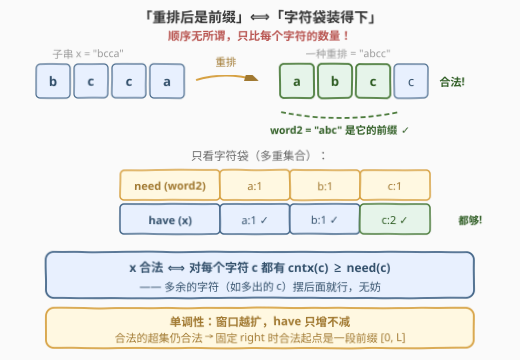
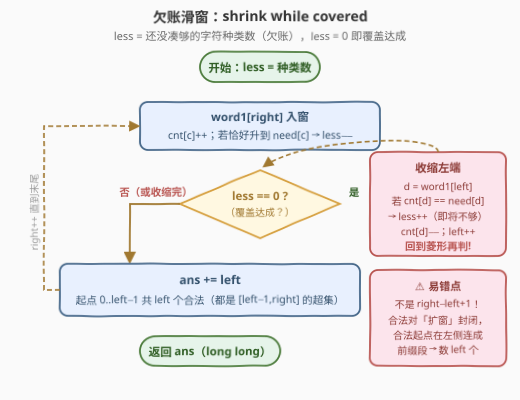
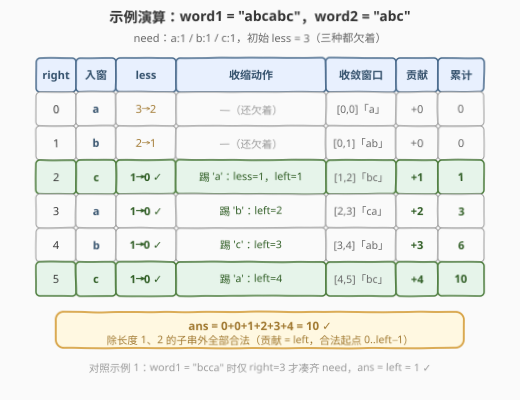

# LeetCode 统计重新排列后包含另一个字符串的子字符串数目 I 题解

- **关联**：3298（版本 II）是本题的数据加强版（$n$ 放大到 $10^6$），解法一脉相承

## 1. 题目概述

- **标题 / 题号**：统计重新排列后包含另一个字符串的子字符串数目 I（#3297，medium）
- **链接**：https://leetcode.cn/problems/count-substrings-that-can-be-rearranged-to-contain-a-string-i/
- **难度**：中等
- **标签**：哈希表、字符串、滑动窗口

**题意**：给你两个字符串 `word1` 和 `word2`。

如果一个字符串 `x` **重新排列后**，`word2` 是重排字符串的**前缀**，那么我们称字符串 `x` 是**合法的**。

请你返回 `word1` 中**合法子字符串**（连续子串）的数目。

**示例 1**：

```text
输入：word1 = "bcca", word2 = "abc"
输出：1
解释：唯一合法的子字符串是 "bcca"，可以重新排列得到 "abcc"，
     "abc" 是它的前缀。
```

**示例 2**：

```text
输入：word1 = "abcabc", word2 = "abc"
输出：10
解释：除了长度为 1 和 2 的所有子字符串都是合法的。
```

**示例 3**：

```text
输入：word1 = "abcabc", word2 = "aaabc"
输出：0
解释：word1 只有 2 个 'a'，凑不齐 word2 需要的 3 个，没有合法子串。
```

**约束**：

- $1 \le \text{word1.length} \le 10^5$
- $1 \le \text{word2.length} \le 10^4$
- `word1` 和 `word2` 都只包含小写英文字母

> 💡 **读题关键**：① 「重排后是前缀」彻底**抹掉了顺序信息**——既然可以任意重排，合法与否只取决于 `x` 的**字符多重集合**是否装得下 `word2` 的字符多重集合（见 2.2 的等价转化）；② 子串是连续区间 $[i,\ j]$，而「字符袋装得下」随窗口扩大**单调不变坏**，天然适配滑窗；③ 答案上界 $\frac{n(n+1)}{2} \approx 5 \times 10^9$，**超出 `int32`**，必须用 64 位整数；④ 姊妹题 [3298. II 版](https://leetcode.cn/problems/count-substrings-that-can-be-rearranged-to-contain-a-string-ii/)把 $n$ 放大到 $10^6$ 并要求线性解法——本文的 $O(n + m)$ 滑窗天然满足，一份数据两份用。

## 2. 解题思路

### 2.1 暴力思路：枚举所有子串 + 计数判定

双重循环枚举子串右端 $j$、起点 $i$，向左延伸时**增量**维护 26 维计数 `cnt`，每步检查是否 $\forall c:\ \text{cnt}[c] \ge \text{need}[c]$。朴素判定每次扫 26 个字母是 $O(26\,n^2)$；即使把判定也增量成「欠账种类数」，整体仍是 $O(n^2)$——$n = 10^5$ 时约 $10^{10}$ 次操作，直接超时。

瓶颈的根源是**判定信息的浪费**：固定右端点 $j$ 时，「合法起点」其实是一段**连续前缀** $[0,\ L]$（起点越靠左窗口越长、字符只多不少，合法对扩窗封闭），暴力却把这段区间里的起点一个个重新判定了一遍——每个注定合法的起点都在白白重算。

### 2.2 核心观察：重排前缀 ⟺ 字符袋包含



**第一步：等价转化**。设 $\text{need}(c)$ 为 `word2` 中字符 $c$ 的出现次数，$\text{cnt}_x(c)$ 为子串 $x$ 中的出现次数，则：

$$x\ \text{合法} \iff \forall c:\ \text{cnt}_x(c) \ge \text{need}(c)$$

两个方向都直观：

- **必要性**：若 $x$ 的某个重排 $y$ 以 `word2` 为前缀，则 $y$ 的前 $|\text{word2}|$ 个字符恰是 `word2` 本身，这 $|\text{word2}|$ 个字符全部来自 $x$ 的字符袋——袋子里至少得有这么多；
- **充分性**：若每个字符都够数，就按 `word2` 的原顺序把这些字符摆在重排结果的最前面，剩余字符随意排在后面——得到的重排恰好以 `word2` 为前缀。

**第二步：单调性**。$\text{cnt}_{[i,\ j]}(c)$ 随窗口扩大**单调不减**，因此：

- 若 $[i,\ j]$ 合法，则它的任何**超集** $[i',\ j'] \supseteq [i,\ j]$ 仍然合法——**合法对扩窗封闭**；
- 等价地，不合法窗口的任何**子集**仍不合法——不合法对缩窗向下封闭。

**第三步：按右端点计数**。固定右端点 $right$，由扩窗封闭性，合法起点构成一段**连续前缀** $[0,\ L]$：起点 $\le L$ 的全合法、起点 $> L$ 的全不合法。用滑窗维护这个阈值——$right$ 右移入窗，若覆盖达成（`less == 0`）就收缩 `left` 直到**恰好不满足**，此时 $[left - 1,\ right]$ 是最短合法窗口，起点 $0 \sim left - 1$ 共 $left$ 个子串全部合法：

$$ans = \sum_{right=0}^{n-1} \text{left}(right)$$

> 💡 **方向对照**：[3258. 统计满足 K 约束的子字符串数量 I](../3201-3300/3258_统计满足K约束的子字符串数量I.md) 和 [713. 乘积小于 K 的子数组](../0701-0800/713_乘积小于K的子数组.md) 是「**坏**对扩窗封闭」，合法起点连成**后缀段** $[L,\ right]$，计数 `right − left + 1`；本题是「**好**对扩窗封闭」，合法起点连成**前缀段** $[0,\ L]$，计数 `left`。骨架同款，方向相反——判断依据就一条：**约束会不会随着窗口变大而变难满足**。本题变容易（字符越攒越多），那两题变难（元素越攒越超限）。

### 2.3 算法流程图



骨架是 [76. 最小覆盖子串](../0001-0100/76_最小覆盖子串.md) 的「欠账滑窗」：`less` 维护**还没凑够的字符种类数**，入窗 / 出窗只在计数**恰好跨越** $\text{need}$ 阈值的那一刻更新 `less`——这样判定「覆盖是否达成」是 $O(1)$，不必每步扫 26 个字母。与 76 的区别只在产出：76 在覆盖达成时记录**最短窗口长度**，本题在收缩结束后**累加 `left` 计数**。最容易写错的点已用红笔标出：贡献是 `ans += left`，**不是** `right − left + 1`。

### 2.4 示例演算



以 `word1 = "abcabc"`、`word2 = "abc"`（`need`：a:1 / b:1 / c:1，初始 `less = 3`）走一遍：

| $right$ | 入窗 | less | 收缩动作 | 收敛窗口 | 贡献 $+\text{left}$ | 累计 |
|---------|------|------|----------|----------|--------------------|------|
| 0 | `a` | 3→2 | — | $[0,0]$「a」 | +0 | 0 |
| 1 | `b` | 2→1 | — | $[0,1]$「ab」 | +0 | 0 |
| 2 | `c` | 1→0 ✓ | 踢 `a`：less=1，left=1 | $[1,2]$「bc」 | +1 | 1 |
| 3 | `a` | 1→0 ✓ | 踢 `b`：left=2 | $[2,3]$「ca」 | +2 | 3 |
| 4 | `b` | 1→0 ✓ | 踢 `c`：left=3 | $[3,4]$「ab」 | +3 | 6 |
| 5 | `c` | 1→0 ✓ | 踢 `a`：left=4 | $[4,5]$「bc」 | +4 | 10 |

结果 $10$ ✓。$right = 2$ 首次覆盖后，每个新字符入窗都能重新凑齐，`left` 随之被推着右移——**最短合法窗口**像一条贪吃蛇在串上爬行，每次推进一格，新「解放」出来的起点数恰好是 `left` 的增量。对照总数验证：全部子串 $\frac{6 \times 7}{2} = 21$ 个，不合法的正是长度 1、2 的全部 $6 + 5 = 11$ 个，$21 - 11 = 10$ ✓。示例 1（`"bcca"`）中直到 $right = 3$ 才凑齐 `need`，收缩后 `left = 1`，$ans = 1$ ✓；示例 3（`"aaabc"`）需要 3 个 `a` 而 `word1` 只有 2 个，`less` 永不归零，`left` 恒为 0，$ans = 0$ ✓——**不合法情形零特判，滑窗自然给出 0**。

## 3. 参考代码

### C++

```cpp
class Solution {
  public:
    long long validSubstringCount(string word1, string word2) {
        int need[26] = {};
        for (char c : word2) need[c - 'a']++;
        int less = 0;                          // 还没凑够的字符种类数（欠账）
        for (int c = 0; c < 26; ++c)
            if (need[c] > 0) ++less;
        int cnt[26] = {}, left = 0;
        long long ans = 0;
        for (int right = 0; right < (int)word1.size(); ++right) {
            int c = word1[right] - 'a';
            if (need[c] > 0 && cnt[c] == need[c] - 1) --less;  // 恰好凑够一种
            ++cnt[c];
            while (less == 0) {                // 覆盖达成 → 收缩到恰好不满足
                int d = word1[left++] - 'a';
                if (need[d] > 0 && cnt[d] == need[d]) ++less;  // 即将不够
                --cnt[d];
            }
            ans += left;                       // 起点 0..left-1 共 left 个合法
        }
        return ans;
    }
};
```

### Python

```python
class Solution:
    def validSubstringCount(self, word1: str, word2: str) -> int:
        need = [0] * 26
        for c in word2:
            need[ord(c) - 97] += 1
        less = sum(1 for x in need if x > 0)    # 还没凑够的字符种类数（欠账）
        cnt = [0] * 26
        ans = left = 0
        for ch in word1:
            c = ord(ch) - 97
            if need[c] and cnt[c] == need[c] - 1:
                less -= 1                       # 恰好凑够一种
            cnt[c] += 1
            while less == 0:                    # 覆盖达成 → 收缩到恰好不满足
                d = ord(word1[left]) - 97
                left += 1
                if need[d] and cnt[d] == need[d]:
                    less += 1                   # 即将不够
                cnt[d] -= 1
            ans += left                         # 起点 0..left-1 共 left 个合法
        return ans
```

> 💡 **实现细节**：① `less` 只统计 $\text{need}[c] > 0$ 的种类，入窗时在 $\text{cnt}[c]$ **恰好升到** $\text{need}[c]-1$ 的瞬间减一，出窗时在 $\text{cnt}[d]$ **恰好等于** $\text{need}[d]$ 的瞬间（还没减）加一——只在「跨界时刻」动账本，判定保持 $O(1)$；② `while (less == 0)` 收缩到**恰好不满足**才停，退出时 $[left-1,\ right]$ 是最短合法窗口，`left` 正是合法起点个数；③ `need[c] == 0` 的字符怎么进出窗都不碰 `less`，无需分类讨论；④ 返回值是 `long long`——$n = 10^5$ 时答案最大约 $5 \times 10^9$，`int` 必溢出。

## 4. 复杂度分析

| 维度 | 复杂度 | 说明 |
|------|--------|------|
| 时间复杂度 | $O(n + m + |\Sigma|)$ | `left` / `right` 各自单调右移、合计至多 $2n$ 步（摊还分析）；建 `need` 表 $O(m + |\Sigma|)$，$|\Sigma| = 26$ |
| 空间复杂度 | $O(|\Sigma|)$ | 仅 `need` / `cnt` 两个 26 长计数表与常数下标变量 |
| 暴力对照 | $O(n^2)$ | $n = 10^5$ 时约 $10^{10}$ 步不可行；本题的线性解法对 II 版（$n = 10^6$）同样直接通过 |

实测：三组官方示例分别得 $1 / 10 / 0$；另与 $O(n^2)$ 暴力对拍随机数据（$n \le 14$、字符集 `abc`、$m \le n$ 随机）3000 组全部一致。

## 5. 扩展：II 版（3298）——同一副骨架，数据放大十倍

[3298. 统计重新排列后包含另一个字符串的子字符串数目 II](https://leetcode.cn/problems/count-substrings-that-can-be-rearranged-to-contain-a-string-ii/) 把 `word1` 放大到 $10^6$、`word2` 放大到 $10^4$，并明说「必须实现线性复杂度」——**本文的滑窗本身就是 $O(n + m)$，代码原样提交即可通过**，这正是先做 I 版的最大红利。

官方 hints 给的是另一条路线，也值得了解：

1. **前缀频数**：预处理 $\text{pre}[i][c]$ = 前 $i$ 个字符中 $c$ 的出现次数（26 维前缀和，$O(26n)$ 空间）；
2. **固定左端点二分**：左端点固定为 $l$ 时，频数关于右端点 $r$ 单调不减，「覆盖」是关于 $r$ 的单调布尔谓词，二分出最小合法右端点 $r_{\min}$，则合法右端点是后缀段 $[r_{\min},\ n-1]$，贡献 $n - r_{\min}$；
3. **复杂度**：$O(26\,n \log n)$，比滑窗多一个 $\log$，但思路只依赖「前缀和 + 单调性二分」两个更基础的积木。

> 💡 **选题视角**：LeetCode 的 I / II 拆分套路（本题、3258/3261、3291/3292……）几乎总是「同一算法、数据范围翻倍」——先用 I 版验证 $O(n^2)$ 或小数据解法，再用 II 版逼出线性或带查询的版本。**刷 I 版时就按 II 版的数据范围选算法**，是性价比最高的打开方式。

## 6. 面试要点

1. **「重排后是前缀」怎么等价成计数条件？**

   - 关键是**扔掉顺序**：重排的自由度意味着合法性与字符排列顺序无关，只看多重集合。$x$ 合法 $\iff \forall c:\ \text{cnt}_x(c) \ge \text{need}(c)$。必要性看重排的前 $|\text{word2}|$ 位消耗的字符全来自 $x$；充分性则构造性证明——按 `word2` 原顺序把够数的字符摆最前、剩余随意摆后。顺带一提：把「前缀」换成「子串」结论不变，依然只依赖多重集合包含。

2. **为什么贡献是 `ans += left`，而不是 713 / 3258 那样的 `right − left + 1`？**

   - 两题方向的分水岭是**约束随窗口扩大的单调方向**。本题字符越攒越多、约束越来越容易满足（好对扩窗封闭），固定 $right$ 时合法起点是**前缀段** $[0,\ L]$，收缩到最短合法窗口后贡献 `left` 个；713 / 3258 的约束越攒越容易违反（坏对扩窗封闭），合法起点是**后缀段** $[L,\ right]$，贡献 `right − left + 1` 个。混用公式必然翻车——先判方向，再套模板。

3. **`less` 变量的更新时机是什么？为什么不用每步扫 26 个字母？**

   - `less` = 还没凑够的字符种类数。入窗时若 $\text{cnt}[c]$ **恰好升到** $\text{need}[c]$（代码里判 `cnt[c] == need[c]-1` 后自增）则 `less--`；出窗时若 $\text{cnt}[d]$ **还等于** $\text{need}[d]`（即将跌破）则 `less++`。每个字符的计数每次只变化 1，只可能在「恰好跨界」那一刻改变「够 / 不够」状态——在这两个瞬间动账本，其余时刻状态不变，判定始终保持 $O(1)$，整体省掉 $O(26)$ 因子。

4. **`word2` 含有 `word1` 中根本不出现的字符时，代码会怎样？**

   - 什么都不用做：这种字符的 `cnt` 恒为 0 < `need`，`less` 永不归零，`while` 循环永不进入，`left` 恒为 0，每步贡献 0，最终自然返回 0（示例 3）。滑窗模板的「无解退化为零贡献」是白送的鲁棒性——不需要任何前置特判，这也是它比二分写法（还得防二分失败）省心的地方。

5. **数据范围层面有哪些坑？**

   - ① **溢出**：$n = 10^5$ 时答案上界 $\frac{n(n+1)}{2} \approx 5 \times 10^9 > 2^{31} - 1$，C++ 必须用 `long long`（函数签名已提示），Python 无此虑但要有意识；II 版 $n = 10^6$ 时上界约 $5 \times 10^{11}$，64 位依然够用；② **线性要求**：II 版明示必须 $O(n)$，任何带 $\log$ 或常数大扫描（如每步判 26 维）的写法都要掂量——`less` 技巧正是把 $O(26n)$ 压到 $O(n)$ 的关键一步。

## 同类练习题

| # | 题目 | 与本题的关联 |
|---|------|-------------|
| 76 | [最小覆盖子串](https://leetcode.cn/problems/minimum-window-substring/)（[站内题解](../0001-0100/76_最小覆盖子串.md)） | 同款「欠账滑窗 + 恰好跨界更新」，产出从计数换成最短窗口长度，入门首选 |
| 3298 | [统计重新排列后包含另一个字符串的子字符串数目 II](https://leetcode.cn/problems/count-substrings-that-can-be-rearranged-to-contain-a-string-ii/) | 同题加强版，$n$ 到 $10^6$，本文代码原样通过；官方 hints 另给「前缀频数 + 二分」路线可对照 |
| 713 | [乘积小于 K 的子数组](https://leetcode.cn/problems/subarray-product-less-than-k/)（[站内题解](../0701-0800/713_乘积小于K的子数组.md)） | 反方向计数滑窗（`right − left + 1`），与本题的 `left` 计数互为镜像，练「先判方向再套模板」 |
| 3258 | [统计满足 K 约束的子字符串数量 I](https://leetcode.cn/problems/count-substrings-that-satisfy-k-constraint-i/)（[站内题解](../3201-3300/3258_统计满足K约束的子字符串数量I.md)） | 同为 I / II 姊妹结构的按右端点计数滑窗，且是「坏对扩窗封闭」方向的代表 |
| 30 | [串联所有单词的子串](https://leetcode.cn/problems/substring-with-concatenation-of-all-words/)（[站内题解](../0001-0100/30_串联所有单词的子串.md)） | 同样以「词频不变式」驱动滑窗，但顺序敏感（词必须连续等长对齐），对照体会有无「重排自由度」对模型的影响 |
