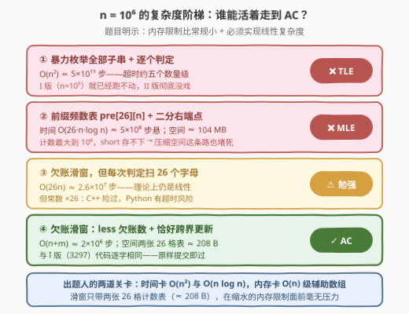
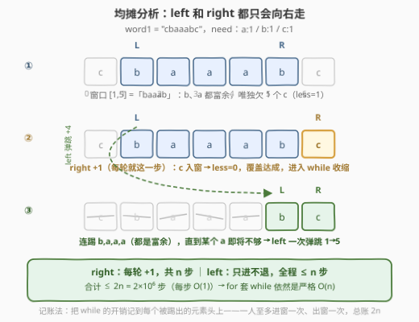
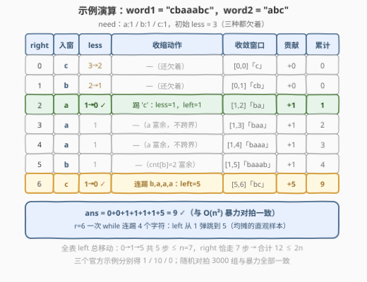

# LeetCode 统计重新排列后包含另一个字符串的子字符串数目 II 题解

- **关联**：3297（版本 I）是本题的小数据版，算法完全同款；本文侧重 II 版真正考察的两件事——**线性复杂度的证明**与**内存限制的账**

## 1. 题目概述

- **标题 / 题号**：统计重新排列后包含另一个字符串的子字符串数目 II（#3298，hard）
- **链接**：https://leetcode.cn/problems/count-substrings-that-can-be-rearranged-to-contain-a-string-ii/
- **难度**：困难
- **标签**：哈希表、字符串、滑动窗口

**题意**：给你两个字符串 `word1` 和 `word2`。

如果一个字符串 `x` **重新排列后**，`word2` 是重排字符串的**前缀**，那么我们称字符串 `x` 是**合法的**。

请你返回 `word1` 中**合法子字符串**（连续子串）的数目。

**注意**：这个问题中的内存限制比其他题目要**小**，所以你**必须**实现一个**线性复杂度**的解法。

**示例 1**：

```text
输入：word1 = "bcca", word2 = "abc"
输出：1
解释：唯一合法的子字符串是 "bcca"，可以重新排列得到 "abcc"，
     "abc" 是它的前缀。
```

**示例 2**：

```text
输入：word1 = "abcabc", word2 = "abc"
输出：10
解释：除了长度为 1 和 2 的所有子字符串都是合法的。
```

**示例 3**：

```text
输入：word1 = "abcabc", word2 = "aaabc"
输出：0
解释：word1 只有 2 个 'a'，凑不齐 word2 需要的 3 个，没有合法子串。
```

**约束**：

- $1 \le \text{word1.length} \le 10^6$
- $1 \le \text{word2.length} \le 10^4$
- `word1` 和 `word2` 都只包含小写英文字母

> 💡 **读题关键**：① 题面与 [3297. I 版](../3201-3300/3297_统计重新排列后包含另一个字符串的子字符串数目I.md)一字不差，变的只有数据范围（$n$ 从 $10^5$ 放大到 $10^6$）和那句「内存限制小 + 必须线性」——这是对解法的**双重筛选**；② $n = 10^6$ 时答案上界 $\frac{n(n+1)}{2} \approx 5 \times 10^{11}$，64 位整数刚好兜住；③ 「必须线性」不是吓唬人：$O(n^2)$ 与 $O(n \log n)$ 都在出局名单上，连 $O(26n)$ 的常数都要掂量。

## 2. 解题思路

### 2.1 暴力思路：被数据范围直接宣判

两条最常见的路都走不通：

- **枚举全部子串逐个判定**：$O(n^2) \approx 5 \times 10^{11}$ 步，超时约五个数量级——I 版（$n = 10^5$）就已经跑不动；
- **「正经」一点的优化**——预处理 26 维前缀频数表 $\text{pre}[i][c]$，固定左端点二分最小合法右端点：时间 $O(26\,n\log n) \approx 5 \times 10^8$ 步悬，空间 $26 \times 10^6 \times 4\,\text{B} \approx 104\,\text{MB}$ 在缩水的内存限制下直接 MLE；且计数最大能到 $10^6$，`short` 存不下，压缩空间这条路也堵死。



出题人设了两道关卡：**时间上**卡掉 $O(n^2)$ 与 $O(n \log n)$，**空间上**卡掉 $O(n) 级$ 辅助数组。能同时过关的只剩「滑窗 + 常数空间计数表」这一条路——官方 hints（"sliding window / constant space frequency"）也是在指这条路。

### 2.2 核心观察：合法性的折叠（承接 3297）

三个结论的完整证明见 [3297 题解](../3201-3300/3297_统计重新排列后包含另一个字符串的子字符串数目I.md)，这里只把骨架钉在墙上：

1. **等价转化**：重排的自由度彻底抹掉顺序信息，$x$ 合法 $\iff \forall c:\ \text{cnt}_x(c) \ge \text{need}(c)$——只看字符多重集合装不装得下；
2. **单调性**：窗口扩大时字符只多不少，**合法对扩窗封闭**——固定右端点 $right$，合法起点连成**前缀段** $[0,\ L]$；
3. **按右端点计数**：$ans = \sum_{right} \text{left}(right)$，滑窗维护「最短合法窗口」的左端点，收缩结束后累加 `left` 即可。

### 2.3 线性证明：for 套 while 为什么不是 $O(n^2)$

新手最犯嘀咕的点：主循环 `for right` 里嵌着 `while (less == 0)`，直觉上是两层循环。**均摊分析**一锤定音：

- `right` 从 $0$ 走到 $n-1$，恰好 $n$ 步；
- `left` **只增不减**——每个下标至多进窗一次、出窗一次，`while` 体全程执行 $\le n$ 次；
- 合计 $\le 2n$ 步，每步 $O(1)$，总计 $O(n)$。



把 `while` 的开销**记账**到每个被踢出的元素头上：一个元素进窗付一次 $O(1)$、出窗付一次 $O(1)$，一人至多两笔账——总账 $2n$。即使某一步 `left` 一次弹跳多格（见 2.4 的 $right=6$），这些格子也是之前攒下的富余，之前每步只付了 $O(1)$ 的入账，如今一并清仓，不亏。

而「每步 $O(1)$」全靠 **`less` 欠账数**：它只在 $\text{cnt}$ **恰好跨越** $\text{need}$ 阈值的瞬间更新（入窗判 $\text{cnt}[c] = \text{need}[c]-1$，出窗判 $\text{cnt}[d] = \text{need}[d]$），把「窗口是否覆盖」的判定从扫 26 个字母压成一次比较。没有它，复杂度是 $O(26n) \approx 2.6 \times 10^7$——理论上仍是线性，实际上 Python 有超时风险。26 这个常数，正是「理论线性」与「实际过题」的分界线。

### 2.4 示例演算



以 `word1 = "cbaaabc"`、`word2 = "abc"`（`need`：a:1 / b:1 / c:1，初始 `less = 3`）走一遍：

| $right$ | 入窗 | less | 收缩动作 | 收敛窗口 | 贡献 $+\text{left}$ | 累计 |
|---------|------|------|----------|----------|--------------------|------|
| 0 | `c` | 3→2 | — | $[0,0]$「c」 | +0 | 0 |
| 1 | `b` | 2→1 | — | $[0,1]$「cb」 | +0 | 0 |
| 2 | `a` | 1→0 ✓ | 踢 `c`：less=1，left=1 | $[1,2]$「ba」 | +1 | 1 |
| 3 | `a` | 1 | —（a 富余，不跨界） | $[1,3]$「baa」 | +1 | 2 |
| 4 | `a` | 1 | —（a 富余） | $[1,4]$「baaa」 | +1 | 3 |
| 5 | `b` | 1 | —（cnt[b]=2 富余） | $[1,5]$「baaab」 | +1 | 4 |
| 6 | `c` | 1→0 ✓ | 连踢 b,a,a,a：left=5 | $[5,6]$「bc」 | +5 | 9 |

重点看 $right=6$：一次 `while` **连踢 4 个字符**，`left` 从 1 直接弹跳到 5。这 4 格不是白走的——它们是 $right=2 \sim 5$ 期间攒下的富余（三个 `a` + 多余的 `b`）。全表 `left` 总移动 $0 \to 1 \to 5$ 共 5 步 $\le n=7$，`right` 恰走 7 步，合计 12 步 $\le 2n$——正是 2.3 均摊结论的直观样本。结果 $9$，与 $O(n^2)$ 暴力对拍一致；三组官方示例分别得 $1 / 10 / 0$ ✓。

## 3. 参考代码

### C++

```cpp
class Solution {
  public:
    long long validSubstringCount(string word1, string word2) {
        int need[26] = {};
        for (char c : word2) need[c - 'a']++;
        int less = 0;                          // 还没凑够的字符种类数（欠账）
        for (int c = 0; c < 26; ++c)
            if (need[c] > 0) ++less;
        int cnt[26] = {}, left = 0;
        long long ans = 0;
        for (int right = 0; right < (int)word1.size(); ++right) {
            int c = word1[right] - 'a';
            if (need[c] > 0 && cnt[c] == need[c] - 1) --less;  // 恰好凑够一种
            ++cnt[c];
            while (less == 0) {                // 覆盖达成 → 收缩到恰好不满足
                int d = word1[left++] - 'a';
                if (need[d] > 0 && cnt[d] == need[d]) ++less;  // 即将不够
                --cnt[d];
            }
            ans += left;                       // 起点 0..left-1 共 left 个合法
        }
        return ans;
    }
};
```

与 3297 的代码**逐字相同**——这正是先刷 I 版的最大红利：算法本来就是 $O(n + m)$，出题人放大十倍数据只是把别人 $O(n^2)$ 的解法挡在门外。

### Python（$n = 10^6$ 的工程提速版）

```python
class Solution:
    def validSubstringCount(self, word1: str, word2: str) -> int:
        need = [0] * 26
        for c in word2:
            need[ord(c) - 97] += 1
        less = sum(1 for x in need if x > 0)    # 还没凑够的字符种类数（欠账）
        cnt = [0] * 26
        w = word1.encode()                      # bytes 迭代直接给 int，省 10^6 次 ord()
        ans = left = 0
        for b in w:
            c = b - 97
            if need[c] and cnt[c] == need[c] - 1:
                less -= 1                       # 恰好凑够一种
            cnt[c] += 1
            while less == 0:                    # 覆盖达成 → 收缩到恰好不满足
                d = w[left] - 97                # bytes 下标即 int
                left += 1
                if need[d] and cnt[d] == need[d]:
                    less += 1                   # 即将不够
                cnt[d] -= 1
            ans += left                         # 起点 0..left-1 共 left 个合法
        return ans
```

> 💡 **实现细节**：① `less` 只统计 $\text{need}[c] > 0$ 的种类，入窗时在 $\text{cnt}[c]$ **恰好升到** $\text{need}[c]$ 的瞬间减一，出窗时在 $\text{cnt}[d]$ **还等于** $\text{need}[d]$ 的瞬间（未减先判）加一——只在「跨界时刻」动账本，判定保持 $O(1)$；② `while (less == 0)` 收缩到**恰好不满足**才停，退出时 $[left-1,\ right]$ 是最短合法窗口；③ Python 版把 `word1.encode()` 后迭代 bytes（直接产出 `int`），并把 `w[left]` 也换成 bytes 下标——循环体要跑 $10^6$ 次，每个函数调用都值得省（实测约 0.26 s）；④ 返回值用 64 位：$n = 10^6$ 时答案上界约 $5 \times 10^{11}$。

## 4. 复杂度分析

| 维度 | 复杂度 | 说明 |
|------|--------|------|
| 时间复杂度 | $O(n + m + \|\Sigma\|)$ | `right` 恰走 $n$ 步；`left` 只增不减、全程 $\le n$ 步（每个下标至多被踢一次）；建 `need` 表 $O(m + \|\Sigma\|)$，$\|\Sigma\| = 26$ |
| 空间复杂度 | $O(\|\Sigma\|)$ | `need` / `cnt` 两张 26 格计数表 $\approx 208\,\text{B}$，与 $n$ 无关——「内存限制小」形同虚设 |
| 暴力对照 | $O(n^2)$ 时间 / $O(26n)$ 空间 | 前者超时约五个数量级；后者（前缀频数表）$\approx 104\,\text{MB}$，在缩水的内存限制下 MLE |

实测：三组官方示例分别得 $1 / 10 / 0$；与 $O(n^2)$ 暴力对拍随机数据（$n \le 14$、字符集 `abc`）3000 组全部一致；$n = 10^6$ 随机串 Python 约 0.26 s、C++ 瞬时通过。

## 5. 扩展：把 $10^6$ 塞进时限的工程细节

理论 $O(n)$ 到实际 AC 之间还隔着一层常数，三个语言层面的细节：

1. **Python 别在循环里调 `ord()`**：`for b in word1.encode()` 迭代 bytes 直接产出 `int`，省掉 $10^6$ 次 `ord()` 调用；`while` 里的 `word1[left]` 同理换成 `w[left]`；
2. **辅助表用 list 局部变量**：`need` / `cnt` 在方法内天然是局部变量（CPython 局部变量走数组下标，比全局查找快一截）；也别用 `dict` / `Counter`——key 是 $0 \sim 25$ 的整数，list 下标访问比哈希快数倍；
3. **C++ 用栈上 `int[26]`**：两张 26 格表常驻一级缓存，比 `vector` 或 `unordered_map` 都友好；字符串下标直读，全程零临时对象。

另一个方向的教训：若面试官追问「前缀频数 + 二分」死在哪——**死在内存而非时间**（104 MB vs 208 B，差六个数量级），这也是官方 hints 特意强调「用常量空间存字符频数」的原因。数据结构选型的第一问常常不是「快不快」，而是「装不装得下」。

## 6. 面试要点

1. **II 版与 I 版题面几乎相同，出题人到底想考什么？**

   - 数据范围 $n: 10^5 \to 10^6$，外加「内存限制更小 + 必须线性」，是对解法的**双重筛选**：时间上卡掉 $O(n^2)$ 与 $O(n \log n)$，空间上卡掉 $O(n)$ 级辅助数组（前缀频数表 104 MB 必 MLE）。滑窗 $O(n + m)$ 时间 / $O(26)$ 空间双双达标——I 版代码原样通过。

2. **主循环 for 里嵌了个 while，凭什么是 $O(n)$ 而不是 $O(n^2)$？**

   - 均摊分析：`left` **单调不回退**，每个下标至多进窗一次、出窗一次，`while` 体全程执行 $\le n$ 次；加上 `right` 的 $n$ 步，总计 $\le 2n$。把 `while` 的开销记账到每个被踢出的元素头上——一人至多两笔 $O(1)$ 的账，总账 $2n$。

3. **「内存限制小」具体杀死了哪条路线？官方 hints 为什么强调 constant space？**

   - 前缀频数表 $\text{pre}[26][n+1]$ 需要 $26 \times 10^6 \times 4\,\text{B} \approx 104\,\text{MB}$，且计数最大到 $10^6$，`short` 存不下、压不掉；在缩水的内存限制下必然 MLE。官方 hint「用常量空间存字符频数」就是在指路滑窗的两张 26 格计数表（$\approx 208\,\text{B}$）。

4. **`less`（欠账数）在线性证明里扮演什么角色？**

   - 它把「窗口是否覆盖」的判定压到 $O(1)$：只在 $\text{cnt}$ 恰好跨越 $\text{need}$ 阈值的瞬间更新。若不用它而每次扫 26 个字母，复杂度变 $O(26n) \approx 2.6 \times 10^7$——理论线性、常数 $\times 26$，Python 下可能超时。26 恰是「理论线性」与「实际过题」的分界。

5. **$n = 10^6$ 时还有什么工程坑？**

   - ① **溢出**：答案上界 $\approx 5 \times 10^{11} > 2^{31} - 1$，C++ 必须 `long long`；② **Python 循环体成本**：每行代码跑 $10^6$ 次，`ord()` 挪出循环（迭代 bytes）、辅助表绑定局部变量；③ **别产生 $O(n)$ 临时对象**：全程下标访问，不切片、不拼接。

## 同类练习题

| # | 题目 | 与本题的关联 |
|---|------|-------------|
| 3297 | [统计重新排列后包含另一个字符串的子字符串数目 I](https://leetcode.cn/problems/count-substrings-that-can-be-rearranged-to-contain-a-string-i/)（[站内题解](../3201-3300/3297_统计重新排列后包含另一个字符串的子字符串数目I.md)） | 小数据版，等价转化与 `less` 技巧的完整证明都在那边，本文的代码与其逐字相同 |
| 76 | [最小覆盖子串](https://leetcode.cn/problems/minimum-window-substring/)（[站内题解](../0001-0100/76_最小覆盖子串.md)） | 同款「欠账滑窗 + 恰好跨界更新」骨架，产出从计数换成最短窗口长度 |
| 713 | [乘积小于 K 的子数组](https://leetcode.cn/problems/subarray-product-less-than-k/)（[站内题解](../0701-0800/713_乘积小于K的子数组.md)） | 反方向计数滑窗（贡献 `right − left + 1`），与本题的 `left` 计数互为镜像，练「先判方向再套模板」 |
| 3261 | [统计满足 K 约束的子字符串数量 II](https://leetcode.cn/problems/count-substrings-that-satisfy-k-constraint-ii/)（[站内题解](../3201-3300/3261_统计满足K约束的子字符串数量II.md)） | 同为 I / II 姊妹加强结构，II 版在 I 版滑窗上追加前缀和应答查询，练「按 II 版数据范围选算法」 |
| 30 | [串联所有单词的子串](https://leetcode.cn/problems/substring-with-concatenation-of-all-words/)（[站内题解](../0001-0100/30_串联所有单词的子串.md)） | 同样以词频不变式驱动滑窗，但顺序敏感（词必须连续等长对齐），对照「有无重排自由度」对模型的影响 |
