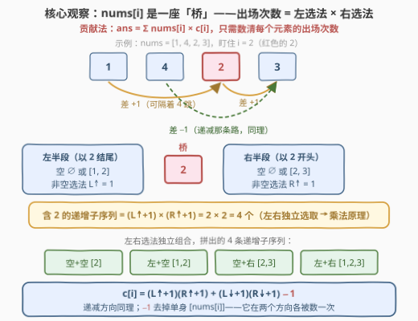
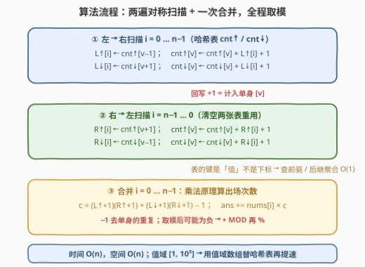
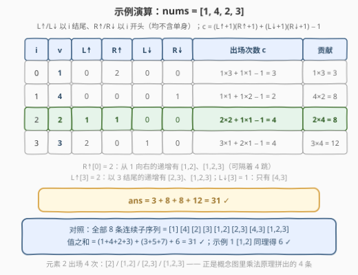

# 连续子序列的和

- **题目名称**：连续子序列的和
- **链接**：[3299. 连续子序列的和](https://leetcode.cn/problems/sum-of-consecutive-subsequences/)
- **难度**：困难
- **标签**：数组、哈希表、动态规划
- **关联**：贡献法 + 乘法原理 + 按值聚合的哈希 DP，与 1218 / 2407 一脉相承

## 1. 题目概述

> ⚠️ 本题为 LeetCode 付费题，题意描述根据官方示例用例与 hints 重建，可能与官方题面有出入。

如果一个长度为 $n$ 的数组 $\textit{arr}$ 满足下列条件**之一**，就称它是**连续的**：

- 对所有 $1 \le i \lt n$，都有 $\textit{arr}[i] - \textit{arr}[i-1] = 1$（每步恒 **+1**，递增）；
- 对所有 $1 \le i \lt n$，都有 $\textit{arr}[i] - \textit{arr}[i-1] = -1$（每步恒 **−1**，递减）。

数组的**值**定义为其元素之和。例如 $[3,4,5]$ 是值为 $12$ 的连续数组，$[9,8]$ 是值为 $17$ 的连续数组；而 $[3,4,3]$（方向中途翻转）与 $[8,6]$（相邻差不是 $\pm 1$）都不连续。

给定整数数组 `nums`，返回其中**所有连续非空子序列**的**值**之和。由于答案可能很大，返回对 $10^9 + 7$ 取模的结果。**注意：长度为 1 的子序列也被视为连续的**。

**示例 1**：

```text
输入：nums = [1,2]
输出：6
解释：连续子序列为 [1]、[2]、[1,2]，值之和 = 1 + 2 + 3 = 6。
```

**示例 2**：

```text
输入：nums = [1,4,2,3]
输出：31
解释：连续子序列为 [1]、[4]、[2]、[3]、[1,2]、[2,3]、[4,3]、[1,2,3]，
     值之和 = (1+4+2+3) + (3+5+7) + 6 = 31。
```

**约束条件**：

- $1 \le \textit{nums.length} \le 10^5$
- $1 \le \textit{nums}[i] \le 10^5$

> 💡 **读题关键**：① 是**子序列**不是子数组——保序但可不连续，$[1,2,3]$ 能从 $[1,4,2,3]$ 里隔着 $4$ 挑出来；② 方向必须**全程一致**——$[3,4,3]$ 这种先加后减的不算，这也是「递增 / 递减可以分开统计再合并」的合法性来源；③ 单身子序列（长度 1）也算连续；④ 「所有子序列的值之和」是组合级计数，**中间量会爆 64 位，全程取模**；⑤ $n = 10^5$ 直接判 $O(n^2)$ 死刑，必须线性。

---

## 2. 解题思路

### 2.1 暴力思路：枚举子集 + 逐个判定

最直接：枚举全部 $2^n - 1$ 个非空子序列，逐个判定「相邻差恒为 $+1$ 或恒为 $-1$」再累加元素和，$O(n \cdot 2^n)$——$n = 10^5$ 时是天文数字。

改进一点的暴力是**以位置为结尾的 DP**：设 $f[i]$ 为以 $i$ 结尾的递增连续子序列个数，则 $f[i] = \sum_{j \lt i,\ \textit{nums}[j] = \textit{nums}[i]-1} \big(f[j] + 1\big)$。但只数「个数」不够——题目要的是「值之和」，还得再配一个「以 $i$ 结尾的值和」维度；且内层要**线性扫描**前面所有位置找值恰为 $\textit{nums}[i] \pm 1$ 的前驱，整体 $O(n^2) \approx 10^{10}$，依旧超时。

瓶颈其实只剩一个：**「找值为 $v \pm 1$ 的所有前驱」这个查询被反复线性扫描**。而它天然是一张哈希表的 $O(1)$ 聚合查询——按「值」建表，把「按位置转移」改成「按值转移」。

### 2.2 核心观察：贡献法——把「求子序列的和」翻转成「数元素的出场」



**第一步：翻转求和视角（贡献法）**。与其枚举子序列求和，不如站在元素一侧数出场——交换求和顺序：

$$\textit{ans} = \sum_i \textit{nums}[i] \times c[i], \qquad c[i] = \text{含下标 } i \text{ 的连续子序列个数}$$

**第二步：按方向拆分**。连续子序列非递增即递减，两类的交集只有单身 $[\textit{nums}[i]]$（长度 1 同时满足两个定义），于是 $c[i] = c_{\uparrow}[i] + c_{\downarrow}[i] - 1$。

**第三步：乘法原理——把 $i$ 当成一座桥**。固定 $i$，一条含 $i$ 的递增子序列被 $i$ 切成两截：

$$\underbrace{\cdots \to \textit{nums}[i]}_{\text{左半段（可空）}} \to \underbrace{\cdots}_{\text{右半段（可空）}}$$

左半段是「以 $i$ 结尾的递增子序列去掉 $i$ 本身」，右半段是「以 $i$ 开头的递增子序列去掉 $i$ 本身」，两者**独立选取**，拼接后方向自动保持 $+1$。记 $L_{\uparrow}[i]$ / $R_{\uparrow}[i]$ 为两侧非空选法的个数，则：

$$c_{\uparrow}[i] = \big(L_{\uparrow}[i] + 1\big) \times \big(R_{\uparrow}[i] + 1\big)$$

两个 $+1$ 都是在数「空选法」。递减方向完全对称：$c_{\downarrow}[i] = (L_{\downarrow}[i]+1)(R_{\downarrow}[i]+1)$。

**第四步：哈希表 $O(1)$ 转移**。以 $L_{\uparrow}$ 为例按定义展开：

$$L_{\uparrow}[i] = \sum_{j \lt i,\ \textit{nums}[j] = \textit{nums}[i]-1} \big(L_{\uparrow}[j] + 1\big)$$

（每条以 $j$ 结尾的递增子序列——含单身 $[\textit{nums}[j]]$——都能接上 $i$ 升级成以 $i$ 结尾。）转移只依赖「**值为 $v-1$ 的所有前驱的聚合和**」：用一张哈希表 $\textit{cnt}_{\uparrow}[v]$ 维护「目前为止以值 $v$ 结尾（含单身）的递增子序列总数」，则 $L_{\uparrow}[i] = \textit{cnt}_{\uparrow}[\textit{nums}[i]-1]$ 一步读出，再回写 $\textit{cnt}_{\uparrow}[\textit{nums}[i]] \mathrel{+}= L_{\uparrow}[i] + 1$。其余三个量对称——只是扫描方向与查询键 $v \pm 1$ 不同：

| 量 | 扫描方向 | 查询键 | 含义（均不含单身） |
|----|----------|--------|--------------------|
| $L_{\uparrow}[i]$ | 左 → 右 | $v - 1$ | 以 $i$ **结尾**的**递增**子序列个数 |
| $L_{\downarrow}[i]$ | 左 → 右 | $v + 1$ | 以 $i$ **结尾**的**递减**子序列个数 |
| $R_{\uparrow}[i]$ | 右 → 左 | $v + 1$ | 以 $i$ **开头**的**递增**子序列个数 |
| $R_{\downarrow}[i]$ | 右 → 左 | $v - 1$ | 以 $i$ **开头**的**递减**子序列个数 |

> 💡 **为什么官方 hints 推荐这条路**：「数出场次数」+「乘法原理」把一个求和问题干净地拆成四个**互相独立**的一维计数 DP，每个都是「哈希表按值聚合」的单遍扫描；拼接的合法性（方向一致、值差 $\pm 1$）由构造自动保证，无需任何额外判定。

### 2.3 算法流程图



三步走：① **左→右**扫描同时算两张表，得 $L_{\uparrow}$、$L_{\downarrow}$；② 清空哈希表后**右→左**扫描，得 $R_{\uparrow}$、$R_{\downarrow}$；③ 再线性一遍套乘法原理公式累加贡献。两处易错点已用红笔标出：回写时的 $+1$ 是把单身 $[\textit{nums}[i]]$ 计入计数；合并时的 $-1$ 是去掉单身在两个方向被数的重复——**取模后的计数相减可能为负**，务必 $+\textit{MOD}$ 再取模。

### 2.4 示例演算



以 $\textit{nums} = [1,4,2,3]$ 走完全流程：

| $i$ | $\textit{nums}[i]$ | $L_{\uparrow}$ | $R_{\uparrow}$ | $L_{\downarrow}$ | $R_{\downarrow}$ | 出场次数 $c[i]$ | 贡献 |
|-----|-----|-----|-----|-----|-----|------|-----|
| 0 | 1 | 0 | 2 | 0 | 0 | $1{\times}3 + 1{\times}1 - 1 = 3$ | $1 \times 3 = 3$ |
| 1 | 4 | 0 | 0 | 0 | 1 | $1{\times}1 + 1{\times}2 - 1 = 2$ | $4 \times 2 = 8$ |
| 2 | 2 | 1 | 1 | 0 | 0 | $2{\times}2 + 1{\times}1 - 1 = 4$ | $2 \times 4 = 8$ |
| 3 | 3 | 2 | 0 | 1 | 0 | $3{\times}1 + 2{\times}1 - 1 = 4$ | $3 \times 4 = 12$ |

几个关键读数：$R_{\uparrow}[0] = 2$——从 $1$ 出发向右的递增子序列有 $[1,2]$ 和 $[1,2,3]$ 两条（隔着 $4$ 跳）；$L_{\uparrow}[3] = 2$——以 $3$ 结尾的有 $[2,3]$、$[1,2,3]$；$L_{\downarrow}[3] = 1$——只有 $[4,3]$。合计 $\textit{ans} = 3 + 8 + 8 + 12 = 31$ ✓，与逐条枚举 8 个子序列求和完全一致。示例 1（$[1,2]$）同理得 $c = [2,2]$，$\textit{ans} = 1 \times 2 + 2 \times 2 = 6$ ✓。

---

## 3. 参考代码

### C++

```cpp
class Solution {
  public:
    int getSum(vector<int>& nums) {
        const long long MOD = 1e9 + 7;
        int n = nums.size();
        vector<long long> Linc(n), Ldec(n), Rinc(n), Rdec(n);
        unordered_map<int, long long> ci, cd;   // 以值 v 结尾（含单身）的递增 / 递减子序列总数

        for (int i = 0; i < n; ++i) {           // 左 → 右：以 i 结尾
            int v = nums[i];
            Linc[i] = ci[v - 1];                // 递增前驱值只能是 v-1
            ci[v] = (ci[v] + Linc[i] + 1) % MOD;
            Ldec[i] = cd[v + 1];                // 递减前驱值只能是 v+1
            cd[v] = (cd[v] + Ldec[i] + 1) % MOD;
        }
        ci.clear(); cd.clear();
        for (int i = n - 1; i >= 0; --i) {      // 右 → 左：以 i 开头
            int v = nums[i];
            Rinc[i] = ci[v + 1];                // 递增后继值只能是 v+1
            ci[v] = (ci[v] + Rinc[i] + 1) % MOD;
            Rdec[i] = cd[v - 1];                // 递减后继值只能是 v-1
            cd[v] = (cd[v] + Rdec[i] + 1) % MOD;
        }

        long long ans = 0;
        for (int i = 0; i < n; ++i) {           // 乘法原理合并贡献
            long long cInc = (Linc[i] + 1) * (Rinc[i] + 1) % MOD;
            long long cDec = (Ldec[i] + 1) * (Rdec[i] + 1) % MOD;
            long long cnt = ((cInc + cDec - 1) % MOD + MOD) % MOD;  // 单身被数两次，减一去重
            ans = (ans + (long long)nums[i] * cnt) % MOD;
        }
        return (int)ans;
    }
};
```

### Python

```python
class Solution:
    def getSum(self, nums: List[int]) -> int:
        MOD = 10 ** 9 + 7
        n = len(nums)
        Linc = [0] * n; Ldec = [0] * n; Rinc = [0] * n; Rdec = [0] * n

        ci, cd = {}, {}                    # 以值 v 结尾（含单身）的递增 / 递减子序列总数
        for i, v in enumerate(nums):       # 左 → 右：以 i 结尾
            Linc[i] = ci.get(v - 1, 0)     # 递增前驱值只能是 v-1
            ci[v] = (ci.get(v, 0) + Linc[i] + 1) % MOD
            Ldec[i] = cd.get(v + 1, 0)     # 递减前驱值只能是 v+1
            cd[v] = (cd.get(v, 0) + Ldec[i] + 1) % MOD

        ci, cd = {}, {}
        for i in range(n - 1, -1, -1):     # 右 → 左：以 i 开头
            v = nums[i]
            Rinc[i] = ci.get(v + 1, 0)     # 递增后继值只能是 v+1
            ci[v] = (ci.get(v, 0) + Rinc[i] + 1) % MOD
            Rdec[i] = cd.get(v - 1, 0)     # 递减后继值只能是 v-1
            cd[v] = (cd.get(v, 0) + Rdec[i] + 1) % MOD

        ans = 0
        for i, v in enumerate(nums):       # 乘法原理合并贡献
            cnt = (Linc[i] + 1) * (Rinc[i] + 1) + (Ldec[i] + 1) * (Rdec[i] + 1) - 1
            ans = (ans + v * (cnt % MOD)) % MOD
        return ans
```

> 💡 **实现细节**：① **计数必须边算边取模**：构造「$1..k$ 循环排列 $m$ 轮」（$n = km$），完整递增链的条数就有 $\binom{k+m-1}{k}$，取 $k = m = \sqrt n$ 时约 $2^{2\sqrt n}$，$n = 10^5$ 即约 $2^{632}$，远超 `long long` 的 $2^{63}$；② 哈希表语义是「**含单身**的累计数」：查询读出 $L$、回写累加 $L+1$（$+1$ 正是单身 $[v]$），四个 DP 共用同一套模板，只差扫描方向与查询键；③ 合并时 `cInc + cDec - 1` 取模后可能为负，C++ 要 `+ MOD` 再 `%`（Python 取模天然非负）；④ 值域 $[1, 10^5]$ 很紧，`unordered_map` 可换成 $10^5 + 2$ 长的值域数组再提速；⑤ 递减就是「反转数组的递增」——也可以只写一个 `calc()` 正反跑两遍（官方题解的 reverse 技巧），本文四个 DP 平铺直书，对称性一目了然。

---

## 4. 复杂度分析

| 维度 | 复杂度 | 说明 |
|------|--------|------|
| 时间复杂度 | $O(n)$ | 两次线性扫描（每步 4 次哈希表 $O(1)$ 读写）+ 一次合并扫描 |
| 空间复杂度 | $O(n)$ | 四个计数数组；两张哈希表 $O(\min(n, V))$，换值域数组则 $O(V)$，$V = 10^5$ |
| 暴力对照 | $O(n \cdot 2^n)$ / $O(n^2)$ | 子集枚举 / 逐前驱扫描 DP，$n = 10^5$ 均不可行 |

实测：两组官方示例分别得 $6 / 31$；与 $O(n \cdot 2^n)$ 暴力对拍随机数据（$n \le 14$、值域 $\le 6$）3500 组全部一致；「$1..316$ 循环 316 轮」（$n \approx 10^5$）的计数爆炸构造下线性通过。

---

## 5. 扩展：一次扫描的「结尾和」DP

「桥」的两侧其实可以不拆开——直接维护**以值 $v$ 结尾**的递增子序列的（个数， 值和）二元组，一步到位累加值和：处理 $\textit{nums}[i] = v$ 时，新增的以 $i$ 结尾的子序列 = 「单身 $[v]$」+「每条以 $v-1$ 结尾的旧子序列接上 $v$」，故新增个数 $c = \textit{cnt}[v-1] + 1$、新增值和 $s = \textit{sm}[v-1] + c \cdot v$；递增、递减各扫一遍，最后减去 $\sum \textit{nums}$（单身被两个方向各算一次）：

```python
class Solution:
    def getSum(self, nums: List[int]) -> int:
        MOD = 10 ** 9 + 7
        ans = 0
        for delta in (-1, 1):                    # delta=-1 → 递增；delta=1 → 递减
            cnt, sm = {}, {}                     # 以值 v 结尾的子序列（个数, 值和），含单身
            for v in nums:
                c = cnt.get(v + delta, 0) + 1    # 新增个数：旧链接上 v，再加单身 [v]
                s = sm.get(v + delta, 0) + c * v # 新增值和：旧值和 + 每条都添一个 v
                cnt[v] = (cnt.get(v, 0) + c) % MOD
                sm[v] = (sm.get(v, 0) + s) % MOD
                ans = (ans + s) % MOD
        return (ans - sum(nums)) % MOD           # 单身在两个方向各计一次
```

代码更短、只扫两遍，但它把「计数」和「求值」揉进同一个转移；桥接版把两者解耦成四个纯计数 DP，乘法原理的骨架更清晰——面试里先讲贡献法 + 乘法原理，再亮出这个精简实现，层次感就出来了。

---

## 6. 面试要点

1. **为什么想到贡献法？直接 DP「子序列的值和」不行吗？**

   - 「每条子序列的值 = 其元素之和」天然可以交换求和顺序：$\sum_{\text{子序列}}\sum_{\text{元素}} = \sum_{\text{元素}}\sum_{\text{子序列}}$，于是答案 = $\sum_i \textit{nums}[i] \times$ 出场次数。直接 DP「以 $i$ 结尾的值和」也可行（第 5 节），但贡献法把问题降维成**纯计数**，而计数能用乘法原理拆成左右两段独立子问题——这是它一路化简到 $O(n)$ 的关键。

2. **乘法原理公式里的两个 $+1$ 和一个 $-1$ 分别是什么？**

   - $(L+1)$、$(R+1)$ 的 $+1$ 数的是「空选法」：左半段 / 右半段可以不选，对应子序列在 $i$ 一侧截断。合并式 $c_{\uparrow} + c_{\downarrow} - 1$ 的 $-1$ 是因为单身 $[\textit{nums}[i]]$（左右都空）同时满足递增与递减两个定义，被数了两次。取模后 $c_{\uparrow} + c_{\downarrow} - 1$ 可能为负，C++ 记得 `+MOD` 再取模。

3. **计数真的会溢出 64 位吗？**

   - 会。构造「$1,2,\cdots,k$ 循环排列 $m$ 轮」（$n = km$）：一条完整递增链等价于给每个值选一个**不下降**的轮次（位置 $(r-1)k+v$ 随 $v$ 递增 $\iff$ 轮次不下降），仅此就有 $\binom{k+m-1}{k}$ 条；取 $k = m = \sqrt n$ 得约 $2^{2\sqrt n}$，$n = 10^5$ 时约 $2^{632} \gg 2^{63}$。所以四个 DP 与合并公式都要**全程取模**，任何一步想存「真实计数」都会爆。

4. **哈希表为什么按「值」而不是「下标」建？转移为什么是 $O(1)$？**

   - 递推 $L[i] = \sum_{j \lt i,\ \textit{nums}[j] = \textit{nums}[i] \mp 1}(L[j]+1)$ 只关心前驱的**值**，不关心位置——把「以值 $v$ 结尾的 $L[j]+1$」预聚合成 $\textit{cnt}[v]$，查询一步读出、回写一步累加。这就是「按值聚合的 DP」（值域 DP），1218 / 2407 同款套路；本题值域只有 $10^5$，用数组代替哈希表还能再快一截。

5. **$[3,4,3]$ 为什么不算连续？和湍流子数组的区别在哪？**

   - 定义要求相邻差**恒为 $+1$ 或恒为 $-1$**，方向中途翻转即失效——正因如此，递增 / 递减才能**分开统计再合并**（只减单身的重复）。[978. 最长湍流子数组](https://leetcode.cn/problems/longest-turbulent-subarray/)恰好相反，要求方向**交替**——两题互为镜像：定义里一个词的差别，让「拆方向分别做」的技巧在一题成立、在另一题失效。面试复述题意时要逐字抠清。

---

## 7. 同类练习题

- [1218. 最长定差子序列](https://leetcode.cn/problems/longest-arithmetic-subsequence-of-given-difference/)（[站内题解](../1201-1300/1218_最长定差子序列.md)）：同款「按值聚合的哈希 DP」，把「数个数」换成「求最长」，入门首选
- [2407. 最长递增子序列 II](https://leetcode.cn/problems/longest-increasing-subsequence-ii/)（[站内题解](../2401-2500/2407_最长递增子序列II.md)）：转移同样只查「值落在某区间的前驱」，数据范围逼出按值域建线段树，是本题哈希表的加强版
- [446. 等差数列划分 II - 子序列](https://leetcode.cn/problems/arithmetic-slices-ii-subsequence/)（[站内题解](../0401-0500/446_等差数列划分II子序列.md)）：统计满足等差约束的子序列**个数**，(末尾值, 公差) 双关键字计数 DP，可看作本题的一般化
- [978. 最长湍流子数组](https://leetcode.cn/problems/longest-turbulent-subarray/)（[站内题解](../0901-1000/978_最长湍流子数组.md)）：方向必须**交替**的「最长」版，与本题「方向必须一致」互为镜像，体会定义一字之差对解法的影响
- [2414. 最长的字母序连续子字符串的长度](https://leetcode.cn/problems/length-of-the-longest-alphabetical-continuous-substring/)（[站内题解](../2401-2500/2414_最长的字母序连续子字符串的长度.md)）：「相邻差恰为 1」的连续性判定平移到字符串（子串版、一次扫描），对照子序列版的哈希聚合
