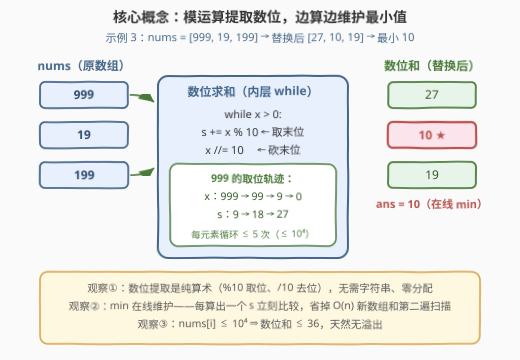
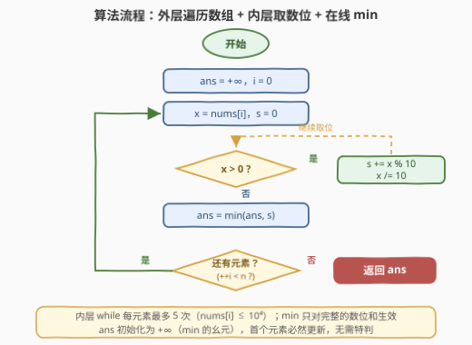

# LeetCode 替换为数位和以后的最小元素 题解

## 1. 题目概述

- **标题 / 题号**：替换为数位和以后的最小元素（#3300，easy）
- **链接**：https://leetcode.cn/problems/minimum-element-after-replacement-with-digit-sum/
- **难度**：简单
- **标签**：数组，数学

**题意**：给你一个整数数组 `nums`。请将 `nums` 中**每一个元素**都替换为它的**各个数位之和**，返回替换所有元素以后 `nums` 中的**最小**元素。

**示例 1**：

```text
输入：nums = [10,12,13,14]
输出：1
解释：nums 替换后变为 [1, 3, 4, 5]，最小元素为 1。
```

**示例 2**：

```text
输入：nums = [1,2,3,4]
输出：1
解释：nums 替换后变为 [1, 2, 3, 4]，最小元素为 1。
```

**示例 3**：

```text
输入：nums = [999,19,199]
输出：10
解释：nums 替换后变为 [27, 10, 19]，最小元素为 10。
```

**约束**：

- `1 <= nums.length <= 100`
- `1 <= nums[i] <= 10^4`

> 💡 读题关键：① 替换只做**一次**——每个元素变成它自己的数位和，不是反复相加到个位数（那是 258 题的数字根，见第 5 节）；② 求的是**替换后的最小值**，并不需要真的构造出替换后的数组——这暗示 `min` 可以边算边维护；③ `nums[i] ≤ 10^4` 意味着数位最多 5 个，单个元素的数位和不超过 $9 \times 4 = 36$（来自 9999），值域小到可以口算验证。

## 2. 解题思路

### 2.1 暴力思路：转字符串 + 两遍扫描

按官方提示的最直觉写法：把每个元素转成字符串，逐字符转回数字累加，存进新数组，最后再扫一遍新数组取 `min`：

```python
new = [sum(int(c) for c in str(x)) for x in nums]
return min(new)
```

正确性没有问题，本题规模下也完全够用（$n \le 100$）。但细看有两处「绕远」：

1. **绕了字符串的远路**：`str(x)` 内部要做一次十进制分解（分配字符串对象、逐位编码），拿到字符后又 `int(c)` 转回数字——把数字拆成字符再拼回数字，纯属中途换了一趟交通工具。数位本身就是 $\lfloor x / 10^k \rfloor \bmod 10$，模运算直接可得；
2. **绕了第二遍扫描的远路**：先完整构造替换后的数组再取 `min`，多出 $O(n)$ 空间和一遍扫描——而 `min` 是个**在线**统计量，每算出一个数位和立刻比较即可。

### 2.2 核心观察：模运算取数位 + 单遍在线维护最小值



**观察 1（数位提取是纯算术）**：`x % 10` 取出末位，`x /= 10` 砍掉末位，循环到 `x == 0` 即处理完所有数位——无需字符串、无需额外空间，内层循环次数就是数位个数 $\lfloor \log_{10} x \rfloor + 1 \le 5$。

**观察 2（min 在线维护）**：「替换后数组的最小值」=「所有元素数位和的最小值」。每个 `s` 算出来的一瞬间就和 `ans` 比一次，`ans` 初始化为 $+\infty$，扫完数组即为答案——一遍扫描、$O(1)$ 额外空间。

**观察 3（值域极小，天然防溢出）**：`nums[i] ≤ 10^4`，数位和最大 $36$（来自 9999），`ans` 与累加器 `s` 都远离整型上界，无需任何溢出防护。

### 2.3 算法流程图



结构是一个**双层循环的单链流程**：外层 `for` 走数组，内层 `while` 拆数位；内层退出后做一次 `min` 更新，再判断是否还有元素。注意两条回边都不经过 `ans` 更新框——`min` 只对**完整的**数位和生效，拆到一半不会中途比较。

### 2.4 示例演算

![示例演算：nums = [999,19,199] 的逐步执行表](../images/p3300_example_walkthrough.svg)

以示例 3（`nums = [999, 19, 199]`）走表：

| $i$ | $x$ | 取位轨迹（$x$） | 数位拆解 | $s$ | `ans` 更新 |
|-----|-----|----------------|----------|-----|-----------|
| 0 | `999` | 999 → 99 → 9 → 0 | $9+9+9$ | 27 | $\min(+\infty, 27) = 27$ |
| 1 | `19` | 19 → 1 → 0 | $1+9$ | 10 | $\min(27, 10) = \mathbf{10}$ ✓ |
| 2 | `199` | 199 → 19 → 1 → 0 | $1+9+9$ | 19 | $\min(10, 19) = 10$（不变） |
| — | 扫描结束 | — | — | — | 返回 **10** |

最小值在第 1 步就被 `19` 锁定，后续 `199` 的数位和 19 无法撼动——这正是「在线维护」的意义：**任何时刻的 `ans` 都是已见前缀的最优解**。

## 3. 参考代码

### C++（模运算取位 + 在线 min）

```cpp
class Solution {
  public:
    int minElement(vector<int>& nums) {
        int ans = INT_MAX;
        for (int x : nums) {
            int s = 0;
            for (; x; x /= 10) {       // 内层：逐位剥离，最多 5 次
                s += x % 10;           // 取出末位
            }
            ans = min(ans, s);         // 在线更新最小值
        }
        return ans;
    }
};
```

### Python（模运算取位 + 在线 min）

```python
class Solution:
    def minElement(self, nums: List[int]) -> int:
        ans = inf
        for x in nums:
            s = 0
            while x:                   # 内层：逐位剥离，最多 5 次
                s += x % 10            # 取出末位
                x //= 10               # 砍掉末位
            ans = min(ans, s)          # 在线更新最小值
        return ans
```

> 💡 Python 的字符串一行流 `min(sum(map(int, str(x))) for x in nums)` 同样正确（`str`/`sum` 都是 C 实现，大数组上未必更慢）；但模运算版不依赖进制字符串化、零额外分配，是更本质的**取数位模板**——这套 `while x: s += x % 10; x //= 10` 在 1281、1945 等题里会反复出现。

## 4. 复杂度分析

| 维度 | 复杂度 | 说明 |
|------|--------|------|
| 时间复杂度 | $O(n \cdot D)$ | $n \le 100$ 为数组长度，$D \le 5$ 为最大数位个数（$10^4$ 仅 5 位）；$D$ 视作常数即 $O(n)$。每个数位必须至少读一次，线性已是下界 |
| 空间复杂度 | $O(1)$ | 只用 `ans` 与 `s` 两个标量；对照暴力版需要 $O(n)$ 存替换后数组——`min` 的在线性把整个中间数组压缩成一个标量 |

> 💡 严格说内层循环次数是 $\lfloor \log_{10} x \rfloor + 1$，写成 $O(n \log U)$（$U$ 为值域上界）更严谨；本题规模下与 $O(n)$ 无实际差别。

## 5. 扩展：数字根——反复替换的极限形态

本题只做**一次**替换。如果面试官追问：「把替换一直做下去，直到剩个位数，结果是什么？」——那就是**数字根**（digital root），对应 [258. 各位相加](https://leetcode.cn/problems/add-digits/)。

数位和有一个美妙的同余性质：

$$x \equiv \mathrm{digitsum}(x) \pmod 9$$

因为 $10 \equiv 1 \pmod 9$，所以 $x = \sum_k d_k \cdot 10^k \equiv \sum_k d_k \pmod 9$。每做一次替换，值模 9 不变；反复替换最终收敛到 1~9 中的某个数，于是得到 $O(1)$ 公式：

$$\mathrm{dr}(x) = 1 + (x - 1) \bmod 9 \quad (x > 0)$$

⚠️ 注意**不能**把数字根公式直接搬到本题：999 的（一次）数位和是 $27$，而数字根是 $9$——本题问的是前者。不过同余性质可以当**快速校验工具**：数位和与原数模 9 同余，可用来 $O(1)$ 验证手算结果（如 $999 \bmod 9 = 0$，$27 \bmod 9 = 0$ ✓）。

顺带一提，取数位模板换个「加工函数」就是新题：取**平方和**得到快乐数的迭代函数（[202. 快乐数](https://leetcode.cn/problems/happy-number/)），取**乘积**与和作差就是 [1281. 整数的各位积和差](https://leetcode.cn/problems/subtract-the-product-and-sum-of-digits-of-an-integer/)。

## 6. 面试要点

1. **为什么用模运算而不是转字符串？**

   - 两者复杂度同阶（都要读一遍数位），但模运算是**零分配**的原地操作：`str(x)` 要创建字符串对象、`int(c)` 又把字符转回数字，来回搬运；模运算版只有寄存器级算术。更重要的是模板的**通用性**——换成任意进制（如二进制数位和）只需把 10 换成 2，字符串版还得先做进制转换。

2. **内层循环的次数由什么决定？上界是多少？**

   - 数位个数 $\lfloor \log_{10} x \rfloor + 1$。本题 $x \le 10^4$，上界 5 次；总时间 $O(n \log U)$，$U$ 为值域上界。即便值域放宽到 64 位整数，也只是 $\le 19$ 位，仍是小常数。

3. **`ans` 为什么初始化为 $+\infty$ 而不是 `nums[0]` 的数位和？**

   - $+\infty$ 是 `min` 的**幺元**：$\min(+\infty, s) = s$，首个元素必然更新，代码无需特判首元素。这是所有「在线聚合」的通用写法——求和初始化 0、求积初始化 1、求 min 初始化 $+\infty$，都是各自运算的单位元。

4. **如果要求「替换到个位为止」（数字根），还能每个元素 $O(1)$ 吗？**

   - 能：数字根 $= 1 + (x-1) \bmod 9$（$x > 0$），依据是数位和与原数模 9 同余。但本题只替换**一次**，999 → 27 而非 9，不能混用。

5. **数位和可能溢出吗？**

   - 不可能。$x \le 10^4$ 时数位和 $\le 9 \times 4 = 36$；即便 $x$ 是 64 位最大整数，数位和也不超过 $9 \times 19 = 171$。数位和关于 $x$ 是 $O(\log x)$ 增长，天然远离整型上界。

## 同类练习题

| # | 题目 | 与本题的关联 |
|---|------|-------------|
| 258 | [各位相加](https://leetcode.cn/problems/add-digits/) | 反复求数位和直到个位，用模 9 同余推出数字根 $O(1)$ 公式，即本题第 5 节的极限形态 |
| 1281 | [整数的各位积和差](https://leetcode.cn/problems/subtract-the-product-and-sum-of-digits-of-an-integer/) | 同一套取数位模板，把「求和」换成「又乘又减」 |
| 1945 | [字符串转化后的各位数字之和](https://leetcode.cn/problems/sum-of-digits-of-string-after-convert/) | 字符先映射为数字再叠加数位和，取位模板的字符串前处理版 |
| 2160 | [拆分数位后四位数字的最小和](https://leetcode.cn/problems/minimum-sum-of-four-digit-number-after-splitting-digits/) | 把四位数的数位拆开后贪心重组成两个两位数求最小和，数位拆解 + 排序贪心的组合 |
