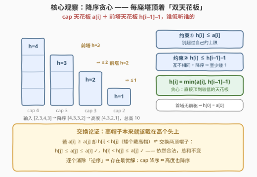
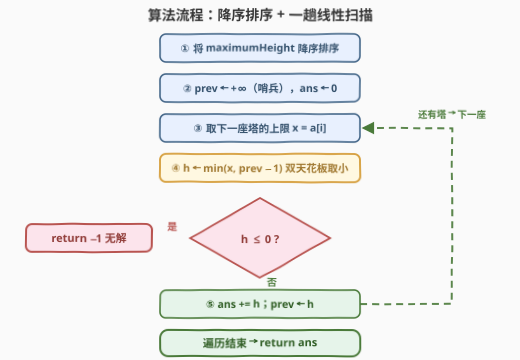
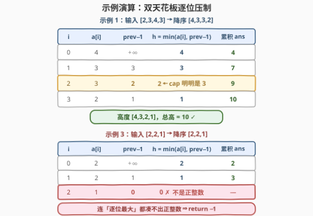

# LeetCode 高度互不相同的最大塔高和 题解

## 1. 题目概述

- **标题 / 题号**：高度互不相同的最大塔高和（#3301，medium）
- **链接**：https://leetcode.cn/problems/maximize-the-total-height-of-unique-towers/
- **难度**：中等
- **标签**：贪心、数组、排序

**题意**：给你一个数组 `maximumHeight`，其中 `maximumHeight[i]` 表示第 $i$ 座塔可以达到的**最大**高度。你的任务是给每一座塔分别设置一个高度，使得：

- 第 $i$ 座塔的高度是一个**正整数**，且不超过 `maximumHeight[i]`；
- 所有塔的高度**互不相同**。

请你返回设置完所有塔的高度后，可以达到的**最大总高度**；如果没有合法的设置，返回 $-1$。

**示例 1**：

```text
输入：maximumHeight = [2,3,4,3]
输出：10
解释：可以将塔的高度设置为 [1,2,4,3]（本解法降序贪心给出 [4,3,2,1]，总高同为 10）。
```

**示例 2**：

```text
输入：maximumHeight = [15,10]
输出：25
解释：两座塔互不干扰，直接顶满上限 [15, 10]。
```

**示例 3**：

```text
输入：maximumHeight = [2,2,1]
输出：-1
解释：无法给三座塔设置互不相同的正整数高度。
```

**约束**：$1 \le \text{maximumHeight.length} \le 10^5$；$1 \le \text{maximumHeight[i]} \le 10^9$。

> 💡 **审题关键**：
> ① 「互不相同」是**全局**约束——任意两座塔不能撞高度，塔与塔之间因此产生耦合，这是本题与「每座塔独立取 max」的本质区别；
> ② 最大化的是**总和**，直觉是「能顶多高顶多高」，但一座塔顶满会**挤压**其它塔的可选高度——必须论证「先给谁顶满」不亏；
> ③ 规模相乘：$n \le 10^5$、$a_i \le 10^9$ ⇒ 总和上界约 $10^{14}$，**超出 32 位 int 四个数量级**，C++ 必须 `long long`；
> ④ 无解确实存在（示例 3 的 $[2,2,1]$），算法必须能识别并返回 $-1$。

## 2. 解题思路

### 2.1 暴力思路：枚举高度组合 / 二分图匹配

最直接的暴力是回溯枚举：每座塔从 $1 \sim a_i$ 中挑一个高度、维护已用高度集合去重——状态空间是 $\prod a_i$ 量级，天文数字。换一个视角，把「高度值」和「塔」看成二分图、求最大权匹配也正确，但 $n \le 10^5$ 同样不可行。

两个视角都提示了突破口：塔与塔之间**唯一的耦合**就是「高度互不相同」——这是一个可以被**排序解耦**的结构。一旦把塔按上限降序排好，「谁给谁让路」就有了确定答案。

### 2.2 核心观察：降序贪心——每座塔顶着「双天花板」



**观察 1（交换论证：高帽子本来就该戴在高个头上）**：把塔按上限降序排列，记为 $a[0] \ge a[1] \ge \dots \ge a[n-1]$。对**任何**可行方案，若存在 $i < j$（即 $a[i] \ge a[j]$）但 $h[i] < h[j]$——cap 小的塔反而拿走了更高的帽子——就把两座塔的高度**交换**：

- 塔 $i$ 改拿 $h[j]$：$h[j] \le a[j] \le a[i]$，不超上限 ✓
- 塔 $j$ 改拿 $h[i]$：$h[i] < h[j] \le a[j]$，不超上限 ✓

高度集合没变，依然互不相同；总和也不变。逐个消除这样的「逆序」后可得：**总存在一个最优解，使 cap 降序 ⇔ 高度也降序**。于是只需在「降序方案」里找最优。

**观察 2（降序方案的双天花板）**：高度降序且互不相同，意味着每座塔比前一座**至少矮 1**：$h[i] \le h[i-1] - 1$；再加上上限约束 $h[i] \le a[i]$，两块天花板合起来：

$$h[i] \le \min\!\big(a[i],\ h[i-1] - 1\big)$$

**观察 3（贪心逐位顶到天花板，就是最优）**：定义贪心序列 $g[0] = a[0]$，$g[i] = \min(a[i],\ g[i-1] - 1)$。对任意降序可行解 $h'$，用归纳法可证**贪心逐点支配**：

$$g[0] = a[0] \ge h'[0]；\quad g[i-1] \ge h'[i-1] \Rightarrow g[i] = \min(a[i], g[i-1]-1) \ge \min(a[i], h'[i-1]-1) \ge h'[i]$$

所以 $\sum g[i] \ge \sum h'[i]$ 对一切可行解成立；而只要贪心全程为正，它自己就是可行解——**既可行又支配一切，贪心即最优**。

**观察 4（无解判定）**：若贪心某步算出 $g[i] \le 0$：由观察 1，任何可行解都可重排成降序；由观察 3 的归纳，那个降序解被贪心逐点支配，于是 $h'[i] \le g[i] \le 0$，与「正整数」矛盾。**连逐位取最大的方案都凑不出正整数，说明无解**，返回 $-1$。

### 2.3 算法流程图



流程极简：**降序排序 + 一趟扫描**。用 `prev` 记录前一座塔的最终高度（初始为哨兵 $+\infty$，让首塔只受上限约束），每座塔取 $h = \min(a[i], \text{prev} - 1)$；一旦 $h \le 0$ 立即返回 $-1$，否则累加并更新 `prev`。

### 2.4 示例演算



**示例 1**：`[2,3,4,3]` → 降序 `[4,3,3,2]`：

| $i$ | $a[i]$ | $\text{prev}-1$ | $h=\min(a[i],\ \text{prev}-1)$ | 累积 $ans$ |
|-----|--------|-----------------|-------------------------------|-----------|
| 0 | 4 | $+\infty$ | **4** | 4 |
| 1 | 3 | 3 | **3** | 7 |
| 2 | 3 | 2 | **2** ← cap 明明是 3，被前塔压到 2 | 9 |
| 3 | 2 | 1 | **1** | 10 |

答案 $10$，对应降序塔的高度 $[4,3,2,1]$。第 2 行正是「双天花板」起作用的时刻：$a[2]=3$，但前塔已是 3，互不相同迫使它退到 2。

**示例 3**：`[2,2,1]` → 降序 `[2,2,1]`：

| $i$ | $a[i]$ | $\text{prev}-1$ | $h$ | 累积 $ans$ |
|-----|--------|-----------------|-----|-----------|
| 0 | 2 | $+\infty$ | 2 | 2 |
| 1 | 2 | 1 | 1 | 3 |
| 2 | 1 | 0 | **0 ✗ 非正** | — |

第 2 步得到 $h = 0$，返回 $-1$——三座塔最多分别拿到 $2,1,0$，凑不出三个互不相同的正整数。

## 3. 参考代码

### C++

```cpp
class Solution {
  public:
    long long maximumTotalSum(vector<int>& maximumHeight) {
        sort(maximumHeight.rbegin(), maximumHeight.rend());   // 降序：高帽子先给高个
        long long ans = 0;
        long long prev = LLONG_MAX;                           // 哨兵：首塔只受 cap 约束
        for (int x : maximumHeight) {
            long long h = min((long long)x, prev - 1);        // 双天花板取小
            if (h <= 0) return -1;                            // 逐位最大仍非正 ⇒ 无解
            ans += h;
            prev = h;
        }
        return ans;
    }
};
```

> 💡 **写法要点**：
> - `prev` 初始化为 `LLONG_MAX` 是**哨兵技巧**：首塔没有前驱，`min(x, LLONG_MAX - 1)` 恒等于 $x$，免去循环外特判；
> - `min` 的两个参数类型要一致（`(long long)x`），避免 `int` 与 `long long` 混用的隐式转换告警；
> - `ans` 累加上限约 $10^5 \times 10^9 = 10^{14}$，必须 `long long`；
> - 判定 `h <= 0` 放在循环内逐塔检查——一旦非正，后面的塔只会更矮，立即短路返回。

### Python

```python
class Solution:
    def maximumTotalSum(self, maximumHeight: List[int]) -> int:
        ans = 0
        prev = float('inf')                    # 哨兵：首塔只受 cap 约束
        for x in sorted(maximumHeight, reverse=True):
            h = min(x, prev - 1)               # 双天花板取小
            if h <= 0:                         # 逐位最大仍非正 ⇒ 无解
                return -1
            ans += h
            prev = h
        return ans
```

> 💡 **写法要点**：
> - `sorted(..., reverse=True)` 不改动原数组，`float('inf') - 1` 仍为 `inf`，`min` 自然取到 $x$；
> - Python 无溢出问题；若追求原地 $O(1)$ 额外空间，可 `maximumHeight.sort(reverse=True)` 后原地遍历。

## 4. 复杂度分析

设 $n$ 为塔的数量。

| 维度 | 复杂度 | 说明 |
|------|--------|------|
| **时间（贪心解法）** | $O(n \log n)$ | 排序主导；随后的一趟扫描仅 $O(n)$ |
| **时间（暴力）** | $\prod a_i$ / 匹配算法 | 枚举组合或二分图最大权匹配，$n \le 10^5$ 不可行 |
| **空间（贪心解法）** | $O(1)$ | C++ 原地排序 + 常数个变量（Python `sorted` 需 $O(n)$） |

## 5. 扩展：无解的充要条件——降序后 $a[i] \ge n - i$

贪心的「中途 $h \le 0$」判定虽然直接，但无解其实有一个更整洁的**充要刻画**：

> 将数组降序排序（下标从 0 开始），无解 $\iff$ 存在 $i$ 使 $a[i] < n - i$。

**必要性**：任何可行方案重排成降序后（观察 1），$h[i] > h[i+1] > \dots > h[n-1] \ge 1$，于是 $h[i] \ge 1 + (n-1-i) = n-i$；又 $h[i] \le a[i]$，故 $a[i] \ge n-i$ 必须对所有 $i$ 成立。

**充分性**：若所有 $a[i] \ge n-i$，直接取 $h[i] = n - i$ 即可——严格降序、全为正整数、且逐个不超上限，是一份合法方案。

两个判定的等价性一目了然：贪心序列严格递减且逐位顶到上界，它中途失败 $\iff$ 没有任何降序可行解 $\iff$ 存在 $a[i] < n-i$（即无解）。直观读法：$n$ 座互不相同的塔至少要吃下高度 $\{1, 2, \dots, n\}$，排序后第 $i$ 高的塔至少得配上 $n - i$——**塔太多、上限太矮，鸽笼装不下**。

> ⚠️ 注意这个充要条件只是**判定**工具，不能用来求最大总高度；求和仍需 2.2 的贪心逐位压天花板。

## 6. 面试要点

1. **为什么降序排序后贪心是最优的？**

   两步论证：① 交换论证——任何可行方案中若 cap 大的塔拿的高度反而矮，交换两座塔的高度依然合法且总和不减，故存在最优解使 cap 降序 ⇔ 高度降序；② 归纳——在降序方案里，贪心 $g[i] = \min(a[i], g[i-1]-1)$ 逐点 $\ge$ 任何可行解的对应位，故总和最大。

2. **为什么贪心中途出现 $h \le 0$ 就敢直接返回 $-1$？**

   贪心是逐位取到上界的**最大化**赋值；若它都在某位凑不出正整数，任何可行解（可重排为降序、且被贪心逐点支配）在该位只能更小，同样非正——与「高度为正整数」矛盾。也可以用充要条件核对：此时必有某个 $a[i] < n-i$。

3. **哪些量会溢出 32 位？**

   总和上界 $n \cdot \max a_i \approx 10^5 \times 10^9 = 10^{14}$，远超 `int`（约 $2.1 \times 10^9$）；C++ 的 `ans` 必须 `long long`。中间量 $h$、`prev` 本身不超过 $10^9$，但保险起见统一用 `long long`。

4. **为什么不能每座塔直接取上限、冲突了再调整？**

   「先到先得」的顺序不确定：若 cap 小的塔先占走了某个高度，cap 大的塔被迫退让，可能把「退让损失」放大。降序处理保证每一步让**受限最少**的塔先顶满——退让的损失严格不大于任何其它顺序（观察 1 的交换论证排除了「矮个占高帽」的必要性）。

5. **本题与 1846「减小和重新排列数组后的最大元素」有何异同？**

   同款骨架：都是「排序 + 逐位压约束上界」的贪心。差异在压的天花板：1846 压的是 $|h[i] - h[i-1]| \le 1$（相邻差至多 1），且值域上界是首元素；本题压的是 $h[i] \le h[i-1] - 1$（严格递减、全局互不相同）。两题的证明手法（逐位支配的归纳）完全一致。

## 同类练习题

| # | 题目 | 与本题的关联 |
|---|------|-------------|
| 1846 | [减小和重新排列数组后的最大元素](https://leetcode.cn/problems/maximum-element-after-decreasing-and-rearranging/)（[站内题解](../1801-1900/1846_减小和重新排列数组后的最大元素.md)） | 姊妹题——排序后逐位压「相邻差 ≤ 1」的天花板，与本题的「比前一座至少矮 1」互为镜像，证明同为逐位支配归纳 |
| 1564 | [把箱子放进仓库里 I](https://leetcode.cn/problems/put-boxes-into-the-warehouse-i/)（[站内题解](../1501-1600/1564_把箱子放进仓库里I.md)） | 从高到低放置、双约束（箱高 vs 仓库天花板）取可行的放置贪心，流程与本题同构 |
| 2279 | [装满石头的背包的最大数量](https://leetcode.cn/problems/maximum-bags-with-full-capacity-of-rocks/)（[站内题解](../2201-2300/2279_装满石头的背包的最大数量.md)） | 排序暴露「先补谁最省」的贪心方向——同样是排序解耦 + 一趟扫描 |
| 435 | [无重叠区间](https://leetcode.cn/problems/non-overlapping-intervals/)（[站内题解](../0401-0500/435_无重叠区间.md)） | 交换论证证明贪心正确性的教科书案例，与本题观察 1 同一思维范式 |
