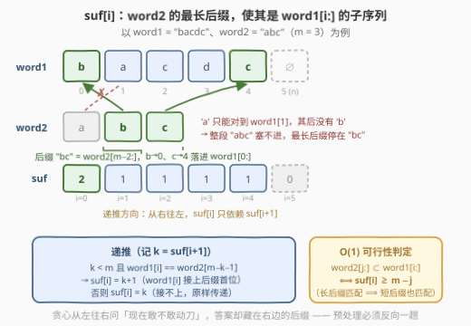
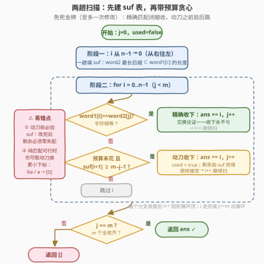
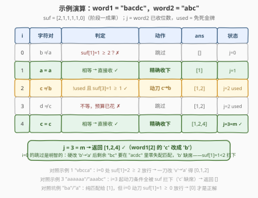

# 字典序最小的合法序列

- **题目名称**：字典序最小的合法序列
- **链接**：[3302. 字典序最小的合法序列](https://leetcode.cn/problems/find-the-lexicographically-smallest-valid-sequence/)
- **难度**：中等
- **标签**：贪心、双指针、字符串、动态规划
- **关联**：392（判断子序列）是本题「修改次数 = 0」的退化版；本题在其上加了一张「至多改一次」的免死金牌

## 1. 题目概述

给你两个字符串 `word1` 和 `word2`：

- 如果一个字符串 `x` **修改至多一个字符**会变成 `y`，称 `x` 与 `y` **几乎相等**；
- 一个**升序**下标序列 `seq` 是**合法的**，当且仅当把 `word1` 中这些下标对应的字符按顺序连接，得到一个与 `word2` 几乎相等的字符串。

请你返回**长度为 `word2.length`** 的**字典序最小**的合法下标序列；不存在则返回空数组。

**示例 1**：

```text
输入：word1 = "vbcca", word2 = "abc"
输出：[0,1,2]
解释：把 word1[0] 的 'v' 改成 'a'，word1[1]='b'、word1[2]='c' 原样匹配。
```

**示例 2**：

```text
输入：word1 = "bacdc", word2 = "abc"
输出：[1,2,4]
解释：word1[1]='a' 原样匹配；把 word1[2] 的 'c' 改成 'b'；word1[4]='c' 原样匹配。
```

**示例 3**：

```text
输入：word1 = "aaaaaa", word2 = "aaabc"
输出：[]
解释：'c' 在 word1 中根本不出现，一次修改也补不出两个失配位，无解。
```

**示例 4**：

```text
输入：word1 = "abc", word2 = "ab"
输出：[0,1]
解释：word2 就是 word1 的前缀，零修改直接匹配。
```

**约束条件**：

- $1 \le \text{word2.length} < \text{word1.length} \le 3 \times 10^5$
- `word1` 和 `word2` 都只包含小写英文字母

> 💡 **读题关键**：① 「几乎相等」= 匹配过程中**至多失配一次**，相当于手握一张可以随时打出、也可以不打的「免死金牌」；② 要求的是**下标数组**的字典序最小，**不是**拼接出的字符串字典序最小——贪心方向因此是「每个下标尽可能靠前」，而非「字符尽可能小」；③ 「下标尽可能靠前」必须与「剩余部分仍然可解」耦合判断，否则一刀改错位置就把后路堵死——这正是需要后缀 DP 提供 $O(1)$ 可行性判定的原因。

---

## 2. 解题思路

### 2.1 暴力思路：枚举组合 + 逐个判定

最朴素的做法是枚举 `word1` 中所有 $\binom{n}{m}$ 个长度为 $m$ 的升序下标组合，逐个统计拼接串与 `word2` 的失配数是否 $\le 1$。由于组合枚举天然按字典序输出，第一个通过判定的即为答案。但 $n = 3 \times 10^5$ 时 $\binom{n}{m}$ 是天文数字，完全不可行。

更隐蔽的坑在于**贪心的方向感**：直觉上「先做纯子序列匹配，失败了再想改哪里」，但**不知道这一刀该落在哪**——

- `word1 = "vbcca"`, `word2 = "abc"`：纯贪心最早只能把 `'a'` 对到下标 4，后面 `'b''c'` 无处安放，纯匹配失败；而正确答案 `[0,1,2]` 是把**最前面**的 `'v'` 改成 `'a'`，一刀就盘活全局；
- `word1 = "bacdc"`, `word2 = "abc"`：`'a'` 对到下标 1 之后 `'b'` 消失了，这一刀又该落在**中间**（下标 2）。

改早了后面崩、改晚了前面亏——瓶颈在于：**站在位置 $i$ 决定「是否在这里动刀」时，缺少一个 $O(1)$ 的手段来回答「动刀之后，剩下的 `word2[j+1:]` 还能不能在 `word1[i+1:]` 里原样匹配完」**。这个信息只能来自右边的后缀，需要预处理。

### 2.2 核心观察：后缀子序列 DP + 带预算的贪心



**第一步：定义 `suf[i]`**——`word2` 的最长后缀长度，使得该后缀是 `word1[i:]` 的**子序列**（$0 \le i \le n$，$\text{suf}[n] = 0$）。

它从右往左线性递推（这就是官方 hints 里的 dp 数组）：

$$
\text{suf}[i] = \begin{cases} \text{suf}[i+1] + 1 & \text{若 } \text{suf}[i+1] < m \text{ 且 } \text{word1}[i] = \text{word2}[m - \text{suf}[i+1] - 1] \\ \text{suf}[i+1] & \text{否则} \end{cases}
$$

**递推为什么对**：记 $k = \text{suf}[i+1]$，即 `word2[m-k:]` 是 `word1[i+1:]` 的子序列。若想再往前接一位，`word2[m-k-1:]` 要成为 `word1[i:]` 的子序列，**当且仅当** `word1[i] == word2[m-k-1]`——充分性是「`word1[i]` 对上 `word2[m-k-1]`，剩下的交给 `suf[i+1]`」；必要性是反证：若匹配能绕开 `word1[i]`，则 `word2[m-k-1:]` 也是 `word1[i+1:]` 的子序列，与 `suf[i+1] = k` 的最大性矛盾。

**第二步：$O(1)$ 可行性判定**。由「长后缀能匹配 ⟹ 短后缀也能匹配」（匹配方案砍掉前几位仍是合法方案）：

$$\text{word2}[j:] \text{ 是 } \text{word1}[i:] \text{ 的子序列} \iff \text{suf}[i] \ge m - j$$

**第三步：带预算的贪心扫描**。维护 `j`（`word2` 已匹配位数）与 `used`（免死金牌是否已打）。`i` 从左到右扫：

1. **`word1[i] == word2[j]` → 直接收下**（精确匹配，`j++`）；
2. **否则若 `!used` 且 `suf[i+1] ≥ m-j-1` → 在 `i` 处动刀**（把 `word1[i]` 改成 `word2[j]`），`j++`，`used = true`；
3. 否则跳过 `i`。

扫完后 `j == m` 则返回答案，否则返回空数组。

**规则 1 为什么「永不亏」（交换论证）**：设某个可行解 `S` 跳过了 `i`（虽然 `word1[i] == word2[j]`），把 `word2[j]` 匹配在了 $p > i$：

- 若 `S` 在 `p` 处是**精确匹配**：把 `p` 换成 `i`，剩余部分的匹配区间只会变大不会变小，仍可行，且下标序列字典序更小；
- 若 `S` 在 `p` 处**用了修改**：改成在 `i` 精确匹配，修改名额直接省下不用（「至多一次」允许零次），剩余匹配区间同样只变大，仍可行且更小。

所以见到精确匹配闭眼拿，**绝不会把后面带崩**。

**规则 2 为什么必须判 `suf`**：在 `i` 动刀后预算清零，剩余 `word2[j+1:]` 必须在 `word1[i+1:]` 中**原样**（零失配）匹配完，判定恰是 $\text{suf}[i+1] \ge m-j-1$。不判就乱用会翻车：`word1 = "aaaaaa"`, `word2 = "aaabc"` 在 $i=3$ 处把 `'a'` 硬改成 `'b'`，后面的 `'c'` 依然无着落。反过来，**判过了就放心用**：后缀既然能精确匹配，规则 1 的纯贪心必然把它接完。

**为什么「敢用就用」**：字典序最小 ⟺ 第 $j$ 个下标尽可能小。扫描到 `i` 时，之前每个位置都已被规则 1/2 的条件**证明**「放不下 `word2[j]`」（字符不等、预算已花、或动刀后缀接不上），于是任何延续当前前缀的可行解的第 $j$ 个下标必然 $\ge i+1 > i$——`i` 就是当下可得的下界，既然放下去保证可行，没有理由不占。

> ⚠️ **一个反直觉的细节**：即使 `word2` 本身就是 `word1` 的纯子序列，也可能要**主动用掉**这张金牌来换取更小的下标！例如 `word1 = "ba"`, `word2 = "a"`：纯匹配答案是 `[1]`，但把 `word1[0]` 的 `'b'` 改成 `'a'` 后 `[0]` 更小，才是正解。规则 2 的条件 `suf[1] = 1 ≥ 0` 恰好放行。**「先判纯子序列、成功就特判返回」的写法会在这里 WA**——本题的贪心必须从头到尾带着预算走。

### 2.3 算法流程图



两阶段流水线：**阶段一**从右往左一趟填 `suf`（为「动刀后剩余能否原样接完」提供 $O(1)$ 判定）；**阶段二**从左往右一趟贪心，每步三择一——精确收下 / 动刀收下 / 跳过。红色警示框标出最容易写错的两处：动刀前的 `suf` 判定、以及「精确匹配无条件收下」这一反直觉决策。

### 2.4 示例演算



以 `word1 = "bacdc"`, `word2 = "abc"`（$m = 3$）走一遍。先建后缀表（右往左）：

| $i$ | 4 | 3 | 2 | 1 | 0 |
|-----|---|---|---|---|---|
| $\text{suf}[i]$ | 1 | 1 | 1 | 1 | 2 |

即 $\text{suf} = [2,1,1,1,1,0]$（$i = 4$ 处 `'c'` 接上 `"c"` 得 1；$i=0$ 处 `'b'` 又接上 `"bc"` 得 2）。然后从左往右贪心：

| $i$ | `word1[i]` | `word2[j]` | 判定过程 | 动作 | `ans` | 状态 |
|-----|-----------|-----------|----------|------|-------|------|
| 0 | `b` | `a` | 不等；$\text{suf}[1]=1 \ge 2$？✗ | 跳过 | `[]` | `used=false` |
| 1 | `a` | `a` | 相等 | **精确收下** | `[1]` | `j=1` |
| 2 | `c` | `b` | 不等；`!used` 且 $\text{suf}[3]=1 \ge 1$？✓ | **动刀 `'c'→'b'`** | `[1,2]` | `j=2, used=true` |
| 3 | `d` | `c` | 不等且预算已花 | 跳过 | `[1,2]` | — |
| 4 | `c` | `c` | 相等 | **精确收下** | `[1,2,4]` | `j=3` ✓ |

$j = m$，返回 `[1,2,4]` ✓。注意 $i=0$ 的跳过是**明智的**：若在那里把 `'b'` 改成 `'a'`，剩余 `"bc"` 要在 `"acdc"` 里零失配匹配，而 `'b'` 根本不存在——`suf[1] = 1 < 2` 精准拦下了这刀。对照示例 1（`"vbcca"`）：$i=0$ 处 $\text{suf}[1] = 2 \ge 2$ 放行，一刀改 `'v'→'a'` 直接得 `[0,1,2]` ✓；示例 3（`"aaabc"`）：前三个 `'a'` 精确收下后，$i=3,4,5$ 处动刀条件全被 `suf` 拦下（`'c'` 缺席），$j$ 停在 3，返回 `[]` ✓；示例 4（`"abc"`）：零动刀纯贪心得 `[0,1]` ✓。

---

## 3. 参考代码

### C++

```cpp
class Solution {
  public:
    vector<int> validSequence(string word1, string word2) {
        int n = word1.size(), m = word2.size();
        // 阶段一：suf[i] = word2 的最长后缀作为 word1[i:] 子序列的长度
        vector<int> suf(n + 1, 0);
        for (int i = n - 1; i >= 0; --i) {
            int k = suf[i + 1];
            if (k < m && word1[i] == word2[m - k - 1]) suf[i] = k + 1;
            else suf[i] = k;
        }
        // 阶段二：带一张免死金牌的贪心扫描
        vector<int> ans;
        int j = 0;
        bool used = false;                       // 修改名额是否已花
        for (int i = 0; i < n && j < m; ++i) {
            if (word1[i] == word2[j]) {          // 精确匹配：无条件收下，永不亏
                ans.push_back(i);
                ++j;
            } else if (!used && suf[i + 1] >= m - j - 1) {
                ans.push_back(i);                // 动刀：word1[i] 改成 word2[j]
                ++j;                             // 之后剩余必须原样接完，
                used = true;                     // suf 判定恰好保证这一点
            }
        }
        return j == m ? ans : vector<int>{};
    }
};
```

### Python

```python
class Solution:
    def validSequence(self, word1: str, word2: str) -> List[int]:
        n, m = len(word1), len(word2)
        # 阶段一：suf[i] = word2 的最长后缀作为 word1[i:] 子序列的长度
        suf = [0] * (n + 1)
        for i in range(n - 1, -1, -1):
            k = suf[i + 1]
            if k < m and word1[i] == word2[m - k - 1]:
                suf[i] = k + 1
            else:
                suf[i] = k
        # 阶段二：带一张免死金牌的贪心扫描
        ans, j, used = [], 0, False              # used：修改名额是否已花
        for i, c in enumerate(word1):
            if j == m:
                break
            if c == word2[j]:                    # 精确匹配：无条件收下，永不亏
                ans.append(i)
                j += 1
            elif not used and suf[i + 1] >= m - j - 1:
                ans.append(i)                    # 动刀：word1[i] 改成 word2[j]
                j += 1                           # 之后剩余必须原样接完，
                used = True                      # suf 判定恰好保证这一点
        return ans if j == m else []
```

> 💡 **实现细节**：① `suf` 长度是 `n + 1`，`suf[n] = 0` 是递推地基，扫描时用 `suf[i+1]` 恰好不越界；② 递推里的 `k < m` 防止 `word2[m - k - 1]` 下标越界（后缀已整段匹配时无需再接）；③ 精确匹配分支**没有**可行性判定——这是交换论证担保的，加了反而画蛇添足；④ 动刀分支的条件顺序：先查 `!used` 再查 `suf`，短路掉预算已花的无效查询；⑤ 循环条件 `j < m` 让提前完成时立刻停，返回前用 `j == m` 统一裁决成败，无解情形零特判。

---

## 4. 复杂度分析

| 维度 | 复杂度 | 说明 |
|------|--------|------|
| 时间复杂度 | $O(n + m)$ | 阶段一从右往左一趟 $O(n)$；阶段二从左往右一趟 $O(n)$，每步判定 $O(1)$；$m < n$ 恒成立故合并为 $O(n)$ |
| 空间复杂度 | $O(n)$ | `suf` 数组（不计返回值 `ans` 的 $O(m)$） |
| 暴力对照 | $O\!\left(\binom{n}{m} \cdot m\right)$ | 枚举升序组合按字典序逐一判定，$n = 3\times10^5$ 时天文数字；即便记忆化搜索也需 $O(nm)$ 状态、$9 \times 10^{10}$ 级别 |

实测：四组官方示例分别得 `[0,1,2]` / `[1,2,4]` / `[]` / `[0,1]`；另与「枚举全部 $\binom{n}{m}$ 组合」的暴力对拍随机数据（$n \le 8$、字符集 `abc`、$m \le n$）20 万组全部一致，含「纯子序列可行但仍动刀更优」的坑例（如 `word1="ba", word2="a"` → `[0]`）。

---

## 5. 扩展：把「免死金牌」推广到 k 张

本题的优雅之处在于 $k = 1$ 时「从 $i$ 开始、还剩 $t$ 次修改能否匹配完」这一可行性恰被**一维** `suf` 刻画（动刀之后预算清零，剩余问题退化为纯子序列判定）。若允许 $k \ge 2$ 次修改，一维信息不够用，标准做法是二维 DP：

$$f[i][j] = \text{word2}[j:] \text{ 匹配进 } \text{word1}[i:] \text{ 所需的最少修改次数} = \min\big(f[i+1][j],\ [\text{word1}[i] \ne \text{word2}[j]] + f[i+1][j+1]\big)$$

转移即「跳过 `word1[i]`」与「收下 `word1[i]`（失配则计一次修改）」二择一，$O(nm)$ 时间与空间（可滚动到 $O(m)$）。贪心阶段把判定条件换成 $f[i+1][j+1] \le k - t - 1$（$t$ 为已用额度）即可，交换论证同款成立。本题 $n$ 高达 $3\times10^5$、$O(nm)$ 会超时，正因 $k=1$ 才能坍缩成一维后缀 DP 落进线性复杂度——**「允许几次失配」是子序列匹配问题复杂度的分水岭**。

---

## 6. 面试要点

1. **「字典序最小的下标序列」和「字典序最小的拼接字符串」有何区别？**

   - 完全两个方向。下标序列字典序最小 ⟺ 逐位让**下标尽可能小**，即贪心「能早就早」；拼接字符串字典序最小则关心**字符**的相对大小。本题要的是前者，所以正确的贪心是「精确匹配见到就收、动刀机会敢用就用」，与字符大小毫无关系。混淆两者会直接写错贪心方向。

2. **为什么精确匹配可以无条件收下，不怕把后面带崩？**

   - 交换论证：任何跳过位置 $i$（`word1[i] == word2[j]`）的可行解，若把 `word2[j]` 匹配在 $p > i$，则把 $p$ 换成 $i$ 后匹配区间只增不减、依然可行且字典序更小；若原解在 $p$ 处用了修改，换到 $i$ 后还把修改名额省了下来。两案皆「换血更优」，故收下 $i$ 永不劣。这与纯子序列贪心（392 题）「能早就早」的正确性一脉相承。

3. **`suf[i]` 的递推里，为什么「能接上一位」当且仅当 `word1[i] == word2[m-k-1]`？**

   - 充分性：`word1[i]` 对上 `word2[m-k-1]` 后，剩余 `word2[m-k:]` 由 `suf[i+1] = k` 保证能在 `word1[i+1:]` 里接完。必要性用反证：若 `word2[m-k-1:]` 能匹配进 `word1[i:]` 却不用 `word1[i]`，它就是 `word1[i+1:]` 的子序列，与 `suf[i+1] = k` 的最大性矛盾。这也解释了为什么 `suf` 必须按「最长后缀」而非「最长前缀」定义——贪心从左往右走，问的都是「**右边**还剩多少能接」。

4. **「先判纯子序列、成功就返回」的写法错在哪？举个反例。**

   - 错在漏掉了「纯匹配可行但动刀更优」的情形：`word1 = "ba"`, `word2 = "a"`，纯子序列匹配给 `[1]`，但把 `word1[0]` 改成 `'a'` 得 `[0]`，字典序更小才是正解。免死金牌是「至多」一次——**不用白不用，用了能抢到更靠前的下标就该用**。正确写法让贪心全程带预算，动刀分支条件 `suf[i+1] ≥ m-j-1` 对纯匹配可行的输入同样可能成立。

5. **这套「后缀 DP + 带预算贪心」还能怎么迁移？**

   - 把「一次修改」换成其它预算语义即可复用骨架：2825 把预算换成「每个字符可循环 +1」，同样是从左往右贪心匹配；若预算次数 $k \ge 2$，一维 `suf` 不再够用，需升级为 $f[i][j]$ 最少修改次数的二维 DP（见第 5 节）。共性是三件事：**可行性判定要 $O(1)$（预处理后缀信息）、精确匹配无条件收（交换论证）、动用预算前必须验后路（判定剩余退化为纯匹配）**。

---

## 7. 同类练习题

- [392. 判断子序列](https://leetcode.cn/problems/is-subsequence/)（[站内题解](../0001-0100/392_判断子序列.md)）：本题「预算 = 0」的退化版，纯子序列贪心「能早就早」的交换论证正是规则 1 的地基
- [2486. 追加字符以获得子序列](https://leetcode.cn/problems/append-characters-to-string-to-make-subsequence/)：同款双指针贪心匹配，求「还差几个字符」而非下标序列，练匹配骨架
- [2825. 循环增长使字符串子序列等于另一个字符串](https://leetcode.cn/problems/make-string-a-subsequence-using-cyclic-increments/)：把「至多一次修改」换成「每个字符可选循环 +1」的变体预算，贪心方向对照着体会
- [792. 匹配子序列的单词数](https://leetcode.cn/problems/number-of-matching-subsequences/)：批量子序列判定，用「桶 + 迭代器」把多次贪心匹配摊销到一趟扫描，是 `suf` 之外的另一种预处理思路
- [718. 最长重复子数组](https://leetcode.cn/problems/maximum-length-of-repeated-subarray/)（[站内题解](../1101-1200/718_最长重复子数组.md)）：同样是「后缀方向」的 DP（`f[i][j]` 从后往前递推），对照理解「从右往左预处理、从左往右消费」的分工
