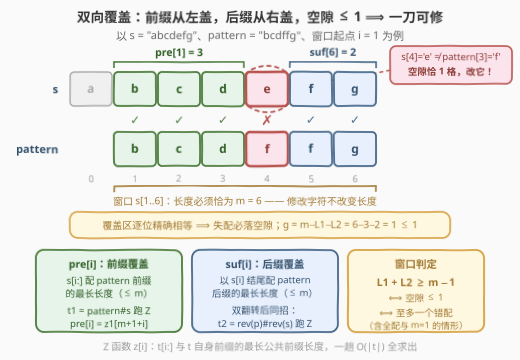
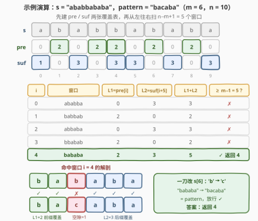

# 第一个几乎相等子字符串的下标

- **题目名称**：第一个几乎相等子字符串的下标
- **链接**：[3303. 第一个几乎相等子字符串的下标](https://leetcode.cn/problems/find-the-occurrence-of-first-almost-equal-substring/)
- **难度**：困难
- **标签**：字符串、字符串匹配、Z 函数（扩展 KMP）
- **关联**：28（找出第一个匹配项的下标）是本题「修改次数 = 0」的精确匹配版；3302（字典序最小的合法序列）是同一个「几乎相等」定义在**子序列**方向的姊妹题，本题考的是**子串**（连续）方向

## 1. 题目概述

给你两个字符串 `s` 和 `pattern`：

- 如果一个字符串 `x` **修改至多一个字符**会变成 `y`，称 `x` 与 `y` **几乎相等**；
- 请返回 `s` 中下标**最小**的子字符串，使它与 `pattern` 几乎相等；不存在则返回 `-1`。

**子字符串**是字符串中**非空、连续**的字符序列。

**示例 1**：

```text
输入：s = "abcdefg", pattern = "bcdffg"
输出：1
解释：将子串 s[1..6] == "bcdefg" 中的 s[4] 变为 "f"，得到 "bcdffg"。
```

**示例 2**：

```text
输入：s = "ababbababa", pattern = "bacaba"
输出：4
解释：将子串 s[4..9] == "bababa" 中的 s[6] 变为 "c"，得到 "bacaba"。
```

**示例 3**：

```text
输入：s = "abcd", pattern = "dba"
输出：-1
```

**示例 4**：

```text
输入：s = "dde", pattern = "d"
输出：0
```

**约束条件**：

- $1 \le \text{pattern.length} < \text{s.length} \le 10^5$
- `s` 和 `pattern` 都只包含小写英文字母

> 💡 **读题关键**：① 「修改字符」不改变**长度**——与 `pattern` 几乎相等的子串长度必须**恰好为** $m$，问题瞬间坍缩成「枚举 $n - m + 1$ 个长度为 $m$ 的定长窗口，判定失配数是否 $\le 1$」；② 约束是 $m < n$ **严格小于**，窗口至少存在一个，特别地 $m = 1$ 时任何单字符窗口都能一刀改成 `pattern[0]`，答案必为 `0`；③ 逐字符比较是 $O(nm) = 10^{10}$，必须把「每个窗口的失配数 $\le 1$」压成 $O(1)$ 可判定——这正是**前缀/后缀双向覆盖**的用武之地。

---

## 2. 解题思路

### 2.1 暴力思路：枚举窗口逐位比较

枚举每个起点 $i \in [0, n-m]$，取出窗口 `s[i..i+m-1]` 与 `pattern` 逐字符比较，统计失配数，$\le 1$ 即命中，从小到大枚举保证首个命中的就是答案。单窗口 $O(m)$，总计 $O(nm)$，$n = m = 10^5$ 量级时约 $10^{10}$ 次比较，不可行。

瓶颈在于**相邻窗口的信息完全不复用**：窗口只滑动一格，$m-1$ 个格子的比较结果几乎原封不动地延续到下一窗口，却被整体重算。破解方向是预处理两张表：

- 从**左端**问：「从 $i$ 开始，`s` 能配上 `pattern` 的**前缀**多长？」——记 `pre[i]`；
- 从**右端**问：「以 $i$ 结尾，`s` 能配上 `pattern` 的**后缀**多长？」——记 `suf[i]`。

这两问恰好都是**前缀匹配**型的问题（后者反转后就是前者），Z 函数（扩展 KMP）可以线性一次性回答全部。

### 2.2 核心观察：Z 函数双向预处理 + 空隙判定



**第一步：定义两张覆盖表**（即官方 hints 里的 dp1 / dp2）：

- $\text{pre}[i]$：$\text{s}[i:]$ 与 `pattern` **前缀**的最长匹配长度（$\le m$）；
- $\text{suf}[i]$：以 $\text{s}[i]$ **结尾**的后缀与 `pattern` **后缀**的最长匹配长度（$\le m$）。

**第二步：窗口判定**。取窗口 $[i, i+m-1]$，记 $L_1 = \text{pre}[i]$、$L_2 = \text{suf}[i+m-1]$：

$$\boxed{\;L_1 + L_2 \ge m - 1 \iff \text{窗口与 pattern 至多差一个字符}\;}$$

直观图景：**前缀覆盖从左往右盖住 $L_1$ 格，后缀覆盖从右往左盖住 $L_2$ 格**，中间未被覆盖的「空隙」长度为 $m - L_1 - L_2$。空隙 $\le 1$ 即几乎相等。

**正确性证明（两个方向）**：

- **充分**（$\ge m-1 \Rightarrow$ 至多一个错配）：覆盖区的格子由定义**逐位精确相等**；失配的格子只可能落在空隙里，而空隙 $\le 1$ 格，故失配数 $\le 1$。
- **必要**（至多一个错配 $\Rightarrow \ge m-1$）：若窗口完全匹配，则 $\text{pre}[i] = m$，$L_1 + L_2 \ge m$；若恰有一个失配位 $p$，则 $[i, p-1]$ 全配 $\Rightarrow \text{pre}[i] \ge p - i$，$[p+1, i+m-1]$ 全配 $\Rightarrow \text{suf}[i+m-1] \ge i+m-1-p$，两式相加恰为 $m - 1$。

> ⚠️ **两个容易踩的细节**：
> ① **判定必须写 $\ge m-1$ 而不是 $= m-1$**（官方 hint 给的是等式，只覆盖「恰一个错配」）：完全匹配时 $L_1 + L_2 \ge m$，$m = 1$ 时 $\ge 0$ 恒成立（单字符窗口总能改），都必须放行，写 `==` 会漏解；
> ② 空隙**中间**的格子可能「碰巧」相等（比如空隙 3 格但中间那格恰好对上），但这不影响等价性——证明只用到「覆盖区必精确匹配」与「空隙长度是失配数的上界」，中间格是否相等无关紧要。

**第三步：Z 函数线性求出两张表**。$z[i]$ 定义为「$t[i:]$ 与 $t$ 自身**前缀**的最长公共前缀长度」，可在 $O(|t|)$ 内整体求出（维护「最右匹配匣」$[l, r)$：$i$ 在匣内时先抄 $z[i-l]$ 的旧账再裸扩，每次裸扩都推进 $r$，总扩展次数均摊线性）：

- **求 pre**：拼接 $t_1 = \text{pattern} + \#{} + \text{s}$（`#` 不在小写字母表，天然截断匹配、保证 $z$ 值不超过 $m$）。$t_1$ 从 $m+1+i$ 起的后缀对应 $\text{s}[i:]$，它与 $t_1$ 前缀（即 `pattern` 前缀）的最长匹配正是 $\text{pre}[i]$：

$$\text{pre}[i] = z_1[m + 1 + i]$$

- **求 suf**：后缀匹配不好直接算，**把两个串都左右翻转**——`s` 的后缀变成反转串的前缀，`pattern` 的后缀变成反转 `pattern` 的前缀，于是套用同一招。对 $t_2 = \text{reverse}(\text{pattern}) + \#{} + \text{reverse}(\text{s})$ 跑 Z 函数（原下标 $i \leftrightarrow$ 反转下标 $n-1-i$）：

$$\text{suf}[i] = z_2[m + 1 + (n - 1 - i)]$$

> 💡 **为什么选 Z 函数而不是 KMP**：$z[i]$ 的语义「与**前缀**的最长匹配」和 `pre` 的定义**完全同构**，拼接一次即得；KMP 的失配数组是「最长 border」语义，求「每个起点的最长前缀匹配」需要额外跑一遍匹配过程绕一圈。两者都是线性，Z 函数在这道题里语义更直接、代码更短。

### 2.3 算法流程图


三阶段流水线：**阶段一/二并行**——两次「拼接 + Z 函数」分别产出 `pre` 表与 `suf` 表；**阶段三**从左往右扫窗口，每个窗口 $O(1)$ 读出 $L_1 + L_2$ 与 $m - 1$ 比大小，首个放行的起点即答案。红色警示框标出最易写错的一处：判定条件是 $\ge$ 不是 $==$。

### 2.4 示例演算



以 `s = "ababbababa"`、`pattern = "bacaba"`（$m = 6$，$n = 10$）走一遍。先建两张表：

| $i$ | 0 | 1 | 2 | 3 | 4 | 5 | 6 | 7 | 8 | 9 |
|-----|---|---|---|---|---|---|---|---|---|---|
| $\text{pre}[i]$ | 0 | 2 | 0 | 2 | 2 | 0 | 2 | 0 | 2 | 0 |
| $\text{suf}[i]$ | 1 | 0 | 3 | 0 | 3 | 3 | 0 | 3 | 0 | 3 |

（例：$\text{pre}[4] = 2$：`s[4:6] == "ba"` 接上 `pattern` 前两位，第三位 `s[6]='b'` 撞上 `pattern[2]='c'` 停下；$\text{suf}[9] = 3$：尾部 `"aba"` 恰是 `pattern` 的后三位，再往前 `s[6]='b'` 撞 `pattern[2]='c'` 停下。）

然后从左往右扫 $n - m + 1 = 5$ 个窗口：

| $i$ | 窗口 | $L_1 = \text{pre}[i]$ | $L_2 = \text{suf}[i+5]$ | $L_1 + L_2$ | $\ge 5$？ |
|-----|------|----|----|----|----|
| 0 | `ababba` | 0 | 3 | 3 | ✗ |
| 1 | `babbab` | 2 | 0 | 2 | ✗ |
| 2 | `abbaba` | 0 | 3 | 3 | ✗ |
| 3 | `bbabab` | 2 | 0 | 2 | ✗ |
| 4 | `bababa` | 2 | 3 | **5** | ✓ **返回 4** |

$i = 4$ 的窗口 `"bababa"`：前缀覆盖 `"ba"`（`s[4..5]`），后缀覆盖 `"aba"`（`s[7..9]`），空隙恰 1 格——`s[6]='b'` 对 `pattern[2]='c'` 失配，一刀改 `'b'→'c'` 得 `"bacaba"` ✓，与官方解释完全一致。

对照其余示例：示例 1 在 $i=1$ 处 $\text{pre}[1] = 3$（`"bcd"`）+ $\text{suf}[6] = 2$（`"fg"`）$= 5 = m-1$ 放行；示例 3 四个窗口全被拦下返回 `-1`；示例 4（$m=1$）条件 $\ge 0$ 恒真，直接返回 `0`。

> 💡 一个 reassuring 的细节：$\text{pre}[8] = 2$ 是「匹配跑到 `s` 末尾被迫截断」而非失配（`s[10]` 不存在），但由于窗口判定只用到 $i \le n - m$ 的位置、窗口内格子必然存在，这种截断永远不会混进判定——Z 匹配在窗口内停下必是真实失配（这正是 2.2 节证明里「空隙两端必失配」的依据）。

---

## 3. 参考代码

### C++

```cpp
class Solution {
  public:
    int minStartingIndex(string s, string pattern) {
        int n = s.size(), m = pattern.size();
        auto zFunc = [](const string& t) {          // z[i]: t[i:] 与 t 前缀的最长公共前缀
            int len = t.size();
            vector<int> z(len, 0);
            z[0] = len;
            int l = 0, r = 0;                       // 最右匹配匣 [l, r)
            for (int i = 1; i < len; i++) {
                if (i < r) z[i] = min(r - i, z[i - l]);  // 匣内先抄旧账
                while (i + z[i] < len && t[z[i]] == t[i + z[i]]) z[i]++;  // 裸扩
                if (i + z[i] > r) { l = i; r = i + z[i]; }
            }
            return z;
        };
        // pre[i] = z1[m+1+i]：s[i:] 与 pattern 前缀的最长匹配
        vector<int> z1 = zFunc(pattern + "#" + s);
        // 后缀匹配 --双翻转--> 前缀匹配；原下标 i <-> 反转下标 n-1-i
        string rs(s.rbegin(), s.rend()), rp(pattern.rbegin(), pattern.rend());
        vector<int> z2 = zFunc(rp + "#" + rs);
        for (int i = 0; i + m <= n; i++) {
            int L1 = z1[m + 1 + i];                     // 左端向右的前缀覆盖
            int L2 = z2[m + 1 + (n - 1 - (i + m - 1))]; // 右端向左的后缀覆盖
            if (L1 + L2 >= m - 1) return i;             // 空隙 ≤ 1 ⟺ 几乎相等
        }
        return -1;
    }
};
```

### Python

```python
class Solution:
    def minStartingIndex(self, s: str, pattern: str) -> int:
        n, m = len(s), len(pattern)

        def z_func(t: str) -> list[int]:       # z[i]: t[i:] 与 t 前缀的最长公共前缀
            L = len(t)
            z = [0] * L
            z[0] = L
            l = r = 0                          # 最右匹配匣 [l, r)
            for i in range(1, L):
                if i < r:
                    z[i] = min(r - i, z[i - l])          # 匣内先抄旧账
                while i + z[i] < L and t[z[i]] == t[i + z[i]]:
                    z[i] += 1                            # 裸扩
                if i + z[i] > r:
                    l, r = i, i + z[i]
            return z

        z1 = z_func(pattern + "#" + s)                     # pre[i] = z1[m+1+i]
        z2 = z_func(pattern[::-1] + "#" + s[::-1])         # suf[i] = z2[m+1+(n-1-i)]
        for i in range(n - m + 1):
            L1 = z1[m + 1 + i]                             # 左端向右的前缀覆盖
            L2 = z2[m + 1 + (n - 1 - (i + m - 1))]         # 右端向左的后缀覆盖
            if L1 + L2 >= m - 1:                           # 空隙 ≤ 1 ⟺ 几乎相等
                return i
        return -1
```

> 💡 **实现细节**：① 分隔符 `#` 必须取**不出现在输入字母表**的字符，作用是把 Z 值天然封顶在 $m$，防止 `pattern` 与 `s` 直接粘连造成语义污染；② 反转映射别写反：`s` 反转后下标 $j$ 对应原下标 $n-1-j$，故 $\text{suf}[i]$ 取 $z_2[m+1+(n-1-i)]$，套进窗口右端就是 $z_2[m+1+(n-m-i)]$；③ 循环上界用 `i + m <= n`（等价 $i \le n-m$）而不是 `i < n`，防止 `suf[i+m-1]` 越界；④ $m = 1$ 无需特判——条件 $\ge 0$ 恒真自动返回 `0`。

---

## 4. 复杂度分析

| 维度 | 复杂度 | 说明 |
|------|--------|------|
| 时间复杂度 | $O(n + m)$ | 两次拼接串长度均为 $n + m + 1$，Z 函数线性；最终扫窗口一趟 $O(n)$，每窗 $O(1)$；$m < n$ 恒成立故合并为 $O(n)$ |
| 空间复杂度 | $O(n + m)$ | 两个拼接串与两个 $z$ 数组 |
| 暴力对照 | $O(nm)$ | 枚举窗口逐位比较，$10^5 \times 10^5 = 10^{10}$ 次比较必超时；本题的提速本质是把「每窗 $O(m)$ 的失配统计」拆成「预处理 $O(n+m)$ + 每窗 $O(1)$」 |

实测：四组官方示例分别得 `1` / `4` / `-1` / `0`；另与 $O(nm)$ 暴力对拍随机数据（$n \le 10$、字符集 `abc`、$m < n$）20 万组全部一致，含「完全匹配」「$m=1$」「空隙中间格碰巧相等」等边界情形。

---

## 5. 扩展：官方进阶——至多 k 个**连续**字符可修改

题目追问：若允许修改**至多 $k$ 个连续**字符，如何求解？

答案出人意料地简单：**把判定阈值 $m-1$ 换成 $m-k$，其余一字不改**。

$$L_1 + L_2 \ge m - k \iff \text{空隙} = m - L_1 - L_2 \le k$$

道理在于失配位置的精确刻画：空隙**两端**的格子必失配（Z 匹配在窗口内停下必是真实失配，见 2.4 节），于是**首个失配位恰在空隙左端、末个失配位恰在空隙右端**——失配位的跨度就等于空隙长度 $g$。「修改一段连续 $\le k$ 个字符」能修复所有失配 $\iff$ 失配位全部落进某段长度 $\le k$ 的连续区间 $\iff$ 跨度 $\le k$ $\iff$ $g \le k$。$k=1$ 正是本题。

若放开「连续」限制、允许任意 $k$ 个位置修改，则退化为经典的 **k-mismatch matching**：「跳过首个失配再继续比」的贪心不再成立，标准做法是字符串哈希 + 二分（每个窗口二分定位首个失配、跳过再判，$O(nk\log m)$）乃至 FFT 级技巧，复杂度与分析框架都完全不同——**「连续」这个约束恰恰是 pre/suf 双向覆盖能一击必杀的原因**。

另一个值得知道的替代主解：**字符串哈希 + 二分**（不写 Z 函数也能过）——每个窗口先二分找首个失配位 $p$（前缀哈希逐段比较），再跳过 $p$ 比较剩余后缀，总计 $O(n \log m)$。与 Z 函数解法互为印证：前者「按需查询」，后者「预处理一次、查询 $O(1)$」。

---

## 6. 面试要点

1. **为什么候选子串的长度必须恰好是 $m$？**

   - 「修改一个字符」不改变字符串长度，与 `pattern` 几乎相等的子串必须与它逐位对齐，长度恰为 $m$。于是问题等价于「$n - m + 1$ 个定长窗口中找首个失配数 $\le 1$ 的」，这一步转化是所有后续优化的地基；若读题漏了这一点，会误以为要枚举任意长度子串。

2. **`pre` 和 `suf` 分别怎么在 $O(n+m)$ 内求出？后缀方向为什么要「双翻转」？**

   - `pre`：拼接 $t_1 = \text{pattern} + \#{} + \text{s}$ 跑 Z 函数，$\text{pre}[i] = z_1[m+1+i]$——$z$ 的语义「与自身前缀的最长公共前缀」在拼接串上恰好就是「与 `pattern` 前缀的最长匹配」。`suf`：后缀匹配没有直接的前缀结构，把 `s` 和 `pattern` 同时左右翻转，「以 $i$ 结尾的后缀匹配」就变成「以 $n-1-i$ 开始的前缀匹配」，再套同一招。分隔符 `#` 保证 Z 值封顶在 $m$、两串不粘连。

3. **判定条件为什么必须是 $L_1 + L_2 \ge m - 1$，官方 hint 里的等式为什么不行？**

   - hint 的 $\text{dp1}[i] + i = i + m - 1 - \text{dp2}[\dots]$（即 $L_1 + L_2 = m-1$）只覆盖「恰好一个错配」：窗口完全匹配时 $L_1 + L_2 \ge m$；$m = 1$ 时 $\ge 0$ 恒成立（单字符窗口必可修复）。这两种都必须放行，所以取 $\ge$。等价性的两方向证明见 2.2 节——覆盖区逐位精确相等给出「失配必在空隙」，首尾失配位夹出的下界给出反方向。

4. **空隙中间的格子可能「碰巧相等」，为什么判定依然正确？**

   - 判定只用两个事实：覆盖区的格子**必**精确匹配（所以失配位置全在空隙内，失配数 $\le$ 空隙长）；反之失配数 $\le 1$ 时从失配位向两侧全配推出 $L_1 + L_2 \ge m-1$。中间格是否相等与两个方向都无关——我们统计的是失配数的**上界与下界夹逼**，不是逐格身份。真正要小心的是「空隙两端必失配」依赖「窗口内格子存在」（$i + m \le n$），这正是循环上界写成 `i + m <= n` 的原因。

5. **Z 函数和 KMP 在这道题里怎么选？进阶版（$k$ 个连续字符）怎么改？**

   - 两者同为线性。$z[i]$ 的语义与 `pre` 定义同构，拼接即得；KMP 失配数组是 border 语义，求每个起点的最长前缀匹配得绕道匹配过程。进阶版只需把阈值 $m-1$ 改成 $m-k$：失配位跨度恰等于空隙长度，「修一段连续 $\le k$ 格」$\iff$ 空隙 $\le k$。若允许 $k$ 个**不连续**修改则完全换赛道（哈希二分 $O(nk\log m)$），这正好考察候选人对「连续性约束为何关键」的理解深度。

---

## 7. 同类练习题

- [28. 找出字符串中第一个匹配项的下标](https://leetcode.cn/problems/find-the-index-of-the-first-occurrence-in-a-string/)（[站内题解](../0001-0100/28_找出字符串中第一个匹配项的下标.md)）：精确匹配母题，本题是其「至多一个错配」扩展，先练它再回来体会「覆盖表」为何必要
- [3302. 字典序最小的合法序列](https://leetcode.cn/problems/find-the-lexicographically-smallest-valid-sequence/)（[站内题解](../3301-3400/3302_字典序最小的合法序列.md)）：同一个「几乎相等」定义的**子序列**方向姊妹题，对照「子串=定长窗口双向覆盖」与「子序列=后缀 DP+带预算贪心」两种处理范式
- [214. 最短回文串](https://leetcode.cn/problems/shortest-palindrome/)（[站内题解](../0201-0300/214_最短回文串.md)）：「拼接串 + 跑 KMP/Z」的祖师爷级应用（求 `rev(s)` 后缀与 `s` 前缀的最长匹配），与本题构造 $t_1/t_2$ 的手法同构
- [1392. 最长快乐前缀](https://leetcode.cn/problems/longest-happy-prefix/)（[站内题解](../1301-1400/1392_最长快乐前缀.md)）：border（前缀=后缀）的 longest 版，与 `suf`「后缀方向匹配」的语义呼应
- [3008. 找出数组中的美丽下标 II](https://leetcode.cn/problems/find-beautiful-indices-in-the-given-array-ii/)（[站内题解](../3001-3100/3008_找出数组中的美丽下标II.md)）：拼接串对多个 pattern 分别求出现位置，再归并筛选，同一「拼接 + 线性匹配」构造的批量版
