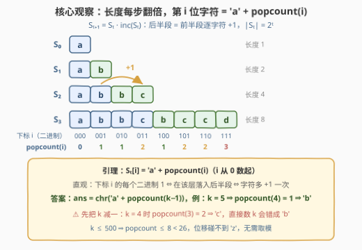
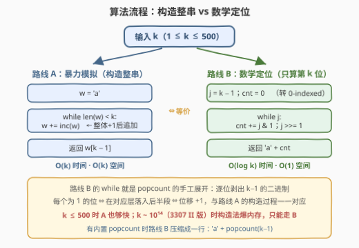
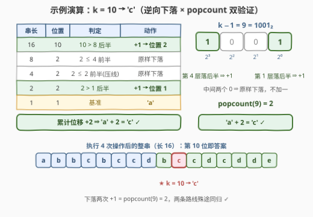

# LeetCode 找出第 K 个字符 I 题解

- **关联**：779（第 K 个语法符号）、1545（第 N 个二进制字符串的第 K 位）同属「自相似倍增串定位第 k 位」家族；3307 是本题带操作数组的升级版

## 1. 题目概述

- **标题 / 题号**：找出第 K 个字符 I（#3304，easy）
- **链接**：https://leetcode.cn/problems/find-the-k-th-character-in-string-game-i/
- **难度**：简单
- **标签**：位运算、递归、数学、模拟

**题意**：Alice 和 Bob 正在玩游戏。最初，Alice 有一个字符串 $\text{word} = \text{"a"}$。

Bob 要求 Alice 执行以下操作**无限次**：

- 将 `word` 中每个字符**更改**为英文字母表中的**下一个**字符来生成新字符串，并将其**追加**到原始的 `word` 末尾。例如 `"c"` 生成 `"cd"`，`"zb"` 生成 `"zbac"`。

在执行足够多的操作后，`word` 中**至少**存在 $k$ 个字符，此时返回 `word` 中第 $k$ 个字符的值。

**示例 1**：

```text
输入：k = 5
输出："b"
解释：word 依次变为 "a" → "ab" → "abbc" → "abbcbccd"，
     第 5 个字符是 'b'。
```

**示例 2**：

```text
输入：k = 10
输出："c"
```

**约束**：

- $1 \le k \le 500$

> 💡 **读题关键**：① 每次操作把当前串**整体追加**到末尾，长度精确翻倍：$1 \to 2 \to 4 \to \cdots$，$t$ 次操作后长度恰为 $2^t$；② 「执行足够多次」意味着操作次数不是输入——只要取最小的 $t$ 使 $2^t \ge k$ 即可（$k \le 500$ 时 $t \le 9$）；③ 题目**只问第 $k$ 个字符**，暗示可以不构造整串、只做定位——这正是从暴力迈向 $O(\log k)$ 的入口。

## 2. 解题思路

### 2.1 暴力思路：直接模拟

最直接的做法是照题意把串造出来：从 `"a"` 出发，每轮把当前串整体 +1 后追加，直到长度 $\ge k$ 再取第 $k$ 位。由于 $k \le 500$，最多 9 轮（$2^9 = 512$），最终串长不超过 512，$O(k)$ 的时间与空间轻松通过——官方 hint 也是这么建议的。

```python
class Solution:
    def kthCharacter(self, k: int) -> str:
        w = 'a'
        while len(w) < k:
            w += ''.join(chr((ord(c) - 97 + 1) % 26 + 97) for c in w)
        return w[k - 1]
```

但这个写法把「不需要的信息」也全算了出来：我们只关心**一个**位置，却构造了整串。若面试官追问「$k$ 放大到 $10^{14}$ 怎么办」（正是姊妹题 3307 的数据范围），构造法当场爆内存——需要只定位、不构造。

### 2.2 核心观察：倍增结构 + $\text{popcount}$ 闭式



记 $S_t$ 为 $t$ 次操作后的串，则结构完全自相似：

$$S_0 = \text{"a"}, \qquad |S_t| = 2^t, \qquad S_{t+1} = S_t \cdot \mathrm{inc}(S_t)$$

其中 $\mathrm{inc}$ 表示「每个字符 +1」。也就是说 $S_{t+1}$ 的**后半段**就是**前半段**逐字符 +1 的镜像。

**关键引理**：按 0-indexed 记位置 $i$，则

$$S_t[i] = \text{'a'} + \operatorname{popcount}(i)$$

**归纳证明**：

- **基础**：$S_0[0] = \text{'a'} = \text{'a'} + \operatorname{popcount}(0)$ ✓
- **步骤**：设对 $S_t$ 成立。看 $S_{t+1}$（长度 $2^{t+1}$）：
  - 若 $i < 2^t$（前半段）：$S_{t+1}[i] = S_t[i] = \text{'a'} + \operatorname{popcount}(i)$；
  - 若 $i \ge 2^t$（后半段）：写 $i = 2^t + r$（$0 \le r < 2^t$），则 $S_{t+1}[i] = \mathrm{inc}(S_t[r]) = \text{'a'} + \operatorname{popcount}(r) + 1$；而 $r < 2^t$ 保证 $i$ 的第 $t$ 个二进制位是 1、其余低位恰为 $r$，故 $\operatorname{popcount}(i) = 1 + \operatorname{popcount}(r)$，两式吻合 ✓

**直观读法**：把 $i$ 的二进制从高位到低位读一遍——每遇到一个 `1`，就表示「在对应那一层，这个位置落在了后半段」，而后半段的字符 = 前半段对应位置 +1。**每个为 1 的二进制位恰好贡献一次 +1**。

于是答案一步写出（注意 $k$ 是 1-indexed，要转成 0-indexed 的 $k-1$）：

$$\boxed{\ \text{ans} = \text{chr}\!\left(\text{'a'} + \operatorname{popcount}(k-1)\right)\ }$$

**溢出检查**：$k \le 500 \Rightarrow k - 1 \le 499 < 2^9 \Rightarrow \operatorname{popcount} \le 8 < 26$，位移绝无绕过 `'z'` 的风险；即便 $k$ 更大，也只需对 26 取模即可。

### 2.3 算法流程图



两条等价路线：**路线 A** 照题意构造整串后取位；**路线 B** 做数学压缩——$j = k-1$，逐位剥出 $j$ 的二进制（`j & 1` 取末位、`j >>= 1` 砍末位），数出 1 的个数 `cnt`，返回 `'a' + cnt`。这个「逐位下落」的循环正是 $\operatorname{popcount}$ 的手工展开，也是没有内置 popcount 的语言里的通用写法；它同时是逆向定位法（见 2.4）的代码形态。

### 2.4 示例演算



以 $k = 10$ 走一遍**逆向下落**（比闭式更「可现场推导」的版本）。取 $t = 4$（$2^4 = 16 \ge 10$），从最外层串长 16 开始，每层问一句「当前位置在前半还是后半」：

| 串长 | 位置 $k$ | 判定 | 动作 |
|------|---------|------|------|
| 16 | 10 | $10 > 8$，落**后半段** | 对应前半位置 $10 - 8 = 2$，**+1** |
| 8 | 2 | $2 \le 4$，前半段 | 原样下落 |
| 4 | 2 | $2 \le 2$，前半段（恰好压线） | 原样下落 |
| 2 | 2 | $2 > 1$，落**后半段** | 对应位置 $2 - 1 = 1$，**+1** |
| 1 | 1 | 基准 | $\text{'a'}$ |

累计位移 $+2$，答案 $\text{'a'} + 2 = \text{'c'}$ ✓。对照闭式：$k - 1 = 9 = 1001_2$，两个 1 各对应一次「落后半段」，$\operatorname{popcount}(9) = 2 \Rightarrow \text{'c'}$，两条路完全吻合。验证示例 1：$k=5$，$k-1=4=100_2$，$\operatorname{popcount}=1 \Rightarrow \text{'b'}$ ✓。

## 3. 参考代码

### C++

```cpp
class Solution {
  public:
    // 写法一：popcount 闭式，O(log k) / O(1)
    char kthCharacter(int k) {
        return 'a' + __builtin_popcount(k - 1);
    }
};

// 写法二：逐位下落（popcount 的手工展开，任何语言可写）
char kthCharacter(int k) {
    int shift = 0;
    for (int j = k - 1; j > 0; j >>= 1)  // 剥二进制位
        shift += j & 1;                   // 每个 1 = 一次「落后半段」的 +1
    return 'a' + shift;
}

// 写法三：暴力模拟（k ≤ 500 同样通过，对照用）
char kthCharacter(int k) {
    string w = "a";
    while ((int)w.size() < k) {
        string t = w;
        for (char &c : t) c = char((c - 'a' + 1) % 26 + 'a');
        w += t;
    }
    return w[k - 1];
}
```

### Python

```python
class Solution:
    def kthCharacter(self, k: int) -> str:
        # 闭式：第 k 个字符 = 'a' + popcount(k-1)
        return chr(ord('a') + bin(k - 1).count('1'))

class Solution:
    def kthCharacter(self, k: int) -> str:
        # 逐位下落：逆向定位法，popcount 的手工展开
        shift, j = 0, k - 1
        while j:
            shift += j & 1    # 末位是 1 ⇒ 在该层落入后半段，+1
            j >>= 1           # 砍掉末位，下落一层
        return chr(ord('a') + shift)

class Solution:
    def kthCharacter(self, k: int) -> str:
        # 暴力模拟对照版
        w = 'a'
        while len(w) < k:
            w += ''.join(chr((ord(c) - 97 + 1) % 26 + 97) for c in w)
        return w[k - 1]
```

> 💡 **实现细节**：① Python 3.10+ 可直接写 `(k - 1).bit_count()`，更地道；② C++ 的 `__builtin_popcount` 接收 `unsigned`，$k-1 \le 499$ 无符号性问题；③ 三种写法对 $k \in [1, 500]$ 全部正确（已对拍验证），面试中先给写法三再优化到写法一是标准的「暴力 → 数学」叙事线。

## 4. 复杂度分析

| 维度 | 复杂度 | 说明 |
|------|--------|------|
| 时间（闭式 / 下落） | $O(\log k)$ | 数 $k-1$ 的二进制位数；$k \le 500$ 时至多 9 次循环 |
| 空间（闭式 / 下落） | $O(1)$ | 只需一个位移计数器 |
| 暴力模拟对照 | $O(k)$ / $O(k)$ | 构造长度 $2^{\lceil \log_2 k \rceil} \le 512$ 的整串；$k$ 到 $10^{14}$ 时内存直接爆炸，凸显定位法的必要性 |

实测：$k=5 \to \text{'b'}$、$k=10 \to \text{'c'}$，且对 $k \in [1, 500]$ 与暴力模拟逐位对拍全部一致。

## 5. 扩展：3307 —— 带操作数组的升级版

姊妹题 [3307. 找出第 K 个字符 II](https://leetcode.cn/problems/find-the-k-th-character-in-string-game-ii/) 把「无限次 +1 追加」换成显式操作数组：`operations[i] == 0` 表示**原样复制**追加（不 +1），`== 1` 表示 +1 后追加；$k \le 10^{14}$、数组长度 $\le 100$。

**长度仍然每步翻倍**（两种操作都追加等长串），所以逆向下落法原样平移：设已定位到「前 $m$ 次操作后的串」（长度 $2^m$），若 $k > 2^{m-1}$ 说明当前位置在**后半段**——$k \mathrel{-}= 2^{m-1}$，且**仅当** $\text{operations}[m-1] = 1$ 时位移 +1；否则位置不动。$m$ 递减到 0 为止：

```python
class Solution:
    def kthCharacter(self, k: int, operations: List[int]) -> str:
        shift, m = 0, len(operations)
        while m > 0:
            half = 1 << (m - 1)
            if k > half:                 # 落在后半段
                k -= half
                shift += operations[m - 1]  # 复制(0)不加一，+1(1)才累计
            m -= 1
        return chr(ord('a') + shift % 26)
```

还能得到 I 版闭式的推广：$\text{ans} = \text{'a'} + \Big(\sum_{i \in \text{bits}(k-1)} \text{operations}[i]\Big) \bmod 26$——$k-1$ 的第 $i$ 个为 1 的二进制位对应第 $i+1$ 层落后半段，贡献 $\text{operations}[i]$。当 `operations` 全为 1 时退化为 $\text{'a'} + \operatorname{popcount}(k-1)$，恰是本题。注意 II 中位移可达 100 > 26，**必须对 26 取模**（'z' 之后绕回 'a'），这是 I 版不会踩到的坑。

## 6. 面试要点

1. **为什么长度恰好是 2 的幂？**

   - 每次操作把当前串**整体**追加到末尾，长度严格翻倍：$2^0 \to 2^1 \to \cdots \to 2^t$。「执行足够多次」就是取最小的 $t$ 使 $2^t \ge k$；$k \le 500$ 时 $t \le 9$，这也是暴力模拟最多只需 9 轮的原因。

2. **$\text{'a'} + \operatorname{popcount}(k-1)$ 的正确性怎么一句话证明？**

   - 归纳：设 $S_t[i] = \text{'a'} + \operatorname{popcount}(i)$，则 $S_{t+1}$ 前半段不变；后半段 $i = 2^t + r$ 处为 $\text{'a'} + \operatorname{popcount}(r) + 1 = \text{'a'} + \operatorname{popcount}(i)$（$r < 2^t$ 保证 $i$ 的第 $t$ 位为 1、低位恰为 $r$）。结构与「每个 1 位 = 一次落后半段的 +1」互为印证。

3. **为什么是 $k-1$ 而不是 $k$？直接数 $k$ 会错在哪？**

   - 引理按 **0-indexed** 对齐：第 0 位是 'a'。1-indexed 的 $k$ 忘减一会把「恰好 2 的幂」的位置算错：$k=4$ 时正确答案是 'c'（`"abbc"` 第 4 位），$\operatorname{popcount}(4-1)=2$ ✓，而 $\operatorname{popcount}(4)=1$ 会错误地给出 'b'。

4. **位移会不会超过 'z'？**

   - 本题不会：$k - 1 \le 499 < 2^9 \Rightarrow \operatorname{popcount} \le 8 < 26$。但 3307（II 版）位移上界是 1 的操作个数（$\le 100$），必须 `% 26`——「先问数据范围、再定要不要取模」是位运算题的基本功。

5. **不记得闭式公式，怎么现场推出来？**

   - 用**逆向下落**：从「能覆盖 $k$ 的最小串长」那层开始，每层问「$k$ 在前半还是后半」——在后半就 +1 并减去半长，在前半就原样下落，落到底（位置 1）累计的 +1 次数即位移。这套流程可原样平移到 779（改数奇偶）与 1545（改翻转/逆序标志），是「倍增串定位」的万能模板。

## 同类练习题

| # | 题目 | 与本题的关联 |
|---|------|-------------|
| 3307 | [找出第 K 个字符 II](https://leetcode.cn/problems/find-the-k-th-character-in-string-game-ii/) | 本题直接升级版——操作分「复制 / 加一」两种且 $k$ 高达 $10^{14}$，逆向下落法原样平移（见第 5 节） |
| 779 | [第 K 个语法符号](https://leetcode.cn/problems/k-th-symbol-in-grammar/)（[站内题解](../0701-0800/779_第K个语法符号.md)） | 同款倍增串定位，答案是 $\operatorname{popcount}(k-1)$ 的**奇偶性**，与本题一母同胞 |
| 1545 | [找出第 N 个二进制字符串的第 K 位](https://leetcode.cn/problems/find-kth-bit-in-nth-binary-string/)（[站内题解](../1501-1600/1545_找出第N个二进制字符串的第K位.md)） | 倍增 + 翻转 + 逆序的三重自相似，逆向下落法进阶练习 |
| 400 | [第 N 位数字](https://leetcode.cn/problems/nth-digit/)（[站内题解](../0301-0400/400_第N位数字.md)） | 同样「数据量巨大、只问第 k 个」，按位数分层缩小规模的定位思想 |
| 191 | [位 1 的个数](https://leetcode.cn/problems/number-of-1-bits/)（[站内题解](../0001-0100/191_位1的个数.md)） | popcount 本尊，`n & (n-1)` 消最低位 1 的技巧是本题闭式公式的基石 |
