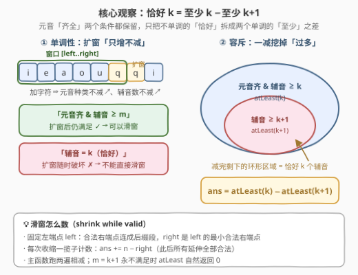
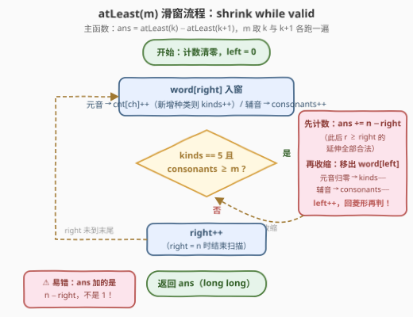
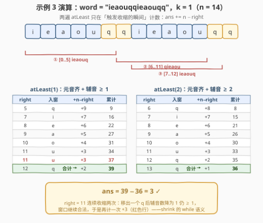

# LeetCode 元音辅音字符串计数 I 题解

- **关联**：3306（版本 II）是本题的数据加强版（$n$ 放大到 $2 \times 10^5$），本文的 $O(n)$ 滑窗解法可直接平移

## 1. 题目概述

- **标题 / 题号**：元音辅音字符串计数 I（#3305，medium）
- **链接**：https://leetcode.cn/problems/count-of-substrings-containing-every-vowel-and-k-consonants-i/
- **难度**：中等
- **标签**：哈希表、字符串、滑动窗口

**题意**：给你一个字符串 `word` 和一个**非负**整数 `k`。

返回 `word` 的**子字符串**中，每个元音字母（`'a'`、`'e'`、`'i'`、`'o'`、`'u'`）**至少出现一次**，并且**恰好**包含 `k` 个辅音字母的子字符串的总数。

**示例 1**：

```text
输入：word = "aeioqq", k = 1
输出：0
解释：不存在包含所有元音字母的子字符串。
```

**示例 2**：

```text
输入：word = "aeiou", k = 0
输出：1
解释：唯一一个包含所有元音字母且不含辅音字母的子字符串是 word[0..4]，即 "aeiou"。
```

**示例 3**：

```text
输入：word = "ieaouqqieaouqq", k = 1
输出：3
解释：包含所有元音字母并且恰好含有一个辅音字母的子字符串有：
     word[0..5] = "ieaouq"、word[6..11] = "qieaou"、word[7..12] = "ieaouq"。
```

**约束**：

- $5 \le \text{word.length} \le 250$
- `word` 仅由小写英文字母组成
- $0 \le k \le \text{word.length} - 5$

> 💡 **读题关键**：① 统计对象是**连续子串**（区间 $[i,\ j]$），条件分两半——**元音看「种类」**（5 种各 $\ge 1$），**辅音看「个数」**（恰好 $k$）；②「恰好」是本题最大的坑：它**不单调**——窗口一扩大辅音数就可能越过 $k$，直接对「恰好」滑窗会漏也会重，必须先容斥拆掉（见 2.2）；③ 版本 I 的 $n \le 250$ 纯属「温柔」——官方 hint 都让你 $O(n^2)$ 暴力过，但姊妹题 [3306. 版本 II](https://leetcode.cn/problems/count-of-substrings-containing-every-vowel-and-k-consonants-ii/)把 $n$ 放大到 $2 \times 10^5$，一份数据两份用，直接写 $O(n)$。

## 2. 解题思路

### 2.1 暴力思路：枚举子串 + 增量计数

官方 hint：*Use a HashMap and check all the substrings.* 双重循环枚举子串起点 $i$、右端 $j$，向右延伸时**增量**维护 5 个元音的计数与辅音总数：元音计数从 0 变 1 时「已齐种类数 +1」，遇到辅音则 `consonants++`；每步检查「种类数 $= 5$ 且辅音数 $= k$」即计入答案。

```python
class Solution:
    def countOfSubstrings(self, word: str, k: int) -> int:
        ans = 0
        for i in range(len(word)):
            cnt = {c: 0 for c in 'aeiou'}
            kinds = cons = 0
            for j in range(i, len(word)):
                ch = word[j]
                if ch in cnt:
                    if cnt[ch] == 0:
                        kinds += 1
                    cnt[ch] += 1
                else:
                    cons += 1
                if kinds == 5 and cons == k:
                    ans += 1
        return ans
```

增量维护让每步判定 $O(1)$，整体 $O(n^2)$：$n \le 250$ 时约 $3 \times 10^4$ 次操作，版本 I 轻松通过；但 $n = 2 \times 10^5$（版本 II）时约 $2 \times 10^{10}$ 次操作，直接超时。

瓶颈与 [3297](../3201-3300/3297_统计重新排列后包含另一个字符串的子字符串数目I.md)如出一辙：**判定信息的浪费**——固定右端点时，「合法起点」其实是一段**连续前缀**，暴力却把每个起点都从头判定一遍。要利用这个结构性冗余，得先解决「恰好」不单调的问题。

### 2.2 核心观察：恰好 k = 至少 k − 至少 k+1



**第一步：容斥拆「恰好」**。把计数目标拆成两个**单调**条件的差：

$$\#\{\text{元音齐，辅音} = k\} \;=\; \#\{\text{元音齐，辅音} \ge k\} \;-\; \#\{\text{元音齐，辅音} \ge k+1\}$$

两个「至少」版本都保留了元音齐全的要求，相减后元音条件不丢、辅音条件从「$\ge k$ 但非 $\ge k+1$」收窄为「恰好 $k$」。

**第二步：确认单调性**。条件「元音 5 种齐 + 辅音 $\ge m$」对**扩窗封闭**：向窗口添加字符（无论从哪一侧进来），元音种类只会增加不会减少、辅音数只会增加——一旦满足就永远满足。于是：

- 固定右端点 $r$，合法左端点连成**前缀段** $[0,\ L(r)]$；
- 固定左端点 $l$，合法右端点连成**后缀段** $[R(l),\ n-1]$。

这正是滑动窗口的甜区：**shrink while valid**——右端点前进、左端点在窗口合法时收缩，每一步均摊 $O(1)$。

**第三步：计数**。收缩发生时窗口 $[\textit{left},\ \textit{right}]$ 合法，且 $\textit{right}$ 恰是 $\textit{left}$ 的**最小合法右端点**（再早不合法、此后恒合法），所以以 $\textit{left}$ 为起点的合法子串共有 $n - \textit{right}$ 个：

$$\textit{ans} \mathrel{+}= n - \textit{right} \qquad (\text{每次收缩})$$

> 💡 **为什么不能直接对「恰好 k」滑窗**：窗口从 $[\textit{left},\ \textit{right}]$ 扩成 $[\textit{left},\ \textit{right}+1]$ 时，辅音数可能从 $k$ 跳到 $k+1$，合法性**双向波动**，左右端点都不单调，双指针无从谈起。容斥的本质是**把不单调的约束外包给两个单调约束之差**——与 [1248. 统计「优美子数组」](../1201-1300/1248_统计优美子数组.md)的「恰好 $K$ 个奇数 = 至多 $K$ − 至多 $K-1$」互为镜像（一个拆「至少」，一个拆「至多」）。

### 2.3 算法流程图



`atLeast(m)` 三步走：① 字符入窗，增量更新元音计数 / 辅音数；② 菱形判定「元音 5 种齐 且 辅音 $\ge m$」，成立则**先计数再收缩**（`ans += n − right`；出窗字符按元音 / 辅音分别回退，`left++`），并回到判定；③ 不成立则 `right++`。主函数对 $m = k$ 与 $m = k+1$ 各跑一遍相减。

### 2.4 示例演算



以 $\text{word} = \text{"ieaouqqieaouqq"},\ k = 1$ 走完全流程（$n = 14$）。**第一遍 `atLeast(1)`**（元音齐 + 辅音 $\ge 1$），只在触发收缩的瞬间计数：

| right | 入窗 | 收缩动作 | $+\,(n-\textit{right})$ | 累计 |
|-------|------|----------|------------------|------|
| 5 | q | 移出 i（元音种类 5→4，停） | $+9$ | 9 |
| 7 | i | 移出 e（种类 5→4，停） | $+7$ | 16 |
| 8 | e | 移出 a（停） | $+6$ | 22 |
| 9 | a | 移出 o（停） | $+5$ | 27 |
| 10 | o | 移出 u（停） | $+4$ | 31 |
| 11 | u | 移出 q（辅音 2→1，仍合法） | $+3$ | 34 |
| 11 | u | 再移出 q（辅音 1→0，停） | $+3$ | 37 |
| 12 | q | 移出 i（停） | $+2$ | 39 |

**第二遍 `atLeast(2)`** 同法：首个计数事件在 right = 6，共 8 次（$8+7+6+5+4+3+2+1$），合计 36。

$$\textit{ans} = \textit{atLeast}(1) - \textit{atLeast}(2) = 39 - 36 = 3\ \checkmark$$

读数细节：right = 11 一连收缩**两次**——移出第一个 q 后辅音数降为 1 仍 $\ge 1$，窗口继续合法，于是再计一次 $n - 11 = 3$，这正是「shrink **while** valid」的 while 语义。三个答案子串 $[0..5],\ [6..11],\ [7..12]$ 与官方一致；示例 1（"aeioqq" 全串无 u）两遍都得 0，示例 2（"aeiou"，$k=0$）得 $1 - 0 = 1$。

## 3. 参考代码

### C++

```cpp
class Solution {
  public:
    long long atLeast(const string& word, int m) {   // 元音齐 + 辅音 >= m 的子串数
        int n = word.size(), left = 0, kinds = 0, consonants = 0;
        int cnt[128] = {0};
        long long ans = 0;
        for (int right = 0; right < n; ++right) {
            char ch = word[right];
            if (isVowel(ch)) {
                if (cnt[ch]++ == 0) ++kinds;         // 凑齐一种新元音
            } else {
                ++consonants;
            }
            while (kinds == 5 && consonants >= m) {  // shrink while valid
                ans += n - right;                    // [left..r] 对一切 r >= right 合法
                char out = word[left++];
                if (isVowel(out)) {
                    if (--cnt[out] == 0) --kinds;    // 少了一种元音
                } else {
                    --consonants;
                }
            }
        }
        return ans;
    }

    int countOfSubstrings(string word, int k) {
        return (int)(atLeast(word, k) - atLeast(word, k + 1));
    }

  private:
    static bool isVowel(char c) {
        return c == 'a' || c == 'e' || c == 'i' || c == 'o' || c == 'u';
    }
};
```

### Python

```python
class Solution:
    def countOfSubstrings(self, word: str, k: int) -> int:
        def at_least(m: int) -> int:                 # 元音齐 + 辅音 >= m 的子串数
            n = len(word)
            vowel_cnt = defaultdict(int)
            consonants = left = 0
            ans = 0
            for right, ch in enumerate(word):
                if ch in 'aeiou':
                    vowel_cnt[ch] += 1
                else:
                    consonants += 1
                while len(vowel_cnt) == 5 and consonants >= m:  # shrink while valid
                    ans += n - right                 # [left..r] 对一切 r >= right 合法
                    out = word[left]
                    if out in 'aeiou':
                        vowel_cnt[out] -= 1
                        if vowel_cnt[out] == 0:
                            del vowel_cnt[out]
                    else:
                        consonants -= 1
                    left += 1
            return ans

        return at_least(k) - at_least(k + 1)
```

> 💡 **实现细节**：① 计数方向别写错：`ans += n - right` 是「以 left 为起点、right 为最小合法右端点」的**一揽子计数**；等价写法是每个 right 处理完后 `ans += left`（数合法左端点个数，3297 同款），两种视角对同一 `atLeast` 等价，但**不能**写成 `ans += 1` 或 `right - left + 1`；② `kinds`（已齐元音种类数）随入窗 / 出窗增量维护，免去每步扫 5 个元音；③ $m = k+1$ 超过全串辅音总数时窗口永不满足，`at_least` 自然返回 0，差值不会为负，$k = 0$ 也无需特判（辅音条件 $\ge 0$ 恒真）；④ 版本 I 答案上限 $\binom{250}{2} \approx 3 \times 10^4$，`int` 足够，但直接用 `long long` 顺手兼容版本 II（$n = 2 \times 10^5$ 时答案约 $2 \times 10^{10}$，超 `int32`）。

实测：三组官方示例分别得 $0 / 1 / 3$；与 $O(n^2)$ 暴力对拍随机数据（$n \le 40$、字母表 $\{a,e,i,o,u,q,z\}$、$0 \le k \le n-5$）20000 组全部一致。

## 4. 复杂度分析

| 维度 | 复杂度 | 说明 |
|------|--------|------|
| 时间复杂度 | $O(n)$ | 两遍线性扫描；每个字符至多入窗一次、出窗一次，左右端点各自单调前进 |
| 空间复杂度 | $O(1)$ | 5 个元音计数 + 辅音数 + 若干游标，常数大小 |
| 暴力对照 | $O(n^2)$ | 版本 I（$n \le 250$）可通过；版本 II（$n = 2 \times 10^5$）超时 |

## 5. 扩展：单趟双窗口——一次扫描同时维护两个左端点

两遍 `atLeast` 最清晰、不易错，但其实可以**一趟扫完**：两个「至少」窗口共享同一个右端点，各自维护左游标 $\textit{left}_1$（阈值 $k$）与 $\textit{left}_2$（阈值 $k+1$）。固定右端点 $r$ 时，两个窗口的合法左端点分别连成前缀 $[0,\ \textit{left}_1 - 1]$ 与 $[0,\ \textit{left}_2 - 1]$，后者是前者的**子前缀**（阈值更紧、合法起点只会更少），于是「恰好 $k$」的合法左端点个数就是 $\textit{left}_1 - \textit{left}_2$：

```python
class Solution:
    def countOfSubstrings(self, word: str, k: int) -> int:
        c1, c2 = defaultdict(int), defaultdict(int)   # 窗口1(阈值 k) / 窗口2(阈值 k+1) 的元音计数
        cons1 = cons2 = l1 = l2 = ans = 0
        for right, ch in enumerate(word):
            if ch in 'aeiou':
                c1[ch] += 1
                c2[ch] += 1
            else:
                cons1 += 1
                cons2 += 1
            while len(c1) == 5 and cons1 >= k:        # 窗口1 收缩到刚不合法
                out = word[l1]
                if out in 'aeiou':
                    c1[out] -= 1
                    if c1[out] == 0:
                        del c1[out]
                else:
                    cons1 -= 1
                l1 += 1
            while len(c2) == 5 and cons2 >= k + 1:    # 窗口2 同理
                out = word[l2]
                if out in 'aeiou':
                    c2[out] -= 1
                    if c2[out] == 0:
                        del c2[out]
                else:
                    cons2 -= 1
                l2 += 1
            ans += l1 - l2                            # 恰好 k 的合法左端点数
        return ans
```

这就是「按右端点逐个计数」视角（每个 $r$ 贡献 $\textit{left}_1 - \textit{left}_2$），与 2.2 的「按左端点一揽子计数」殊途同归；对拍同样全过。面试先讲两遍版（结构清晰、边界少），再亮单趟版展示「同一右端点背两个阈值」的功力，层次感就出来了。

## 6. 面试要点

1. **为什么不能直接对「恰好 k 个辅音」用滑动窗口？**

   - 恰好 $k$ 对扩窗**不封闭**：窗口扩大辅音数可能越过 $k$（合法变非法），缩小时又可能跌破 $k$（非法变合法），合法性双向波动导致左右端点都不单调。转成「至少 $k$ − 至少 $k+1$」后，两个条件各自对扩窗封闭（元音种类、辅音数都只增不减），单调性恢复，才能双指针。这是所有「恰好型」计数题的通用起手式：1248 拆「至多」，本题拆「至少」。

2. **`ans += n - right` 到底在数什么？换个方向怎么数？**

   - 收缩发生时 $[\textit{left},\ \textit{right}]$ 合法且 $\textit{right}$ 是该 $\textit{left}$ 的**最小合法右端点**，此后任意 $r \ge \textit{right}$ 都合法，共 $n - \textit{right}$ 个——按**左端点**一次性计数。等价视角是按**右端点**数：每个 right 处理完后 `ans += left`（合法左端点连成前缀，个数恰为 left），3297 / 2799 用的就是这个方向。两种数法严禁在同一遍里混用，更不能写成 `ans += 1`。

3. **`atLeast(k+1)` 会不会算出负数？$k = 0$ 要特判吗？**

   - 都不会。$m$ 超过全串辅音总数时窗口永不满足，返回 0；「恰好 $k$」集合是「至少 $k$」集合减去其子集，差值非负。$k = 0$ 时 `atLeast(0)` 的辅音条件 $\ge 0$ 恒真，退化为纯元音齐全判定，代码无需任何分支。

4. **为什么是均摊 $O(1)$？和暴力差在哪一步？**

   - right 从 0 走到 $n-1$ 恰 $n$ 步；left 只增不减、至多走到 $n$，全程总收缩步数 $\le n$。暴力把「固定右端点时合法起点是一段前缀」这个结构性冗余白白重算——滑窗靠单调性保证**每个起点只被判定（收缩）一次**，这就是 $O(n^2) \to O(n)$ 的全部来源。

5. **版本 I 和版本 II（3306）解法有区别吗？**

   - 算法零区别——3306 只把 $n$ 放大到 $2 \times 10^5$：暴力 $O(n^2)$ 超时，滑窗 $O(n)$ 通过；工程上把返回类型换成 `long long`（答案约 $2 \times 10^{10}$ 超 `int32`）即可。面试遇到本题最好直接给线性解并主动点名 3306，展示「一份数据两份用」的意识。

## 同类练习题

| # | 题目 | 与本题的关联 |
|---|------|-------------|
| 3306 | [元音辅音字符串计数 II](https://leetcode.cn/problems/count-of-substrings-containing-every-vowel-and-k-consonants-ii/) | 本题的数据加强版（$n \le 2 \times 10^5$），同一份 $O(n)$ 解法直接照搬，验证实现没夹带 $O(n^2)$ 私货 |
| 1248 | [统计「优美子数组」](https://leetcode.cn/problems/count-number-of-nice-subarrays/)（[站内题解](../1201-1300/1248_统计优美子数组.md)） | 同款「恰好 = 单调条件之差」容斥，方向相反（恰好 $K$ 个奇数 = 至多 $K$ − 至多 $K-1$），双面夹击彻底掌握该套路 |
| 2962 | [统计最大元素出现至少 K 次的子数组](https://leetcode.cn/problems/count-subarrays-where-max-element-appears-at-least-k-times/)（[站内题解](../2901-3000/2962_统计最大元素出现至少K次的子数组.md)） | atLeast 型滑窗计数，shrink-while-valid 后数合法左端点，与本文的「一揽子计数」互为镜像 |
| 2799 | [统计完全子数组的数目](https://leetcode.cn/problems/count-complete-subarrays-in-an-array/)（[站内题解](../2701-2800/2799_统计完全子数组的数目.md)） | 「凑齐即终点」的 atLeast 计数，再练一遍合法起点连成前缀的几何直觉 |
| 2537 | [统计好子数组的数目](https://leetcode.cn/problems/count-the-number-of-good-subarrays/)（[站内题解](../2501-2600/2537_统计好子数组的数目.md)） | 「至少 $K$ 对」滑窗计数，其题解恰好反向预告了本题「恰好 = 至少$(K)$ − 至少$(K+1)$」的转化 |
