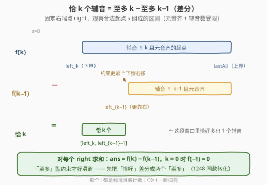
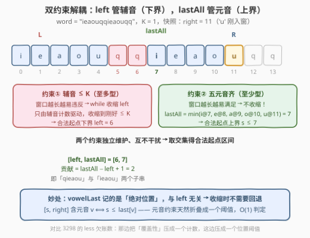
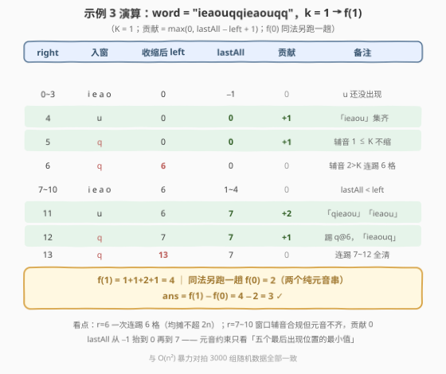

# 元音辅音字符串计数 II

- **题目名称**：元音辅音字符串计数 II
- **链接**：[3306. 元音辅音字符串计数 II](https://leetcode.cn/problems/count-of-substrings-containing-every-vowel-and-k-consonants-ii/)
- **难度**：中等
- **标签**：哈希表、字符串、滑动窗口
- **关联**：[3305（版本 I）](https://leetcode.cn/problems/count-of-substrings-containing-every-vowel-and-k-consonants-i/)是本题的小数据版（$n \le 250$，暴力可过）；本题把 $n$ 放大到 $2 \times 10^5$，考察**差分转化 + 双约束解耦滑窗**的线性解法

## 1. 题目概述

给你一个字符串 `word` 和一个**非负**整数 `k`。

返回 `word` 的**子字符串**中，每个元音字母（`'a'`、`'e'`、`'i'`、`'o'`、`'u'`）**至少出现一次**，并且**恰好**包含 `k` 个辅音字母的子字符串的总数。

**示例 1**：

```text
输入：word = "aeioqq", k = 1
输出：0
解释：不存在包含所有元音字母的子字符串（'u' 根本没出现过）。
```

**示例 2**：

```text
输入：word = "aeiou", k = 0
输出：1
解释：唯一一个包含所有元音字母且不含辅音字母的子字符串是 word[0..4]，即 "aeiou"。
```

**示例 3**：

```text
输入：word = "ieaouqqieaouqq", k = 1
输出：3
解释：满足条件的子字符串有：
     word[0..5] "ieaouq"、word[6..11] "qieaou"、word[7..12] "ieaouq"。
```

**约束条件**：

- $5 \le \text{word.length} \le 2 \times 10^5$
- `word` 仅由小写英文字母组成
- $0 \le k \le \text{word.length} - 5$

> 💡 **读题关键**：① 两个约束方向相反——元音要「至少」、辅音要「恰好」，这正是本题区别于普通滑窗计数题的考点；② $n = 2 \times 10^5$ 时子串总数上界 $\frac{n(n+1)}{2} \approx 2 \times 10^{10}$，答案需要 64 位整数；③ I 版（3305）的 $n \le 250$ 意味着 $O(n^2)$ 暴力能过——II 版的 800 倍数据放大就是判分线。

---

## 2. 解题思路

### 2.1 暴力思路：提前 break 也救不回 $O(n^2)$

最顺手的暴力：固定左端点 $i$ 向右扩 $j$，途中维护元音集合与辅音计数，**辅音一超 $k$ 立即 break**（最优剪枝）：

```cpp
for (int i = 0; i < n; ++i) {
    int cons = 0; unordered_set<char> seen;
    for (int j = i; j < n; ++j) {
        if (isVowel(word[j])) seen.insert(word[j]);
        else if (++cons > k) break;      // 剪枝：再扩只会更多辅音
        if (cons == k && seen.size() == 5) ++ans;
    }
}
```

这个剪枝对「辅音多」的串很有效，但**全元音串**（如 `"aeiouaeiou..."`）辅音永不超标，内层跑满 $n - i$ 步——最坏 $O(n^2) \approx 4 \times 10^{10}$ 步，超时约四个数量级。I 版 $n \le 250$ 时只需 $6 \times 10^4$ 步稳过；II 版必须线性。

### 2.2 核心观察一：恰 k = 至多 k − 至多 k−1（差分）

「恰好」型约束不好滑窗（窗口扩大时辅音数**可能变合法也可能变非法**，不单调），先差分掉：

$$\text{恰好 } k \;=\; \underbrace{\text{辅音} \le k \text{ 且元音齐}}_{f(k)} \;-\; \underbrace{\text{辅音} \le k-1 \text{ 且元音齐}}_{f(k-1)}$$

这是 [1248. 统计「优美子数组」](../1201-1300/1248_统计优美子数组.md)的同款转化：**「至多」型约束对滑窗友好**——窗口越短越容易满足，收缩到刚好合法即可停。



剩下的任务是线性实现 $f(K)$：统计「五元音齐 + 辅音数 $\le K$」的子串数。

### 2.3 核心观察二：双约束解耦——一个指针定下界，一个阈值定上界

固定右端点 $right$，合法起点 $s$ 需同时满足两个**单调方向相反**的条件：

| 约束 | 类型 | 单调方向 | 维护方式 |
|------|------|----------|----------|
| $[s, right]$ 辅音数 $\le K$ | **至多**型 | $s$ 越小越**难**满足 → 有**下界** | `left` 指针：辅音一超 $K$ 就收缩，只由辅音计数驱动 |
| $[s, right]$ 含全部 5 个元音 | **至少**型 | $s$ 越小越**易**满足 → 有**上界** | `lastAll` 阈值：五个元音「最后出现位置」的最小值 |

第二条的折叠是关键：$[s, right]$ 含元音 $v \iff s \le \text{last}[v]$（$\text{last}[v]$ 是 $v$ 在 $\le right$ 处的最后出现位置），于是

$$[s, right] \text{ 五元音齐} \iff s \le \text{lastAll}(right) = \min_{v \in \{a,e,i,o,u\}} \text{last}[v]$$

两个条件取交集，合法起点区间为 $[\text{left}, \text{lastAll}]$，贡献 $\max(0,\ \text{lastAll} - \text{left} + 1)$（某元音从未出现时 $\text{lastAll} = -1$，自然贡献 0）。



> 💡 **为什么 `lastAll` 不需要在收缩时回退？** 它记录的是**绝对位置**，与 `left` 指针完全无关——收缩只看辅音数，元音的「最后出现位置」照常留在数组里。两个约束天然解耦、各自独立维护，这正是本题最值得吸收的设计：**遇到方向相反的双约束，别硬塞进一个 while，拆成「指针 + 阈值」分别定界。**

每步 $O(1)$ 维护辅音计数 + $O(5)$ 求 `lastAll`；`left` 只增不减，均摊 $\le 2n$ 步（与 [3298](../3201-3300/3298_统计重新排列后包含另一个字符串的子字符串数目II.md) 的记账论证相同），单趟严格线性。

### 2.4 示例演算

以示例 3 `word = "ieaouqqieaouqq"`、$k = 1$ 走一遍 $f(1)$（$K = 1$）：



三处看点：

1. **$right = 6$**：第二个 `q` 入窗使辅音达 2，`while` **连踢 6 格**（5 个元音 + 1 个 `q`）到 `left = 6`——收缩由辅音数独裁，元音被误伤也在所不惜，反正 `lastAll` 会兜底判 0；
2. **$right = 7 \sim 10$**：窗口辅音合规但 `lastAll`（1~4）< `left`（6），元音不齐，贡献 0——**「窗口合法」与「有贡献」是两回事**；
3. **$right = 11$**：`u` 入窗把 `lastAll` 抬到 7，贡献 $7 - 6 + 1 = 2$。

合计 $f(1) = 4$；同法另跑一趟得 $f(0) = 2$（即两个纯元音串 `"ieaou"`）；$\text{ans} = 4 - 2 = 3$ ✓。

---

## 3. 参考代码

### C++

```cpp
class Solution {
  public:
    long long countOfSubstrings(string word, int k) {
        auto atMost = [&](int K) -> long long {       // 元音齐 + 辅音 ≤ K 的子串数
            if (K < 0) return 0;                      // k = 0 时 f(-1) = 0
            long long cnt = 0;
            int left = 0, consonants = 0;
            int last[5] = {-1, -1, -1, -1, -1};       // a/e/i/o/u 的最后出现位置
            auto id = [](char c) {
                return c == 'a' ? 0 : c == 'e' ? 1 : c == 'i' ? 2
                     : c == 'o' ? 3 : c == 'u' ? 4 : -1;
            };
            for (int right = 0; right < (int)word.size(); ++right) {
                int v = id(word[right]);
                if (v >= 0) last[v] = right;          // 元音：记绝对位置，不回退
                else ++consonants;
                while (consonants > K) {              // 收缩只由辅音数驱动
                    if (id(word[left++]) < 0) --consonants;
                }
                int lastAll = min({last[0], last[1], last[2], last[3], last[4]});
                if (lastAll >= left) cnt += lastAll - left + 1;
            }
            return cnt;
        };
        return atMost(k) - atMost(k - 1);             // 恰 k = 至多 k − 至多 k−1
    }
};
```

### Python

```python
class Solution:
    def countOfSubstrings(self, word: str, k: int) -> int:
        def at_most(K: int) -> int:                   # 元音齐 + 辅音 ≤ K 的子串数
            if K < 0:                                 # k = 0 时 f(-1) = 0
                return 0
            cnt = left = consonants = 0
            last = {'a': -1, 'e': -1, 'i': -1, 'o': -1, 'u': -1}
            for right, c in enumerate(word):
                if c in last:                         # 元音：记绝对位置，不回退
                    last[c] = right
                else:
                    consonants += 1
                while consonants > K:                 # 收缩只由辅音数驱动
                    if word[left] not in last:
                        consonants -= 1
                    left += 1
                last_all = min(last.values())
                if last_all >= left:
                    cnt += last_all - left + 1
            return cnt
        return at_most(k) - at_most(k - 1)            # 恰 k = 至多 k − 至多 k−1
```

> 💡 **实现细节**：① `atMost` 跑两趟（$K = k$ 与 $K = k - 1$），`k = 0` 时后者直接返回 0；② `last` 初始化为 $-1$ 起哨兵作用——某元音从未出现则 `lastAll = -1 < left` 恒成立，天然贡献 0，无需特判；③ 答案上界 $\approx 2 \times 10^{10}$，C++ 返回值必须 `long long`；④ `lastAll` 在**计贡献时才算** min——`while` 收缩不影响 `last` 数组，两次 `atMost` 各自独立建表。

---

## 4. 复杂度分析

| 维度 | 复杂度 | 说明 |
|------|--------|------|
| 时间复杂度 | $O(n)$ | `atMost` 跑两趟；每趟 `right` 恰走 $n$ 步、`left` 只增不减至多 $n$ 步，每步辅音计数 $O(1)$ + 五元音取 min $O(5)$，合计 $\approx 2 \times (2n + 5n)$ |
| 空间复杂度 | $O(1)$ | 辅音计数一个 int + 5 格 `last` 表，与 $n$ 无关 |
| 暴力对照 | $O(n^2)$ 时间 | 全元音串下提前 break 失效，$\approx 4 \times 10^{10}$ 步，超时约四个数量级（I 版 $n \le 250$ 可过） |

实测：三组官方样例分别得 $0 / 1 / 3$ ✓；与 $O(n^2)$ 暴力对拍随机数据（$n \le 14$，字符集 `aeiouqzx`）3000 组全部一致；$n = 2 \times 10^5$ 随机串 Python 约 0.2 s、C++ 瞬时通过。

---

## 5. 扩展：官方 hint 里的「二分」去哪了

官方 hints 提示 *"sliding window and binary search ... for each index r, find the maximum l such that both conditions are satisfied"*——另一条可行路线：

1. 预处理辅音前缀和 $P[i]$（前 $i$ 个字符中的辅音数），则 $[s, r]$ 的辅音数 $= P[r+1] - P[s]$；
2. 对每个 $r$，**二分**出最小起点 $c_K(r)$ 使 $P[r+1] - P[s] \le K$（$P$ 单调不减，谓词可二分）；
3. 恰好 $k$ 的合法起点区间 $= [\,c_k(r),\ \min(c_{k-1}(r) - 1,\ \text{lastAll}(r))\,]$，逐 $r$ 求和。

总复杂度 $O(n \log n) \approx 3.6 \times 10^6$ 步，$n = 2 \times 10^5$ 下同样轻松通过。但注意 $P[r+1]$ 随 $r$ 单调不减 $\Rightarrow c_K(r)$ 也单调不减——**二分的答案本身是单调的，双指针可以直接平推**。本文的差分解正是把这个观察用足：`left` 指针接管 $c_K$，`lastAll` 阈值接管元音上界，一趟 $O(n)$ 扫完，连二分都省了。

另一个对照是 [3298](../3201-3300/3298_统计重新排列后包含另一个字符串的子字符串数目II.md) 的 `less` 欠账数：那边把「窗口是否覆盖 need」压成一个计数，本题把「元音是否集齐」压成一个位置阈值——同一个设计目标（把窗口合法性压成 $O(1)$ 可判的量），两种武器。

---

## 6. 面试要点

1. **为什么不能像 1248 那样「收缩到恰好不满足，然后 `ans += left`」？**

   - 1248 只有单一「至多」型约束，以 $right$ 结尾的合法起点是前缀 $[0, \text{left})$。本题多了一个反向的「至少」型约束（元音齐）：合法起点不是前缀而是**中段区间** $[\text{left}, \text{lastAll}]$——辅音约束卡下界、元音约束卡上界。双约束方向相反时，必须一个指针定下界 + 一个阈值定上界，单指针模板不再适用。

2. **`lastAll` 为什么不需要随收缩回退？不会算进已经踢出窗口的元音吗？**

   - `last[v]` 记录的是 $v$ 在 $\le right$ 范围内的**绝对最后出现位置**，与窗口 $[\text{left}, right]$ 无关。判定依据是纯逻辑等价：$[s, right]$ 含 $v \iff s \le \text{last}[v]$。收缩只影响辅音下界，元音上界由全局位置决定，二者解耦——这正是「至少」型约束折叠成阈值的标准手法。

3. **主循环 for 套 while，复杂度凭什么是 $O(n)$？**

   - `left` 单调不减，每个下标至多进窗一次、出窗一次，`while` 体全程 $\le n$ 次；加上 `right` 的 $n$ 步，总计 $\le 2n$。示例演算中 $right = 6$ 一次连踢 6 格、$right = 13$ 连踢 7 格，都是此前攒下的富余，总账不超 $2n$。

4. **有哪些边界与溢出坑？**

   - ① 答案上界 $\approx \frac{n(n+1)}{2} \approx 2 \times 10^{10} > 2^{31} - 1$，C++ 必须 `long long`；② $k = 0$ 时 $f(-1)$ 要返回 0 而非死循环（`while consonants > 0` 会把窗口清空，逻辑上仍正确，但显式短路更稳）；③ 某元音从未出现时 `lastAll = -1`，靠初始化哨兵自然归零；④ $k$ 上界 $n - 5$ 保证答案至少可能是 0，不需要特判。

5. **I / II 姊妹题的刷法？**

   - 3305（$n \le 250$）写 $O(n^2)$ 暴力 + 对拍，3306（$n \le 2 \times 10^5$）上线性模板——先小数据验证正确性，再大数据逼出正确复杂度。同款结构见 3297/3298、3260/3261：**II 版的价值不在新算法，而在把「能过」和「该写」分开**。

---

## 7. 同类练习题

- [3305. 元音辅音字符串计数 I](https://leetcode.cn/problems/count-of-substrings-containing-every-vowel-and-k-consonants-i/)：本题的小数据版（$n \le 250$），$O(n^2)$ 暴力可过，正好当对拍基准
- [1248. 统计「优美子数组」](https://leetcode.cn/problems/count-number-of-nice-subarrays/)（[站内题解](../1201-1300/1248_统计优美子数组.md)）：恰好 K 个奇数 = 至多 K − 至多 K−1 的差分母题，本题转化的直接出处
- [992. K 个不同整数的子数组](https://leetcode.cn/problems/subarrays-with-k-different-integers/)：恰好 K 种 = 至多 K 种 − 至多 K−1 种，与本题互为「种类版 / 个数版」镜像
- [2537. 统计好子数组的数目](https://leetcode.cn/problems/count-the-number-of-good-subarrays/)：恰好 k 对相等下标 → atMost 差分，再练一次「先拆恰好再滑窗」
- [3261. 统计满足 K 约束的子字符串数量 II](https://leetcode.cn/problems/count-substrings-that-satisfy-k-constraint-ii/)（[站内题解](../3201-3300/3261_统计满足K约束的子字符串数量II.md)）：同为 I / II 姊妹加强结构，II 版数据范围逼出线性解 + 前缀和应答在线查询
