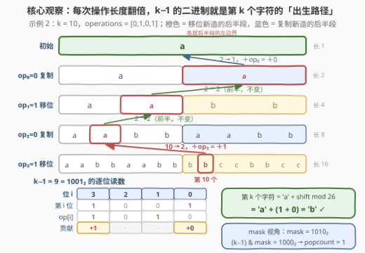
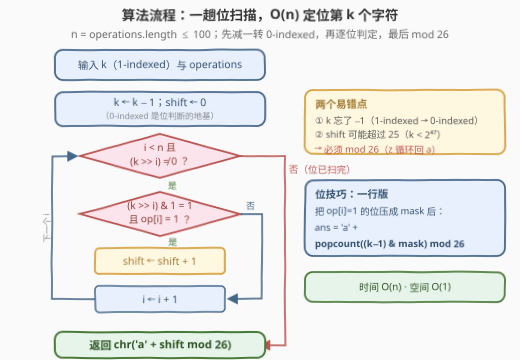
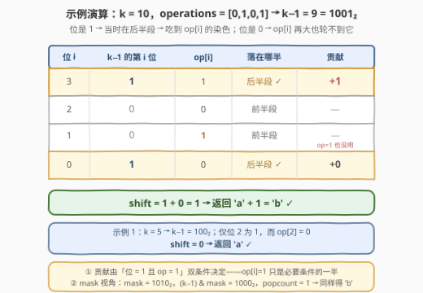

# LeetCode 找出第 K 个字符 II 题解

- **关联**：3304（找出第 K 个字符 I）是本题「所有操作都是移位」的特例，`'a' + popcount(k−1)` 一行即得

## 1. 题目概述

- **标题 / 题号**：找出第 K 个字符 II（#3307，hard）
- **链接**：https://leetcode.cn/problems/find-the-k-th-character-in-string-game-ii/
- **难度**：困难
- **标签**：位运算、递归、数学

**题意**：Alice 初始有一个字符串 `word = "a"`。给定一个**正整数** `k` 和一个整数数组 `operations`，其中 `operations[i]` 表示第 `i` 次操作的**类型**。Alice 需要按顺序执行**所有**操作：

- 若 `operations[i] == 0`，将 `word` 的一份**副本追加**到它自身（长度翻倍）；
- 若 `operations[i] == 1`，将 `word` 中每个字符**更改**为英文字母表中的**下一个**字符（`'z'` 变 `'a'`）生成一个新字符串，并将其**追加**到原始的 `word` 后面（长度同样翻倍）。

在执行所有操作后，返回 `word` 中第 `k` 个字符。

**示例 1**：

```text
输入：k = 5, operations = [0,0,0]
输出："a"
解释："a" → "aa" → "aaaa" → "aaaaaaaa"，三次全是复制，每个字符都是 'a'。
```

**示例 2**：

```text
输入：k = 10, operations = [0,1,0,1]
输出："b"
解释："a" → "aa" → "aabb" → "aabbaabb" → "aabbaabbbbccbbcc"，
     第 10 个字符是 'b'。
```

**约束**：

- $1 \le k \le 10^{14}$
- $1 \le \text{operations.length} \le 100$
- `operations[i]` 是 `0` 或 `1`
- 输入保证在执行所有操作后，`word` 至少有 $k$ 个字符

> 💡 **读题关键**：① 每次操作都让长度**精确翻倍**，$n$ 次操作后长度恰为 $2^n$——这是整个问题的结构骨架；② $k$ 高达 $10^{14}$、操作数最多 100，最终串长可达 $2^{100}$，**绝不可能真的把串造出来**；③ 我们只需要**一个**字符，而每次翻倍时「前一半是旧字符原样、后一半是新生的」边界清清楚楚——正确的方向是沿着第 $k$ 个字符的「血统」**逆向回溯**，而不是正向模拟。

## 2. 解题思路

### 2.1 暴力思路：真的把字符串拼出来

直接模拟：`op=0` 时 `word += word`，`op=1` 时 `word += shift(word)`。最终长度 $2^n$（$n \le 100$）——即使只按 $k \le 10^{14}$ 估计，也至少要物化 $2^{47} \approx 1.4\times10^{14}$ 个字符，内存与拼接时间都是天文数字。

第一步优化是意识到「我只关心第 $k$ 个字符，串本身不必存在」：**逆向看最后一次操作，一次只剥一层**——这正是通往正解的钥匙。

### 2.2 核心观察：倍增结构下，k−1 的二进制就是字符的「出生路径」



三条事实：

**事实一：长度永远翻倍。** 第 $i$ 次操作（0-indexed）把长度 $2^i$ 的串变成 $2^{i+1}$，$n$ 次操作后长度 $2^n$（输入保证 $2^n \ge k$）。

**事实二：每次操作只「生育」后半段。** 第 $i$ 次操作后，前 $2^i$ 个字符是旧串原样拷贝；后 $2^i$ 个是新生的，且若 `op[i]=1`，新生的每个字符 = 前半对应位置字符 $+1$。

**事实三：逆向回溯第 $k$ 个字符。** 站在最终串（长 $2^n$）上看第 $k$ 个字符：

- $k \le 2^{n-1}$：在前半段，最后一次操作与它无关，问题归约为「长 $2^{n-1}$ 的串的第 $k$ 个字符」；
- $k > 2^{n-1}$：在后半段，它等于「长 $2^{n-1}$ 的串的第 $k - 2^{n-1}$ 个字符」再 $+\ \text{op}[n-1]$。

把这条回溯规则摊开，就得到本题的灵魂引理：

> **第 $k$ 个字符在第 $i$ 层（长 $2^{i+1}$ 的串）落在后半段 $\iff$ $k-1$ 的第 $i$ 个二进制位是 1。**

因为后半段恰好覆盖 1-indexed 区间 $(2^i,\ 2^{i+1}]$，即 0-indexed 下标 $[2^i,\ 2^{i+1})$——这正是「$k-1$ 的第 $i$ 位为 1」的区间定义。而回溯时减去 $2^i$ 只是把 $k-1$ 的第 $i$ 位**清零**、低位原样保留，于是**整条回溯路径在出发前就已经写死在 $k-1$ 的二进制里**：第 $i$ 位是 1，字符就在第 $i$ 次操作时出生于后半段、被 `op[i]` 染色一次；第 $i$ 位是 0，它当时在前半段当观众，`op[i]` 与它无关。

字符的最终取值因此水落石出：

$$
\text{ans} = \text{'a'} + \Big(\sum_{i:\ \text{bit}_i(k-1)=1} \text{operations}[i]\Big) \bmod 26
$$

用位运算还能压成一行：令 $\text{mask} = \sum_i \text{operations}[i] \cdot 2^i$（把所有「移位操作」打包成一个 bitmask），则

$$
\text{ans} = \text{'a'} + \operatorname{popcount}\big((k-1)\ \&\ \text{mask}\big) \bmod 26
$$

> 💡 **为什么能 mod 26**：`op=1` 的移位是**循环移位**（`'z'` → `'a'`），等价于字符在 $\mathbb{Z}_{26}$ 上做加法，天然以 26 为周期，多次染色可以直接求和再取模。
>
> ⚠️ **但 mod 不能省**：$k \le 10^{14} < 2^{47}$，$k-1$ 的置位可达 40 个以上，总增量**完全可能超过 25**——忘取模会直接越界出字母表。

### 2.3 算法流程图



两条等价的实现路线：**路线 A** 从低位到高位逐位扫描 $k-1$，第 $i$ 位是 1 且 `op[i]=1` 就 `shift++`；**路线 B** 先把 `op` 压成 `mask`，再 `popcount((k−1) & mask)` 一步到位。两条路线共同的底线：**先 `k−−` 转 0-indexed，最后 mod 26**——前者是位判断的地基，后者是循环字母表的守门员。

### 2.4 示例演算



以示例 2（`k = 10`, `operations = [0,1,0,1]`）走一遍：$k-1 = 9 = 1001_2$。

| 位 $i$ | $k-1$ 的第 $i$ 位 | `op[i]` | 落在哪半 | 贡献 |
|--------|------------------|---------|----------|------|
| 3 | 1 | 1 | 后半段 | **+1** |
| 2 | 0 | 0 | 前半段 | — |
| 1 | 0 | 1 | 前半段 | —（`op=1` 也没用） |
| 0 | 1 | 0 | 后半段 | +0 |

$\text{shift} = 1$ → 答案 = `'a' + 1 = 'b'` ✓。

对照「逐层回溯」验证：第 10 个字符在长 16 的最终串里 $> 8$ → 后半段，回溯到长 8 串的第 2 个字符并 $+\,\text{op}[3]=+1$；$2 \le 4$ → 前半段，原样到长 4 串；$2 \le 2$ → 前半段，原样到长 2 串；$2 > 1$ → 后半段，回溯到 `'a'` 并 $+\,\text{op}[0]=+0$。`'a' + 1 = 'b'`，两条路线一致 ✓。

特别注意第 1 位：`op[1] = 1` 但 $k-1$ 该位是 0——**操作是移位，不代表这个字符被移位**，只有「该位是 1」才轮得到它。mask 视角同样验证：$\text{mask} = 1010_2$，$(k-1)\,\&\,\text{mask} = 1001_2\,\&\,1010_2 = 1000_2$，$\operatorname{popcount} = 1$ → `'b'` ✓。

示例 1：$k = 5 \Rightarrow k-1 = 100_2$，仅第 2 位是 1 而 `op[2] = 0` → $\text{shift} = 0$ → `'a'` ✓。

## 3. 参考代码

### C++

```cpp
class Solution {
  public:
    char kthCharacter(long long k, vector<int>& operations) {
        --k;                                          // 1-indexed → 0-indexed
        int shift = 0;
        for (int i = 0; i < (int)operations.size() && (k >> i); ++i) {
            if (((k >> i) & 1) && operations[i]) {    // 第 i 位为 1：出生于第 i 次操作的后半段
                ++shift;                              // 且该操作是移位 → 被染色一次
            }
        }
        return 'a' + shift % 26;                      // 循环字母表 → mod 26
    }
};
```

位掩码一行版：

```cpp
class Solution {
  public:
    char kthCharacter(long long k, vector<int>& operations) {
        unsigned long long mask = 0;
        for (int i = 0; i < (int)operations.size(); ++i)
            if (operations[i]) mask |= 1ULL << i;     // 把所有移位操作压成 bitmask
        return 'a' + __builtin_popcountll((k - 1) & mask) % 26;
    }
};
```

### Python

```python
class Solution:
    def kthCharacter(self, k: int, operations: List[int]) -> str:
        k -= 1
        shift = 0
        for i, op in enumerate(operations):
            if (k >> i) & 1:      # 第 i 位为 1：出生于第 i 次操作的后半段
                shift += op       # op=1 移位才染色，op=0 复制无贡献
        return chr(ord('a') + shift % 26)
```

位掩码一行版（Python 3.10+ 的 `int.bit_count()`）：

```python
class Solution:
    def kthCharacter(self, k: int, operations: List[int]) -> str:
        mask = 0
        for i, op in enumerate(operations):
            mask |= op << i
        return chr(ord('a') + ((k - 1) & mask).bit_count() % 26)
```

> 💡 **实现细节**：① **先 `k−−`**：所有位判断基于 0-indexed，1-indexed 直接算会整体错位，这是本题最容易翻车的点；② C++ 中 `k` 是 `long long`，`k < 2^47` 使得移位不会越过 63 位，无未定义行为；③ 循环条件里的 `(k >> i)` 是早停——高位全 0 后不必再扫剩余操作；④ **mod 26 不能忘**：总增量可达 40+，超出字母表长度。

## 4. 复杂度分析

| 维度 | 复杂度 | 说明 |
|------|--------|------|
| 时间复杂度 | $O(n)$ | $n = \text{operations.length} \le 100$，一趟位扫描；mask 版本一趟建 mask + 一次 popcount，同为 $O(n)$ |
| 空间复杂度 | $O(1)$ | 只用常数个变量 |
| 暴力对照 | $O(2^n)$ | 真把串物化出来：$n = 100$ 时长度 $2^{100} \approx 1.3\times10^{30}$；即便按 $k \le 10^{14}$ 只造 $2^{47}$ 个字符也完全不可行 |

实测：两组官方示例分别得 `'b'` / `'a'`；另用「真模拟 `word` 直到长度 $\ge k$」的暴力对拍随机数据（$n \le 20$、随机 0/1 操作、$k$ 取遍 $[1, 2^n]$）共数十万组全部一致。

## 5. 扩展：同一棵倍增树上的三条变式

**① 显式回溯写法（不看二进制）**。直接模拟 2.2 的事实三：每轮取 $k-1$ 的最高位 $t$——它标记了当前字符**最早**落入后半段的层（更高层它都在前半段），于是 `shift += op[t]`、`k -= 2^t`，直到 $k = 1$ 回到始祖 `'a'`。它与位扫描版逐位等价，只是把「读二进制位」换成「逐层剥最高位」：

```python
def kthCharacter(self, k: int, operations: List[int]) -> str:
    shift = 0
    while k > 1:
        t = (k - 1).bit_length() - 1     # k−1 的最高位：最早落入后半段的层
        shift += operations[t]
        k -= 1 << t
    return chr(ord('a') + shift % 26)
```

**② 3304（找出第 K 个字符 I）**：那份题面里每次操作固定是「移位追加」，相当于 `operations` 全 1，于是公式坍缩成 $\text{ans} = \text{'a'} + \operatorname{popcount}(k-1) \bmod 26$。本题是它的一般化：**「哪些位计数」由 `operations` 说了算**。

**③ 加权一般化**：若操作不是 0/1 而是任意移位量 $c_i$（甚至负数），公式依然成立：$\text{ans} = \text{'a'} + \big(\sum_i c_i \cdot \text{bit}_i(k-1)\big) \bmod 26$——$k-1$ 的二进制位是一组「开关」，决定每层操作是否作用在这个字符上。1545 把「$+c$ 染色」换成「反转 + 逐位取反」，779 干脆让位本身成为答案——它们和本题长在同一棵倍增二叉树上。

## 6. 面试要点

1. **为什么 $k-1$ 的第 $i$ 位是 1，就代表字符在第 $i$ 次操作时出生于后半段？**

   - 第 $i$ 次操作后串长 $2^{i+1}$，后半段覆盖 1-indexed 区间 $(2^i, 2^{i+1}]$，即 0-indexed 下标 $[2^i, 2^{i+1})$——这正是「$k-1$ 的第 $i$ 个二进制位为 1」的区间定义。回溯时减去 $2^i$ 只清掉第 $i$ 位、低位原封不动，因此每个二进制位**独立**记录一次「前半/后半」的选择，整条路径就是 $k-1$ 的二进制展开。

2. **为什么增量可以直接求和再 mod 26？**

   - 移位是循环移位（`'z'` → `'a'`），等价于字符在 $\mathbb{Z}_{26}$ 上加法，可交换可结合，多次染色的总效果 = 各次增量之和 mod 26。反向提醒：$k-1 < 2^{47}$，置位数可达 40+，**总和可能远超 25**，忘 mod 会越界。

3. **除了位扫描，还有等价写法吗？**

   - 有，显式回溯（见第 5 节）：每轮取 $k-1$ 的最高位 $t$、`shift += op[t]`、`k -= 2^t`，直到 `k == 1`。它是尾递归形态，可无栈展开；位扫描版相当于把它「从低位往高位」批量执行，两者逐位等价。

4. **这题和 1545、779 的异同？**

   - 三题共享「每层长度翻倍 → 沿 $k$ 的二进制从顶向下走」的骨架。差异在每层后半段的变换：本题是 $+\,\text{op}[i]$（染色），1545 是「反转 + 取反」，779 是「取反」。共同点：**都不物化字符串，$O(\log k)$ 定位一个字符**。

5. **为什么 `op[i]=1` 但 $k-1$ 第 $i$ 位是 0 时没有贡献？**

   - 移位操作只作用于**当时新生的后半段**；前半段是旧字符的逐字拷贝。第 $i$ 位为 0 表示该字符在第 $i$ 层位于前半段——它是「观众」不是「演员」。同理 `op[i]=0` 时即便落在后半段也只是复制品，增量照样为 0。

## 同类练习题

| # | 题目 | 与本题的关联 |
|---|------|-------------|
| 3304 | [找出第 K 个字符 I](https://leetcode.cn/problems/find-the-k-th-character-in-string-game-i/) | 本题「operations 全为 1」的特例，`'a' + popcount(k−1) mod 26` 一行即得，先写它再回来体会 mask 的作用 |
| 1545 | [找出第 N 个二进制字符串中的第 K 位](https://leetcode.cn/problems/find-kth-bit-in-nth-binary-string/)（[站内题解](../1501-1600/1545_找出第N个二进制字符串的第K位.md)） | 同款倍增下降，后半段变换换成「反转 + 取反」，回溯时要数的是「穿越次数的奇偶」 |
| 779 | [第K个语法符号](https://leetcode.cn/problems/k-th-symbol-in-grammar/)（[站内题解](../0701-0800/779_第K个语法符号.md)） | 倍增下降的极简版，$k-1$ 的 popcount 奇偶性直接就是答案 |
| 191 | [位 1 的个数](https://leetcode.cn/problems/number-of-1-bits/)（[站内题解](../0001-0100/191_位1的个数.md)） | popcount 本身的基础功，mask 技巧的地基 |
| 400 | [第 N 位数字](https://leetcode.cn/problems/nth-digit/)（[站内题解](../0301-0400/400_第N位数字.md)） | 同属「k 巨大到不可物化，用数学直接定位第 k 个目标」的家族（分层定位 vs 二进制下降） |
