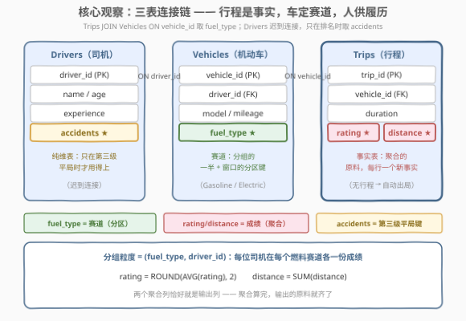
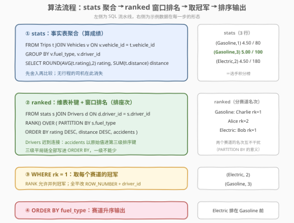
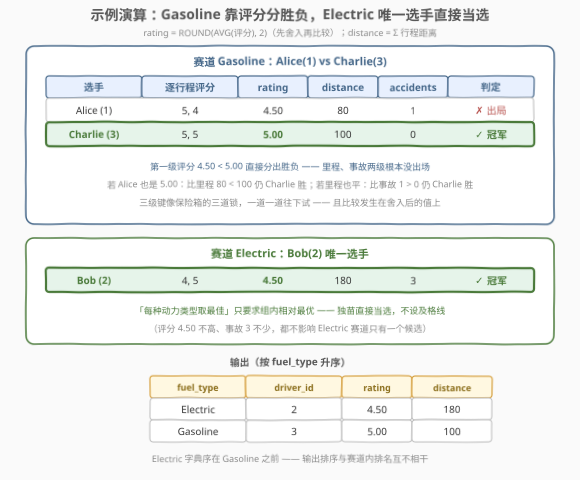
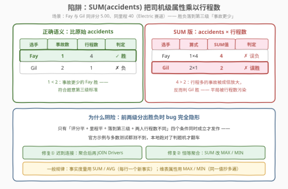

# LeetCode 寻找表现最佳的司机 题解

## 1. 题目概述

- **标题 / 题号**：寻找表现最佳的司机（#3308，medium）
- **链接**：https://leetcode.cn/problems/find-top-performing-driver/
- **难度**：中等
- **标签**：数据库、SQL、JOIN、GROUP BY、聚合、窗口函数、`RANK`、平局打破、LeetCode 锁题

> ⚠️ 本题为 LeetCode 付费题（锁题），题意描述根据官方示例用例与外部资料重建，可能与官方题面有出入。（题面已与社区镜像 doocs/leetcode 的官方中文翻译交叉核对，示例输入输出与 GraphQL 接口返回一致，出入风险较低。）

**表结构**：`Drivers`

| 列名 | 类型 |
|------|------|
| driver_id | int |
| name | varchar |
| age | int |
| experience | int |
| accidents | int |

**表结构**：`Vehicles`

| 列名 | 类型 |
|------|------|
| vehicle_id | int |
| driver_id | int |
| model | varchar |
| fuel_type | varchar |
| mileage | int |

**表结构**：`Trips`

| 列名 | 类型 |
|------|------|
| trip_id | int |
| vehicle_id | int |
| distance | int |
| duration | int |
| rating | int |

- `(driver_id)` 是 `Drivers` 的主键，每行包含司机 ID、姓名、年龄、驾龄年数与事故数；
- `(vehicle_id, driver_id, fuel_type)` 是 `Vehicles` 的主键，每行包含机动车 ID、驾驶员、车型、动力类型与里程数；
- `(trip_id)` 是 `Trips` 的主键，每行包含行程 ID、使用的机动车、行驶距离（米）、行程时长（分钟）与乘客评分（1–5）。

**目标**：优步正在基于司机的行程分析他们的表现。编写一个解决方案，找出**每种动力类型**（`fuel_type`）中**表现最好的司机**：

1. 司机的表现由其行程的**平均评分**衡量，平均评分**舍入到 2 位小数**；
2. 平均评分相同时，**总行驶里程更多**的司机排名更高；
3. 仍然持平时，选择**事故数更少**的司机。

返回 `fuel_type`、`driver_id`、`rating`、`distance` 四列，按 `fuel_type` **升序**排序。

**示例 1**：

```text
输入：Drivers 表
+-----------+----------+-----+------------+-----------+
| driver_id | name     | age | experience | accidents |
+-----------+----------+-----+------------+-----------+
| 1         | Alice    | 34  | 10         | 1         |
| 2         | Bob      | 45  | 20         | 3         |
| 3         | Charlie  | 28  | 5          | 0         |
+-----------+----------+-----+------------+-----------+

Vehicles 表
+------------+-----------+---------+-----------+---------+
| vehicle_id | driver_id | model   | fuel_type | mileage |
+------------+-----------+---------+-----------+---------+
| 100        | 1         | Sedan   | Gasoline  | 20000   |
| 101        | 2         | SUV     | Electric  | 30000   |
| 102        | 3         | Coupe   | Gasoline  | 15000   |
+------------+-----------+---------+-----------+---------+

Trips 表
+---------+------------+----------+----------+--------+
| trip_id | vehicle_id | distance | duration | rating |
+---------+------------+----------+----------+--------+
| 201     | 100        | 50       | 30       | 5      |
| 202     | 100        | 30       | 20       | 4      |
| 203     | 101        | 100      | 60       | 4      |
| 204     | 101        | 80       | 50       | 5      |
| 205     | 102        | 40       | 30       | 5      |
| 206     | 102        | 60       | 40       | 5      |
+---------+------------+----------+----------+--------+

输出：
+-----------+-----------+--------+----------+
| fuel_type | driver_id | rating | distance |
+-----------+-----------+--------+----------+
| Electric  | 2         | 4.50   | 180      |
| Gasoline  | 3         | 5.00   | 100      |
+-----------+-----------+--------+----------+
```

**解释**：

- `Gasoline` 赛道：Alice（司机 1）平均评分 $(5+4)/2=4.50$，Charlie（司机 3）平均评分 $(5+5)/2=5.00$——Charlie 更高，胜出；
- `Electric` 赛道：Bob（司机 2）是唯一司机，平均评分 $(4+5)/2=4.50$，直接胜出。

**约束条件**（依据表结构与示例重建推测）：

- `rating` 取值 1–5；`distance`、`duration` 为正整数；
- 一个司机可能拥有多辆车，多辆车可能属于同一动力类型；
- 没有行程的司机不参与排名（`INNER JOIN` 天然排除）；
- 判题数据规模小。

> 💡 **审题关键**：① 分组粒度是 `(fuel_type, driver_id)` 而**不是** `driver_id`——一个司机若开油车又开电车，会在两个赛道各有一份成绩；② 三条标准是**三级平局打破链**（评分降序 → 里程降序 → 事故升序），必须整体写进排序键；③ 评分要**先舍入再比较**——题目说「表现由舍入到 2 位小数的平均评分计算」。

## 2. 解题思路

### 2.1 暴力思路：应用层全表拉取 + 逐组模拟

最直接的暴力是把三张表整个拉回应用层：

```sql
SELECT * FROM Drivers;
SELECT * FROM Vehicles;
SELECT * FROM Trips;
```

然后在程序里：先在内存里把 `Trips` 按 `vehicle_id` 挂到 `Vehicles`、再按 `driver_id` 挂到 `Drivers`，对每个 `(fuel_type, driver_id)` 组累计评分与距离，最后逐燃料类型做三轮比较（评分 → 里程 → 事故）选出冠军。SQL 只当搬运工，全部连接、分组、比较逻辑外包。

SQL 层的「笨办法」则是**相关子查询**：对每个 `(fuel_type, driver_id)` 组合发一条「算平均评分」的子查询、一条「算总里程」的子查询——同样的行程被反复扫描，聚合被拆成逐组逐列的独立请求。

> ⚠️ 暴力的启示：① 连接 + 二维分组一次就能算完所有人的 `(rating, distance)`，不需要逐组查询；② 三级比较是一条**字典序**（rating, distance, −accidents）上的最值，一个 `ORDER BY` 就能表达，不需要三轮嵌套 `IF`。另外有个反直觉的点：`Drivers` 表的 `accidents` 只在**第三级平局**才用得上——把它过早搅进聚合反而会踩坑（见 2.2）。

### 2.2 核心观察：事实表聚合 + 维表迟到连接 + 窗口 TOP-1



三个观察把问题拆成「一次聚合 + 一次排名」：

| 观察 | 内容 | 带来的做法 |
|------|------|-----------|
| **三表是一条连接链** | `Trips`（事实表）经 `vehicle_id` 挂上 `Vehicles` 取 `fuel_type`，再经 `driver_id` 能挂上 `Drivers` 取 `accidents`。评分与距离在行程上、燃料类型在车上、事故数在人上 | `Trips JOIN Vehicles` 即可支撑聚合；`Drivers` 是**纯维表**，只在排名时才需要 |
| **分组粒度是 (fuel_type, driver_id)** | 每个司机在每种动力类型下各有一份成绩：`ROUND(AVG(rating), 2)` 是表现分，`SUM(distance)` 是总里程——两者恰好就是输出的 `rating` / `distance` 列 | `GROUP BY fuel_type, driver_id` 一次算完所有赛道的所有选手 |
| **三级标准 = 窗口排序键** | 「评分降序、里程降序、事故升序」是一条字典序，直接铺进 `RANK() OVER (PARTITION BY fuel_type ORDER BY ...)`，取 `rk = 1` 即每个赛道的冠军 | 每个燃料类型内部 TOP-1，`PARTITION BY fuel_type` 恰好就是「分赛道」的 SQL 原语 |

两个容易踩的细节先钉死：

- **评分先舍入再比较**：`ROUND(AVG(rating), 2)` 写在聚合里、排名用舍入后的值。若先比未舍入的均值、只在输出时舍入，`4.501` 对 `4.499` 会直接分出胜负；而按题意两者都舍入成 `4.50`，应进入第二级比里程——**舍入发生在比较之前**。
- **`accidents` 不要跟着行程一起 `SUM`**：事故数是司机级属性，把它连进聚合后每行都带着同一个值，`SUM(accidents)` 算出的是「事故数 × 行程数」——行程多的司机事故被成倍放大，第三级平局会判错（详见 2.4 与第 5 节）。正确姿势是聚合完成后**再**连接 `Drivers` 取原始值（或聚合内用 `MAX(accidents)`——组内恒等的属性取 `MAX` 就是它本身）。

### 2.3 算法流程图



| 步骤 | SQL 片段 | 作用 | 示例数据流 |
|------|----------|------|-----------|
| ① 聚合 `stats` | `Trips JOIN Vehicles` → `GROUP BY (fuel_type, driver_id)` | 每位选手一行：`rating = ROUND(AVG(rating), 2)`、`distance = SUM(distance)` | (Gasoline,1): 4.50/80；(Gasoline,3): 5.00/100；(Electric,2): 4.50/180 |
| ② 补维表 | `stats JOIN Drivers ON driver_id` | 取第三级排序键 `accidents` | (Gasoline,1) 补上 accidents=1；(Gasoline,3) 补上 0 |
| ③ 排名 `ranked` | `RANK() OVER (PARTITION BY fuel_type ORDER BY rating DESC, distance DESC, accidents)` | 每个燃料赛道内按三级字典序排名 | Gasoline: Charlie rk=1, Alice rk=2；Electric: Bob rk=1 |
| ④ 取冠军 | `WHERE rk = 1` | 每个赛道的（并列）第一名 | (Electric,2)、(Gasoline,3) |
| ⑤ 输出 | `ORDER BY fuel_type` | 按燃料类型升序 | Electric 在前、Gasoline 在后 |

> 💡 `PARTITION BY fuel_type` 与外层 `ORDER BY fuel_type` 是两件事：前者把排名**切成互不干扰的赛道**（Gasoline 里的名次与 Electric 无关），后者只决定输出的**展示顺序**。窗口的 `ORDER BY` 才是三级标准的载体，三个键一个都不能少。

### 2.4 示例演算



| 赛道 | 选手 | 逐行程评分 | rating（舍入） | distance | accidents | 结果 |
|------|------|-----------|---------------|----------|-----------|------|
| **Gasoline** | Alice (1) | 5, 4 | $(5+4)/2=4.50$ | $50+30=80$ | 1 | 评分低，出局 |
| **Gasoline** | Charlie (3) | 5, 5 | $(5+5)/2=5.00$ | $40+60=100$ | 0 | **冠军**（第一级直接分出） |
| **Electric** | Bob (2) | 4, 5 | $(4+5)/2=4.50$ | $100+80=180$ | 3 | **冠军**（唯一选手） |

两个赛道各讲了一个故事：

- **Gasoline 是「第一级定胜负」的故事**：Alice 与 Charlie 都开油车，评分 $4.50$ 对 $5.00$ 在第一级就分出高下——后面两级（里程、事故）根本轮不到出场。注意比较发生在**舍入后**的值上；
- **Electric 是「独苗直接当选」的故事**：Bob 是电车赛道唯一有行程的司机，无论成绩如何都当选——「每种动力类型取最佳」不要求成绩及格，只要求组内相对最优。

> 💡 官方示例只演示了第一级。三级链的完整行为可以这样脑补：若 Alice 的评分也是 5.00，则比里程 $80<100$，Charlie 仍胜；若里程也打平，则比事故 $1>0$，还是 Charlie 胜。三级键像保险箱的三道锁，一道一道往下试。

## 3. 参考代码

### SQL（解法一：聚合 + 窗口 `RANK`，推荐）

```sql
WITH
    stats AS (
        SELECT
            v.fuel_type,
            v.driver_id,
            ROUND(AVG(t.rating), 2) AS rating,
            SUM(t.distance) AS distance
        FROM Trips t
        JOIN Vehicles v ON v.vehicle_id = t.vehicle_id
        GROUP BY v.fuel_type, v.driver_id
    ),
    ranked AS (
        SELECT
            s.fuel_type,
            s.driver_id,
            s.rating,
            s.distance,
            RANK() OVER (
                PARTITION BY s.fuel_type
                ORDER BY s.rating DESC, s.distance DESC, d.accidents
            ) AS rk
        FROM stats s
        JOIN Drivers d ON d.driver_id = s.driver_id
    )
SELECT fuel_type, driver_id, rating, distance
FROM ranked
WHERE rk = 1
ORDER BY fuel_type;
```

> 💡 **写法要点**：
> - **`stats` 与 `ranked` 分工明确**：前者管「算成绩」（事实表聚合），后者管「排座次」（维表补键 + 窗口）——`Drivers` **迟到连接**，`accidents` 以原始值进排序键，避开 `SUM` 乘法膨胀；
> - **`ROUND` 写在聚合里**：`rating` 从出生起就是舍入后的值，排名与输出用的是同一个数，天然满足「先舍入再比较」；
> - **没有行程的司机自动消失**：`Trips JOIN Vehicles` 是 `INNER JOIN`，无行程的车（如某辆备用车）根本配不上对，无需 `HAVING COUNT(*) > 0` 特判；
> - **`RANK` 允许并列冠军**：三级键全部打平时，同赛道的并列者都会输出（`RANK` 同名次）。若判题要求每赛道恰好一行，把 `RANK()` 换成 `ROW_NUMBER()` 并追加 `driver_id` 作终极排序键（见第 5 节）。

### SQL（解法二：逐级 `MAX`/`MIN` 回连，无窗口函数）

```sql
WITH
    stats AS (
        SELECT
            v.fuel_type,
            v.driver_id,
            ROUND(AVG(t.rating), 2) AS rating,
            SUM(t.distance) AS distance,
            MAX(d.accidents) AS accidents
        FROM Trips t
        JOIN Vehicles v ON v.vehicle_id = t.vehicle_id
        JOIN Drivers d ON d.driver_id = v.driver_id
        GROUP BY v.fuel_type, v.driver_id
    ),
    m1 AS (
        SELECT fuel_type, MAX(rating) AS rating
        FROM stats GROUP BY fuel_type
    ),
    s1 AS (
        SELECT s.* FROM stats s
        JOIN m1 ON m1.fuel_type = s.fuel_type AND m1.rating = s.rating
    ),
    m2 AS (
        SELECT fuel_type, MAX(distance) AS distance
        FROM s1 GROUP BY fuel_type
    ),
    s2 AS (
        SELECT s.* FROM s1 s
        JOIN m2 ON m2.fuel_type = s.fuel_type AND m2.distance = s.distance
    ),
    m3 AS (
        SELECT fuel_type, MIN(accidents) AS accidents
        FROM s2 GROUP BY fuel_type
    )
SELECT s.fuel_type, s.driver_id, s.rating, s.distance
FROM s2 s
JOIN m3 ON m3.fuel_type = s.fuel_type AND m3.accidents = s.accidents
ORDER BY s.fuel_type;
```

> 💡 **解法二的取舍**：
> - 套路是 [586. 订单最多的客户](https://leetcode.cn/problems/customer-placing-the-largest-number-of-orders/)（[站内题解](../0501-0600/586_订单最多的客户.md)）一脉的「**聚合求最值 → 回连筛行**」推广到**多级字典序**：每级做一轮 `MAX`（最后一级是 `MIN`）+ 回连过滤，像漏斗一样逐级收窄——`m1` 筛出每赛道最高评分，`m2` 在最高分中筛最大里程，`m3` 再筛最少事故；
> - 这里 `accidents` 用 `MAX` 直接连进 `stats`：组内 `driver_id` 相同、`accidents` 恒等，`MAX` 就是恒等变换——**组内常量聚合用 MAX/MIN，永远不要用 SUM**；
> - 不依赖窗口函数，MySQL 5.x 等老引擎也能跑；代价是同一份中间结果扫三遍、代码长一截——能用窗口时优先解法一。

### Python（pandas）

```python
import pandas as pd


def find_top_performing_driver(
    drivers: pd.DataFrame, vehicles: pd.DataFrame, trips: pd.DataFrame
) -> pd.DataFrame:
    t = trips.merge(vehicles, on="vehicle_id")
    stats = (
        t.groupby(["fuel_type", "driver_id"], as_index=False)
        .agg(rating=("rating", "mean"), distance=("distance", "sum"))
    )
    stats["rating"] = stats["rating"].round(2)
    stats = stats.merge(drivers[["driver_id", "accidents"]], on="driver_id")
    stats = stats.sort_values(
        ["fuel_type", "rating", "distance", "accidents"],
        ascending=[True, False, False, True],
    )
    best = stats.groupby("fuel_type", as_index=False).head(1)
    return (
        best[["fuel_type", "driver_id", "rating", "distance"]]
        .sort_values("fuel_type")
        .reset_index(drop=True)
    )
```

> 💡 **pandas 对照**（付费题无官方函数签名，函数名按题名约定）：
> - `merge(on="vehicle_id")` 对应 `Trips JOIN Vehicles`；`agg` 的 `("rating", "mean")` + `("distance", "sum")` 对应两个聚合列，`groupby` 两键对应 `GROUP BY fuel_type, driver_id`；
> - `round(2)` 在聚合**之后**、排序**之前**做——与 SQL 版同样贯彻「先舍入再比较」；
> - `sort_values` 四键排序（赛道升、评分降、里程降、事故升）+ `groupby().head(1)` = 窗口 `RANK` 取 `rk=1`。注意用 `head(1)` 而非 `first()`：后者按列取每组第一个**非空值**，列间可能来自不同行；
> - ⚠️ `Series.round` 走 numpy 的**银行家舍入**（half-to-even），MySQL `ROUND` 是四舍五入（half-away-from-zero）。均值恰为 `.xx5` 时（如 8 次行程均值 4.125）两边可能差 `0.01` 进而在平局判定上分岔——判题以 MySQL 语义为准，本地用 pandas 复核时要留意。

## 4. 复杂度分析

设 $T$ 为 `Trips` 行数、$V$ 为 `Vehicles` 行数、$D$ 为 `Drivers` 行数，$G$ 为连接聚合后的 `(fuel_type, driver_id)` 组数（不超过选手对数）。

| 维度 | 复杂度 | 说明 |
|------|--------|------|
| **时间（连接 + 聚合）** | $O(T + V)$ | `Trips ⋈ Vehicles` 按 `vehicle_id` 等值连接：`vehicle_id` 是 `Trips` 的外键、`Vehicles` 的主键，每个行程恰好匹配一辆车，连接输出规模就是 $T$；聚合一次扫完 |
| **时间（排名）** | $O(G\log G)$ | 窗口函数在分区内排序；解法二无排序但 `stats` 要回连扫三遍，$O(3G)$ |
| **空间** | $O(G)$ | 中间结果每组一行，与行程数无关 |
| **结果规模** | $O(\text{燃料类型数})$ | 每种动力类型至多一组冠军（`RANK` 并列时多行） |

> ⚠️ SQL 复杂度取决于执行计划与索引：`vehicle_id`/`driver_id` 有索引时等值连接走 hash/index join。本题三表都是「行程 → 车 → 人」的**多对一**链，连接不会行数膨胀——这是它比自由 JOIN 题好算的根本原因。面试中说明「代价集中在 $G\log G$ 的分区排序，聚合本身线性」即可。

## 5. 扩展：`SUM` 乘法膨胀与 `RANK` vs `ROW_NUMBER`

### 5.1 维表属性聚合的乘法膨胀陷阱



社区流传的写法把 `Drivers` 直接连进聚合、用 `SUM(accidents)` 取事故数：

```sql
SELECT ..., SUM(accidents) accidents
FROM Drivers
JOIN Vehicles USING (driver_id)
JOIN Trips USING (vehicle_id)
GROUP BY fuel_type, driver_id
```

问题在于 `accidents` 是**司机级**属性，连接后每条行程行都携带同一个值，`SUM` 出来的是**事故数 × 行程数**。构造一个反例：

| 选手 | accidents | 行程数 | `SUM(accidents)` | 评份 / 里程 |
|------|-----------|--------|------------------|-------------|
| Fay | 1 | 4 | $1\times 4=4$ | 5.00 / 40 |
| Gil | 2 | 1 | $2\times 1=2$ | 5.00 / 40 |

评分与里程全打平，正确答案应是事故更少的 **Fay**；而 `SUM` 版算出 Fay=4 > Gil=2，反而判 **Gil** 胜——第三级平局被行程数污染。两条修复路线：

- **迟到连接**（解法一）：聚合在事实表上完成后，再把 `Drivers` 连进来取原始 `accidents` 进排序键；
- **恒等聚合**（解法二）：必须聚合时就用 `MAX(accidents)` / `MIN(accidents)`——组内恒等的值，`MAX`/`MIN` 是恒等变换，`SUM` 是乘法变换。

> 💡 一般规律：**事实表的度量用 `SUM`/`AVG`，维表的属性用 `MAX`/`MIN`**。判断标准就一句话——这个列在组内是「每行一个新事实」还是「同一个值抄了多遍」。

### 5.2 `RANK` 还是 `ROW_NUMBER`？

三级排序键 `(rating DESC, distance DESC, accidents ASC)` 仍然可能全打平（同评分、同里程、同事故）。两种选择：

| 选择 | 全打平时的行为 | 适用 |
|------|---------------|------|
| `RANK()` | 并列者同列 `rk=1`，**全部输出** | 判题接受并列冠军（或数据保证无全平） |
| `ROW_NUMBER()` + 追加 `driver_id` | 强行分出名次，输出**恰好一行** | 输出形状要求每赛道一行 |

追加 `driver_id` 作第四级排序键后，排序键在分区内唯一（`driver_id` 单调），`ROW_NUMBER` 结果确定——「不确定的查询」比「错误的查询」更难排查，让每行都有确定的座次是稳妥习惯。

### 5.3 分组粒度选错会怎样

若按 `driver_id` 单键分组（漏掉 `fuel_type`），一个开油车又开电车的司机会被**合并成一份成绩**，参与两个赛道的评选——他在油车赛道的评分里掺了电车的行程，成绩被跨赛道污染。反之，按 `(fuel_type, vehicle_id)` 分组则把同一司机**拆成多份**，一个赛道出现「自己和自己竞争」。**分组键 = 输出的粒度**：题目要「每种动力类型的最佳司机」，输出一行对应一个 `(fuel_type, 冠军)`，分组就必须落在 `(fuel_type, driver_id)` 上。

## 6. 面试要点

1. **为什么分组键是 `(fuel_type, driver_id)` 而不是 `driver_id`？**

   > 因为输出粒度是「每种动力类型的最佳司机」——司机在每个燃料赛道各有一份成绩。按 `driver_id` 单键分组会把一个司机多种燃料的行程合并，污染各赛道的评分；按 `(fuel_type, vehicle_id)` 分组又把同一司机拆成多个选手。**分组键与输出粒度对齐**是 GROUP BY 的第一原则。

2. **三级平局打破怎么用 SQL 表达？漏掉一级会怎样？**

   > 三级标准是一条字典序，整体铺进窗口排序键：`ORDER BY rating DESC, distance DESC, accidents`。漏掉任何一级，窗口在该级就「失去依据」：`RANK` 会让打平者并列输出多行（形状错误），`ROW_NUMBER` 会任取一行（结果不确定）。平局打破键必须全部进 `ORDER BY`，与 3278 等题的「平局键进排序」是同一条铁律。

3. **`accidents` 为什么不能 `SUM`？什么情况下这个 bug 才会发作？**

   > `accidents` 是司机级维表属性，连接后每条行程行携带同一个值，`SUM` 算出「事故数 × 行程数」。**只有当评分与里程都打平、胜负落到第三级、且两人的行程数不同**时才会判错——前两级分出胜负时该 bug 完全隐形。这正是它阴险的地方：官方示例与多数测试都测不到，构造「同评分同里程、事故数少但行程多」的用例才能暴露。修复：迟到连接取原始值，或聚合内改用 `MAX`。

4. **评分的舍入发生在比较之前还是之后？有区别吗？**

   > 题目说「表现由舍入到 2 位小数的平均评分计算」——舍入是定义的一部分，比较发生在舍入后的值上。有区别：均值 4.501 与 4.499 舍入后同为 4.50，按题意应进入第二级比里程；若直接比未舍入值则第一级就分出胜负。写法上把 `ROUND` 放进聚合里、排名用舍入后的列，语义天然正确。

5. **没有行程的司机、没有司机的动力类型各需要特判吗？**

   > 都不需要。`Trips JOIN Vehicles` 是 `INNER JOIN`：无行程的车配不上行程行，其司机根本不进 `stats`；某种燃料类型若无任何行程，该分区为空，排名与输出都无行。两处「消失」都由连接语义天然完成。只有题目改要求「每种燃料类型必输出一行（无行程则 NULL）」时，才需要从 `Vehicles` 出发的 `LEFT JOIN` + `COALESCE`。

> 💡 **一句话总结**：3308 = 三表连接链（事实表 `Trips` 挂 `Vehicles` 取赛道）+ 双键分组聚合（`ROUND(AVG)` 与 `SUM` 恰好就是输出列）+ 窗口三级字典序排名（`PARTITION BY fuel_type` 分赛道，评分降/里程降/事故升）；最大的坑是维表属性 `accidents` 跟着行程 `SUM` 会乘法膨胀——事实度量用 `SUM`，维表属性用 `MAX`/`MIN` 或迟到连接。

## 同类练习题

| # | 题目 | 与本题的关联 |
|---|------|-------------|
| 1077 | [项目员工 III](https://leetcode.cn/problems/project-employees-iii/) | 每个项目取经验最长的员工、平局取最小 `employee_id`——「分组 TOP-1 + 平局打破」完全同构（本题的三级链是其两级链的加长版） |
| 185 | [部门工资前三高的所有员工](https://leetcode.cn/problems/department-top-three-salaries/) | `PARTITION BY department` + `DENSE_RANK` 取组内 Top-N——窗口分赛道排名的原型题（本题取 N=1） |
| 586 | [订单最多的客户](https://leetcode.cn/problems/customer-placing-the-largest-number-of-orders/)（[站内题解](../0501-0600/586_订单最多的客户.md)） | `GROUP BY + COUNT + MAX` 回连取最值——解法二「聚合求最值 → 回连筛行」的极简模板 |
| 178 | [分数排名](https://leetcode.cn/problems/rank-scores/) | `RANK` 与 `DENSE_RANK` 的语义对照（同名次是否跳号）——理解第 5.2 节选型的一页说明书 |
