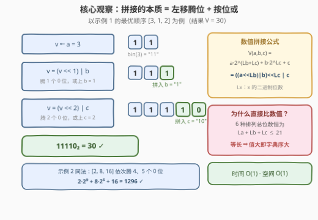
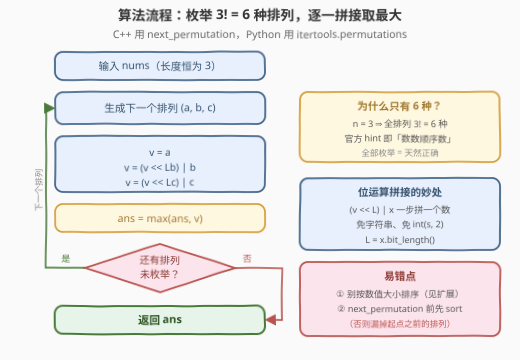
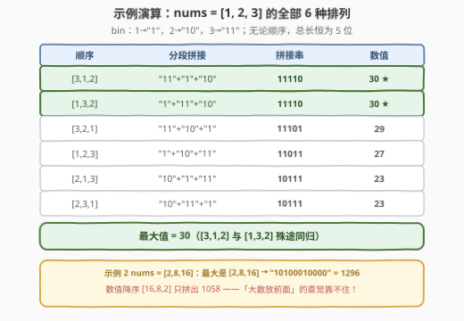
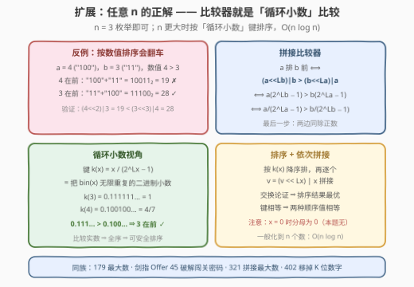

# 连接二进制表示可形成的最大数值

- **题目名称**：连接二进制表示可形成的最大数值
- **链接**：[3309. 连接二进制表示可形成的最大数值](https://leetcode.cn/problems/maximum-possible-number-by-binary-concatenation/)
- **难度**：中等
- **标签**：位运算、数组、枚举
- **关联**：179 最大数是同一套「拼接比较器」在十进制的化身；本题 $n = 3$，直接枚举 $3! = 6$ 种顺序即可

## 1. 题目概述

给你一个长度为 **3** 的整数数组 `nums`。现以某种顺序**连接**（concatenate）数组 `nums` 中所有元素的**二进制表示**，请你返回可以由这种方法形成的**最大**数值。注意任何数字的二进制表示**不含前导零**。

**示例 1**：

```text
输入：nums = [1,2,3]
输出：30
解释：按照顺序 [3, 1, 2] 连接数字的二进制表示，得到结果 "11110"，这是 30 的二进制表示。
```

**示例 2**：

```text
输入：nums = [2,8,16]
输出：1296
解释：按照顺序 [2, 8, 16] 连接数字的二进制表示，得到结果 "10100010000"，这是 1296 的二进制表示。
```

**约束条件**：

- `nums.length == 3`
- $1 \le \text{nums}[i] \le 127$

> 💡 **读题关键**：① 长度恒为 3 → 候选顺序只有 $3! = 6$ 种，官方 hint 也只问一句「有多少种连接顺序」——**枚举就是正解**；② $1 \le \text{nums}[i] \le 127 = 2^7 - 1$ → 每段二进制 $1 \sim 7$ 位且首字符必为 `1`，拼接结果至多 $21$ 位，`int` 毫无压力；③ 无论什么顺序，拼接串长度恒为 $L_a + L_b + L_c$（$L_x$ 表示 $x$ 的二进制位数）→ **所有候选等长**，「数值最大」等价于「拼接串字典序最大」，这为第 5 节的排序解法埋下伏笔。

---

## 2. 解题思路

### 2.1 暴力思路：转字符串拼接

最直接的做法：把每个数转成二进制字符串 `bin(x)[2:]`，枚举 6 种排列，把三段字符串连起来再 `int(s, 2)` 转回数值，取最大。完全正确，只是每步都在分配字符串、扫描字符，既慢又没有洞察。

更危险的「优化」是按直觉排序——**数值大的放前面**或**位数多的放前面**。两个直觉都是错的：示例 2 中数值降序 `[16, 8, 2]` 只拼出 $1058$，而最优顺序 `[2, 8, 16]`（恰好是数值**升**序！）拼出 $1296$。直觉为什么失效、正确的比较器长什么样，放在第 5 节扩展里说清楚。

### 2.2 核心观察：拼接 = 左移腾位 + 按位或，6 种排列直接枚举



三个事实：

**事实一：候选只有 6 个。** 三个元素的全排列 $3! = 6$，把 6 个拼接值都算出来取最大就是答案——不需要任何贪心假设。

**事实二：拼接有位运算公式。** 顺序 $(a, b, c)$ 的拼接值为

$$
V(a,b,c) = a\cdot 2^{L_b + L_c} + b\cdot 2^{L_c} + c = \big((a \ll L_b)\ \vert\ b\big) \ll L_c\ \vert\ c
$$

其中 $L_x$ 是 $x$ 的二进制位数（`bit_length`）。直觉：$a$ 排最前，就要给后面两个数**腾出** $L_b + L_c$ 个低位 `0`——这正是「左移」；腾出的低位全是 `0`，与后续数按位**或**等价于直接**加**上它（无重叠的 1 位、无进位）。于是 `v = (v << L) | x` 一步就把一个数拼了进去，全程不碰字符串。

**事实三：等长性保底。** 6 种排列的拼接串长度恒为 $L_a + L_b + L_c \le 21$，直接比较数值即可。且本题每段首字符必为 `1`（$\text{nums}[i] \ge 1$），天然没有前导零的干扰。

### 2.3 算法流程图



主循环就是「生成排列 → 三步移位拼接 → 更新最大值」。C++ 用 `next_permutation` 枚举，**必须先 `sort`**：do-while 会从起点一路走到字典序最大的排列停住，起点若不是最小排列就会漏掉前面一段；Python 用 `itertools.permutations` 直接生成全部，无此坑。

### 2.4 示例演算



以示例 1（`nums = [1,2,3]`，bin：$1 \to 1$、$2 \to 10$、$3 \to 11$）列出全部 6 种排列：

| 顺序 | 分段拼接 | 拼接串 | 数值 |
|------|----------|--------|------|
| [3,1,2] | "11"+"1"+"10" | 11110 | **30** |
| [1,3,2] | "1"+"11"+"10" | 11110 | **30** |
| [3,2,1] | "11"+"10"+"1" | 11101 | 29 |
| [1,2,3] | "1"+"10"+"11" | 11011 | 27 |
| [2,1,3] | "10"+"1"+"11" | 10111 | 23 |
| [2,3,1] | "10"+"11"+"1" | 10111 | 23 |

最大值 $30$，与示例一致 ✓。注意两个不同顺序拼出同一个最大串——**不同顺序可能殊途同归**，取 `max` 天然覆盖，不必去重。

示例 2 用移位公式对最优顺序 `[2,8,16]` 走一遍：$v = 2 \to (2 \ll 4)\,\vert\,8 = 40 \to (40 \ll 5)\,\vert\,16 = 1296$ ✓。而数值降序 `[16,8,2]`：$v = 16 \to (16 \ll 4)\,\vert\,8 = 264 \to (264 \ll 2)\,\vert\,2 = 1058$——再次印证「按数值排序」不可靠。

---

## 3. 参考代码

### C++

```cpp
class Solution {
    int blen(int x) {                    // x 的二进制位数（本题 x ≥ 1）
        int n = 0;
        while (x) ++n, x >>= 1;
        return n;
    }
  public:
    int maxGoodNumber(vector<int>& nums) {
        sort(nums.begin(), nums.end());  // next_permutation 要从最小排列出发才不漏
        int ans = 0;
        do {
            int v = nums[0];
            for (int i = 1; i < 3; ++i)
                v = (v << blen(nums[i])) | nums[i];   // 左移腾位 + 按位或 = 拼接
            ans = max(ans, v);
        } while (next_permutation(nums.begin(), nums.end()));
        return ans;
    }
};
```

### Python

```python
class Solution:
    def maxGoodNumber(self, nums: List[int]) -> int:
        ans = 0
        for a, b, c in permutations(nums):          # 3! = 6 种顺序
            v = (a << b.bit_length() | b) << c.bit_length() | c
            ans = max(ans, v)
        return ans
```

字符串版（更好懂，性能也足够）：

```python
class Solution:
    def maxGoodNumber(self, nums: List[int]) -> int:
        return max(int(f"{a:b}{b:b}{c:b}", 2)        # f"{x:b}" 即二进制串
                   for a, b, c in permutations(nums))
```

> 💡 **实现细节**：① `bit_length()` 恰好返回「不含前导零的二进制位数」，与题意无缝对接；② $\text{nums}[i] \ge 1$ 保证位数 $\ge 1$，`blen` 无需处理 0；③ C++ 的 `sort` 会重排入参，本题只求最大值，无副作用问题；④ 总位数 $\le 21$，全程 `int` 不溢出。

---

## 4. 复杂度分析

| 维度 | 复杂度 | 说明 |
|------|--------|------|
| 时间复杂度 | $O(1)$ | 一般化为 $O(n \cdot n!)$：枚举 $n!$ 种排列、每种 $n$ 次移位拼接；$n = 3$ 时为常数（6 种 × 3 步 = 18 次移位） |
| 空间复杂度 | $O(1)$ | 只用常数个变量（`permutations` 惰性生成，不物化全排列表） |
| 字符串版 | $O(1)$ | 同为常数，只是每步多两次「数值 ↔ 字符串」转换，常数略大 |

实测：两组官方示例分别得 `30` / `1296`；对 $[1, 127]$ 内随机三元组将位运算版与字符串版互相对拍数十万组全部一致。

---

## 5. 扩展：任意 n —— 拼接比较器与「循环小数」键



若数组更长（$n!$ 爆炸），就要**排序**。定义「$a$ 排在 $b$ 前」为

$$
(a \ll L_b)\ \vert\ b \ >\ (b \ll L_a)\ \vert\ a
$$

（谁在前拼出来更大，谁就排前面）。它有一串漂亮的等价变形：

$$
a\cdot 2^{L_b} + b > b\cdot 2^{L_a} + a
\iff a\,(2^{L_b} - 1) > b\,(2^{L_a} - 1)
\iff \frac{a}{2^{L_a} - 1} > \frac{b}{2^{L_b} - 1}
$$

（最后一步两边同除正数 $(2^{L_a}-1)(2^{L_b}-1)$。）而这个 $\dfrac{x}{2^{L_x} - 1}$ 正是**把 $\text{bin}(x)$ 无限循环得到的二进制小数**：

$$
0.\overline{a_1 a_2 \cdots a_L} = \sum_{k \ge 1} x \cdot 2^{-kL} = \frac{x}{2^L - 1}
$$

于是比较器 = 「无限重复串的字典序比较」。例：$k(3) = 0.\overline{11} = 0.111\cdots = 1$，而 $k(4) = 0.\overline{100} = 0.100100\cdots = 4/7$，故 3 排 4 前（`"11100"` $= 28 >$ `"10011"` $= 19$）——这正好解释了 2.1 的直觉失效：**数值大 ≠ 拼接价值大**，拼接价值由二进制串的「循环统治力」决定。

三点性质：

- **传递性**：键是实数，实数比较是全序 → 比较器满足 strict weak ordering，`sort` 合法（拼接类比较器若随手乱定义，很容易不满足传递性，这是这类题的经典暗坑）。
- **最优性**：交换论证——最优排列中若存在相邻两段违反比较器序（键小者在前），交换它们后整体拼接值严格变大（两串等长且仅这一区间不同），矛盾；因此按键降序排列即最优。
- **平局无害**：由等价变形取等号，键相等 $\iff$ 两种顺序拼接值相等，随意打破平局。

```python
class Solution:
    def maxGoodNumber(self, nums: List[int]) -> int:
        key = lambda x: x / ((1 << x.bit_length()) - 1)   # 0.overline(bin(x))
        ans = 0
        for x in sorted(nums, key=key, reverse=True):      # 键降序 = 循环串字典序降序
            ans = (ans << x.bit_length()) | x
        return ans
```

> ⚠️ **两个边界**：① $x = 0$ 时 $L_x = 0$、分母为 $0$，需特判（本题 $x \ge 1$ 无此坑；十进制的 179 最大数则是把 0 全堆到尾部并特判全 0 输出 `"0"`）；② 本题 $n = 3$，枚举与排序等价，排序版的意义在于可扩展到更大的 $n$，复杂度 $O(n \log n)$。

同一家族：179 最大数（十进制拼接比较器）、剑指 Offer 45 / LCR 164（比较器反向求最小拼接）、321 拼接最大数（两数组各取若干）、402 移掉 K 位数字（贪心栈维护拼接串字典序）。

---

## 6. 面试要点

1. **为什么不能按数值大小降序排列？**

   - 反例 `nums = [2,8,16]`：数值降序 `[16,8,2]` 拼出 `"10000100010"` = 1058，而 `[2,8,16]` 拼出 `"10100010000"` = 1296。一个数的「拼接价值」取决于其二进制串作为**循环前缀**的字典序统治力（$x/(2^{L_x}-1)$），与数值大小无关。

2. **枚举 6 种排列会漏吗？C++ 的 `next_permutation` 有什么坑？**

   - 三个元素的全排列恰 $3! = 6$ 种，取 `max` 覆盖全部候选。C++ 的 `do { ... } while (next_permutation(...))` 会从当前排列一路走到字典序最大者停止——**必须先 `sort` 升序**，否则漏掉起点之前的一段排列；Python 的 `permutations` 直接生成全部，无此坑。

3. **`(v << L) | x` 为什么等价于「拼接」？`|` 和 `+` 何时可互换？**

   - `v << L` 的低 $L$ 位全为 0，与不超过 $L$ 位的 $x$ 按位或 = 按位相加，无进位、无重叠 1 位。这是「无冲突位的或 = 加法」的直接应用；对照 371 两整数之和用「异或 = 无进位加法」模拟加法，一体两面。

4. **为什么不用担心溢出？**

   - $\text{nums}[i] \le 127 = 2^7 - 1$ → 每段至多 7 位，拼接结果 $< 2^{21} \approx 2.1 \times 10^6$，`int32`（上限约 $2.1 \times 10^9$）余量三个数量级。一般化到大 $n$ 时才需要 `long long` / 大数或字符串。

5. **n 很大时怎么办？怎么证明比较器能用于排序？**

   - 用比较器 $(a \ll L_b)\,\vert\,b > (b \ll L_a)\,\vert\,a$ 排序后依次拼接，$O(n \log n)$。合法性：比较器等价于比较实数键 $x/(2^{L_x}-1) = 0.\overline{\text{bin}(x)}$，实数比较天然全序、传递性成立；最优性由交换论证保证。注意 $x = 0$ 时分母为 0，需特判。

---

## 7. 同类练习题

- [179. 最大数](https://leetcode.cn/problems/largest-number/)（[站内题解](../0101-0200/179_最大数.md)）：同一套拼接比较器搬到十进制，多一个「全 0 输出 "0"」的前导零特判
- [LCR 164. 破解闯关密码](https://leetcode.cn/problems/ba-shu-zu-pai-cheng-zui-xiao-de-shu-lcof/)（剑指 Offer 45. 把数组排成最小的数）：比较器不等号反向，求**最小**拼接数，同一模板
- [321. 拼接最大数](https://leetcode.cn/problems/create-maximum-number/)（[站内题解](../0301-0400/321_拼接最大数.md)）：两个数组各取若干拼最大，比较器 + 单调栈 + 归并三件套的 Hard 进阶
- [402. 移掉 K 位数字](https://leetcode.cn/problems/remove-k-digits/)（[站内题解](../0401-0500/402_移掉K位数字.md)）：同属「让拼接串字典序最优」家族，用贪心单调栈删字符
