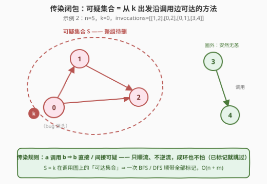
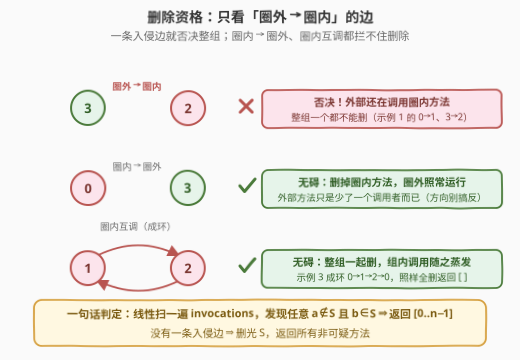
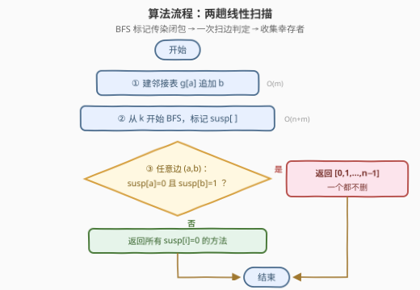
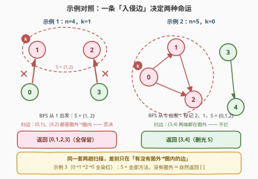

# 移除可疑的方法

- **题目名称**：移除可疑的方法
- **链接**：[3310. 移除可疑的方法](https://leetcode.cn/problems/remove-methods-from-project/)
- **难度**：中等
- **标签**：深度优先搜索、广度优先搜索、图
- **关联**：与 [2092. 找出知晓秘密的所有专家](https://leetcode.cn/problems/find-all-people-with-secret/)（[站内题解](../2001-2100/2092_找出知晓秘密的所有专家.md)）同属「传染闭包」模型；官方 hints 就两条——从 k DFS、标记后检查外部能否访问，正是本文两趟扫描的出处

## 1. 题目概述

你正在维护一个项目，该项目有 $n$ 个方法，编号从 $0$ 到 $n-1$。给你两个整数 $n$ 和 $k$，以及一个二维整数数组 `invocations`，其中 `invocations[i] = [ai, bi]` 表示方法 $a_i$ 调用了方法 $b_i$。

已知方法 $k$ 存在一个已知的 bug。那么方法 $k$ 以及它**直接或间接调用的任何方法**都被视为**可疑方法**，我们需要从项目中移除这些方法。

**只有当一组方法没有被这组之外的任何方法调用时，这组方法才能被移除。**

返回一个数组，包含移除所有可疑方法后剩下的所有方法。可以以任意顺序返回答案。**如果无法移除所有可疑方法，则不移除任何方法**。

**示例 1**：

```text
输入：n = 4, k = 1, invocations = [[1,2],[0,1],[3,2]]
输出：[0,1,2,3]
解释：方法 2 和方法 1 是可疑方法，但它们分别直接被方法 3 和方法 0 调用。
      由于方法 3 和方法 0 不是可疑方法，我们无法移除任何方法，故返回所有方法。
```

**示例 2**：

```text
输入：n = 5, k = 0, invocations = [[1,2],[0,2],[0,1],[3,4]]
输出：[3,4]
解释：方法 0、方法 1 和方法 2 是可疑方法，且没有被任何其他方法直接调用。我们可以移除它们。
```

**示例 3**：

```text
输入：n = 3, k = 2, invocations = [[1,2],[0,1],[2,0]]
输出：[]
解释：所有方法都是可疑方法。我们可以移除它们。
```

**约束条件**：

- $1 \le n \le 10^5$
- $0 \le k \le n - 1$
- $0 \le \text{invocations.length} \le 2 \times 10^5$
- $\text{invocations[i]} = [a_i, b_i]$，$0 \le a_i, b_i \le n - 1$，$a_i \ne b_i$
- $\text{invocations[i]} \ne \text{invocations[j]}$（无重边）

> 💡 **读题关键**：① 「直接或间接调用」= 调用图上从 $k$ 出发的**可达性**，方向只能顺着 $a \to b$ 走；② 移除条件看的是**从圈外指向圈内**的边——方向想反（误以为「圈内调用圈外」也碍事）是本题最常见的一发 WA；③ 语义是 all-or-nothing：要么删光全部可疑方法，要么一个不删，不存在「删一部分」。

---

## 2. 解题思路

### 2.1 暴力思路：n 次独立可达性判定

「直接或间接调用」最直接的翻译：对每个方法 $i$，从 $k$ 出发跑一次 DFS/BFS，判断 $i$ 是否可达：

```cpp
for (int i = 0; i < n; ++i)
    susp[i] = (i == k) || reach(k, i);   // reach：一次完整遍历
```

每次 `reach` 是 $O(n + m)$，总计 $O\big(n(n+m)\big)$。本题 $n = 10^5$、$m = 2 \times 10^5$，上界 $\approx 3 \times 10^{10}$ 步，超时约两个数量级。

但注意浪费在哪：**$n$ 次遍历走的是同一张图、同一个起点 $k$**。可达性是「一次遍历顺带标记全体」的典型场景——从 $k$ 出发走一遍，途中踩到的每个点都标记，走完时标记数组本身就是答案。这一步从 $n$ 遍降到 1 遍，真正的 $O(n + m)$ 正解就出来了。

至于本题为什么标中等：难点不在遍历本身，而在**判定条件的方向性**与 all-or-nothing 语义（见 2.3），图算法部分其实是模板级的。

### 2.2 核心观察一：可疑集合 = k 的「传染闭包」

把 `invocations` 看成有向图（$a \to b$ 表示 $a$ 调用 $b$），bug 是一种**只顺流、不逆流的传染**：

- $k$ 本身可疑；
- $a$ 可疑且 $a \to b$ 存在 $\Rightarrow b$ 可疑（传染沿调用方向传递）；
- 反过来，$a$ 调用了可疑方法 $b$，$a$ **不会**被传染（示例 1 中 $0$ 调用 $1$，但 $0$ 干净）。

于是「可疑集合」就是图论里最朴素的概念——**从 $k$ 出发的可达集合**。一次 BFS/DFS 从 $k$ 出发，沿邻接表扩张，标记完即得 $S$。环完全不用特殊处理：已标记的点直接跳过，天然终止（示例 3 的 $0 \to 1 \to 2 \to 0$ 就是环）。



### 2.3 核心观察二：删除资格只由「圈外 → 圈内」的边决定

题目条件「一组方法没有被这组之外的任何方法调用」翻译成边语言：

$$S \text{ 可移除} \iff \neg\,\exists\ \text{边 } (a, b):\ a \notin S \ \wedge\ b \in S$$

注意**只看入边方向**。把所有边按两端归属分成三类，只有第一类是拦路虎：

| 边的方向 | 能否移除 | 原因 |
|----------|----------|------|
| 圈外 → 圈内 | ✗ **否决整组** | 外部方法还依赖着圈内方法，删了它就悬空调用 |
| 圈内 → 圈外 | ✓ 无碍 | 删掉圈内方法，圈外方法只是少了一个调用者，自身照常运行 |
| 圈内 → 圈内（含环） | ✓ 无碍 | 整组一起消失，组内调用关系随之蒸发 |

配合 all-or-nothing 语义：**只要发现一条「圈外 → 圈内」的边，立刻返回 $[0, 1, \dots, n-1]$；一条都没有，才删光 $S$**。示例 3 里 $S$ 是全体方法、没有圈外，所以连一条入边都不可能存在，返回空数组。



> ⚠️ **方向陷阱**：把判定写成「$S$ 中有方法调用圈外就放弃」是最典型的手滑——示例 1 反着判会错误地删掉 $\{1,2\}$。删除的受害者是**被调用者**，所以只有「外部调用内部」的边才真正卡住删除。

### 2.4 算法流程

汇总成流程图，两趟线性扫描，没有第三个步骤：



1. 建邻接表（$a \to b$）；
2. 从 $k$ BFS，标记 `susp[]`（传染闭包 $S$）；
3. 扫一遍 `invocations`：发现 `susp[a] = 0` 且 `susp[b] = 1` 的边 → 返回全体；
4. 否则收集所有 `susp[i] = 0` 的下标返回。

### 2.5 示例演算

示例 1 与示例 2 并排走一遍，看「入侵边」如何一票否决：



- **示例 1**（$k=1$）：BFS 从 1 出发只能走到 2，$S=\{1,2\}$；但扫边发现 $(0,1)$、$(3,2)$ 两条都是圈外指向圈内 → 否决，返回 $[0,1,2,3]$。
- **示例 2**（$k=0$）：BFS 出队顺序 $0 \to 2 \to 1$，$S=\{0,1,2\}$；四条边里 $(1,2),(0,2),(0,1)$ 在圈内、$(3,4)$ 在圈外，无入侵边 → 删光 $S$，返回 $[3,4]$。

---

## 3. 参考代码

### C++

```cpp
class Solution {
  public:
    vector<int> remainingMethods(int n, int k, vector<vector<int>>& invocations) {
        vector<vector<int>> g(n);
        for (auto& e : invocations) g[e[0]].push_back(e[1]);

        vector<char> susp(n, 0);                   // susp[i]=1 ⇔ i 可疑
        queue<int> q;
        susp[k] = 1;
        q.push(k);
        while (!q.empty()) {                       // BFS：从 k 顺流标记传染闭包
            int u = q.front(); q.pop();
            for (int v : g[u])
                if (!susp[v]) { susp[v] = 1; q.push(v); }
        }

        for (auto& e : invocations)                // 扫边：外部调用内部 → 一票否决
            if (!susp[e[0]] && susp[e[1]]) {
                vector<int> ans(n);
                iota(ans.begin(), ans.end(), 0);
                return ans;
            }

        vector<int> ans;                           // 无入侵边 → 删光 S，收集幸存者
        for (int i = 0; i < n; ++i)
            if (!susp[i]) ans.push_back(i);
        return ans;
    }
};
```

### Python

```python
class Solution:
    def remainingMethods(self, n: int, k: int, invocations: List[List[int]]) -> List[int]:
        g = [[] for _ in range(n)]
        for a, b in invocations:
            g[a].append(b)

        susp = [False] * n                         # susp[i]=True ⇔ i 可疑
        susp[k] = True
        q = deque([k])
        while q:                                   # BFS：从 k 顺流标记传染闭包
            u = q.popleft()
            for v in g[u]:
                if not susp[v]:
                    susp[v] = True
                    q.append(v)

        for a, b in invocations:                   # 扫边：外部调用内部 → 一票否决
            if not susp[a] and susp[b]:
                return list(range(n))

        return [i for i in range(n) if not susp[i]]
```

> 💡 **实现细节**：① $n$ 可达 $10^5$，一条 $0 \to 1 \to \cdots \to n-1$ 的长链就有 $10^5$ 层递归深度——Python 默认递归上限 1000 直接爆栈，C++ 也取决于栈大小，**务必用迭代式队列/显式栈**；② `susp` 用 `vector<char>` / `list[bool]` 平铺数组而非哈希集合，$O(1)$ 判重且缓存友好；③ 判定与建图共用同一份 `invocations`，扫边时直接读原始数组即可，不必建反向图。

---

## 4. 复杂度分析

| 维度 | 复杂度 | 说明 |
|------|--------|------|
| 时间复杂度 | $O(n + m)$ | 建图 $O(m)$；BFS 每点至多入队一次、每条边至多查看一次；扫边判定 $O(m)$；收集答案 $O(n)$ |
| 空间复杂度 | $O(n + m)$ | 邻接表 $O(m)$ + 标记数组与队列 $O(n)$ |
| 暴力对照 | $O(n(n+m))$ 时间 | 每个方法独立跑一遍可达性，$\approx 3 \times 10^{10}$ 步，超时约两个数量级 |

实测：三组官方样例分别得 $[0,1,2,3] / [3,4] / []$ ✓；与「逐点独立 BFS」暴力参照对拍随机数据（$n \le 10$）3000 组全部一致；$n = 10^5$ 长链压力用例瞬时通过。

---

## 5. 扩展：如果允许「部分移除」——最大可删子集

题目是 all-or-nothing，但如果放宽成「能删多少删多少」，问题立刻有趣起来：找一个 $T \subseteq S$，使得没有任何边从 $T$ 外指向 $T$ 内（**前驱封闭**：$b \in T$ 且 $a \to b$ ⇒ $a \in T$）。

结论：**最大可删子集 = $S$ 中「所有祖先都在 $S$ 内」的点**，即

$$T_{\max} = S \setminus R,\qquad R = \text{从 } V \setminus S \text{ 出发沿正向边可达的点}$$

做法仍是熟悉的配方：以所有非可疑点为源做多源 BFS 标记 $R$，再做一次集合减法。正确性的关键是一条传递性：$u \to v$ 时 $u$ 的祖先都是 $v$ 的祖先（路径可拼接），所以 $S \setminus R$ 自动前驱封闭；反过来 $R$ 中的点 $v$ 有一条来自圈外的路径，路径进入 $T$ 的第一条边就是违规入边，所以 $R$ 中的点一个都不能进 $T$。

拿一个改造过的例子感受差异：$n=3$，$k=1$，边 $1 \to 2$、$0 \to 2$（外部直接调用 2）。all-or-nothing 版答案：入侵边 $(0,2)$ 否决，一个不删；最大可删版答案：$R=\{0,2\}$，$T_{\max}=\{1\}$——删掉 1，保留 $[0,2]$。2 被 0 牵连不能删，但 1 没被任何外部方法调用，独自干净。「连坐」与「诛九族」的边界，就在祖先链上。

---

## 6. 面试要点

1. **为什么内部互相调用（成环）不碍事？**

   - 删除的单位是「整组 $S$」。组内调用关系随组一起蒸发，判定条件只考察**跨越组边界且方向指向组内**的入边。示例 3 的 $0 \to 1 \to 2 \to 0$ 成环照样全删。

2. **为什么一条「圈外 → 圈内」的边就全盘放弃？**

   - 题目语义是 all-or-nothing：必须移除**所有**可疑方法。若允许部分移除，就变成第 5 节的「前驱封闭最大子集」问题——反问这一变体是很好的面试追问。

3. **BFS 还是 DFS？递归有什么坑？**

   - 功能完全等价（都是求可达集合）。坑在深度：$n = 10^5$ 的链状图递归深度同量级，Python 默认上限 1000 必爆，C++ 也受栈大小约束。白板上主动写迭代版是加分项。

4. **标记数组为什么能正确处理环和重复访问？**

   - BFS 的不变式：入队即标记。已标记的点不再入队，每个点至多处理一次——这正是闭包定义的机械翻译，环在「已标记就跳过」面前自动终止。

5. **复杂度怎么算？**

   - 建图 $O(m)$；BFS 中每点至多出队一次、其邻接表至多扫一遍，合计 $O(n+m)$；扫边 $O(m)$；收集 $O(n)$。总共两趟线性，$n=10^5$、$m=2\times10^5$ 下轻松通过。

---

## 7. 同类练习题

- [1971. 寻找图中是否存在路径](https://leetcode.cn/problems/find-if-path-exists-in-graph/)：可达性判定的裸模板（无向版），本题 BFS 那一趟的独立练习
- [2092. 找出知晓秘密的所有专家](https://leetcode.cn/problems/find-all-people-with-secret/)（[站内题解](../2001-2100/2092_找出知晓秘密的所有专家.md)）：先删边再多源 BFS 的传染模型，与本题互为「传染闭包」的一体两面
- [802. 找到最终的安全状态](https://leetcode.cn/problems/find-eventual-safe-states/)（[站内题解](../0801-0900/802_找到最终的安全状态.md)）：同样是「标记 + 过滤」范式——它反向找不陷入环的点，本题正向找被传染的点
- [1462. 课程安排 IV](https://leetcode.cn/problems/course-schedule-iv/)：传递闭包批量回答可达性查询（Floyd / 预处理可达表），可达集合思想的查询版
- [1557. 可以到达所有节点的最少顶点数目](https://leetcode.cn/problems/minimum-number-of-vertices-to-reach-all-nodes/)（[站内题解](../1501-1600/1557_可以到达所有节点的最少顶点数目.md)）：只看「入边」做判定的思想——入度为 0 的点，与本题「圈外→圈内入边否决」同一观察角度
