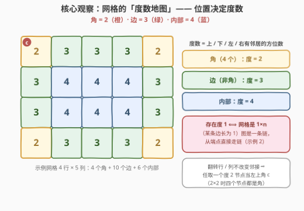
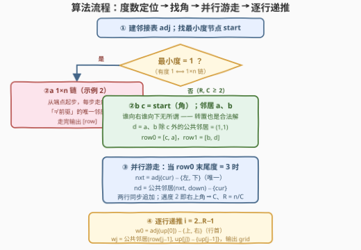
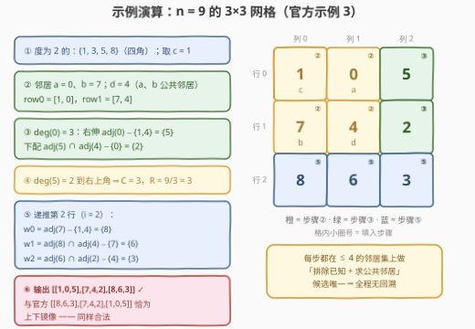

# LeetCode 构造符合图结构的二维矩阵 题解

- **关联**：310（最小高度树）同属「看度数定位特殊节点」家族；本题是反向操作——由度数分布把一张图「折叠」回它原本的网格形状

## 1. 题目概述

- **标题 / 题号**：构造符合图结构的二维矩阵（#3311，hard）
- **链接**：https://leetcode.cn/problems/construct-2d-grid-matching-graph-layout/
- **难度**：困难
- **标签**：图、数组、哈希表、矩阵

**题意**：给你一个二维整数数组 `edges`，表示一棵 $n$ 个节点的**无向图**，其中 `edges[i] = [ui, vi]` 表示节点 $u_i$ 和 $v_i$ 之间有一条边。

请你构造一个二维矩阵，满足以下条件：

- 矩阵中每个格子**一一对应**图中 $0$ 到 $n-1$ 的**所有节点**；
- 矩阵中两个格子相邻（**横**的或者**竖**的）**当且仅当**它们对应的节点在 `edges` 中有边连接。

题目保证 `edges` 可以构造一个满足上述条件的二维矩阵。请你返回一个符合上述要求的二维整数数组，如果存在多种答案，返回任意一个。

**示例 1**：

```text
输入：n = 4, edges = [[0,1],[0,2],[1,3],[2,3]]
输出：[[3,1],[2,0]]
解释：2×2 网格，四个节点度数全为 2（都是角）。
```

**示例 2**：

```text
输入：n = 5, edges = [[0,1],[1,3],[2,3],[2,4]]
输出：[[4,2,3,1,0]]
解释：1×5 网格——图是一条链，端点 0 和 4 的度数为 1。
```

**示例 3**：

```text
输入：n = 9, edges = [[0,1],[0,4],[0,5],[1,7],[2,3],[2,4],[2,5],[3,6],[4,6],[4,7],[6,8],[7,8]]
输出：[[8,6,3],[7,4,2],[1,0,5]]
解释：3×3 网格，四个角的度数为 2，四条边的度数为 3，中心度数为 4。
```

**约束**：

- $2 \le n \le 5 \times 10^4$
- $1 \le \text{edges.length} \le 10^5$
- $\text{edges}[i] = [u_i, v_i]$，$0 \le u_i < v_i < n$
- 图中的边互不相同
- 输入保证 `edges` 可以形成一个符合上述条件的二维矩阵

> 💡 **读题关键**：① 这是「网格图同构」的**构造方向**：不给形状、只给边，要还原出 $R \times C$ 的布局，连行列数都是未知数；② 「相邻当且仅当有边」是**双向**约束——输出矩阵既不能漏边、也不能凭空多出相邻关系；③ 「保证有解」是重要的豁免条款——它允许我们走一条**每步唯一确定、全程无回溯**的构造路线，这正是本题作为困难题的核心考点。

## 2. 解题思路

### 2.1 暴力思路：枚举形状 + 回溯放置

最朴素的想法是把问题当成一般的**子图同构**：枚举 $n$ 的每个因子对 $(R, C)$（$R \times C = n$），再把节点一个个往格子里塞——第一个格子有 $n$ 种选法，第二个有 $n-1$ 种……回溯树是阶乘级的，$n = 5 \times 10^4$ 下完全没有讨论价值。

退一步的「构造 + 验证」暴力：枚举因子对、枚举哪个节点当角、枚举方向的左右分配，每次贪心铺满后用哈希表 $O(n + m)$ 校验邻接是否与 `edges` 完全一致。这能过，但白白浪费了题目送的两份大礼——**保证有解**与**度数即位置信息**。下面的观察会说明：只要从正确的地方起步，每一步其实都被邻居关系**唯一确定**，既不需要枚举形状，也不需要回溯和验证。

### 2.2 核心观察：度数地图 + 从角出发的并行游走



**观察 1（度数分布）**：网格图中一个节点的度，只由它**离边界的距离**决定——它等于「上 / 下 / 左 / 右四个方位里有多少个方向存在邻居」：

| 位置 | 有邻居的方位 | 度数 |
|------|--------------|------|
| 角（4 个） | 2 个 | $2$ |
| 边（非角） | 3 个 | $3$ |
| 内部 | 4 个 | $4$ |

直接推论：**存在度 1 的节点 $\iff$ 网格退化成 $1 \times n$**（只要 $R, C \ge 2$，角的度也是 $2$，整张图最小度就是 $2$）。此时图是一条**链**，从度 1 的端点出发、每步走向「不等于前驱的那个邻居」即可（示例 2）。

**观察 2（角的对称性）**：网格在「翻转行 / 翻转列」的操作下**邻接关系不变**。所以**任取**一个度 2 节点当左上角 $c$ 都行（$2 \times 2$ 时四个节点全是角，任取也对）；更进一步，$c$ 的两个邻居 $a$、$b$ 一个在行方向、一个在列方向，但**根本不需要分辨谁是谁**——就算把行列分配反了，得到的也只是原网格的**转置**，转置不改变任何邻接关系，依旧是合法答案。一次方向判定就这么被对称性「免单」了。

**观察 3（(1,1) 是公共邻居）**：$R, C \ge 2$ 时，$a = (0,1)$ 与 $b = (1,0)$ 除 $c$ 外**恰好有一个**公共邻居 $d = (1,1)$（在 $a$、$b$ 各自不超过 3 个邻居的集合里求交集即可）。于是前两行的前两格立刻锁定：

$$\begin{bmatrix} c & a \\ b & d \end{bmatrix}$$

**观察 4（并行游走）**：首行节点 $(0,j)$ 的邻居集合**恰好**是 $\{$ 左 $(0,j-1)$、右 $(0,j+1)$、下 $(1,j) \}$。已知「左」和「下」之后，**排除法唯一确定「右」**；而新的「下」$(1,j+1)$ 正是 $(0,j+1)$ 与 $(1,j)$ 的公共邻居（去掉已知的 $(0,j)$ 后唯一）。于是「右伸一格 + 下配一格」可以同步滚动：

$$\text{当 row0 末尾度} = 3：\quad \text{nxt} = \operatorname{adj}(cur) \setminus \{\text{左}, \text{下}\}, \qquad \text{nd} = \big(\operatorname{adj}(\text{nxt}) \cap \operatorname{adj}(\text{down})\big) \setminus \{cur\}$$

终止条件同样是度数：首行节点度 $= 3 \iff$ 还没到右上角；度 $= 2 \iff$ 它就是右上角（$C = 2$ 时 $a$ 一开始就是角，循环一次都不进）。**走完第一行的同时，第二行也免费拿到了**。列数 $C = \text{len(row0)}$，行数 $R = n / C$。

**观察 5（逐行递推）**：第 $i$ 行（$i \ge 2$）由前两行完全确定：

- **行首** $(i,0)$：$(i-1,0)$ 的邻居集合恰为 $\{$ 上 $(i-2,0)$、右 $(i-1,1)$、下 $(i,0) \}$，排除前两个即得；
- **第 $j$ 格** $(i,j)$：它是 $(i,j-1)$ 与 $(i-1,j)$ 的公共邻居。做一个简单穷举：这两点的公共邻居**恰好**是 $(i,j)$ 和 $(i-1,j-1)$ 两个（网格中固定结构），去掉已放置的 $(i-1,j-1)$ 即唯一确定。

于是整张网格像「织毛衣」一样一行行长出来。全程每一步都只在**大小 $\le 4$ 的邻居集**上做排除 / 求交，候选唯一——**无回溯、无验证**。

### 2.3 算法流程图



四个阶段：**度数定位**（最小度 1 → 走链输出，$O(n)$）→ **找角定 (1,1)**（转置对称性豁免方向判断）→ **并行游走定前两行**（度 3 为循环条件、度 2 为终止信号，顺手得到 $C$ 与 $R$）→ **逐行递推铺满**（行首用排除法、其余用公共邻居法）。两个分支最终都直接输出，没有任何试探与撤销。

### 2.4 示例演算



用官方示例 3 完整走一遍（邻接表：$0{:}\{1,4,5\}$，$1{:}\{0,7\}$，$2{:}\{3,4,5\}$，$3{:}\{2,6\}$，$4{:}\{0,2,6,7\}$，$5{:}\{0,2\}$，$6{:}\{3,4,8\}$，$7{:}\{1,4,8\}$，$8{:}\{6,7\}$）：

| 步骤 | 动作 | 结果 |
|------|------|------|
| ① | 数度数：度为 2 的节点 $\{1,3,5,8\}$ 是四个角，取 $c = 1$ | — |
| ② | 邻居 $a = 0$、$b = 7$；公共邻居 $d = 4$，即 $(1,1)$ | row0 = [1, 0]，row1 = [7, 4] |
| ③ | $\deg(0) = 3$：右伸 $\operatorname{adj}(0) \setminus \{1, 4\} = \{5\}$；下配 $\operatorname{adj}(5) \cap \operatorname{adj}(4) \setminus \{0\} = \{2\}$ | row0 = [1, 0, 5]，row1 = [7, 4, 2] |
| ④ | $\deg(5) = 2$ → 到达右上角 | $C = 3$，$R = 9/3 = 3$ |
| ⑤ | 递推第 2 行：$w_0 = \operatorname{adj}(7) \setminus \{1, 4\} = \{8\}$；$w_1 = \operatorname{adj}(8) \cap \operatorname{adj}(4) \setminus \{7\} = \{6\}$；$w_2 = \operatorname{adj}(6) \cap \operatorname{adj}(2) \setminus \{4\} = \{3\}$ | row2 = [8, 6, 3] |

输出 $[[1,0,5],[7,4,2],[8,6,3]]$，与官方答案 $[[8,6,3],[7,4,2],[1,0,5]]$ **恰为上下镜像**——因为我们选的角 1 在官方布局里位于左下角，翻转行后即官方答案。这正印证了观察 2：随便挑哪个角、随便定哪个方向，构造出来的都是某个合法布局（或其翻转 / 转置）。

## 3. 参考代码

### C++

```cpp
class Solution {
  public:
    vector<vector<int>> constructGridLayout(int n, vector<vector<int>>& edges) {
        vector<vector<int>> adj(n);
        for (auto& e : edges) {
            adj[e[0]].push_back(e[1]);
            adj[e[1]].push_back(e[0]);
        }

        // 最小度节点：度 1 ⟺ 1×n 链；度 2 ⟺ 角
        int start = 0;
        for (int v = 1; v < n; v++)
            if (adj[v].size() < adj[start].size()) start = v;

        // 情形一：最小度为 1 —— 网格是 1×n，从端点走链
        if (adj[start].size() == 1) {
            vector<int> row;
            int prev = -1, cur = start;
            while (cur != -1) {
                row.push_back(cur);
                int nxt = -1;
                for (int w : adj[cur])
                    if (w != prev) nxt = w;
                prev = cur;
                cur = nxt;
            }
            return {row};
        }

        // 情形二：start 是角 c；两个邻居 a、b 谁右谁下无所谓（转置也是解）
        int c = start;
        int a = adj[c][0], b = adj[c][1];
        int d = -1;  // d = (1,1)：a、b 除 c 外的唯一公共邻居
        for (int w : adj[a])
            if (w != c && find(adj[b].begin(), adj[b].end(), w) != adj[b].end()) d = w;

        vector<int> row0 = {c, a};
        vector<int> row1 = {b, d};
        // 并行游走：row0 沿第一行右伸，row1 同步长出第二行
        while (adj[row0.back()].size() == 3) {  // 度 3 ⇒ 还没到右上角
            int cur = row0.back(), left = row0[row0.size() - 2], down = row1.back();
            int nxt = -1;  // (0, j+1)：排除左、下后唯一
            for (int w : adj[cur])
                if (w != left && w != down) nxt = w;
            int nd = -1;  // (1, j+1)：nxt 与 down 的公共邻居（去掉 cur）
            for (int w : adj[nxt])
                if (w != cur && find(adj[down].begin(), adj[down].end(), w) != adj[down].end()) nd = w;
            row0.push_back(nxt);
            row1.push_back(nd);
        }

        int C = row0.size();
        int R = n / C;
        vector<vector<int>> grid;
        grid.push_back(move(row0));
        grid.push_back(move(row1));
        // 逐行递推：第 i 行由第 i-1、i-2 行确定
        for (int i = 2; i < R; i++) {
            vector<int>& up = grid[i - 1];
            vector<int>& up2 = grid[i - 2];
            vector<int> row(C);
            int w0 = -1;  // (i,0)：up[0] 的邻居去掉上方与右方
            for (int w : adj[up[0]])
                if (w != up2[0] && w != up[1]) w0 = w;
            row[0] = w0;
            for (int j = 1; j < C; j++) {
                int wj = -1;  // (i,j)：row[j-1] 与 up[j] 的公共邻居去掉 up[j-1]
                for (int w : adj[row[j - 1]])
                    if (w != up[j - 1] && find(adj[up[j]].begin(), adj[up[j]].end(), w) != adj[up[j]].end()) wj = w;
                row[j] = wj;
            }
            grid.push_back(move(row));
        }
        return grid;
    }
};
```

### Python

```python
class Solution:
    def constructGridLayout(self, n: int, edges: List[List[int]]) -> List[List[int]]:
        adj = [set() for _ in range(n)]
        for u, v in edges:
            adj[u].add(v)
            adj[v].add(u)

        start = min(range(n), key=lambda v: len(adj[v]))

        # 情形一：最小度为 1 —— 1×n 链，从端点走
        if len(adj[start]) == 1:
            row, prev, cur = [], -1, start
            while cur != -1:
                row.append(cur)
                nxt = -1
                for w in adj[cur]:
                    if w != prev:
                        nxt = w
                prev, cur = cur, nxt
            return [row]

        # 情形二：start 是角 c，邻居 a、b 谁右谁下无所谓（转置也是解）
        c = start
        a, b = list(adj[c])
        d = next(w for w in adj[a] if w != c and w in adj[b])  # (1,1)

        row0, row1 = [c, a], [b, d]
        while len(adj[row0[-1]]) == 3:  # 度 3 ⇒ 还没到右上角
            cur, left, down = row0[-1], row0[-2], row1[-1]
            nxt = next(w for w in adj[cur] if w != left and w != down)      # (0,j+1)
            nd = next(w for w in adj[nxt] if w != cur and w in adj[down])   # (1,j+1)
            row0.append(nxt)
            row1.append(nd)

        C = len(row0)
        R = n // C
        grid = [row0, row1]
        for i in range(2, R):
            up, up2 = grid[-1], grid[-2]
            row = [next(w for w in adj[up[0]] if w != up2[0] and w != up[1])]  # (i,0)
            for j in range(1, C):
                row.append(next(w for w in adj[row[-1]]
                                if w != up[j - 1] and w in adj[up[j]]))        # (i,j)
            grid.append(row)
        return grid
```

> 💡 **实现细节**：① C++ 邻居表用 `vector` 即可——度 $\le 4$，「求交 / 排除」直接线性扫，比 `unordered_set` 更快；Python 用 `set` 求交最省心；② 走链时的终止写法值得玩味：远端点的唯一邻居就是前驱，`w != prev` 筛不出候选，`nxt` 自然变 $-1$，无需特判端点；③ `while len(adj[row0[-1]]) == 3` 隐含处理了 $C = 2$（$a$ 一开始就是角，循环不进）；④ 已对拍验证：$1..8 \times 1..8$ 全形状随机打乱 + $1 \times 50000$、$2 \times 25000$、$224 \times 224$ 大网格均通过（校验输出为排列、且邻接关系与 `edges` 逐条一致）。

## 4. 复杂度分析

| 维度 | 复杂度 | 说明 |
|------|--------|------|
| 时间 | $O(n + m)$ | 建邻接表 $O(m)$；找角 $O(n)$；并行游走与逐行递推共填 $n$ 个格子，每格在大小 $\le 4$ 的邻居集上做 $O(1)$ 次排除 / 求交 |
| 空间 | $O(n + m)$ | 邻接表 $O(n + m)$，输出矩阵 $O(n)$ |

实测（C++ `-O2`）：$1 \times 50000$、$2 \times 25000$、$224 \times 224$（$n \approx 5 \times 10^4$、$m \approx 10^5$）均约 $0.01 \sim 0.02$ 秒——瓶颈只在读入与建表，构造本身近乎免费。

## 5. 扩展：形状还能用度数统计「解方程」求出来

本文的 $C$ 靠游走的终止条件「顺手」得到；其实形状 $(R, C)$ 还可以**先验地**从度数统计解出来。设 $n_2, n_3, n_4$ 分别为度 $2, 3, 4$ 的节点数，则（$R, C \ge 2$ 时）：

$$n_2 = 4, \qquad n_3 = 2R + 2C - 8, \qquad n_4 = (R-2)(C-2)$$

由 $n_3$ 得 $R + C = (n_3 + 8) / 2$，与 $R \cdot C = n$ 联立即一元二次方程，直接解出 $\{R, C\}$。两种方式互为印证：**度数不仅告诉你每个节点「是什么角色」，还定量地告诉整张图「是什么形状」**。

另一个值得思考的方向：若题目**不保证有解**，本算法依旧是骨架——贪心构造可能在无解输入上「走出歧路」（候选为空或重复填入），因此需要两处加固：① 每步的排除 / 求交结果为空时立即判无解；② 构造完成后用哈希表比对输出网格的全部相邻对与 `edges` 是否**双向一致**，防止「多边 / 漏边」。总复杂度仍是 $O(n + m)$。

## 6. 面试要点

1. **怎么判断网格是一条链（$1 \times n$）还是真二维？**

   - 看最小度：$R, C \ge 2$ 时四个角的度也是 $2$，全图最小度 $\ge 2$；只有某条边长为 $1$ 时才会出现度为 $1$ 的端点。所以「存在度 1 节点 $\iff$ $1 \times n$」，从端点走链即可（$n = 2$ 也被覆盖：两个端点度均为 1）。

2. **为什么可以任取一个度 2 节点当左上角 $c$？**

   - 网格在翻转行 / 翻转列下邻接关系不变，任何角都能通过翻转映射到 $(0,0)$。$2 \times 2$ 是特例：四个节点度全为 2、全都是角，任取依然正确。

3. **为什么不需要分辨 $c$ 的两个邻居谁是「右」谁是「下」？**

   - 分配反了得到的只是原网格的**转置**，而转置不改变邻接关系，仍是合法答案。利用输出「任意一个均可」的豁免，省掉一次方向判定——这是本题最漂亮的简化。

4. **并行游走为什么不会走岔？终止条件为什么可靠？**

   - 首行节点 $(0,j)$ 的邻居**恰为** $\{$ 左、右、下 $\}$，排除两个已知量后「右」唯一；新的「下」是 $(0,j+1)$ 与 $(1,j)$ 的公共邻居去掉 $(0,j)$，也唯一。终止看度数：首行节点度 $= 3 \iff$ 非角（继续），度 $= 2 \iff$ 右上角（停）。$C = 2$ 时 $a$ 一开始就是角，循环天然不执行。

5. **后续行的递推公式为什么唯一？**

   - $(i,j-1)$ 与 $(i-1,j)$ 在网格中的公共邻居**恰好**是 $(i,j)$ 与 $(i-1,j-1)$ 两个（可按方位穷举验证），去掉已放置的 $(i-1,j-1)$ 后唯一。行首 $(i,0)$ 则用排除法：$(i-1,0)$ 的邻居恰为 $\{$ 上、右、下 $\}$。

6. **如果面试官追问「不保证有解怎么办」？**

   - 加固为「构造 + 校验」：每步候选为空即失败；构造完全程后用哈希表双向比对输出网格的相邻对与 `edges`（防多边漏边），复杂度保持 $O(n + m)$。顺带可以聊到本题的一般化版本就是子图同构判定（NP 完全），「保证是网格」正是多项式可解的根源。

## 同类练习题

| # | 题目 | 与本题的关联 |
|---|------|-------------|
| 310 | [最小高度树](https://leetcode.cn/problems/minimum-height-trees/)（[站内题解](../0301-0400/310_最小高度树.md)） | 同样靠度数定位特殊节点——不断剥掉度 $\le 1$ 的叶子找中心；本题则靠度数区分角 / 边 / 内部 |
| 2685 | [统计完全连通分量的数量](https://leetcode.cn/problems/count-the-number-of-complete-components/)（[站内题解](../2601-2700/2685_统计完全连通分量的数量.md)） | 由边数 / 度数之和反推分量内部结构，与本题同属「图结构反推」家族 |
| 1761 | [一个图中连通三元组的最小度数](https://leetcode.cn/problems/minimum-degree-of-a-connected-trio-in-a-graph/)（[站内题解](../1701-1800/1761_一个图中连通三元组的最小度数.md)） | 度数统计思想的直接练习 |
| 417 | [太平洋大西洋水流问题](https://leetcode.cn/problems/pacific-atlantic-water-flow/)（[站内题解](../0401-0500/417_太平洋大西洋水流问题.md)） | 同样「从边界出发反向思考」的网格题，与从角出发的构造思路呼应 |
| 1631 | [最小体力消耗路径](https://leetcode.cn/problems/path-with-minimum-effort/) | 网格 ⟷ 图的双向视角切换——本题把图折叠回网格，它把网格展开成图 |
