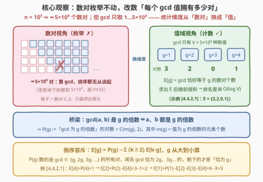
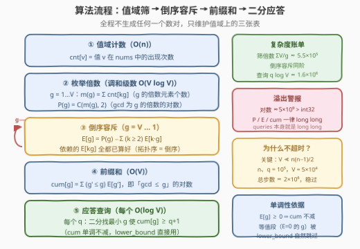
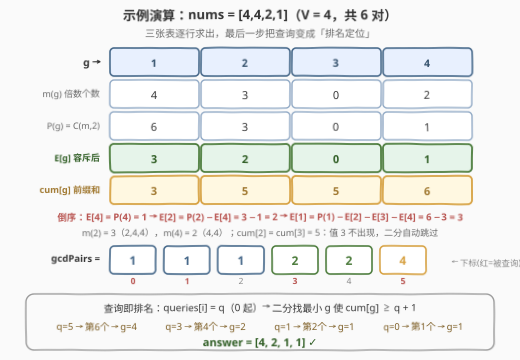

# 查询排序后的最大公约数

- **题目名称**：查询排序后的最大公约数
- **链接**：[3312. 查询排序后的最大公约数](https://leetcode.cn/problems/sorted-gcd-pair-queries/)
- **难度**：困难
- **标签**：数组、数论、计数、二分查找、前缀和

## 1. 题目概述

给你一个长度为 $n$ 的整数数组 `nums` 和一个整数数组 `queries`。

`gcdPairs` 表示数组 `nums` 中所有满足 $0 \le i < j < n$ 的数对 $(\text{nums}[i], \text{nums}[j])$ 的**最大公约数**升序排列构成的数组。

对于每个查询 `queries[i]`，你需要找出 `gcdPairs` 中**下标为** `queries[i]` 的元素（即升序后的第 `queries[i]` + 1 小的 gcd 值）。

**示例 1**：

```text
输入：nums = [2,3,4], queries = [0,2,2]
输出：[1,2,2]
解释：gcdPairs = [gcd(2,3), gcd(2,4), gcd(3,4)] = [1, 2, 1]，
     升序排序后 gcdPairs = [1, 1, 2]，
     所以答案为 [gcdPairs[0], gcdPairs[2], gcdPairs[2]] = [1, 2, 2]。
```

**示例 2**：

```text
输入：nums = [4,4,2,1], queries = [5,3,1,0]
输出：[4,2,1,1]
解释：gcdPairs 升序排序后得到 [1, 1, 1, 2, 2, 4]。
```

**示例 3**：

```text
输入：nums = [2,2], queries = [0,0]
输出：[2,2]
解释：gcdPairs = [2]。
```

**约束条件**：

- $2 \le n = \text{nums.length} \le 10^5$
- $1 \le \text{nums}[i] \le 5 \times 10^4$
- $1 \le \text{queries.length} \le 10^5$
- $0 \le \text{queries}[i] < \frac{n(n-1)}{2}$

> 💡 **读题关键**：① 数对总数 $\frac{n(n-1)}{2} \approx 5 \times 10^9$——连枚举一遍都不可能，更别说排序；② 但 gcd 的**取值**只有 $1 \sim 5 \times 10^4$ 种，比数对规模小**六个数量级**；③ 查询是「按排名取值」而非「按值查排名」，排序后第 $q$ 位 $\iff$ 值域上的排名定位问题；④ `queries[i]` 上界 $\approx 5 \times 10^9$ 已超 `int32`，所以 C++ 签名里 `queries` 直接就是 `vector<long long>`。

---

## 2. 解题思路

### 2.1 暴力思路：$5 \times 10^9$ 个数对，连枚举都不配

最直接的做法：双重循环算出所有 $\frac{n(n-1)}{2}$ 个 gcd，排序，然后 $O(1)$ 应答每个查询：

```cpp
vector<long long> all;                         // 长度 ~5×10⁹
for (int i = 0; i < n; ++i)
    for (int j = i + 1; j < n; ++j)
        all.push_back(__gcd(nums[i], nums[j]));
sort(all.begin(), all.end());                 // O(n² log n) ≈ 10¹¹ 步
```

$n = 10^5$ 时数对数 $\approx 5 \times 10^9$：仅存储就要 40 GB，排序要 $10^{11}$ 量级的操作——**超时且超内存各约三个数量级**，剪枝无从谈起（每个数对都必须被统计）。这题没有小数据姊妹版，数据规模一步到位，必须换统计对象。

### 2.2 核心观察：不数数对，数「每个 gcd 值拥有多少对」

把三个规模摆在一起，出路就自己浮出来了：

| 对象 | 规模 |
|------|------|
| 数对 $(i, j)$ | $\approx 5 \times 10^9$（数不动） |
| 元素个数 $n$ | $10^5$ |
| **gcd 的取值范围** | $\le 5 \times 10^4$（数得动！） |

**统计对象从「数对」换成「值」**：定义

$$E[g] := \#\{(i,j) : i < j,\ \gcd(\text{nums}[i], \text{nums}[j]) = g\}$$

只需求出值域 $1 \sim V$（$V = \max(\text{nums})$）上的这张 $E$ 表，查询就是排名定位：第 $q + 1$ 小的 gcd 值 = 最小的 $g$ 使得 $\sum_{g' \le g} E[g'] \ge q + 1$。

**怎么求 $E[g]$？** 直接枚举数对算 gcd 正是要避开的。这里需要一个数论桥梁：

$$\gcd(a, b) \text{ 是 } g \text{ 的倍数} \iff a \text{ 和 } b \text{ 都是 } g \text{ 的倍数}$$

（双向都成立：$g \mid a$ 且 $g \mid b \Rightarrow g \mid \gcd(a,b)$；反之 $g \mid \gcd(a,b) \Rightarrow g \mid a$ 且 $g \mid b$。）

于是「gcd 是 $g$ 的**倍数**」的数对数 $P(g)$ 不看 gcd，只看**元素落在哪个倍数桶里**：

$$m(g) = \#\{x \in \text{nums} : g \mid x\}, \qquad P(g) = \binom{m(g)}{2}$$

任取两个 $g$ 的倍数元素，其 gcd 必是 $g$ 的倍数；反之亦然——$P(g)$ 与「具体是谁配谁」无关，只与个数有关。而 $m(g)$ 的求法是经典的**值域筛**：先做值域计数 `cnt[v]`，再对每个 $g$ 枚举其倍数 $g, 2g, 3g, \dots$ 累加，总代价是调和级数

$$\sum_{g=1}^{V} \frac{V}{g} \approx V \ln V \approx 5.5 \times 10^5$$

（对照：对每个元素枚举因子是 $O(n\sqrt{V}) \approx 2 \times 10^7$，也能过但慢一个量级——值域 $V < n$ 时，**枚举倍数优于枚举因子**。）

最后一步，把「倍数」收紧为「恰好」——**倒序容斥**：

$$E[g] = P(g) - \sum_{k \ge 2} E[k \cdot g]$$

$P(g)$ 数的是 gcd $\in \{g, 2g, 3g, \dots\}$ 的所有对；从中减去 gcd 恰为 $2g, 3g, \dots$ 的部分（即 $E[2g], E[3g], \dots$），剩下的才是 gcd **恰为** $g$ 的对。按 $g$ **从大到小**计算：$E[g]$ 依赖的 $E[kg]$（$k \ge 2$）全都是更大的下标，早已算好——依赖指向更大元素的，拓扑序就是倒序。



> 💡 **这套「倍数筛 + 倒序收紧」是标准武器**：`m(g)` 的倍数枚举与 [204. 计数质数](../0201-0300/204_计数质数.md) 的埃氏筛同构；倒序容斥则是莫比乌斯反演的免公式版（见第 5 节）。

### 2.3 算法流程：筛 → 容斥 → 前缀和 → 二分应答

$$\underbrace{\text{cnt}}_{O(n)} \;\to\; \underbrace{m(g),\ P(g)}_{O(V\log V)} \;\to\; \underbrace{E[g]}_{O(V\log V),\ \text{倒序}} \;\to\; \underbrace{\text{cum}[g]}_{O(V)} \;\to\; \underbrace{\text{查询}}_{O(\log V)\ \text{each}}$$

查询环节的关键：`cum[g] = Σ_{g'≤g} E[g']` 是「gcd ≤ g 的对数」，又恰是**升序 gcdPairs 中值 ≤ g 的元素个数**。于是「第 $q$ 位（0 起）是什么值」= 最小的 $g$ 使 $\text{cum}[g] \ge q + 1$。由 $E[g] \ge 0$ 知 `cum` 单调不减，`lower_bound` / `bisect_left` 直接可用；约束保证 $\text{cum}[V] = \frac{n(n-1)}{2} > q$，二分必有解。



### 2.4 示例演算

以示例 2 `nums = [4,4,2,1]`（$V = 4$，共 6 对）走完全流程：



1. **值域计数**：`cnt = {1:1, 2:1, 4:2}`；
2. **倍数筛**：$m(4)=2$（两个 4），$m(3)=0$，$m(2)=3$（2, 4, 4），$m(1)=4$ → $P = \{6, 3, 0, 1\}$；
3. **倒序容斥**：$E[4] = 1$；$E[3] = 0$；$E[2] = P(2) - E[4] = 3 - 1 = 2$；$E[1] = P(1) - E[2] - E[3] - E[4] = 6 - 3 = 3$；
4. **前缀和**：`cum = {1:3, 2:5, 3:5, 4:6}`——即升序数组 `[1,1,1,2,2,4]` 的分布；
5. **应答**：$q=5$ → 最小 $g$ 使 $\text{cum}[g] \ge 6$ → $g=4$；$q=3$ → $\ge 4$ → $g=2$；$q=1$ → $\ge 2$ → $g=1$；$q=0$ → $\ge 1$ → $g=1$。答案 `[4,2,1,1]` ✓。

注意 $E[3] = 0$ 使 `cum[2] = cum[3] = 5`：值 3 根本不出现，二分会自然跳过这类「等值段」。

---

## 3. 参考代码

### C++

```cpp
class Solution {
  public:
    vector<int> gcdValues(vector<int>& nums, vector<long long>& queries) {
        int V = *max_element(nums.begin(), nums.end());
        vector<long long> cnt(V + 1, 0);
        for (int x : nums) ++cnt[x];              // ① 值域计数

        vector<long long> E(V + 1, 0);
        for (int g = V; g >= 1; --g) {            // ③ 倒序：E[g] 依赖更大的 E[kg]
            long long m = 0;
            for (int v = g; v <= V; v += g) m += cnt[v];   // ② 枚举倍数求 m(g)
            long long s = m * (m - 1) / 2;        //    P(g) = C(m, 2)
            for (int kg = 2 * g; kg <= V; kg += g)
                s -= E[kg];                       //    容斥：减去 gcd 恰为 kg 的
            E[g] = s;                             //    E[g] = gcd 恰为 g 的对数
        }

        vector<long long> cum(V + 1, 0);          // ④ cum[g] = gcd ≤ g 的对数
        for (int g = 1; g <= V; ++g) cum[g] = cum[g - 1] + E[g];

        vector<int> ans;
        ans.reserve(queries.size());
        for (long long q : queries)               // ⑤ 最小的 g 使 cum[g] ≥ q+1
            ans.push_back(lower_bound(cum.begin() + 1, cum.end(), q + 1) - cum.begin());
        return ans;
    }
};
```

### Python

```python
class Solution:
    def gcdValues(self, nums: List[int], queries: List[int]) -> List[int]:
        V = max(nums)
        cnt = [0] * (V + 1)
        for x in nums:                            # ① 值域计数
            cnt[x] += 1

        E = [0] * (V + 1)
        for g in range(V, 0, -1):                 # ③ 倒序：E[g] 依赖更大的 E[kg]
            m = sum(cnt[v] for v in range(g, V + 1, g))    # ② 枚举倍数求 m(g)
            s = m * (m - 1) // 2                  #    P(g) = C(m, 2)
            for kg in range(2 * g, V + 1, g):
                s -= E[kg]                        #    容斥：减去 gcd 恰为 kg 的
            E[g] = s                              #    E[g] = gcd 恰为 g 的对数

        cum = [0] * (V + 1)                       # ④ cum[g] = gcd ≤ g 的对数
        for g in range(1, V + 1):
            cum[g] = cum[g - 1] + E[g]

        tail = cum[1:]                            # 去掉哨兵 cum[0] = 0
        return [bisect_left(tail, q + 1) + 1 for q in queries]   # ⑤
```

> 💡 **实现细节**：① 溢出是本题主坑——数对总数、$m(m-1)/2$、`cum[V]` 都可达 $\approx 5 \times 10^9 > 2^{31}-1$，所以 `cnt/P/E/cum` 全用 `long long`（Python 无此虑）；② 二分找的是「首个 $\ge q+1$」即 `lower_bound`，落在 `cum.begin()+1` 起的区间上，返回的下标恰好就是 $g$；③ 两个内层倍数循环合并在同一个倒序 `g` 循环里——`m(g)` 只依赖 `cnt`，与计算顺序无关。

---

## 4. 复杂度分析

| 维度 | 复杂度 | 说明 |
|------|--------|------|
| 时间复杂度 | $O(n + V\log V + q\log V)$ | 倍数枚举与倒序容斥各是调和级数 $\sum_{g=1}^{V} V/g \approx V\ln V \approx 5.5\times10^5$；每次查询二分 $\log V \approx 16$ 步；$n, q = 10^5$、$V = 5\times10^4$ 时总计 $\approx 2\times10^6$ 步 |
| 空间复杂度 | $O(V)$ | `cnt / E / cum` 三张值域表，与 $n$、$q$ 无关 |
| 暴力对照 | $O(n^2\log n)$ 时间、$O(n^2)$ 空间 | $\approx 10^{11}$ 步 + 40 GB 存储，超时超内存各约三个数量级 |

实测：三组官方样例 $[1,2,2] / [4,2,1,1] / [2,2]$ ✓；与暴力对拍随机数据（$n \le 12$，$\text{nums}[i] \le 30$）3000 组全部一致；满规模（$n = q = 10^5$，$V = 5\times10^4$）随机数据 Python 约 0.2 s、C++ 瞬时通过。

---

## 5. 扩展：莫比乌斯反演视角与离线应答

**莫比乌斯反演的免公式版。** 把「倍数 → 恰好」的收紧写成卷积形式，就是数论里的经典恒等式：

$$E[g] = \sum_{k \ge 1} \mu(k)\, P(k \cdot g)$$

其中 $\mu$ 是莫比乌斯函数。本文的倒序容斥 $E[g] = P(g) - \sum_{k \ge 2} E[kg]$ 与它完全等价——本质都是「$P$ 是 $E$ 在倍数维度上的前缀和，反演回去」。倒序容斥的优势是不用预计算 $\mu$ 表、不碰零项，两行循环写完；换来的代价与莫比乌斯版同为调和级数。遇到更复杂的「恰为 $g$」统计（如 lcm、幂次）时，认出这个结构就能套用。

**查询侧的另一种组织：离线双指针。** 若想消掉每个查询的 $\log V$，可把 `queries` 排序后与 `cum` 数组做合并扫描（双指针），总代价 $O(q\log q + V)$；但要把答案还原回原顺序需记录下标。本题 $q\log V \approx 1.6\times10^6$ 本就宽裕，在线 `lower_bound` 是性价比之选。

**与 719 的「第 k 小数对」家族对照。** [719. 找出第 K 小的数对距离](../0701-0800/719_找出第K小的数对距离.md) 同样是「全体数对中第 k 小」，但那里值的分布无法廉价显式求出，只能「二分答案 + $O(n)$ 数比它小的对」；本题因为 gcd 分布能通过值域筛 $O(V\log V)$ **整体显式算出**，排名函数 `cum` 直接可查，连「验证」都省了。**能否把分布廉价显式化，是这类题选路线的分水岭。**

---

## 6. 面试要点

1. **怎么想到把统计对象搬到值域上？**

   - 三个规模对比：数对 $\approx 5\times10^9$、$n = 10^5$、gcd 取值 $\le 5\times10^4$。凡「全体数对的函数」且**值域远小于数对数**，就值得问一句「按值计数行不行」；gcd/lcm/与-or-and 的位值/d 距离这类数论量尤其适配（同款判断见 719、3164）。

2. **$P(g) = \binom{m(g)}{2}$ 的正确性怎么论证？**

   - 双向包含：$g \mid a$ 且 $g \mid b \Rightarrow g \mid \gcd(a,b)$；反之 $g \mid \gcd(a,b) \Rightarrow g$ 整除两数。所以「gcd 是 $g$ 的倍数」的对与「两数都取自 $g$ 的倍数桶」的对一一对应，后者只取决于桶大小 $m(g)$，任取两数即 $\binom{m(g)}{2}$，与配对细节无关。

3. **为什么必须倒序计算 $E$？复杂度凭什么不是 $O(V^2)$？**

   - $E[g] = P(g) - \sum_{k\ge2} E[kg]$ 的依赖全部指向更大的下标 $kg > g$，从 $V$ 往 $1$ 算即按拓扑序进行；内层只枚举 $g$ 的倍数，总步数 $\sum_g V/g \approx V\ln V$，是调和级数而非平方级。

4. **哪些量会溢出 32 位？**

   - 数对总数 $\frac{n(n-1)}{2} \approx 5\times10^9$；$m = 10^5$ 时 $\binom{m}{2} \approx 5\times10^9$；`cum[V]` 同。所以 C++ 里 `cnt/P/E/cum` 全 `long long`，且 `queries` 的类型本身就是 `vector<long long>`（官方签名如此，别「纠正」成 `int`）。

5. **二分的单调性依据是什么？`lower_bound` 找到的是什么？**

   - $E[g] \ge 0$（是计数）⇒ `cum` 单调不减。找的是首个 `cum[g] ≥ q+1` 的 $g$，即第 $q+1$ 小的 gcd 值；若存在 $E[g] = 0$ 的等值段（如示例中 `cum[2] = cum[3]`），`lower_bound` 返回段首，天然跳过不出现的值。

---

## 7. 同类练习题

- [1819. 序列中不同最大公约数的数目](https://leetcode.cn/problems/number-of-different-subsequences-gcds/)（[站内题解](../1801-1900/1819_序列中不同最大公约数的数目.md)）：同款「值域筛倍数」——子序列 gcd 能取多少种不同值，值域视角的姊妹题
- [2183. 统计可以被 K 整除的下标对数目](https://leetcode.cn/problems/count-array-pairs-divisible-by-k/)（[站内题解](../2101-2200/2183_统计可以被K整除的下标对数目.md)）：枚举 gcd 的因子做值域计数，与本题共享「倍数桶」直觉
- [3164. 优质数对的总数 II](https://leetcode.cn/problems/find-the-number-of-good-pairs-ii/)（[站内题解](../3101-3200/3164_优质数对的总数II.md)）：无 gcd 但同为「调和级数枚举倍数统计数对」，练熟本题的筛法骨架
- [719. 找出第 K 小的数对距离](https://leetcode.cn/problems/find-k-th-smallest-pair-distance/)（[站内题解](../0701-0800/719_找出第K小的数对距离.md)）：同属「第 k 小数对」家族——分布无法显式求时的「二分答案 + 验证」路线，与本文路线互为对照
- [204. 计数质数](https://leetcode.cn/problems/count-primes/)（[站内题解](../0201-0300/204_计数质数.md)）：埃氏筛划倍数与 `m(g)` 的倍数累加同构，值域筛的启蒙题
