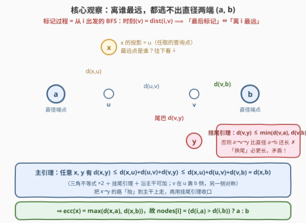
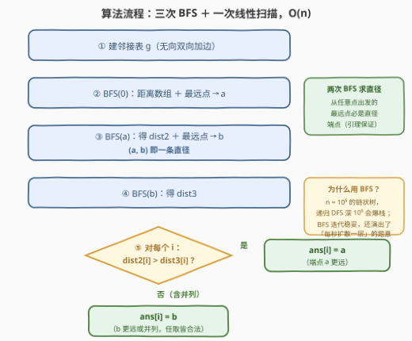
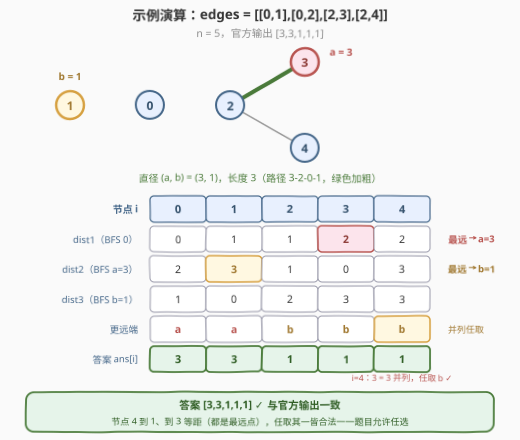

# LeetCode 查找树中最后标记的节点 题解

> ⚠️ 本题为 LeetCode **付费题**（`isPaidOnly`）。下方题意描述、示例与约束依据官方样例与题目规则整理还原，如有出入请以官方为准；算法输出已与三组官方样例逐一比对一致，并通过随机对拍验证。

## 1. 题目概述

- **标题 / 题号**：查找树中最后标记的节点（#3313，hard）
- **链接**：https://leetcode.cn/problems/find-the-last-marked-nodes-in-tree/
- **难度**：困难
- **标签**：树、深度优先搜索、广度优先搜索、树的直径

**题意**：存在一棵 $n$ 个节点的**无向树**，节点编号 $0 \sim n-1$，以长度为 $n-1$ 的二维整数数组 `edges` 给出，其中 `edges[i] = [u_i, v_i]` 表示节点 $u_i$ 与 $v_i$ 之间有一条边。

初始时**所有节点均未标记**。标记规则如下：

- 若你在时刻 $t = 0$ 标记节点 $i$；
- 此后**每过一秒**，所有**与至少一个已标记节点相邻**的未标记节点会被**同时**标记。

请返回数组 `nodes`，其中 `nodes[i]` 表示：从节点 $i$ 开始上述过程时，**最后**被标记的节点。若某个 `nodes[i]` 存在多个合法答案，**任选其一**即可。

**示例 1**：

```text
输入：edges = [[0,1],[0,2]]
输出：[2,2,1]
解释：
- i = 0：标记序列为 [0] → [0,1,2]，节点 1、2 同时最后标记，任选其一；
- i = 1：标记序列为 [1] → [0,1] → [0,1,2]，节点 2 最后标记；
- i = 2：标记序列为 [2] → [0,2] → [0,1,2]，节点 1 最后标记。
```

**示例 2**：

```text
输入：edges = [[0,1]]
输出：[1,0]
解释：i = 0 时 [0] → [0,1]；i = 1 时 [1] → [0,1]。
```

**示例 3**：

```text
输入：edges = [[0,1],[0,2],[2,3],[2,4]]
输出：[3,3,1,1,1]
解释：
- i = 0：[0] → [0,1,2] → [0,1,2,3,4]；
- i = 1：[1] → [0,1] → [0,1,2] → [0,1,2,3,4]；
- i = 2：[2] → [0,2,3,4] → [0,1,2,3,4]；
- i = 3：[3] → [2,3] → [0,2,3,4] → [0,1,2,3,4]；
- i = 4：[4] → [2,4] → [0,2,3,4] → [0,1,2,3,4]。
```

**约束**：

- $2 \le n \le 10^5$
- $\text{edges.length} = n - 1$
- $0 \le \text{edges}[i][0], \text{edges}[i][1] \le n - 1$
- 输入保证 `edges` 表示一棵合法的树。

> 💡 **读题关键**：① 标记规则就是 **BFS 的逐层扩散**——归纳可知节点 $v$ 被标记的时刻恰为 $\mathrm{dist}(i, v)$，于是「最后被标记」$\iff$「离 $i$ 最远」；② 答案允许**任选**，说明并列时不需要任何编号/字典序语义，只需对每个 $i$ 给出**某一个**最远点；③ $n \le 10^5$，对每个起点各跑一遍 BFS 的 $O(n^2)$ 不可行，需要线性算法。

## 2. 解题思路

### 2.1 暴力思路：每个起点跑一遍 BFS

最直接的做法：对每个 $i$ 从它出发跑一遍 BFS，求出全体距离后取最大者：

```cpp
for (int i = 0; i < n; ++i) {        // n 个起点
    bfs(i);                            // 每次遍历整棵树
    ans[i] = 最远的节点;
}
```

单次 BFS 是 $O(n)$，总计 $O(n^2)$——$n = 10^5$ 时约 $10^{10}$ 步，超时约两个数量级。难点在于「每个点的最远点」看似是 $n$ 个互相独立的查询，必须找到能把它们**一次性拴在一起**的结构。

### 2.2 核心观察：离谁最远，都逃不出直径两端

**第一步：把「最后标记」翻译成「最远」。**

从 $i$ 出发的标记过程，就是以 $i$ 为源、每秒向外推一层边界的 BFS：对时刻 $t$ 归纳可证，第 $t$ 秒末恰好标记完所有满足 $\mathrm{dist}(i, v) \le t$ 的节点。因此

$$\text{nodes}[i] = 离\ i\ 最远的节点（任取一个）$$

**第二步：树的直径一锤定音。**

记树的**直径**为树上最长路径（边数），设 $(a, b)$ 是任意一条直径。「每个点的最远点」有个著名性质能全部挂在一条路径上：

> **引理（直径端点覆盖最远点）**：对树上**任意**节点 $x$，
> $$\mathrm{ecc}(x) := \max_y d(x, y) = \max\big(d(x, a),\ d(x, b)\big)$$
> 即：离 $x$ 最远的距离，必然在直径端点 $a$ 或 $b$ 处取到。

证明只需要一个「挂尾」观察。把直径路径 $(a, b)$ 想成一根横放的**主干**，树上其余节点都像挂件一样从主干的某一点垂下来。称节点 $y$ 到主干最近的点 $v$ 为 $y$ 的**投影**，$y$ 到 $v$ 的那段路称为 $y$ 的**尾巴**。



**挂尾引理**：任何节点 $y$（投影为 $v$）的尾巴，不超过它沿主干到两端的距离：

$$d(v, y) \le \min\big(d(v, a),\ d(v, b)\big)$$

证明两行：由 $(a,b)$ 是直径知 $d(a, y) \le d(a, b)$；而 $a$ 到 $y$ 的路径必先沿主干走到 $v$ 再垂下，即 $d(a, y) = d(a, v) + d(v, y)$、$d(a, b) = d(a, v) + d(v, b)$，两式相减得 $d(v, y) \le d(v, b)$；与 $b$ 对称得另一半。∎

直觉说法是**「换尾」**：若某个挂件的尾巴比它沿主干到某一端的段更长，就把那一端「换」成尾巴尖——$a \to v \to y$ 将比 $a \to v \to b$ 更长，与直径的最长性矛盾。

**主引理证明**：任取 $x$（投影 $u$）与任意 $y$（投影 $v$），不妨设 $v$ 在主干上 $u$ 靠 $b$ 的一侧（$v = u$ 时退化）。用两次**三角不等式**把 $x \to y$ 的路径「抬升」到主干上，再用挂尾引理收口：

$$d(x, y) \;\le\; \underbrace{d(x, u)}_{x\ 汇入主干} + \underbrace{d(u, v)}_{沿主干} + \underbrace{d(v, y)}_{尾巴} \;\le\; d(x, u) + d(u, v) + d(v, b) \;=\; d(x, u) + d(u, b) \;=\; d(x, b)$$

（最后一步用 $v$ 在 $u$ 与 $b$ 之间、沿主干距离可加。）于是对一切 $y$ 都有 $d(x, y) \le d(x, b) \le \max(d(x, a), d(x, b))$；而 $a$、$b$ 本身也是候选的 $y$，故 $\mathrm{ecc}(x) = \max(d(x, a), d(x, b))$。∎

> 💡 这个引理的强大之处：**无论 $x$ 在树的哪个角落，它的最远点候选集都收缩到 $\{a, b\}$ 两个点**。$n$ 个独立查询瞬间坍缩成「距离 $a$ 近还是距离 $b$ 近」的二选一。

**第三步：直径怎么找？——经典两次遍历。**

从**任意**节点 $s$ 出发 BFS 找最远点 $a$，再从 $a$ 出发 BFS 找最远点 $b$，则 $(a, b)$ 是一条直径。正确性同样被上面的不等式链封死：把链条取 $x = s$、$y = s$ 的最远点，则链首 $d(s, y)$ 与链尾 $\max(d(s,p), d(s,q))$（$(p,q)$ 为任一直径）相等，**全链取等**——特别地，$y$ 的尾巴恰等于对应端点段，于是把该端点换成 $y$ 后路径不长不短，$(y, 另一端)$ 也是一条直径，$y$ 是货真价实的直径端点（细节见第 6 节问答 3）。

于是本题答案呼之欲出：

$$\text{nodes}[i] = \begin{cases} a, & d(i, a) > d(i, b) \\ b, & \text{否则（含并列，任取一侧均合法）} \end{cases}$$

### 2.3 算法流程：三次遍历定乾坤

1. 由 `edges` 建邻接表（无向，双向加边）；
2. **第一遍 BFS**：从任意节点（取 $0$）出发，求距离数组并维护最远点 → 得直径端点 $a$；
3. **第二遍 BFS**：从 $a$ 出发，得 `dist2[]`（全体节点到 $a$ 的距离）并维护最远点 → 得另一端点 $b$，$(a, b)$ 即一条直径；
4. **第三遍 BFS**：从 $b$ 出发，得 `dist3[]`；
5. **一维扫描**：`ans[i] = dist2[i] > dist3[i] ? a : b`。



> 💡 **为什么用 BFS 而不是 DFS**：无权树中两者都能求距离与最远点，功能等价；但 $n = 10^5$ 的链状树会让递归 DFS 深达 $10^5$ 层——Python 默认递归上限 1000 直接爆栈，C++ 也有栈深风险。BFS 天然迭代，还顺手把「每秒扩散一层」的题意原样演了出来。

### 2.4 示例演算

以示例 3 `edges = [[0,1],[0,2],[2,3],[2,4]]`（$n = 5$）走完全流程：



1. **BFS(0)**：$\text{dist1} = [0, 1, 1, 2, 2]$，最远点 $a = 3$（距离 2）；
2. **BFS(3)**：$\text{dist2} = [2, 3, 1, 0, 3]$，最远点 $b = 1$（距离 3）→ $(a, b) = (3, 1)$ 是一条直径（路径 $3\text{-}2\text{-}0\text{-}1$，长度 3）；
3. **BFS(1)**：$\text{dist3} = [1, 0, 2, 3, 3]$；
4. **逐点二选一**：

| $i$ | dist2[i] | dist3[i] | 更远端 | ans[i] |
|---|---|---|---|---|
| 0 | 2 | 1 | $a$ | **3** |
| 1 | 3 | 0 | $a$ | **3** |
| 2 | 1 | 2 | $b$ | **1** |
| 3 | 0 | 3 | $b$ | **1** |
| 4 | 3 | 3 | 并列，任取 $b$ | **1** |

答案 $[3, 3, 1, 1, 1]$，与官方输出一致 ✓。注意 $i = 4$ 时两端等距（$3 = 3$）：节点 4 到 1、到 3 都是 3，两个都是合法的「最后标记节点」，题目允许任选——这也解释了为什么官方样例 1 中 `ans[0] = 2` 而不是编号更小的 1。

## 3. 参考代码

### C++

```cpp
class Solution {
  public:
    vector<int> lastMarkedNodes(vector<vector<int>>& edges) {
        int n = edges.size() + 1;
        vector<vector<int>> g(n);                     // 无向树邻接表
        for (auto& e : edges) {
            g[e[0]].push_back(e[1]);
            g[e[1]].push_back(e[0]);
        }

        // BFS：返回 (距离数组, 最远点)。dist 用 -1 兼作 visited
        auto bfs = [&](int start) {
            vector<int> dist(n, -1);
            queue<int> q;
            dist[start] = 0;
            q.push(start);
            int far = start;
            while (!q.empty()) {
                int u = q.front();
                q.pop();
                if (dist[u] > dist[far]) far = u;     // 维护最远点
                for (int v : g[u]) {
                    if (dist[v] == -1) {              // 未访问 = 未标记
                        dist[v] = dist[u] + 1;
                        q.push(v);
                    }
                }
            }
            return make_pair(dist, far);
        };

        auto [d1, a] = bfs(0);    // ① 任意点出发 → 直径端点 a
        auto [d2, b] = bfs(a);    // ② 从 a → dist2 与另一端点 b，(a,b) 即直径
        auto [d3, c] = bfs(b);    // ③ 从 b → dist3

        vector<int> ans(n);
        for (int i = 0; i < n; ++i)
            ans[i] = d2[i] > d3[i] ? a : b;           // 谁更远谁最后被标记
        return ans;
    }
};
```

### Python

```python
class Solution:
    def lastMarkedNodes(self, edges: List[List[int]]) -> List[int]:
        n = len(edges) + 1
        g = [[] for _ in range(n)]                    # 无向树邻接表
        for u, v in edges:
            g[u].append(v)
            g[v].append(u)

        def bfs(start: int):                          # 返回 (距离数组, 最远点)
            dist = [-1] * n                           # -1 兼作 visited
            dist[start] = 0
            q = deque([start])
            far = start
            while q:
                u = q.popleft()
                if dist[u] > dist[far]:               # 维护最远点
                    far = u
                for v in g[u]:
                    if dist[v] == -1:                 # 未访问 = 未标记
                        dist[v] = dist[u] + 1
                        q.append(v)
            return dist, far

        _, a = bfs(0)          # ① 任意点出发 → 直径端点 a
        d2, b = bfs(a)         # ② 从 a → dist2 与另一端点 b，(a,b) 即直径
        d3, _ = bfs(b)         # ③ 从 b → dist3

        return [a if x > y else b for x, y in zip(d2, d3)]
```

> 💡 **实现细节**：① `dist` 初始化为 $-1$，一身兼二职——距离数组 + 未访问标记；② 最远点在出队时顺手维护（取**首个**达到最大距离的点，并列时任取都合法）；③ Python 的 `deque` 需要 `from collections import deque`（LeetCode 环境已预置）；④ C++ 用 `make_pair` + 结构化绑定 `auto [d, far] = ...` 收两个返回值，避免再写 struct。

## 4. 复杂度分析

| 维度 | 复杂度 | 说明 |
|------|--------|------|
| 时间复杂度 | $O(n)$ | 三次 BFS（每次访问全部 $n$ 个节点、$2(n-1)$ 条有向边）+ 一次线性扫描；$n = 10^5$ 时约 $10^6$ 步量级 |
| 空间复杂度 | $O(n)$ | 邻接表 $2(n-1)$ 条边 + 三个距离数组 + BFS 队列 |
| 暴力对照 | $O(n^2)$ 时间 | 每个起点一遍 BFS，$n = 10^5$ 时 $\approx 10^{10}$ 步，超时约两个数量级 |

实测：三组官方样例 $[2,2,1] / [1,0] / [3,3,1,1,1]$ ✓；与「逐点 BFS」暴力对拍随机数据（$n \le 13$）3000 组，答案均落在该起点的**最远点集合**内（题目允许任选并列答案）；满规模（$n = 10^5$，随机树与链状树）Python 约 0.25 s。

## 5. 扩展：时刻版、直径求法与并列语义

**「问时间」的姊妹题与武器分野。** 同一标记过程若改问「标记完所有节点需要多少秒」（无延迟），答案就是 $\mathrm{ecc}(i) = \max(d(i,a), d(i,b))$——直径端点法原样适用，连比较都不用改。但 [3241. 标记所有节点需要的时间](../3201-3300/3241_标记所有节点需要的时间.md) 在规则里加了**奇偶延迟**（偶数编号节点要多等一秒才被标记），「时刻 = 距离」被破坏，最晚标记的节点不再是最远点，直径端点法失效，只能老老实实**换根 DP**：自底向上维护每个子树的最深/次深，再自顶向下拼接「向上」的那条臂。两题对照说明一个通用判断：**先问「时刻是否等于距离」，再选武器**。

**直径的三种求法。** ① 两次 BFS/DFS（本题所用，无权树专属）；② 树形 DP：经过 $v$ 的最长路 = 子树内最深 + 次深（[543. 二叉树的直径](../0501-0600/543_二叉树的直径.md) 的套路，边上带权或带限制时可推广，如 2246 的「相邻字符不同」约束）；③ 性质法：直径的中点恰是使 $\mathrm{ecc}$ 最小的树中心（[310. 最小高度树](../0301-0400/310_最小高度树.md)）。同一根直径，三种视角，面试里可互相印证。

**如果要求「并列时返回编号最小」呢？** 引理只保证 $\{a, b\}$ **之一**达到最远距离，但最远点集合可能包含其他节点——例如星形树 `edges = [[0,1],[0,2],[0,3]]`，中心 0 的最远点是 $\{1,2,3\}$，而两次 BFS 选中的直径端点是 $(1, 2)$，算法对 $i=0$ 返回 2——合法但不是编号最小的 1。真要编号最小，得用换根 DP 维护「(最远距离, 该距离下的最小编号)」这类带 tie-break 的复合信息，复杂度仍 $O(n)$ 但代码量翻倍。本题明说「任选其一」，把这层复杂度优雅地让渡掉了。

## 6. 面试要点

1. **为什么「最后被标记」=「离起点最远」？**

   - 归纳：$t=0$ 标记 $i$；若第 $t$ 秒末已标记的恰是 $\{v : \mathrm{dist}(i,v) \le t\}$，则下一秒新标记的恰是 $\{v : \mathrm{dist}(i,v) = t+1\}$（这类节点必有距离为 $t$ 的邻居，而距离 $\le t$ 的早已标记）。标记过程与 BFS 完全同构，最后被标记的时刻 $= \mathrm{ecc}(i)$。

2. **直径端点引理的证明链条是什么？**

   - 两块积木：**挂尾引理**（$d(v,y) \le \min(d(v,a), d(v,b))$，两行证完：直径最长性 + 路径过投影分解）与**三角不等式**。链条：$d(x,y) \le d(x,u) + d(u,v) + d(v,y) \le d(x,u) + d(u,v) + d(v,b) = d(x,b)$。面试时能默写这条链，比背结论有说服力得多。

3. **两次 BFS 求直径为什么正确？**

   - 设 $s$ 任意、$y$ 是 $s$ 的最远点，$(p,q)$ 是任一直径。把链条代入 $x = s$：$d(s,y) \le \cdots \le d(s,q) \le \mathrm{ecc}(s) = d(s,y)$，**全链取等**，于是 $y$ 的尾巴 $d(v,y)$ 恰等于对应端点段 $d(v,q)$，从而 $d(y,p) = d(v,y) + d(v,p) = d(v,q) + d(v,p) = d(p,q)$，$(y,p)$ 也是直径。顺带还证得一个加强结论：**任意点的任意最远点都必是某条直径的端点**。

4. **和 3241「标记所有节点需要的时间」的本质区别在哪？**

   - 3241 的偶数节点延迟一秒，「时刻 = 距离」不成立，最后标记的节点/时刻都不能用最远点刻画，必须换根 DP 逐点计算；本题无延迟，最远点即答案，直径端点法三次遍历收工。反向地，若无延迟问「时间」，答案 $= \mathrm{ecc}(i) = \max(d(i,a), d(i,b))$，还是这套方法。

5. **实现上有哪些坑？**

   - $n = 10^5$ 的链状树递归深度 $10^5$：Python 爆默认递归上限，C++ 也有栈溢出风险，用迭代 BFS 稳妥；无向边记得**双向**建邻接表；`dist` 用 $-1$ 兼作 visited 省一个数组；最远点并列时取谁都合法（题目已声明任选），不必纠结 tie-break。

## 同类练习题

| # | 题目 | 与本题的关联 |
|---|------|-------------|
| 3241 | [标记所有节点需要的时间](https://leetcode.cn/problems/time-taken-to-mark-all-nodes/)（[站内题解](../3201-3300/3241_标记所有节点需要的时间.md)） | 同一「逐秒标记」过程加奇偶延迟、改问时间——「时刻=距离」失效后的换根 DP 对照组 |
| 543 | [二叉树的直径](https://leetcode.cn/problems/diameter-of-binary-tree/)（[站内题解](../0501-0600/543_二叉树的直径.md)） | 树形 DP 求直径（最深+次深合并）的入门母题 |
| 310 | [最小高度树](https://leetcode.cn/problems/minimum-height-trees/)（[站内题解](../0301-0400/310_最小高度树.md)） | 找 $\mathrm{ecc}$ 最小的节点 = 直径中点，同一族「直径定全局」性质 |
| 1245 | [树的直径](https://leetcode.cn/problems/tree-diameter/) | 本题「两次 BFS 求直径」套路的直接母题（付费题） |
| 2246 | [相邻字符不同时最长路径](https://leetcode.cn/problems/longest-path-with-different-adjacent-characters/) | 带约束的直径变体，练树形 DP 求最长路的推广 |
