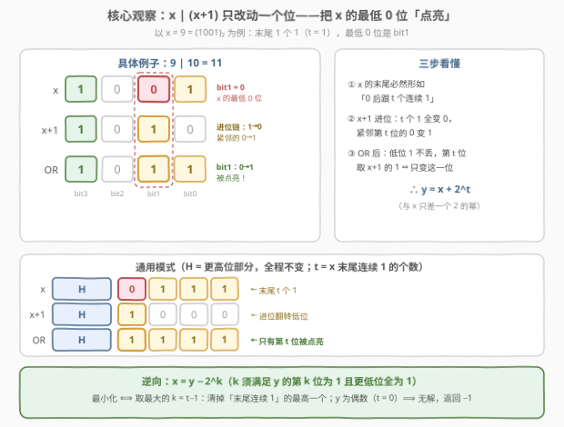
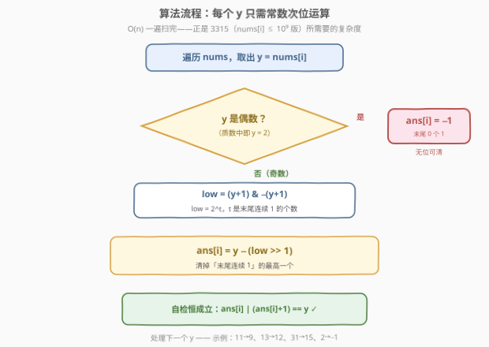
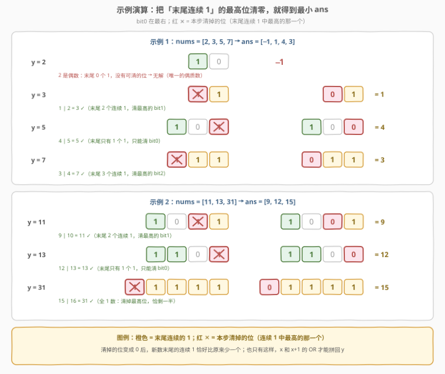

# LeetCode 构造最小位运算数组 I 题解

## 1. 题目概述

- **标题 / 题号**：构造最小位运算数组 I（#3314，easy）
- **链接**：https://leetcode.cn/problems/construct-the-minimum-bitwise-array-i/
- **难度**：简单
- **标签**：位运算、数组、lowbit

**题意**：给你一个长度为 $n$ 的**质数**数组 `nums`。你的任务是返回一个长度为 $n$ 的数组 `ans`，对于每个下标 $i$，以下**条件**均成立：

$$ans[i] \;|\; (ans[i] + 1) = nums[i]$$

除此之外，你需要**最小化**结果数组里每一个 $ans[i]$。如果没法找到符合条件的 $ans[i]$，那么 $ans[i] = -1$。

**示例 1**：

```text
输入：nums = [2,3,5,7]
输出：[-1,1,4,3]
解释：1 | (1+1) = 3，4 | (4+1) = 5，3 | (3+1) = 7；
     而 2 找不到任何 x 满足 x | (x+1) = 2，故为 -1。
```

**示例 2**：

```text
输入：nums = [11,13,31]
输出：[9,12,15]
解释：9 | 10 = 11，12 | 13 = 13，15 | 16 = 31。
```

**约束**：

- $1 \le nums.length \le 100$
- $2 \le nums[i] \le 1000$
- $nums[i]$ 是一个质数

> 💡 **审题关键**：正向问「给定 $x$，求 $x \,|\, (x+1)$」是平凡的；本题是**逆问题**——给定 OR 的结果 $y$，反解出最小的原像 $x$。逆解的钥匙是想清楚一件小事：$x \,|\, (x+1)$ 到底对 $x$ **改了什么**？答案是惊人地简洁：只改一个位。把这个位找出来，逆问题就变成了「从 $y$ 里去掉哪个位」的选择题。

## 2. 解题思路

### 2.1 暴力思路：从小到大枚举 x

官方 hint 直接明示了暴力：数据范围极小，可以对每个 $y$ 从小到大枚举所有候选 $x$。

枚举上界有一个小观察：OR 的结果逐位不低于任一操作数，故 $x \,|\, (x+1) \ge x+1 > x$；若要等于 $y$，必然 $x < y$，枚举 $[0, y)$ 即可完备。又因为**从小到大**枚举，第一个命中的就是最小解，直接 `break`。

```cpp
vector<int> minBitwiseArray(vector<int>& nums) {
    vector<int> ans;
    for (int y : nums) {
        int best = -1;
        for (int x = 0; x < y; ++x)      // x | (x+1) ≥ x+1 > x ⟹ 合法 x 必然小于 y
            if ((x | (x + 1)) == y) { best = x; break; }
        ans.push_back(best);
    }
    return ans;
}
```

复杂度 $O(n \cdot U)$，$U = \max nums[i] \le 1000$，总计约 $10^5$ 次判断，轻松通过本题。

> ⚠️ 暴力能过 3314，但**同一题面**的进阶版 [3315. 构造最小位运算数组 II](https://leetcode.cn/problems/construct-the-minimum-bitwise-array-ii/) 把 $nums[i]$ 放大到 $10^9$，逐个枚举直接超时——双联题的设计意图就是逼你把「为什么」想透，得到 $O(1)$ 公式。

### 2.2 核心观察：x | (x+1) 就是「点亮 x 的最低 0 位」



设 $x$ 的二进制**末尾有 $t$ 个连续的 1**（高位部分记作 $H$，把 $x$ 视作无限高位补 0）。$x+1$ 的进位恰好翻转了从 bit0 起的整段：

| | 高位 | 第 $t$ 位 | 低 $t$ 位 |
|------|:---:|:---:|:---:|
| $x$ | $H$ | **0** | $11\cdots1$ |
| $x+1$ | $H$ | **1** | $00\cdots0$ |
| $x \,\|\, (x+1)$ | $H$ | **1** | $11\cdots1$ |

- 进位链止于第一个 0：低 $t$ 个 1 全变 0，紧邻的第 $t$ 位由 0 变 1；
- OR 把它们合起来：低 $t$ 位用回 $x$ 自己的 1（本来就是 1），第 $t$ 位用 $x+1$ 的 1，高位两者相同。

于是与 $x$ 相比，$y = x \,|\, (x+1)$ **恰好只把第 $t$ 位（$x$ 的最低 0 位）从 0 改成 1**，即：

$$y = x + 2^t$$

**逆向构造**：既然 $y$ 与 $x$ 只差一个 2 的幂，则 $x = y - 2^k$，且 $k$ 必须满足「$y$ 的第 $k$ 位是 1，且第 $0 \sim k-1$ 位全是 1」（这样 $x$ 的末尾才是「第 $k$ 位为 0、低位全 1」，进位链才能在 $k$ 处停下）。设 $y$ 末尾有 $t$ 个连续 1，则**合法的 $k$ 恰好是 $0, 1, \dots, t-1$**：第 $t$ 位是 0 不行，比 $t$ 更高的位其低位里含 0 也不行。

**最小化**：$x = y - 2^k$ 随 $2^k$ 增大而减小 ⟹ 取最大的 $k = t-1$：

$$\boxed{ans = y - 2^{t-1}} \quad\text{——把「末尾连续 1」的最高一个清零}$$

**无解判定**：$t = 0$（$y$ 为偶数）时不存在合法的 $k$，返回 $-1$。而质数中唯一的偶数是 2——**「质数」这个条件在整道题里唯一的作用，就是保证除 2 以外全是奇数**（末尾至少 1 个 1，必有解）。

**$O(1)$ 求出 $2^t$**：$y$ 末尾 $t$ 个 1 加 1 进位后，$y+1$ 恰好在第 $t$ 位有一个 1、低位全 0，所以：

$$2^t = \mathrm{lowbit}(y+1) = (y+1) \,\&\, -(y+1)$$

代回得一行公式 $ans = y - \big(\mathrm{lowbit}(y+1) \gg 1\big)$。逐例验证：

| $y$ | 二进制 | $t$（末尾连续 1） | $y+1$ | $\mathrm{lowbit}(y+1)$ | $ans$ | 验证 |
|:---:|:---:|:---:|:---:|:---:|:---:|------|
| 2 | `10` | 0 | — | — | **-1** | 偶数无解（唯一偶质数） |
| 3 | `11` | 2 | `100` | 4 | **1** | $1 \,|\, 2 = 3$ ✓ |
| 5 | `101` | 1 | `110` | 2 | **4** | $4 \,|\, 5 = 5$ ✓ |
| 7 | `111` | 3 | `1000` | 8 | **3** | $3 \,|\, 4 = 7$ ✓ |
| 11 | `1011` | 2 | `1100` | 4 | **9** | $9 \,|\, 10 = 11$ ✓ |
| 13 | `1101` | 1 | `1110` | 2 | **12** | $12 \,|\, 13 = 13$ ✓ |
| 31 | `11111` | 5 | `100000` | 32 | **15** | $15 \,|\, 16 = 31$ ✓ |

> 💡 直觉版本：$x \,|\, (x+1)$ 总是产生「低几位全 1」的形状；反过来，$y$ 的末尾 1 段就是「可以拆掉的积木」——拆掉段内最高的一块（$0$ 顶替），剩下的就是最小的原像。

### 2.3 算法流程图



整个算法对每个 $y$ 只有三步：

| 步骤 | 操作 | 语义 | 示例（$y=11$） |
|------|------|------|----------------|
| ① 判偶 | `y % 2 == 0` | 偶数（质数中即 2）末尾 0 个 1，无位可清 | 11 为奇 → 继续 |
| ② 求低幂 | `(y+1) & -(y+1)` | $2^t$，即末尾连续 1 的长度信息 | $12 \,\&\, -12 = 4$ |
| ③ 清位 | `y - (low >> 1)` | 清掉末尾连续 1 的最高一个 | $11 - 2 = 9$ |

### 2.4 示例演算



把两个官方示例逐元素过一遍（红 ✕ 标记被清掉的位）：

**示例 1**（$[2,3,5,7] \to [-1,1,4,3]$）：

- $2 = (10)_2$：末尾 0 个 1，无位可清 → $-1$；
- $3 = (11)_2$：末尾 2 个 1，清最高的 bit1 → $(01)_2 = 1$；
- $5 = (101)_2$：末尾 1 个 1，只能清 bit0 → $(100)_2 = 4$；
- $7 = (111)_2$：末尾 3 个 1，清最高的 bit2 → $(011)_2 = 3$。

**示例 2**（$[11,13,31] \to [9,12,15]$）：

- $11 = (1011)_2$：末尾 2 个 1，清 bit1 → $(1001)_2 = 9$；
- $13 = (1101)_2$：末尾 1 个 1，清 bit0 → $(1100)_2 = 12$；
- $31 = (11111)_2$：全 1 数，清最高位 bit4 → $(01111)_2 = 15$（恰剩一半）。

> 💡 注意 $31$ 这种「全 1」极端情形：清掉最高位后低位仍全 1，$15 \,|\, 16 = 31$ 依然成立——「最低 0 位」在 $15$ 的表示界外，进位链照样在虚拟高位停下。公式无需任何特判。

## 3. 参考代码

### C++

```cpp
class Solution {
public:
    vector<int> minBitwiseArray(vector<int>& nums) {
        vector<int> ans;
        ans.reserve(nums.size());
        for (int y : nums) {
            if (y % 2 == 0) {                    // 质数中唯一的偶数 2：末尾 0 个 1，无解
                ans.push_back(-1);
            } else {
                int low = (y + 1) & -(y + 1);    // lowbit(y+1) = 2^t（t = 末尾连续 1 的个数）
                ans.push_back(y - (low >> 1));   // 清掉末尾连续 1 的最高一个
            }
        }
        return ans;
    }
};
```

> 💡 `lowbit` 也可写成 `(y + 1) & ~y`——因为 $\sim y = -(y+1)$（补码恒等式），两种写法逐位相同。想用内建函数的话：`t = __builtin_ctz(~y)`（$\sim y$ 的末尾 0 个数恰是 $y$ 的末尾 1 个数），再 `y - (1 << (t - 1))`。

### Python

```python
class Solution:
    def minBitwiseArray(self, nums: List[int]) -> List[int]:
        ans = []
        for y in nums:
            if y % 2 == 0:                  # 唯一偶质数 2：无解
                ans.append(-1)
            else:
                low = (y + 1) & -(y + 1)    # 2^t
                ans.append(y - (low >> 1))  # 清掉末尾连续 1 的最高位
        return ans
```

> 💡 一行版：`[y - (((y + 1) & -(y + 1)) >> 1) if y % 2 else -1 for y in nums]`。Python 的负数按无限精度补码处理，`(y+1) & -(y+1)` 与 C++ 语义一致。

## 4. 复杂度分析

| 维度 | 复杂度 | 说明 |
|------|--------|------|
| **时间复杂度** | $O(n)$ | 每个元素常数次位运算（判偶 + lowbit + 移位减法）；暴力版为 $O(n \cdot U)$，$U \le 1000$，本题同样可过 |
| **空间复杂度** | $O(1)$ | 除输出数组外仅用常数个整型变量 |

> 对照 2.1：暴力对每个 $y$ 平均扫 $U/2$ 次，位技巧把它压缩成 3 条指令——差距在 3314（$U \le 1000$）只是「快慢」，在 3315（$U \le 10^9$）就是「过与不过」。

## 5. 扩展

### 5.1 一对漂亮的对称操作：「点亮最低 0」与「熄灭最低 1」

本题的正向操作可以写成恒等式：$x \,|\, (x+1) = x + \mathrm{lowbit}(\sim x)$——把 $x$ 的最低 0 位**点亮**。因为低 $t$ 位全 1，加上 $2^t$ 不产生向高位的进位，「置 1」与「加权和」等价。它与老朋友 $x \,\&\, (x-1) = x - \mathrm{lowbit}(x)$（**熄灭**最低 1 位，[191](https://leetcode.cn/problems/number-of-1-bits/) / [231](https://leetcode.cn/problems/power-of-two/) 的主角）恰好构成一对镜像：

| 操作 | 公式 | 效果 |
|------|------|------|
| 点亮最低 0 位 | $x \,\|\, (x+1) = x + \mathrm{lowbit}(\sim x)$ | 本题正向 |
| 熄灭最低 1 位 | $x \,\&\, (x-1) = x - \mathrm{lowbit}(x)$ | 191 / 231 |

本题的逆向操作「清掉末尾 1 段的**最高**位」不是熄灭最低 1（那是最小化逼出来的选择），但这组对称式是很好的记忆锚点。

### 5.2 「相邻整数的位结构」一族

$x$ 与 $x+1$ 只在「低位翻转段」上不同——这个观察养活了一串题目：

- [201. 数字范围按位与](https://leetcode.cn/problems/bitwise-and-of-numbers-range/)：区间 AND 的结果 = 所有数的公共前缀（进位必然吃掉低位）；
- [260. 只出现一次的数字 III](https://leetcode.cn/problems/single-number-iii/)：$\mathrm{lowbit}$ 把异或结果按某一位分组；
- [371. 两整数之和](https://leetcode.cn/problems/sum-of-two-integers/)：进位链的完整版——本题 $x+1$ 的进位正是它的特例。

### 5.3 双联题：3315 构造最小位运算数组 II

同一题面，$2 \le nums[i] \le 10^9$。暴力 $O(U)$ 枚举在 $10^9$ 规模下失效，必须使用本题推导的 $O(1)$ 公式——**公式本身一字不改**。官方 hints 也直指要害：「偶数无解」「试着从 $nums[i]$ 里去掉一个 bit」。双联题（I 简单 / II 中等）的常见套路：I 给足数据范围让你暴力摸清题意，II 收紧范围逼出数学结构。

## 6. 面试要点

1. **$x \,|\, (x+1)$ 对 $x$ 做了什么？为什么只改一个位？**

   > 设 $x$ 末尾 $t$ 个连续 1。$x+1$ 恰好把这 $t$ 个 1 清零、把紧邻的 0 置 1。OR 之后，低 $t$ 位用 $x$ 自己的 1 补回，高位两者相同——与 $x$ 相比只有第 $t$ 位从 0 变 1，故 $y = x + 2^t$。本质：进位链止于第一个 0，OR 又把链上翻成 0 的位填了回去。

2. **为什么无解当且仅当 $y$ 是偶数？「质数」条件有什么用？**

   > 逆向要求 $x = y - 2^k$ 且 $y$ 的第 $0 \sim k-1$ 位全 1，至少 $k=0$ 时要求 bit0 为 1，故 $y$ 必须是奇数；偶数（$t=0$）无解。质数条件保证除 2 外全是奇数——整道题只有 $nums[i]=2$ 产生 $-1$。算法本身只依赖**奇偶性**，不依赖质数性。

3. **为什么最优解是清「末尾连续 1」里最高的那个，而不是清最低位？**

   > 候选 $x = y - 2^k$，$k$ 只能取 $0 \sim t-1$。$2^k$ 越大减得越多、$x$ 越小，故取 $k = t-1$。清 bit0 只减 1，清末尾段的最高位减得最多——「最小化」三个字直接决定了选段内最高的块。

4. **$\mathrm{lowbit}(y+1)$ 为什么等于 $2^t$？不用 lowbit 怎么写？**

   > $y$ 末尾 $t$ 个 1 加 1 后进位，$y+1$ 在第 $t$ 位是 1、低 $t$ 位全 0，其最低 1 位就是 $2^t$。不用 lowbit 可以循环数末尾 1（`while ((y >> t) & 1) ++t;`，$O(\log y)$），或用 `__builtin_ctz(~y)` 一条指令。

5. **如何证明 $x \,|\, (x+1) \ge x+1$，从而暴力枚举上界取 $y-1$ 就完备？**

   > OR 的结果包含每个操作数的所有 1 位（位的超集），对非负整数而言位超集 ⟹ 数值不小于它，故 $x \,|\, (x+1) \ge x+1 > x$。若结果为 $y$ 则 $x \le y-1$，枚举 $[0, y)$ 完备；配合从小到大扫描，首个命中即最小解。

> 💡 **一句话总结**：$x \,|\, (x+1)$ 只做一件事——点亮 $x$ 的最低 0 位；逆过来，$ans$ 就是把 $y$ 末尾连续 1 的最高一个清零：$ans = y - (\mathrm{lowbit}(y+1) \gg 1)$，偶数（质数里只有 2）返回 $-1$。

## 同类练习题

| # | 题目 | 与本题的关联 |
|---|------|-------------|
| 3315 | [构造最小位运算数组 II](https://leetcode.cn/problems/construct-the-minimum-bitwise-array-ii/) | 同一题面的 $10^9$ 放大版，暴力失效，直接复用本题的 lowbit 公式——检验你是否真的吃透了推导 |
| 191 | [位 1 的个数](https://leetcode.cn/problems/number-of-1-bits/)（[站内题解](../0001-0100/191_位1的个数.md)） | $x \,\&\, (x-1)$ 熄灭最低 1 位，与本题「点亮最低 0 位」构成对称操作对 |
| 260 | [只出现一次的数字 III](https://leetcode.cn/problems/single-number-iii/)（[站内题解](../0201-0300/260_只出现一次的数字III.md)） | $x \,\&\, -x$ 提取 lowbit 的经典应用（按异或结果的最低差异位分组） |
| 201 | [数字范围按位与](https://leetcode.cn/problems/bitwise-and-of-numbers-range/)（[站内题解](../0201-0300/201_数字范围按位与.md)） | 同样吃透「相邻整数只有低位不同」的进位结构，找公共前缀 |
| 371 | [两整数之和](https://leetcode.cn/problems/sum-of-two-integers/)（[站内题解](../0301-0400/371_两整数之和.md)） | 本题 $x+1$ 进位链的完整版——用位运算模拟整个加法 |
