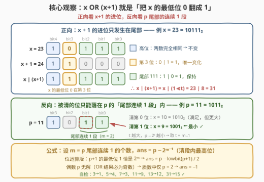
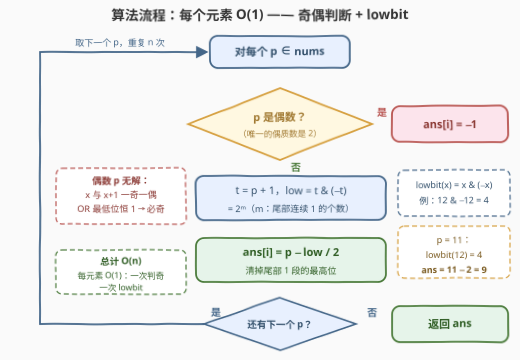
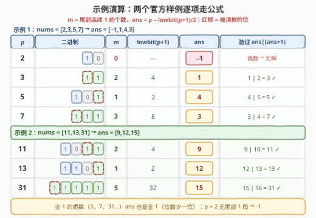

# 构造最小位运算数组 II

- **题目名称**：构造最小位运算数组 II
- **链接**：[3315. 构造最小位运算数组 II](https://leetcode.cn/problems/construct-the-minimum-bitwise-array-ii/)
- **难度**：中等
- **标签**：位运算、数组

## 1. 题目概述

给你一个长度为 $n$ 的**质数**数组 `nums`。你的任务是返回一个长度为 $n$ 的数组 `ans`，对每个下标 $i$ 满足：

$$\text{ans}[i] \;\mathrm{OR}\; (\text{ans}[i] + 1) = \text{nums}[i]$$

此外，你需要**最小化**结果数组里的每一个 $\text{ans}[i]$。如果没法找到符合条件的 $\text{ans}[i]$，那么 $\text{ans}[i] = -1$。

**示例 1**：

```text
输入：nums = [2,3,5,7]
输出：[-1,1,4,3]
解释：
- i = 0：不存在 ans[0] 满足 ans[0] OR (ans[0]+1) = 2，所以 ans[0] = -1
- i = 1：1 OR (1+1) = 3
- i = 2：4 OR (4+1) = 5
- i = 3：3 OR (3+1) = 7
```

**示例 2**：

```text
输入：nums = [11,13,31]
输出：[9,12,15]
解释：9 | 10 = 11，12 | 13 = 13，15 | 16 = 31
```

**约束条件**：

- $1 \le n \le 100$
- $2 \le \text{nums}[i] \le 10^9$
- `nums[i]` 是一个质数

> 💡 **读题关键**：① `nums[i]` 是**质数**——除 2 以外全是奇数，这条性质直接决定了「无解」只可能发生在 $p = 2$；② 要的是**最小**的 `ans[i]`，不是任意一个可行解；③ $\text{nums}[i] \le 10^9 < 2^{30}$，二进制至多 30 位，逐位推理的成本可以忽略。

---

## 2. 解题思路

### 2.1 暴力思路：从 0 枚举到 p−1

对每个 $p$，从 $0$ 到 $p-1$ 逐个检查 $x \mid (x+1) = p$，命中的第一个就是最小值：

```python
for x in range(p):                  # p 最大 10⁹
    if x | (x + 1) == p:
        return x                    # 最小的 x（合法的 x 必 < p）
return -1
```

单个数 $O(p)$，整体 $O(n \cdot \max p) \approx 10^{11}$——不可行。「聪明一点的暴力」是只枚举 $p$ 的每个 1 位、尝试把它清零后验证——$O(\log p)$ 个候选、整体 $O(n\log p)$，能过但仍不是终点：把 $x \mid (x+1)$ 的位模式看透之后，答案可以**一次位运算直接算出**。

### 2.2 核心观察：x OR (x+1) 恰好把 x 的「最低位 0」翻成 1

一切从 $x+1$ 的**进位机制**说起。设 $x$ 的二进制尾部有连续 $t$ 个 1，紧邻其上的第 $t$ 位是 0（即 $x$ 的**最低位 0**），则：

$$x + 1 = \text{尾部 } t \text{ 个 1 全部清零} + \text{第 } t \text{ 位 } 0 \to 1\text{，更高位原样}$$

于是把 $x$ 与 $x+1$ 按位或：

- **高于第 $t$ 位**：两数完全相同 → 原样保留；
- **第 $t$ 位**：$x$ 是 0、$x+1$ 是 1 → 变成 1；
- **低 $t$ 位**：$x$ 全 1、$x+1$ 全 0 → 保持 1。

$$\boxed{\,x \mid (x+1) = x \mid (1 \ll t)\,}\qquad t = x \text{ 的最低位 0 所在的二进制位}$$

**OR 的结果 = $x$ 本身，再把最低位的 0 置 1**——除这一位外任何位都不动。例：$x = 23 = 10111_2$，最低位 0 在第 3 位，$23 \mid 24 = 11111_2 = 31 = 23 \mid 8$。

**反向：给定 $p$，求最小的 $x$。** 由恒等式，$x$ 与 $p$ 恰好只差第 $t$ 位（$p$ 的第 $t$ 位是 1、$x$ 是 0），且 $x$ 的低 $t$ 位全为 1——这些低位原样来自 $p$，于是合法的 $t$ 必须满足：

$$p \text{ 的第 } 0 \sim t-1 \text{ 位全是 1，且第 } t \text{ 位也是 1}$$

即**被清掉的位 $t$ 只能落在 $p$ 的「尾部连续 1 段」之内**。设 $p$ 尾部连续 1 段的长度为 $m$，候选 $t \in \{0, 1, \dots, m-1\}$，对应的 $x = p - 2^t$ 都合法（清掉段内第 $t$ 位后，$x$ 的最低位 0 恰好就是第 $t$ 位，$x \mid (x+1)$ 精确还原 $p$）。要 $x$ 最小就要 $2^t$ 最大，取 $t = m-1$（段内最高位）：

$$\text{ans} = p - 2^{m-1}$$



**用 lowbit 直接算 $2^{m-1}$**：$p+1$ 恰好是「尾部 $m$ 个 1 清零、第 $m$ 位置 1」，所以 $p+1$ 的**最低位 1** 就是第 $m$ 位：

$$2^m = \mathrm{lowbit}(p+1) = (p+1)\,\&\,(-(p+1)) \qquad\Longrightarrow\qquad \text{ans} = p - \frac{\mathrm{lowbit}(p+1)}{2}$$

**无解情形**：$x$ 与 $x+1$ 一奇一偶，偶的那个最低位是 0、奇的那个最低位是 1，所以 $x \mid (x+1)$ 的最低位**恒为 1**——结果必为奇数，偶数的 $p$ 无解。质数中唯一的偶数是 2，这正是示例 1 中 `nums[0] = 2 → -1` 的来历。

> 💡 **快速找规律的方法**（面试中比推理更快）：用小数据打表——3→1、5→4、7→3、11→9、13→12、31→15，把 $p$ 与答案都写成二进制并排对照，「答案 = $p$ 清掉尾部 1 段的最高位」一眼可见；上面的恒等式再把规律升级成证明。

### 2.3 算法流程：每个元素 O(1)

```text
对每个 p ∈ nums：
    若 p 为偶数（即 p = 2）→ ans[i] = -1
    否则 t = p + 1
         ans[i] = p − lowbit(t) / 2      # lowbit(x) = x & (−x)
返回 ans
```



### 2.4 示例演算



以示例 1 的 `nums = [2,3,5,7]` 走一遍：

- $p=2=10_2$：偶数，无解 → $-1$；
- $p=3=11_2$：尾部连续 1 段 $m=2$，$\mathrm{lowbit}(4)=4$，$\text{ans} = 3 - 4/2 = 1$（$1 \mid 2 = 3$ ✓）；
- $p=5=101_2$：$m=1$，$\mathrm{lowbit}(6)=2$，$\text{ans} = 5 - 1 = 4$（$4 \mid 5 = 5$ ✓）；
- $p=7=111_2$：$m=3$，$\mathrm{lowbit}(8)=8$，$\text{ans} = 7 - 4 = 3$（$3 \mid 4 = 7$ ✓）。

示例 2 同理：$11 = 1011_2$，$m=2$ → $11-2=9$；$13 = 1101_2$，$m=1$ → $13-1=12$；$31 = 11111_2$，$m=5$ → $31-16=15$。

---

## 3. 参考代码

### C++

```cpp
class Solution {
  public:
    vector<int> minBitwiseArray(vector<int>& nums) {
        vector<int> ans;
        ans.reserve(nums.size());
        for (int p : nums) {
            if (p % 2 == 0) {                     // 唯一的偶质数 2：无解
                ans.push_back(-1);
            } else {
                int t = p + 1;                    // lowbit(p+1) = 2^m
                ans.push_back(p - (t & -t) / 2);  // 清掉尾部 1 段的最高位
            }
        }
        return ans;
    }
};
```

### Python

```python
class Solution:
    def minBitwiseArray(self, nums: List[int]) -> List[int]:
        ans = []
        for p in nums:
            if p % 2 == 0:                        # 唯一的偶质数 2：无解
                ans.append(-1)
            else:
                t = p + 1                         # lowbit(p+1) = 2^m
                ans.append(p - (t & -t) // 2)     # 清掉尾部 1 段的最高位
        return ans
```

> 💡 **实现细节**：① `t & -t` 取 `t` 的最低位 1（lowbit），由补码性质保证，`int` 下无溢出问题；② $p \le 10^9 < 2^{30}$，`p + 1` 不会溢出；③ 若不熟悉 lowbit 技巧，可以显式数出 $m$：`m = 0` 起步、`while p >> m & 1: m += 1`，再取 `ans = p - (1 << (m - 1))`（$m = 0$ 即偶数，判 `-1`），效果完全相同。

---

## 4. 复杂度分析

| 维度 | 复杂度 | 说明 |
|------|--------|------|
| 时间复杂度 | $O(n)$ | 每个元素一次奇偶判断 + 一次 lowbit，均为 $O(1)$；$n \le 100$ 瞬时通过 |
| 空间复杂度 | $O(1)$ | 除输出数组外仅常数个变量 |
| 暴力对照 | $O(n \cdot \max p) \approx 10^{11}$ | 从 0 枚举到 $p-1$ 超时约四个数量级；逐位枚举清零候选的 $O(n\log p)$ 版本能过但非最优 |

实测：两组官方样例 `[-1,1,4,3]` / `[9,12,15]` ✓；对前 5000 个质数与暴力对拍全部一致；$p = 999999937$、$10^9+7$ 等大质数上验证 $\text{ans} \mid (\text{ans}+1) = p$ ✓。

---

## 5. 扩展：±1 进位/退位恒等式四件套

本题的推导只用了「+1 的进位只发生在尾部」这一件事。把 $\pm 1$ 与 `&` / `|` 组合起来，是一组值得整体记住的恒等式：

| 恒等式 | 效果 | 出场 |
|--------|------|------|
| $x \,\&\, (x-1)$ | 清掉**最低位的 1** | 191 数位 1、231 判 2 的幂 |
| $x \,\&\, (x+1)$ | 清掉**尾部连续的 1** | 本题 $p+1$ 的构造正是它 |
| $x \,\vert\, (x+1)$ | 把**最低位的 0** 变 1 | 本题正向恒等式 |
| $x \,\vert\, (x-1)$ | 把**尾部连续的 0** 变 1 | 与上条对称 |
| $\mathrm{lowbit}(x) = x \,\&\, (-x)$ | 取出最低位的 1 | 树状数组基石、本题公式 |

另外，本题与 [3314. 构造最小位运算数组 I](https://leetcode.cn/problems/construct-the-minimum-bitwise-array-i/)（[站内题解](../3301-3400/3314_构造最小位运算数组I.md)）是同一道题的小数据版（I 版 $\text{nums}[i] \le 100$）——公式完全通用；I 版还允许预打表 100 以内的答案直接查。如果面试官追问「不用 lowbit 怎么写」，就亮出第 3 节实现细节③里显式数 $m$ 的循环版。

---

## 6. 面试要点

1. **怎么快速发现「清尾部 1 段最高位」这个规律？**

   打表：对小质数暴力求最小 $x$（3→1、5→4、7→3、11→9、13→12、31→15），把 $p$ 与 $x$ 的二进制并排写，规律肉眼可见；再用「$x+1$ 进位只动尾部」补上证明。

2. **为什么偶数 $p$ 一定无解？**

   $x$ 与 $x+1$ 一奇一偶，按位或的第 0 位恒为 1，所以 $x \mid (x+1)$ 必为奇数。质数中唯一的偶数是 2，故无解当且仅当 $p = 2$。

3. **给出完整的正确性论证。**

   正向：$x+1$ 只清尾部连续 1 并把最低位 0 置 1，故 $x \mid (x+1) = x \mid 2^t$（$t$ 为 $x$ 的最低位 0）。反向：$x$ 与 $p$ 恰差第 $t$ 位且 $x$ 低 $t$ 位全 1，故 $t$ 必须落在 $p$ 的尾部连续 1 段内（$0 \le t \le m-1$），且段内每个 $t$ 都合法；最小化 $p - 2^t$ 即取 $t = m-1$。

4. **为什么清「段内最高位」而不是最低位？**

   $x = p - 2^t$ 关于 $t$ 严格递减，$t$ 越大减得越多、$x$ 越小；段内最大的可取 $t$ 是 $m-1$。

5. **有哪些边界要小心？**

   $p$ 全 1（如 31）：$p+1 = 32$，$\mathrm{lowbit} = 32$，$\text{ans} = 15$，公式照常成立；$p = 3$ 时 $\text{ans} = 1$，不会出现 0 或负数（$x=0$ 只对应 $p=1$，非质数）；`p+1` 在 `int` 下不溢出（$p < 2^{30}$）。

---

## 7. 同类练习题

- [3314. 构造最小位运算数组 I](https://leetcode.cn/problems/construct-the-minimum-bitwise-array-i/)（[站内题解](../3301-3400/3314_构造最小位运算数组I.md)）：本题的小数据姊妹版，同一公式通吃，适合快速验证推导
- [2917. 找出数组中的 K-or 值](https://leetcode.cn/problems/find-the-k-or-of-an-array/)（[站内题解](../2901-3000/2917_找出数组中的K-or值.md)）：把 OR 拆到每一个二进制位上统计，练「按位独立」的直觉
- [898. 子数组按位或操作](https://leetcode.cn/problems/bitwise-ors-of-subarrays/)（[站内题解](../0801-0900/898_子数组按位或操作.md)）：OR 前缀「只增不减」的单调性质，OR 家族必刷
- [2275. 按位与结果大于零的最长组合](https://leetcode.cn/problems/largest-combination-with-bitwise-and-greater-than-zero/)（[站内题解](../2201-2300/2275_按位与结果大于零的最长组合.md)）：AND 侧的按位计数，与 2917 互为对偶
- [3133. 数组最后一个元素的最小值](https://leetcode.cn/problems/minimum-array-end/)（[站内题解](../3101-3200/3133_数组最后一个元素的最小值.md)）：同款「最小化满足位约束的数」的按位构造，另一种拆位姿势
